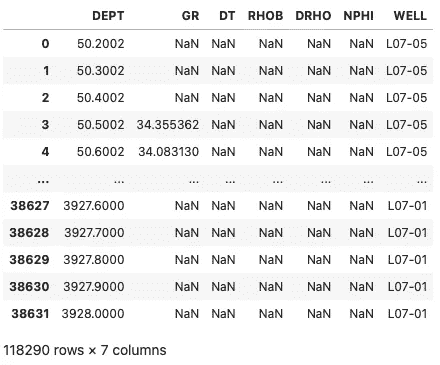
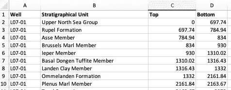
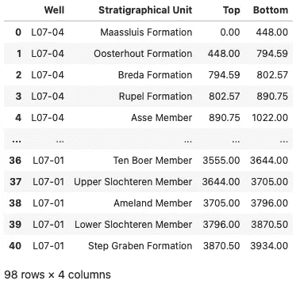
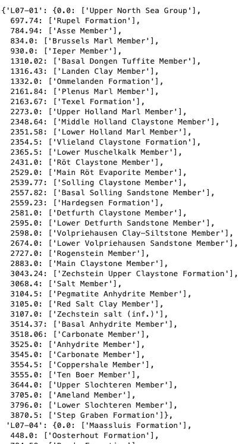
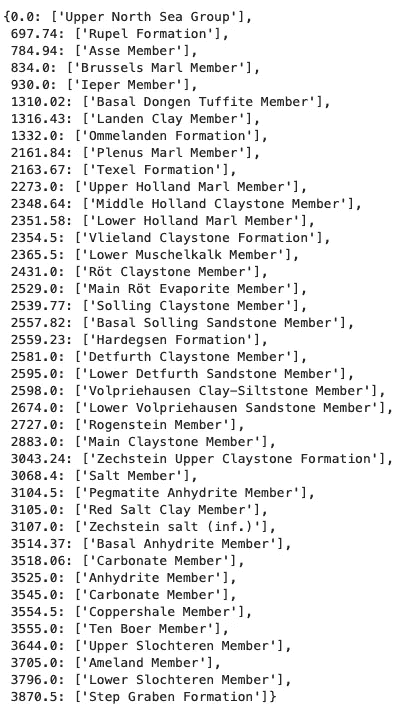
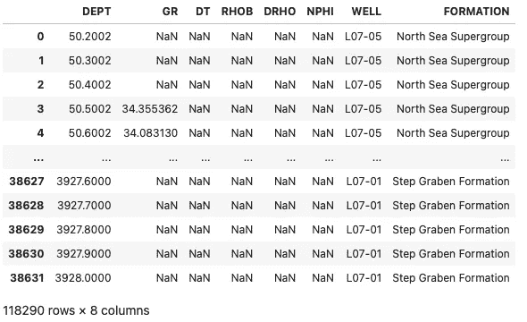
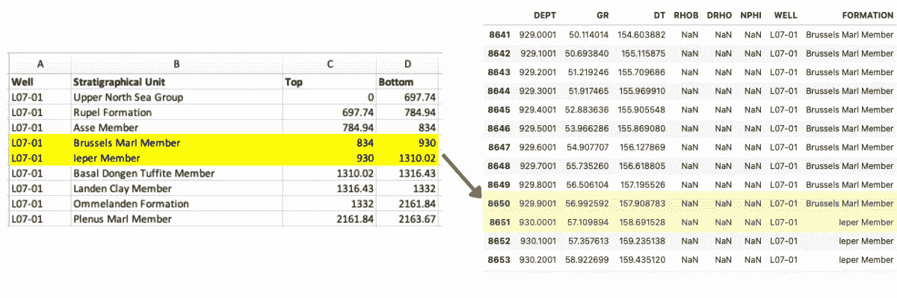

# 用 Python 创建多井综合测井和地层顶部数据框架

> 原文：<https://towardsdatascience.com/creating-an-multi-well-integrated-well-log-and-formation-tops-dataframe-in-python-469670550aaf>

## 在 Python 中结合多口井的地层数据和测井测量


照片由 Quintin Gellar 拍摄:[https://www . pexels . com/photo/rock-formation-wallpaper-612893/](https://www.pexels.com/photo/rock-formation-wallpaper-612893/)

当处理测井测量和地下数据时，我们经常要处理不同的文件格式和采样率。例如，测井记录测量值通常在内存储和传输。las 文件或 [**dlis 文件**](/loading-well-log-data-from-dlis-using-python-9d48df9a23e2) 并且每 0.1 米或 0.5 英尺采样一次。另一方面，地质构造顶部是单个离散深度点。这需要对地层数据进行插值，以匹配测井测量的采样率。

[**在我之前的教程**](https://medium.com/p/8c29589ec132) 中，我们看到了如何合并单井的测井数据和地层数据。在本教程中，我们将了解如何对多口井进行此操作。

# 导入库

该过程的第一步是导入我们将使用的库。

对于本教程，我们将使用 [**lasio**](https://lasio.readthedocs.io) 来加载。las 文件， [**os**](https://docs.python.org/3/library/os.html) 从目录中读取文件， [**熊猫**](https://pandas.pydata.org) 使我们能够处理数据帧， [**csv**](https://docs.python.org/3/library/csv.html) 加载 csv 文件中存储的地层数据。

# 使用 LASIO 导入测井 LAS 文件

接下来，我们将开始导入数据。

本教程中使用的数据是从 [**NLOG.nl**](https://www.nlog.nl/en/welcome-nlog) 下载的，该网站包含北海整个荷兰区块的测井数据。这些数据可以免费下载和使用。数据许可证的全部细节可在 [**此处**](https://www.nlog.nl/en/disclaimer) 找到，但此处提供了知识产权部分的使用摘要:

> NLOG。NL 对本网站上或通过本网站提供的信息不主张任何权利(域名、商标权、专利和其他知识产权除外)。未经 NLOG 事先书面许可，用户可以复制、下载和以任何方式披露、分发或简化本网站提供的信息。NL 或有权方的合法同意。如果提供 NLOG，用户也可以复制、复制、处理或编辑信息和/或布局。引用 NL 作为来源。

从[**nlog . nl**](https://www.nlog.nl/en/welcome-nlog)**网站，我们将使用三口井的数据:L07–01、L07–05 和 L07–04。**

**当加载单个文件时，我们可以很容易地将文件位置传递给`lasio.read()`函数。然而，由于我们正在与多个。las 文件，我们需要分别读取它们，并将它们一起添加到一个列表中。**

**然后使用`pd.concat()`将存储在该列表中的数据帧连接在一起。**

**下面的代码将读取所有以。阿联在一个名为`Data/Notebook 36`的目录内。**

**一旦获得了完整的文件名(第 8 行),它将与存储它的目录路径结合起来。然后 las 文件被读取(第 11 行)并被转换成一个 [**熊猫数据帧**](https://pandas.pydata.org/docs/reference/api/pandas.DataFrame.html) (第 12 行)。**

**为了区分数据来自哪口井，我们可以在 dataframe 中添加一个名为`WELL`的新列。其值将被设置为 las 文件的井标题部分中包含的井名称(第 15–16 行)。**

**用 [**LASIO**](https://lasio.readthedocs.io/en/latest/) 加载文件并将其转换为数据帧时，数据帧的索引将被设置为深度曲线。我们可以改变这一点，使我们有一个简单的整数索引和深度作为数据帧中的实际列。这是通过使用 pandas 中的`.reset_index()`函数实现的(第 19 行)。**

**接下来，我们需要对数据帧进行排序，使其从最浅的深度测量到最深的深度测量(第 20 行)。这样做会打乱索引的顺序，所以我们需要再次重置索引，但是这一次，我们不希望索引转换成列(第 20 行),所以我们需要将`drop`参数设置为 True。**

**一旦数据帧被排序，我们就可以把它添加到我们的数据帧列表中:`df_list`(第 21 行)。**

**重复这个过程，直到所有可用。las 文件已在指定目录中读取。**

**最后，使用`pd.concat()`(第 24 行)将存储在列表中的数据帧连接在一起。**

**当我们调用`well_df` dataframe 时，我们得到了前 5 行和后 5 行的视图。**

****

**加载多个后的数据帧内容。las 文件，并将它们连接成一个数据帧。图片由作者提供。**

## **从 CSV 加载地层顶部数据**

**地层顶部数据通常以表格形式存储，最常见的是。csv 文件。这些文件将包含地质构造的名称，以及相关的顶部和底部深度。**

****

**csv 文件中存储的地层数据示例。图片由作者提供。**

**本例的 csv 文件已经有一个名为 Well 的列，其中包含了井的名称。在将它们加载到 Python 之前做这些是有帮助的，但不是必需的。如果不这样做，您可能需要从文件名中提取井名，这可能会更加耗时。**

**在下面的代码示例中，我们再次创建一个空白列表(第 2 行)来存储数据帧。**

**接下来，我们遍历所有以。csv 文件并使用`pd.read_csv()`读取它们，然后将它们添加到名为`df_formation_list`的列表中**

**一旦所有文件都被读取，我们就可以调用`pd.concat()`将数据帧连接在一起。**

**当我们调用`formations_df`数据帧时，我们得到以下视图:**

****

**存储在多口井的 pandas 数据框架中的地层数据。图片由作者提供。**

## **创建地层数据字典**

**既然我们在一个简单的 pandas 数据帧中有了这些信息，我们现在需要将这个数据帧转换成一个嵌套的字典。**

**这使得合并两个数据集的过程更加容易，并允许我们创建一个连续的列，其中包含每个深度级别的地层名称。**

**我们可以通过使用字典理解来做到这一点。**

**一旦我们运行了上面的代码，我们就可以调用`formations_dict`,并返回下面的结果。**

****

**地层名称和深度的嵌套词典。图片由作者提供。**

**从中我们可以看到，主键是井名，在每个井内我们都有一个子字典，深度作为键，地层名作为值。**

**你可能想知道为什么我们使用深度作为关键字，而不是地层名称。这样做将允许我们检查我们当前所处的深度(在我们将在下一节讨论的循环中)是否在两个键之间。如果是，那么我们可以简单地得到编队名称。**

**如果我们想查看特定井的顶部，我们可以在字典调用中调用特定的井，如下所示:**

```
formations_dict['L07-01']
```

**这将返回该特定井的地层数据:**

****

**特定井的地层深度和名称。图片由作者提供。**

# **将地层数据与测井数据合并**

**现在，处理和设置已经完成，我们可以继续将地层顶部字典与测井数据框架集成。**

**为此，我们将使用以下函数。**

**该函数首先获取传入的井(`well_name`)地层的深度(键来自`formations_dict`)。**

**然后，我们需要捕捉一些边缘情况。**

**首先，我们需要看看我们是否处于队形字典中的最后一个队形。如果是，那么我们将设置一个标志`at_last_formation`为真，否则，我们将创建一个名为`below`的新变量，它将是当前深度(`depth`)以下最近的地层深度。**

**接下来，我们需要看看我们是否在字典中的第一个结构(第 12-17 行)。在这种情况下，我们正在检查在列出的第一个地层之上是否有任何深度值。如果我们只有特定深度的地层而不是表面的地层，这种情况就会发生。如果当前深度高于(浅于)第一个地层深度，那么我们将把地层名称设置为一个空字符串(第 19–20 行)。否则，我们将从当前深度以上获得地层的深度值。**

**最后，我们需要检查当前深度值在地层深度中的位置。如果我们不这样做，那么就不会设置正确的编队名称。如果当前深度等于地层字典中包含的深度，那么我们将把它设置为所列深度的地层名称。**

**一旦编写了函数，我们可以在 pandas 中使用`apply`方法调用它。这允许我们迭代数据帧中的每一行。**

**当我们调用`well_df`时，我们得到数据帧的如下视图:**

****

**包含测井数据和地层数据的组合数据框架结果。图片由作者提供。**

# **检查最终结果**

**当做这样的事情时，近距离检查结果是很重要的。例如，我们可以检查其中一口井的结果，在我们预期地层变化的深度之间。**

**我们可以这样做。**

****

**pandas 数据帧中的地层数据和 csv 文件中的原始数据特写。图片由作者提供。**

**在上面的原始地层 tops csv 文件中，我们可以看到布鲁塞尔泥灰岩段和 Ieper 段之间的过渡发生在 930 英尺处。这发生在组合数据帧内的同一点。**

**这有助于我们获得信心，相信这个过程是有效的。**

**可以肯定的是，以这种方式检查多口井和井段，或者通过生成测井曲线，总是明智的。**

# **摘要**

**在 Python 中，整合多口井的测井数据和地层数据是一项挑战。在这篇短文中，我们看到了如何加载多个 las 文件和地层数据文件，并将它们组合成一个数据帧。**

**这将允许我们将地层数据和测井数据集成到机器学习模型或测井显示中。**

**如果您想处理单井，请务必查看以下文章:**

**[](/combining-formation-data-with-well-log-measurements-in-pandas-8c29589ec132) ** 

***感谢阅读。在你走之前，你一定要订阅我的内容，把我的文章放到你的收件箱里。* [***你可以在这里做！***](https://andymcdonaldgeo.medium.com/subscribe)**或者，您也可以* [***注册我的简讯***](https://fabulous-founder-2965.ck.page/2ca286e572) *免费将更多内容直接发送到您的收件箱。****

***其次，通过注册会员，你可以获得完整的媒介体验，并支持我和其他成千上万的作家。每月只需花费你 5 美元，你就可以接触到所有精彩的媒体文章，也有机会通过写作赚钱。如果你用 [***我的链接***](https://andymcdonaldgeo.medium.com/membership)**报名，你直接用你的一部分费用支持我，不会多花你多少钱。如果你这样做了，非常感谢你的支持！*****