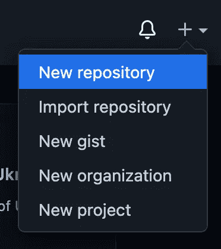
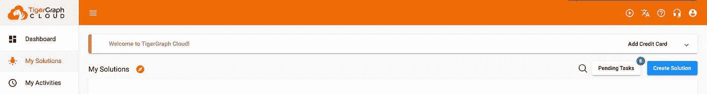
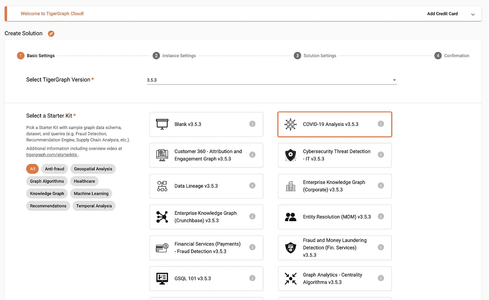
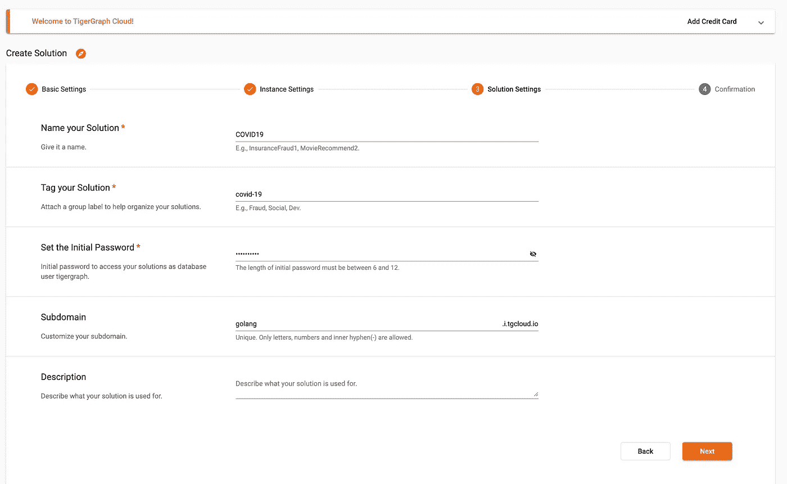

# 创建和部署您的第一个 Go 包

> 原文：<https://towardsdatascience.com/creating-and-deploying-your-first-go-package-eae220905745>

## 创建 TigerGraph 包装器 Go 库的分步指南


图片来自 [Pixabay](https://pixabay.com/photos/space-wood-deliver-logistics-4967335/)

# 概观

## 介绍

最近，我决定学习一门新的语言:Go，也叫 Golang，是 Google 创造的。这种语言因其高级和易于理解的语法而广受欢迎。为了开始学习这门语言，我决定为 TigerGraph 创建一个 Go 库。在这篇博客中，我将一步一步地向您介绍如何创建和部署一个 Go 库来连接 GSQL。

## 目标

读完这篇博客，你会学到:

*   如何创建 Go 库
*   如何在 Go 中与 TigerGraph 交互

## 工具

制作 Go 库所需的工具:

*   [Go](https://go.dev/learn/) (可以通过[自制](https://brew.sh/)安装在 Linux/Mac 上)
*   GitHub :你将需要一个地方来托管你的项目，本教程将使用 GitHub。

该示例项目所需的工具(TigerGraph Go 库):

*   [TigerGraph 云账户](https://tgcloud.io/)

## 概述

*   第一部分:初始化 Go 项目
*   第二部分:创建包—从 Go 查询 TigerGraph
*   第三部分:部署包
*   第四部分:在项目中使用包
*   第五部分:结论、资源和后续步骤

# 第一部分:初始化 Go 项目

## 步骤 1:创建 GitHub 存储库

当你初始化 Go 项目时，它会提示你把它放在某个地方。在 GitHub 上，创建一个新的空存储库。



创建新的存储库

按照您喜欢的方式配置设置。(请注意，如果项目是私有的，请确保终端可以通过特殊的身份验证或 SSH 密钥来访问代码。)在创建 Go 项目时，您需要从存储库中获得 URL(开头没有 https://)。URL 的格式如下所示:

```
github.com/USERNAME/REPO_NAME
```

例如，我的示例项目 URL 是:

```
github.com/GenericP3rson/GoSamplePackage
```

一旦完成，您就可以在您的机器上打开终端来创建您的项目。

## 第二步:创建并初始化项目

首先，您需要用 Go 代码创建一个目录。

```
mkdir GoSamplePackage && cd GoSamplePackage
```

接下来，使用第一步中的 GitHub URL 初始化 Go 项目。

> 注意:如果你没有安装 Go，你可以用`brew install go`来安装，或者用`brew upgrade go`来更新。

```
go mod init github.com/USERNAME/REPO_NAME
```

同样，对于我的示例，这将是:

```
go mod init github.com/GenericP3rson/GoSamplePackage
```

这将创建一个`go.mod`文件，其中将包含您刚才写的 URL 和您的 Go 版本。

最后，创建一个用于编写 Go 包的文件。

```
touch GoSamplePackage.go
```

在新 Go 文件的顶部，指出你的库的包名。

```
package GoSamplePackage
```

这样，您就可以编辑 Go 文件来创建您的包。

# 第二部分:创建包—从 Go 查询 TigerGraph

## 第一步:建立解决方案

首先，在 [TG Cloud](https://tgcloud.io/) 上创建一个 TigerGraph 解决方案。在那里，导航到“我的解决方案”选项卡，然后按蓝色的“创建解决方案”按钮。



选择“我的解决方案”,然后按“创建解决方案”

在第一页上，选择任何初学者工具包。我决定从新冠肺炎解决方案开始。



选择任何初学者工具包

第二页保持原样；这将建立一个免费的 TigerGraph 实例。在第三页上，适当地配置解决方案。



适当配置设置

> 注意:请记住您的子域和初始密码！

最后，在最后一页，验证所有信息都是正确的，然后按“提交”！您需要给解决方案几分钟时间来启动。

## 步骤二:在 Go 中创建一个 GET 请求函数

使用解决方案设置，我创建了一个到/echo 端点的查询。TigerGraph 内置端点的完整文档可以在[这里](https://docs.tigergraph.com/tigergraph-server/current/api/built-in-endpoints)找到。

[](https://docs.tigergraph.com/tigergraph-server/current/api/built-in-endpoints) [## 内置端点- TigerGraph 服务器

### 这些端点是简单的诊断实用程序，如果 RESTPP 服务器启动，它们会响应以下消息…

docs.tigergraph.com](https://docs.tigergraph.com/tigergraph-server/current/api/built-in-endpoints) 

我创建的 Go 函数接受两个参数，子域(主机)和令牌。

> 注意:所有函数名都必须以大写字母开头，否则将不起作用。

```
func Echo(Host string, Token string) string {}
```

接下来，我创建了对端点的 GET 请求。

```
req, err := http.NewRequest("GET", "https://"+Host+".i.tgcloud.io:9000/echo", nil)if err != nil { return err.Error() } req.Header.Set("Authorization", "Bearer "+Token)response, err := client.Do(req)if err != nil { return err.Error() }
```

最后，我读取正文并解析结果，返回“message”字段。

```
body, err := ioutil.ReadAll(response.Body)if err != nil { return err.Error() } sb := string(body)response.Body.Close() map[string]interface{}
json.Unmarshal([]byte(sb), &jsonMap) mess := jsonMap["message"] return fmt.Sprintf("%v", mess) 
```

要导入所有必需的模块，请运行:

```
go mod tidy
```

在这里找到完整的代码。

[](https://github.com/GenericP3rson/GoSamplePackage/blob/master/GoSamplePackage.go) [## GoSamplePackage/GoSamplePackage . go at master generic 3 rson/GoSamplePackage

### 此文件包含双向 Unicode 文本，其解释或编译可能与下面显示的不同…

github.com](https://github.com/GenericP3rson/GoSamplePackage/blob/master/GoSamplePackage.go) 

这是您可以创建的函数的一个例子，但是天空是创建包的极限。一旦您满意了，您就可以继续部署代码了。

# 第三部分:部署包

## 第一步:连接 GitHub 并提交代码

最后，你已经准备好向全世界展示你的努力成果了！首先，添加并提交刚刚创建的代码。

```
git add .git commit -m"First commit of my new Go package"
```

接下来，连接到 GitHub 存储库。

```
git remote add origin https://github.com/USERNAME/REPO_NAME.git
```

在上面的示例中，这将是:

```
git remote add origin https://github.com/GenericP3rson/GoSamplePackage.git
```

最后，将变更推送到您的存储库中。

```
git push origin master
```

## 第二步:创建新版本

接下来，使用 git 标记版本，以便用户使用特定的版本。

```
git tag v0.0.1
```

关于如何最好地决定版本，请查看[语义版本](https://semver.org/)指南。

 [## 语义版本 2.0.0

### 给定主要版本号。补丁，增加:主要版本当你做不兼容的 API 改变，次要…

semver.org](https://semver.org/) 

分配一个版本后，将其推送到存储库。

```
git push origin v0.0.1
```

完美！您的包现在可以供全世界使用了！

# 第四部分:在项目中使用包

## 第一步:创建另一个 Go 项目

现在让我们看看如何将这个包集成到一个 go 项目中。首先，创建一个新的 Go 项目，类似于从头开始的说明。

```
mkdir GoTest && cd GoTest
```

这一次，在初始化代码时，您可以将宿主位置设置为几乎任何位置，因为您可能不会立即宿主项目。

```
go mod init test/GoTest
```

再次为主要的 Go 代码创建一个文件。

```
touch index.go
```

## 第二步:导入库并运行函数

在“Go”页面中，创建基本 Go 程序的大纲。

```
package main

import "fmt"

func main() {
    fmt.Println("Testing my awesome library!")
}
```

更改导入以包含您的库的 URL，即您在开始时创建的 URL。

```
import ( "fmt" "github.com/USERNAME/REPO_NAME")
```

在本例中是:

```
import ( "fmt" "github.com/GenericP3rson/GoSamplePackage")
```

接下来，在 main 函数中，调用包中的任何一个函数。

```
func main() {
    fmt.Println(PACKAGE_NAME.FUNCTION_NAME(PARAMS))
}
```

在我的情况下，我会从 GoSamplePackage 调用 Echo。此外，我将根据图形传递两个参数。

```
func main() {
    fmt.Println(GoSamplePackage.Echo("golang", "TOKEN"))
}
```

## 第三步:导入包并运行程序

最后，为了导入模块，再次运行:

```
go mod tidy
```

这将下载软件包的最新版本，并将其添加到`go.mod`。最后，使用以下命令运行程序:

```
go run .
```

一旦执行，结果应该是`Hello GSQL`。太棒了。包装器开始工作了！

# 第五部分:结论、资源和后续步骤

厉害！读完这篇文章后，你已经正式创建了你的第一个 Go 包！您可以继续扩展，添加其他功能和端点，并发布新版本。

Go 和 DigitalOcean 为围棋初学者提供了几个方便的资源，对学习这门语言非常有帮助。

[](https://go.dev/learn/) [## 入门——Go 编程语言

### 爱沙尼亚塔林，2022 年 5 月 23 日这是一个为对 Go 编程语言感兴趣的人成立的团体。所有有志…

go.dev](https://go.dev/learn/) [](https://go.dev/doc/tutorial/getting-started) [## 教程:Go - The Go 编程语言入门

### 在本教程中，你将得到一个关于围棋编程的简要介绍。在此过程中，您将:

go.dev](https://go.dev/doc/tutorial/getting-started) [](https://www.digitalocean.com/community/tutorials/how-to-write-packages-in-go) [## 如何在 Go | DigitalOcean 中编写包

### 一个包是由 Go 文件组成的，这些文件位于同一个目录中，并且在开头有相同的 package 语句…

www.digitalocean.com](https://www.digitalocean.com/community/tutorials/how-to-write-packages-in-go) 

最后，如果您对该图感兴趣，请随时加入 TigerGraph 社区，参与令人惊叹的项目并与其他开发人员聊天。

[](https://discord.gg/DMHabbX3BA) [## 加入 TigerGraph Discord 服务器！

### 查看 Discord 上的 TigerGraph 社区-与 1，280 名其他成员一起玩，享受免费的语音和文本聊天。

不和谐. gg](https://discord.gg/DMHabbX3BA) 

如果你想了解这个项目的完整代码，请点击这里查看。

[](https://github.com/GenericP3rson/GoSamplePackage) [## GitHub-generic 3 rson/GoSamplePackage

### 此时您不能执行该操作。您已使用另一个标签页或窗口登录。您已在另一个选项卡中注销，或者…

github.com](https://github.com/GenericP3rson/GoSamplePackage) 

> 注:除特别注明外，所有图片均由作者创作。