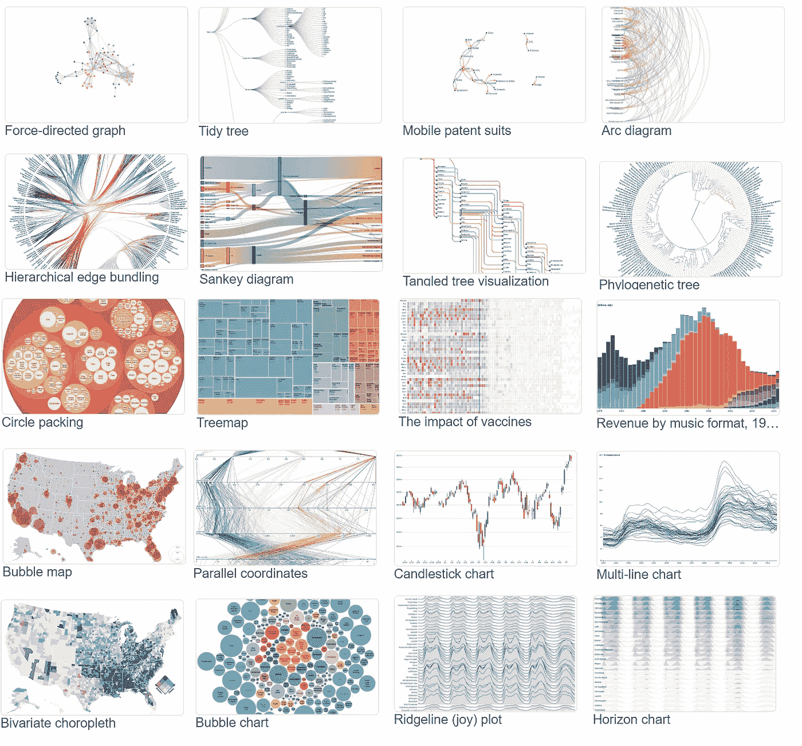
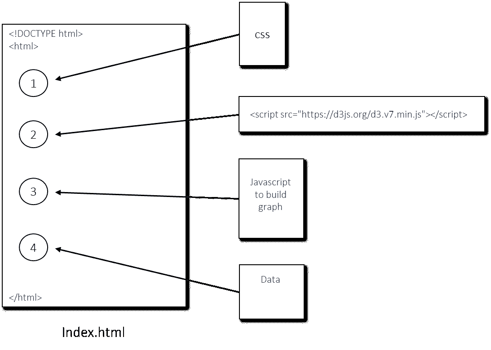
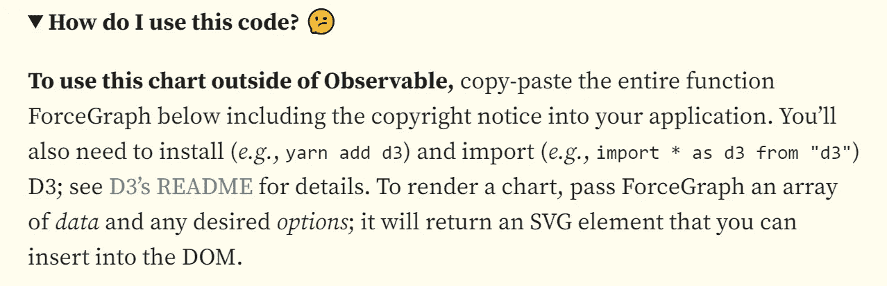
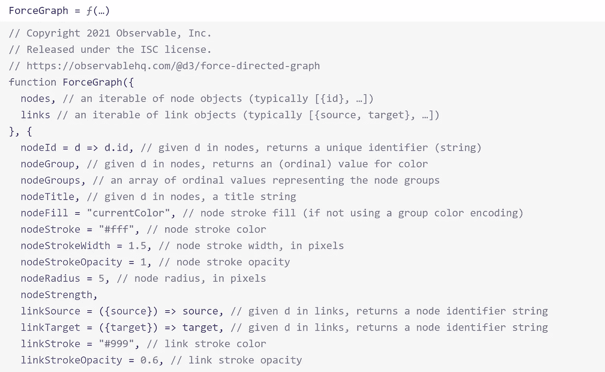
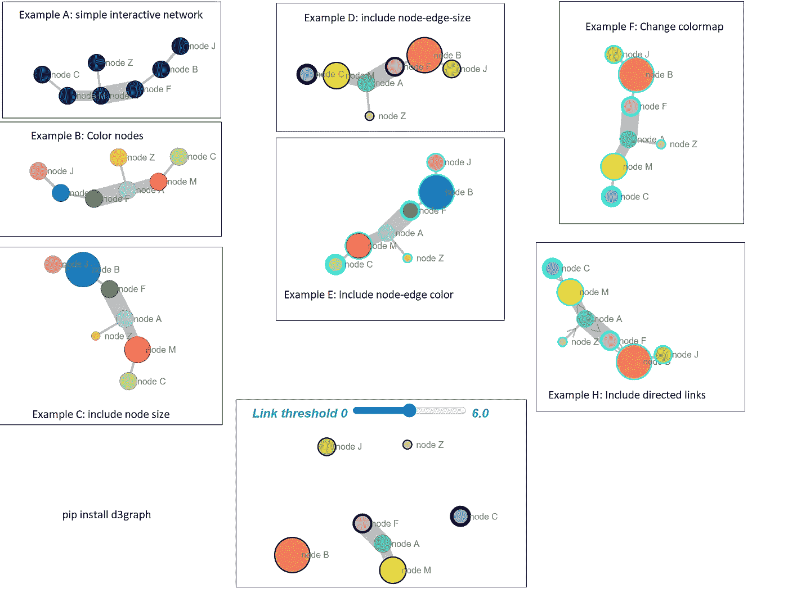

# 使用 Python 创建漂亮的独立交互式 D3 图表

> 原文：<https://towardsdatascience.com/creating-beautiful-stand-alone-interactive-d3-charts-with-python-804117cb95a7>

## *应用于 D3 力有向网络图*



截图来自:【https://d3js.org/ 

可视化数据可能是项目成功的关键，因为它可以揭示数据中隐藏的见解，并增进理解。说服人们的最好方法是让他们看到自己的数据并与之互动。尽管 Python 中提供了许多可视化包，但制作漂亮的独立交互式图表并不总是那么简单，这些图表也可以在您自己的机器之外工作。D3 的主要优势在于它符合 web 标准，因此除了浏览器之外，你不需要任何其他技术来使用 D3。重要的是，互动图表不仅有助于*告诉*读者一些东西，还能让读者看到、参与和提问。在这篇博客中，我将概述如何使用 Python 构建你自己的独立的、交互式的力导向 D3 网络。 注意步骤与任何其他 D3 图表相似。如果你需要工作版本， [*d3graph* 库](https://erdogant.github.io/d3graph)就是给你的！

*如果你觉得这篇文章很有帮助，可以使用我的* [*推荐链接*](https://medium.com/@erdogant/membership) *继续无限制学习，并注册成为中级会员。另外，* [*关注我*](http://erdogant.medium.com) *关注我的最新内容！*

# 使用 D3 的动机

D3 是*数据驱动文档的缩写，*是一个 JavaScript 库，用于在 web 浏览器中生成动态、交互式数据可视化。它利用了可缩放矢量图形(SVG)、HTML5 和级联样式表(CSS)标准。 ***D3*** 又称 ***D3.js*** 或 ***d3js。*** 我会互换使用这些名字。在交互式 Python 解决方案上面使用 D3 的优势有很多，我来列举几个[1]；

*   D3 是一个 Javascript 库。因此，它可以用于您选择的任何 JS 框架，如 Angular.js、React.js 或 Ember.js。
*   D3 专注于数据，所以如果你在数据科学领域，数万个数据点保持交互而不需要付出任何额外的努力，这是一种解脱。
*   D3 是轻量级的，直接与 web 标准一起工作，因此速度非常快，并且可以很好地处理大型数据集。
*   D3 是开源的。因此您可以使用源代码并添加自己的特性。
*   D3 支持网络标准，所以除了浏览器，你不需要任何其他技术或插件来使用 D3。
*   D3 支持 HTML、CSS 和 SVG 等 web 标准，在 D3 上工作不需要新的学习或调试工具。
*   D3 没有提供任何特定的特性，所以它可以让你完全控制你的可视化，以你想要的方式定制它。

# D3 图表。

D3 是被设计成一起工作的模块的集合[；您可以单独使用这些模块，也可以将它们作为默认构建的一部分一起使用。D3 网站提供了](https://github.com/d3) [***168 个工作图表***](https://observablehq.com/@d3/gallery) ，允许交互过程中的性能增量更新，支持[拖动](https://observablehq.com/collection/@d3/d3-drag)、[刷](https://observablehq.com/collection/@d3/d3-brush)、[缩放](https://observablehq.com/collection/@d3/d3-zoom)等流行交互。图表可用于多种目的，例如*定量分析、可视化层次结构、创建网络图、*以及*条形图、线图、散点图、辐射图、地理投影、*和各种其他交互式可视化，用于探索性解释。一些精选的图表如图 1 所示。这些 d3js 图表的各种各样在 [*D3Blocks 库*](https://d3blocks.github.io/d3blocks/) *中很容易被 python 化。*阅读 [*D3Blocks* 中型文章](/d3blocks-the-python-library-to-create-interactive-and-standalone-d3js-charts-3dda98ce97d4)了解更多详情。


图 1:D3 图表的各种例子。截图来自[https://d3js.org/](https://d3js.org/)

# 入门！

让我们开始我们的 D3-Python 项目吧！在我们迈向 python 化 D3 图表之前，我们需要理解 D3 是如何工作的。我将通过在 D3 中创建一个非常小的力导向网络图(没有 Python)来演示它，之后，我将演示 Python 中的集成。解释 D3 图表发展的最好方法是将发展分成四个不同的部分；

1.  *层叠样式表(CSS)。*
2.  *D3 模块包含所有需要的库。*
3.  *Javascript 构建图表。*
4.  *数据为 JSON 文件。*

图表中的每个部分都有自己的角色，为了得到一个工作版本，我们需要连接所有部分，这可以在一个 HTML 文件中完成，如图 2 所示。在接下来的部分中，我将描述每个部分的作用和实现。



图 2:在一个最终的 HTML 文件中，四个部分被连接起来以构建 D3 图。图片来自作者。

## 1.级联样式表(CSS)

CSS 文件是一种简单的机制，用于以结构化的方式向 HTML 文件添加样式。例如，CSS 文件可以定义 HTML 元素的*大小、颜色、字体、行距、缩进、边框和位置*。我们将创建强制定向网络图，为此我们将定义整体字体大小、字体系列、样式、颜色以及特定于节点和边的属性。您可以相应地更改 CSS，并设置您认为最好的属性。我创建的文件可以在[这里](https://erdogant.github.io/datasets/d3js/style.css)下载，看起来如下:

级联样式表(CSS)

## 2.D3 模块

D3 模块是最简单的部分，因为您只需要导入它或将整个内容嵌入到最终的 HTML 文件中。D3 模块包含了创建任何图表的所有函数。不需要对该文件进行编辑。最新版本是 ***v7*** ，可以从本地资源或网站导入。

```
<script src="https://d3js.org/d3.v7.min.js"></script>
```

我将使用稍微老一点的版本( *v3* )，因为我已经用这个版本创建了很多脚本。可以在这里[下载](https://erdogant.github.io/datasets/d3js/d3.v3.js)，它包含在我下面几个步骤的示例代码中。如果您构建自己的图形，我强烈建议使用最新版本。

## 3.构建图表的 Javascript。

构建图表不需要您从头开始编码。我们可以在 [D3 网站](https://d3js.org)上找到感兴趣的图表，并使用开源代码。让我们转到[强制导向图页面](https://observablehq.com/@d3/force-directed-graph)并阅读“ ***我如何使用这段代码？*** 。描述如下:



图 3:截图来自[https://observablehq.com/@d3/force-directed-graph](https://observablehq.com/@d3/force-directed-graph)。

它告诉我们复制粘贴整个" *ForceGraph* "函数，如下图所示。我创建了另一个截图(图 4)，你可以看到“*函数 Forcegraph({* )的一部分，这就是 *ForceGraph 函数*。您需要复制整个函数并将其粘贴到一个新文件中。我将我的文件命名为***D3 graph script . js***，可以在这里下载[。请注意，我的函数与这里显示的最新函数略有不同。该网站还告诉我们导入 D3 模块，我们在前面的部分中已经介绍过了。](https://erdogant.github.io/datasets/d3js/d3graphscript.js)



图 4:部分 ForceGraph 代码。截图摘自:[https://observablehq.com/@d3/force-directed-graph](https://observablehq.com/@d3/force-directed-graph)。

## 4.数据

图表的燃料是我们需要得到正确形状的数据。尽管 D3 有导入本地文件的功能。使用`d3.json()`的 json-file，它可能无法工作，因为导入带有 D3 的本地 *csv* 或 *json* 文件被认为不安全。一种解决方案是将数据直接嵌入到最终的 HTML 文件中。但是，根据数据量的不同，它可能会产生大量的 HTML 文件。然而，将数据直接嵌入到 HTML 中会将所有脚本和数据集成到一个文件中，这非常实用。下面的方框显示了一个 *json 数据文件*的例子，其中描述了一些节点和边。我们可以在 HTML 中嵌入这样的数据块。完整的 *json 数据*文件可以从[这里](https://erdogant.github.io/datasets/d3js/json_data.json)下载。

```
graph = {"links":[{"node_weight":5,"edge_weight":5,"edge_width":20,"source_label":"node_A","target_label":"node_F","source":0,"target":2},{"node_weight":3,"edge_weight":3,"edge_width":12,"source_label":"node_A","target_label":"node_M","source":0,"target":4}"]}
```

## 5.连接零件

我们现在有了构建图表所需的四个部分( *CSS、D3、javascript 图形和数据)*。我创建了一个 HTML 样板文件，其中的四个部分将被连接起来；下载了[这里](https://erdogant.github.io/datasets/d3js/index.html.j2)。这些零件包括如下:

1.  *层叠样式表*为[***Style . CSS***](https://erdogant.github.io/datasets/d3js/style.css)
2.  *D3 模块*为[***D3 . v3 . js***](https://erdogant.github.io/datasets/d3js/d3.v3.js)
3.  将 *javascript* 构建为[***D3 graphscript . js***](https://erdogant.github.io/datasets/d3js/d3graphscript.js)
4.  *数据*为[***JSON _ Data***](https://erdogant.github.io/datasets/d3js/json_data.json)

要创建最终的 HTML，您可以替换每个文件中包含它的行上的内容。或者换句话说，用[***style . CSS***](https://erdogant.github.io/datasets/d3js/style.css)中的内容替换 ** 以此类推。你会得到一张[看起来像这样](https://erdogant.github.io/datasets/d3js/d3forcedirected.html)的工作图。检查页面源代码或下面的脚本，查看四个部分的组合。*就是这样！你在 D3 中创建了一个有向力网络图！因为我们创建了四个构建模块，所以在 Python* 中集成这个图是一小步。

制作力定向图的最终 HTML。[在这里下载](https://gist.github.com/erdogant/35aa04ed1bde5c92f08d922a9e832d90)，粘贴到一个纯文本文件中，去掉标签<！- TEXT - >，并重命名(如 forcedirected.html)。双击它。

# 把 D3 变成 Python

Pythonize 化 D3 脚本的步骤是将*静态值改为变量。*我们可以为*最终 HTML* 文件和*强制定向 javascript 文件*中的属性执行此操作。想法如下:

1.  使用 Python 导入/读取最终的 HTML 和/或 javascript 文件。
2.  使用 Python 将变量替换为任何所需的值。
3.  将最终调整后的 HTML 文件写入磁盘。

但是首先，我们需要在最终的 HTML 中将静态值手动更改为变量名。让我们把*的宽度、高度、电荷、距离、方向和碰撞*转换成*变量*。创建唯一的变量名以避免意外的错误替换是很重要的。我的解决方案是创建变量名，如 *{{ width }}* ，现在可以很容易地在 Python 中找到并替换为真实值。除了*最终 HTML 文件*和 *javascript 图形文件*之外， *json 数据文件*也包含可以相应更改的变量。注意 *D3 模块*将保持不变。在开始实现所有这些之前，请阅读下一节！

值被转换成变量的 HTML 文件。

# D3 图形库

[*d3graph* 库](https://erdogant.github.io/d3graph)的设计方式与以上章节所述类似。这是一个 Python 库，构建于 D3 之上，创建了一个独立的、交互式的力导向网络图。输入数据是邻接矩阵，其中列和索引是节点，值为 1 或更大的元素被视为边。输出是一个包含交互式力定向图的 HTML 文件。[这里的](https://erdogant.github.io/docs/d3graph/titanic_example/index.html)是泰坦尼克号使用案例中的网络演示。我的 D3 版本有一些扩展，其中一个滑块可以根据边值断开网络的边，双击一个节点会高亮显示该节点及其连接的边。要制作自己的网络图， [pip 安装 *d3graph*](https://erdogant.github.io/d3graph) 包，其中包含:

`pip install d3graph`

现在，您可以使用各种参数创建交互式网络:



图 5:使用 d3graph 创建的各种图表。图片由作者提供。

# 最后的话

恭喜你！你刚刚学习了如何创建漂亮的 D3 图表，特别是使用 D3 的力定向网络，以及如何将它集成到 Python 中。我希望这个博客能给你创建任何你想要的 D3 图表所需要的知识，不管有没有 Python。[*D3 图形库*](https://erdogant.github.io/d3graph) 将帮助你使用 Python 创建自己的 D3 力定向图。输出是一个单独的 HTML 文件，可以独立工作，可以共享或发布在网站上，除了浏览器，你不需要任何其他技术。您还可以将 D3 网络图作为可视化集成到您现有的库中。[阅读这篇关于我如何为](/explore-and-understand-your-data-with-a-network-of-significant-associations-9a03cf79d254) [*HNet 库*](https://erdogant.github.io/hnet) 学习联想的博客。如果您想创建其他 d3js 图表，如*散点图、小提琴图、移动气泡图、桑基图、热图、和弦、时间序列、Imageslider 或粒子图*，我们创建了 [*D3Blocks 库*](https://d3blocks.github.io/d3blocks/) ，其中包含 10 个可以用 Python 创建的漂亮图表。阅读 [*D3Blocks* 中帖【2】](/d3blocks-the-python-library-to-create-interactive-and-standalone-d3js-charts-3dda98ce97d4)了解更多详情。*随意摆弄库，叉源代码。*

注意安全。保持冷静。

***干杯，E.***

*如果你觉得这篇文章很有帮助，可以使用我的* [*推荐链接*](https://medium.com/@erdogant/membership) *继续无限制学习，并注册成为中级会员。另外，* [*关注我*](http://erdogant.medium.com) *关注我的最新内容！*

## 软件

*   [D3 图形库](https://erdogant.github.io/d3graph)
*   [HNet 媒体博客](/explore-and-understand-your-data-with-a-network-of-significant-associations-9a03cf79d254)
*   [HNet 库](https://erdogant.github.io/hnet)
*   [D3Blocks 库](https://d3blocks.github.io/d3blocks/)

## 我们连线吧！

*   [让我们在 LinkedIn 上联系](https://www.linkedin.com/in/erdogant/)
*   [在 Github 上关注我](https://github.com/erdogant)
*   [跟随我在媒体上](https://erdogant.medium.com/)

## 参考

1.  [https://www.tutorialsteacher.com/d3js](https://www.tutorialsteacher.com/d3js)
2.  E.Taskesen， [*D3Blocks:创建交互式和独立 D3js 图表的 Python 库*](/d3blocks-the-python-library-to-create-interactive-and-standalone-d3js-charts-3dda98ce97d4) *，* Medium，迈向数据科学，2022 年 9 月