# 用 Python 制作漂亮的地形图

> 原文：<https://towardsdatascience.com/creating-beautiful-topography-maps-with-python-efced5507aa3>

## [实践教程](https://towardsdatascience.com/tagged/hands-on-tutorials)

# 用 Python 制作漂亮的地形图

## 当您可以用 Python 构建引人注目的 3D 地形图时，谁还需要 GIS 呢？

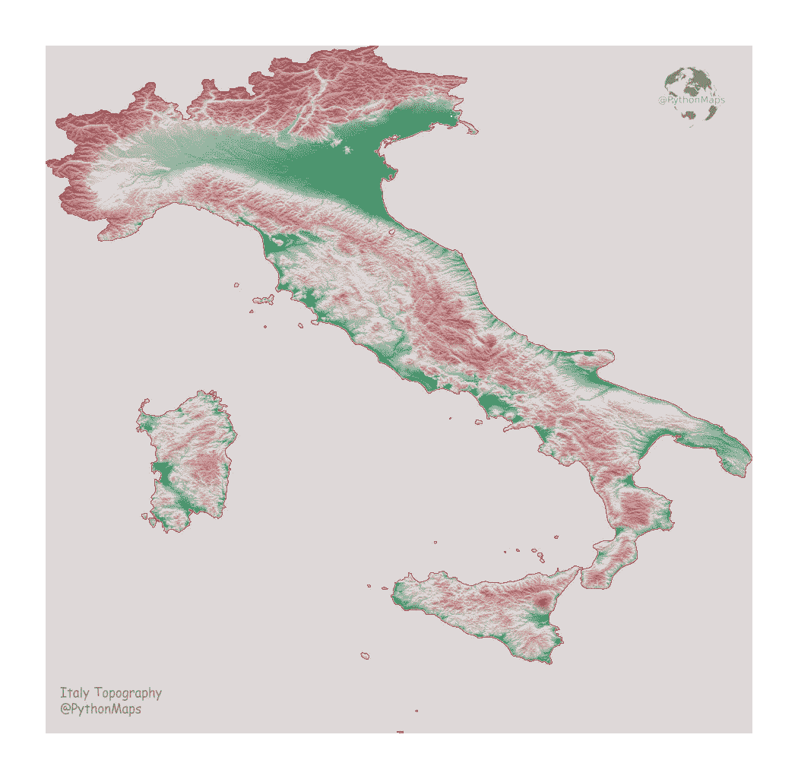

制图 twitter 目前充斥着一些引人注目的单个国家或地区的地形图。这主要是由于可用数据源的扩展和许多无聊的地理书呆子在疫情期间让自己忙碌。有很多工具和方法可以用来生成上面分享的美丽的意大利地图，但是在这篇文章中，我将使用 Python 向您展示一种非常规的方法，希望您会像我一样确信，如果某件事情值得做，就值得用 Python 来做。

有许多可用的数据源，都有不同程度的分辨率。在纯粹的美学层面上，图像的分辨率越高，最终的图像看起来就越好。从精度的角度来看，较低分辨率的数据集也可能会夸大要素，使相对平坦的区域看起来相当多山。

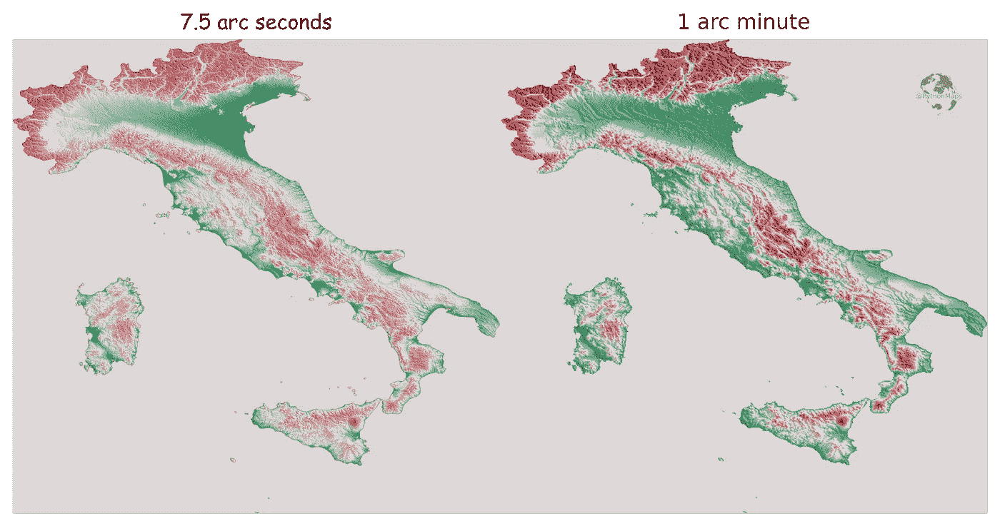

使用高分辨率(7.5 弧秒)和低分辨率(1 弧分)数据源绘制的意大利地形图。作者图片

虽然它们看起来没有什么不同，但左图使用的数据(1)比右图(2)的分辨率高得多，因此相对平坦的区域，例如意大利北部的波河流域，看起来比右图中的实际丘陵要多。因此，今后我们将使用来自美国地质调查局(1)的高分辨率数据。数据可以免费使用，关于数据使用的更多信息可以在下面的[链接](https://topotools.cr.usgs.gov/GMTED_viewer/gmted2010_fgdc_metadata.html)中找到。数据被分割成 30 x 20 度的 tif 文件，覆盖了全球的不同地区，幸运的是意大利位于其中一个文件中，所以我们不需要担心合并不同的 tif 文件，尽管我将在以后的文章中探讨这个问题。下载数据非常简单，只需点击您想要的图块，然后按照下载说明进行操作。然后把数据复制到你想编程的任何地方。

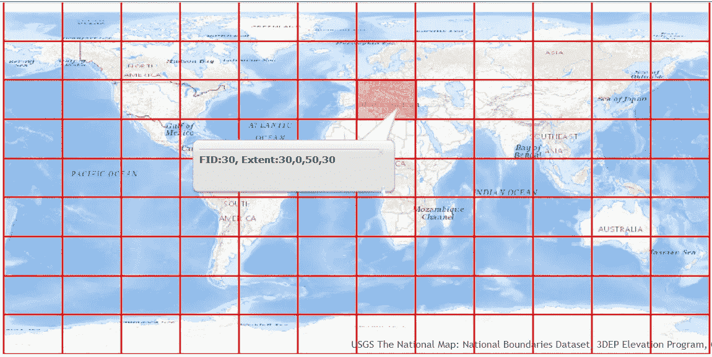

美国地质勘探局运营的数据交付平台截图。作者图片

首先要做的是使用`rasterio`打开并读取数据，这是一个相对简单的过程，但我已经包含了代码。然后，重要的是绘制数据，以了解实际情况和您正在处理的问题。有各种各样的函数可以汇总数据，但是我认为它们很少能很好地代替图表。需要注意的是，`rasterio.open`创建了一个`rasterio` 数据集对象，它包含高程值的 2D 数组(纬度 x 经度)以及关于所使用的投影和图像范围的信息，这在后面会很重要。read 方法将 rasterio 数据集对象中的数据读入高程值的 2D `numpy` 数组(在本例中)。2D 数组用于绘图，而`rasterio` 数据集对象将在以后使用。

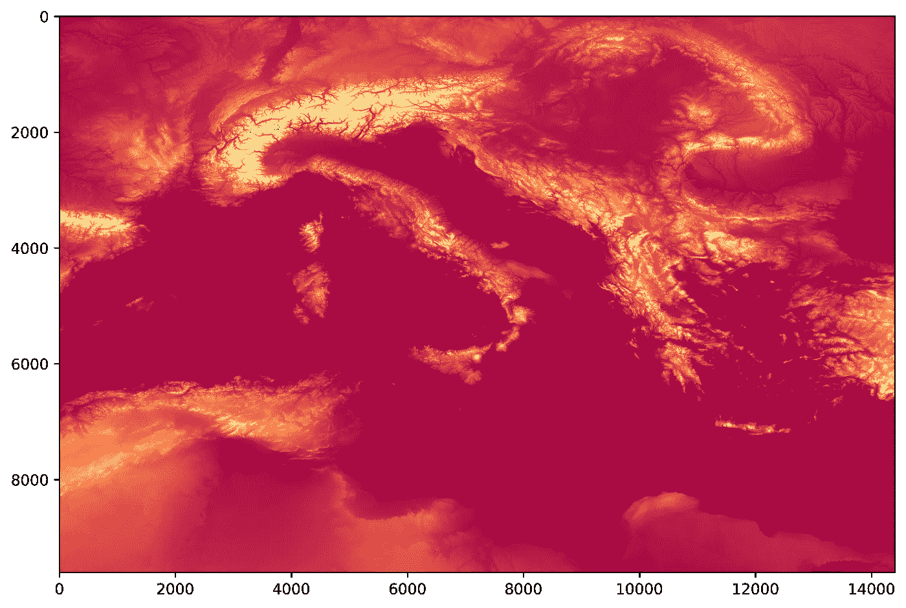

原始数据，使用光谱色彩图绘制。作者图片

有一个迫在眉睫的问题需要解决，数据集包含南欧大部分地区和北非部分地区的信息，而实际上，我们想要的只是意大利。幸运的是，`rasterio` 提供了一种基于地理配准形状(如多边形)裁剪栅格的有用方法。在本例中，我使用了 NaturalEarth (3)数据集的一部分意大利多边形，通过`rasterio.mask.mask` 函数来裁剪栅格。我加载了 NaturalEarth shapefile 并使用`geopandas` 提取了意大利的几何图形，然后使用了蒙版功能。mask 函数采用`rasterio` 数据集对象，并返回所提供的多边形内的栅格部分。

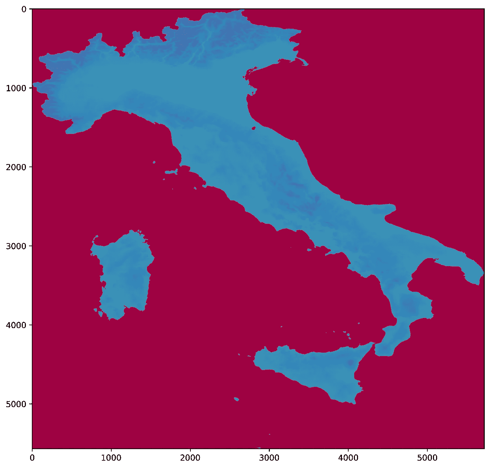

作者图片

现在我们有了仅与意大利相对应的海拔值，但是仍然有一个问题。默认情况下,`rasterio.mask.mask`将用 0 填充所有不在意大利多边形内的值。虽然这是合理的，但这些 0 将使绘图变得棘手，因为它们在色彩图的底部充当锚，如果 0 和意大利数据中的最小高程值之间有很大的差距，那么您会看到上面看到的图，其中一半色彩图中有真实数据，另一半色彩图中没有真实数据，因为 0 和真实数据的最小值之间有差距。例如，如果 0 和最小值之间的差距等于最小和最大高度之间的差距，那么实际上只有一半的颜色图将用于真实数据。

为了解决这个问题，mask 函数允许您使用关键字`nodata`明确设置什么值将被应用到不在意大利多边形内的值。我在下面加入了一个函数来解决这个问题。在下面的函数中，我传递了意大利`GeoDataFrame` 和`rasterio` 数据集对象。您会注意到掩膜函数被调用了两次，第一次是如上所述调用，不在意大利面内的值被返回为 0。第二次，使用了`nodata` 参数，不属于意大利面的值被设置为比意大利地形数据集中的最大值大 1(使用第一个掩膜计算)。结果是，我们现在有了一个在值中没有自然间隙的数据集，并且图表开始成形。这个函数返回的还有`value_range` 变量。这对应于数组中最小和最大值之间的差距，并且在以后构造颜色图时需要。

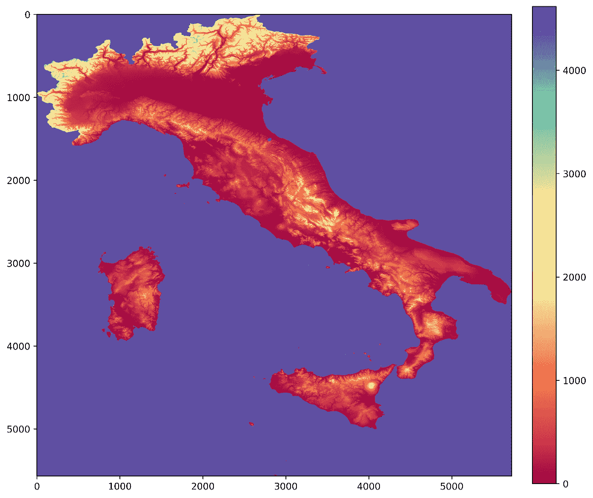

作者图片

现在我们需要构建一个合适的颜色图。绝对明确地说，本文的目的是向您展示如何生成有趣但至关重要的美丽地形图。如果你计划创造一些军事单位将在战斗中使用的东西，那么我建议你使用更定量的颜色图。在这个例子中，我们将基于意大利国旗构建一个颜色图。下面我用意大利国旗的颜色做了一个。仅仅使用这三种颜色会产生一个中间有太多白色的颜色图，所以我在这个颜色图的 2 号和 4 号位置添加了额外的绿色和红色，以最小化白色的优势。

作者图片

我们仍然需要处理不属于之前创建的意大利高程数据集的值。我们将这些值设置为比高程数据中的最大值大 1。解决方案是用足够的颜色构建一个色彩图，这样意大利高程数据中的每个唯一值都有自己的颜色，然后用我们的背景色替换色彩图中的最后一种颜色(红边)。例如，考虑一个场景，其中最小高程值为 10，最大高程值为 100，我们将非意大利值设置为 101。如果我们用 91 种颜色创建一个色彩映射表，用我们的背景色替换第 91 种颜色，那些非意大利值将被映射到第 91 种颜色，这是我们的背景色。

现在，有了新的颜色图和剪辑数据，我们就可以绘制数据了。

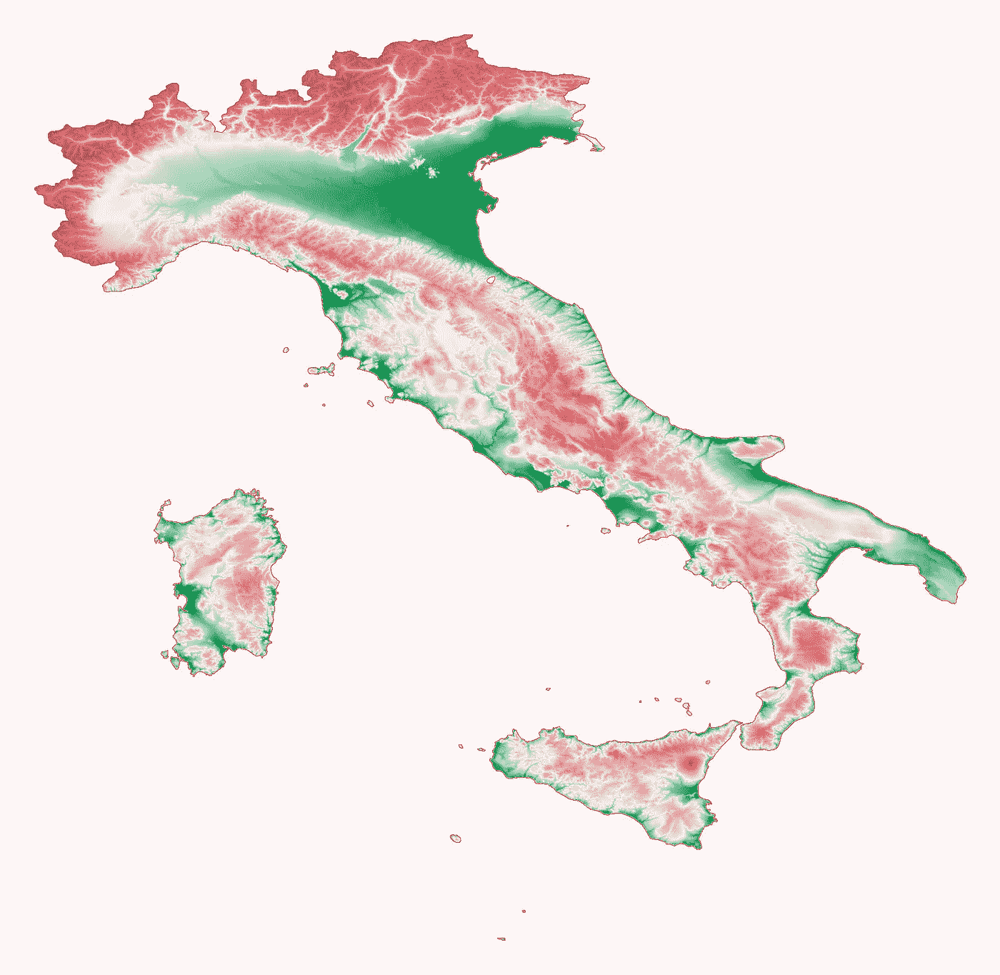

作者图片

虽然我认为这仍然看起来很好，它仍然是 2D 和地形是三维的。所以最后要做的是添加山体阴影来模拟光照在地形上。山体阴影是表面的 3D 表示，通常以灰度渲染。较暗和较亮的颜色表示您在地形模型中看到的阴影和高光。山体阴影通常用作地图中的参考底图，以使数据看起来更加三维，从而在视觉上更加有趣。我们将使用`earthpy` 山体阴影函数来生成山体阴影数据。有两个参数可以调整，根据数据集的不同，它们会给出明显不同的结果。第一个是`azimuth` 值，范围为 0-360 度，与光源的发光位置有关。0 度对应于指向正北的光源。第二个是光源所在的`altitude` ，这些值的范围是 1-90。下面是几个例子，强调了改变这两个值会产生非常不同的结果。

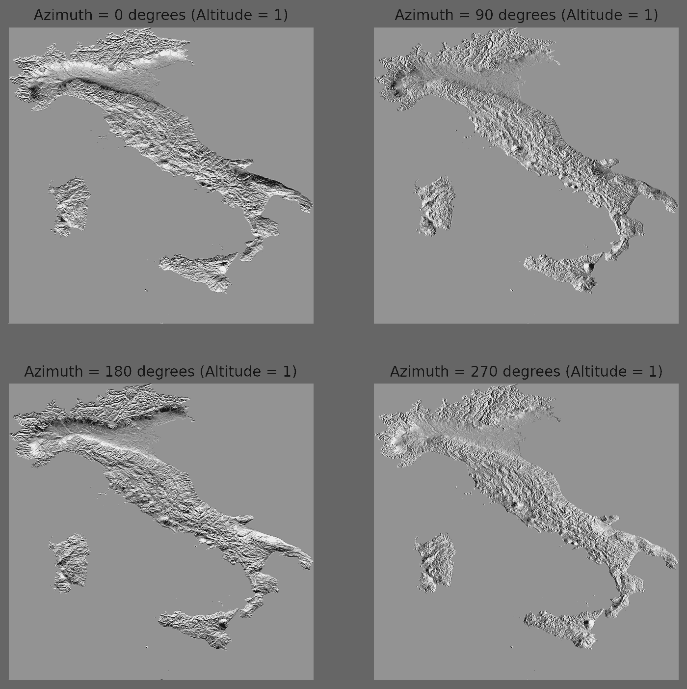

不同的方位角值及其对山体阴影渲染方式的影响。所有的高度都设置为 1。作者图片

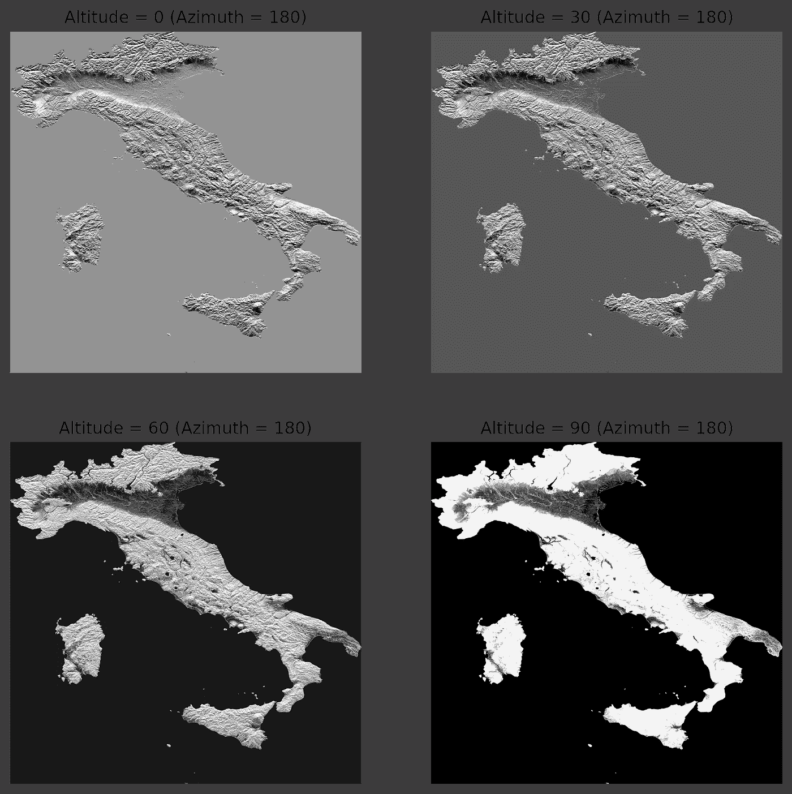

不同的高度值及其对山体阴影渲染方式的影响。所有都设置了 180°的方位角。作者图片

最后我决定方位角值为 180，这样我在阿尔卑斯山的南边得到了一个漂亮的阴影，高度值为 1。不过，我会鼓励你自己尝试这些价值观。最后是绘制成品的时候了。首先绘制主要的意大利地形数据，在顶部绘制带有小 alpha 值的山体阴影。

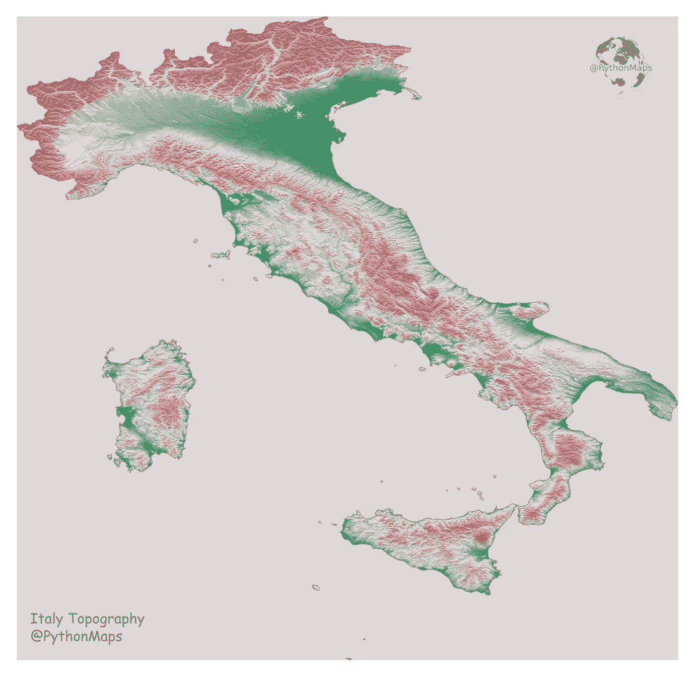

瞧啊。作者图片

放大可以让你真正看到图像的细节！

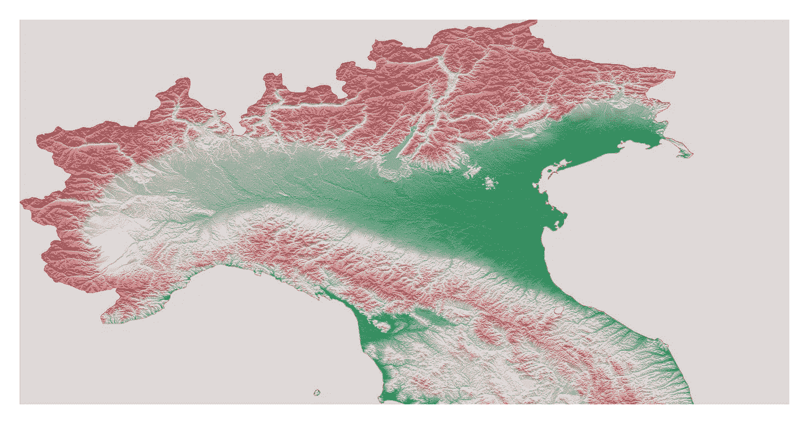

作者图片

这就是我们的意大利地形图，一幅非常赏心悦目的意大利地形图，随时可以裱起来挂在你的墙上。这种方法可以应用于任何国家或地区，但是如果一个国家的数据跨越多个 tif 文件，则需要额外的步骤。我将在以后的文章中讨论这个问题，所以请订阅以确保你能看到它。

(1)-高分辨率数据源- Danielson，J.J .和 Gesch，D.B .，2011，全球多分辨率地形高程数据 2010 (GMTED2010):美国地质调查局公开文件报告 2011–1073，26 页 doi: [10.5066/F7J38R2N](https://doi.org/10.5066/F7J38R2N) 数据免费使用，关于使用的进一步信息可在此处找到- [https://topotools.cr.usgs](https://topotools.cr.usgs.gov/GMTED_viewer/gmted2010_fgdc_metadata.html)

(2)—低分辨率数据源- [doi:10.7289/V5C8276M](http://dx.doi.org/10.7289/V5C8276M)

(3)—natural earth—[https://www.naturalearthdata.com/](https://www.naturalearthdata.com/)