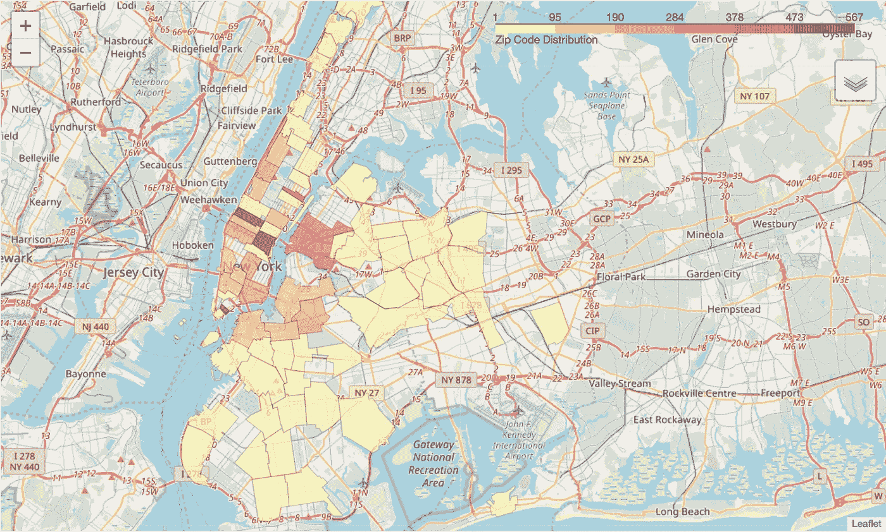
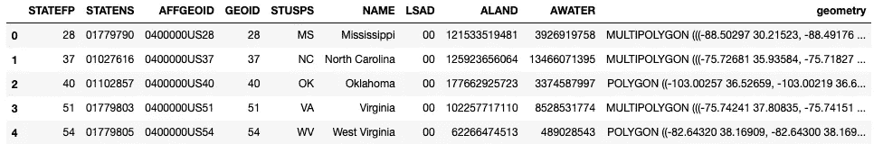
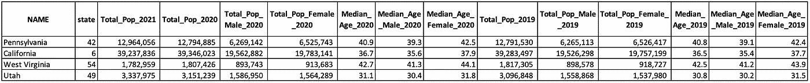
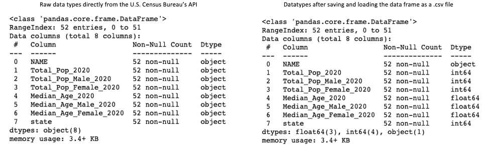
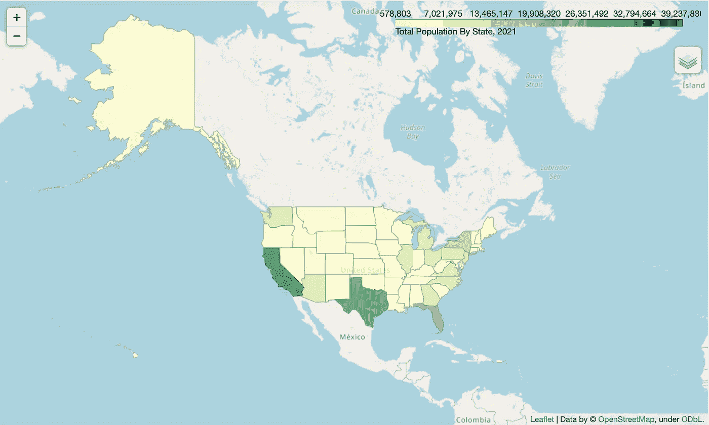
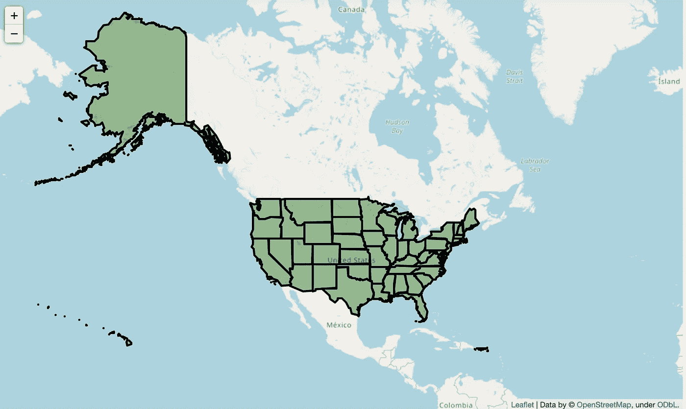
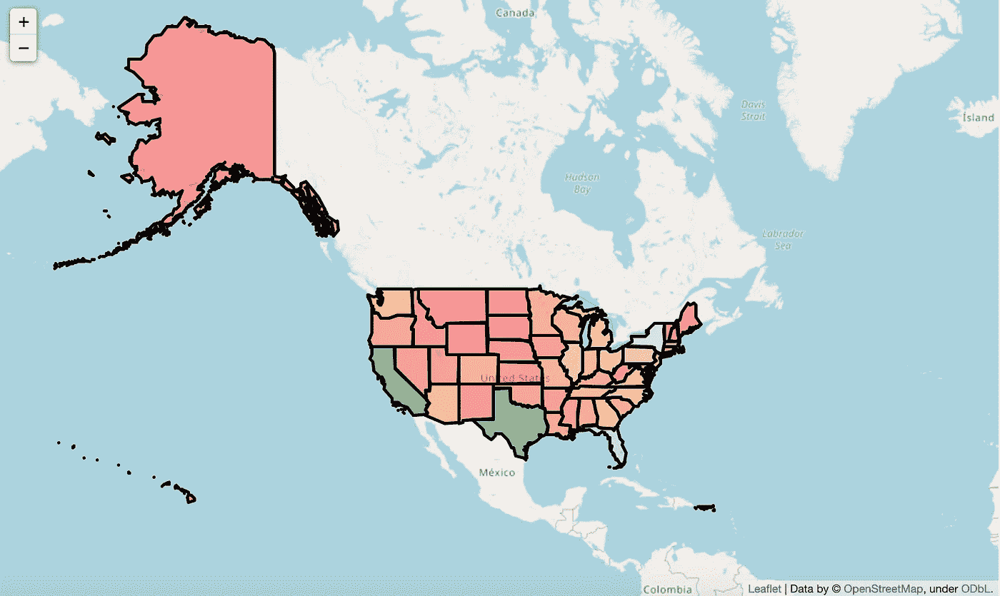

# 使用 Python 的叶库创建 Choropleth 地图

> 原文：<https://towardsdatascience.com/creating-choropleth-maps-with-pythons-folium-library-cfacfb40f56a>

## 如何用 Python 制作不同数据结构的 choropleths



【2019 年 4 月纽约市可出租公寓一览表([*GitHub*](https://github.com/amitrani6/nyc_asking_rent_regression)*)*

C horopleth 地图用于显示地理区域的数据变化( [*人口教育*](https://populationeducation.org/what-is-a-choropleth-map-and-why-are-they-useful/) )。我使用 choropleths 显示了纽约市不同邮政编码的可用出租公寓数量，并显示了给定时期每个邮政编码的抵押贷款交易数量。Python 的[叶子库](https://python-visualization.github.io/folium/)使用户能够构建多种定制地图，包括 choropleths，你可以将它们作为`.html`文件与不知道如何编码的外部用户共享。

# 加载和查看地理数据

美国政府网站通常有创建地图所需的地理数据文件。纽约市的 OpenData [网站](https://www1.nyc.gov/site/planning/data-maps/open-data.page)和美国人口普查局的[网站](https://www.census.gov/geographies/mapping-files/time-series/geo/carto-boundary-file.html)有多种数据类型的地理边界文件。Python 允许你加载多种文件类型，包括 geo JSON*(*`*.geojson*`*)*文件和 shape file*(*`*.shp*`*)*。这些文件包含给定位置的空间边界。

关于`folium.Choropleth()`方法的 folio 文档说明，`geo_data`参数接受 GeoJSON 几何作为字符串来创建映射，“URL、文件路径或数据 *(json、dict、geopandas 等)*到您的 GeoJSON
几何“*(*[*)folio 文档*](https://python-visualization.github.io/folium/modules.html#module-folium.features) *)* 。无论我们如何加载文件，我们都必须用这种方法转换几何数据才能正常工作。该方法的`key_on`参数将每个特定位置 *(GeoJSON 数据)*的数据与该位置*(即人口)*的数据绑定。

## 杰奥森

GeoJSON 文件存储几何形状，在这种情况下是位置的边界及其相关属性。例如，加载带有纽约市邮政编码边界的 GeoJSON 文件的代码如下:

```
# Code to open a .geojson file and store its contents in a variable**with** open ('nyczipcodetabulationareas.geojson', 'r') **as** jsonFile:
    nycmapdata **=** json**.**load(jsonFile)
```

变量`nycmapdata`包含一个至少有两个键的字典，其中一个键叫做`features`，这个键包含一个字典列表，每个字典代表一个位置。第一个位置的主要 GeoJSON 结构摘录如下:

```
{'type': 'FeatureCollection',
 'features': [{'type': 'Feature',
   'properties': {'OBJECTID': 1,
    'postalCode': '11372',
    'PO_NAME': 'Jackson Heights',
    'STATE': 'NY',
    'borough': 'Queens',
    'ST_FIPS': '36',
    'CTY_FIPS': '081',
    'BLDGpostal': 0,
    '@id': 'http://nyc.pediacities.com/Resource/PostalCode/11372',
    'longitude': -73.883573184,
    'latitude': 40.751662187},
   'geometry': {'type': 'Polygon',
    'coordinates': [[[-73.86942457284177, 40.74915687096788],
      [-73.89143129977276, 40.74684466041932],
      [-73.89507143240859, 40.746465470812154],
      [-73.8961873786782, 40.74850942518088],
      [-73.8958395418514, 40.74854687570604],
      [-73.89525242774397, 40.748306609450246],
      [-73.89654041085562, 40.75054199814359],
      [-73.89579868613829, 40.75061972133262],
      [-73.89652230661434, 40.75438879610903],
      [-73.88164812188481, 40.75595161704187],
      [-73.87221855882478, 40.75694324806748],
      [-73.87167992356792, 40.75398717439604],
      [-73.8720704651389, 40.753862007052064],
      [-73.86942457284177, 40.74915687096788]]]}}, ... ]}
```

`folium.Choropleth()`方法的`key_on`参数要求用户以字符串形式引用 GeoJSON 文件中位置字典的唯一索引键:

> **key_on** ( *字符串，默认无*)—geo _ data geo JSON 文件中的变量，数据绑定到该变量。必须以“feature”开头，并且采用 JavaScript 异议表示法。例如:“feature.id”或“feature.properties.statename”。

在上面的例子中，索引键是邮政编码，与每个位置相关的数据也必须有一个邮政编码索引键或列。上例中的`key_on`参数是以下字符串:

`‘feature.properties.postalCode’`

*注意:字符串的第一部分必须始终是单数单词* `*feature*` *，它不像父字典那样包含每个单独位置字典的列表。*

`key_on`参数是访问每个特定位置的`properties`键。`properties`键本身包含一个有 11 个键的字典，在这种情况下,`postalCode`键是索引值，它将几何形状链接到我们想要绘制的任何值。

## **地质公园**

另一种加载地理数据的方法是使用 Python 的 GeoPandas 库 *(* [*链接*](https://geopandas.org/en/stable/) *)* 。这个库在加载 Shapefile 时很有用，shape file 在美国人口普查网站 *(* [*制图边界文件— Shapefile*](https://www.census.gov/geographies/mapping-files/time-series/geo/carto-boundary-file.html) *)* 上提供。GeoPandas 的工作方式类似于 Pandas，只是它可以存储和执行几何数据的功能。例如，用美国所有州的边界加载 shapefile 的代码如下:

```
# Using GeoPandasimport geopandas as gpd
usmap_gdf = gpd.read_file('cb_2018_us_state_500k/cb_2018_us_state_500k.shp')
```



*us map _ GDF 数据帧的头部*

如果您调用 Jupyter 笔记本中第一行的 *(Mississippi)* 几何列，您将看到以下内容:

`usmap_gdf[“geometry”].iloc[0]`


当调用特定的几何值时，您会看到一个几何图像，而不是表示形状边界的字符串，上面是第一行(密西西比)的几何值

与 GeoJSON 字典的内容不同，没有用于访问内部字典的`features`键，也没有`properties`列。`folium.Choropleth()`方法的`key_on`参数仍然要求字符串的第一部分为`feature`，但是该方法将引用 GeoPandas 数据帧中的列，而不是引用 GeoJSON 的位置字典。在这种情况下，`key_on`参数将等于`“feature.properties.GEOID”`，其中`GEOID`是包含将我们的数据绑定到地理边界的唯一州代码的列。`GEOID`列有前导零，加州`GEOID`是`06`。您也可以使用`STATEFP`列作为索引，确保使用的列、格式和数据类型都是一致的。

# 查看 Choropleth 的群体数据

地理数据和要绘制的相关数据可以作为两个单独的变量存储，也可以一起存储。重要的是跟踪列的数据类型，并确保索引(`*key_on*`)列对于地理数据和位置的关联数据是相同的。

我访问了美国人口普查 API 的美国社区调查 *(* [*链接*](https://www.census.gov/programs-surveys/acs) *)* 和人口估计与预测 *(* [*链接*](https://www.census.gov/data/developers/data-sets/popest-popproj.html) *)* 表格，得到 2019 年到 2021 年的人口和人口统计数据。数据帧的标题如下:



美国人口普查数据框架的头

我将数据保存为一个`.csv`文件，在某些情况下，这将改变列的数据类型；例如，字符串可以变成数值。调用`.info()` 时的数据类型如下:



将数据框保存和加载为 CSV 文件之前和之后的人口普查数据的数据类型

另一个需要注意的重要事情是，在加载数据帧后，`state`列中的所有前导零都不会出现。这必须得到纠正；id 必须匹配并且是相同的数据类型*(即它不能在一个数据框中是整数而在另一个数据框中是字符串)*。

# 基本的 Choropleth 映射有五种不同的方式

如上所述，follow 允许您使用地理数据类型创建地图，包括 GeoJSON 和 GeoPandas。这些数据类型需要被格式化，以便与 least 库一起使用，为什么会出现某些错误并不总是直观的(对我来说是*，至少是*)。以下示例描述了如何准备地理数据*(在本例中为美国州界)*和相关的绘图数据*(各州的人口)*以用于`folium.Choropleth()`方法。

## 方法 1:使用 Pandas 和 GeoJSON，不指定 ID 列

这种方法非常类似于文档中的 choropleth 地图的例子。该方法使用包含州边界数据的 GeoJSON 文件和 Pandas 数据帧来创建地图。

当我开始使用 GeoPandas 文件时，我需要使用 GeoPandas 的`to_json()` [方法](https://geopandas.org/en/stable/docs/reference/api/geopandas.GeoDataFrame.to_json.html)将其转换为 GeoJSON 文件。提醒一下 *usmap_gdf* GeoPandas 数据帧看起来像:


*us map _ GDF 数据帧的头*

然后我应用`.to_json()`方法，并指定我们从数据帧中删除`id`，如果它存在的话:

`usmap_json_no_id = usmap_gdf.to_json(drop_id=True)`

*注意:* `*usmap_json_no_id*` *是本场景*中存放 json 字符串的变量

这个方法返回一个字符串，我对它进行了格式化，以便于阅读，并显示在下面的第一组坐标上:

```
'{"type": "FeatureCollection",
  "features": [{"type": "Feature",
  "properties": {"AFFGEOID": "0400000US28", 
                 "ALAND": 121533519481,
                 "AWATER": 3926919758,
                 "GEOID": 28,
                 "LSAD": "00",
                 "NAME": "Mississippi",
                 "STATEFP": "28",
                 "STATENS": "01779790",
                 "STUSPS": "MS"},
  "geometry": {"type": "MultiPolygon",
               "coordinates": [[[[-88.502966, 30.215235]'
```

*注意:“属性”字典没有名为“id”的键*

现在，我们准备将新创建的 JSON 变量与上一节中获得的美国人口普查数据框架连接起来，其标题如下:


美国人口普查数据框架的头部，下面称为 **all_states_census_df**

使用 folium 的`Choropleth()`方法，我们创建地图对象:

创建一个`Choropleth with a GeoJSON variable which does not specify an id`的代码

`geo_data`参数被设置为新创建的`*usmap_json_no_id*`变量，而`data`参数被设置为 **all_states_census_df** 数据帧。由于在创建 GeoJSON 变量时未指定 id，`key_on`参数必须引用地理数据中的特定关键字，并且其工作方式类似于字典( *GEOID 是“属性”关键字*的值)。在这种情况下，`GEOID`键保存州代码，该代码将州几何边界数据连接到 **all_states_census_df** 数据帧中相应的美国人口普查数据。下面是 choropleth:



由上述方法得到的 choropleth

## 方法 2:使用 Pandas 和 GeoJSON，并指定 ID 列

除了在调用`.to_json()`方法之前使用一个索引之外，这个过程与上面的几乎完全相同。

在上面的例子中，`usmap_gdf`数据帧没有索引，为了纠正这个问题，我将把索引设置为`GEOID`列，然后立即调用`.to_json()`方法:

`usmap_json_with_id = usmap_gdf.set_index(keys = “GEOID”).to_json()`

直到第一个州的数据的第一对坐标，结果字符串如下:

```
'{"type": "FeatureCollection",
  "features": [{"id": "28",
                "type": "Feature",
                "properties": {"AFFGEOID": "0400000US28",
                               "ALAND": 121533519481, 
                               "AWATER": 3926919758,
                               "LSAD": "00",
                               "NAME": "Mississippi",
                               "STATEFP": "28",
                               "STATENS": "01779790",
                               "STUSPS": "MS"},
                "geometry": {"type": "MultiPolygon",
                             "coordinates": [[[[-88.502966, 30.215235],'
```

“properties”字典不再有`GEOID`键，因为它现在作为一个名为`id`的新键存储在外层字典中。您还应该注意到，`id`值现在是一个字符串，而不是一个整数。如前所述，您必须确保连接数据的数据类型是一致的。如果涉及前导零和尾随零，这会变得很乏味。为了解决这个问题，我从`all_states_census_df`中的`state`列创建了一个名为`state_str`的新列:

`all_states_census_df[“state_str”]=all_states_census_df[“state”].astype(“str”)`

现在我们可以创建 choropleth:

创建 c 的代码`horopleth with a GeoJSON variable which specifies an id`

该代码与之前使用的代码的区别在于`key_on`参数引用的是`id`而不是`properties.GEOID`。生成的地图与方法 1 完全相同:


由上述方法得到的 Choropleth

## 方法 3:使用熊猫和 GeoPandas 的 Python 要素集合

该方法从具有`__geo_interface__` [属性](https://geopandas.org/en/stable/docs/reference/api/geopandas.GeoDataFrame.__geo_interface__.html)的原始 GeoPandas 数据帧创建 GeoJSON like 对象( *python 要素集合*)。

我将`usmap_gdf`data frame(*US geographic data*)的索引设置为`STATEFP`列，该列以字符串形式存储州 id，并以零开头:

`usmap_gdf.set_index(“STATEFP”, inplace = True)`

然后，我通过添加一个前导零，在`all_states_census_df`数据框(*美国人口普查数据*)中创建了一个匹配列:

`all_states_census_df[“state_str”] = all_states_census_df[“state”].astype(“str”).apply(lambda x: x.zfill(2))`

最后，我使用`us_data_gdf` GeoPandas dataframe 的`__geo_interface__` [属性](https://geopandas.org/en/stable/docs/reference/api/geopandas.GeoDataFrame.__geo_interface__.html)来获取几何状态边界的 python 特性集合，存储为一个字典，类似于前两种方法:

`us_geo_json = gpd.GeoSeries(data = usmap_gdf[“geometry”]).__geo_interface__`

下面是`us_geo_json`变量的摘录:

```
{'type': 'FeatureCollection',
 'features': [{'id': '28',
   'type': 'Feature',
   'properties': {},
   'geometry': {'type': 'MultiPolygon',
    'coordinates': [(((-88.502966, 30.215235), ...))]
```

最后，我们创建了 choropleth:

创建一个 c `horopleth with a GeoPanda's **__geo_interface__**`属性的代码

这张地图看起来和上面的一样，所以我把它排除了。

## 方法 4:使用 Geopandas 的几何类型列

在这里，我们坚持 GeoPandas。我创建了一个名为`us_data_gdf`的 GeoPandas 数据框架，它将几何数据和普查数据组合在一个变量中:

```
us_data_gdf = pd.merge(left = usmap_gdf,
                       right = all_states_census_df,
                       how = "left", 
                       left_on = ["GEOID", "NAME"],
                       right_on = ["state", "NAME"]
                       )
```

*注:****all _ States _ Census _ df****是美国人口普查数据的熊猫数据帧，****US map _ GDF****是存储州几何边界数据的 GeoPandas 数据帧。*

使用 GeoPandas 数据帧创建 choropleth 的代码如下:

使用 GeoPandas 数据帧创建 choropleth 的代码

在上面的例子中，`geo_data`参数和`data`参数都引用相同的 GeoPandas 数据帧，因为信息存储在一个地方。因为我没有设置索引，所以`key_on`参数等于`“feature.properties.GEOID”`。即使使用 GeoPandas，folium 也需要使用`key_on`参数，就像引用一个类似字典的对象一样。

和以前一样，这张地图看起来和上面的一样，所以我把它排除了。

## 方法 5:使用 Geopandas 几何类型和 Branca

在这里，我们使用 Branca [库](https://github.com/python-visualization/branca)和 leav 的[示例](https://python-visualization.github.io/folium/quickstart.html#Styling-function)创建了一个更加时尚的地图。除了安装之外，Branca 的第一步是创建一个`ColorMap`对象:

```
colormap = branca.colormap.LinearColormap(
    vmin=us_data_gdf["Total_Pop_2021"].quantile(0.0),
    vmax=us_data_gdf["Total_Pop_2021"].quantile(1),
    colors=["red", "orange", "lightblue", "green", "darkgreen"],
    caption="Total Population By State",
)
```

在上面的代码中，我们访问了`branca.colormap.LinearColormap` [类](https://github.com/python-visualization/branca/blob/52b10bd969ac25d0b70640b2eee2ea1d8e8690b3/branca/colormap.py#L161)。在这里，我们可以设置我们使用的颜色以及色阶的值。对于这个 choropleth，我希望颜色与美国人口普查数据中最低和最高的人口值成比例。为了设置这些值，我使用了上述的`vmin`和`vmax`参数。如果我忽略了这一点，那么色标中将考虑没有值的区域，没有这些设置参数的结果如下:



没有设置`**vmin**`和`***vmax***`参数的 Branca choropleth

一旦创建了`ColorMap`对象，我们就可以创建一个 choropleth ( *完整代码在*下面):

使用 GeoPandas 数据框架和 Branca 库创建 choropleth

我修改了 leav 网站上的例子，使用了`us_data_gdf` GeoPandas 数据框架。该示例允许我们排除地理数据中不具有相关人口普查数据的部分(*显示为透明的*)(*如果一个州的人口为空，那么除非被排除*，否则 choropleth 上的颜色将为黑色。生成的 choropleth 如下:



用麦麸和地瓜做成的鸡蛋饼

布兰卡是可定制的，但如何使用它的解释是少之又少。其存储库的自述文件指出:

> 没有文档，但是你可以浏览范例库。

你必须练习使用它来制作你想要的那种地图。

# 摘要

对那些有或没有编码知识的人来说，叶子可以用来制作信息丰富的地图，如 choropleths。政府网站通常拥有为您的数据创建位置边界所需的地理数据，这些数据也可以从政府网站获得。理解你的数据类型和文件类型是很重要的，因为这会导致不必要的麻烦。这些地图是高度可定制的，例如你可以添加工具提示来注释你的地图。充分利用这个图书馆的潜力需要实践。

*我的这篇文章可以在* [*这里找到*](https://github.com/amitrani6/maps) *。快乐编码。*