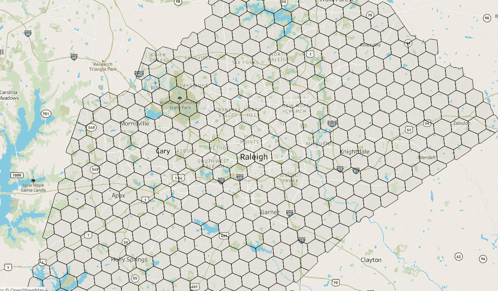
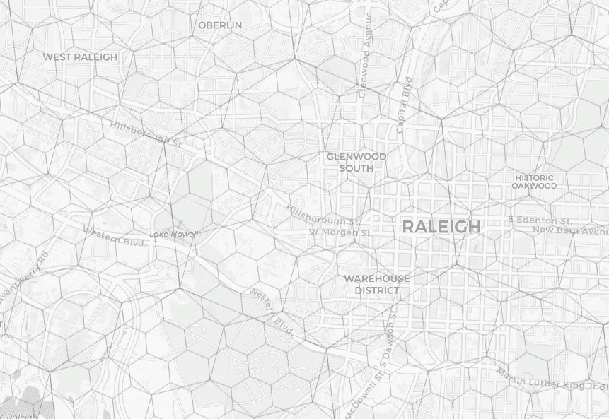
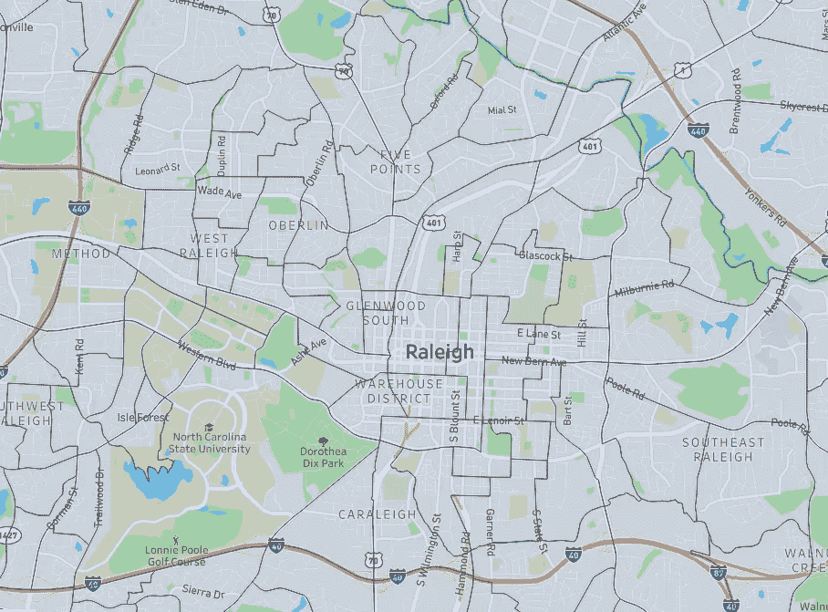
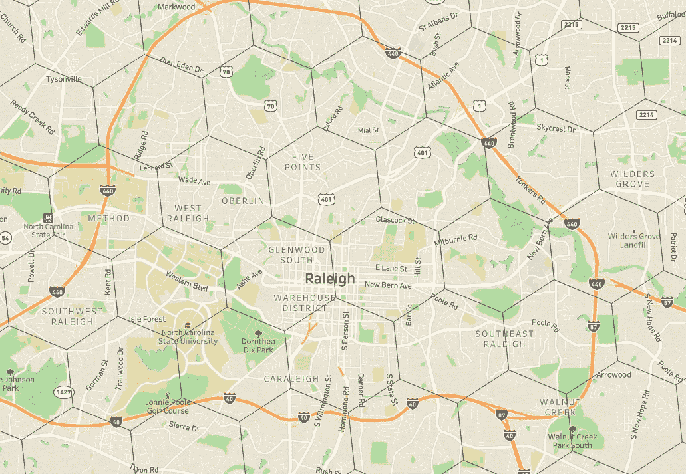
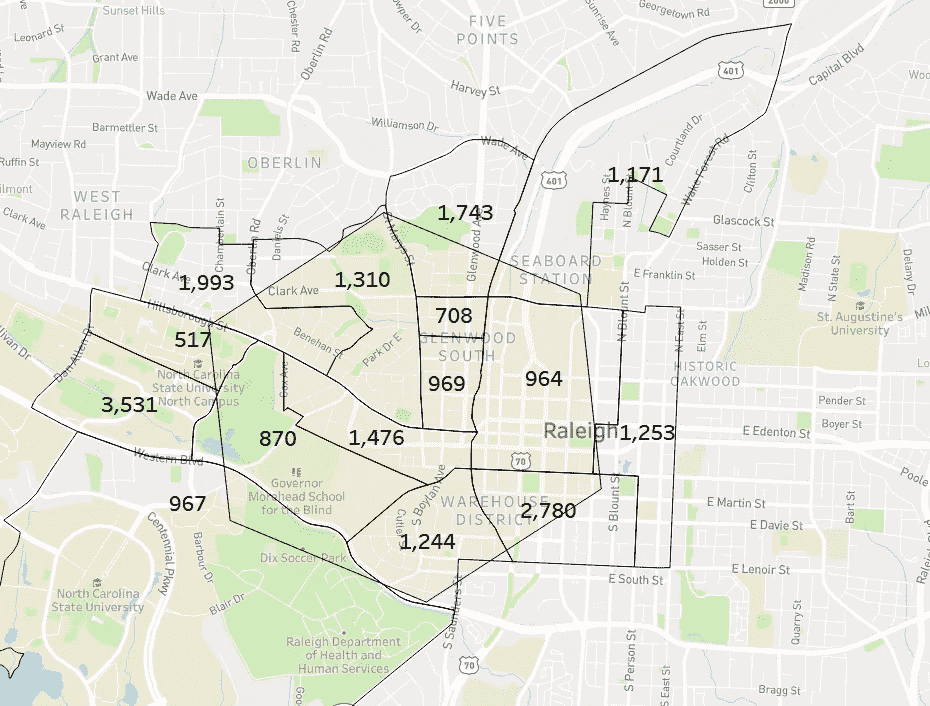
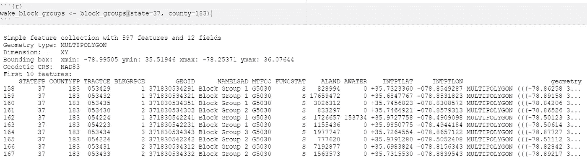
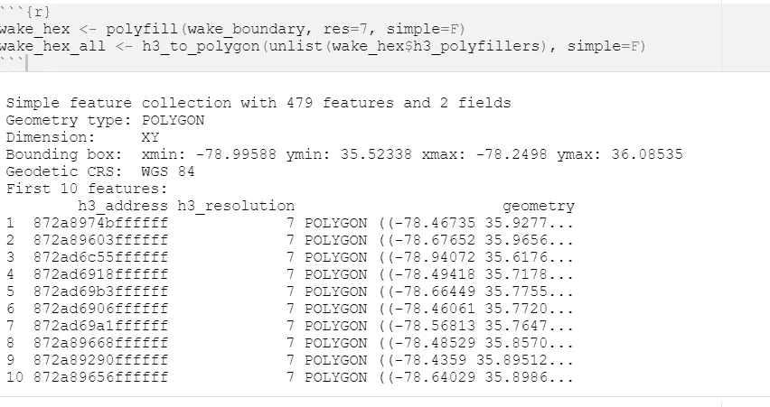
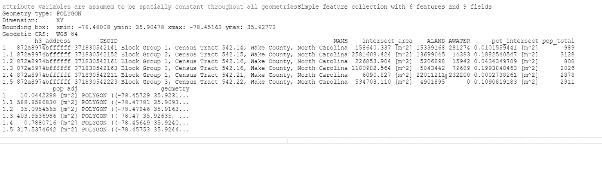
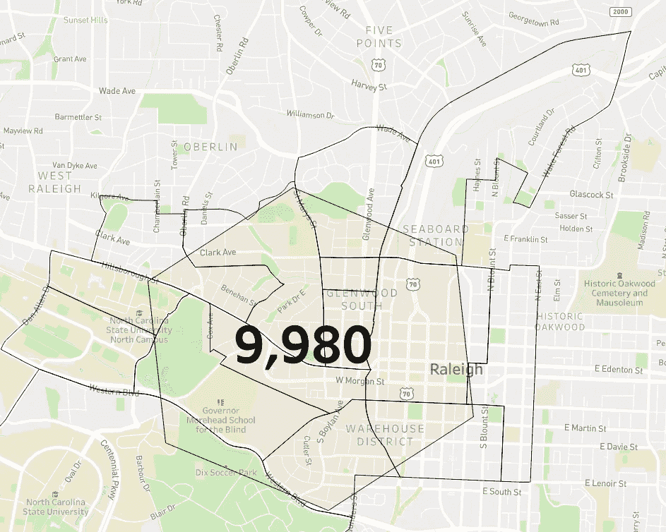
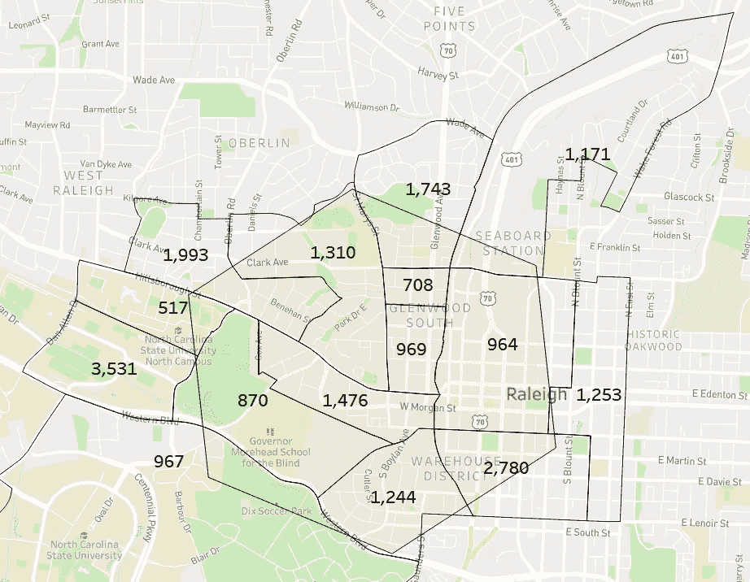

# 使用优步的 H3 六边形创建一致的空间计算

> 原文：<https://towardsdatascience.com/creating-consistent-spatial-calculations-with-ubers-h3-hexagons-1af032802a77>

## 将人口普查数据添加到 H3 六边形以进行空间分析


唐尼·姜在 [Unsplash](https://unsplash.com?utm_source=medium&utm_medium=referral) 上的照片

*所有的分析技术、观点和代码都是独立开发和我自己的工作。*

获取一个城市或邮政编码的人口统计数据非常简单——有几个 API 和数据下载工具可以做到这一点。但是，由于许多原因，这些地理位置有局限性(举几个例子，邮政编码是 USPS 递送的功能，城市边界是在几个世纪前建立的——并不完全是为数据分析设计的)。

我测试了几种不同的方法来克服这些边界的任意性——从[创建统一的盒子](/optimizing-location-decisions-in-new-growth-markets-bf7b78f4c79)到[开发驾驶(或行走)时间多边形](/finding-product-market-fit-for-commercial-space-with-analytics-5930434a9494)，这取决于用例。

我最近开始意识到 H3 的好处，这是优步在 2018 年推出的一套全球六边形[。主要思想是六边形是最有利于空间分析的形状，可用于创建一致的计算。](https://eng.uber.com/h3/)



示例 H3 六边形；作者图片

每个六边形都有一系列更小的六边形，这些六边形(大部分)位于另一个六边形的内部，这创建了一个可用于一致参考和分析的层次结构，一直到边长为 2 英尺。



作者图片

这种方法适用于点数据——骑手是在哪里上车的？离开了？任何有经纬度的地址或兴趣点都可以映射成六边形。

如果我们想利用六边形分析的优势，但使用人口统计数据，会发生什么？我发现了很多关于使用六边形的信息，但是没有引入人口统计数据，所以我开始将两者结合起来。

处理人口普查数据时，稳健数据报告提供的最详细视图是人口普查区块组([在此阅读更多关于区块组的信息](https://www2.census.gov/geo/pdfs/reference/GARM/Ch11GARM.pdf))。块组是通常有 600 到 3，000 人的边界，这使得它们可以同质学习和使用(这么小的区域往往有相似的人居住在其中)。

然而，因为它们受人口限制，所以大小缺乏一致性。例如，看看下面北卡罗来纳州罗利市中心的人口普查区块组，根据人口分布，有些较小，有些较大。

相比之下，六边形(为了有效分析，我随机选择了一个尺寸，但我们可以根据需要选择更小或更大的尺寸)，大小一致，边界一致。



北卡罗来纳州罗利市中心的人口普查区块组(左)和 H3 六边形(右)

因此，问题变成了，我们如何将人口普查区块组中可用的人口统计信息映射到六边形的统一结构？我们如何从人口普查区块组的粒度和六边形的一致性中获益？

# 总体情况——我们如何解决这个问题？

假设我们想要找到每个六边形内的人口，更具体地说，让我们看一个六边形。我们可以用相应的块组边界覆盖六边形边界，得到类似下面这样的结果…



覆盖在交叉六边形上的块群总体；作者图片

完全位于一个六边形内的块组是容易的，我们考虑将全部人口分配到六边形(人口 708、969 和 1476 在六边形的中间)。然而，由于形状不匹配，许多有部分重叠，这只会更常见于较小的六边形。

对于与六边形相交的任何块组，我们可以计算两个形状之间的面积重叠，并根据此计算按比例分配人口。如果一半的块组重叠，我们认为一半的人口是在六边形。

这种假设并不完美——人口并不均匀地分布在一个街区组中——但出于实用目的，它为我们提供了一种“足够好”的方法来组合这两种地理形状。

# 实施

*我将用 R 编程语言的代码来演示，但这种方法在 Python 或其他语言中在概念上是相同的。*

我们需要两条主要信息来进行分析——带有相应人口统计数据的街区组形状和六边形形状。

在 R 中，我们可以利用[tidysensus 包](https://www.rdocumentation.org/packages/tidycensus/versions/1.2.1)从美国人口普查 API 中获取数据(您将需要一个免费的开发者密钥)。`[get_acs](https://www.rdocumentation.org/packages/tidycensus/versions/1.2.1/topics/get_acs)` <https://www.rdocumentation.org/packages/tidycensus/versions/1.2.1/topics/get_acs>功能是获取块组数据的最简单方法，其典型语法如下:

`get_acs(geography = 'block group', year = 2020, variables = c(total_population = 'B01001_001'), state=37, county=183, output='wide')`

可选参数定义了我们需要输出的块组、2020 年 5 年 ACS 的数据、总人口变量标识符、北卡罗来纳州(FIPS 37)、威克县(代码 183)和宽输出格式。


get_acs 函数的输出；作者图片

从那里，我们需要为每个块组匹配一个形状(边界)。我们可以使用来自 [tigris](https://cran.r-project.org/web/packages/tigris/index.html) 包的`block_groups`函数，并提供州和县标识符，这将返回一个包含几何多边形的形状文件。



获取北卡罗来纳州威克县每个街区组的形状文件的示例语法；作者图片

通过*大地水准面*的简单连接可以将 shapefile 与人口统计信息放在一起，以创建单个块组文件。然后使用 sf 包将输出转换回 shapefile(稍后将详细介绍),并转换到坐标参考 4326。

```
acs_block_data %>%
  left_join(wake_block_groups, by='GEOID') %>%
  st_as_sf() %>%
  st_transform(4326)
```

为了获得威克郡的所有六边形，我获取了威克郡的 shapefile(也使用了 tigris 包，但是使用了`counties`函数)，然后利用 [h3jsr 包](https://cran.r-project.org/web/packages/h3jsr/vignettes/intro-to-h3jsr.html#General_information)来访问 H3 的六边形。

`polyfill`函数查找给定边界内的所有六边形(这里是威克郡，罗利的家乡)，而`h3_to_polygon`函数给出每个六边形的形状。`res = 7`参数定义了六边形的粒度级别(15 是最精确的，0 是最大的)。

```
wake_hex <- polyfill(wake_boundary, res=7, simple=F)
wake_hex_all <- h3_to_polygon(unlist(wake_hex$h3_polyfillers), simple=F)
```

输出是一系列六边形参考 id 和多边形形状。



作者图片

现在，对于每个六边形，我们想要:

*   查找与六边形的边界相交(重叠)的任何块组
*   找出块组的重叠百分比
*   根据重叠百分比分配块组中的人口

R 中的 [sf 包](https://www.rdocumentation.org/packages/sf/versions/1.0-7)是空间分析的首选包。`st_intersection`函数查找两个形状的重叠区域，下面的 mutate 函数计算重叠百分比。此代码的输出将是所有重叠的块组，以及它们的重叠区域。

```
st_intersection(wake_hex_all[1,1], wake_blocks) %>%
mutate(intersect_area = st_area(.),
       pct_intersect = intersect_area / (ALAND + AWATER) )
```



带有附加数据操作的 st_intersection 函数的输出示例；作者图片

最后一步是将总体转换为数字，将总体乘以百分比交集以获得调整后的总体，然后将调整后的总体相加得到六边形中的总数。

```
st_intersection(wake_hex_all[1,1], wake_blocks) %>%
mutate(intersect_area = st_area(.),
       pct_intersect = intersect_area / (ALAND + AWATER),
       pop_total = as.numeric(total_populationE),
       pop_adj = pop_total * pct_intersect ) %>%
summarize(total_population = sum(pop_adj, na.rm = T)
```

例如，在上面的图像中，具有约 11%重叠的 2，911 人口成为约 317 的调整人口。

回到我们之前的例子，这种方法给出了估计的六边形人口为 9，980。再次观察每个区块组中的人口，视觉比较表明这可能不会太远。



底层块组群体的群体计算示例

当六边形/地块组与受保护的土地(如公园或水体)有较大重叠时，这种方法有局限性，这对于更偏远地区的小六边形最有影响。考虑到大多数城市和近郊的人口密度，我认为这种方法在大多数情况下会有方向性的帮助。

# 扩展分析

人口只是用作示例，但是可以使用在块组级别报告的任何内容。六边形的家庭收入中位数是多少？有多少户人家？有孩子的家庭比例是多少？添加到在`get_acs`函数中收集的变量中，可以启用如何分析和汇总数据的其他选项。

这也可以与可以聚合到六边形中的任何兴趣点数据相结合，例如，通过查找给定兴趣点的高密度区域，然后描述该六边形的人口构成。

虽然并不完美，但这提供了一种为空间分析和趋势创建一致计算的方法。总的来说，我们希望数据在方向上是有用的——如果我们计算出一个六边形的人口比另一个六边形多 20%,我们可以合理地确定第一个六边形的人口更多，即使不是正好 20%。

*有疑问或者对这些话题感兴趣？* [*在 LinkedIn*](http://www.linkedin.com/in/jordanbean) *上和我联系，或者在 jordan@jordanbean.com 给我发邮件。*