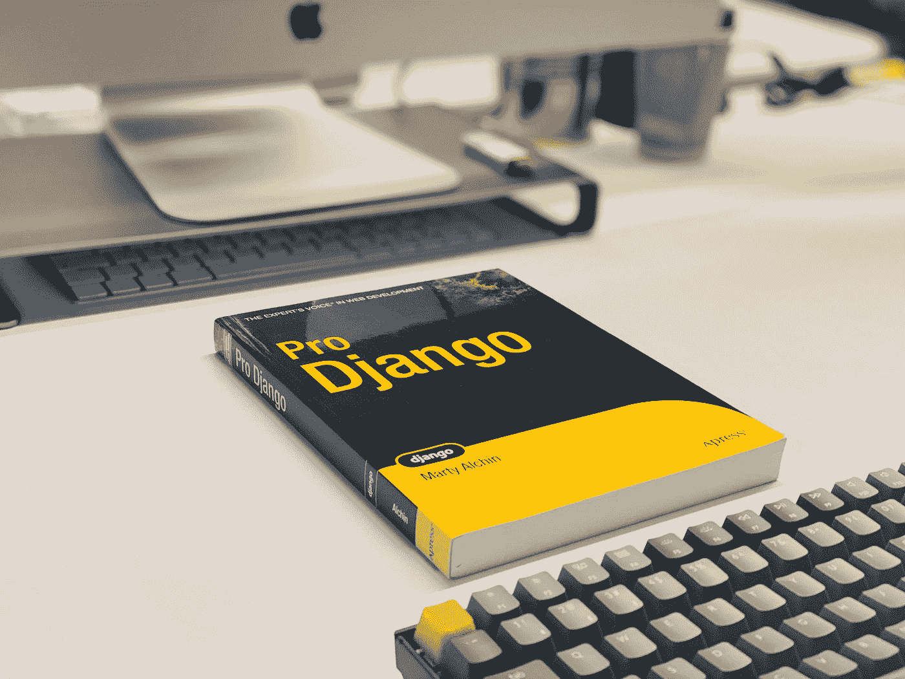
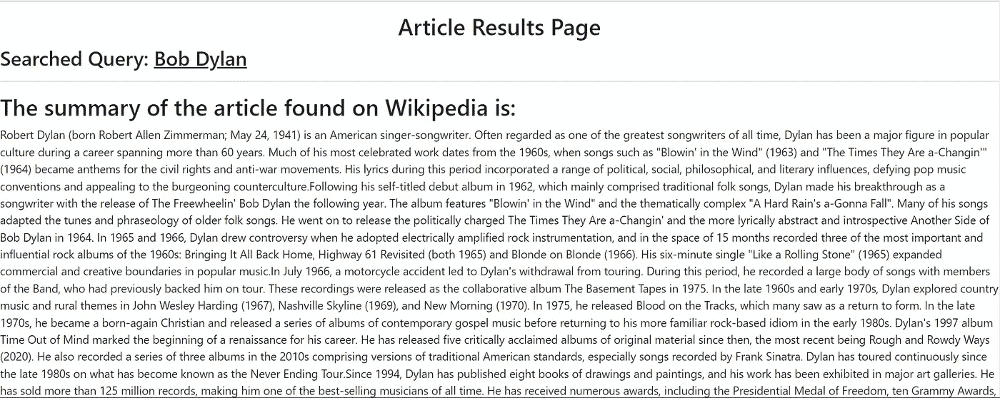
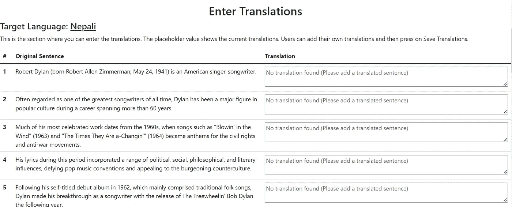

# 在 Django 中创建动态长度表单

> 原文：<https://towardsdatascience.com/creating-dynamic-length-forms-in-django-53709c23464e>

费萨尔在 [Unsplash](https://unsplash.com?utm_source=medium&utm_medium=referral) 上拍摄的照片

## 讨论如何创建一个 Django 表单，它可以有动态数量的输入字段

最近，我正在解决一个问题，创建一个应用程序，可以使用搜索词收集维基百科数据，并收集文章简介。该应用程序进一步拆分所有句子，并允许用户将文章中每个句子的翻译保存在数据库中。这个应用程序将帮助任何人通过使用搜索词来注释或翻译维基百科的内容。

该应用程序主要是使用 Django 和 HTML 模板构建的。我使用了[维基百科 API](https://pypi.org/project/Wikipedia-API/) 来收集数据。最终输出可以在这里找到和[源代码](https://github.com/prakharrathi25/wikipedia-translator)在我的 GitHub 上。

 [## GitHub-prakharrathi 25/Wikipedia-translator:允许从维基百科页面进行翻译的应用程序…

### 这个应用程序允许用户在维基百科上输入文章标题。该应用程序从…收集文章数据

github.com](https://github.com/prakharrathi25/wikipedia-translator) 

下面，我还展示了应用程序的工作原理。输入搜索词后，API 抓取结果并显示在页面上。

输入搜索词后的应用程序输出(图片由作者提供)

搜索之后，应用程序的第二部分[对文本](https://github.com/nipunsadvilkar/pySBD)进行标记(将文本分解成句子)并为翻译做准备。第二列中的每一行都是一个**表单输入**，用户可以在其中输入他们的翻译并保存。

准备翻译的标记化句子(图片由作者提供)

## 我面临的问题——动态表单长度

在构建项目时，我遇到了一个有趣的新问题— **创建动态表单。**这是因为在对介绍段落进行标记后，我们需要创建一个表单，它可以根据句子的数量拥有不同数量的输入字段。然后，我们需要在后端处理所有的输入字段，并保存翻译。一个人也可以只输入一些句子的翻译，而把其余的留空。

我能够使用我最喜欢的 web 开发框架之一来解决这个问题——[Django](https://www.djangoproject.com/)！

## 解决方案

> 现在，我不会深入研究 Django 的基础知识，因为这篇文章的目标读者是那些有编写 Django 代码经验的人。如果你想入门，这里有个[好教程](https://realpython.com/get-started-with-django-1/)。

我将从定义我在这个应用程序中使用的模型开始。我使用的主要模式有两种——**项目**和**句子。**每个新的文章标题都保存在项目中，标题的介绍被标记成句子。然后，每个句子都保存在句子模型中，并带有返回到项目的外键。

显示句子和项目模型及其字段的模型文件

接下来，我将展示我用来在同一个表单中动态显示多个输入字段的 HTML 文件。这意味着输入字段的数量将根据文章引言段落中的句子数量而变化。

显示动态条目的表格和表单([代码片段链接](https://gist.github.com/prakharrathi25/1fd4c1e4b916c2d4b06c00136767e150)

这是 Django 的模板格式，你可以在这里阅读更多关于它的内容。这个表格循环了我通过视图上下文传递的句子的数量，稍后我会再看一遍。因此，根据句子的数量，我可以在表单中添加更多的字段，并从中获取输入。我做的另一件事是使输入字段 **name 属性**动态化，这样我就能够从单个输入中收集数据。

用户在**文本区**输入的数据处理如下。

还有一个 GET 请求处理程序，我已经省略了。完整的功能可以在[这里](https://github.com/prakharrathi25/wikipedia-translator/blob/30e7bd4de6d16d602200f9a0b5d9722c925ad381/wikipedia/views.py#L46)找到。POST 请求处理器处理每个输入字段，并使用文本区域的 **name** 属性收集翻译。这是一个非常简单而优雅的解决方案，我花了一些时间才想出来。除了这个[线程](https://stackoverflow.com/questions/72018663/dynamic-length-form-handling-and-data-collection-in-django)之外，这个没有很多堆栈溢出的答案。

# 结论

这不应该是一篇精心设计的文章。目的是分享一种解决 Django 论坛上经常提出的问题的新方法。希望这在将来能派上用场。

 [## 使用 Streamlit 创建多页面应用程序(高效！)

towardsdatascience.com](/creating-multipage-applications-using-streamlit-efficiently-b58a58134030)  [## Python 3.11 中的 5 个新特性使其成为 2022 年最酷的新版本

### 讨论 Python 3.11 中的新特性和更新，以及如何安装 3.11 Alpha 版本

levelup.gitconnected.com](https://levelup.gitconnected.com/5-new-features-in-python-3-11-that-makes-it-the-coolest-new-release-in-2022-c9df658ef813)