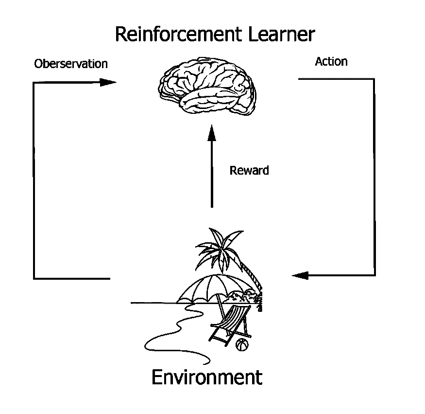

# 用强化学习和虚幻引擎创建涌现行为

> 原文：<https://towardsdatascience.com/creating-emergent-behaviors-with-reinforcement-learning-and-unreal-engine-4cd89c923b7f>

## 使用虚幻引擎和免费的 MindMaker 机器学习插件生成人工智能角色的紧急行为

在下面的文章中，我将讨论如何使用[虚幻引擎](https://www.unrealengine.com/en-US)、强化学习和免费的机器学习插件 [MindMaker](https://github.com/krumiaa/MindMaker) 在人工智能角色中生成紧急行为。目的是让感兴趣的读者可以将此作为在他们自己的游戏项目或具体的人工智能角色中创建紧急行为的指南。

## **什么是突现行为，为什么要使用它？**

首先是关于突现行为的初级读本。突现行为是指没有预先编程，而是响应某些环境刺激而有机发展的行为。突现行为是许多生命形式的共性，是进化本身的一种功能。这也是最近具体化人工代理的一个特征。当一个人采用涌现行为方法时，他不会为人工智能严格地编程特定的动作，而是允许它们通过一些适应性算法“进化”，如遗传编程、强化学习或蒙特卡罗方法。在这样的设置中——行为在开始时没有被预言，而是被允许基于级联的一系列事件“出现”,在某种程度上依赖于机会。

为什么人们会选择使用突现行为？一个主要原因是，涌现行为方法可以创造出行为更类似于碳基生命形式的人工智能代理，更不可预测，并显示出更大的战略行为多样性。

为娱乐或人类互动而设计的各种各样的具体化人工智能代理可以从紧急行为中受益，以便对它们的用户来说看起来不那么静态，更有吸引力。《自然》杂志上最近的一篇[期刊文章](https://www.nature.com/articles/d43978-022-00100-6)证明了机器人在反应时间和运动模式方面表现出更多的可变性，被认为更像人类。

紧急行为也可以克服用传统编程方法创造的其他形式的人工智能所不能克服的障碍。通过允许人工智能发现开发人员没有预见到的解决方案，代理可以探索比传统编程方法更广阔的解决方案空间。甚至有可能出现的行为方法可能导致人工一般智能的产生，这是一种可以与人类拥有的技能多样性相媲美的人工智能。

使用紧急行为方法有一个警告，但是，如果你想要创建一个非常特定的行为，例如精确地重复模仿特定动物的动作，紧急行为技术可能不是最好的选择。突现行为不太适合不需要变化的重复性高保真任务。这是为什么人类和其他有机生命形式可能在高度重复的任务中挣扎的原因之一，我们天生是可变的。此外，当试图复制特定的行为时，可能很难重现导致该行为模式在现实世界中出现的相同偶然事件。例如，某种生物适应或行为可能会进化出各种各样的解决方案来实现，其结果受偶然事件的影响。因此，并不是所有的新方法都一定会得到相同的解决方案。一个例子是趋同进化在几个场合下重建眼睛的方式，但不一定是完全相同的形式。

涌现行为方法有利于创造多种多样的行为，其中一些行为可能与真实动物的行为相似，但不太可能完全相同。另一方面，人们可以期待用这些方法产生大量有趣和独特的行为。例如，人们可以看到由强化学习代理发现的穿越风景的各种各样的[移动方法](https://www.youtube.com/watch?v=hx_bgoTF7bs)。

创造突发行为的第一步是决定你想让哪种行为成为突发行为，以及该行为的目标是什么。从某种意义上说，这是容易的部分。下一部分稍微复杂一点，需要概述一些涌现理论。

## 不同类型的紧急行为

当我们讨论突现的话题时，我们需要区分开放式突现和静态或“固定点”突现。在定点涌现中，一开始可能会出现各种各样的行为，但它们会稳定地收敛到一个单一的解决方案或策略，涌现的数量会随着时间的推移而减少。本质上，这发生在当问题有一个静态的全局解决方案时，而这个行为是用来解决这个问题的。考虑井字游戏:虽然采用强化学习或遗传算法等新兴技术的人工智能最初可能会在井字游戏中显示各种各样的策略，但它会相当快地收敛到游戏的单一主导解决方案。在这一点上，不会出现进一步的涌现或策略。

当我谈到突现行为时，我相信当人们接近这个话题时，他们通常想到的是“开放式突现”。在这种形式的涌现中，没有固定的解决方案，一个主体会不断产生新的行为。创造这种开放式涌现比创造固定点涌现更复杂，你必须考虑创造它所必需的结构。令人欣慰的是，最近在理解和编纂开放式涌现的要求方面取得了一些进展，特别是 Joel Liebo 和其他人在自动课程方面所做的工作。在一篇开创性的论文“[自主课程和来自社会互动的创新的出现](https://arxiv.org/abs/1903.00742)”中，作者列出了一些可以预期开放式涌现发生的条件。下面的表格将有助于理解什么时候会出现无止境的涌现。

## 开放式涌现的秘诀

1.其中，行为或目标的解决方案非常大，因此，对于所有的意图和目的，涌现的数量在检查的时间周期内看不到顶端。这不是真正的开放式涌现，因为可能存在全局解决方案，如果给予足够的时间，代理将发现并停止适应。然而在许多情况下，这可能超出了人类生命的时间跨度，所以从观察者的角度来看，这种出现将是无限的。一个例子可能是国际象棋游戏，其中一个全局解决方案被认为存在于井字游戏中，但由于游戏的复杂性，这还没有被发现，而且在我们的有生之年也不太可能。

2.创造开放式涌现的另一个方法是采用依赖于不断变化的环境的行为或目标状态。想想地球上的碳基生命形式——由于行星气候条件，环境在不断变化，这确保了动物必须始终适应才能生存，并且在出现水平上没有上限。

3.开放式涌现的第三种方法是多智能体场景，其中涉及合作或竞争，智能体采用一些适应性学习策略。在这种情况下，一个主体必须适应其同伴或竞争对手的策略，这反过来确保其他主体也必须适应，从而形成一个不断适应的反馈循环，这是一种进化军备竞赛。虽然这可能导致涌现，但也可能导致重复行为的循环，无限循环，直到环境中的某些因素将它们推出循环。这不是一个真正的均衡，因为行为或策略不是固定的，但循环本身成为一种均衡。确保环境足够复杂和动态，这是避免这些周期性行为或策略的一种方式。

## 展示开放式涌现

在下面用虚幻引擎创建的例子中，我选择使用上面列出的第三个配方，一个涉及两个虚拟物种的多代理场景。我们称其中一只为犀牛，另一只为老虎。两组人都在探索他们的环境，寻找“浆果”，在虚幻引擎游戏环境中，这些浆果以大型圆形物体的形式出现。让事情变得更复杂的是，这些浆果丛中随机分布着野生鸟类，它们会尖叫，吓跑老虎和犀牛。然而，如果一只老虎或犀牛与另一只老虎或犀牛一起接近浆果，它们会吓得鸟儿们不敢吱声。他们现在可以吃浆果了，尽管他们必须在彼此之间把浆果分开。

除了这种合作行为，它们还有一种竞争行为，在这种行为中，它们可以发出吼声(老虎)或开始跺脚(犀牛)，吓跑对手物种的代理人，但也消耗自己宝贵的能量。在许多方面，这种情况复制了自然界中动物和人类企业的一些合作和竞争权衡。

竞争或合作是最古老的问题之一，通过在虚拟绅士中模拟这一点，我们可以获得对导致各种竞争或合作结果的条件的宝贵见解。使用这样的虚拟代理，我们也可以创造出在动物王国甚至人类身上可以观察到的行为复杂性。OpenAI group 最近发表的一篇论文能够证明[工具使用](https://openai.com/blog/emergent-tool-use/)的出现是玩捉迷藏游戏的 AI 角色之间多智能体竞争的函数。

类似的事情也可以在任何一群适应性虚拟代理人身上发生，这些代理人会在彼此之间玩一个游戏，在这个游戏中，收益取决于其他玩家的策略，而环境会受到他们行为的影响。目标可以是任何东西，只是必须有一些方法让代理接收关于他们的环境的反馈，包括竞争者采取的行动和作为响应改变他们自己的行动的能力。这个目标是由玩家设定的还是由程序员设定的，从复杂程度上来说没有太大的区别。选择由玩家来设置它可以带来关于游戏叙事的有趣选项。需要注意的重要一点是——谁选择行为的目标并不重要，重要的是这符合上述竞争或合作的要求。

但是涌现实际上是如何“涌现”的呢？一种方法是使用强化学习或遗传算法。在我们的例子中，我们有一群虚拟代理人，他们随机改变行为来观察目标状态是否受到影响。代理优先考虑那些带来好结果的行为。在遗传算法中，这是通过一种在群体中发生的交叉函数来实现的，在这种情况下，随机发生的良好适应被保留，而相对不那么有用的适应被丢弃。这是由适应度函数决定的。这不需要看起来像有性生殖或任何类似的东西，因为现有的代理可以无缝地被它们适应的对应物取代，而用户看不到任何正在发生的交叉。在我们的例子中，我们将使用强化学习，这是一种算法技术，我已经在另一系列文章中广泛介绍过。

与遗传算法类似，强化学习依赖于大数定律，即给定足够多的随机行为，好的行动将会出现，并可以在未来进行优先排序。最初，代理人选择一系列随机的行为，但是如果这些行为导致代理人获得奖励，那么奖励的价值就归因于代理人采取的行为，因此在未来更有可能重复这些行为。当这个随机行为的过程被充分重复时，那些与接受奖励的代理人有因果关系的行为将与那些仅仅是偶然事件的行为区分开来。这就是为什么强化学习是核心，[一种因果算法](/cracking-cause-and-effect-with-reinforcement-learning-f3df8dfcd525)并可用于检测因果关系。

人们可以这样想象这个过程。

作者图片

为了这个项目，我使用了免费的[思维制造插件](https://www.unrealengine.com/marketplace/en-US/product/mindmaker-ai-plugin)和稳定基线强化学习算法套件。通过 MindMaker，我们可以使用 OpenAI Gym 格式在虚幻引擎游戏环境中轻松部署各种 RL 算法。这为在各种模拟环境中部署强化学习算法提供了一个通用的结构。

## 总结和未来发展

上面描述的简单设置导致一种情况，其中差异数字物种的行为不可能达到稳定的平衡。鸟类在浆果斑块中的随机分布确保了环境总是在变化，而这反过来又不断改变着代理商合作或竞争的潜在利益。代理人本身的活动也会影响有鸟类和没有鸟类的浆果斑块的比例——随着更多的代理人相互合作，合作的动力就会减少，因为没有鸟类的浆果斑块的比例会增加。

这个想法是，这些相互作用的力量创造了一个总是波动和不稳定的环境，推动着战略适应。鉴于我们的代理人与他们的环境互动的方式很少——他们不能利用环境中的物体诱捕竞争对手或隐藏浆果，我们的范式不太可能导致像紧急工具使用这样有趣的事情。然而，它确实避免了固定的均衡，并创造了不断变化的合作和竞争策略。这可以提供比开放世界视频游戏中通常出现的更有趣的一组行为。因此，我相信，像这里概述的这种新兴行为技术很可能会主导下一代视频游戏人工智能，创造出更有趣、更吸引人的角色和行为剧目。

Aaron Krumins 是“[智胜——强化学习的承诺和危险](https://www.amazon.com/Outsmarted-Reinforcement-Learning-Promise-Peril-ebook/dp/B08BG9FDC2)”的作者，拥有 web 应用和机器学习的背景。他目前是一名自由职业的机器学习顾问。