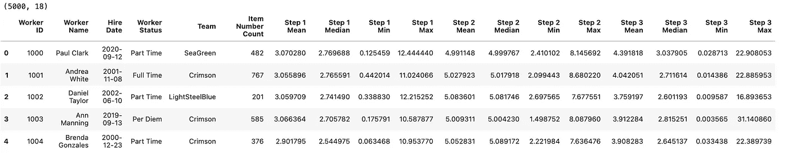
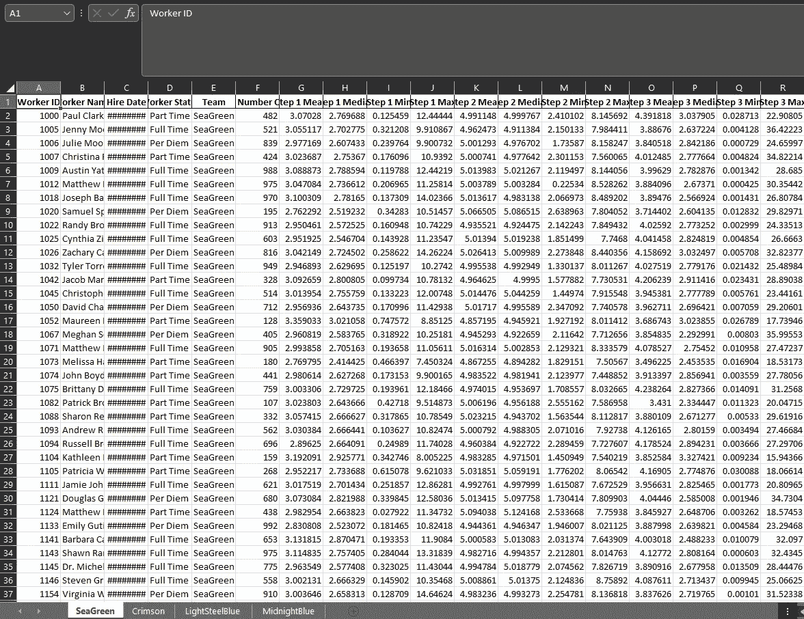
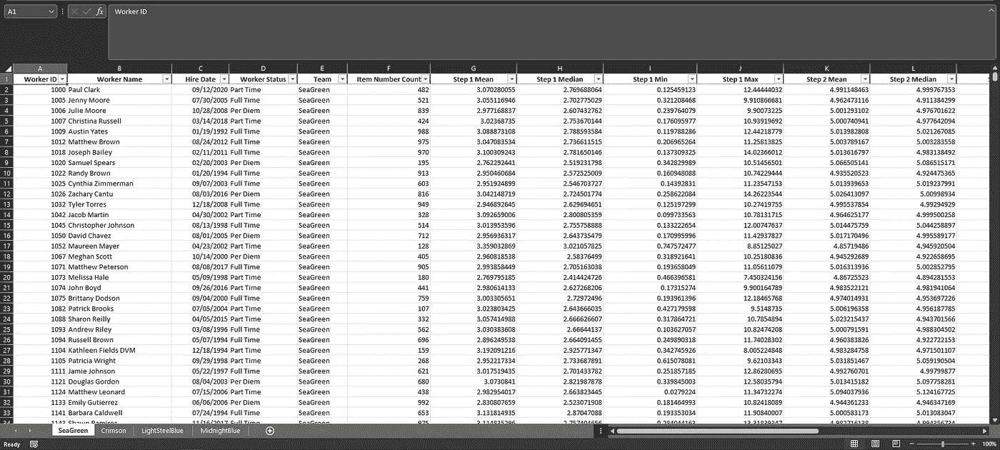

# 使用 Python 创建 Excel 报表

> 原文：<https://towardsdatascience.com/creating-excel-reports-with-python-e8c94072f09d>

## 如何在不打开 Excel 的情况下创建 Excel 文件


照片由[米卡·鲍梅斯特](https://unsplash.com/@mbaumi?utm_source=unsplash&utm_medium=referral&utm_content=creditCopyText)在 [Unsplash](https://unsplash.com/s/photos/excel?utm_source=unsplash&utm_medium=referral&utm_content=creditCopyText) 上拍摄

Excel 非常受欢迎。

从 [Investopedia](https://www.investopedia.com/articles/personal-finance/032415/importance-excel-business.asp) 来看，“在商业中，从字面上看，任何行业的任何职能都可以受益于那些拥有强大 Excel 知识的人。Excel 是一个强大的工具，已经成为全球业务流程中不可或缺的一部分”

业务用户喜欢 Excel，因此大量的报告需要在 Excel 中。

但这并不意味着我们必须使用 Excel 来处理数据。

在这里，我们将学习使用 Python 和 Pandas 创建 Excel 报表，而无需打开 Excel。

## 背景

作为一名数据分析师，我的第一个任务是在 Excel 中运行生产力报告。运行这个报告需要我手动下载两个大型数据集，将数据导入 Excel，合并数据，并执行计算。

因为数据集很大——至少对 Excel 来说——我经历了持续的滞后和可怕的死亡之轮。

它花了整整 8 个小时的工作日才完成。

然后，在我可以(当然是手动的)分发之前，它必须被发送给一个主管进行双重检查。

该报告必须每两周用新数据重新创建一次。在一年的时间里，仅复制一份报告就要花费超过 5 周的时间！

我知道一定有更好的方法。

## 任务

在这里，我们将使用 Python 为我们想象的小部件工厂创建一个 Excel 报表。

widget factory 委托我们创建一份报告，详细说明工人和团队创建 widget 的平均时间。他们希望报告是一个 Excel 文档，每个团队都有一张表格。

## 资料组

我们将继续使用我们在本文的[中创建的小部件工厂数据集，在那里我们通过 Python 生成假数据。](/generating-fake-data-with-python-c7a32c631b2a)

## 创建报告

我们所有的数据操作都是使用 Python 和 Pandas 完成的。

首先，我们使用 Pandas 读入数据集，并检查每个数据集的形状。

接下来，我们使用`.agg()`通过`worker_id`查找汇总统计数据。对数据进行分组后，我们就有了一个需要扁平化的具有多索引的分组数据集。

我们还想处理一些列标题的格式。当我们写到 Excel 时，我们希望标题是漂亮的，所以我们现在可以处理它了。

最后，我们将分组的数据集合并回工人数据集，以获得工人姓名和团队。



按员工分类的汇总统计数据—按作者分类的图片

我们将数据集形状打印为双重检查，以确保我们对数据集的操作和合并是正确的。我们可以看到我们有 5000 行，并且确信这是正确的，因为 worker 数据集也有 5000 行。

下一步是为每个团队将数据分割成单独的数据帧。

首先，我们需要一个独特的团队名称列表。我们可以使用`unique()`来寻找唯一的名字，而不是硬编码这些名字。这将有助于防止将来数据发生变化——我们的代码不会崩溃！

接下来，我们创建一个空字典，用于存储团队数据帧。

最后，我们遍历各个团队，为每个团队创建一个新的数据帧，并将其存储在字典中，关键字是团队名称。

我们通过打印每个团队数据帧的形状来仔细检查这是否如预期的那样工作。正如所料，这些行加起来有 5000 行！

现在，我们准备将最终报告写入 Excel。

## 写入 Excel

我们将使用 Pandas 和 XlsxWriter 创建我们的 Excel 报表。

[XlsxWriter](https://xlsxwriter.readthedocs.io/) 是熊猫用来编写 Excel 的 XLSX 格式文件的默认模块。

可以使用以下命令安装它:

```
pip install xlsxwriter
```

首先，我们创建一个变量来存储文件名和路径。

接下来，我们使用 Pandas 的`ExcelWriter`来编写我们的 Excel 文件。

熊猫的文档指示:“作者应该被用作上下文管理器。”非常简单，这告诉我们应该将代码包装在一个`with`块中，以确保我们的外部资源(这里是我们正在创建的 Excel 文件)在我们完成后关闭。

最后，遍历我们的数据帧字典，将每个数据帧写到它自己的表中。

我们现在可以在 Excel 中打开完成的报告了！



已完成的 Excel 报告—作者图片

虽然我们已经成功地将报告写到 Excel 中，并为每个团队提供了单独的表格，但它看起来并不漂亮。

让我们添加一些格式来改善该报告的外观:

我们为每列添加了下拉箭头，冻结了顶行，并为每列的宽度添加了适当的间距。



带格式的 Excel 报表-按作者排序的图像

这样看起来好多了！我们的报告现在可以分发了！

## 结论

在这里，我们学习了使用 Python、Pandas 和 XlsxWriter 创建 Excel 报表。

虽然我们只触及了 XlsxWriter 功能的表面，但我们能够使用 Python 创建 Excel 报表，而无需打开 Excel！