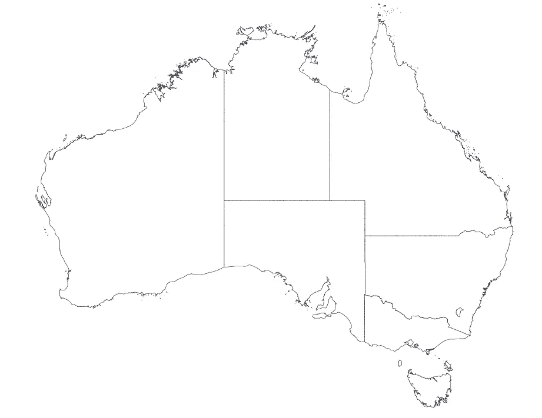
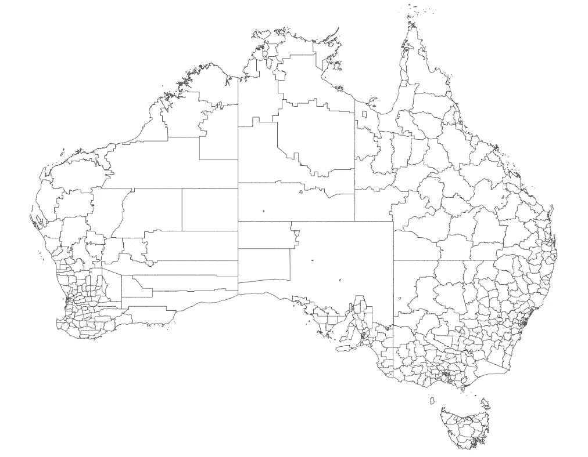
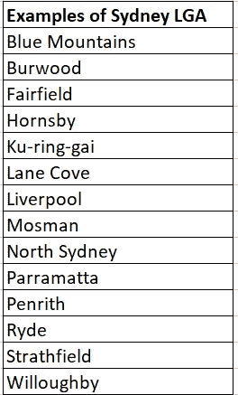
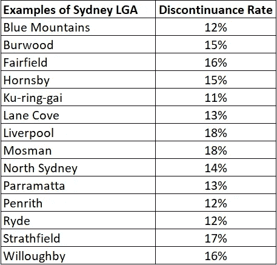
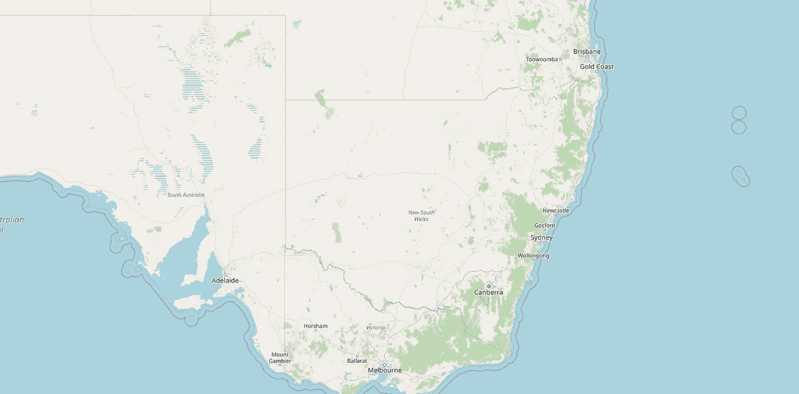
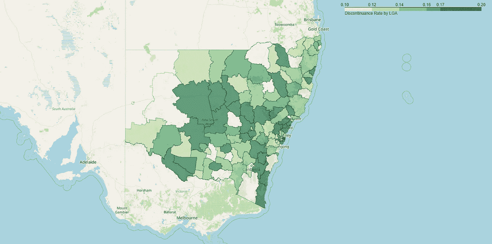
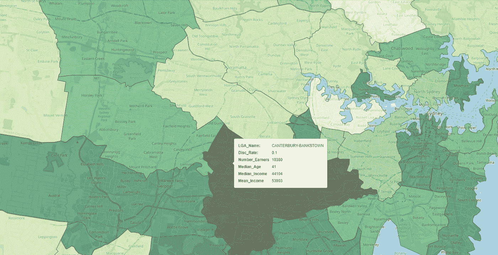

# 使用 Python 创建交互式地理空间可视化

> 原文：<https://towardsdatascience.com/creating-interactive-geospatial-visualisation-75a2dfaf7e59>

# 使用 Python 创建交互式地理空间可视化

## 从提取几何数据到创建交互式图表—逐步指南


德尔菲·德拉鲁阿在 [Unsplash](https://unsplash.com?utm_source=medium&utm_medium=referral) 上拍摄的照片

# 背景

最近，在澳大利亚的新南威尔士州，许多地理位置被政府宣布为新冠肺炎传播的关注区域，与其他区域相比，记录了相对更多的病例。

当时(大约在 2021 年 7 月)，澳大利亚针对新冠肺炎采取了一种传播最小化策略。因此，对这些受关注地区的居民实施了更严格的公共卫生命令和限制(“封锁措施”)，这意味着更少的人被允许离开家园进行非必要的活动(如外出就餐)，提供非必要服务的当地企业(如咖啡馆和餐馆)被迫暂时关闭。这影响了消费，并对人们的收入产生了流动效应。请注意，这也可以推广到其他有严格封锁措施的地区，如 2021 年 9 月的整个维多利亚州，或 2021 年的一些欧洲国家。

从人寿保险公司(本文作者是该公司的精算师)的角度来看，锁定措施可能会间接导致人寿保险保单的投保人因家庭可支配收入减少而停止向人寿保险公司续保(“终止”)。

为此，我的公司委派我了解封锁措施是否对澳大利亚某些地理位置的中断率有影响。要做到这一点，没有比在地图上可视化地理区域的中断率更好的方法了，这是我意识到对一个人来说，实施提取几何数据的工作流程，用正确的软件包在 Pyhon 中应用可视化，并最终创建一个综合的同时显示所需信息的交互式图表是多么困难。

鉴于上述动机，本文提供了一步一步的指南，以创建一个交互式图表，显示在悉尼按地理区域的中断率。虽然这个用例是用澳大利亚的几何数据呈现的，但它可以很容易地扩展到世界上的其他地理区域。

# 中止及其重要性

在澳大利亚，零售市场上的寿险保单主要是由我们称之为金融顾问的中介机构销售的。金融顾问会因成功销售而获得初始佣金。

大多数保单都是以高额初始佣金售出的。在 2018 年之前，这可能会远远超过首年保费的 110%。这种佣金结构通常被称为“预付”结构，这意味着在保单有效期内支付的大部分佣金在保单生效时支付。

如果投保人在出售后不久(比如一两年内)终止保单，人寿保险公司将遭受损失，因为它无法收回支付给财务顾问的初始佣金。事实上，人寿保险公司通常需要 5-7 年的时间才能从保单中赚钱。这就是为什么终止保险很重要，而且大多数公司都投入大量资金来留住现有的投保人。

# 提取几何数据

澳大利亚地图可以通过各种数字边界划分成地理区域。一个例子是将澳大利亚地图按州界分成九个州。同样，澳大利亚的地图可以用其他类型的边界划分成更多的自然区域。下图分别显示了以州界和地方政府区域(“ **LGA** ”)为界划分的澳洲地图。



图 1:澳大利亚的州界。图片作者。



图 2:LGA 边界旁的澳洲。图片作者。

前面提到的宣布为关注区的地理位置是在 LGA 一级宣布的。对于悉尼的居民来说，你可能熟悉下面显示的一些地方政府。



表 3: LGA 的例子。按作者分类的表格

几何数据通常以 json 或 shapefile 格式提供。这些都是由澳大利亚政府机构发布的。出于本文的目的，我将提取新南威尔士的 LGA 的几何数据，这些数据可通过 LGA 数字边界[在这里](https://data.gov.au/data/dataset/nsw-local-government-areas)获得。

可以使用 Python geopandas 包读取几何数据，如下所示:

```
## path_LGA_geo refers to the path to the json file downloaded 
## from the link abovedf_LGA_geo = geopandas.read_file(path_LGA_geo) ## In practice, we'll only need two fields from the dataframe,  
## namely the locality name, denoted by 'nsw_lga__3', and the 
## geometry arrays, denoted by 'geometry'df_LGA_geo_final = df_LGA_geo[['nsw_lga__3','geometry']].drop_duplicates(subset ="nsw_lga__3",keep = False, inplace = False)
```

如果你没有太多的计算资源，你可以按照这个[链接](https://www.statsilk.com/maps/simplify-map-reducing-file-size-and-loading-time)中的说明选择缩小 json 或 shapefile。

# 按地理区域提取中断率

在高层次上，中止率可以被校准为中止的保单数量与有效保单总数之比。由于我们跟踪已中止和有效的投保人，中止率可以在邮政区域级别(即通过邮政编码)进行校准。

然而，与 LGA 相比，邮政区域代表了不同类型的数字边界。幸运的是，澳大利亚统计局在这本[出版物](https://data.gov.au/data/dataset/asgs-geographic-correspondences-2016)中提供了邮政区域和 LGA 之间的地图。通过下载 ASGS 通信(2016)，可以在“*CA _ POSTCODE _ 2018 _ LGA _ 2018 . xlsx*”文件中找到该映射。

我顺便提一下，同一出版物中还提供了数字边界的其他映射，如统计区域到 LGA、统计区域到地区(即郊区)等。这为用户提供了在不同粒度级别切割几何数据的选项。

一旦邮政编码被映射到新南威尔士州的 LGA，就可以通过地方政府机构汇总中止的保单数量和有效的保单数量，并通过地方政府机构校准中止率。然后，这些可以以表格格式存储，如下所示。请注意，出于本文的目的，显示的中断率是合成的(尽管受到实际范围的限制)。



表 4:示例数据帧。按作者分类的表格

然后，可以使用下面的 Python 代码将数据帧与几何数据帧连接起来:

```
## Joining geometry data with discontinuance rate data
## df_LGA_lapse is a dataframe containing discontinuance rate by 
## LGAsdf_geo_disc_merge = df_LGA_geo_final.merge(df_LGA_lapse,left_on = 'nsw_lga__3', right_on = 'LGA_Name')
```

# 创建可视化

我将使用 Python 包来创建可视化。关于这个包的文档使用，请参考这个 [Github 页面](https://python-visualization.github.io/folium/)。

还有其他可视化工作所需的包。如果你正在使用 Google Colab，你可以安装和导入如下的包。


图 5:必需的包。作者图片

然后可以通过以下四(4)个步骤创建交互式可视化。

**第一步:获取中心坐标**

这是为了确保观想“打开”在被绘制的集体地理区域的中心，在这种情况下，是新南威尔士州的中心，也就是澳大利亚地图右下角附近的州。

```
# Obtain center cordinates of the mapx_center = df_geo_disc_merge.centroid.x.mean()y_center = df_geo_disc_merge.centroid.y.mean()
```

**第二步:创建地图的基础图层**

```
## Create the base layernsw_disc_map = folium.Map(location = [y_center, x_center], zoom_start = 6, tiles = None)folium.TileLayer('OpenStreetMap', name = "Actl Map", control = True).add_to(nsw_disc_map) nsw_disc_map
```

上面的 Python 代码创建了地图的基础图层，该图层在中心坐标处打开。这个基础图层有一个“OpenStreetMap”的图块样式，如下图所示。您可以根据 Folium 文档[在这里](https://python-visualization.github.io/folium/modules.html)使用样式选项定制图块集(并搜索图块图层类)。



图 6:树叶地图的基础层。作者图片

**第三步:将 LGA 的中止率添加到基础层**

可以使用下面的 Python 代码将 LGA 的中断率图层添加到地图的基础图层上。

```
set_quantile = (df_geo_disc_merge['Discontinuance_Rate'].quantile((0.0, 0.2, 0.4, 0.6, 0.8, 1.0))).tolist()nsw_disc_map.choropleth(geo_data = df_LGA_geo_final,name = 'Choropleth',data = df_geo_disc_merge,columns=['LGA_Name','Discontinuance_Rate'],key_on = 'feature.properties.nsw_lga__3',fill_color = 'YlGn',fill_opacity = 0.6,line_opacity = 0.3,threshold_scale = set_quantile,legend_name = 'Discontinuance Rate by LGA',smooth_factor = 0,highlight = True) nsw_disc_map
```

如下图所示，在添加的图层中引入了一些不错的功能。即:

*   LGA 的数字边界已经在新南威尔士州绘制出来，每个 LGA 都由一块以绿色突出显示的土地表示。
*   中断率以 5 个分位数的色标显示(代码中有 set_quantile 自定义)，由地图右上角显示的不同绿色色标表示。



图 7:地图中 LGA 图层的中断率。作者图片

**步骤 4:创建工具提示交互**

让我们通过添加工具提示层来使地图具有交互性。想法是，当您将鼠标光标悬停在地图上的特定 LGA 上时，将会出现一个工具提示，并显示有关 LGA 的某些信息，在本例中为中断率。

这可以通过以下 Python 代码来实现。

```
## Add a tooltip layer add_tooltip = folium.features.GeoJson(df_geo_disc_merge, tooltip = folium.features.GeoJsonTooltip(fields=['LGA_Name', 'Discontinuance_Rate'],aliases = ['LGA_Name: ' ,'Disc_Rate: '],))nsw_disc_map.add_child(add_tooltip)nsw_disc_map.keep_in_front(add_tooltip)nsw_disc_map
```

下面的短片展示了本练习的最终结果。

视频 8:交互式地图演示。作者提供的视频

您可以通过自定义样式和高亮功能来进一步设置地图的样式，这些功能可以嵌入到工具提示层中。互动 Choropleth 地图教程是一个学习的好地方。

**工具提示上有更多！**

实际上，您可以在工具提示上显示更多信息，只要您可以在与地图相同的位置级别上收集信息(在本例中为 LGA)。例如，我在工具提示中添加了收入数据，如 LGA 的收入者的计数、中值年龄、平均值和平均收入，如下图所示。收入数据可以从[这里](https://www.abs.gov.au/statistics/labour/earnings-and-work-hours/personal-income-australia/latest-release)获得。

此外，我设置的不透明度让我可以看到地图顶层下面的郊区，这是另一个很好的功能。



图 9:带有输入数据工具提示。作者图片

作为一名精算师，可视化之后可以进行一些按地理区域划分的收入与中止率的分析，这可能证明是有见地的。

我能想到的其他使用案例包括:

*   将此与自然风险数据(如干旱、森林火灾、地震或与洪水相关的地区)叠加，以确定公司的投资组合受影响的程度，并告知公司是否要向受影响的投保人提供保费减免。
*   通过地理区域(可能还有财务顾问)可视化销售数据来发现机会。

# 结论

我将几何数据视为半非结构化数据的一种形式，与文本和图像等其他非结构化数据一样，对其进行导航并最终将其可视化在地图上可能很困难。

在本文中，我提供了一个逐步指南，介绍如何使用 Python follow 包创建交互式地图。请注意，虽然本文中讨论的用例是在澳大利亚的环境中，但是您可以很容易地将其扩展到其他管辖区域，就像替换澳大利亚的几何数据一样简单。

对于对保险行业的其他数据科学应用感兴趣的读者，请关注我，并愉快地阅读我在[媒体](https://jin-cui.medium.com/)上的文章。

# 参考

[1]澳大利亚统计局(2021) [*新南威尔士州地方政府区域—地理景观行政边界*](https://data.gov.au/data/dataset/nsw-local-government-areas) *，* ABS 网站，2022 年 1 月 14 日访问，(在[https://creativecommons.org/licenses/by/4.0/](https://creativecommons.org/licenses/by/4.0/)获得许可)

[2]澳大利亚统计局(2021)[*【ASGS 地理通讯(2016)*](https://data.gov.au/data/dataset/asgs-geographic-correspondences-2016) *，* ABS 网站，2022 年 1 月 14 日访问，([在 https://creativecommons.org/licenses/by/4.0/获得许可](https://creativecommons.org/licenses/by/4.0/))

[3]澳大利亚统计局(2021) [*澳大利亚个人收入*](https://www.abs.gov.au/statistics/labour/earnings-and-work-hours/personal-income-australia/latest-release) *，* ABS 网站，2022 年 1 月 15 日访问，([https://creativecommons.org/licenses/by/4.0/许可](https://creativecommons.org/licenses/by/4.0/))