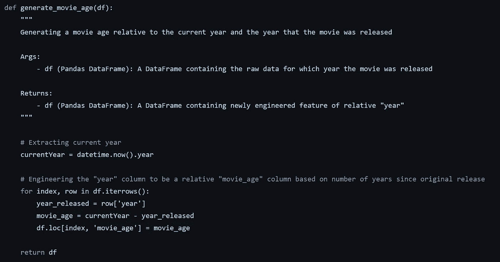
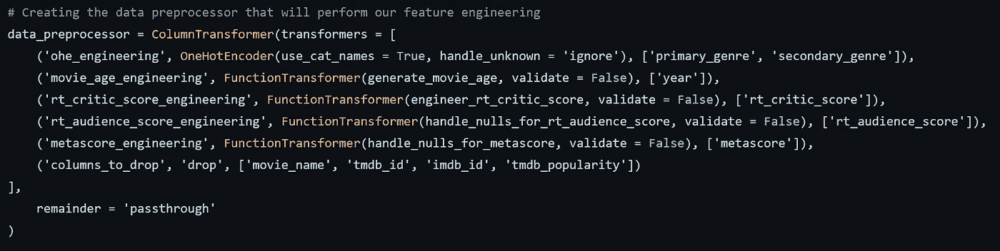
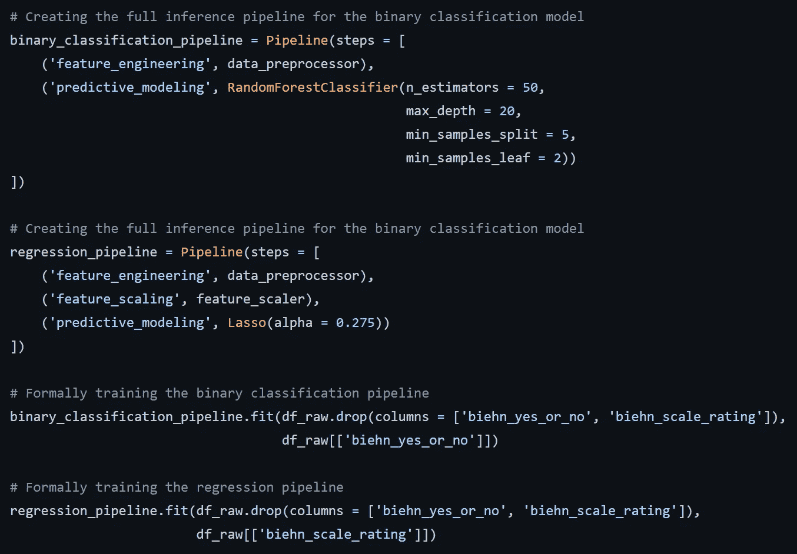
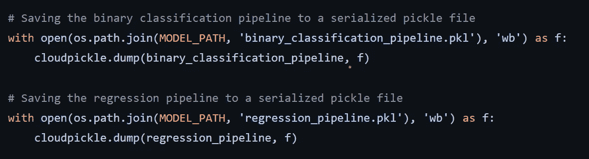

# 创建电影分级模型第 4 部分:创建完整的模型培训渠道

> 原文：<https://towardsdatascience.com/creating-movie-rating-model-part-4-creating-a-full-model-training-pipeline-d52f54fd03c4>

## 将我们的特征工程和模型训练代码正式化为单一管道


作者创作的标题卡

你好，朋友们！我们回到创建电影分级模型系列的第 4 部分。如果你想看这个系列之前的帖子，请[查看这个链接](https://medium.com/tag/dkhundley-movie-model/archive)，你也可以在[我的个人 GitHub 库](https://github.com/dkhundley/movie-ratings-model)找到整个项目的代码。简单回顾一下我们停下来的地方，我们之前的帖子测试了许多不同的算法候选项，用作我们的最终模型。提醒一下，我们在技术上构建了两个模型:一个预测电影评论者 Caelan Biehn 给出的二元“是/否”电影评级，另一个预测评论者以基于回归的模型形式给出的 0-10 分。

在测试了许多不同的算法后，我们决定使用 **Scikit-Learn 的 RandomForestClassifier** 用于二元分类模型，使用 **Scikit-Learn 的** **Lasso 回归**用于回归模型。现在，我们已经准备好创建一个正式的模型培训管道。现在，如果到目前为止您已经了解了这个系列，那么我们主要是在 Jupyter 笔记本上完成我们的工作。因为理想情况下，我们希望将这样的训练脚本集成到类似 MLOps 管道的东西中，所以最好将它转换为 Python 文件。

让我们假设，当我们在将来收集用于推理的数据时，在将数据输入模型之前，在运用特征工程来清理数据之前，它将看起来是相同的原始格式。如果是这种情况，我们可以利用 Scikit-Learn 库提供的**一个特殊的** [**管道**](https://scikit-learn.org/stable/modules/generated/sklearn.pipeline.Pipeline.html) **对象。这个 Scikit-Learn 管道本质上允许您做的是将一组事物链接在一起，如数据工程和模型推理，在一个单一的无缝管道中。只需插入您的原始数据，并在另一边得到一个推论，而无需在中间忙乱数据工程！**

我知道我们这样做已经有一段时间了，但是你还记得我们为执行特征工程而创建的所有自定义函数吗？我们将再次使用所有这些文件，为了方便起见，我将它们都放在了 [this helpers.py 文件](https://github.com/dkhundley/movie-ratings-model/blob/main/container/model-training/helpers.py)中。这是我们写的其中一个函数的例子:



作者截图

因为我们需要对几乎所有的原始特征执行特征工程，所以我们需要在实际使用 Scikit-Learn Pipeline 对象之前做一些事情。也就是说，我们需要建立一个[**column transformer**](https://scikit-learn.org/stable/modules/generated/sklearn.compose.ColumnTransformer.html)，它也是由 Scikit-Learn 库提供的。让我继续向您展示代码，我们将在下面解释它在做什么，因为它非常忙。



作者截图

好吧，尽管这里有很多东西，但实际上很容易理解。基本上，我们正在定义如何正确地转换每一列。在以`ohe_engineering`开始的行中，我们使用一个 OneHotEncoder 对象对右边的特征`primary_genre`和`secondary_genre`进行一次热编码。每个转换器有 3 个部分:转换的名称(您可以随意称呼它)，需要进行什么转换，以及在哪些列上执行转换。

在我们上面提到的`ohe_engineering`例子中，我们使用了一个“默认的”OneHotEncoder 对象来执行简单的一键编码。但是如果我们想使用我们自己的自定义函数呢？正如你在其他每个转换器中看到的，我们正是在 Scikit-Learn 的 [FunctionTransformer](https://scikit-learn.org/stable/modules/generated/sklearn.preprocessing.FunctionTransformer.html) 的帮助下做到这一点的。看看以`movie_age_engineering`开头的那一行。请注意，我们在中间有这段代码:

```
FunctionTransformer(generate_movie_age, validate = False)
```

这正是使用我们在上面分享的第一个截图中定义的函数。同样，我们在每个其他转换器中使用我们各自的定制函数，并针对适当的原始列运行它们。非常酷！在继续之前，还要注意最后一个 transformer 是一个默认的`columns_to_drop`功能，正如您所猜测的，它删除了不需要的特性。此外，确保将`remainder`参数设置为`passthrough`，以确保任何其他已经可以从原始状态进入另一端的列。如果这个`remainder`参数设置不正确，默认行为是删除任何没有明确提到的特性。对我们来说不理想！

好了，我们的 ColumnTransformer 一切就绪，我们现在准备实例化并利用 Scikit-Learn 管道对象。到目前为止，我们已经完成了繁重的工作，所以从这里开始，一切都是下坡路了！请记住，我们在这里有两个单独的模型要训练，所以您在这里基本上会看到双倍的代码。对于这些模型中的每一个，以下是实例化管道对象并执行训练的代码:



作者截图

正如您所看到的管道实例化，实际上集成模型算法作为最终的管道步骤与我们在不使用管道的情况下实例化算法的方式完全相同。此外，请注意，当我们根据训练数据训练管道时，我们会调用与模型算法对象完全相同的`fit()`函数，而不使用管道。同样，当我们稍后使用这些模型来执行推理时，我们将对经过训练的管道使用相同的`predict()`，就像我们对任何独立的经过训练的算法一样。不错！

说到推理，我们将在稍后使用这些经过训练的管道，所以让我们用下面的代码将它们导出到序列化的 pickle 文件中:



作者截图

如果你想知道我为什么使用`cloudpickle`来执行序列化，这是因为我的新 Mac mini 采用了新的苹果硅芯片，与标准的`pickle`库和 Scikit-Learn 的`joblib`都不完全匹配。在做了一些研究之后，我发现`cloudpickle`库工作得很好，它在我的 Windows 笔记本电脑上也工作得很好。

(如果你想看看完整的、有凝聚力的培训脚本是什么样子，请查看这个 train.py 文件。)

这个帖子到此为止！我们还没有完成这个系列。在接下来的几篇文章中，我们将把这些经过训练的模型转换成一个简单的网页，并带有后端 API，允许人们插入电影标题来生成预测的电影评论分数。敬请关注这些帖子，并感谢您的阅读！🎬