# 创建回归模型以预测数据响应

> 原文：<https://towardsdatascience.com/creating-regression-models-to-predict-data-responses-120b0e3f6e90>

## 学习从头开始创建和编写回归模型，以预测结果


凯利·西克玛在 [Unsplash](https://unsplash.com?utm_source=medium&utm_medium=referral) 上的照片

回归分析可以描述为一种统计技术，用于在给定一个或多个自变量(预测因子或特征)值的情况下，预测/预报因变量(响应)的值。回归被认为是监督机器学习的一种形式；这是一种建立数学模型以确定输入和期望输出之间关系的算法。可以生成的回归模型数不胜数，所以让我们先介绍一下回归数学，然后跳到三个常见的模型。

## 回归数学

在我们看任何代码之前，我们应该了解一点回归模型背后的数学。如前所述，回归模型可以有多个输入变量或特征，但是对于本文，为了简单起见，我们将使用单个特征。回归分析包括猜测哪种类型的函数最适合您的数据集，是直线函数、n 次多项式函数还是对数函数等。回归模型假设数据集遵循以下形式:

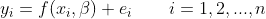

这里， *x* 和 *y* 是我们在观察点 *i* 的特征和响应， *e* 是误差项。回归模型的目标是估计函数 *f* ，使其最接近数据集(忽略误差项)。函数 *f* 是我们对哪种类型的函数最适合数据集的猜测。当我们看到例子时，这将变得更加清楚。为了估计函数，我们需要估计 *β* 系数。最常见的方法是普通最小二乘法，它可以最小化数据集和函数之间的误差平方和。

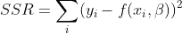

最小化平方误差将导致我们的 *β* 系数的估计，标记为 *β* -hat。可以使用由普通最小二乘法得出的正规方程来获得估计值:

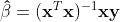

反过来，我们可以使用这些估计的 *β* 系数来创建我们的响应变量 *y* 的估计值。

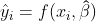

这里的 *y* -hat 值是一个观察值 *i* 的预测值。通过使用我们估计的 *β* 系数和特征值 *x* 来生成预测。

为了确定我们的回归模型表现如何，我们可以计算 R 平方系数。此系数评估回归模型预测周围数据集的分散程度。换句话说，这是回归模型与原始数据集的拟合程度。通常，该值越接近 1.0，拟合度越好。

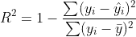

为了正确评估您的回归模型，您应该比较多个模型(函数， *f* )的 R 平方值，然后决定使用哪个模型来预测未来值。让我们开始编码，以便更好地理解回归模型的概念。

## 导入库

对于这些示例，我们将需要以下库和包:

*   *NumPy* 用于创建数值数组(为方便调用，定义为 *np*
*   *NumPy* 中的 *random* 用于在函数中创建噪声，以模拟真实世界的数据集
*   来自 *matplotlib* 的 *pyplot* 用于显示我们的数据和趋势线

```
# Importing Libraries and Packages
import numpy as np
from numpy import random
import matplotlib.pyplot as plt
```

## 创建和显示测试数据集

为了创建数据集，我们可以创建一个作为我们的特征的`x`数组和一个作为我们的响应的`y`数组。`y`数组是一个任意指数函数。使用*随机*包，我们将在我们的数据中引入噪声来模拟某种真实世界的数据。

```
# Creating Data
x = np.linspace(0, 4, 500)  # n = 500 observations
random.seed(10)  # For consistent results run-to-run
noise = np.random.normal(0, 1, x.shape)
y = 0.25 * np.exp(x) + noise

# Displaying Data
fig = plt.figure()
plt.scatter(x, y, s=3)
plt.title("Test Data")
plt.xlabel("x")
plt.ylabel("y")
plt.show()
```

以下是我们应用回归分析的数据集:

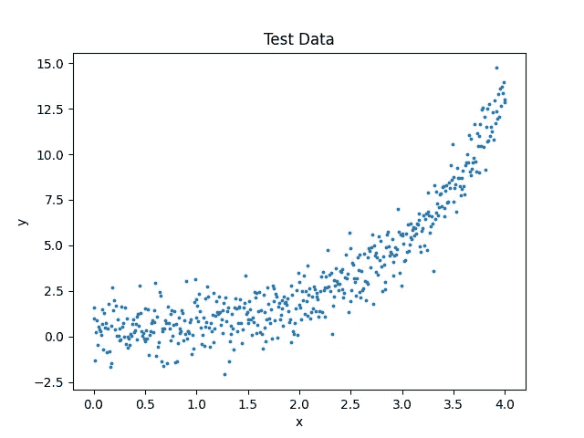

测试数据[由作者创建]

让我们花点时间来看看这个情节。我们知道使用了一个指数方程来创建该数据，但是如果我们不知道该信息(如果您正在执行回归分析，您就不会知道)，我们可能会查看该数据并认为二次多项式最适合数据集。然而，作为最佳实践，您应该评估几个不同的模型，看看哪一个性能最好。然后，您将使用最佳模型来创建您的预测。现在让我们分别来看几个回归模型，看看它们的结果如何比较。

## 线性回归

正如在数学部分提到的，对于回归分析，你猜测一个模型，或函数。对于线性模型，我们的函数采用以下形式， *f* :

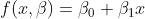

下一步是为估计我们的 *β* 系数的正规方程(在数学部分)创建矩阵。它们应该如下所示:

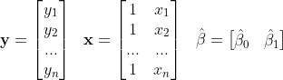

使用我们的数据集，我们估计的 *β* 系数以及线性回归模型将为:

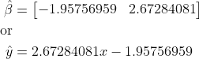

```
# Linear Regression
X = np.array([np.ones(x.shape), x]).T
X = np.reshape(X, [500, 2])

# Normal Equation: Beta coefficient estimate
b = np.linalg.inv(X.T @ X) @ X.T @ np.array(y)
print(b)

# Predicted y values and R-squared
y_pred = b[0] + b[1] * x
r2 = 1 - sum((y - y_pred) ** 2)/sum((y - np.mean(y)) ** 2)

# Displaying Data
fig = plt.figure()
plt.scatter(x, y, s=3)
plt.plot(x, y_pred, c='red')
plt.title("Linear Model (R$^2$ = " + str(r2) + ")")
plt.xlabel("x")
plt.ylabel("y")
plt.legend(["Data", "Predicted"])
plt.show()
```

生成的回归模型如下所示:

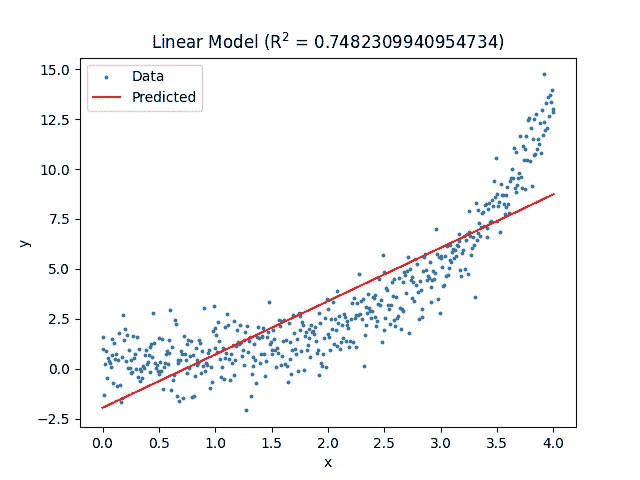

测试数据[由作者创建]

正如图的标题所示，线性回归模型的 R 平方值约为 0.75。这意味着线性模型符合数据，但如果我们收集更多的数据，我们可能会看到 R 平方的值大幅下降。

## 多项式回归

多项式回归的一般形式如下:

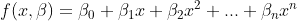

本文将函数 *f* 的形式显示为二阶多项式。您可以以类似的方式添加更多的多项式项来满足您的需求；但是，要警惕过度拟合。

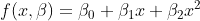

创建正规方程的矩阵给出如下:


使用这些矩阵，估计的 *β* 系数和多项式回归模型将为:

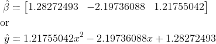

```
# Polynomial Regression
X = np.array([np.ones(x.shape), x, x ** 2]).T
X = np.reshape(X, [500, 3])

# Normal Equation: Beta coefficient estimate
b = np.linalg.inv(X.T @ X) @ X.T @ np.array(y)
print(b)

# Predicted y values and R-squared
y_pred = b[0] + b[1] * x + b[2] * x ** 2
r2 = 1 - sum((y - y_pred) ** 2)/sum((y - np.mean(y)) ** 2)

# Displaying Data
fig = plt.figure()
plt.scatter(x, y, s=3)
plt.plot(x, y_pred, c='red')
plt.title("2$^{nd}$ Degree Poly. Model (R$^2$ = " + str(r2) + ")")
plt.xlabel("x")
plt.ylabel("y")
plt.legend(["Data", "Predicted"])
plt.show()
```

由此产生的情节:

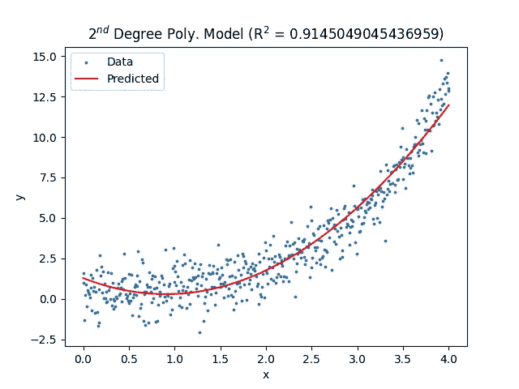

测试数据[由作者创建]

请注意，二次多项式在匹配数据集方面做得更好，其 R 平方值约为 0.91。然而，如果我们看数据集的末尾，我们会注意到模型低估了这些数据点。这应该鼓励我们研究其他模型。

## 指数回归

如果我们决定不采用多项式模型，我们的下一个选择可能是以下形式的指数模型:

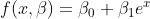

同样，创建法线方程的矩阵给出如下:

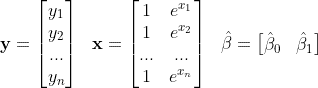

现在，有了估计的 *β* 系数，回归模型将是:

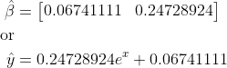

请注意，指数项的领先系数与模拟数据领先系数非常匹配。

```
# Exponential Regression
X = np.array([np.ones(x.shape), np.exp(x)]).T
X = np.reshape(X, [500, 2])

# Normal Equation: Beta coefficient estimate
b = np.linalg.inv(X.T @ X) @ X.T @ np.array(y)
print(b)

# Predicted y values and R-squared
y_pred = b[0] + b[1]*np.exp(x)
r2 = 1 - sum((y - y_pred) ** 2)/sum((y - np.mean(y)) ** 2)

# Displaying Data
fig = plt.figure()
plt.scatter(x, y, s=3)
plt.plot(x, y_pred, c='red')
plt.title("Exponential Model (R$^2$ = " + str(r2) + ")")
plt.xlabel("x")
plt.ylabel("y")
plt.legend(["Data", "Predicted"])
plt.show()
```

最终的数字:


测试数据[由作者创建]

请注意，与二次多项式模型相比，R 平方值有所提高。更有希望的是，数据集的末端比二次多项式更适合此模型。给定这些信息，我们应该使用指数模型来预测未来的 *y* 值，以获得尽可能精确的结果。

文章到此结束。希望这能让您了解如何在 Python 中执行回归分析，以及如何在现实场景中正确使用它。如果你学到了什么，给我一个关注，看看我关于空间、数学和 Python 的其他文章！谢谢大家！