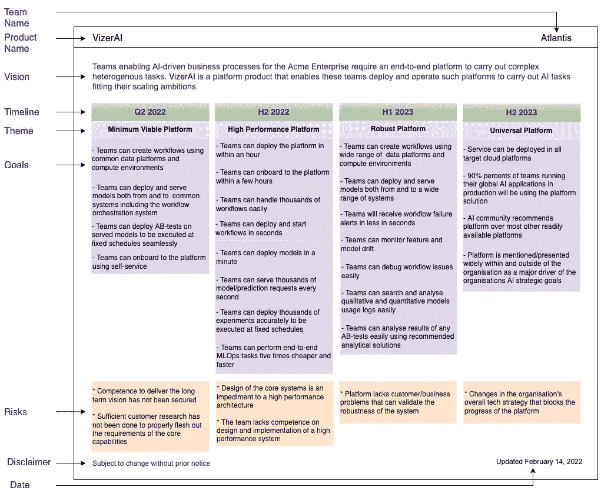

# 为人工智能平台创建路线图

> 原文：<https://towardsdatascience.com/creating-roadmap-for-internal-ai-platform-product-in-an-enterprise-ce60b77df25f>

## AI 平台团队的产品路线图应该考虑哪些？

灰色滚柏油路下多云的天空。照片由[皮查拜](https://www.pexels.com/@pixabay?utm_content=attributionCopyText&utm_medium=referral&utm_source=pexels)从[派克斯](https://www.pexels.com/photo/gray-rolled-asphalt-road-under-cloudy-sky-52531/?utm_content=attributionCopyText&utm_medium=referral&utm_source=pexels)拍摄。

组织的技术战略目标主要通过其技术平台来实现。这些产品的路线图对于获得组织内关键利益相关者的认可至关重要。因此，路线图对于将技术战略引向正确的方向至关重要。

**路线图在高层次上描述了团队实现其产品愿景的方式。**它可以用许多不同的方式来表现，比如看板、幻灯片、excel 文件等。，显示时间线上的详细信息。

# 人工智能平台产品路线图

一个组织的人工智能愿景需要具有不同能力的平台产品。本组织需要以下平台

*   应用研究
*   代码版本控制、持续集成和持续部署
*   数据摄取、功能管理
*   模型版本控制，模型管理
*   大规模在线/批量培训
*   大规模在线/批量服务
*   …

通常情况下，组织无法为每一项功能提供单独的产品团队。相反，一个团队选择在一个人工智能平台产品下解决其中的几个功能，该产品结合了供应商管理/提供的以及自行开发的解决方案。这种产品的路线图定义了如何在可预见的时间内实现产品的最终愿景，并指示团队如何组合漏斗以实现愿景。

打算使用这样一个平台的人工智能团队是**客户**。参与批准预算和承担 AI 平台开发和维护成本的组织内的团体是其**利益相关者**。其他团队，如数据平台团队，其路线图受其路线图影响，也是其**利益相关方**。

# 路线图的质量

为人工智能平台产品提出一个好的路线图是很棘手的，特别是当多个团队使用的产品可能在功能上没有明确的界限，并且将购买和开发的解决方案结合在一起时。我们举几个例子来说明下面的复杂性。

## **问题 1:产品路线图与组织 AI 愿景不一致**

通常，提供人工智能平台解决方案的技术供应商，例如可扩展的笔记本电脑环境，正在向团队追加销售/推广他们的功能，以确保他们的未来。同时，团队成员也对新的平台范例和展示/提高他们的技能感到兴奋。当平台通过这些漏斗的目标与组织的人工智能愿景相匹配时，这就是天作之合。然而，团队的目标与组织的目标不一致，很难理解为什么事情会在团队的路线图中。这样的团队获得了太多不必要的想法，面临着对特性和里程碑的大量怀疑，在最坏的情况下，不得不将产品束之高阁。

## **问题 2:产品输出未能交付客户成果**

对于一个人工智能平台产品团队来说，当它有太多的产出，很少或根本没有为客户的人工智能雄心提供什么时，这是一个不好的迹象。这种情况经常发生，因为平台团队不清楚他们的交付如何影响他们客户的底线。在这些情况下，团队观察到实现里程碑对他们的人工智能驱动的业务和客户满意度的 KPI 没有什么影响。

## **问题 3:团队几乎没有时间去学习什么是有效的**

通常情况下，客户和利益相关者会强迫或推动平台产品团队完成一个紧凑的特性交付时间表。然而，找出高影响力特性的道路通常并不简单。相反，团队需要尝试一些东西，并从中学习，直到他们发现什么是真正有效的。致力于详细的特性交付，迫使团队专注于单个解决方案轨道。这太冒险了，因为这样的策略对团队来说是一个障碍，而尝试可能有助于团队找出适当的细节。

## **问题 4:客户和利益相关者对路线图不感兴趣**

有时，人工智能团队会推迟使用平台的新功能。此外，尽管源于组织人工智能愿景的人工智能团队稳步增长，但平台中客户的采用率很低。人工智能团队也避免挑战路线图或在适当的时候向平台团队提供反馈，即使这样做，他们也太迟了。另一方面，涉众可能会羞于提升平台团队的能力，即使他们这么做了，他们也是针对旧的特性。这些症状表明，客户和利益相关者都对平台产品的路线图不感兴趣。

## 确保良好的路线图

为了提供良好的路线图，平台产品团队应该考虑以下几点:

1.  团队应该将平台的路线图与组织的关键人工智能愿景联系起来。这要求团队中的每个人都应该意识到组织的宏观愿景，并尽可能经常地讨论它。
2.  平台团队应该专注于为人工智能团队取得成果，而不仅仅是交付功能。一旦一个平台团队掌握了它的全局，它就不应该进入解决方案的细节，即使这对团队来说是显而易见的。相反，团队应该关注人工智能团队的高层次价值交付。
3.  平台团队不应该为了说服涉众和客户而致力于不切实际的、雄心勃勃的和不必要的特性。它应该强调结果的重要性并坚持下去。利益相关者和客户不应该规定实现结果的方法。
4.  平台团队不应该选择太容易的议程，并且在组织的人工智能愿景中产生很小的影响。同样，它应该避免采取没有长期持续时间的速赢措施。

# 人工智能平台路线图框架

像大多数软件产品一样，人工智能平台产品路线图的良好框架应该包含以下组件:

*   **愿景**:一旦平台产品完全实现，人工智能团队将如何从中受益？
*   **时间框架:**按时间顺序排列的交付里程碑。每个时间段的持续时间可能不同，时间越早，持续时间越短。
*   **结果:**如果组织中的人工智能团队在给定的时间框架内使用平台产品中已交付的功能，他们会有什么可测量的不同？
*   **主题:**里程碑期间要实现的成果所涉及的共同主题。
*   **风险:**哪些问题会导致无法在规定时间内交付成果？
*   **免责声明:**可能改变路线图的警告。

在下图中，我们展示了一个 AI 平台产品的路线图示例。框架的内容并不那么重要。更重要的是把内容作为理解作品设计的素材。

人工智能平台产品路线图示例。图片由作者提供。

# 评论

路线图有多种形状和形式。你的产品路线图遵循什么样的设计？你同意或同意以上陈述吗？让我知道你的想法。