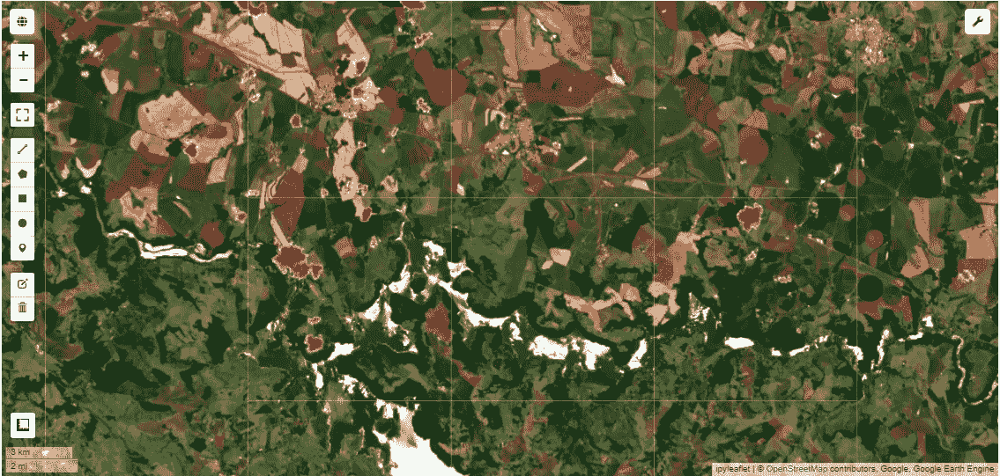
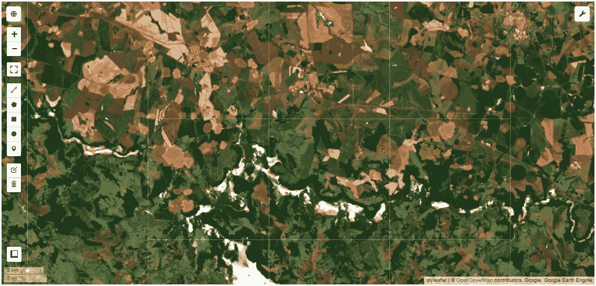
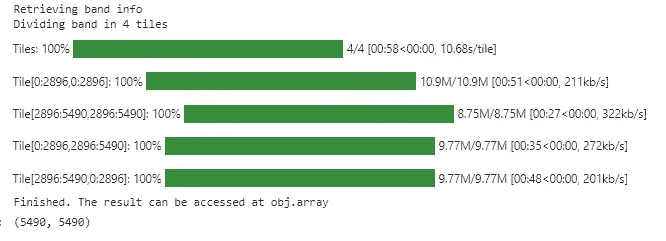
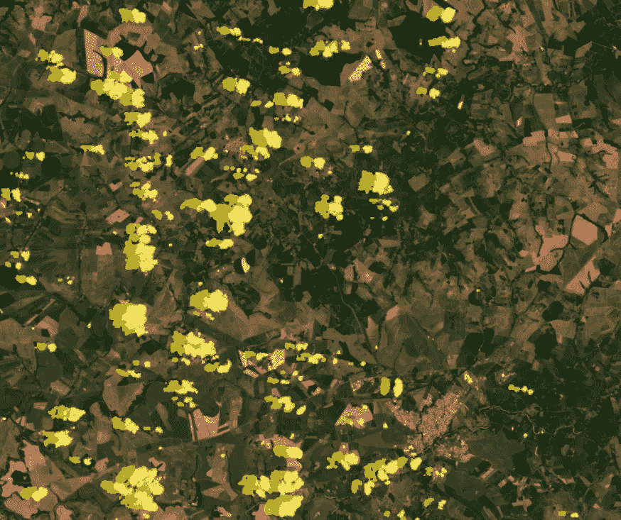

# 用微软行星计算机创建哨兵 2 号(真正的)无云镶嵌图

> 原文：<https://towardsdatascience.com/creating-sentinel-2-truly-cloudless-mosaics-with-microsoft-planetary-computer-7392a2c0d96c>

## 使用 GEE 的 S2 无云图层，在微软行星计算机上有效地遮蔽云(和云的阴影)


美国宇航局在 [Unsplash](https://unsplash.com?utm_source=medium&utm_medium=referral) 拍摄的照片

# 介绍

在地理空间领域，微软行星计算公司是久负盛名的谷歌地球引擎的有力竞争者。无需下载每张图像即可访问数 Pb 卫星信息的可能性以及由 **Dask clusters** 提供的计算能力是开发区域/全球应用和研究的一大变革。行星计算机仍处于预览阶段(需要访问请求)，但使用其计算中心与开源工具如 **XARRAY** 和 **STAC** 的可能性是优于谷歌专有 API 的一个优势(IMHO)。

另一个优点是，我们不必像在 **GEE** 中那样受大小约束的困扰，大小约束会阻止我们轻松地访问 Numpy 数组格式的值。好吧，我知道 GEE 的概念是不同的，这意味着迫使人们在服务器端运行计算(使用惰性数组的概念)，但有时直接访问数据更容易。在 Planetary Computer 中，甚至可以使用“自制”下载器直接从微软的目录中下载全部资产(更多内容将在以后的文章中介绍)。

不利的一面是，数据集目录不像在谷歌的竞争对手那里找到的那样广泛。在处理光学(哨兵 2 号)影像时，有一件事真的很重要:云层遮罩。

在微软的官方无云镶嵌教程([这里是](https://planetarycomputer.microsoft.com/docs/tutorials/cloudless-mosaic-sentinel2/))中，他们陈述了以下内容:*“在云是短暂的假设下，合成图像不应该包含(许多)云，因为它们不应该是许多图像在该点的中间像素值。”。那是…呃…不完全是我们所期待的。*在 L2A S2 影像中总会有场景分类图层——SCL 图层，但之前用过 **Sen2Cor** 的人都知道这不是精度最好的。 **Baetens et al. (2019)** 在这个课题上带来了全面的比较。

这又把我们带回了我们的故事:如果我们运行在微软的行星计算机上，我们如何才能有效地从哨兵 2 的图像中去除云。正如在行星计算机范例 GitHub 知识库中提到的(这里是[这里是](https://github.com/microsoft/PlanetaryComputerExamples/issues/68))这是他们正在做的事情，但是在那之前…

# S2 无云算法

S2 无云包是 Sinergise 开发的机器学习云检测算法，在 GitHub 上有售([此处](https://github.com/sentinel-hub/sentinelhub-py))。欧空局正在使用这种算法，它最近作为一张云概率图被列入了 GEE 的目录。因此，我们可以直接从 GEE 访问概率图，而不是为每个场景运行训练好的算法。这些问题是:

*   我们想使用行星计算机，但我们不在地球环境中！而且，
*   云影呢？

为了解决前面提到的两点，我结合使用了 geeS2Downloader 包(关于这个故事的更多信息[这里](https://medium.com/analytics-vidhya/how-to-download-assets-from-google-earth-engine-gee-and-overcome-the-size-limitations-45b7c9ebe389))和 GEE 的页面上提供的教程 Sentinel-2 Cloud Masking with S2 Cloud less([这里](https://developers.google.com/earth-engine/tutorials/community/sentinel-2-s2cloudless))。该教程显示了如何根据太阳方位角投影云阴影，以找到实际的地面阴影，geeS2Downloader 包使从 GEE 下载资源更容易，克服了其大小限制。如果看起来太复杂，让我们来看看完整的解决方案…

# 解决方案

让我们首先从微软行星中心的一个空笔记本开始，安装依赖项。在这种情况下，我们将需要两个未预装在 PC(行星计算机)中的软件包和一个用于更快可视化的可选软件包:

*   earthengine-api:从谷歌地球引擎访问资产。
*   geeS2Downloader:从 GEE 下载资产。
*   Geemap:来自吴秋生教授的伟大软件包，它的最新版本也可以在微软的个人电脑上运行。

初始化后，我们将通过 **TILE_ID** 和**日期**搜索特定的图块。为此，我们将使用一个名为`search_tiles`的函数。

```
<Item id=S2B_MSIL2A_20181214T133219_R081_T22KFV_20201008T100849>
```

然后，我们需要在 GEE 中得到相应的云概率图。另外，为了投射阴影，我们也需要完整的 S2 图像。为此，我们将创建一个名为`get_gee_img` 的新函数，它将负责在给定 STAC 商品的情况下定位 GEE 目录中的图像。

现在是时候看看我们用 **Geemap** 下载的图片了:



代码输出。图片作者。

正如我们所看到的，云被正确识别，但我们仍然需要摆脱阴影。为此，我们将创建一个受 GEE 教程启发的函数`create_cloud_mask`。它将扩大最终蒙版与 50 米的缓冲区，并重新调整到 20 米的分辨率。

```
{'type': 'Image',
 'bands': [{'id': 'cloudmask',
   'data_type': {'type': 'PixelType', 'precision': 'int', 'min': 0, 'max': 1},
   'dimensions': [5490, 5490],
   'crs': 'EPSG:32722',
   'crs_transform': [20, 0, 600000, 0, -20, 7500040]}]}
```

正如我们可以从代码的输出中看到的，掩码似乎是用 20m 正确创建的，正如预期的那样。要在 geemap 上显示它，我们只需使用以下命令添加该层:

```
Map.addLayer(mask.selfMask(), {'min': 0, 'max': 1, 'palette': ['orange']}, 'Final Mask', True, 0.5)
```

这是最终的蒙版输出。请注意，我们不仅有云彩，还有阴影(橙色)。



代码输出。图片作者。

## 将掩模下载到 PC

现在我们已经在 GEE 中处理了遮罩，是时候下载它了，看看它是否正确地符合我们的原始图像。为此，我们将使用 **geeS2Downloader** 包。这个软件包将根据 GEE 的限制自动分割蒙版并重建最终的矩阵。



代码输出。图片作者。

## 显示结果

现在，让我们显示最终结果，以与 PC 中的图像进行比较。代替 **geemap** ，我们将使用普通的 Matplotlib 来完成这个任务。


代码输出。图片作者。



放大输出。图片作者。

# 结论

正如我们在这个故事中看到的，将谷歌地球引擎和微软行星计算机的资产结合起来，从两个平台中提取精华是可能的。虽然微软的个人电脑不包括可靠的云端层，但这是我为了继续我的项目而创建的一个变通办法。在未来，我预计这种变通办法将不再是必要的。直到那里，希望它能帮助我们中的一些人！

谢谢，下一个故事再见！

# 保持联系

*如果你喜欢这篇文章，并想继续无限制地阅读/学习这些和其他故事，考虑成为* [*中等会员*](https://cordmaur.medium.com/membership) *。你也可以在 https://cordmaur.carrd.co/*查看我的作品集。

[](https://cordmaur.medium.com/membership)  

# **参考**

Baetens，l .，Desjardins，c .，Hagolle，o .，2019。使用有监督的主动学习程序生成的参考云掩膜对从 MAJA、Sen2Cor 和 FMask 处理器获得的哥白尼 Sentinel-2 云掩膜的验证。遥感 11433。[https://doi.org/10.3390/rs11040433](https://doi.org/10.3390/rs11040433)