# 创建合成数据

> 原文：<https://towardsdatascience.com/creating-synthetic-data-3774391c851d>

## 使用模型来提供数据中心性

我以前写过关于合成数据的博客。实际上是两次。我第一次使用荷兰癌症登记处的合成数据进行生存分析。第二次我使用相同的数据集来应用[规格曲线分析](https://medium.com/@marc.jacobs012/specification-curve-analysis-sca-on-a-synthetic-cancer-data-set-8e2ee473c698)。

合成数据将在未来几年发挥关键作用，因为模型变得越来越复杂，但受到可用数据的限制。一段时间以来，以模型为中心的运动正慢慢被更以数据为中心的观点所取代，随着时间的推移，模型将再次占据中心舞台。

合成数据实际上是两个世界的结合，还处于起步阶段。它的数据，而是我们习惯于看到和看待数据的方式。对于大多数研究人员来说，数据来自实地观察或传感器。合成数据是模型数据。本质上，它的数据伪装成其他数据，其中敏感组件被删除，但关键组件保留。如果成功，建模者甚至不应该知道数据是合成的。或许一个很好的类比是描绘你站在蒙娜丽莎面前的卢浮宫，但它不是真正的蒙娜丽莎。真正的蒙娜丽莎藏在地下室，你看到的是一个戒备森严的复制品。

合成数据是关于尊重原始的本质，而不是原始的。从这一点出发，合成数据甚至可以更多。可以成为现实生活中很少会出现的模型的训练素材，但是可以作为模拟素材分享给大家。因为数据失去了敏感性，但没有失去价值。

在这个模块中，我要做的是获取 R 中的数据集，即钻石数据集，并从中创建几个模型来建立合成数据。当然，*钻石*数据集已经开放，因此它没有敏感信息，但是这个练习的本质是在不重新创建数据集的情况下重新创建数据集的本质。

我使用 *diamonds* 数据集的原因是它有足够的行和列，但没有直接和明确的关系。

让我们开始吧。

```
rm(list = ls())
options("scipen"=100, "digits"=10)
#### LIBRARIES ####
library(DataExplorer)
library(ggplot2)
library(dplyr)
library(tidyr)
library(ggExtra)
library(skimr)
library(car)
library(GGally)

library(doParallel)
cl <- makePSOCKcluster(5)
registerDoParallel(cl)
```

加载完库之后，我想立即查看数据本身。如果我要对数据建模，以识别其本质(通过交叉相关)，并从本质上复制它，那么我必须牢牢掌握数据集。为此，我将首先查看协方差和相关矩阵。

```
skimr::skim(diamonds)
str(diamonds)
diamonds$price<-as.numeric(diamonds$price)
diamonds%>%
  dplyr::select(where(is.numeric))%>%
  cor()
diamonds%>%
  dplyr::select(where(is.numeric))%>%
  corrgram::corrgram()
diamonds%>%
  dplyr::select(where(is.numeric))%>%
  cor()%>%
  ggcorrplot::ggcorrplot(., hc.order = TRUE, type = "lower",
             lab = TRUE)
```

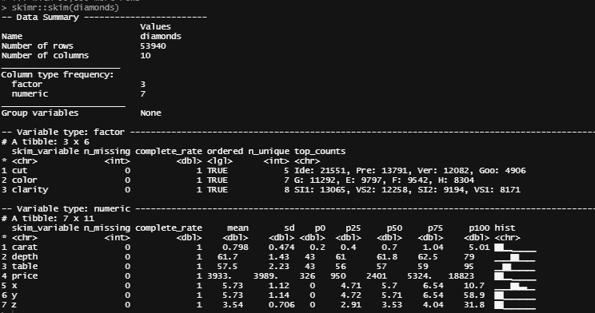

diamonds 数据集有许多行，但只有几列。这应该会使建立模型变得更容易，但是关系并不明确。图片作者。

我将首先从数值开始，因为这是最容易的开始。这并不意味着我们不能为序数或名词性数据重建合成数据。然而，非连续数据的相关矩阵需要一些额外的变换，我们现在不考虑这些变换。

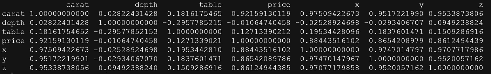

所有数值变量的相关矩阵。图片作者。

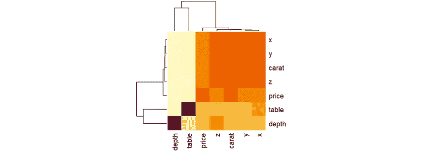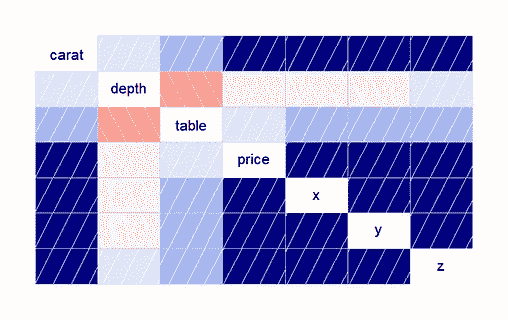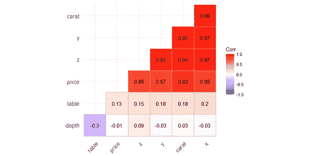

和三种类型的相关矩阵。在左侧，您可以看到一个附有树状图的热图。树状图是一种涉及相关性的聚类技术。因此，将它们结合起来是很简单的。正如你所看到的，有一些严重的相关性和一些部分几乎是分离的。图片作者。

我们甚至可以创建更奇特的图，但是 R 在绘制所有 53k 行时会遇到一点问题。因此，我将首先选择一个 1000 行的随机样本，然后绘制每个数值的分布及其潜在的相关性。

```
diamonds%>%
  dplyr::select(where(is.numeric))%>%
  sample_n(., 1000)%>%
  scatterplotMatrix()
```

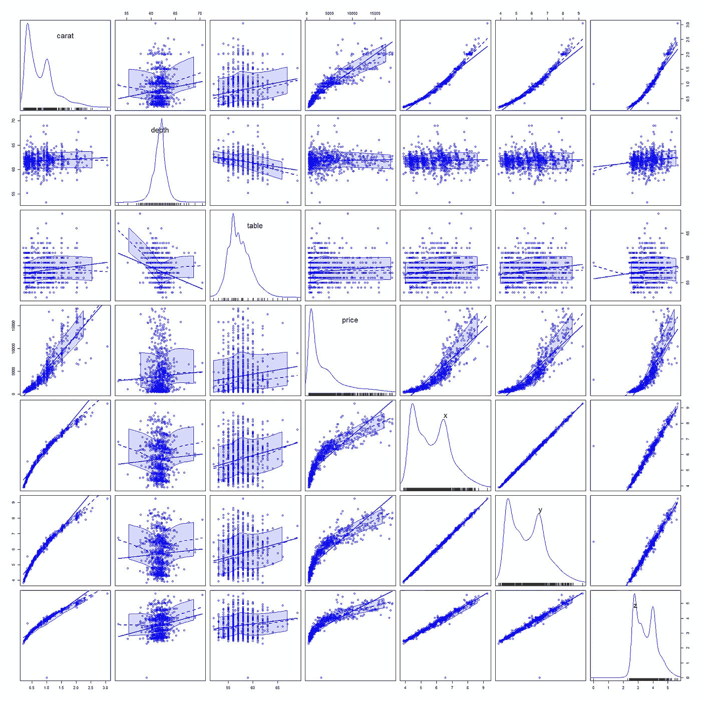

这种分布应该是多峰值的，这很有趣。此外，变量之间的关系有时是极端的，有时是不存在的(你也可以称之为极端)。图片作者。

而且，有一个很好的方法可以使用 **GGally** 库来绘制每个特定类别(这里是 *cut* )的相关性和分布。

```
diamonds%>%
  dplyr::select(x, y, z, carat, depth, table, price, cut)%>%
  sample_n(., 1000)%>%
  ggpairs(.,
  mapping = ggplot2::aes(color = cut),
  upper = list(continuous = wrap("density", alpha = 0.5), 
               combo = "box_no_facet"),
  lower = list(continuous = wrap("points", alpha = 0.3), 
               combo = wrap("dot_no_facet", alpha = 0.4)),
  title = "Diamonds")
```

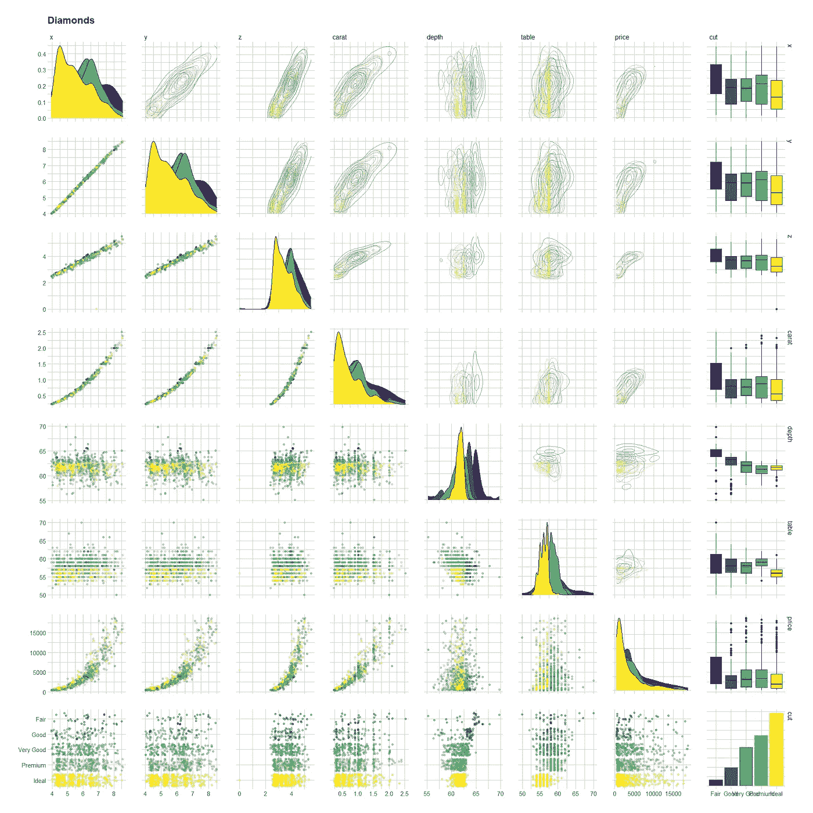

图片作者。

如果我们要基于只包含数值的原始数据重新创建数据集，我们需要立即考虑需要注意的两个主要问题:

1.  每个变量的汇总统计和分布需要尽可能接近原始数据，但不需要完全相同。这意味着需要维护每个变量的结构。如果不是这样，数据集的*描述部分*就不能使用。*造型部分*仍可保留。
2.  数据点之间的协方差/相关性需要相同。这意味着需要维护变量之间的潜在关系。这对*造型部分*至关重要。

从数据中提取协方差/相关矩阵并不困难，但正如我们所说，标准公式只适用于数值。尽管如此，我们可以用数字值来开始我们的创作，让这个想法继续下去。

这里你可以看到协方差矩阵。

```
diamond_cov<-diamonds%>%dplyr::select_if(., is.numeric)%>%cov()

                 carat           depth           table             price
carat    0.22468665982   0.01916652822    0.1923645201     1742.76536427
depth    0.01916652822   2.05240384318   -0.9468399376      -60.85371214
table    0.19236452006  -0.94683993764    4.9929480753     1133.31806407
price 1742.76536426512 -60.85371213642 1133.3180640679 15915629.42430145
x        0.51848413024  -0.04064129579    0.4896429037     3958.02149078
y        0.51524781641  -0.04800856925    0.4689722778     3943.27081043
z        0.31891683911   0.09596797038    0.2379960448     2424.71261297
                     x                y                z
carat    0.51848413024    0.51524781641    0.31891683911
depth   -0.04064129579   -0.04800856925    0.09596797038
table    0.48964290366    0.46897227781    0.23799604481
price 3958.02149078326 3943.27081043196 2424.71261297033
x        1.25834717304    1.24878933406    0.76848748285
y        1.24878933406    1.30447161384    0.76731957995
z        0.76848748285    0.76731957995    0.49801086259
```

从这个过程中，我们获得了协方差，但我们不能创建数据。为此，我们还需要可以很容易获得的汇总统计数据。

```
diamonds%>%dplyr::select_if(., is.numeric)%>%summary()

     carat               depth             table              price         
 Min.   :0.2000000   Min.   :43.0000   Min.   :43.00000   Min.   :  326.00  
 1st Qu.:0.4000000   1st Qu.:61.0000   1st Qu.:56.00000   1st Qu.:  950.00  
 Median :0.7000000   Median :61.8000   Median :57.00000   Median : 2401.00  
 Mean   :0.7979397   Mean   :61.7494   Mean   :57.45718   Mean   : 3932.80  
 3rd Qu.:1.0400000   3rd Qu.:62.5000   3rd Qu.:59.00000   3rd Qu.: 5324.25  
 Max.   :5.0100000   Max.   :79.0000   Max.   :95.00000   Max.   :18823.00  
       x                   y                   z            
 Min.   : 0.000000   Min.   : 0.000000   Min.   : 0.000000  
 1st Qu.: 4.710000   1st Qu.: 4.720000   1st Qu.: 2.910000  
 Median : 5.700000   Median : 5.710000   Median : 3.530000  
 Mean   : 5.731157   Mean   : 5.734526   Mean   : 3.538734  
 3rd Qu.: 6.540000   3rd Qu.: 6.540000   3rd Qu.: 4.040000  
 Max.   :10.740000   Max.   :58.900000   Max.   :31.800000 
```

从这些组合中，我们应该能够使用各种程序重建数据。也许最直接的方法是使用[多元正态分布](https://medium.com/mlearning-ai/drawing-and-plotting-observations-from-a-multivariate-normal-distribution-using-r-4c2b2f64e1a3)，它存在于*质量*包中。我只需要每个变量的平均值和相关矩阵。多元正态分布将完成剩下的工作。为了获得相等的比较，我将创建与原始数据集一样多的观察值。

```
sigma<-diamonds%>%dplyr::select_if(., is.numeric)%>%cor()%>%as.matrix()
mean<-diamonds%>%dplyr::select_if(., is.numeric)%>%as.matrix()%>%colMeans()
df<-as.data.frame(MASS::mvrnorm(n=dim(diamonds)[1], mu=mean, Sigma=sigma))
> dim(df)
[1] 53940     7
> head(df)
           carat       depth       table       price           x           y
1 -1.34032717822 61.49447797 57.19091527 3931.162855 3.545669821 3.931061364
2 -0.47751648630 61.16241371 57.86509627 3931.306295 4.906696688 5.057863929
3  2.24358594522 63.09062530 56.73718104 3932.957682 7.386140807 7.405936831
4 -0.03108967881 60.99439588 57.58369767 3931.677322 5.194041948 5.431802322
5  1.16179859890 62.39235813 57.96524508 3933.322044 6.213609464 6.592872841
6 -0.16757252197 60.84783867 56.68337288 3932.501268 4.987489939 5.118558015
            z
1 1.138732182
2 2.596622246
3 5.674154202
4 3.089565271
5 4.387662667
6 2.577509666
```

创建完成后，接下来的任务是应用两种方法检查数据的有效性和可用性:

1.  检查单变量特征。
2.  检查多元特征。

有了 *ggpairs* 函数，我可以两者兼而有之，并初步了解该过程及其生成的数据的适用性。

```
diamonds%>%dplyr::select_if(., is.numeric)%>%ggpairs()
ggpairs(df)
```

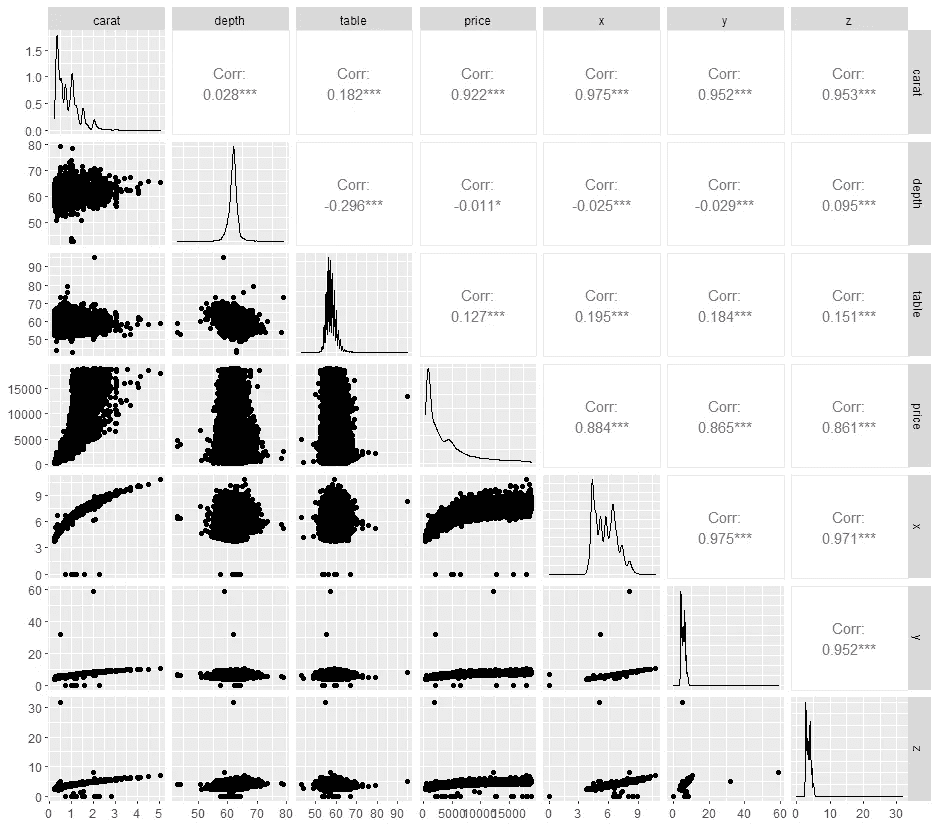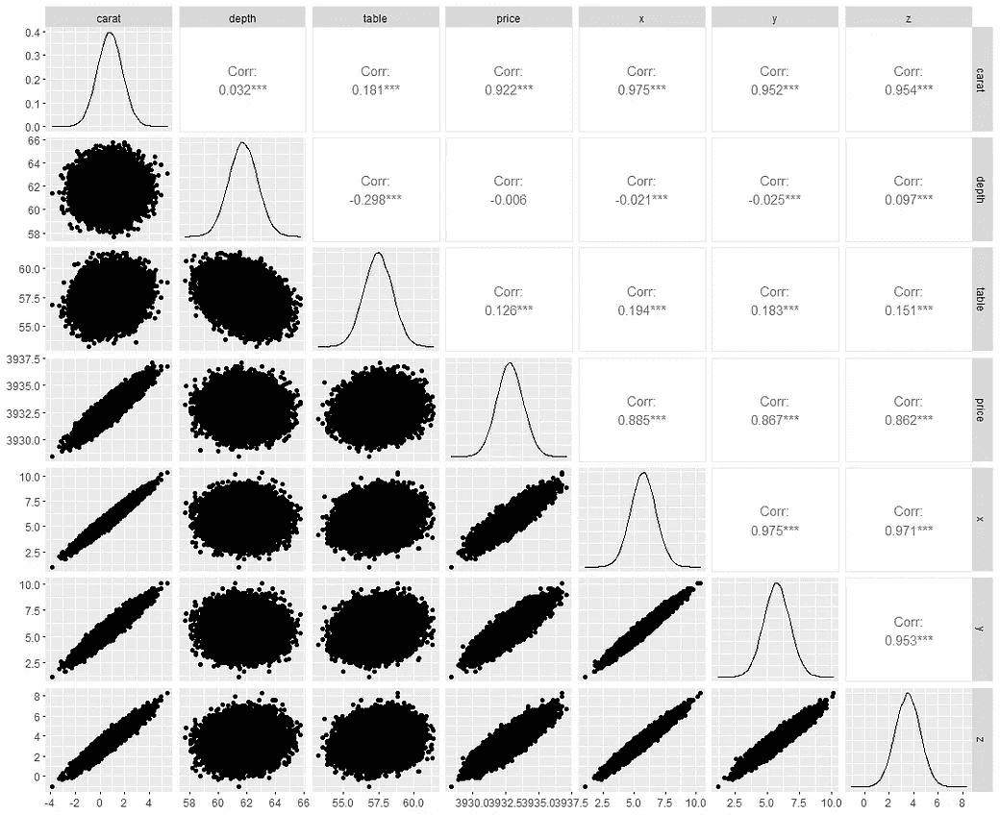

左边是原始数据集，右边是从原始数据中提取平均值和相关矩阵的模拟数据。当然，合成数据的分布遵循正态分布。数据之间的相关性得到了维护，但是汇总统计数据肯定没有得到维护(除了平均值)。图片作者。

现在，我们已经说过，我们的目的是构建合成数据，这意味着构建本质上相同的数据，但在前景上不一定相同。我们已经实现了这个目标。我将使用 *caret* 包在两个数据集上构建一个快速模型，看看合成数据是否会给我与原始数据集完全相同的结果。

```
diamonds_num<-diamonds%>%dplyr::select_if(., is.numeric)
trainIndex <- caret::createDataPartition(diamonds_num$carat, 
                                         p = .6, 
                                         list = FALSE, 
                                         times = 1)
> wideTrain <- diamonds_num[ trainIndex,];dim(wideTrain)
[1] 32366     7
> wideTest  <- diamonds_num[-trainIndex,];dim(wideTest)
[1] 21574     7

fitControl <- caret::trainControl(
  method = "repeatedcv",
  number = 20,
  repeats = 20)

lmFit1 <- caret::train(carat ~ ., 
                        data = wideTrain, 
                        method = "lm",
                        trControl = fitControl,
                        verbose = FALSE)
> summary(lmFit1)

Call:
lm(formula = .outcome ~ ., data = dat, verbose = FALSE)

Residuals:
        Min          1Q      Median          3Q         Max 
-0.54124488 -0.03836279 -0.00665401  0.03530248  2.71983984 

Coefficients:
                    Estimate       Std. Error   t value               Pr(>|t|)    
(Intercept) -2.5273956761070  0.0294158001479 -85.91966 < 0.000000000000000222 ***
depth        0.0188998891767  0.0003766002370  50.18555 < 0.000000000000000222 ***
table        0.0046678986326  0.0002266381898  20.59626 < 0.000000000000000222 ***
price        0.0000330063643  0.0000002519416 131.00798 < 0.000000000000000222 ***
x            0.2956915579921  0.0032315175272  91.50238 < 0.000000000000000222 ***
y            0.0130670340617  0.0028968529147   4.51077            0.000006482 ***
z           -0.0026197077889  0.0025495576103  -1.02751                0.30419    
---
Signif. codes:  0 '***' 0.001 '**' 0.01 '*' 0.05 '.' 0.1 ' ' 1

Residual standard error: 0.0844222 on 32359 degrees of freedom
Multiple R-squared:  0.9684143, Adjusted R-squared:  0.9684085 
F-statistic:   165354 on 6 and 32359 DF,  p-value: < 0.00000000000000022204
```

以上是基于原始数据的简单线性回归的总结。下面是基于合成数据的简单线性回归的总结。是的，程序并不完全相同，根据训练和测试数据的选择，以及反复的交叉验证，可以预期会有一些变化，但是程序的本质是看数据的本质是否被保留。

```
trainIndex <- caret::createDataPartition(df$carat, 
                                         p = .6, 
                                         list = FALSE, 
                                         times = 1)
> wideTrain <- df[ trainIndex,];dim(wideTrain)
[1] 32364     7
> wideTest  <- df[-trainIndex,];dim(wideTest)
[1] 21576     7

fitControl <- caret::trainControl(
  method = "repeatedcv",
  number = 20,
  repeats = 20)
lmFit2 <- caret::train(carat ~ ., 
                        data = wideTrain, 
                        method = "lm",
                        trControl = fitControl,
                        verbose = FALSE)
summary(lmFit2)

Call:
lm(formula = .outcome ~ ., data = dat, verbose = FALSE)

Residuals:
        Min          1Q      Median          3Q         Max 
-0.68929576 -0.11680934  0.00078743  0.11741046  0.74064948 

Coefficients:
                   Estimate      Std. Error    t value               Pr(>|t|)    
(Intercept) -1079.584562077     8.210331042 -131.49099 < 0.000000000000000222 ***
depth           0.052707918     0.001155147   45.62874 < 0.000000000000000222 ***
table           0.019422785     0.001035408   18.75859 < 0.000000000000000222 ***
price           0.272537301     0.002088731  130.47987 < 0.000000000000000222 ***
x               0.708827904     0.006118409  115.85167 < 0.000000000000000222 ***
y               0.015186425     0.004344156    3.49583             0.00047322 ***
z               0.007592425     0.004694642    1.61725             0.10583335    
---
Signif. codes:  0 ‘***’ 0.001 ‘**’ 0.01 ‘*’ 0.05 ‘.’ 0.1 ‘ ’ 1

Residual standard error: 0.1736463 on 32357 degrees of freedom
Multiple R-squared:  0.9697885, Adjusted R-squared:  0.9697829 
F-statistic: 173109.8 on 6 and 32357 DF,  p-value: < 0.00000000000000022204
```

一目了然的是截距的大小发生了变化，这是因为合成数据具有相同的均值，但分布不同。了解数据的另一种方法是查看试图预测钻石克拉的模型中每个预测值的方差重要性。

```
> lm1Imp;lm2Imp
lm variable importance

         Overall
price 131.007979
x      91.502384
depth  50.185548
table  20.596258
y       4.510769
z       1.027515

         Overall
price 130.479871
x     115.851671
depth  45.628736
table  18.758588
y       3.495829
z       1.617253
```

似乎这些模型确实具有相同的可变重要性，并且它们之间的距离似乎被保留了下来。当然，它并不完美，但也不必如此。

了解合成数据可用性的第二种方法是查看累积分布图。累积密度图是显示变量分布形式的另一种方式，但在这种方式中，如果两个数据集显示相同的本质，就会立即变得清楚。

重要的是要认识到，没有单一的方法来确定合成数据是否保持了与原始数据相同的本质。

```
df$Model<-"Synthetic"
diamonds_num$Model<-"Original"
combined<-rbind(df, diamonds_num)
ggplot(combined, aes(carat, colour = Model)) +
  stat_ecdf()+
  theme_bw()
```

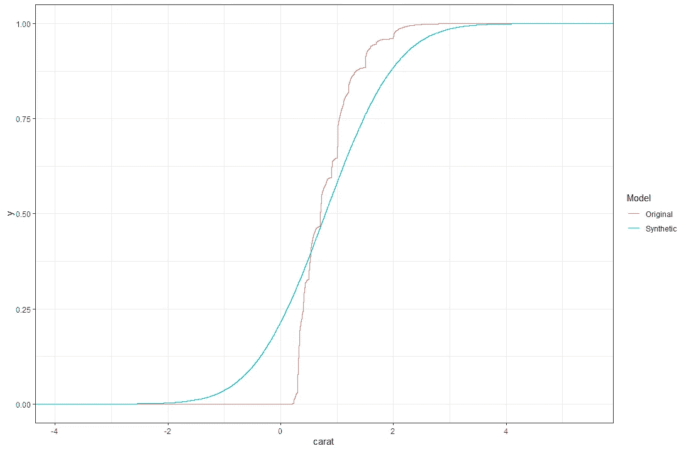

在这里，您可以看到我尝试使用简单的线性回归建模的结果。正如你所看到的，合成数据非常清晰，相比之下，原始数据是凹凸不平的。因此，包含相关矩阵的简单多元正态分布是不够的。图片作者。

下一步是为数据集中的每个数值变量绘制图表。

```
combined_long<-combined%>%tidyr::pivot_longer(!Model, 
                                              names_to = "Variable",
                                              values_to = "Value",
                                              values_drop_na = TRUE)
ggplot(combined_long, aes(Value, colour = Model)) +
  stat_ecdf()+
  theme_bw()+
  facet_wrap(~Variable, scales="free")
```

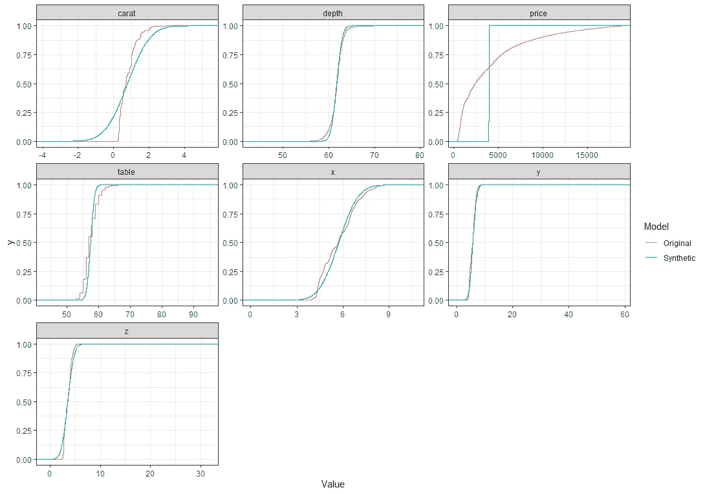

如你所见，累积分布函数(CDF)在原始数据和合成数据之间没有太大差异。合成数据更加原始，对于**克拉**，我们已经看到了某些偏差，这可能会导致原始数据和合成数据之间的分析差异。然而，这与绝对错误的**价格**相比根本不算什么。图片作者。

让我们深入挖掘*价格*并比较使用密度。我将首先绘制严重偏离的*价格*，然后绘制几乎相同密度结构的*深度*。

```
g1<-ggplot()+
  geom_density(data=diamonds_num, aes(x=price, fill="Original"), alpha=0.5)+
  theme_bw()+
  labs(fill="")
g2<-ggplot()+
  geom_density(data=df, aes(x=price, fill="Synthetic"), alpha=0.5)+
  theme_bw()+
  labs(fill="")
gridExtra::grid.arrange(g1,g2,nrow=2)
```

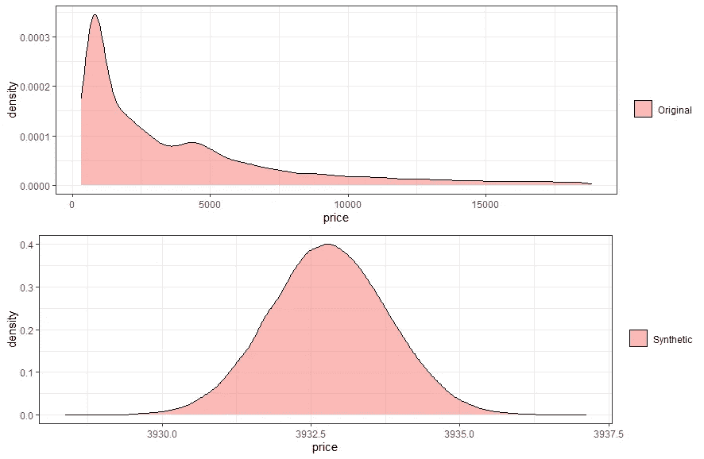

合成数据集中价格的 cdf 看起来如此奇怪的原因是因为它必须以与原始数据相同的比例绘制。而且原版的最大值超过 15000，不像合成版停在 3950 左右。图片作者。

这种差异是构成多元正态的函数的直接结果，这意味着每个变量都有一个平均值，并且与其他函数相关。在这个特殊的例子中，平均值并不能说明全部情况。

```
ggplot()+
  geom_density(data=diamonds_num, aes(x=depth, fill="Original"), alpha=0.5)+
  geom_density(data=df, aes(x=depth, fill="Synthetic"), alpha=0.5)+
  theme_bw()+
  labs(fill="")
```

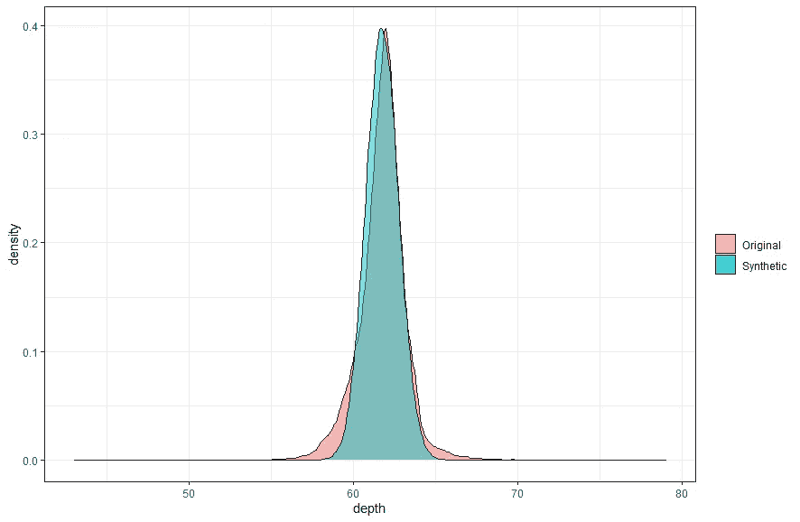

原始数据和合成数据并不相同，但确实表现出相似的特征。然而，如果从原始数据中提取汇总统计数据，并将其与合成数据进行比较，这种方法充其量也是有限的。这是因为描述性统计需要完全相同的值，这意味着分布应该完全相同。这就是综合数据集的描述部分和建模部分之间的区别。图片作者。

如果我采用*质量*包的多元正态分布的经验形式会怎样——这意味着样本大小会发挥更大的作用。

```
df_emp<-as.data.frame(MASS::mvrnorm(n=dim(diamonds)[1], 
                                    mu=mean, Sigma=sigma, empirical = TRUE))

g1<-ggplot()+
  geom_density(data=diamonds_num, aes(x=price, fill="Original"), alpha=0.5)+
  theme_bw()+
  labs(fill="")
g2<-ggplot()+
  geom_density(data=df, aes(x=price, fill="Synthetic"), alpha=0.5)+
  theme_bw()+
  labs(fill="")
g3<-ggplot()+
  geom_density(data=df_emp, aes(x=price, fill="Synthetic Emp"), alpha=0.5)+
  theme_bw()+
  labs(fill="")
gridExtra::grid.arrange(g1,g2,g3,nrow=3)
```

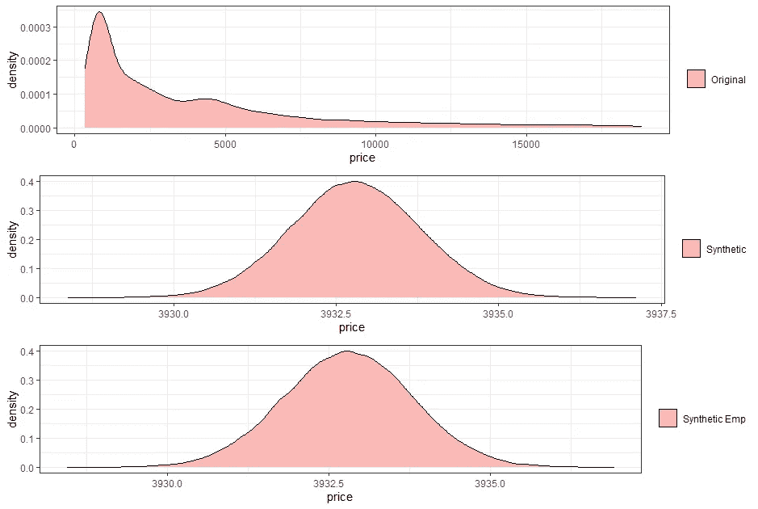

对于 53k 行数据，两个多变量正态程序之间没有实际差异，这是可以预期的。样本大小在这里不是问题。图片作者。

好的，多元正态分布确实为创建合成数据集提供了一个良好的开端，但只是从建模的角度来看。不是从描述的角度，人们需要自己决定是否有必要。数据合成的部分本质是确保本质得到保持，对于建模者来说，这意味着建模时能够得到相同的结果。

现在，创建合成数据的另一种方法(这意味着模拟相关变量)是深入到连接函数的世界中，我们现在将在某种程度上使用高斯函数。连接函数是理解和建立多元分布的连接概率的一个很好的方法。copula 这个词的意思是“链接”,这正是他们所做的。

根据维基百科，一个 copula 是:*一个多元* [*累积分布函数*](https://en.wikipedia.org/wiki/Cumulative_distribution_function) *其中* [*边际概率*](https://en.wikipedia.org/wiki/Marginal_probability) *每个变量的分布是*<https://en.wikipedia.org/wiki/Uniform_distribution_(continuous>)**均匀分布在区间[0，1]上。*如果我们将这些步骤分解开来，看起来会是这样的(这是我从[博客](https://thomasward.com/simulating-correlated-data/)上引用的):*

1.  *多元正态分布的样本相关标准化(N[0，1])分布。*
2.  *用正态 CDF 将它们转换成相关的均匀(0，1)分布([概率积分转换](https://en.wikipedia.org/wiki/Probability_integral_transform))。*
3.  *用概率分布的逆 CDF 将它们转换成你想要的任何相关概率分布([逆变换采样](https://en.wikipedia.org/wiki/Inverse_transform_sampling))。*

*下面是一个函数，显示了一个构建的多元正态分布函数，它等于 **MASS** 包的 *mvnorm* 函数。因此，我将从多元正态分布中获得(就像以前一样)数据，但这次是标准化的。*

```
 *mvrnorm <- function(n = 1, mu = 0, Sigma) {
  nvars <- nrow(Sigma)
  # nvars x n matrix of Normal(0, 1)
  nmls <- matrix(rnorm(n * nvars), nrow = nvars)
  # scale and correlate Normal(0, 1), "nmls", to Normal(0, Sigma) by matrix mult
  # with lower triangular of cholesky decomp of covariance matrix
  scaled_correlated_nmls <- t(chol(Sigma)) %*% nmls
  # shift to center around mus to get goal: Normal(mu, Sigma)
  samples <- mu + scaled_correlated_nmls
  # transpose so each variable is a column, not
  # a row, to match what MASS::mvrnorm() returns
  t(samples)
}
df_new <- mvrnorm(dim(diamonds)[1], Sigma = sigma)
mean2<-rep(0,dim(sigma)[2])
names(mean2)<-colnames(sigma)
df_new2 <- MASS::mvrnorm(dim(diamonds)[1], 
                         mu=mean2, 
                         Sigma = sigma)
> cor(df_new)
              carat          depth         table          price              x              y
carat 1.00000000000  0.02548515939  0.1756632819  0.92081606682  0.97483969924  0.95123398113
depth 0.02548515939  1.00000000000 -0.2966914653 -0.01267406029 -0.02968316709 -0.03193223836
table 0.17566328191 -0.29669146532  1.0000000000  0.12037212430  0.18934326066  0.17732479479
price 0.92081606682 -0.01267406029  0.1203721243  1.00000000000  0.88323677536  0.86373468972
x     0.97483969924 -0.02968316709  0.1893432607  0.88323677536  1.00000000000  0.97460644946
y     0.95123398113 -0.03193223836  0.1773247948  0.86373468972  0.97460644946  1.00000000000
z     0.95342001221  0.09193958958  0.1450393656  0.86003163701  0.97049061902  0.95189367284
                  z
carat 0.95342001221
depth 0.09193958958
table 0.14503936558
price 0.86003163701
x     0.97049061902
y     0.95189367284
z     1.00000000000
> cor(df_new2)
              carat          depth         table          price              x              y
carat 1.00000000000  0.02401766053  0.1879023338  0.92211539384  0.97544578111  0.95144071623
depth 0.02401766053  1.00000000000 -0.3013205641 -0.01515267326 -0.02925527573 -0.03155516412
table 0.18790233377 -0.30132056412  1.0000000000  0.13488569935  0.20173295788  0.18904146957
price 0.92211539384 -0.01515267326  0.1348856993  1.00000000000  0.88524849733  0.86534901465
x     0.97544578111 -0.02925527573  0.2017329579  0.88524849733  1.00000000000  0.97451646301
y     0.95144071623 -0.03155516412  0.1890414696  0.86534901465  0.97451646301  1.00000000000
z     0.95428998681  0.09122255285  0.1570967255  0.86180784719  0.97117225153  0.95206791685
                  z
carat 0.95428998681
depth 0.09122255285
table 0.15709672554
price 0.86180784719
x     0.97117225153
y     0.95206791685
z     1.00000000000*
```

*因此，我们首先获得的值是来自多元正态分布的标准化值。这意味着变量都在相同的尺度上，并携带原始的互相关矩阵。我们可以很容易地检查两者(标准化规模和相关性)。*

```
*pairs(df_new)
hist(df_new[,1])*
```

*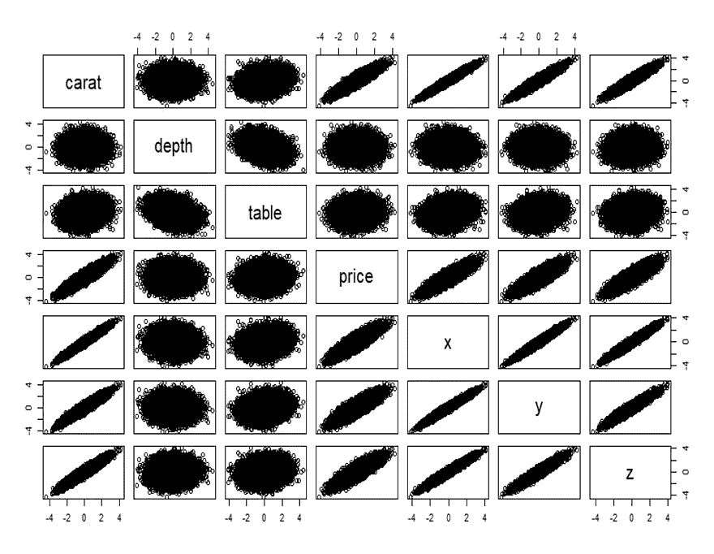**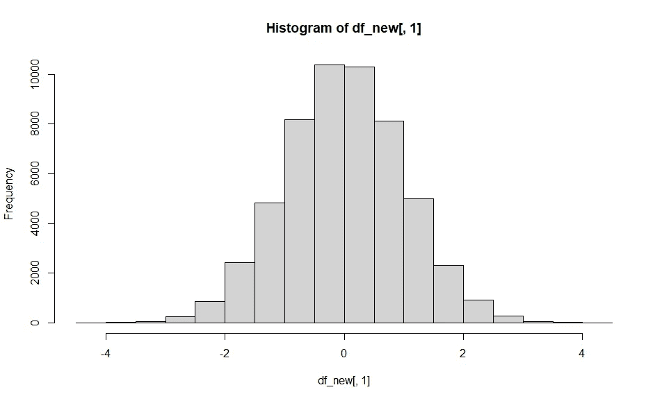*

*左图:相关矩阵。右图:配送。都来自标准化的多元正态分布。图片作者。*

*下一步是转换到均匀分布，同时保持基本的互相关矩阵。*

```
*U <- pnorm(df_new, mean = 0, sd = 1)
hist(U[,1])
cor(U)
              carat          depth         table         price              x              y             z
carat 1.00000000000  0.02617867093  0.1682925760  0.9140135553  0.97247036750  0.94681926838 0.94931607318
depth 0.02617867093  1.00000000000 -0.2837151691 -0.0102210807 -0.02657673258 -0.02879604409 0.08933946454
table 0.16829257601 -0.28371516908  1.0000000000  0.1160484259  0.18057212310  0.16815896730 0.13787984049
price 0.91401355528 -0.01022108070  0.1160484259  1.0000000000  0.87409215149  0.85353166518 0.84964860456
x     0.97247036750 -0.02657673258  0.1805721231  0.8740921515  1.00000000000  0.97228684415 0.96785128673
y     0.94681926838 -0.02879604409  0.1681589673  0.8535316652  0.97228684415  1.00000000000 0.94769217826
z     0.94931607318  0.08933946454  0.1378798405  0.8496486046  0.96785128673  0.94769217826 1.00000000000*
```

*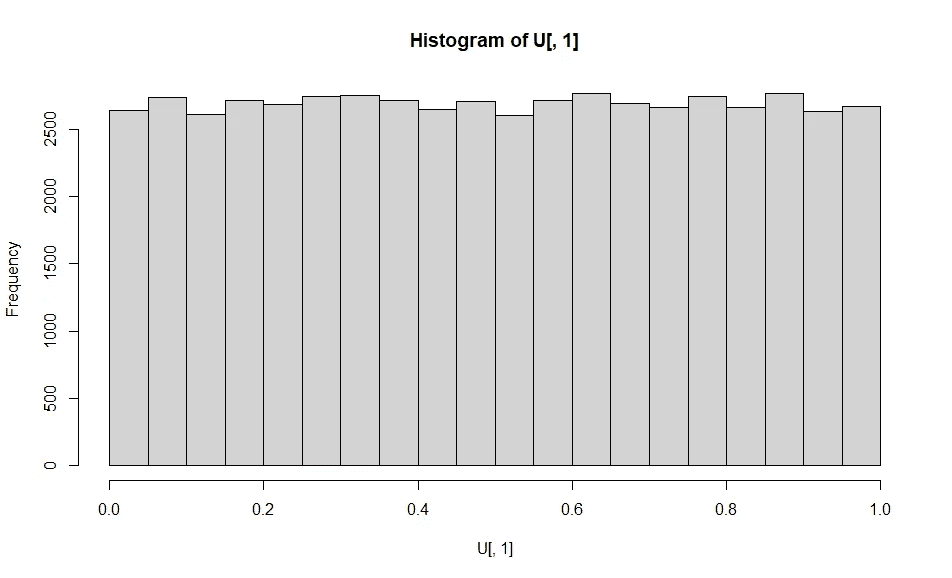*

*均匀分布矩阵中的第一个变量是克拉，现在也是均匀分布的。保持与所有其他数据的互相关。图片作者。*

*我们可以对不同的变量做同样的处理，比如*价格*。下面，你会看到我构建了新的*价格*和*克拉*的变量，但这次我是从泊松分布中对它们进行采样。这是三步中的最后一步，我可以通过**逆变换采样**，从包含均匀分布数据的矩阵 U 中创建任何我想要的分布。这是一个相当酷的技术！*

```
*price <- qpois(U[, 4], 5)
par(mfrow = c(2, 1))
hist(price)
hist(diamonds_num$price)

carat <- qpois(U[, 1], 30)
par(mfrow = c(2, 1))
hist(carat)
hist(diamonds_num$carat)*
```

***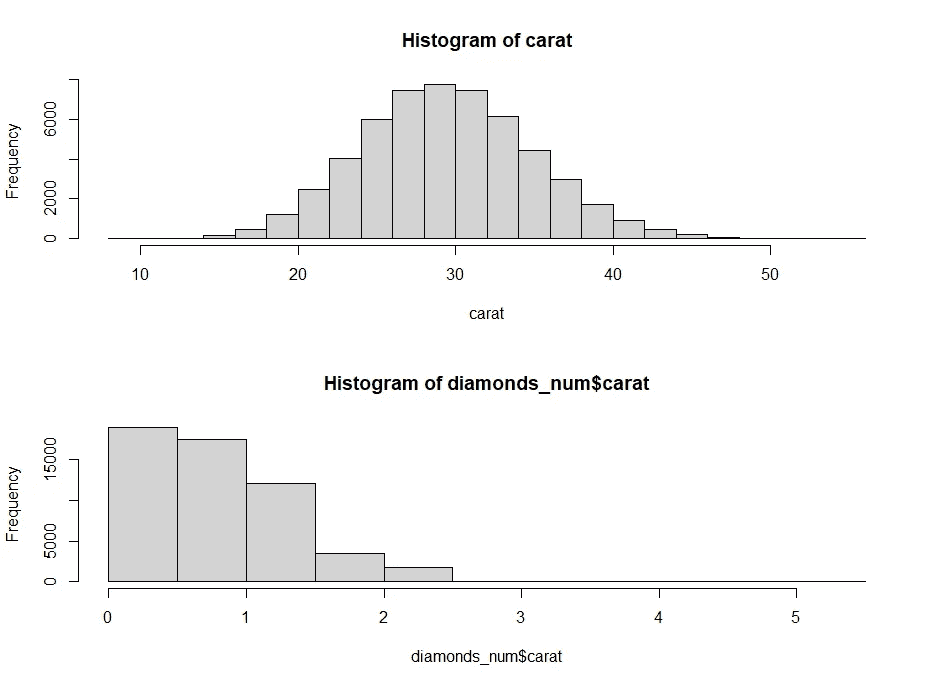*

*原始分布和我用 copula 做的分布。图片作者。*

```
*> cor(diamonds_num$carat, diamonds_num$price)
[1] 0.9215913012
> cor(carat, price)
[1] 0.9097580747*
```

*如您所见，这种相关性在一定程度上得以保持。出现偏差的原因是，离散数据的相关性(泊松分布)与连续数据的相关性(高斯分布)不同。*

*我们现在可以看看建模部分。我现在不使用 carat，而是选择一种更直接的方法来确保训练和测试集的采样以及交叉验证不会碍事。下面是两个简单的线性回归。*

```
*fit1<-lm(carat~price, data=diamonds_num)
fit2<-lm(carat~price, data=data.frame(cbind(carat,price)))
fit1;fit2

Call:
lm(formula = carat ~ price, data = diamonds_num)

Coefficients:
 (Intercept)         price  
0.3672972042  0.0001095002  

Call:
lm(formula = carat ~ price, data = data.frame(cbind(carat, price)))

Coefficients:
(Intercept)        price  
  18.887067     2.224347* 
```

*很明显，系数不同，但这是意料之中的，因为我建立了不同的描述符。*

```
*par(mfrow = c(2, 4))
plot(fit1);plot(fit2)*
```

*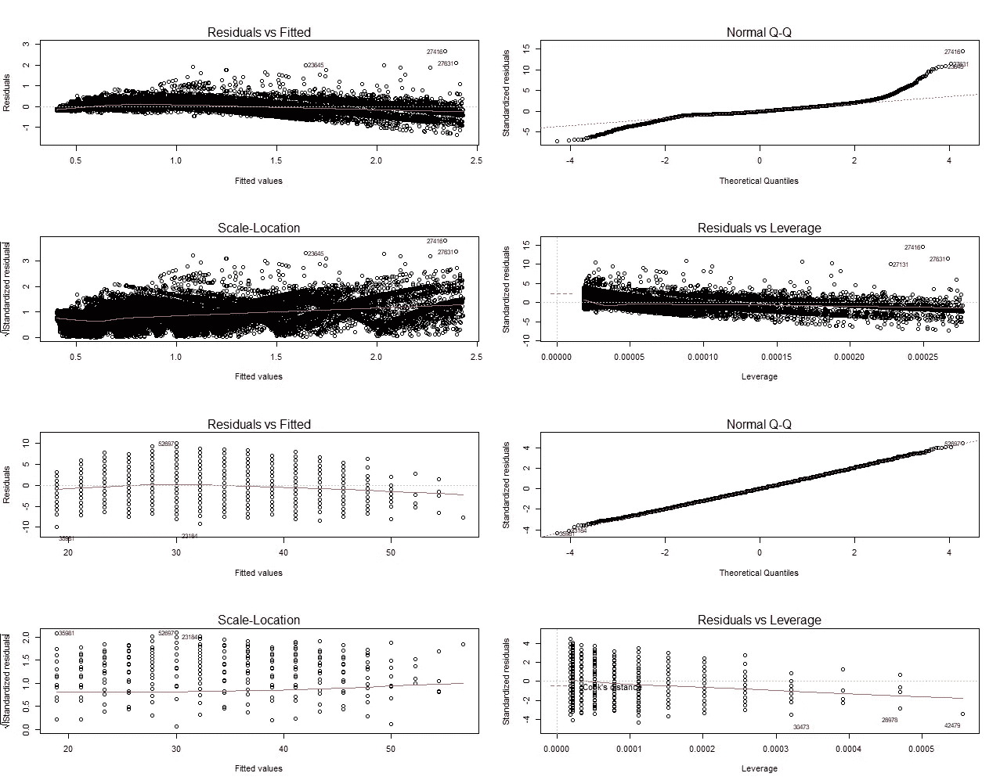*

*模型拟合当然也有差异——上述四个图的矩阵来自原始数据，这些数据并不原始。后四个图来自我创建泊松分布的连接函数。假设正常数据是错误的，使用线性回归分析离散数据。图片作者。*

*一个更好的测试，仍然要记住泊松数据的线性回归是错误的，是对交互作用建模。还有什么比使用[花键](https://medium.com/mlearning-ai/determining-the-rent-d1431c90ca9f)更好的方法呢！*

```
*depth <- qpois(U[, 2], 30)
fit1<-lm(price~ns(carat,3)*ns(depth,3), data=diamonds_num)
fit2<-lm(price~ns(carat,3)*ns(depth,3), data=data.frame(cbind(carat,price, depth)))

> fit1

Call:
lm(formula = price ~ ns(carat, 3) * ns(depth, 3), data = diamonds_num)

Coefficients:
                (Intercept)                ns(carat, 3)1                ns(carat, 3)2  
                  2218.8390                   17936.5330                 -126840.8539  
              ns(carat, 3)3                ns(depth, 3)1                ns(depth, 3)2  
               -231168.4360                   -1091.1322                    1362.9843  
              ns(depth, 3)3  ns(carat, 3)1:ns(depth, 3)1  ns(carat, 3)2:ns(depth, 3)1  
                  7416.9316                    -329.7165                   68951.7911  
ns(carat, 3)3:ns(depth, 3)1  ns(carat, 3)1:ns(depth, 3)2  ns(carat, 3)2:ns(depth, 3)2  
                118173.3027                  -19264.2274                  263279.9813  
ns(carat, 3)3:ns(depth, 3)2  ns(carat, 3)1:ns(depth, 3)3  ns(carat, 3)2:ns(depth, 3)3  
                480346.8166                  -34626.0634                   14745.8991  
ns(carat, 3)3:ns(depth, 3)3  
                 73406.4320  

> fit2

Call:
lm(formula = price ~ ns(carat, 3) * ns(depth, 3), data = data.frame(cbind(carat, 
    price, depth)))

Coefficients:
                (Intercept)                ns(carat, 3)1                ns(carat, 3)2  
               -1.148528255                  8.348102184                 17.258451783  
              ns(carat, 3)3                ns(depth, 3)1                ns(depth, 3)2  
               15.909197993                 -0.242271773                 -1.327453563  
              ns(depth, 3)3  ns(carat, 3)1:ns(depth, 3)1  ns(carat, 3)2:ns(depth, 3)1  
               -0.862625027                 -0.393382870                 -0.090925281  
ns(carat, 3)3:ns(depth, 3)1  ns(carat, 3)1:ns(depth, 3)2  ns(carat, 3)2:ns(depth, 3)2  
               -0.029317928                 -0.006505344                  0.323633739  
ns(carat, 3)3:ns(depth, 3)2  ns(carat, 3)1:ns(depth, 3)3  ns(carat, 3)2:ns(depth, 3)3  
               -1.189341372                  0.188006534                 -0.109592519  
ns(carat, 3)3:ns(depth, 3)3  
               -0.984283018* 
```

*当然，系数是不一样的，因为数据没有标准化，但让我们看看相互作用图。人们会假设，如果数据的本质得到维护，变量之间的关系也会得到维护。*

```
*sjPlot::plot_model(fit1, type="pred")
sjPlot::plot_model(fit2, type="pred")*
```

*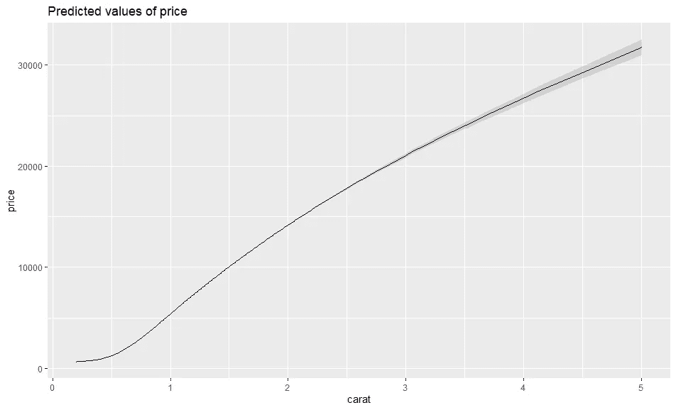**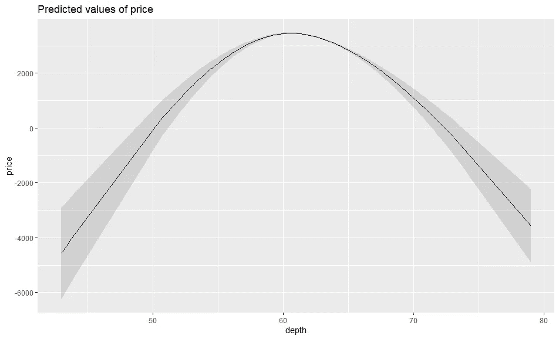**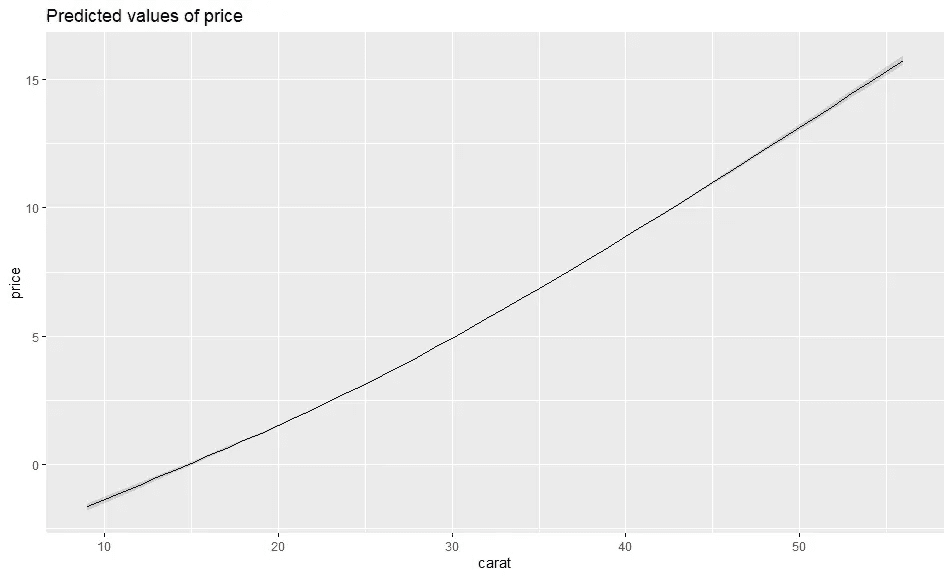**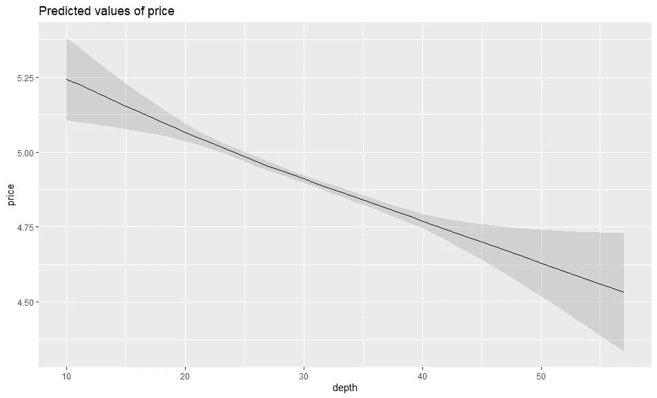*

*上面你看到的是来自原始数据的变量之间的关系，下面你看到的是来自合成数据的关系。**克拉**和**价格**之间的关系似乎在某种程度上得以维持，但**深度**和**价格**肯定不是。我之所以选择样条曲线，是因为它们经常被使用，并且非常依赖于数据。因此，从原始到合成的转换中的错误转折很可能会被样条曲线拾取。图片作者。*

*检查转换和模型有效性的一个好方法是绘制原始数据并与合成数据进行比较，因为深度和价格根本不相关。两个模型都显示了联系。*

*我将使用 ggplot 并在原始数据的图形中拟合一条样条线。*

```
*ggplot(diamonds_num, 
       aes(x=depth, y=price))+
  geom_point()+
  geom_smooth()+
  theme_bw()

ggplot(diamonds_num, 
       aes(x=carat, y=price))+
  geom_point()+
  geom_smooth()+
  theme_bw()*
```

*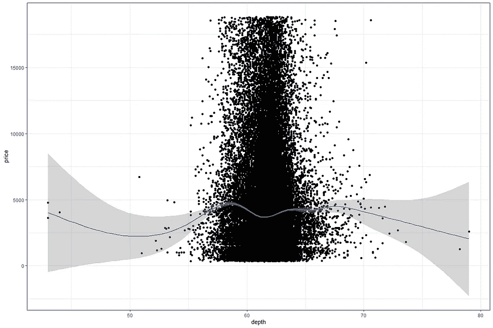**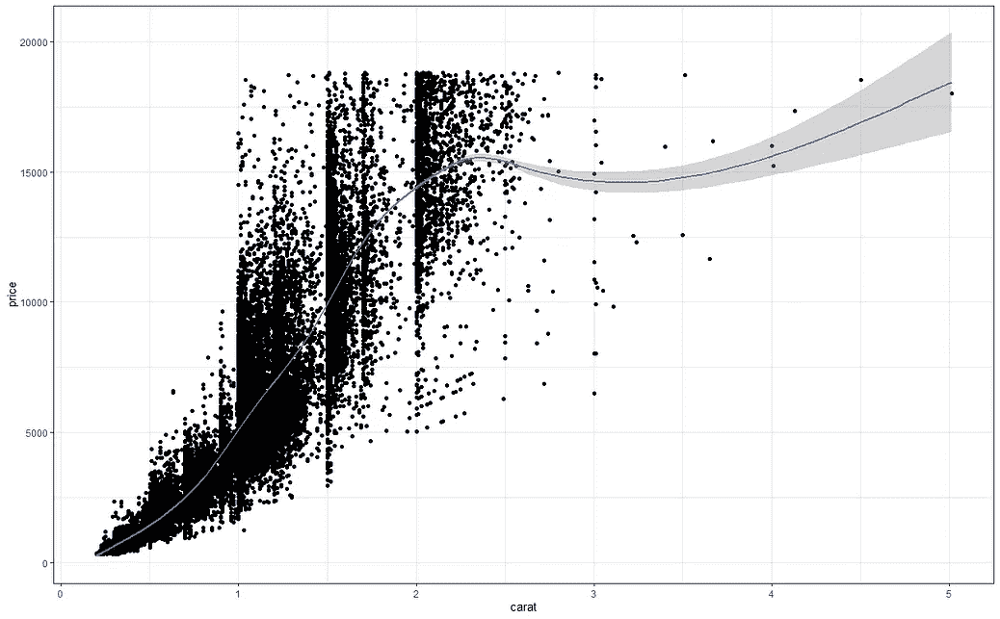*

*清楚地显示了数据样条拟合的问题。如你所见，**价格**和**克拉**在这个二维层面上没有相关性，但样条曲线确实倾向于在中间跳动一点。在右边，我们看到**克拉**和**价格**被显示出来，在它们的顶部，一条样条线首先画出了一个清晰的关系。然后，它需要一个沉重的曲线来寻找它能找到的任何点。样条的伟大和危险显示在两个图中。图片作者。*

*以上图为原始数据。让我们也观察一下，如果我在合成数据上绘图会发生什么，现在合成数据具有与原始数据完全不同的分布属性(离散的，而不是原始的连续标度)。*

```
*g1<-ggplot(diamonds_num, 
       aes(x=carat, y=price))+
  geom_point()+
  geom_smooth()+
  theme_bw()
g2<-ggplot(data.frame(cbind(carat,price, depth)), 
       aes(x=carat, y=price))+
  geom_point()+
  geom_smooth()+
  theme_bw()
gridExtra::grid.arrange(g1,g2,nrow=1)

g1<-ggplot(diamonds_num, 
           aes(x=carat, y=depth))+
  geom_point()+
  geom_smooth()+
  theme_bw()
g2<-ggplot(data.frame(cbind(carat,price, depth)), 
           aes(x=carat, y=depth))+
  geom_point()+
  geom_smooth()+
  theme_bw()
gridExtra::grid.arrange(g1,g2,nrow=1)* 
```

*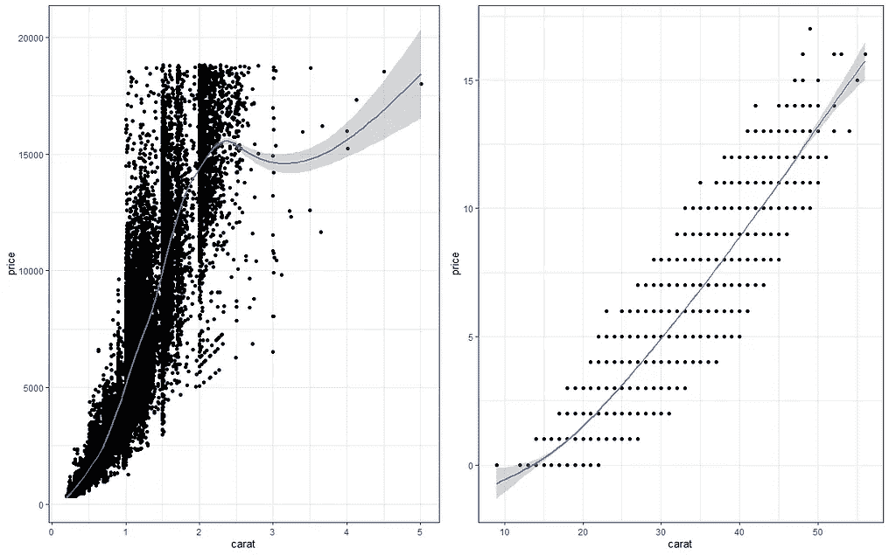**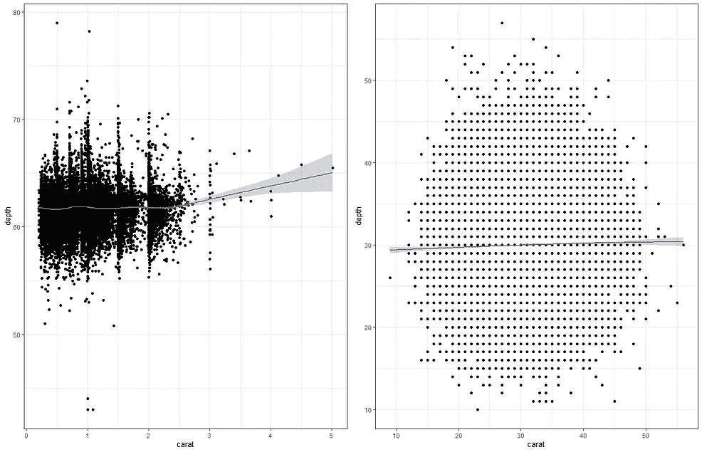*

*这里我们看到了两次观察同一关系的图。我们有**克拉**和**价格**，我们有**克拉**和**深度**。两者似乎都坚持原来的关系，即使来自不同的分布，但它并不完美。图片作者。*

*看上面的图，我们可以看到大部分的原始关系(或缺失)被保持。合成数据不会完美也就不足为奇了。此外，原始数据和合成数据的模型显示不同的系数也就不足为奇了。我已经制作了数据，所以它会有不同的描述特征，即使来自不同类型的分布，但仍然能够保持它的本质。*

*这篇博文只是一个简短的介绍，介绍了一种构建合成数据的方法，而且只是关于数值。使用 copulas，我们可以构建许多不同类型的合成数据。此外，我们还没有冒险进入深度学习，如 GANs，它主要用于建立合成数据。这个例子表明，我们不必走那么远。*

*如果有什么不对劲，请告诉我！*