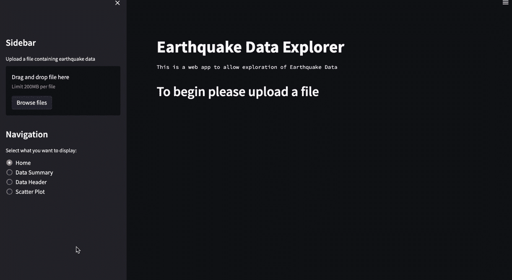
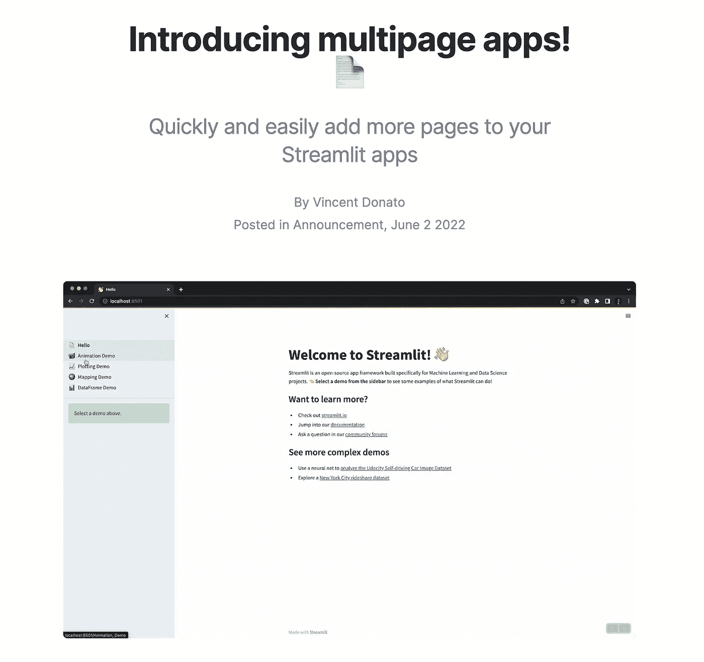
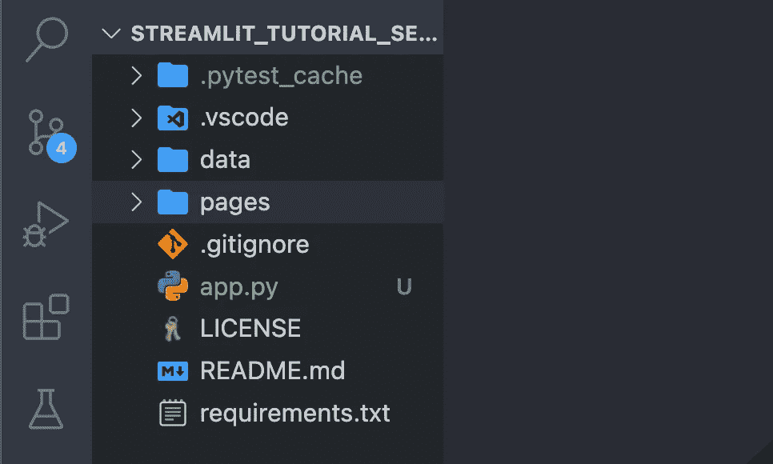
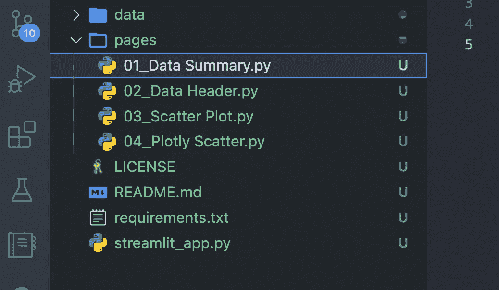
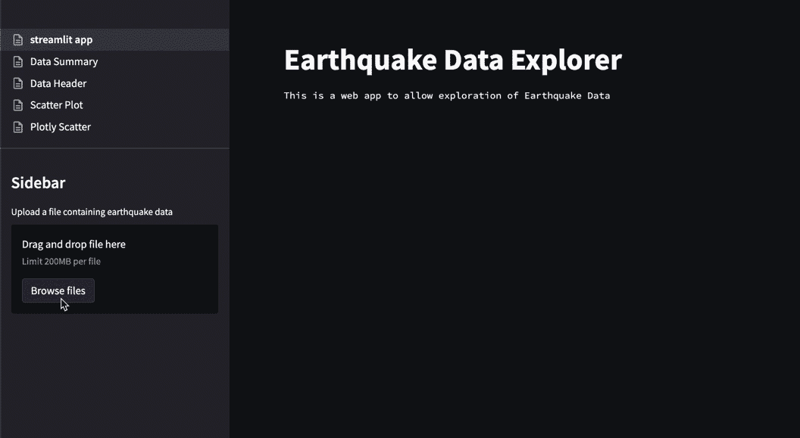
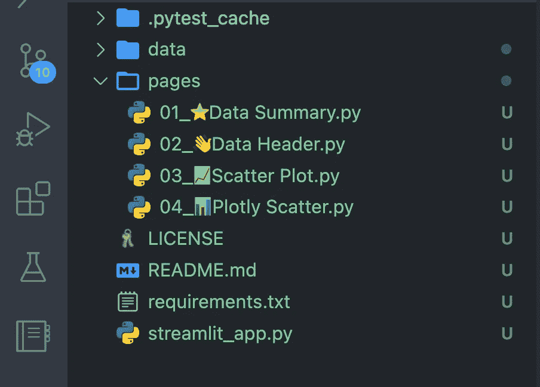
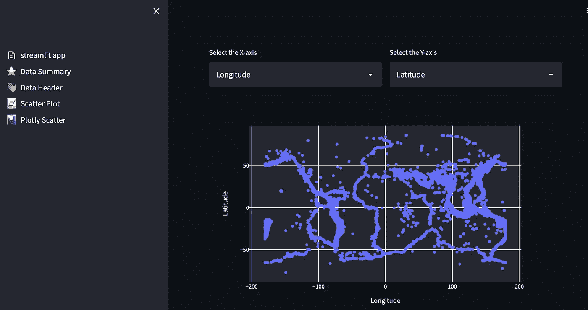

# 创建真正的多页面简化应用——新方式(2022 年)

> 原文：<https://towardsdatascience.com/creating-true-multi-page-streamlit-apps-the-new-way-2022-b859b3ea2a15>

## 制作多页简化应用程序的最新方法


尼克·莫里森在 [Unsplash](https://unsplash.com?utm_source=medium&utm_medium=referral) 上拍摄的照片

[Streamlit](https://streamlit.io/) 是一个基于 python 的开源框架，用于开发和部署交互式[数据科学](https://en.wikipedia.org/wiki/Data_science)仪表盘和[机器学习](https://www.ibm.com/cloud/learn/machine-learning)模型。

在我之前的 Streamlit 文章中，我讨论了如何开始构建一个简单的地震数据浏览器。这是一个简单的单页 web 应用程序，允许您查看数据并生成一些图表。

构建单个页面的 Streamlit 应用程序相对简单，然而，直到最近，构建具有多个页面的 Streamlit 应用程序还需要许多变通方法。[随着真正的多页简化应用程序的发布，这种情况有所改变](https://blog.streamlit.io/introducing-multipage-apps/)。

在本教程中，我们将介绍如何使用新技术创建一个多页面的 Streamlit 应用程序。我还发布了一个 YouTube 视频，你可以在下面看到。

## 教程的数据源

本教程使用的数据可以在 CC0: Public Domain 下使用，并且来自 Kaggle。这是一个数据集，包含 1965 年至 2016 年期间世界上震级为 5.5 或更高的最重大地震的数据。您可以通过以下链接查看原始数据。

[https://www.kaggle.com/datasets/usgs/earthquake-database?select=database.csv](https://www.kaggle.com/datasets/usgs/earthquake-database?select=database.csv)

# 为什么要在一个 Streamlit 应用中使用多个页面？

当使用 [Streamlit](https://streamlit.io/) 构建基于 web 的应用程序时，很容易连续不断地向我们的应用程序添加部分，一个接一个。然而，这最终会生成一个页面，这个页面可能会很快变得很长。

解决这个问题的一个方法是将信息分成多页。这改善了应用程序的外观和感觉，也改善了用户体验。

## 创建多页面简化应用程序的老方法

直到最近 [Streamlit](https://streamlit.io/) 还没有一个官方的方法来给一个应用添加多个页面。作为变通办法，我们不得不[使用单选按钮或下拉列表在我们的](https://medium.com/@u.praneel.nihar/building-multi-page-web-app-using-streamlit-7a40d55fa5b4) [Streamlit](https://streamlit.io/) 应用程序的不同页面或部分之间切换。虽然这是一个很好的方法，但看起来确实有点“粗糙”。

以下示例说明了使用单选按钮更改应用程序中主要内容的过程。本质上，当一个按钮被选中时，旧的内容被隐藏，新的内容被添加。



使用单选按钮的多页 Streamlit 应用程序示例。图片由作者提供。

上面的例子是使用下面的代码生成的。所有代码都包含在一个 Python 文件中，然后可以通过调用来运行该文件。

```
streamlit run app.py
```

# 创建多页简化应用程序的新方法

【2022 年 6 月 2 日，Streamlit 宣布真正的多页面应用功能的到来。他们没有使用选择框，而是对库进行了改造，使其能够本地处理多个页面。

这是一个很大的进步，尤其是如果你是一个 Streamlit 的重度用户。



Streamlit 宣布真正的多页面功能的到来。

## 创建多页 Streamlit 应用程序—新方式

以下方法适用于新应用程序和现有应用程序。

要使用新功能，您需要使用以下方式更新您的 Streamlit 版本:

```
pip install --upgrade streamlit
```

在您的主 Streamlit 应用程序目录中，创建一个名为 pages 的新子目录。



在该文件夹中，开始为您想要添加到应用程序的每个页面添加新的`.py`文件。Streamlit 将自动检测这些文件，并开始将它们作为页面添加到应用程序中。

页面会自动按字母顺序排序。如果你想控制页面的顺序，你可以在文件的开头添加一个数字。



如果您的主要 Streamlit 应用程序 python 文件中有现有的函数/代码，您可以将它们转移到新文件中，并根据需要进行拆分。此外，如果你有代码创建单选按钮，这可以从你的主应用程序中删除。

现在你的页面已经创建好了，在你的应用文件夹中打开你的终端/命令提示符，输入如下。

```
streamlit run streamlit_app.py
```

请注意，您需要将`streamlit_app.py`部分更改为您的主应用程序文件的名称。

一旦您重新启动并运行了 Streamlit，您将会在应用程序的左侧看到新菜单。

默认情况下，您的主应用程序页面将位于菜单顶部。



下面是新的`streamlit_app.py`文件中的代码:

这是其中一页的代码示例。请注意，您确实需要为每个子页导入 streamlit。

# 添加页面图标

当您向 Streamlit 应用程序添加新页面时，页面的图标将全部相同。然而，你可以使用表情图标在菜单和页面标题中添加一个简单的图标，就像这样。



使用文件名中的表情符号简化多页应用程序，以生成菜单图标。图片由作者提供。

当你回到你的应用程序时，每个菜单项现在都有相同的图标。



使用页面图标简化多页面应用程序。图片由作者提供。

我不确定在 python 文件中给文件名添加表情符号有多稳定，但是时间会证明一切。

# 通过会话状态在 Streamlit 应用程序页面之间传递数据

需要注意的最后一点是，上面创建的每个页面都是独立运行的。换句话说，如果你在一个页面上上传了一个文件，它在另一个页面上是不可用的。

处理这个问题的一种方法是使用会话状态。

例如，如果您想使用 Pandas 数据帧，那么在文件上传器所在的`.py`中添加如下代码:

```
st.session_state['df'] = df
```

然后在其他`.py`文件中，调用该会话状态来检索数据帧，如下所示:

```
df = st.session_state['df']
```

然后，您应该能够在任何页面中处理这些数据，而不必重新加载这些数据。

# 摘要

为 [Streamlit](https://streamlit.io/) 添加一个真正的多页面功能是期待已久的改进，它确实改善了用户体验。但是，当处理多个页面时，您需要将希望在它们之间使用的数据保存到会话状态中。

*感谢阅读。在你走之前，你一定要订阅我的内容，把我的文章放到你的收件箱里。* [***你可以在这里做！***](https://andymcdonaldgeo.medium.com/subscribe)

其次，通过注册会员，你可以获得完整的媒介体验，并支持我自己和成千上万的其他作家。它每个月只花你 5 美元，你可以完全接触到所有令人惊叹的媒体文章，也有机会用你的写作赚钱。如果你使用 [***我的链接***](https://andymcdonaldgeo.medium.com/membership) ***，*** *报名，你会直接用你的一部分费用支持我，不会多花你多少钱。如果你这样做了，非常感谢你的支持！*