# 用 Plotly 创建各种剧情类型和支线剧情

> 原文：<https://towardsdatascience.com/creating-various-plot-types-and-subplots-with-plotly-bd727f808262>

## Python 科学绘图

## 使用 plotly 创建条形图、直方图、散点图、气泡图和箱线图，并用子图排列它们


卢克·切瑟在 [Unsplash](https://unsplash.com?utm_source=medium&utm_medium=referral) 上拍摄的照片

现在你已经有了一些使用`plotly`包的背景知识(如果你想要一个好的介绍，你可以阅读我以前写的一篇文章)，你可能想要扩展一些你有的绘图选项。在这篇文章中，我将展示`plotly`中其他一些基本的剧情选项，以及如何利用支线剧情来设置面板人物。我们将查看条形图、直方图、散点图/气泡图和箱线图。正如我们在以前的文章中所做的那样，我们将使用`plotly.graph_objects`从零开始构建我们的数字。

# 条形图

让我们从创建一些虚拟数据来绘制条形图开始。我们可以使用`numpy`如下所示:

```
# import packages
import numpy as np# create dummy data
vals = np.ceil(100 * np.random.rand(5)).astype(int)
keys = ["A", "B", "C", "D", "E"]
```

现在我们可以在柱状图上绘制这些键值对。我们需要做的第一件事是使用`plotly.graph_objects`创建一个图形:

```
# import packages
import plotly.graph_objects as go# create figure
fig = go.Figure()
```

现在，我们将条形图添加到我们的图中，并用以下代码行显示结果。为了便于查看，我们还可以更新布局中图形的高度和宽度。

```
# plot data
fig.add_trace(
 go.Bar(x=keys, y=vals)
)fig.update_layout(height=600, width=600)fig.show()
```

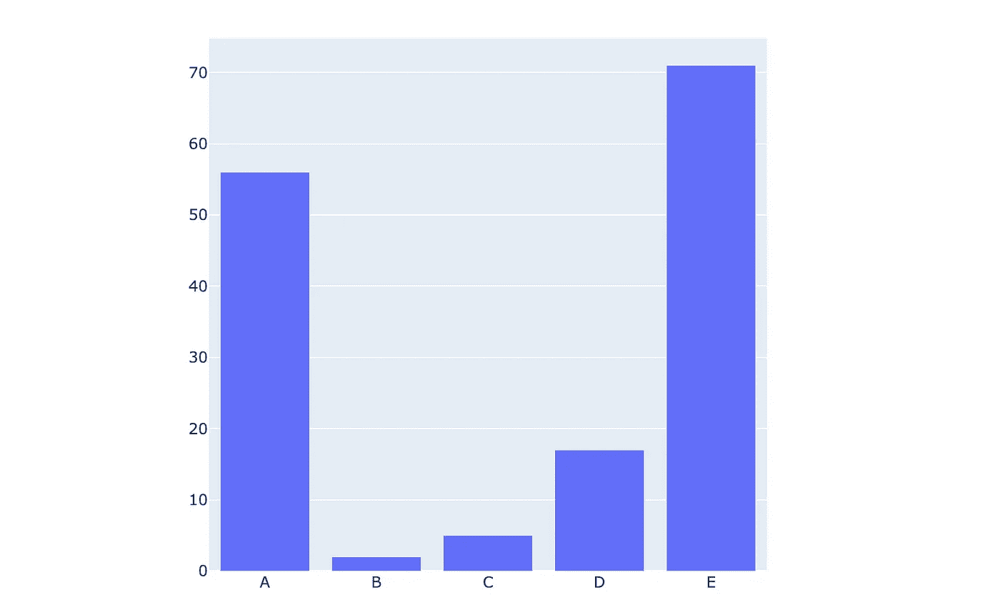

条形图—作者创建的图形

让我们对绘图布局做一些修饰性的更新，以修复某些东西，如轴标签和悬停在条形上方时显示的信息。

```
# create figure
fig = go.Figure()# plot data
fig.add_trace(
    go.Bar(x=keys, y=vals, hovertemplate="<b>Key:</b> %{x}<br><b>Value:</b> %{y}<extra></extra>")
)# update layout
fig.update_layout(
    font_family="Averta",
    hoverlabel_font_family="Averta",
    title_text="Bar Chart of Key-Value Pairs",
    xaxis_title_text="Keys",
    xaxis_title_font_size=18,
    xaxis_tickfont_size=16,
    yaxis_title_text="Values",
    yaxis_title_font_size=18,
    yaxis_tickfont_size=16,
    hoverlabel_font_size=16,
    height=600, 
    width=600
)fig.show()
```

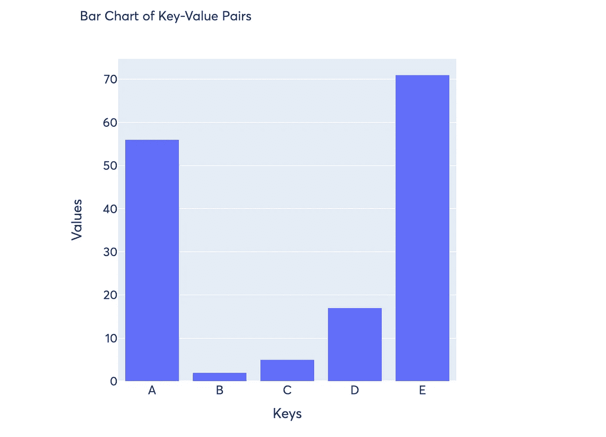

修改后的条形图—由作者创建的图表

## 分组和堆叠条形图

如果我们想要比较具有相同关键字的多个组的值，我们可以制作一个分组或堆叠条形图。为此，我们可以先在我们的图形中添加多个条形图，然后使用`fig.update_layout()`来改变条形图的模式。让我们首先制作几组虚拟数据，这样我们就可以创建分组和堆叠条形图。

```
# create more dummy data
vals_2 = np.ceil(100 * np.random.rand(5)).astype(int)
vals_3 = np.ceil(100 * np.random.rand(5)).astype(int)vals_array = [vals, vals_2, vals_3]
```

对于新的哑数据数组，我们现在遍历数组中的每个值列表，并向图中添加一个条形图。然后我们用`barmode="group"`更新布局，将它变成一个分组条形图。

```
# create figure
fig = go.Figure()# plot data
for i, vals in enumerate(vals_array):
    fig.add_trace(
        go.Bar(x=keys, y=vals, name=f"Group {i+1}", hovertemplate=f"<b>Group {i+1}</b><br><b>Key:</b> %{{x}}<br><b>Value:</b> %{{y}}<extra></extra>")
    )# update layout
fig.update_layout(
    barmode="group",
    font_family="Averta",
    hoverlabel_font_family="Averta",
    title_text="Bar Chart of Key-Value Pairs",
    xaxis_title_text="Keys",
    xaxis_title_font_size=18,
    xaxis_tickfont_size=16,
    yaxis_title_text="Values",
    yaxis_title_font_size=18,
    yaxis_tickfont_size=16,
    hoverlabel_font_size=16,
    legend_font_size=16,
    height=600, 
    width=600
)fig.show()
```

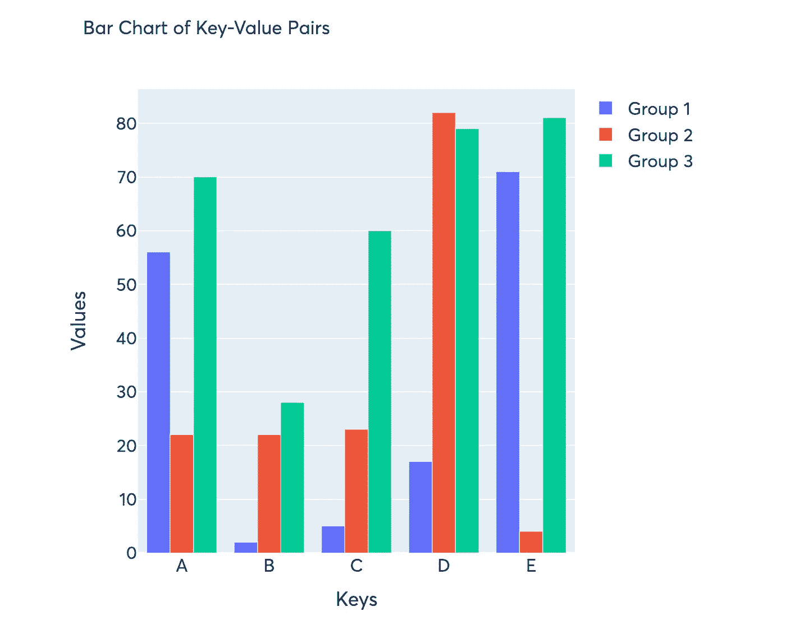

分组条形图—由作者创建的图表

为了把它变成一个堆积条形图，我们简单地把`fig.update_layout(barmode="group")`修改为`fig.update_layout(barmode="stack")`

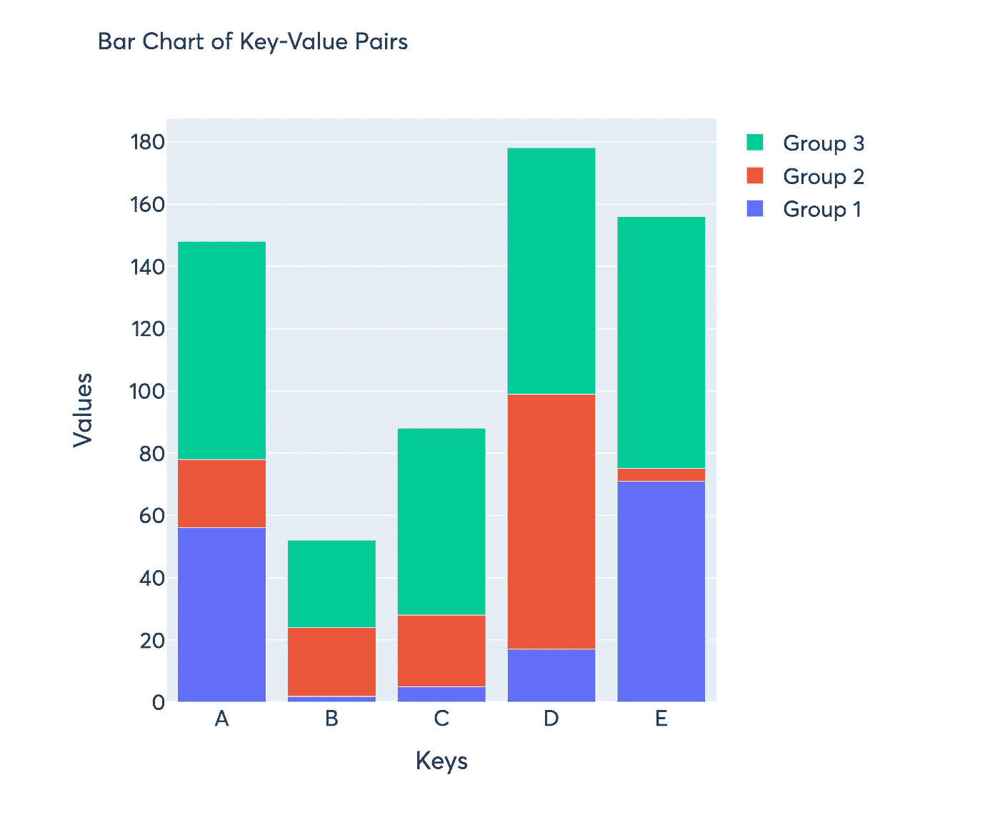

堆积条形图—由作者创建的图表

# 直方图

绘制直方图对于理解基础数据非常有用，通过观察数据的分布，您可以了解更多关于定量趋势和异常值的信息。这些在`plotly`中也很简单，只需要几行代码。同样，我们从创建虚拟数据开始——我们将使用`numpy.random.normal()`从正态分布中取样，并将该数据绘制成直方图。

```
# create data
data = np.random.normal(size=1000)
```

现在，为了绘制一个简单的直方图，我们使用下面几行代码:

```
# create figure
fig = go.Figure()# plot data
fig.add_trace(
    go.Histogram(x=data, hovertemplate="<b>Bin Edges:</b> %{x}<br><b>Count:</b> %{y}<extra></extra>")
)fig.update_layout(
    height=600,
    width=600
)fig.show()
```

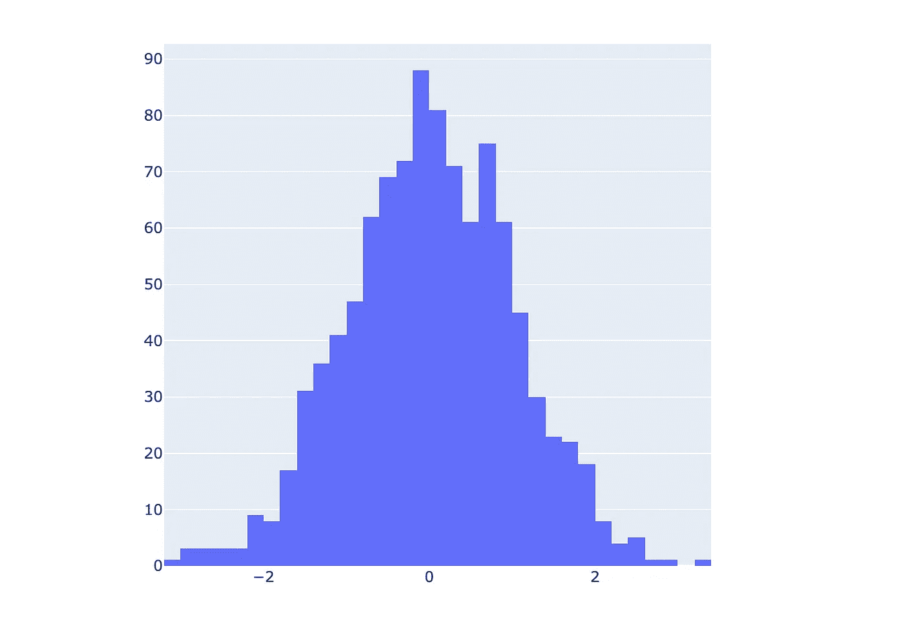

简单直方图—由作者创建的图表

正如预期的那样，直方图类似于正态分布，这是有意义的，因为这是我们从中采样的。请注意，本例中的 y 轴是每个仓中的样本数，我们也可以将其归一化为一个概率值，这与 y 轴上的计数值除以样本总数基本相同。

```
# create figure
fig = go.Figure()# plot data
fig.add_trace(
    go.Histogram(x=data, histnorm="probability", hovertemplate="<b>Bin Edges:</b> %{x}<br><b>Count:</b> %{y}<extra></extra>")
)fig.update_layout(
    font_family="Averta",
    hoverlabel_font_family="Averta",
    title_text="Histogram of Samples from Normal Distribution",
    xaxis_title_text="Values",
    xaxis_title_font_size=18,
    xaxis_tickfont_size=16,
    yaxis_title_text="Probability",
    yaxis_title_font_size=18,
    yaxis_tickfont_size=16,
    hoverlabel_font_size=16,
    height=600, 
    width=600
)fig.show()
```

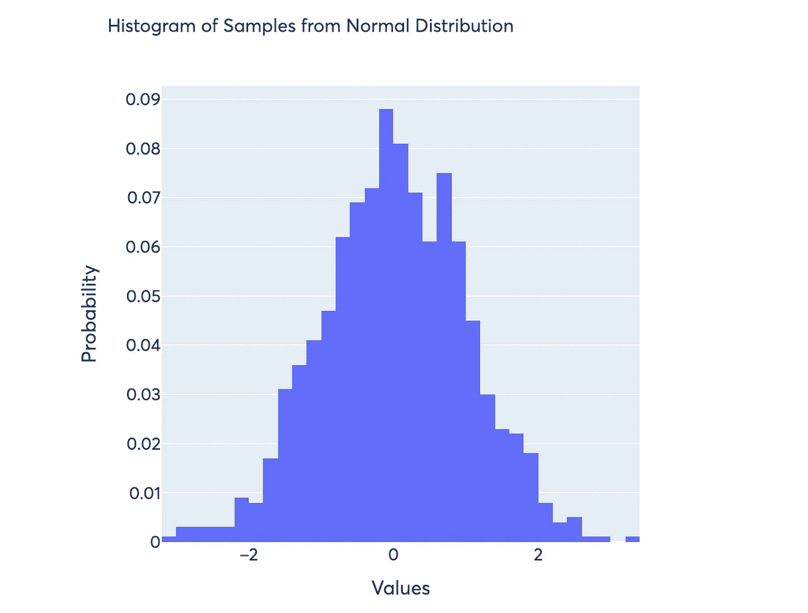

概率直方图—由作者创建的图表

最后，如果我们想把我们的直方图看作一个累积分布函数而不是一个概率分布函数，我们可以如下传递参数`cumulative_enabled=True`:

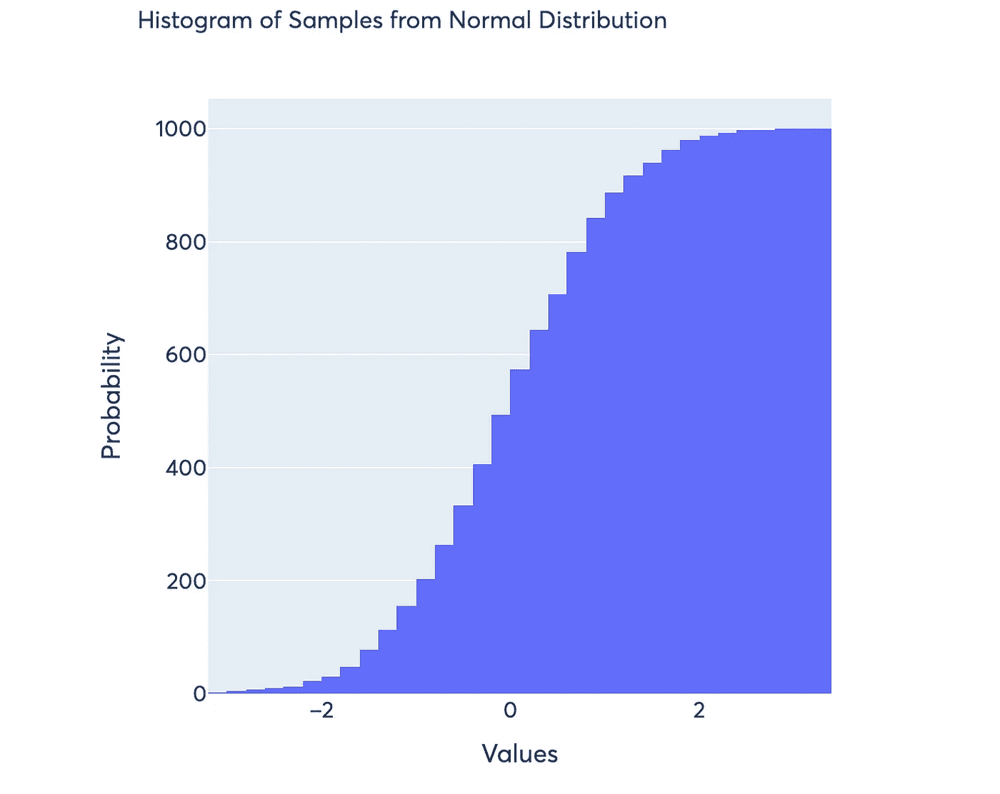

累积直方图—由作者创建的图表

# 散点图和气泡图

让我们从创建一个简单的散点图开始。我们从创建一些虚拟数据开始:

```
# create dummy data
x = [i for i in range(1, 6)]
y = np.ceil(100 * np.random.rand(5)).astype(int)
```

现在，我们可以将这些数据绘制成散点图，如下所示:

```
# create figure
fig = go.Figure()# plot data
fig.add_trace(
    go.Scatter(x=x, y=y, mode="markers", hovertemplate="<b>x:</b> %{x}<br><b>y:</b> %{y}<extra></extra>")
)fig.update_layout(
    font_family="Averta",
    hoverlabel_font_family="Averta",
    title_text="Basic Scatter Plot",
    xaxis_title_text="x",
    xaxis_title_font_size=18,
    xaxis_tickfont_size=16,
    yaxis_title_text="y",
    yaxis_title_font_size=18,
    yaxis_tickfont_size=16,
    hoverlabel_font_size=16,
    height=600, 
    width=600
)fig.show()
```

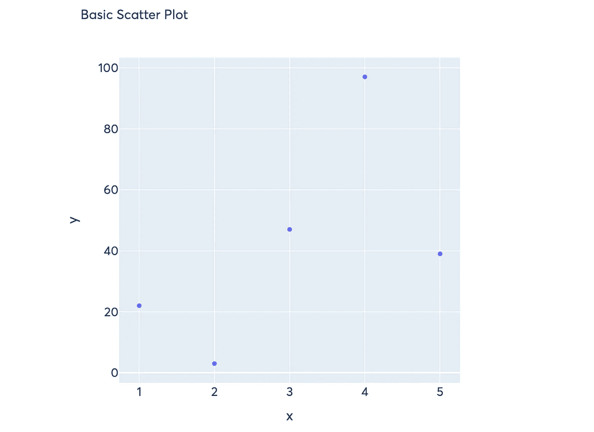

基本散点图—由作者创建的图形

现在我们可以把它变成一个气泡图——气泡图只是一个散点图，通过标记的大小传达第三维信息。首先，让我们为我们的标记创建一些不同的大小。

```
# dummy data for marker size
s = np.ceil(30 * np.random.rand(5)).astype(int)
```

现在，要将上面的散点图转换成气泡图，我们需要做的就是将一个大小值数组传递给`marker_size`参数。如果我们想在悬停工具提示中包含大小，我们还需要创建一个`text`参数，并将其设置为等于我们的数组大小。然后，我们可以在创建`hovertemplate`时引用该文本—为了创建气泡图，我们使用了以下代码行:

```
# create figure
fig = go.Figure()# plot data
fig.add_trace(
    go.Scatter(x=x, y=y, mode="markers", marker_size=s, text=s, hovertemplate="<b>x:</b> %{x}<br><b>y:</b> %{y}<br><b>Size:</b> %{text}<extra></extra>")
)fig.update_layout(
    font_family="Averta",
    hoverlabel_font_family="Averta",
    title_text="Basic Bubble Chart",
    xaxis_title_text="x",
    xaxis_title_font_size=18,
    xaxis_tickfont_size=16,
    yaxis_title_text="y",
    yaxis_title_font_size=18,
    yaxis_tickfont_size=16,
    hoverlabel_font_size=16,
    height=600, 
    width=600
)fig.show()
```

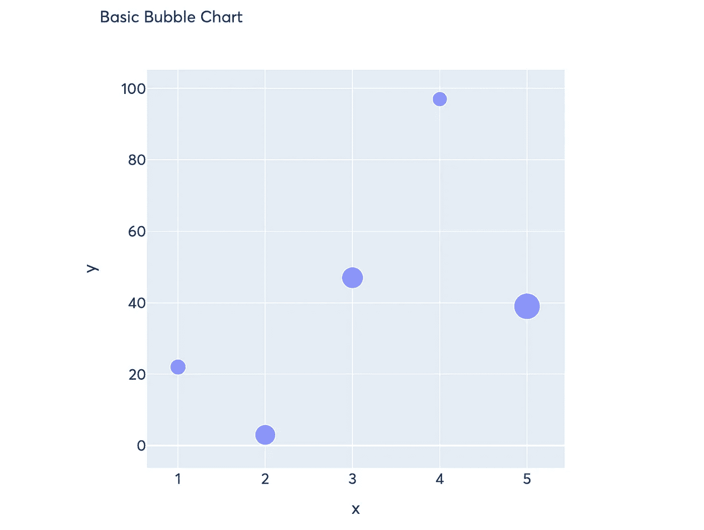

基本气泡图—由作者创建的图形

# 箱线图

箱线图是收集有关数据分布的汇总统计信息的最有用的图之一。方框图显示数据范围和四分位值，以及数据中存在的异常值。在`plotly`中，这些都是非常简单的生产。我们将从创建一些虚拟数据开始:

```
# create dummy data for boxplots
y1 = np.random.normal(size=1000)
y2 = np.random.normal(size=1000)
```

我们可以将这两个数据集添加为同一轴上的独立盒状图，并将它们标记为`Dataset 1`和`Dataset 2`

```
# create figure
fig = go.Figure()# plot data
fig.add_trace(
    go.Box(y=y1, name="Dataset 1"),
)fig.add_trace(
    go.Box(y=y2, name="Dataset 2"),
)fig.update_layout(
    font_family="Averta",
    hoverlabel_font_family="Averta",
    title_text="Basic Box Plots",
    xaxis_title_text="Datasets",
    xaxis_title_font_size=18,
    xaxis_tickfont_size=16,
    yaxis_title_text="Values",
    yaxis_title_font_size=18,
    yaxis_tickfont_size=16,
    hoverlabel_font_size=16,
    height=600, 
    width=600
)fig.show()
```

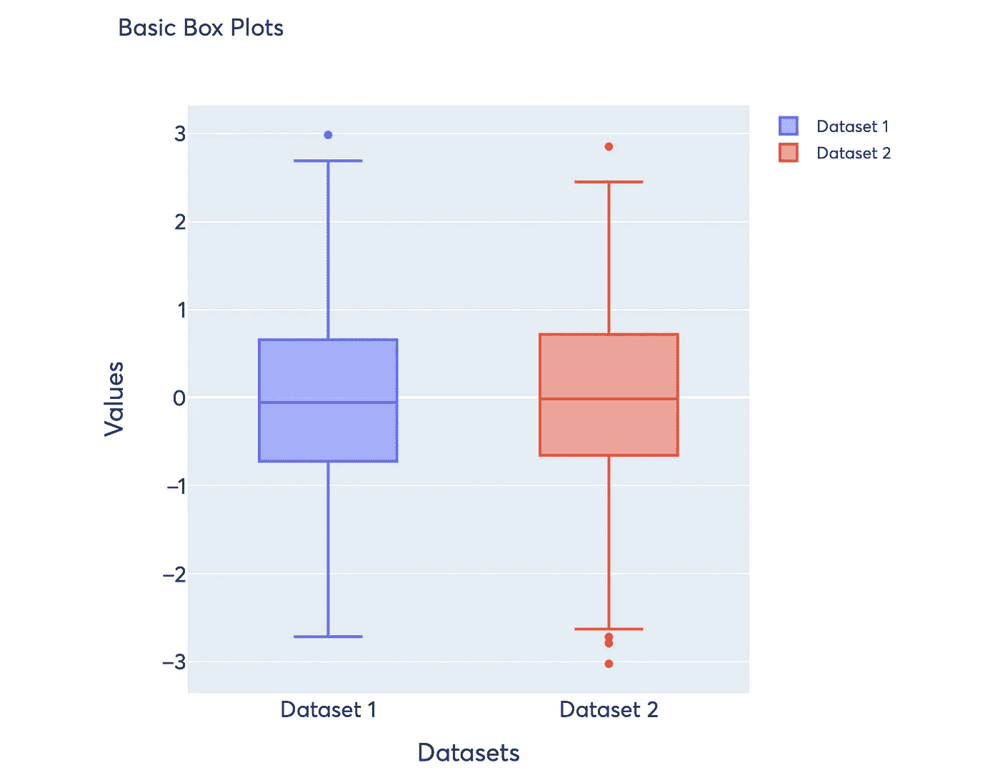

基本箱线图—作者创建的图形

这已经包含了我们需要的大部分信息，你会注意到悬停模板已经很好了，并且传达了这些信息。如果我们想让这个看起来更“有趣”，我们可以在方框图旁边添加实际的数据分布，以便读者查看。当我们这样做时，我们需要设置参数`boxpoints="all"`并添加一个`jitter`，它是一个值，用于将具有相似值的点展开，以便读者更容易看到分布。

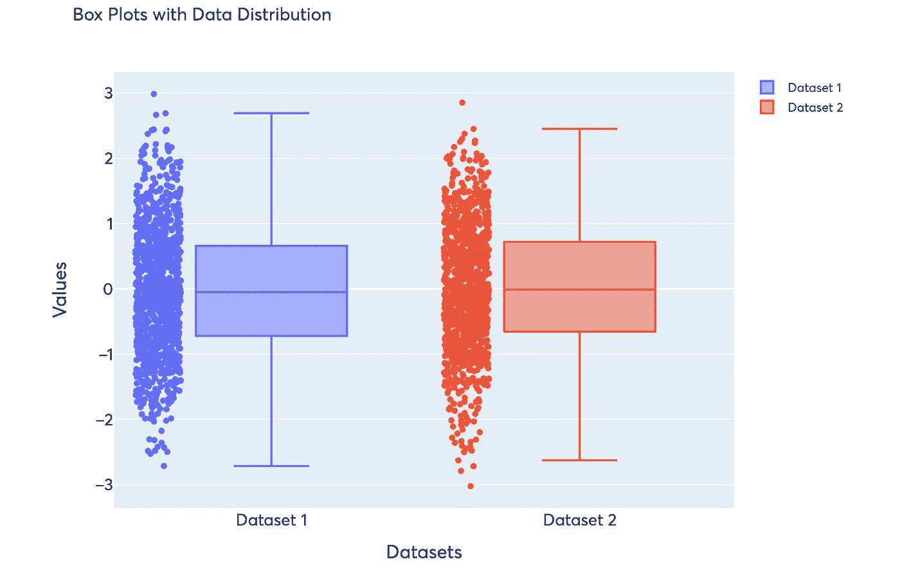

带数据分布的箱线图—由作者创建的图表

# 支线剧情

现在把它们放在一起，让我们用条形图、柱状图、气泡图和箱线图创建一个包含 4 个支线剧情的面板图。为了创建支线剧情，我们首先需要从`plotly.subplots`导入`make_subplots`:

```
# import packages
from plotly.subplots import make_subplots
```

现在，与之前唯一的不同是，当我们初始化我们的图形时，我们使用`make_subplots`来创建我们想要的图形布局。

```
# create figure
fig = make_subplots(rows=2, cols=2)
```

让我们首先创建一组主虚拟数据，我们将需要这四个图，我们将添加到这个数字:

```
# create dummy data
x = [i for i in range(1, 6)]
y = np.ceil(100 * np.random.rand(5)).astype(int)
s = np.ceil(30 * np.random.rand(5)).astype(int)
y1 = np.random.normal(size=1000)
y2 = np.random.normal(size=1000)
```

我们现在所要做的就是，当我们向我们的图形添加一个轨迹时，我们需要提供一个行和列值，以便`plotly`知道在哪里放置这个图。需要注意的一点是，这里的索引从 1 开始！

```
# plot data
fig.add_trace(
    go.Bar(x=x, y=y, hovertemplate="<b>x:</b> %{x}<br><b>y:</b> %{y}<extra></extra>"),
    row=1, col=1
)fig.add_trace(
    go.Histogram(x=y1, hovertemplate="<b>Bin Edges:</b> %{x}<br><b>Count:</b> %{y}<extra></extra>"),
    row=1, col=2
)fig.add_trace(
    go.Scatter(x=x, y=y, mode="markers", marker_size=s, text=s, hovertemplate="<b>x:</b> %{x}<br><b>y:</b> %{y}<br><b>Size:</b> %{text}<extra></extra>"),
    row=2, col=1
)fig.add_trace(
    go.Box(y=y1, name="Dataset 1"),
    row=2, col=2
)fig.add_trace(
    go.Box(y=y2, name="Dataset 2"),
    row=2, col=2
)fig.update_xaxes(title_font_size=18, tickfont_size=16)
fig.update_yaxes(title_font_size=18, tickfont_size=16)fig.update_layout(
    font_family="Averta",
    hoverlabel_font_family="Averta",
    title_text="Subplots with Bar, Histogram, Bubble, and Box Plots",
    xaxis1_title_text="x",
    yaxis1_title_text="y",
    xaxis2_title_text="Values",
    yaxis2_title_text="Count",
    xaxis3_title_text="x",
    yaxis3_title_text="y",
    xaxis4_title_text="Dataset",
    yaxis4_title_text="Values",
    hoverlabel_font_size=16,
    showlegend=False,
    height=800, 
    width=1000
)fig.show()
```

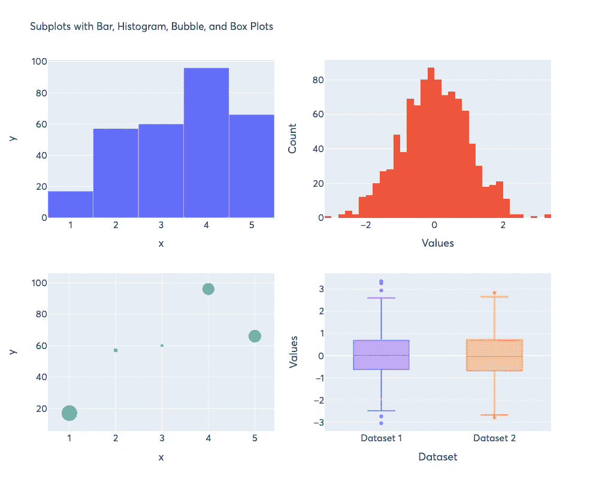

带有条形图、直方图、气泡图和方框图的支线图—由作者创建的图形

就在那里！

# 结论

这是对各种类型的人物和使用`plotly`创建支线剧情的基本介绍。您可以进入`plotly` [布局文档](https://plotly.com/python-api-reference/generated/plotly.graph_objects.Layout.html)查看使用`fig.update_layout()`时的所有可能性。本文中的`plotly-charts.ipynb`笔记本将在这个 [Github 资源库](https://github.com/venkatesannaveen/python-science-tutorial)中提供。

感谢您的阅读！我感谢任何反馈，你可以在 [Twitter](https://twitter.com/naveenv_92) 上找到我，并在 [LinkedIn](https://www.linkedin.com/in/naveenvenkatesan/) 上与我联系，以获取更多更新和文章。