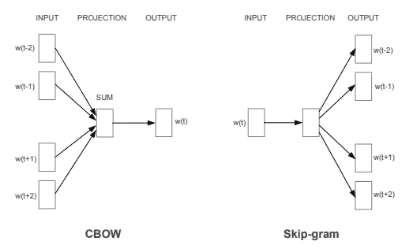

# 用 Jax 创建单词嵌入

> 原文：<https://towardsdatascience.com/creating-word-embeddings-with-jax-c9f144901472>

## 在 Jax 中实现经典的自然语言处理算法 Word2Vec


克里斯托夫·高尔在 [Unsplash](https://unsplash.com?utm_source=medium&utm_medium=referral) 上拍摄的照片

深度学习中的一些新想法比其他想法更有影响力，这是众所周知的。Word2Vec 是这些极具影响力的想法之一，因为它给 NLP word 带来了变化，之后又给复杂网络世界带来了变化，成为了 Node2Vec 和 Deep Walk 等其他算法的基础。

Word2Vec [1]于 2013 年发布，是一种用于从文本语料库(或向量的节点)中生成嵌入的算法。它变得有影响力，因为它允许 NLP 任务考虑单词的关系，而不仅仅是语料库的单个标记，从而生成更健壮的模型。

在这篇文章中，我们将对 Word2Vec 进行一些探索，并使用 Jax 库实现它。如果你有兴趣了解更多关于 Jax 库的知识，请参考我的 Jax 介绍[这里](/jax-numpy-on-gpus-and-tpus-9509237d9194)。

包含这篇文章代码的笔记本可以在 Github 和 Kaggle 上找到。

## 介绍 Node2Vec

Node2Vec 是一种深度学习算法，旨在从单词(或节点)中生成嵌入。但是你可能会问，什么是嵌入，嵌入是这个世界在 d 维空间的向量表示。

这个想法是，我们希望经常一起出现并且与相同意思相关的单词在这个空间上应该更近(它们的向量之间的距离应该小)，而与它们没有任何关系的单词应该更远。

拥有这种嵌入表示是有用的，因为它允许我们用这些词进行一些计算，还允许我们在其他机器学习算法上使用这些嵌入来进行预测。

本文提出了 Word2Vec 的两种架构，如下图所示:



Node2Vec 架构。来自[1]

在 CBOW 架构中，我们将每个单词的上下文(即短语中该单词的相邻单词)插入到神经网络中，并尝试预测目标单词。

因此，如果短语是“女王非常强大”，而我们试图预测的单词是“是”，那么单词“the”、“queen”、“very”、“powerful”将是网络的输入。

请注意，这一过程是在我们的数据集的短语上的滑动窗口中发生的，被视为上下文的单词的数量是一个可配置的参数。

对于跳格结构，我们做相反的事情。我们在网络中插入目标单词，并试图预测该单词的上下文。所以在这个例子中，在我们插入“is”之前，试着预测其他单词的。

## 如何训练 Node2Vec

这可能会引起混淆，因为我们在这里试图预测单词。毕竟，我们对生成嵌入不感兴趣？确实如此。这里不使用预测任务，因为这不是我们的目标。然而，我们使用梯度下降法进行这些预测来训练我们的网络。

梯度下降法将改善每个时期的嵌入(希望如此)。

然而，请注意，预测的良好准确性并不是生成嵌入的必要条件。

因此，在每个时期，预测词与预期词进行比较，生成一个损失函数，我们用它来更新网络的权重。

我们正在寻找的嵌入将是我们网络的投影层的权重。

## 履行

我们现在将实现 Word2Vec。为此，我们将使用 Jax 框架，并将重点放在 CBOW 架构上。

这些是您将需要的库和方法:

```
import numpy as npimport jax.numpy as jnpfrom jax import grad, jit, vmapfrom jax import randomfrom jax.nn import softmax, one_hot
```

首先，让我们获取我们将用于该任务的数据。我们将使用 wikitext-2-v1 [2]数据集，该数据集可以免费下载[到这里](https://blog.salesforceairesearch.com/the-wikitext-long-term-dependency-language-modeling-dataset/)。

下载完数据集后，我们会做一些非常基础的处理。请注意，由于这不是本任务的重点，因此不包括停用词的处理和删除以及一些常见的 NLP 任务。

```
with open('wiki.train.tokens') as fp: corpus = fp.read()corpus = corpus.replace('=', '').replace('@', '').replace('.', '').replace(',', '').replace('(', '').replace(')', '').replace('"', '')corpus = corpus.split('\n')corpus = [i for i in corpus if len(i.split(' ')) > 5]
```

在这里，我们读取数据，用空格替换一些标记，然后通过用分隔线分割数据集来生成语料库。最后，我们删除少于 5 个单词的每个短语。

现在让我们创建一些函数来帮助我们处理这些数据。首先，让我们标记我们的语料库:

```
def tokenize_corpus(corpus): tokens = [x.split() for x in corpus] return tokens
```

我们还需要一个函数来创建我们的标记化语料库的词汇:

```
def create_vocabulary(tokenized_corpus):
    vocab = {}
    vocab['<PAD>'] = 0
    i = 1
    for sentence in tokenized_corpus:
        for word in sentence:
            if word in vocab:
                continue
            vocab[word] = i
            i += 1

    return vocab
```

在这个函数中，我们为语料库中的每个单词设置一个整数。我们还创建了单词“<pad>”，当窗口大小没有包含我们需要的所有单词时，我们将使用它来填充训练数据。</pad>

现在，让我们使用现有的语料库和刚刚创建的词汇来生成我们的训练数据:

```
def generate_train_data(tokenized_corpus, vocab, window_size):
    X = []
    y = []
    for phrase in tokenized_corpus:
        for i in range(len(phrase)):
            target = i
            context = []for j in range(-window_size, window_size + 1):
                if j == 0:
                    continue
                try:
                    if i + j < 0:
                        context.append('<PAD>')
                        continue
                    context.append(phrase[i + j])
                except Exception:
                    context.append('<PAD>')
            X.append([vocab[k] for k in context])
            y.append(vocab[phrase[target]])

    return jnp.array(X), jnp.array(y)
```

这个函数的结果将是我们的神经网络的输入。生成的 X 的一些例子是:

```
DeviceArray([[0, 0, 2, 3],
             [0, 1, 3, 0],
             [1, 2, 0, 0],
             [0, 0, 5, 1],
             [0, 4, 1, 6],
             [4, 5, 6, 7],
             [5, 1, 7, 8],
             [1, 6, 8, 2],
             [6, 7, 2, 9],
             [7, 8, 9, 7]], dtype=int32)
```

最后，让我们应用刚刚创建的函数:

```
tokenized_corpus = tokenize_corpus(corpus)vocab = create_vocabulary(tokenized)X, y = generate_train_data(tokenized_corpus, vocab, window_size)
```

现在，让我们将窗口大小定义为 2，例如:

```
window_size = 2
```

神经网络的类别如下:

```
class Word2VecCBOW():
    def __init__(self, window_size, embed_dim, vocab_size, random_state):
        # Defines the key to be used for the random creation of the weights
        self.key = random.PRNGKey(random_state)
        self.vocab_size = vocab_sizeself.linear = self._create_random_matrix(vocab_size, embed_dim)
        self.soft = self._create_random_matrix(embed_dim, vocab_size)

        # Vectorizes the predict method
        self.predict = vmap(self._predict, in_axes=(None, 0))

    def train(self, X, y, num_epochs, batch_size):
        y = one_hot(y, self.vocab_size)
        X = one_hot(X, self.vocab_size)params = [self.linear, self.soft]
        for epoch in range(num_epochs):
            print(f'Epoch: {epoch}')
              for X_batch, y_batch in self.generate_batches(X, y, batch_size):
                    params = self.update(params, X_batch, y_batch)
            print(f'Loss: {float(self.l.primal)}')
        self.linear = params[0]
        self.soft = params[1]def _predict(self, params, X):
        activations = []
        for x in X:
            activations.append(jnp.dot(x, params[0]))# Averages the activations
        activation = jnp.mean(jnp.array(activations), axis=0)logits = jnp.dot(activation, params[1])
        result = softmax(logits)

        return result

    def _create_random_matrix(self, window_size, embed_dim):
        w_key = random.split(self.key, num=1)

        return 0.2 * random.normal(self.key, (window_size, embed_dim))def loss(self, params, X, y):
        preds = self.predict(params, X)
        l = -jnp.mean(preds * y)
        self.l = l
        return ldef update(self, params, X, y, step_size=0.02):
        grads = grad(self.loss)(params, X, y)return [params[0] - step_size * grads[0],
                params[1] - step_size * grads[1]]

    def get_embedding(self):
        return self.lineardef generate_batches(self, X, y, batch_size):
        for index, offset in enumerate(range(0, len(y), batch_size)):
            yield X[offset: offset + batch_size], y[offset: offset + batch_size]
```

在这里，我们创建一个辅助函数来在训练期间生成批次。除此之外，就神经网络应该做什么而言，实现非常简单。

现在，我们可以训练我们的网络并检索嵌入内容:

```
w2v = Word2VecCBOW(2, 32, len(vocab), 42)w2v.train(X, y, 10, 32)w2v.get_embedding()
```

## 结论

后续论文进一步改进了该论文的结果。此外，skip-gram 体系结构变得更加流行，并产生了更好的结果。还提出了针对复杂网络的新方法，例如 de Deep Walk 和 Node2Vec。

这篇文章旨在介绍这种方法，并举例说明如何从头开始用 Jax 开发神经网络。

希望它能对你的数据科学家之旅有所帮助。

[1]米科洛夫，托马斯&陈，凯&科拉多，G.s &迪恩，杰弗里。(2013).向量空间中单词表示的有效估计。ICLR 研讨会会议录。2013.

[2]梅里蒂，斯蒂芬&熊，&布拉德伯里，詹姆斯&索彻，理查德。(2017).指针哨兵混合模型。