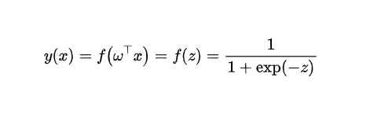
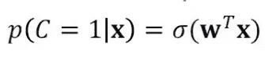
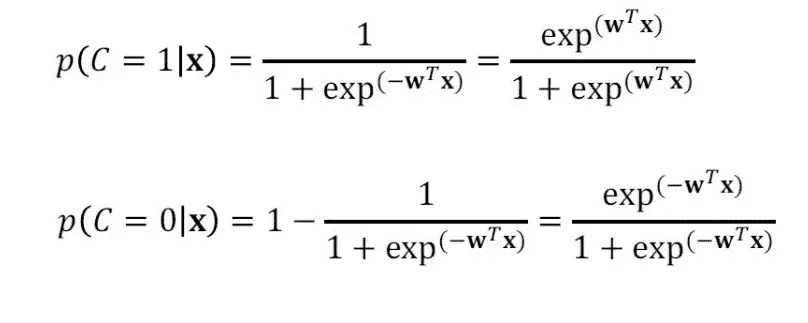
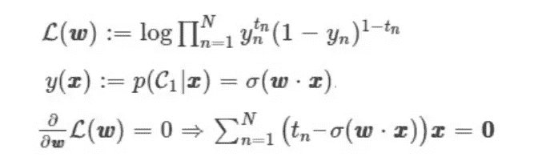
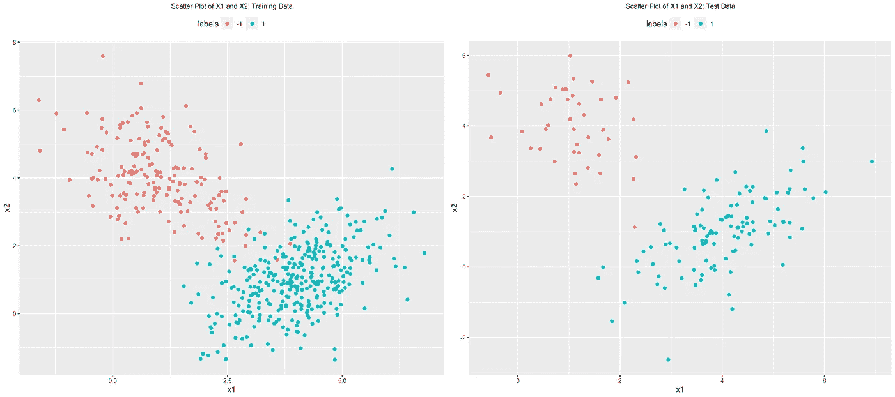
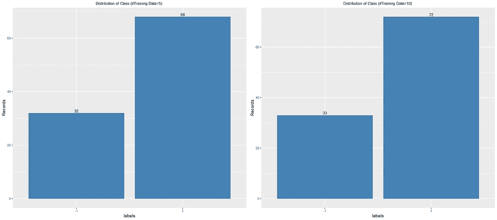
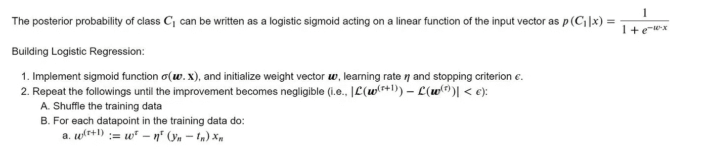

# 在 R 中从头开始创建自己的逻辑回归模型

> 原文：<https://towardsdatascience.com/creating-your-own-logistic-regression-model-from-scratch-in-r-ce719a49e10b>

## 在没有外部包的情况下用 R 构建二进制分类模型的初学者指南


米利安·耶西耶在 [Unsplash](https://unsplash.com?utm_source=medium&utm_medium=referral) 上拍摄的照片

> 这篇文章着重于从头开始开发一个逻辑回归模型。我们将使用虚拟数据来研究众所周知的判别模型(即逻辑回归)的性能，并随着数据量的增加反映典型判别模型的学习曲线的行为。数据集可以在这里找到[。请注意，该数据是使用随机数生成器创建的，用于在概念上训练模型。](https://github.com/angeleastbengal/Data-Collection)

# 介绍

逻辑回归直接将目标变量 y 对输入 x 的预测建模为定义为 **p(y|x)** 的条件概率。与线性回归模型相比，在逻辑回归中，目标值通常被限制为 0 到 1 之间的值；我们需要使用一个激活函数(sigmoid)将我们的预测转换成一个有界值。

假设函数 sigmoid 应用于数据的线性函数时，将其转换为:



**方程式 1。**说明了应用于线性函数的 sigmoid 变换。作者使用 Markdown & Latex 制作的图片。

我们现在可以将类别概率建模为:



**方程式 2。**使用逻辑函数说明了类别概率 C。图片由作者使用 Markdown &乳胶制作。

我们现在可以将类别概率 C=1 或 C=0 建模为:



**方程式 3。**使用逻辑函数，说明类别概率 C=1|X 和 C=0|X。图片由作者使用 Markdown & Latex 制作。

逻辑回归有一个线性决策边界；因此，使用最大似然函数，我们可以确定模型参数，即权重。**注 P(C|x) = y(x)，为简单起见，记为 y’。**


**方程式 4。**说明了损失函数。作者使用 Markdown & Latex 制作的图片。

最大似然函数可以计算如下:



**方程式 5。**作者使用 Markdown & Latex 制作的图片。

现在我们将使用虚拟数据来玩逻辑回归模型。

# 1.在 R 中加载相关的库

```
#---------------------------------Loading Libraries---------------------------------
library(mvtnorm)
library(reshape2)
library(ggplot2)
library(corrplot)
library(gridExtra)
```

这些库将用于创建可视化和检查数据不平衡。

# 2.读取相关数据

```
#---------------------------------Set Working Directory---------------------------------setwd("C:/Users/91905/LR/")#---------------------------------Loading Training & Test Data---------------------------------train_data = read.csv("Train_Logistic_Model.csv", header=T)
test_data = read.csv("Test_Logistic_Model.csv", header=T)#---------------------------------Set random seed (to produce reproducible results)---------------------------------
set.seed(1234)#---------------------------------Create  training and testing labels and data---------------------------------
train.len = dim(train_data)[1]
train.data <- train_data[1:2]
train.label <- train_data[,3]test.len = dim(test_data)[1]
test.data <- test_data[1:2]
test.label <- test_data[ ,3]#---------------------------------Defining Class labels---------------------------------
c0 <- '1'; c1 <- '-1'
```

# 3.创建图:训练和测试数据的独立变量散点图

```
#------------------------------Function to define figure size---------------------------------
fig <- function(width, heigth){
     options(repr.plot.width = width, repr.plot.height = heigth)
}
```

观察数据的分布。

```
# — — — — — — — — — — — — — — — Creating a Copy of Training Data — — — — — — — — — — — — — — — — -
data=train_data
data[‘labels’]=lapply(train_data[‘y’], as.character)fig(18,8)
plt1=ggplot(data=data, aes(x=x1, y=x2, color=labels)) + 
geom_point()+
 ggtitle (‘Scatter Plot of X1 and X2: Training Data’) +
 theme(plot.title = element_text(size = 10, hjust=0.5), legend.position=’top’)data=test_data
data[‘labels’]=lapply(test_data[‘y’], as.character)fig(18,8)
plt2=ggplot(data=data, aes(x=x1, y=x2, color=labels)) + 
geom_point()+
 ggtitle (‘Scatter Plot of X1 and X2: Test Data’) +
 theme(plot.title = element_text(size = 10, hjust=0.5), legend.position=’top’)grid.arrange(plt1, plt2, ncol=2)
```



**图一。**说明了训练和测试数据的分布。我们可以在上面的图中观察到数据是线性可分的。这是伪数据。真实世界的数据可能不像类似的分布，自变量的数量也不会限制为两个。Image credit —由作者使用 r。

# 4.检查阶级不平衡

```
#------------------------------Function to define figure size---------------------------------
fig <- function(width, heigth){
     options(repr.plot.width = width, repr.plot.height = heigth)
}
```

看数据不平衡。我们检查来自训练和测试数据的前 100 行。

```
library(‘dplyr’)data_incr=100
fig(8,4)# — — — — — — — — — — — — — — — Creating a Copy of Training Data — — — — — — — — — — — — — — — — -
data=train_data
data[‘labels’]=lapply(train_data[‘y’], as.character)# — — — — — — — — — — — — — — — — — — — — — Looping 100 iterations (500/5) — — — — — — — — — — — — — — — — — — — 
# — — — — — — — — — — — — — — — — — — — — — Since increment is 5 — — — — — — — — — — — — — — — — — — — 
for (i in 1:2)

 {interim=data[1:data_incr,]

 # — — — — — — — — — — — — — — — — — — — — — Count of Records by class balance — — — — — — — — — — — — — — — — — — — 
 result<-interim%>%
 group_by(labels) %>%
 summarise(Records = n())

 # — — — — — — — — — — — — — — — — — — — — — Plot — — — — — — — — — — — — — — — — — — — 
 if (i==1)
 {
 plot1=ggplot(data=result, aes(x=labels, y=Records)) +
 geom_bar(stat=”identity”, fill=”steelblue”)+
 geom_text(aes(label=Records), vjust=-0.3, size=3.5)+
 ggtitle(“Distribution of Class (#Training Data=5) “)+
 theme(plot.title = element_text(size = 10, hjust=0.5), legend.position=’top’)
 }

 else
 {
 plot2=ggplot(data=result, aes(x=labels, y=Records)) +
 geom_bar(stat=”identity”, fill=”steelblue”)+
 geom_text(aes(label=Records), vjust=-0.3, size=3.5)+
 ggtitle(“Distribution of Class (#Training Data=10) “)+
 theme(plot.title = element_text(size = 10, hjust=0.5), legend.position=’top’)
 }

 data_incr=data_incr+5

 }
grid.arrange(plot1, plot2, ncol=2)
```



**图二。**说明了二进制类的分布。正如我们可以看到的，我们的积极类在数据中占多数；因此，我们可以看到，数据在很大程度上是不平衡的。Credit —由作者使用 r。

# 5.逻辑回归

概率判别模型使用广义线性模型来获得类别的后验概率，并旨在使用最大似然来学习参数。逻辑回归是一种概率判别模型，可用于基于分类的任务。



**图三。**展示了设计逻辑回归模型的逐步方法。Credit —由作者使用 markdown 和 latex 开发。

## 5.1 定义辅助功能

## 预测功能

使用概率分数返回-1 或+1。这里使用的阈值是 0.5，即如果一个类别的预测概率> 0.5，那么该类别被标记为-1，否则为+1。

```
#-------------------------------Auxiliary function that predicts class labels-------------------------------predict <- function(w, X, c0, c1)
{
    sig <- sigmoid(w, X)

    return(ifelse(sig>0.5, c1, c0))

}
```

## 成本函数

计算成本的辅助功能。

```
#-------------------------------Auxiliary function to calculate cost function-------------------------------cost <- function (w, X, T, c0)
{
    sig <- sigmoid(w, X)
    return(sum(ifelse(T==c0, 1-sig, sig)))

}
```

## 乙状结肠功能

```
#-------------------------------Auxiliary function to implement sigmoid function-------------------------------sigmoid <- function(w, x)
{
    return(1.0/(1.0+exp(-w%*%t(cbind(1,x)))))    
}
```

## 5.1.4 训练逻辑回归模型

该算法的工作原理如下。最初，设置参数。然后，在处理每个数据点 Xn，Tn 之后，参数向量被更新为:

𝑤(𝜏+1):=𝑤𝜏−𝜂𝜏(𝑦𝑛−𝑡𝑛)(𝑥𝑛)其中，(𝑦𝑛−𝑡𝑛)(𝑥𝑛)是误差函数的梯度，𝜏是迭代次数，𝜂𝜏是特定于迭代的学习速率。

```
Logistic_Regression <- function(train.data, train.label, test.data, test.label)
{

    #-------------------------------------Initializations-----------------------------------------
    train.len = nrow(train.data)

    #-------------------------------------Iterations-----------------------------------------
    tau.max <- train.len * 2

    #-------------------------------------Learning Rate-----------------------------------------
    eta <- 0.01

    #-------------------------------------Threshold On Cost Function to Terminate Iteration-----------------------------------
    epsilon <- 0.01

    #-------------------------------------Counter for Iteration-----------------------------------
    tau <- 1

    #-------------------------------------Boolean to check Terimination-----------------------------------
    terminate <- FALSE#-------------------------------------Type Conversion-----------------------------------

    #-------------------------------------Convert Training Data to Matrix-----------------------------------
    X <- as.matrix(train.data)

    #-------------------------------------Train Labels-----------------------------------
    T <- ifelse(train.label==c0,0,1)

    #-------------------------------------Declaring Weight Matrix-----------------------------------
    #-------------------------------------Used to Store Estimated Coefficients-----------------------------------
    #-------------------------------------Dimension of the Matrix = Iteration x Total Columns + 1-----------------------------

    W <- matrix(,nrow=tau.max, ncol=(ncol(X)+1))

    #-------------------------------------Initializing Weights-----------------------------------
    W[1,] <- runif(ncol(W))#-------------------------------------Project Data Using Sigmoid function-----------------------------------
    #-------------------------------------Y includes the probability values-----------------------------------
    Y <- sigmoid(W[1,],X)

    #-------------------------------------Creating a data frame for storing Cost-----------------------------------
    costs <- data.frame('tau'=1:tau.max)

    #-------------------------------------Threshold On Cost Function to Terminate Iteration-----------------------------------
    costs[1, 'cost'] <- cost(W[1,],X,T, c0)

  #-------------------------------------Checking Termination of Iteration-----------------------------------
  while(!terminate){

      #-------------------------------------Terminating Criterion----------------------------------
      #-------------------------------------1\. Tau > or = Tau Max (Iteration 1 is done before)----------------------------------
      #-------------------------------------Cost <=minimum value called epsilon-----------------------------------

      terminate <- tau >= tau.max | cost(W[tau,],X,T, c0)<=epsilon#-------------------------------------Shuffling Data-----------------------------------
      train.index <- sample(1:train.len, train.len, replace = FALSE)

      #-------------------------------------Obtaing Indexes of Dependent and Independent Variable------------------------------
      X <- X[train.index,]
      T <- T[train.index]#-------------------------------------Iterating for each data point-----------------------------------
      for (i in 1:train.len){

        #------------------------------------Cross check termination criteria-----------------------------------
        if (tau >= tau.max | cost(W[tau,],X,T, c0) <=epsilon) {terminate<-TRUE;break}

        #-------------------------------------Predictions using Current Weights-----------------------------------
        Y <- sigmoid(W[tau,],X)#-------------------------------------Updating Weights-----------------------------------
        #-------------------------------------Refer to the Formula above-----------------------------------

        W[(tau+1),] <- W[tau,] - eta * (Y[i]-T[i]) * cbind(1, t(X[i,]))#-------------------------------------Calculate Cost-----------------------------------
        costs[(tau+1), 'cost'] <- cost(W[tau,],X,T, c0)# #-------------------------------------Updating Iteration-----------------------------------
        tau <- tau + 1# #-------------------------------------Decrease Learning Rate-----------------------------------
        eta = eta * 0.999
      }
      }

    #-------------------------------------Remove NAN from Cost vector if it stops early-----------------------------------
      costs <- costs[1:tau, ]#-------------------------------------Final Weights-----------------------------------
    # #-------------------------------------We use the last updated weight since it is most optimized---------------------
      weights <- W[tau,]#-------------------------------------Calculating misclassification-----------------------------------

    train.predict<-predict(weights,train.data,c0,c1)
    test.predict<-predict(weights,test.data,c0,c1)

      errors = matrix(,nrow=1, ncol=2)

      errors[,1] = (1-sum(train.label==train.predict)/nrow(train.data))
      errors[,2] = (1-sum(test.label==test.predict)/nrow(test.data))

  return(errors)
}
```

逻辑回归，使用最大似然学习参数。这意味着在学习模型参数(权重)时，必须开发并最大化似然函数。然而，由于非线性方程系统没有解析解，所以使用迭代过程来寻找最优解。

随机梯度下降被应用于逻辑回归的训练目标，以学习参数和误差函数，从而最小化负对数似然。

## 5.2 使用不同数据子集的训练模型

我们将在不同的数据子集上训练模型。这样做是为了在研究数据量对模型错误分类率的影响时考虑方差和偏差。

```
#------------------------------------------Creating a dataframe to track Errors--------------------------------------acc_train <- data.frame('Points'=seq(5, train.len, 5), 'LR'=rep(0,(train.len/5)))
acc_test <- data.frame('Points'=seq(5, test.len, 5), 'LR'=rep(0,(test.len/5)))data_incr=5#------------------------------------------Looping 100 iterations (500/5)--------------------------------------
#------------------------------------------Since increment is 5--------------------------------------
for (i in 1:(train.len/5))

    {
        #---------------------------------Training on a subset and test on whole data-----------------------------
        error_Logistic = Logistic_Regression(train.data[1:data_incr, ], train.label[1:data_incr], test.data, test.label)

        #------------------------------------------Creating accuarcy metrics--------------------------------------

        acc_train[i,'LR'] <- round(error_Logistic[ ,1],2)acc_test[i,'LR'] <- round(error_Logistic[ ,2],2)

        #------------------------------------------Increment by 5--------------------------------------
        data_incr = data_incr + 5
}
```

模型的准确性可通过以下方式进行检验:

```
head(acc_train)
head(acc_test)
```

# 6.结论

在处理每个数据点之后更新参数向量；因此，在逻辑回归中，迭代的次数取决于数据的大小。当处理较小的数据集时(即数据点的数量较少)，模型需要更多的训练数据来更新权重和决策边界。因此，当训练数据量很小时，它的准确性很差。

*关于作者:高级分析专家和管理顾问，帮助公司通过对组织数据的商业、技术和数学的组合找到各种问题的解决方案。一个数据科学爱好者，在这里分享、学习、贡献；你可以和我在* [*上联系*](https://www.linkedin.com/in/angel-das-9532bb12a/) *和* [*上推特*](https://twitter.com/dasangel07_andy)*；*