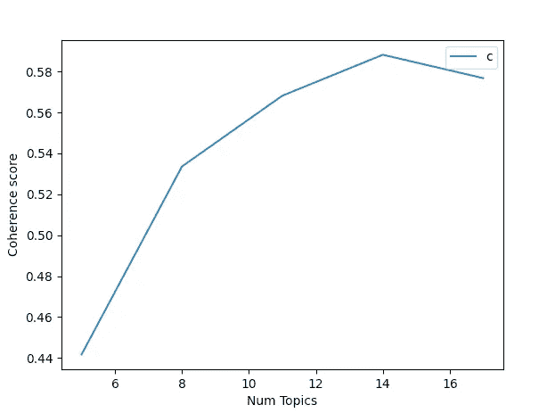
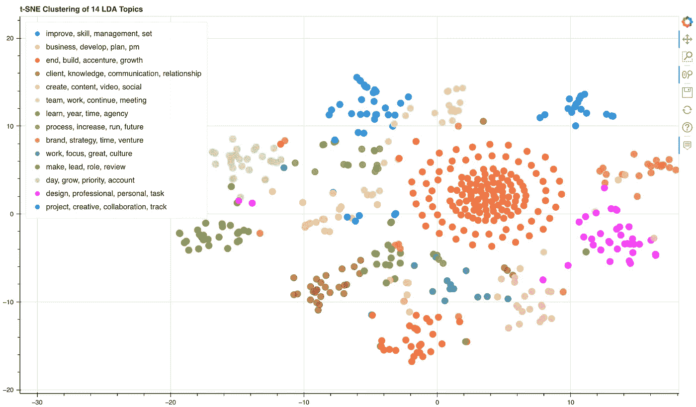
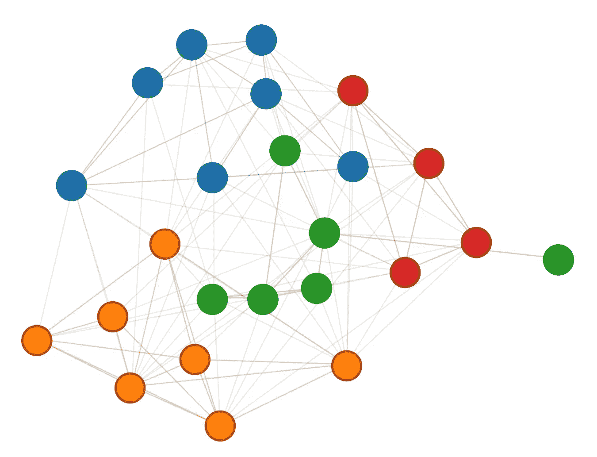

# 通过数据科学建立更好机构的创造性方法

> 原文：<https://towardsdatascience.com/creative-ways-to-build-a-better-agency-through-data-science-3ee62d0cca3>

## 使用主题建模和网络图来可视化公司数据

克林特·王茂林在 [Unsplash](https://unsplash.com/s/photos/connections?utm_source=unsplash&utm_medium=referral&utm_content=creditCopyText) 上拍摄的照片

在我的机构 20nine，我们不断利用数据来帮助我们的客户找到问题的解决方案，并跟踪这些解决方案在实现目标方面的有效性。但直到最近，我们还没有考虑到数据科学在向内审视和改善我们自己的运营、员工体验以及实现我们机构目标的有效性方面有多大用处。

所以我们改变了这一切——在这个过程中，我们彻底改变了我们对员工绩效评估和目标设定的看法。以下是我们如何做到这一点的幕后情况。

# 站台

首先，我们为自己建立了一个名为 Forge 的内部平台，以帮助员工从个人、专业和业务角度创建、管理和跟踪与他们的成长相关的个人优先事项。锻造厂也是一个地方，员工可以通过积分兑换金钱奖励来给予同事认可，也就是荣誉。通过构建一个平台来支持这些操作并捕获相关数据，我们有两个目标:

1.从 30，000 英尺的高度了解员工的热情所在，看看我们如何才能最好地帮助他们实现目标

2.了解我们的组织是如何一起工作的，以及我们如何能够改变事情，以便每个人都有机会更多地合作

# 员工优先级

我们的第一个计划侧重于了解员工在他们的角色和职业生涯中努力实现的目标。我们的希望是，通过识别重叠，我们可以构建我们的福利和辅导课程，以支持我们团队的主要共同优先事项。

从数据科学的角度来看，该计划旨在汇总迄今为止所有声明的优先级，然后将它们分组到主题中。使用这种方法，我们希望在员工确定的 600 个目标中发现趋势。

## 主题建模

主题建模是组织、理解和总结内容中包含的大量数据的一种极好的方式。在这种情况下，我们可以加载 600 个数据点，并在一个简单的输出中轻松总结它们的内容。

在 Forge 中，输入的优先级有一些我们可以从中提取的数据点。对于这个计划，我们决定获取标题和描述内容，并将它们合并在一起。(经过一些初步审查后，我们认为仅仅标题并不总是包含足够的信息来确定一个给定条目是关于什么的。)

为了执行我们的主题建模，我们使用潜在的狄利克雷分配(LDA) Mallet 模型。基本思想是，每个文档(或本例中的优先级)由各种单词组成，每个主题也有与之相关的单词。我们需要设置我们想要提取多少主题，然后模型确定每个主题中的单词，然后将文档与这些主题进行匹配。

这个模型不能以编程的方式确定主题的最佳数量，所以我们需要自己找到最佳数量。为此，我们可以使用不同的主题编号在数据集上运行模型多次，并测量主题一致性分数，主题一致性分数指示主题中高分单词之间的语义相似度。本质上，这个话题所有的热门词汇放在一起有意义吗？

然后我们可以画出每个主题的分数，直观地看到下降的位置。

作者图片

在这种情况下，围绕 14 个主题似乎是最佳选择。

从这里，我们运行 LDA Mallet 模型，将这个数字设置为我们的主题计数，以获得 14 个带有相应关键字的主题。在这种情况下，我们得到:

1.  结束、构建、增长

2.业务、开发、计划、pm

3.设计，专业，个人，任务

4.团队，工作，继续，会议

5.项目、创意、协作、跟踪

6.品牌、战略、时间、风险

7.提高、技能、管理、设置

8.处理，增加，运行，未来

9.日、增长、优先级、帐户

10.客户、知识、沟通、关系

11.制作、领导、角色、审核

12.学习，年份，时间，机构

13.创作，内容，视频，社交

14.工作，专注，伟大，文化

## 把所有的放在一起

拥有这些带有关键词的主题非常好，因为我们可以开始了解员工真正感兴趣的领域。例如，第 7 个主题似乎围绕着提高与管理相关的技能。帮助希望发展管理才能的员工的一个好方法可能是为管理项目或午餐提供财务帮助，并向我们的管理团队学习。

为了能够更好地可视化这些数据，我们希望将主题缩减到一个二维空间中。为此，我们使用了 t-分布式随机邻近嵌入(或 t-SNE)并将这些值绘制到散点图上。

现在，我们可以轻松地可视化集群，以了解主题的大小，但我们也可以单击单个节点，并获得其特定的数据点(在本例中，是优先级的标题和描述)。

作者图片

# 员工协作

从数据科学的角度来看，我们的下一个挑战没有那么激烈，但仍然非常有趣。查看锻造厂的员工认可(又名 Kudos)数据，我们的假设是，员工将最多的荣誉给予与他们一起工作最多的人。因此，利用这些数据，我们可以创建一个包含 20 名一线员工的网络图，他们之间的联系代表了他们从彼此那里获得的荣誉。他们从一个人那里得到的越多，他们之间的联系就越紧密。我们还可以使用权重以编程方式对这些信息进行聚类，以帮助我们直观地看到组织内不同的“派系”。

作者图片

以上是我们公司基于三个月 Kudos 数据的输出网络图(去掉了名字)。它很好地展现了我们当时的项目，以及这些项目在公司中是如何划分的。

将来，我们可以将这些数据按季度制作成动画，以确保组织内部有稳固的协作，同时还能看到它如何随着时间的推移而发展。展望未来，这种数据驱动的理解员工协作的方法可以帮助我们确保没有员工或“节点”离开网络太远，从而确保每个人都感觉自己是公司的一部分，尤其是在我们都远程工作的时候。

# 未来

我们计划继续使用定量和定性数据来优化我们作为一家公司的运营方式，并做出有助于员工感到融入其中并实现其职业目标的决策。作为一家代理机构，这是实践我们每天向客户宣传的一个重要部分:通过释放您数据的力量，您可以释放您团队的全部潜力，并帮助他们实现您组织的目标。