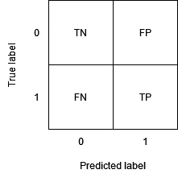
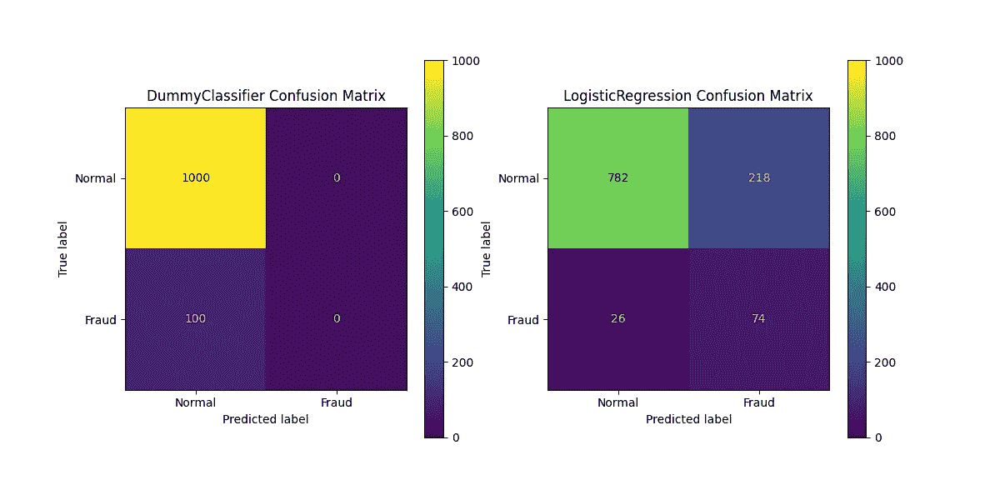

# 每个数据科学家都应该知道的关键事实—第 1 部分

> 原文：<https://towardsdatascience.com/critical-facts-that-every-data-scientist-should-know-part-1-31f9c25e5e00>

## 许多数据科学家都是出色的程序员，但是忽视某些统计事实会导致非常严重的后果。


康纳·塞缪尔在 [Unsplash](https://unsplash.com?utm_source=medium&utm_medium=referral) 拍摄的照片

# 介绍

在这篇文章中，我想向你解释一些简单但同时重要的概念，以避免像上面的机器一样结束。根据我的经验，即使是经验丰富的数据科学家有时也不知道或不完全理解至少我要告诉你的一些主题。

虽然不知道最新流行的算法通常是无害的，但对本文中描述的一些概念有部分了解是数据科学中代价最大的失败的根源。

> 对本文中描述的一些概念的部分理解是数据科学中代价最大的失败的根源

我将在下面描述的每一个主题很容易在一篇专门的文章中被涵盖。我的目标是用最少的努力给你最大的回报，并尽可能简单地解释这些经常模糊的概念。

由于涉及的论据太多，我决定将本文分成两部分，第二部分比第一部分更高级:

## 第一部分

1.  用例及混淆矩阵介绍
2.  你真的想最大化准确性吗？
3.  精确度、召回率和 F1 分数
4.  当感兴趣的类变得不那么频繁时，精度会发生什么变化
5.  不平衡分类的度量

## 第二部分

[](/critical-facts-that-every-data-scientist-should-know-part-2-c9c06cde6e21)  

1.  数据泄漏，当你的结果好得令人难以置信
2.  可解释性与辛普森悖论
3.  采样偏差如何影响您的模型
4.  非平稳性和协变量移位
5.  观察者效应和概念漂移

**本文中显示的图表和结果可以使用从 Google Colab 轻松运行的** [**相关 Jupyter 笔记本**](https://github.com/mnslarcher/critical-facts-that-every-data-scientist-should-know) **来复制和更好地理解，我强烈推荐您尝试一下！**

# 用例及混淆矩阵介绍

本文的第一部分将关注数据科学领域中最常见的问题之一:二进制分类。来自二进制分类的[维基百科页面](https://en.wikipedia.org/wiki/Binary_classification):

> **二进制分类**是根据分类规则将集合中的元素分成两组的任务

虽然在我们的例子中我们只有两个类，但是实际上所有给出的参数都同样适用于多类分类的情况。

为了帮助发挥想象力，在本文的第一部分，我将使用一家公司的例子，该公司希望使用机器学习来了解其一些客户是否正在实施欺诈，这个问题通常被称为**欺诈检测**。

然后我们将【T11 级/**正**定义为**诈骗者**，将**0 级**/**负**定义为**普通客户**。

由于我们将使用的许多指标很容易从**混淆矩阵**中计算出来，在我开始写真正的文章之前，我将简要回顾一下它是如何定义的。如果你以前遇到过这个概念，请跳过这一部分。让我们先来看看这个矩阵的结构:



作者图片

如我们所见，混淆矩阵报告了实际类别和预测类别之间的四种可能组合:

*   真正的否定:一个我们如此预测的否定。在我们的案例中:一个没有犯欺诈行为的客户，我们的模型(正确地)没有报告他。
*   **假阳性** ( **FP** ):我们预测为阳性的阴性。在我们的案例中:一个没有犯欺诈行为的客户，我们的模型(错误地)报告了他。
*   假阴性:我们预测为阴性的阳性。在我们的案例中:一个客户犯了欺诈罪，而我们的模型(错误地)没有报告他。
*   真阳性 ( **TP** ):我们预测的阳性。在我们的案例中:一个犯了欺诈罪的客户，我们的模型(正确地)报告了他。

这就是我们在继续这篇文章之前所需要的，如果你还有任何疑问，我建议你看看混乱矩阵上的优秀的[维基百科页面。](https://en.wikipedia.org/wiki/Confusion_matrix)

> **注意**:有时行和列的顺序与上面的相反，由于本文附有一个笔记本来进行实验，所以我使用了著名的 [scikit-learn](https://scikit-learn.org/stable/index.html) 库所使用的相同约定(参见附带的代码)。

# 你真的想最大化准确性吗？

在分类问题中，用于测量性能的最流行但也是最容易误导的度量之一是准确性。

*   **准确性** ( **ACC** ):我们的模型预测正确类别的次数百分比。数学上:ACC = (TP + TN) / (TP + TN + FP + FN)。

假设我们训练了两个模型来将我们的客户分为欺诈者和非欺诈者，看看下面的准确度值，哪个模型似乎表现得更好？

```
DummyClassifier accuracy: 90.91%
LogisticRegression accuracy: 77.82%
```

第一个模型的名字可能会让你怀疑一些事情，但是只看数字，似乎很明显 DummyClassifier 比 LogisticRegression 表现得更好。

真的是这样吗？让我们看看混淆矩阵:



作者图片

实际上，DummyClassifier 给出正确预测的次数比 LogisticRegression 多(否则其准确性不会更高)，但它从不预测欺诈类。另一方面，LogisticRegression 会犯更多的错误，但至少它帮助我们识别了我们的客户正在犯的 100 起欺诈中的 74 起。

这种现象是由于什么？让我们首先考虑可能出现的**类型的错误**:

*   我的客户是一个欺诈者，而我的模型没有意识到这一点(假阴性)。
*   我的客户不是欺诈者，但我的模型认为他是(误报)。

准确性对这两种类型的错误给予同等的重视，最重要的是，不关心我们的模型是否犯了“太多”这两种类型的错误。

> 准确性[…]并不关心我们的模型是否犯了“太多”这两种类型的错误

显然，一个从不报告欺诈的识别欺诈的模型是完全无用的，就像一个将所有客户报告为欺诈者的模型一样，因此我们希望指标能够帮助我们知道模型何时以某种方式夸大了事实。

一个可能出现的问题是:那么在什么情况下我必须在使用准确性作为主要度量标准之前好好思考？

当类别非常**不平衡**时，不管模型有多好，精度往往都很高，因为在这种情况下，预测最频繁的类别就足以获得非常高的精度。

> 当类别非常不均衡时，不管模型有多好，准确性往往都很高，因为在这种情况下，预测最频繁的类别就足以获得非常高的准确性

事实上，我们的 DummyClassifier 只是使用“最频繁”策略，因此它的预测总是“不欺诈”，即训练数据集中最频繁的类。

# 精确度、召回率和 F1 分数

让我们来看一些解决准确性问题的分类指标。

*   **精度**(或**阳性预测值，PPV** ):模型预测第 1 类时正确的次数百分比。例如，如果模型说“欺诈”100 次，精度是 75%，平均来说它在 75 种情况下是正确的，其他 25 种是错误警报。数学上:PPV = TP / (TP + FP)。
*   **回忆**(或**真阳性率**， **TPR** ):模型归类为类 1 的观察值的百分比。例如，如果我的客户中有 100 名欺诈者，召回率为 75%，我将平均识别其中的 75 名，遗漏另外 25 名。数学上:TPR = TP / P = TP / (TP + FN)。
*   **F1-score** ( **F1** ):精度和召回率的调和平均值，F1-score 的一个“好”值(什么是“好”取决于问题)通常保证精度和召回率都是“好”的。数学上:F1 = 2 * PPV * TPR / (PPV + TPR)。

为什么要使用调和平均值，而不是更简单、更受欢迎的算术平均值？

好吧，首先，如果我们使用算术平均值，F1 分数将会有与准确性相同的缺陷，这是一个无用的模型，它总是预测两个类别中的一个会有明显不同于零的分数。例如，如果精度是 1%,召回率是 100%,两者的算术平均值接近 50%,而 F1 值(调和平均值)大约是 2%。

使用这种类型的平均值还有更深层的原因，要了解更多，我推荐这篇优秀的文章:

[](/on-average-youre-using-the-wrong-average-geometric-harmonic-means-in-data-analysis-2a703e21ea0)  

让我们看看我们的新指标在前面的场景中给出了什么指示:

```
DummyClassifier precision: 0.00%
DummyClassifier recall: 0.00%
DummyClassifier F1-score: 0.00%

LogisticRegression precision: 25.34%
LogisticRegression recall: 74.00%
LogisticRegression F1-score: 37.76%
```

厉害！F1 分数概括了精确度和召回率，它正确地给我们的 LogisticRegression 一个较高的分数，给我们的 DummyClassifier 一个零分。

在这种情况下，所有三个指标都是一致的，但是需要注意的是，一般来说，情况并不总是这样。如前所示，精确度和召回率之间的一个接近于零就足够了，F1 分数也接近于零，不同于两者的算术平均值。

如果您还不相信，我建议模拟一个总是预测“欺诈”的模型，并使用它在包含 1%欺诈的测试集上进行预测，在这种情况下，您应该会看到如下结果:

```
DummyClassifier precision: 1.00%
DummyClassifier recall: 100.00%
DummyClassifier F1-score: 1.98%
```

现在，设想一个模型，该模型只预测几个非常可疑的客户的欺诈行为:一个伪现实案例可能是一个只报告在最近所有检查中被识别为欺诈的欺诈客户的模型。如果这些是模型报告的唯一欺诈，因为我们可以想象它们在总数中所占的百分比非常小，召回率将约为 0%，而精确度将接近 100%，因为我们几乎可以肯定这些客户是欺诈者。

总而言之，在这种情况下，我们期望的值类似于:

```
DummyClassifier precision: 100.00%
DummyClassifier recall: 0.00%
DummyClassifier F1-score: 0.00%
```

这应该让你意识到，只看精度或只看回忆可能很有欺骗性。

> 只看精确度或只看召回率可能很有欺骗性

# 当感兴趣的类变得不那么频繁时，精度会发生什么变化

精确度、召回率和 F1 分数当然是监控我们模型的很好的指标，但是它们在每种情况下都是最合适的吗？答案显然是否定的。首先，因为没有完美的度量标准，用来评估模型性能的度量标准必须根据我们想要实现的目标来选择。

> 没有完美的度量标准，评估模型性能的度量标准必须根据我们想要实现的目标来选择

记住我们给不同类型的错误的“价格”。

但是有一个特殊的例子，使用精确度，因此 F1 分数至少是误导的。

让我们想象一下，在包含 50%欺诈客户和 50%非欺诈客户的测试集上计算我们的指标。这种情况并不罕见，因为有时数据科学家会平衡他们的数据集，或者正如我们将在本文的第 2 部分中看到的，我们用来训练和验证模型的数据分布与我们在生产中使用它们的分布不同。

鉴于此，我们得到以下值:

```
Precision: 75.92% ± 3.52% (mean ± std. dev. of 100 runs)
Recall: 75.97% ± 4.79% (mean ± std. dev. of 100 runs)
F1-Score: 75.87% ± 3.42% (mean ± std. dev. of 100 runs
```

我们对模型的性能感到满意，决定在生产中使用它来识别欺诈者。在一系列有针对性的检查之后，我们重新计算了我们的指标，从而得出:

```
Precision: 3.04% ± 0.17% (mean ± std. dev. of 100 runs)
Recall: 75.88% ± 4.42% (mean ± std. dev. of 100 runs)
F1-Score: 5.84% ± 0.33% (mean ± std. dev. of 100 runs)
```

发生了什么事？第一个想法可能是我们将在本文的[第二部分](/critical-facts-that-every-data-scientist-should-know-part-2-c9c06cde6e21)中讨论的一些特殊现象，如**协变量转移**或**概念漂移**，但事实真的如此吗，或者这里有更简单的解释吗？

事实是，当第一类变得更少时，回忆保持不变，而精确度，因此 F1 分数下降。

> 当类别 1 变得更少时，回忆保持不变，而精确度，因此 F1 分数下降

为什么？让我们从回忆开始，为什么我们期望它保持不变？召回只取决于模型对欺诈客户的行为。在分子中，它有真阳性(模型识别的欺诈者)，在分母中，它有真阳性加上假阴性(模型错误地分类为非欺诈者的欺诈者)。换句话说，我们正在分类的数据集中非欺诈者的数量，以及他们相对于欺诈者的比例，不会以任何方式决定召回。

> 我们正在分类的数据集中非欺诈者的数量，以及他们相对于欺诈者的比例，不会以任何方式决定召回

让我们现在做这个心理练习:如果在生产中我们有 100 个欺诈者和 10000 个非欺诈者，让我们首先计算我们期望在由 100 个欺诈者加上从 10000 个非欺诈者中随机选取的 100 个非欺诈者组成的数据集上获得的精确度。我们期望获得什么样的精度值？嗯，这很容易，因为这个数据集与我们的测试集具有相同的欺诈者比例，在不考虑其他可能因素的情况下(参见[第 2 部分](/critical-facts-that-every-data-scientist-should-know-part-2-c9c06cde6e21))，我们可以预期精度等于已经获得的精度，即大约 75%。

现在我们必须问自己:在最终性能的计算中，哪一个结果可以具有剩余 9900 种情况下尚未考虑的模型的预测？因为他们都是非欺诈客户，所以他们每个人的结果只能是真阴性或假阳性。换句话说，在任何情况下，它都不能增加精度的分子(真阳性)，而对于每一个额外的非欺诈性客户，精度的分母有非零的概率将增加，特别是，分母中的假阳性将增加，因此精度(以及 F1 分数)降低。

# 不平衡分类的度量

那么有没有对阶级不平衡不那么敏感的度量标准呢？还好，是的！

**不平衡分类**是一个非常重要的问题，在现实生活中我们很少对每一类都有相同百分比的观察值，

> 在现实生活中，我们很少对每一类都有相同的观察百分比

有大量关于它的文献。在这里，我只想向您展示一些我认为非常有用的指标，这些指标与精确度、召回率和 F1 值非常相似。

第一个指标是**敏感度**，敏感度是……召回率！是的，不幸的是，根据上下文的不同，相同的指标有许多不同的名称，理解我们正在谈论的内容的唯一方法是查看数学定义。

第二个指标是新的:

*   **特异性**(或**真阴性率**， **TNR** ):模型正确分类的 0 类观测值的百分比。在我们的例子中，有多少次我们的模型认为一个非欺诈者是一个非欺诈者，而不是报告一个假警报。数学上:TNR = TN / N = TN / (TN + FP)。

最后，与 F1 分数类似，我们这次使用**几何平均值**(再次参见之前的链接文章)来总结两个指标:

*   **G 均值**:敏感性和特异性的几何均值。数学上:G 均值= sqrt(TPR * TNR)。

让我们看看在平衡测试集(1:1)的情况下，这些指标假设了什么值:

```
Sensitivity: 76.20% ± 4.84% (mean ± std. dev. of 100 runs)
Specificity: 76.05% ± 4.38% (mean ± std. dev. of 100 runs)
G-Mean: 76.05% ± 3.22% (mean ± std. dev. of 100 runs)
```

现在，与上一个案例一样，让我们在一个类似的数据集上重新计算它们，但不平衡度为 1:100:

```
Sensitivity: 75.69% ± 4.12% (mean ± std. dev. of 100 runs)
Specificity: 75.68% ± 0.41% (mean ± std. dev. of 100 runs)
G-Mean: 75.65% ± 2.08% (mean ± std. dev. of 100 runs)
```

可以看出，如果数据集也高度不平衡，这些指标不会改变(除了统计上不显著的变化)。

为什么？

我们已经说过为什么敏感性(又名回忆)不变，同样的推理也适用于特异性。此外，特异性不依赖于模型在两个类上的表现，因此依赖于它们的比例，而只来自两个类中的一个。敏感性衡量模型对欺诈客户的表现，而特异性告诉我们模型对非欺诈客户的表现。

# 结论

这就结束了文章的第一部分，关于你绝对应该知道的事情，我希望你喜欢它，至少我描述的一些内容是新的，因此对你有用。在 [**第二部分**](/critical-facts-that-every-data-scientist-should-know-part-2-c9c06cde6e21) 中，我们将涵盖一些更为**的高级主题**如:

1.  数据泄漏，当你的结果好得令人难以置信
2.  可解释性与辛普森悖论
3.  采样偏差如何影响您的模型
4.  非平稳性和协变量移位
5.  观察者效应和概念漂移

如果你喜欢这篇文章，并希望我写更多类似的文章，你可以做几件事来支持我:开始在 Medium 上关注我，在社交媒体上分享这篇文章，并使用下面的鼓掌按钮，这样我就知道你对这种类型的内容感兴趣。

最后，如果您还不是中等会员，您可以使用我的推荐链接成为中等会员:

[](https://mnslarcher.medium.com/membership)  

想保持联系吗？在 [LinkedIn](https://www.linkedin.com/in/mnslarcher/) 或 [Twitter](https://twitter.com/mnslarcher) 上关注我！