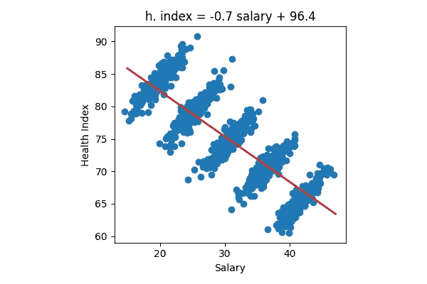
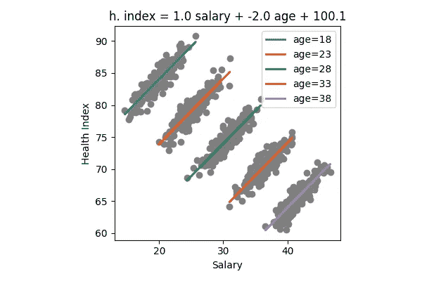
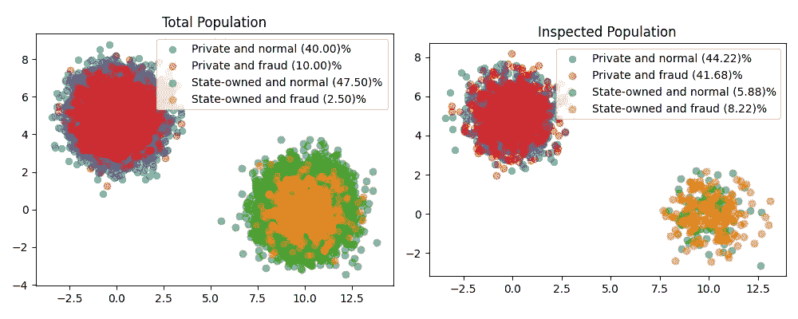
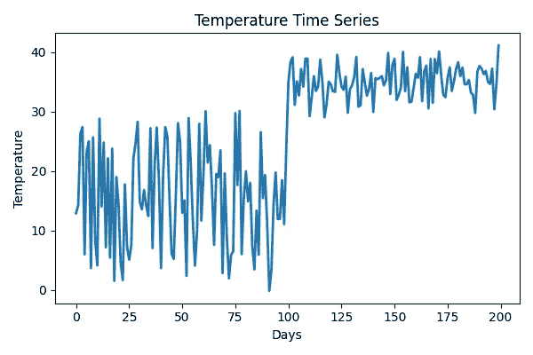
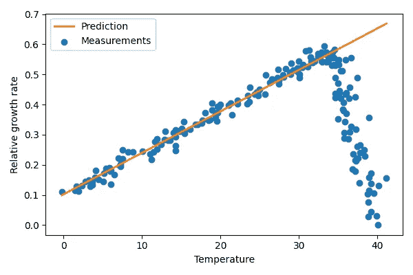

# 每个数据科学家都应该知道的关键事实—第 2 部分

> 原文：<https://towardsdatascience.com/critical-facts-that-every-data-scientist-should-know-part-2-c9c06cde6e21>

## 在本文的第二部分，我们将总结成为超级数据科学家需要知道的一些关键事实


米歇尔·卡萨尔在 [Unsplash](https://unsplash.com?utm_source=medium&utm_medium=referral) 上的照片

# 介绍

我们还需要数据科学家吗？

[21 世纪最性感的工作](https://hbr.org/2012/10/data-scientist-the-sexiest-job-of-the-21st-century)现在似乎已经过时了。今天，训练一个随机森林或一个神经网络只需要几行代码，甚至几个点击。每个软件供应商都承诺凭借他们出色的工具将你变成“公民数据科学家”，因此试图理解我们数据背后的统计和数学事实似乎是浪费时间，但真的是这样吗？

在文章的第二部分，请看下面的**第一部分**，

</critical-facts-that-every-data-scientist-should-know-part-1-31f9c25e5e00>  

我们将更深入地分析我们在分析真实数据时遇到的一些最重要的现象。当你读完这篇文章时，我希望你会同意我的观点，不是我们使用的工具定义了我们作为数据科学家，而是我们对数据的理解，

> 定义我们为数据科学家的不是我们使用的工具，而是我们对数据的理解

它是如何产生的，以及它是如何随时间演变的。

特别是，在第二部分中，我们将讨论:

1.  数据泄漏，当你的结果好得令人难以置信
2.  可解释性与辛普森悖论
3.  采样偏差如何影响您的模型
4.  非平稳性和协变量移位
5.  观察者效应和概念漂移

理解以下内容所需的所有知识都可以在本文的第一部分找到。

**您可以在下面的 GitHub 资源库中找到用于生成结果和图表的代码，我们将一起分析这些结果和图表。在那里你会发现两个笔记本可以很容易地在 Google Colab 上运行，而不需要在你的 PC 上安装任何东西。**

<https://github.com/mnslarcher/critical-facts-that-every-data-scientist-should-know>  

我强烈建议您尝试自己运行代码，尝试新的参数并预测它们对结果的影响。毕竟，除了把手弄脏之外，没有其他方法可以真正学到东西。

> 除了把手弄脏之外，没有其他方法可以真正学到东西

# 数据泄漏，当你的结果好得令人难以置信

你有过“好得可疑”的结果吗？这很奇怪，但我们的数据科学家的第六感告诉我们，如果一个结果好得令人难以置信，它很可能不是真的。

> 如果一个结果好得令人难以置信，那么它很可能不是真的

在这种情况下，第一嫌疑人几乎总是**数据泄露**。

从[维基百科页面上漏(机器学习)](https://en.wikipedia.org/wiki/Leakage_(machine_learning)):

> [……]**泄漏**(也称为**数据泄漏**或**目标泄漏**)是在模型训练过程中使用[信息](https://en.wikipedia.org/wiki/Information)，该信息预计在[预测](https://en.wikipedia.org/wiki/Prediction)时间不可用，导致预测分数(指标)高估了模型在生产环境中运行时的效用。

使用[第 1 部分](/critical-facts-that-every-data-scientist-should-know-part-1-31f9c25e5e00)中已经介绍的示例，假设我们想要训练一个模型来识别我们的客户中谁在实施欺诈。

我们几乎没有时间，但对我们新购买的软件充满信心，我们点击几次来读取我们去年的客户数据，包括我们将用作目标的欺诈/非欺诈列，瞧，再点击几次来分割数据并训练最新的闪亮模型，我们就完成了。

我们在测试集上测量性能，一切似乎都很顺利，结果非常好，超出了我们的预期，来吧，让我们将模型投入生产！

```
Test precision: 89.95%
Test recall: 99.40%
Test F1-score: 94.44%
```

几个月后，大家都很高兴，我们重新计算了我们的模型在一些客户身上的表现，我们以样本为基础检查了这些客户，得到了这些结果:

```
Production precision: 47.37%
Production recall: 9.00%
Production F1-score: 15.13%
```

发生了什么事？

让我们来看看用来生成预测的变量，其中我们找到了一个名为 updated_last_year 的二进制变量，它表示客户信息在去年是否更新过。乍一看，这似乎是一个无辜的变量，我们并不真正理解为什么模型认为它如此重要。不理解为什么我们的模型认为一个变量很重要是一个大的危险信号，应该让我们怀疑。

> 不理解为什么我们的模型认为一个变量很重要是一个大的危险信号

但是让我们想一想，在我们的训练和测试数据集中，这个变量对欺诈客户有什么价值？因为在这种情况下，我们会更新他们的信息，说他们犯了欺诈罪。其他顾客呢？1 或者 0，这么说吧，只是为了举例，10% 1，90% 0。

所以变量 updated_last_year 在检查的结果之后并根据它而改变。但是，当我们在生产中使用我们的模型来决定客户是否正在实施欺诈时，我们是否知道检查的结果以及该变量将取的值？没有。

换句话说，在训练期间，我们无意识地使用仅在我们用来训练模型的检查之后可用的信息。我们用未来来预测过去，这是一个常见的错误。

> 我们用未来来预测过去，这是一个常见的错误

为什么“利用未来”在培训期间是可能的，而在我们使用模型来决定检查谁的生产中是不可能的？因为在培训期间，我们可以访问过去(检查前的客户信息)和未来(检查的结果及其后续行动)，而在生产中，我们只知道到目前为止发生了什么，我们只能在此基础上决定是否检查客户。

这应该给我们一个教训:永远不要盲目使用数据，

> 永远不要盲目使用数据

当我们使用模型生成预测时，了解存在哪些变量是很重要的，并且要确保在训练期间，我们的解释变量的所有值都是根据我们想要预测的信息计算出来的。

# 可解释性与辛普森悖论

通常，解释为什么做出预测与预测本身一样重要，甚至更重要。对一个统计学家来说,“解释”可能会让人想到像 p 值这样的概念，

</p-value-explained-simply-for-data-scientists-4c0cd7044f14>  

看看我们的线性回归的哪些参数有统计学意义。这听起来可能非常科学，因此是正确的，但是记住有三种谎言:谎言、该死的谎言和统计数据。

> 有三种谎言:谎言、该死的谎言和统计数字

让我们设想估计一个线性回归来理解 18 岁到 38 岁人群中健康和工资之间的关系。



图片作者，灵感来自 [Pace~svwiki](https://en.wikipedia.org/wiki/Simpson%27s_paradox#/media/File:Simpsons_paradox_-_animation.gif)

我们惊讶地发现，随着薪水的增加，人们的健康状况却在下降，穷人真幸福！但事实真的是这样吗？

然后，让我们重新估计另一个线性模型，然而这一次通过添加人的可变年龄，我们然后获得:



图片作者，灵感来自 [Pace~svwiki](https://en.wikipedia.org/wiki/Simpson%27s_paradox#/media/File:Simpsons_paradox_-_animation.gif)

如果加上年龄这个变量，工资和健康的关系就完全颠倒了！这种现象被称为[辛普森悖论](https://en.wikipedia.org/wiki/Simpson%27s_paradox)。

一句话:不要因为两个变量相关就得出因果结论，我们没有考虑的潜在变量可能会完全推翻我们对数据的解释。

> 当心仅仅因为两个变量相关就得出因果结论

# 采样偏差如何影响您的模型

有时，我们并不太注意我们用来训练模型的数据是如何收集的。毕竟，如果他们是正确的，那又有什么区别呢？不幸的是，数据收集的方式有所不同，很大的不同。

> 数据是如何收集的很重要，非常重要

回到欺诈检测示例，让我们假设我们的数据如下图所示:



作者图片

我们注意到的第一件事是，在总人口(过去和非过去检查的客户)和我们过去检查的人口之间，私营和国有企业中欺诈的百分比发生了变化。为什么？

嗯，有几个原因:

1.  如果我们在过去没有完全随机地检查我们的客户，我们可以预期在我们被检查的客户数据集中欺诈的百分比比在总人口中的百分比更高。
2.  我们还认为，国有企业很少受到检查，几乎只是因为有人目睹了一起欺诈事件而提出投诉。

换句话说，在我们接受检查的客户数据集中，我们有两个偏差:更多的欺诈，以及在国有企业中，有人举报的企业过多。

当偏差是由于数据收集的方式引起时，它被称为**采样偏差**。

让我们暂时忽略这些事实，根据唯一可用的数据——被检查客户的数据库——训练一个模型。我说“仅可用”是因为不可能使用我们没有检查过的客户来训练一个[监督的](https://en.wikipedia.org/wiki/Supervised_learning)模型，我们不知道目标变量的值，而这个值必须在训练期间知道。

在[回测](https://en.wikipedia.org/wiki/Backtesting)之后，我们决定我们很满意，我们使用生产中的模型选择 1000 个客户进行检查。

让我们先来看一些根据客户样本计算的统计数据:

```
Percentage of state-owned enterprises: 50.00%
Percentage of private enterprises: 50.00%
Fraud rate in state-owned enterprises: 5.00%
Fraud rate in private enterprises: 20.00%
```

你最想检查谁？

让我们看看我们的模型给出了什么建议:

```
Percentage of state-owned enterprises in the top 1000 to be inspected: 100.00%
```

全是国企！

我们过去检查客户的方式引入了偏见，即只有在我们基本确定欺诈行为时才检查国有企业，这产生了一个训练数据集，模型根据这个数据集学习识别国有企业更加可疑(即使实际上它们的欺诈行为较少)。

请注意，如果我们包含一个“报告的”二进制变量，说明客户在检查之前是否被某人报告过，这个问题就会得到缓解。同样的变量意味着一旦模型投入生产，被某人报告的客户看到(正确地)他们被模型估计的欺诈的可能性上升。然后，这个模型就会明白，不是国有企业让欺诈更有可能发生，而是有人看到我们作弊的事实。还是那句话，有没有变量会造成世界上所有的不同。

> 有或没有一个变量可以让世界变得完全不同

通常，有些变量是无法访问的，所以最好总是问自己用于训练模型的数据和生产中的数据之间有什么不同，在下一节中，我们将看到这是真实的其他原因。

> 总是问自己，用于训练模型的数据和生产中的数据之间有什么不同

# 非平稳性和协变量移位

现实在不断发展，但我们用来训练模型的数据往往停留在过去，从长远来看，这可能会产生严重的问题。

> 现实在不断发展，但我们用来训练模型的数据往往停留在过去

假设我们是研究温度和植物生长速度关系的数据科学家。我们已经训练了一个线性模型，现在正在监控它如何处理每天发送给我们的新数据。

在前 100 天，传入的数据类似于我们训练模型时使用的数据，我们计算性能并得到:

```
First period mean absolute error: 0.01
```

很好，误差相当低，我们的模型很好地表现了温度和植物生长速度之间的关系。

然而，在某一点上，有一个明显的变化，植物现在承受的温度更高了。我们问那些进行实验的人为什么，他们告诉我们，他们正在测试一种新的机制，以了解植物对高温的反应。



作者图片

一个随时间改变其分布的系列，就像在我们的例子中植物暴露的温度，被称为**非平稳**。

对我们模型的性能会有什么影响？

我们根据过去 100 天的数据计算性能，我们看到我们的平均绝对误差(MAE)是前一时期的近 20 倍:

```
Second period mean absolute error: 0.18
```

让我们绘制测量的增长率和我们的模型预测:



图片由作者提供，灵感来自 [Criddle 等人 2005 年](https://www.researchgate.net/figure/Schematic-plots-of-plant-growth-rate-vs-temperature-for-plants-adapted-to-near-constant_fig2_228690105)

我们的模型从来没有机会了解这一秒的非常高的值的生长和温度之间的关系，只能使用从可用数据中了解到的内容进行推断。不幸的是，在这种情况下，从模型中得知的中低温下有效的线性关系与高温下的真实关系正好相反。

我们的模型使用的解释变量改变其分布的现象被称为**协变量移位**。

这一事实对公平性也有深远的影响:例如，一个被训练用来预测药物对大多数白人男性患者的效果的模型可能对黑人女性患者效果不佳。

> [协变量转移]对公平也有深远的影响

# 观察者效应和概念漂移

我以一个发生在 1924 年至 1927 年间的真实实验来结束这篇文章，我将转移并简化它一点，但实质并没有改变。

假设我们是研究环境照明对工人生产力影响的科学家，我们的假设是照明的增加会提高工人的生产力。

首先，我们在不改变照明的情况下，在两个不同的时间测量工人的生产率，正如预期的那样，我们没有记录任何统计上的显著变化:

```
Productivity increase - normal illumination: 0.1% ± 5.0% (mean ± std. dev.)
```

在这一点上，我们警告工人，我们将进行一项实验，在一定时期内，我们将增加照明，以了解这对他们的生产率有什么影响。几天后，我们记录了生产率的以下增长:

```
Productivity increase - increased illumination: 50.1% ± 4.9% (mean ± std. dev.)
```

太好了！我们发现了生产力和环境照明之间的关系，这将使实业家们眼前一亮。

但这是真的吗？好吧，好吧，在这一点上，我已经变得无聊了，但重要的是要强调，数据科学家必须始终保持批判性思维。

> 数据科学家必须始终保持批判性思维

我们重复了这个实验，但这一次没有对此时不知道自己被观察的工人说任何话，我们在一段时间后重新计算生产率的增加，这一次我们得到:

```
Productivity increase - increased illumination and not aware: -0.2% ± 5.0% (mean ± std. dev.)
```

啊！我们之前所有的结论都是错误的，生产率的提高并不是因为照明的增加，而仅仅是因为工人们知道他们被监视了。在进行实验时，总是要小心考虑你是否在无意识地影响结果，即使只是因为你的实验对象知道他们正在被观察。

> 当进行实验时，总是小心考虑你是否在无意识地影响结果

这一事实被称为**观察者效应**或[霍桑效应 来源于首次进行实验的植物的名字(请阅读原始实验，不要把我对实际发生的事情简单化)。](https://en.wikipedia.org/wiki/Hawthorne_effect)

在不知道工人们是否知道他们被监视的情况下，我们唯一能得出的结论是，在相同的输入(照明水平)下，输出(生产率)发生了变化。输入与输出关系的变化称为**概念漂移**。与此形成对比的是协变量转移，在协变量转移中，投入和产出之间的关系不变，但投入的分布发生了变化。

在这个实验中，工人响应照明变化的行为变化不是“真正的”变化，但这是因为我们没有考虑一个重要的变量吗？你注意到前面几节的模式了吗？

# 结论

最后一部分总结了我在数据科学家职业生涯中学到的一些最重要的概念，我希望你会觉得有用。

如果你喜欢这篇文章，并希望我写得更好，你可以做几件事来支持我:开始在 Medium 上关注我，在社交媒体上分享这篇文章，并使用下面的鼓掌按钮，这样我就知道你对这种内容感兴趣。

最后，如果您还不是中等会员，您可以使用我的推荐链接成为中等会员:

<https://mnslarcher.medium.com/membership>  

想保持联系吗？在 [LinkedIn](https://www.linkedin.com/in/mnslarcher/) 或 [Twitter](https://twitter.com/mnslarcher) 上关注我！