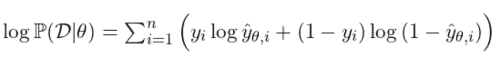
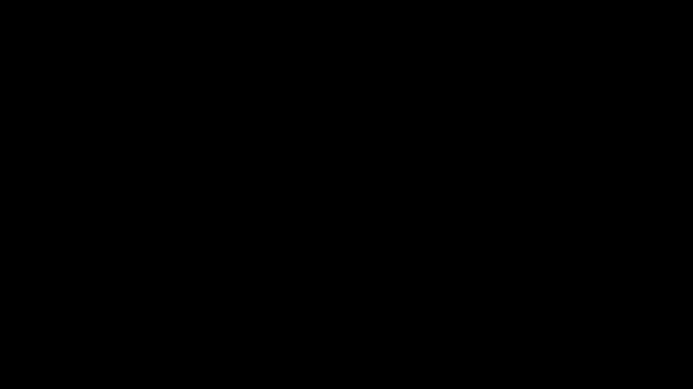
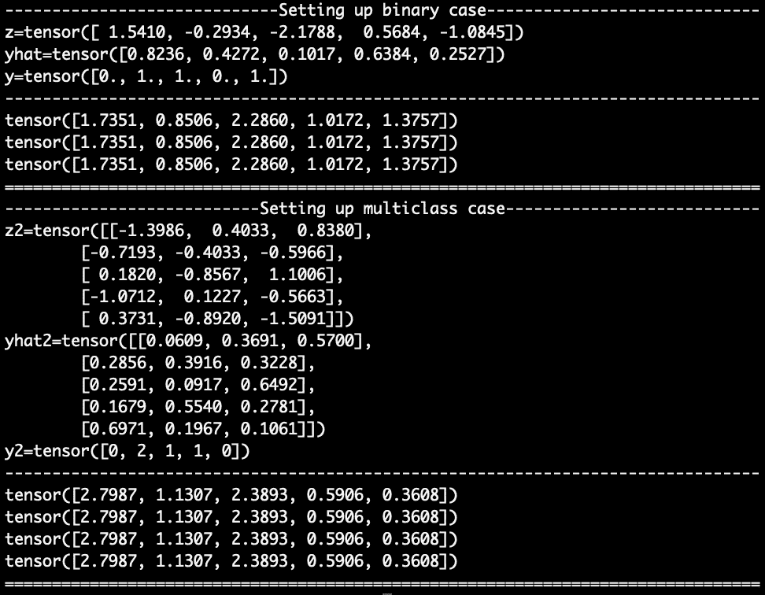

# 交叉熵，负对数似然，等等

> 原文：<https://towardsdatascience.com/cross-entropy-negative-log-likelihood-and-all-that-jazz-47a95bd2e81>

## 数据科学中广泛使用的两个密切相关的数学公式，以及它们在 PyTorch 中的实现

克劳迪奥·施瓦兹在 [Unsplash](https://unsplash.com?utm_source=medium&utm_medium=referral) 上的照片

# TL；速度三角形定位法(dead reckoning)

*   负对数似然最小化是最大似然估计问题的代理问题。
*   交叉熵和负对数似然是密切相关的数学公式。
*   计算负对数似然的基本部分是“对正确的对数概率求和”
*   CrossEntropyLoss 和 NLLLoss 的 PyTorch 实现在预期的输入值上略有不同。简而言之，CrossEntropyLoss 期望原始预测值，而 NLLLoss 期望对数概率。

# 交叉熵==负对数似然？

W 当我刚开始学习数据科学时，我已经建立了一种印象，交叉熵和负对数似然只是同一事物的不同名称。这就是为什么后来当我开始使用 PyTorch 来构建我的模型时，我发现很难理解 [CrossEntropyLoss](https://pytorch.org/docs/stable/generated/torch.nn.CrossEntropyLoss.html#torch.nn.CrossEntropyLoss) 和 [NLLLoss](https://pytorch.org/docs/stable/generated/torch.nn.NLLLoss.html) 是两个不同的损失，它们不会产生相同的值。在更多的阅读和实验之后，我对 PyTorch 中实现的这两者之间的关系有了更深的理解。

在这篇博文中，我将首先介绍负对数似然背后的一些数学知识，并向您展示这个想法在计算上非常简单！你只需要总结出正确的对数概率编码条目。然后，我将展示一个最小的数值实验，它帮助我更好地理解 PyTorch 中 CrossEntropyLoss 和 NLLLoss 之间的差异。

如果你只想知道两个损失之间的区别，可以直接跳到**数值实验**的最后一节。要不，我们先弄个…

# 深入研究数学！

## 最大似然估计

让我们首先考虑*二元分类*的情况。给定由θ参数化的模型 f，主要目标是找到θ，使得*最大化观察数据的可能性*。

其中 y_hat 是正类的预测概率，\sigma 是将值从(-inf，inf)映射到[0，1]的某个非线性激活函数。非线性激活的一个流行选择是 sigmoid:

形式上，可能性定义为[1]:

## **对数似然**

请注意，y_i 和(1-y_i)的幂只不过是告诉您“我们只想计算与真实标签相关联的预测值”的一种巧妙方式

换句话说，为了感觉我们的预测有多好，我们可以看看分配给正确标签的预测概率。这在取对数时可以得到更好的说明，对数将乘积转化为总和，从而得到更常用的*对数似然*:

因为我们处于二进制分类设置中，y 取 0 或 1。因此，对于每个索引 I，我们要么添加 y_hat_i 的对数，要么添加(1-y_hat_i)的对数。

*   y_hat_i:第 I 个数据点为正的预测概率
*   (1-y_hat_i):第 I 个数据点为负的预测概率

## **总结正确条目(二进制大小写)**

下面的动画进一步说明了选择正确条目进行求和的想法。它由以下步骤组成:

1.  从正类的预测概率(y_hat)开始。如果给我们原始预测值，应用 sigmoid 使其成为概率。
2.  计算负类(1-y_hat)的概率。
3.  计算对数概率。
4.  合计与真实标签相关的对数概率。

二元负对数似然的计算，图像由作者制作(用 [Manim](https://github.com/ManimCommunity/manim) 制作)

在这个例子中，对数似然结果是-6.58。

注意，挑选矩阵中正确条目的最终操作有时也称为*屏蔽*。遮罩是基于真实标签构建的。

## **最小化负对数似然**

最后，因为对数函数是单调的，所以最大化似然性与最大化似然性的对数(即对数似然性)是相同的。让事情变得复杂一点，因为“最小化损失”更有意义，我们可以取对数似然的负值并将其最小化，从而得到众所周知的负对数似然损失*:*

总的来说，我们最初的目标是在给定一些参数设置的情况下，最大化观察数据的可能性。最小化负对数似然目标与我们的原始目标是“相同”的，在某种意义上，两者应该具有相同的最优解(在凸优化设置中是迂腐的)。

## 交叉熵

在离散设置中，给定两个概率分布 *p* 和 *q* ，它们的交叉熵定义为

注意，上述负对数似然的定义与 y(真实标签)和 y_hat(真实标签的预测概率)之间的交叉熵相同。

这两个损失之间的相似性导致了我最初的困惑。如果 PyTorch 有两个独立的函数(CrossEntropyLoss 和 NLLLoss ),为什么它们是相同的？正如我们将在稍后使用 PyTorch 的一个小型数值实验中看到的，这两者确实非常相似。一个微小的区别是，CrossEntrypyLoss 的实现隐式地应用了一个 softmax 激活，然后是一个 log 转换，而 NLLLoss 没有。

# 归纳为多类

在进行数值实验以了解 PyTorch 中实现的一些损失函数是如何相关的之前，让我们看看负对数似然如何推广到多类分类设置。

牢记“掩蔽原理”，我们可以将对数似然重写为

其中上面的指数(*而不是幂*)意味着我们只查看与真实标签相关的对数概率。在二进制设置中，

回想一下，y_hat_i 是 sigmoid 激活的 f_\theta_i，为简单起见，我们将 f_\theta_i 称为 z_i。

给定上面重写的对数似然，很容易将其直接应用于多类(C 类)设置，其中 y 现在取值从 0 到 C-1。除了我们需要确定 y_hat_i 定义了一个概率分布，即 1)它在 0 和 1 之间有界，以及 2)分布总和为 1。在二进制设置中，这两个条件由 sigmoid 激活和“非正意味着负”的隐含假设来处理。

## Softmax 激活

事实证明，softmax 功能是我们所追求的

在这种情况下，z_i 是一个维数为 c 的向量。我们可以检查它是否定义了一个概率分布，因为它介于 0 和 1 之间，并且是归一化的。

此外，不难看出，当 C=2，并设置 z_i_0(“负类”的预测分数)为 0 时，我们可以完全恢复 sigmoid 函数(试试看！).

## 汇总正确的条目(多类情况)

现在，我们准备将屏蔽策略应用于多类分类设置，以计算相应的负对数似然。与之前类似，步骤包括

1.  从预测值(还不是概率)z 开始。
2.  使用 softmax 将值转换为类概率(y_hat ),然后取对数概率(log y_hat)。
3.  合计与真实标签相关的对数概率。

多类负对数似然的计算，作者图像(由 [Manim](https://github.com/ManimCommunity/manim) 制作)

在这个例子中，对数似然结果是-6.91。

# 数值实验

了解 CrossEntropyLoss 和 NLLLoss(以及 BCELoss 等)的区别。)，我设计了一个如下的小数值实验。

在二进制设置中，我首先从正态分布生成一个大小为 5 的随机向量(z ),并手动创建一个具有相同形状的标签向量(y ),其条目可以是 0 或 1。然后我使用 softmax(第 8 行)计算基于 z 的预测概率(y_hat)。在第 13 行，我应用前面部分中推导出的负对数似然公式来计算这种情况下的负对数似然值。使用 BCELoss 和 y_hat 作为输入，BCEWithLogitLoss 和 z 作为输入，我观察到上面计算的相同结果。

在多类设置中，我生成 z2，y2，并使用 softmax 函数计算 yhat2。这一次，以对数概率(yhat2 的对数)作为输入的 NLLLoss 和以原始预测值(z)作为输入的 CrossEntropyLoss 产生了使用先前导出的公式计算的相同结果。

代码片段的结果截图，图片由作者提供。

为了简洁起见，我在这里只包括了一个最小的比较集。查看上面 Github gist 的[完整版](https://gist.github.com/RemyLau/c0892869bd769c421364a230d33a129a)，进行更全面的比较。在那里，我还包括了 NLLLoss 和 BCELoss 之间的比较。本质上，要在二进制设置中使用 NLLLoss，需要扩展预测值，如第一个动画所示。

# 什么时候用哪个损耗？

如 PyTorch 中所实现的，损失函数通常采用 *Loss(h，y)* 的形式，其中 *h* 是预测值或其某种转换版本，而 *y* 是标签。仅考虑 *h* 最多只能二维的简单情况，上面的小实验得出以下建议。

## 在下列情况下使用 BCELoss 和 BCEWithLogitsLoss

*h* 和 *y* 都是一维的， *y* 取 0 或 1。

*   如果 *h* 是数据点为正的概率，则使用 BCELoss。
*   如果 *h* 是逻辑值，则使用 BCEWithLogits，即，您想要使用 sigmoid 函数将原始预测值激活为概率。

## 在下列情况下使用 NLLLoss 和 CrossEntropyLoss

*h* 是二维的， *y* 是一维的，取值从 0 到 C-1，有 C 个类。

*   如果 *h* 对对数似然进行编码，则使用 NLLLoss(它主要执行屏蔽步骤，然后是均值缩减)。
*   如果 *h* 对需要使用 softmax 功能激活的原始预测值进行编码，则使用 CrossEntropyLoss。

## 多标签分类呢？

在多标签分类设置中，一个数据点可以与多个(或根本没有)类相关联，而不是在多类情况下，每个带标签的数据点仅与一个类标签相关联。在这种情况下，常见的策略是将问题视为多个二元分类问题，每个类一个。事实证明，只要 *h* 和 *y* 的形状一致，BCELoss 和 BCEWithLogitsLoss 在这种情况下就能很好地工作。

# 结论

总之，我们看到负对数似然最小化是一个寻找最大似然估计解的代理问题。结果表明，两个概率分布之间的交叉熵公式与负对数似然性一致。然而，在 PyTorch 中实现时，CrossEntropyLoss 期望原始预测值，而 NLLLoss 期望对数概率。

[1] P. Mehta，M. Bukov，C. Wang，A.G.R. Day，C. Richardson，C.K. Fisher，D.J. Schwab，[物理学家机器学习的高偏差、低方差介绍](https://www.sciencedirect.com/science/article/pii/S0370157319300766) (2019) *物理报告*

[2]PyTorch 损失功能文档页[https://pytorch.org/docs/stable/nn.html#loss-functions](https://pytorch.org/docs/stable/nn.html#loss-functions)

[3]用于生成动画的代码(使用 [Manim 库](https://github.com/ManimCommunity/manim))[https://github . com/remy lau/visualizations/blob/main/nll loss/nll loss . py](https://github.com/RemyLau/visualizations/blob/main/nllloss/nllloss.py)

[4]数值实验代码 gists
[https://gist . github . com/remy lau/aa 2e 17 c 0612 df 83 a0b 8 dcfa 77 e 525238](https://gist.github.com/RemyLau/aa2e17c0612df83a0b8dcfa77e525238)
[https://gist . github . com/remy lau/c 0892869 BD 769 c 421364 a 230d 33 a129 a](https://gist.github.com/RemyLau/c0892869bd769c421364a230d33a129a)

[5]其他一些关于负对数似然的博客帖子，我觉得很有帮助
【https://notesbylex.com/negative-log-likelihood.html】http://deep learning . Stanford . edu/tutorial/supervised/SoftmaxRegression/

[6]概述 PyTorch 中更多损失函数的博文
[https://neptune.ai/blog/pytorch-loss-functions](https://neptune.ai/blog/pytorch-loss-functions)
[https://medium . com/uda city-py torch-challengers/a-brief-overview-of-loss-functions-in-py torch-c0ddb 78068 f 7](https://medium.com/udacity-pytorch-challengers/a-brief-overview-of-loss-functions-in-pytorch-c0ddb78068f7)