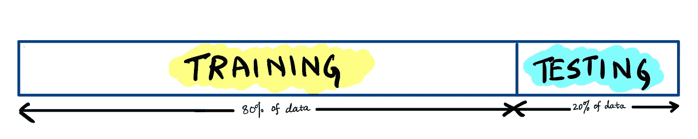
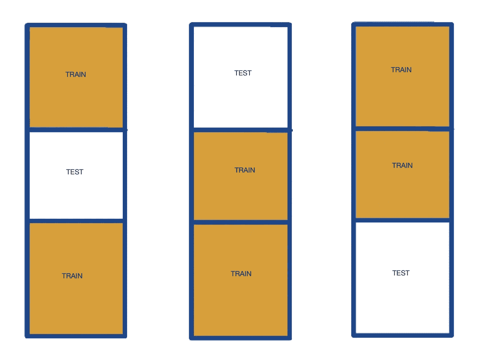
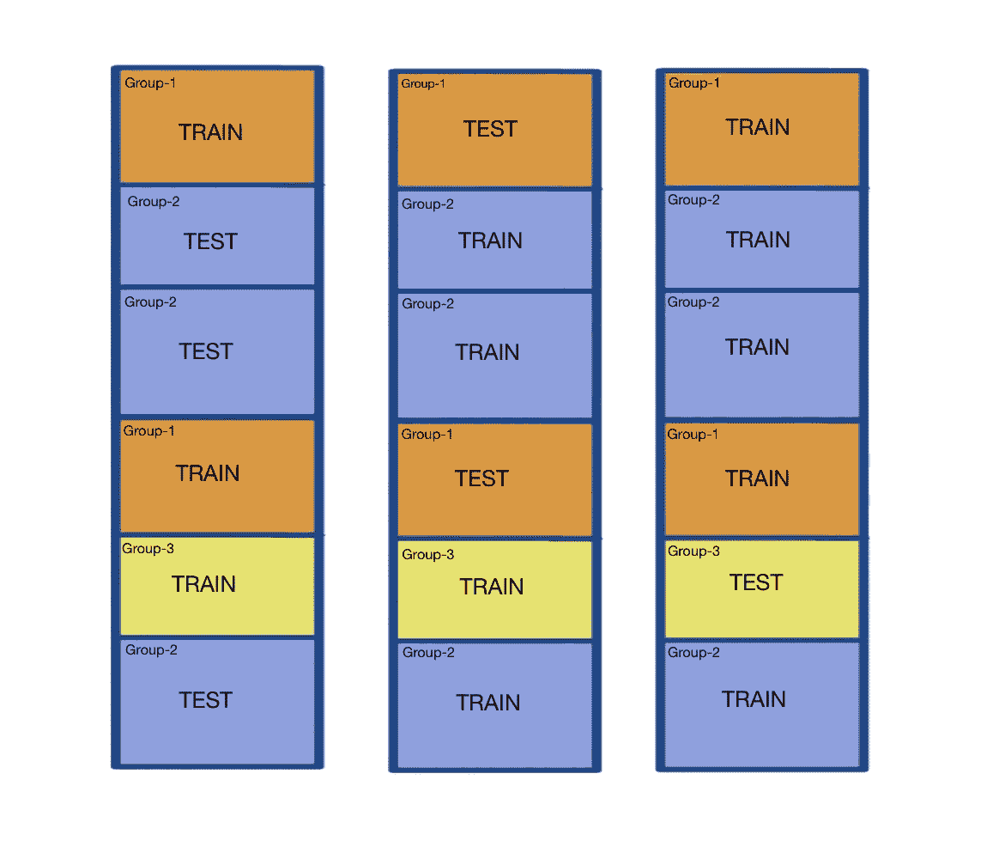

# 在交叉验证中处理组

> 原文：<https://towardsdatascience.com/cross-validate-on-data-containing-groups-correctly-ffa7173a37e6>


尼古拉斯·孔德在 [Unsplash](https://unsplash.com?utm_source=medium&utm_medium=referral) 上的照片

## 您的数据包含组吗？让我们看看如何在这种情况下正确使用交叉验证

构建模型时，您是否遇到过数据集内似乎存在某种“分组”的情况？您希望确保与同一组相关的所有数据都被考虑用于定型模型或评估模型，而不是两者都考虑。这确保了没有数据泄漏，也就是说，在训练期间，模型不会看到保留测试集中的数据。

这类数据的例子可以是*客户* *交易数据*，其中您希望将同一个客户的交易保存在一起。另一个例子可能是包含不同*年*的数据，并且您希望将与一年相关的所有数据保存在测试集或训练集中。

## 数据分割和交叉验证

您可能会想——为什么我们需要拆分数据来训练模型？为什么我们不能把所有的数据都用于训练和测试呢？让我们想一想…

你可能已经明白了，但原因是这样的-如果你使用所有的数据来训练模型，然后根据相同的数据评估这个模型，那么你的模型将几乎完美地执行，因为它在训练时已经看到了所有的数据。这种模型不能很好地概括现实世界中的情况，在现实世界中，数据可能与模型所看到的有些不同。为了避免这种情况，并确保我们是在看不见的数据上评估我们的模型，以及看看它们在现实世界中的表现，我们使用了数据分割。在分割过程中，我们使用一定百分比的数据作为保留集，而剩余部分用于训练。



训练/测试分割(图片由作者提供)

现在问题来了，我们如何知道分割数据的最佳方式是什么，这将给我们一个真正好的模型？为了解决这个问题，我们使用 ***交叉验证*** 。

在*交叉验证*中，我们将数据分成块，并使用每个块来测试模型，同时对剩余的块进行训练。在检查完所有的块之后，我们取所有评估的平均值来返回最终的模型性能。这解决了两件事-

*   确保我们充分利用我们的数据
*   如果我们比较不同的建模技术，我们可以比较它们的交叉验证性能，以选择最好的。

> 交叉验证有助于我们评估模型的性能，以及在数据有限的情况下它的泛化能力

## k 倍

***K 倍*** 是做交叉验证最简单的方法。这里的“K”代表我们在创建拆分时将数据分成的块(折叠)的数量。下图显示了一个简单的三折叠示例，以及如何在对其他折叠进行训练的同时，使用每个折叠来评估模型的性能。



三重交叉验证(图片由作者提供)

为了先看看这在代码中是什么样子，让我们随机创建一个小数据集来使用。

```
import numpy as np# create a dataset containing 6 samples
# each sample has 5 features
X = [np.random.uniform(0.0, 10.0, 5) for _ in range(6)]
```

现在让我们看看 KFold 如何处理这个数据集。我们将使用 KFold 的 scikit-learn 实现。

```
from sklearn.model_selection import KFold
kf_cv = KFold(n_splits=3, shuffle=True, random_state=11)for split, (ix_train, ix_test) in enumerate(kf_cv.split(X)):
    print(f“SPLIT {split+1}”)
    print(f“TRAIN INDEXES: {ix_train}, TEST INDEXES: {ix_test}\n”) ## OUTPUT ##
SPLIT 1
TRAIN INDEXES: [0 1 3 5], TEST INDEXES: [2 4]SPLIT 2
TRAIN INDEXES: [0 1 2 4], TEST INDEXES: [3 5]SPLIT 3
TRAIN INDEXES: [2 3 4 5], TEST INDEXES: [0 1]
```

正如你在上面的代码中看到的，我们运行 KFold 进行了 3 次折叠。因为我们的样本数据集由 6 个样本组成，所以它将它们分成每个包含 2 个样本的块，并使用这些块来创建训练/测试分割。

## K-折叠组

现在我们已经看到了 K-Fold 是如何工作的，如果我们的数据集中有组，我们该怎么办？使用常规 K 折叠时，无法指定组。幸运的是，我们有 ***组 K-Fold*** ，它只是 K-Fold 的增强，有助于考虑数据中的组。



由 3 个小组组成的小组文件夹(图片由作者提供)

> K-Fold 组的属性(来自 scikit 的[-learn](https://scikit-learn.org/stable/modules/generated/sklearn.model_selection.GroupKFold.html)):
> 
> -具有非重叠组的 K 重迭代器变量。
> -同一组不会出现在两个不同的折叠中(不同组的数量必须至少等于折叠的数量)。
> -褶皱大致平衡，即每个褶皱中不同组的数量大致相同。

让我们看看 k-fold 组如何在同一个数据集上工作。 *grps* 只是一个代表每个样本属于哪个组的列表。我们将这个组列表作为参数与数据集一起传递给 *split()函数*。

```
# assign groups to samples
grps = [1,2,1,1,2,3]from sklearn.model_selection import GroupKFold
gkf_cv = GroupKFold(n_splits=3)for split, (ix_train, ix_test) in enumerate(gkf_cv.split(X, groups=grps)):
    print(f“SPLIT {split+1}”)
    print(f“TRAIN INDEXES: {ix_train}, TEST INDEXES: {ix_test}\n”) ## OUTPUT ##
SPLIT 1
TRAIN INDEXES: [1 4 5], TEST INDEXES: [0 2 3]SPLIT 2
TRAIN INDEXES: [0 2 3 5], TEST INDEXES: [1 4]SPLIT 3
TRAIN INDEXES: [0 1 2 3 4], TEST INDEXES: [5]
```

> K-Fold 组确保属于同一组的所有样本都在一起。

## 结论

在某些机器学习问题的情况下，跟踪数据集中的分组是非常重要的，在这种情况下，Group K-Fold 可以提供很大的帮助。

既然明白了什么是团 K 折，那么这个 ***团洗牌拆分*** 是什么？这些拆分与 K-fold 组有何不同？让我们在本系列的下一篇文章中尝试找到这些和其他问题的答案。敬请关注…

## 参考

*   [k 倍交叉验证的温和介绍](https://machinelearningmastery.com/k-fold-cross-validation/)
*   [Scikit-Learn: K 倍](https://scikit-learn.org/stable/modules/generated/sklearn.model_selection.KFold.html#sklearn.model_selection.KFold)
*   [sci kit-Learn:K-Fold 组](https://scikit-learn.org/stable/modules/generated/sklearn.model_selection.GroupKFold.html)
*   [Scikit-Learn:交叉验证用户指南](https://scikit-learn.org/stable/modules/cross_validation.html)