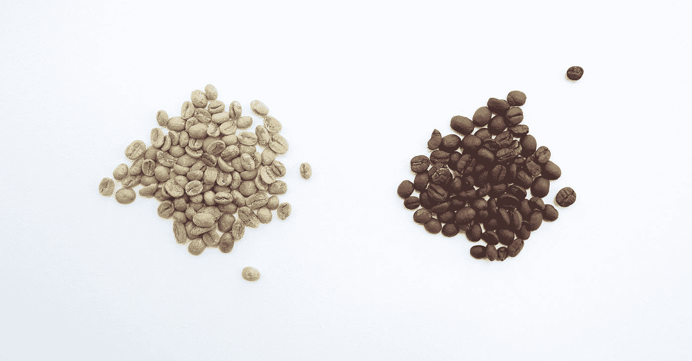
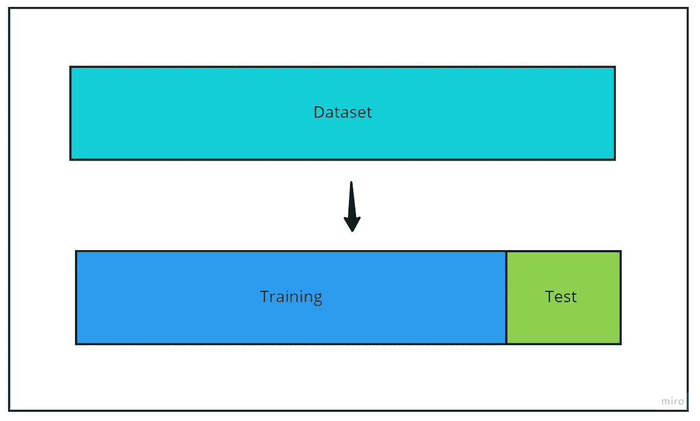
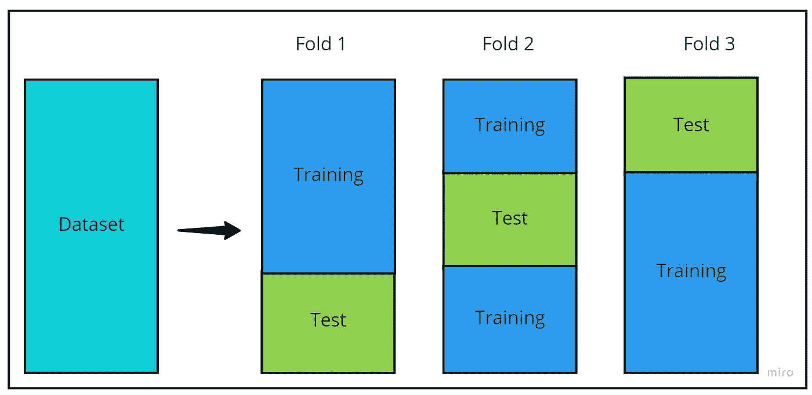
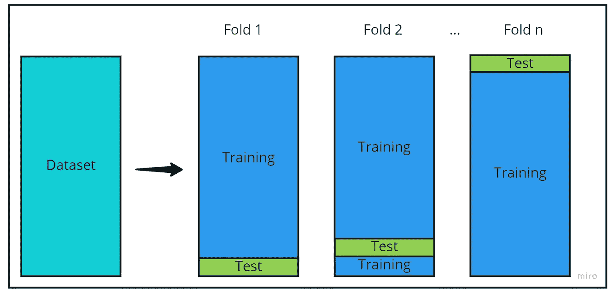

# 交叉验证

> 原文：<https://towardsdatascience.com/cross-validation-705644663568>

## 它是什么，为什么使用它？

照片由[耶鲁安穴獭](https://unsplash.com/@jeroendenotter?utm_source=medium&utm_medium=referral)在 [Unsplash](https://unsplash.com?utm_source=medium&utm_medium=referral)

回归和分类机器学习模型旨在从数据中包含的变量预测值或类。每个模型都有自己的算法来尝试识别数据中包含的模式，从而做出准确的预测。

模型除了要准确，还必须是通才，能够解释以前从未见过的数据，并得出适当的结果。评估模型泛化能力的一种方法是应用交叉验证。

# 但是什么是交叉验证呢？

由[市政府](https://unsplash.com/@lamunix?utm_source=medium&utm_medium=referral)在 [Unsplash](https://unsplash.com?utm_source=medium&utm_medium=referral) 拍摄的照片

交叉验证是一种用于获得模型整体性能评估的技术。有几种交叉验证技术，但它们基本上都是将数据分成训练和测试子集。

顾名思义，训练子集将在训练过程中用于计算模型的超参数。为了计算模型的泛化能力，在训练阶段之后，使用测试模型。

使用来自测试数据集的真实标签和由经过训练的模型对测试数据做出的预测来计算模型的性能度量，例如准确度(分类)和均方根绝对误差(回归)。

交叉验证技术有很多种，在这篇文章中我将讨论其中的三种:**保持**、 **K-Fold** 和**留一法。**

# 维持交叉验证

[咖啡极客](https://unsplash.com/@coffeegeek?utm_source=medium&utm_medium=referral)在 [Unsplash](https://unsplash.com?utm_source=medium&utm_medium=referral) 上的照片

可能最著名的交叉验证技术是拒绝验证。该技术包括将整个数据集分成两组，没有重叠:训练集和测试集。根据项目的不同，这种分离可以是混排数据，也可以是保持数据的排序。

在项目和研究中通常会看到 70/30 的分割，其中 70%的数据用于训练模型，其余 30%用于测试和评估模型。但是，这个比率不是一个规则，它可能会根据项目的特殊性而变化。

应用于数据集的维持交叉验证示例-按作者分类的图像

在 Python 中，使用 scikit-learn 库中的`train_test_split` [函数](https://scikit-learn.org/stable/modules/generated/sklearn.model_selection.train_test_split.html)可以轻松完成维持交叉验证。

使用[乳腺癌数据集](https://archive.ics.uci.edu/ml/datasets/breast+cancer+wisconsin+(diagnostic))和 70/30 分割，我们得到:

# k 倍交叉验证

照片由[安迪·霍尔](https://unsplash.com/@tsbcreative?utm_source=medium&utm_medium=referral)在 [Unsplash](https://unsplash.com?utm_source=medium&utm_medium=referral) 拍摄

在将数据分成训练集和测试集之前，K-Fold 交叉验证将整个数据分成 K 个大小近似的独立子集。只有这样，每个子集才会被分成训练集和测试集。

每个子集用于训练和测试模型。在实践中，这种技术产生 K 个不同的模型和 K 个不同的结果。K 倍交叉验证的最终结果是每个子集的单个指标的平均值。

应用于数据集的三重交叉验证示例-按作者分类的图像

值得注意的是，由于 K 倍将原始数据划分为更小的子集，因此必须考虑数据集的大小和 K 个子集。如果数据集很小或者 K 的数量太大，那么产生的子集可能会变得非常小。

这可能导致只有少量数据用于训练模型，从而导致性能不佳，因为算法由于缺乏信息而无法理解和学习数据中的模式。

Python 也有一种简单的方法来执行 K-Fold 分割，即使用来自 [scikit-learn 库](https://scikit-learn.org/stable/modules/generated/sklearn.model_selection.KFold.html)的`Kfold`。

使用与之前相同的数据集，K = 3，我们得到:

**基本上，维持交叉验证与一折交叉验证相同。**

# 留一交叉验证

威尔·梅尔斯在 [Unsplash](https://unsplash.com?utm_source=medium&utm_medium=referral) 拍摄的照片

留一交叉验证包括创建多个训练和测试集，其中测试集仅包含原始数据的一个样本，而训练集包含原始数据的所有其他样本。对原始数据集中的所有样本重复此过程。

这种类型的验证通常非常耗时，因为如果使用的数据包含 *n* 个样本，算法将不得不训练(使用 *n-1* 个样本)并评估模型 *n* 次。

从积极的一面来看，这种技术，在本文所见的所有技术中，是模型中用于训练的样本量最大的一种，这可能会产生更好的模型。此外，不需要打乱数据，因为所有可能的训练/测试集的组合都将被生成。

应用于数据集的留一交叉验证示例-按作者分类的图像

使用`LeaveOneOut`在 [scikit-learn 库](https://scikit-learn.org/stable/modules/generated/sklearn.model_selection.LeaveOneOut.html)也可以进行留一交叉验证

使用乳腺癌数据集，我们有:

与维持类似，留一交叉验证也是一种特殊类型的 K-Fold，其中 K 的值等于数据集的样本数。

# 性能比较

[Sabri Tuzcu](https://unsplash.com/@sabrituzcu?utm_source=medium&utm_medium=referral) 在 [Unsplash](https://unsplash.com?utm_source=medium&utm_medium=referral) 上拍摄的照片

为了显示每种交叉验证的性能差异，这三种技术将与简单的决策树分类器一起使用，以预测乳腺癌数据集中的患者是良性(1 类)还是恶性(0 类)肿瘤。为了进行比较，将使用 70/30 分割、3 折和留一的维持。

使用的代码可以在我的 github 页面找到:[https://github . com/alerlemos/medium/blob/main/cross _ validation/cross _ validation _ examples . ipynb](https://github.com/alerlemos/medium/blob/main/cross_validation/cross_validation_examples.ipynb)

获得的结果如下表所示:

每种交叉验证技术获得的结果

正如预期的那样，与其他两种技术相比，留一法的运行时间要长得多，尽管它使用了更多的数据来训练模型，但总体而言它并不是最佳性能。

解决这个特定问题的最佳技术是维持交叉验证，其中 70%的数据用于培训，30%用于测试模型。

马库斯·斯皮斯克在 [Unsplash](https://unsplash.com?utm_source=medium&utm_medium=referral) 上的照片

感谢您的阅读，希望对您有所帮助。

欢迎任何意见和建议。

请随时通过我的 Linkedin 联系我，并查看我的 GitHub。

[领英](https://www.linkedin.com/in/alexandre-rosseto-lemos/)

[Github](https://github.com/alerlemos)