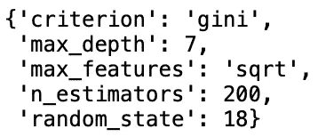
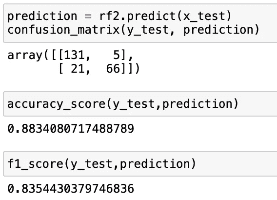

# 交叉验证和网格搜索

> 原文：<https://towardsdatascience.com/cross-validation-and-grid-search-efa64b127c1b>

## 在随机森林模型上使用 sklearn 的 GridSearchCV


图片由 Annie Spratt 通过 Unsplash 提供

为机器学习问题找到最佳的调整参数通常是非常困难的。我们可能会遇到**过度拟合，**，这意味着我们的机器学习模型在我们的训练数据集上训练得过于具体，当应用于我们的测试/维持数据集时，会导致更高水平的错误。或者，我们可能会遇到**欠拟合，**，这意味着我们的模型没有针对我们的训练数据集进行足够具体的训练。当应用于测试/维持数据集时，这也会导致更高水平的误差。

在为模型定型和测试执行常规定型/验证/测试拆分时，模型会对随机选择的特定数据部分进行定型，对单独的数据集进行验证，最后对维持数据集进行测试。在实践中，这可能会导致一些问题，尤其是当数据集的大小相对较小时，因为您可能会删除一部分对训练最佳模型至关重要的观察值。将一定比例的数据排除在训练阶段之外，即使其 15–25%仍然包含大量信息，否则这些信息将有助于我们的模型更有效地训练。

我们的问题有了一个解决方案——**交叉验证**。交叉验证的工作方式是将我们的数据集分成随机的组，选出一组作为测试，然后在其余的组上训练模型。对作为测试组的每个组重复这一过程，然后将模型的平均值用于结果模型。

最常见的交叉验证类型之一是 k-fold 交叉验证，其中“k”是数据集中的折叠数。使用 k =5 是常见的第一步，下面的例子很容易说明这一原理:


作者图片

这里我们看到模型的五次迭代，每次迭代都将不同的褶皱作为测试集，并在其他四个褶皱上进行训练。所有五次迭代完成后，将结果迭代平均在一起，创建最终的交叉验证模型。

虽然交叉验证可以极大地有益于模型开发，但是在进行交叉验证时，也应该考虑一个重要的缺点。因为模型的每次迭代(最多 k 次)都需要运行完整的模型，所以随着数据集变大以及“k”值的增加，计算成本会变得很高。例如，在具有 100 万个观察值的数据集上运行 k = 10 的交叉验证模型需要运行 10 个单独的模型，每个模型都使用所有 100 万个观察值。对于小型数据集来说，这并不是一个问题，因为计算时间可能只有几分钟，但是当处理大型数据集，其规模可能达到数 Gb 或 Tb 时，所需的时间将会显著增加。

在本文的剩余部分，我们将在我之前的文章中创建的随机森林模型上实现交叉验证。此外，我们将实现所谓的网格搜索，它允许我们在超参数网格上运行模型，以确定最佳结果。

**数据:**该数据集提供了乘客的信息，如年龄、机票等级、性别，以及乘客是否幸存的二元变量。这些数据也可以用于 Kaggle Titanic ML 比赛，所以本着保持比赛公平的精神，我不会展示我进行 EDA &数据争论的所有步骤，或者直接发布代码。我将构建我在上面提到的文章中开发的先前的模型。

提醒一下，使用的基本随机森林训练模型如下所示:

```
# Train/Test split
x_train, x_test, y_train, y_test = train_test_split(X, y, test_size = .25, random_state = 18)# Model training
clf = RandomForestClassifier(n_estimators = 500, max_depth = 4, max_features = 3, bootstrap = True, random_state = 18).fit(x_train, y_train)
```

我们取得的成果是:


作者图片

对于本文，我们将保留这个训练/测试分割部分，以保持模型之间的维持测试数据一致，但是我们将使用交叉验证和网格搜索对训练数据进行参数调整，以查看我们的结果输出与使用上面的基本模型得到的输出有何不同。

**GridSearchCV:**
我们将在本文中使用的模块是 sklearn 的 GridSearchCV，它将允许我们传递我们的特定估计量、我们的参数网格和我们选择的交叉验证折叠数。此方法的文档可以在[这里](https://scikit-learn.org/stable/modules/generated/sklearn.model_selection.GridSearchCV.html)找到。下面重点介绍了一些主要参数:

*   **估计器** —此参数允许您选择要运行的特定模型，在我们的示例中为随机森林分类。
*   **param_grid** —该参数允许您传递正在搜索的参数网格。这个网格必须格式化为一个字典，其中的键对应于特定估计器的参数名，值对应于要为特定参数传递的值列表。
*   **cv —** 该参数允许您更改交叉验证的折叠次数。

**模型训练:** 我们将首先为随机森林分类模型创建一个参数值网格。网格中的第一个参数是 n_estimators，它选择随机森林模型中使用的树木数量，这里我们选择 200、300、400 或 500 的值。接下来，我们选择 max_feature 参数的值，它限制了每棵树考虑的特征数量。我们将该参数设置为“sqrt”或“log2”，它将采用数据集中估计量的平方根或以 2 为底的对数的形式。第三个参数是 max_depth，它将随机森林模型中每棵树的最大深度设置为 4、5、6、7 或 8。最后，标准参数将通过“基尼”或“熵”进行搜索，以找到理想的标准。该网格如下所示:

```
grid = { 
    'n_estimators': [200,300,400,500],
    'max_features': ['sqrt', 'log2'],
    'max_depth' : [4,5,6,7,8],
    'criterion' :['gini', 'entropy'],
    'random_state' : [18]
}
```

创建网格后，我们可以运行 GridSearchCV 模型，将 RandomForestClassifier()传递给我们的估计器参数，将我们的网格传递给 param_grid 参数，并将交叉验证折叠值设为 5。

```
rf_cv = GridSearchCV(estimator=RandomForestClassifier(), param_grid=grid, cv= 5)
rf_cv.fit(x_train, y_train)
```

我们现在可以使用了”。best_params_ "方法来为我们的模型输出最佳参数。

```
rf_cv.best_params_
```



作者图片

现在我们有了最佳的参数列表，我们可以使用这些参数运行基本的 RandomForestClassifier 模型，并与使用没有网格搜索的原始训练/测试分割获得的结果进行比较来测试我们的结果。

```
rf2 = RandomForestClassifier(n_estimators = 200, max_depth = 7, max_features = 'sqrt',random_state = 18, criterion = 'gini').fit(x_train, y_train)
```



作者图片

**我们的更优模型的结果优于我们的初始模型，准确性得分为 0.883，而先前为 0.861，F1 得分为 0.835，而先前为 0.803。**

合并 GridSearchCV 的一个缺点是运行时。如前所述，交叉验证和网格调整会导致较长的训练时间，因为模型必须经过多次迭代。整个 GridSearchCV 模型运行大约需要 4 分钟，这看起来不多，但是考虑到我们在这个数据集中只有大约 1k 个观察值。你认为进行 10 万次观察或者数百万次观察需要多长时间？

**结论:** 通过使用交叉验证和网格搜索，当与我们的原始训练/测试分割相比时，我们能够以最小的调整获得更有意义的结果。交叉验证是一种非常重要的方法，用于通过对训练数据集的所有部分进行训练和测试来创建更好的拟合模型。

感谢您花时间阅读这篇文章！我希望你喜欢阅读，并了解了更多关于如何将交叉验证和网格搜索应用到你的机器学习模型中。如果你喜欢你所读的，请关注我的个人资料，成为第一批看到未来文章的人！