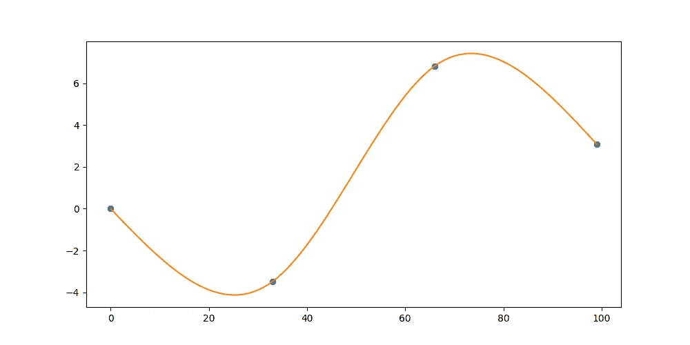
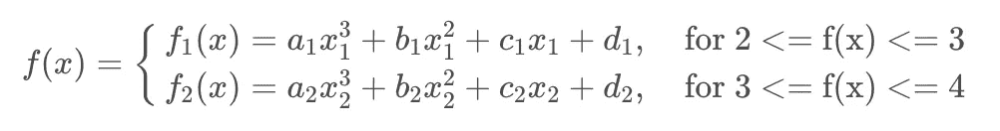
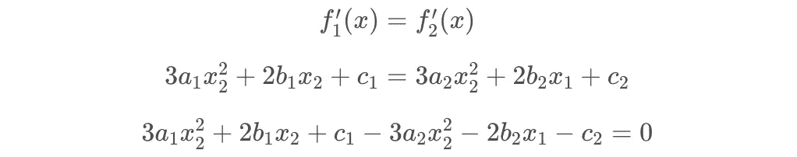
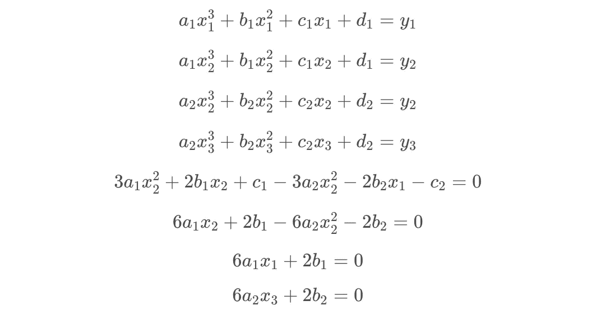
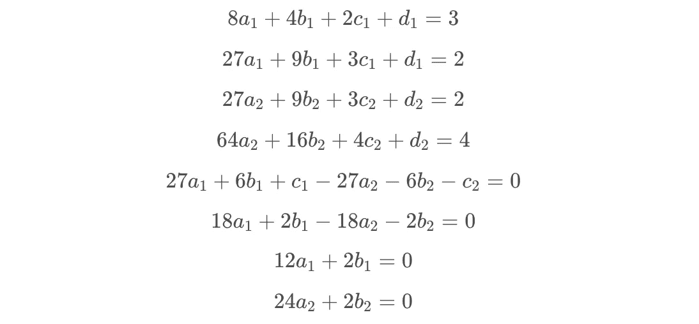
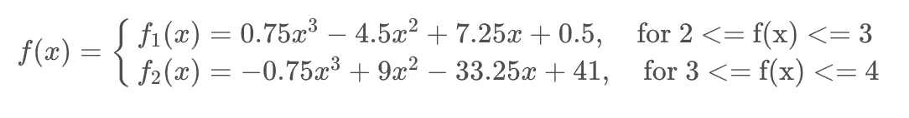
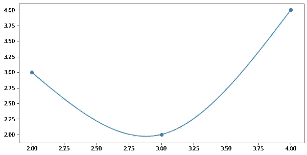
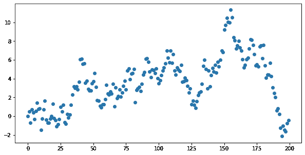
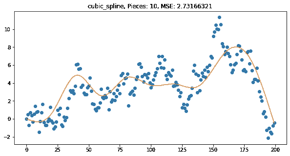
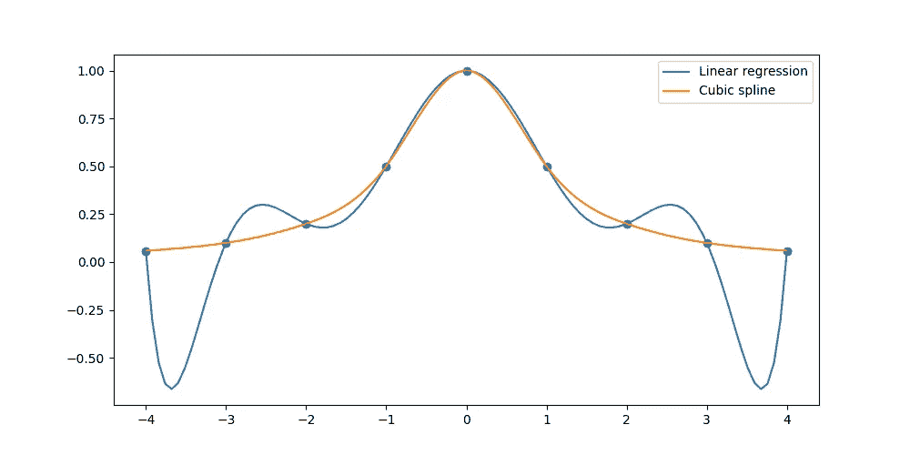

# 三次样条:终极回归模型

> 原文：<https://towardsdatascience.com/cubic-splines-the-ultimate-regression-model-bd51a9cf396d>

## 为什么三次样条是最好的回归模型。

三次样条简介—作者

## 介绍

在本文中，我将介绍三次样条，并展示它们如何比高度线性回归模型更稳健。首先，我将遍历三次样条背后的数学，然后我将用 Python 展示这个模型，最后，我将解释龙格现象。

本文中使用的 python 库叫做 [Regressio](https://github.com/brendanartley/Regressio) 。这是作者为单变量回归、插值和平滑创建的开源 python 库。

—

首先，三次样条是一种分段插值模型，它将三次多项式拟合到分段函数中的每一段。在两个多项式相交的每一点，一阶和二阶导数相等。这有助于形成平滑的拟合线。

分段函数示例—作者

例如，在上图中，我们可以看到三次多项式是如何被分割的。在这个图像中，有 3 块，中间的两个蓝色点是多项式相交的地方。我们可以看到函数在这两点周围是光滑的，并且整个函数是连续的。让我们看看拟合三次样条背后的数学原理。

## 数学

*注:所有数学函数均由本文作者创建。*

假设我们有三个数据点(2，3)、(3，2)和(4，4)。计算三次样条时，我们必须使用至少 2 个最多 n-1 个分段函数。这些分段函数中的每一个都是三次回归模型。

由于我们有 3 个数据点，我们将需要 2 个分段函数。我们将这些表示为 f1(x)和 f2(x)。

在上面的每个方程中，我们有 4 个未知变量(a，b，c，d)。我们需要建立一个方程组来计算每个方程中的未知数，所以我们总共有 8 个未知数。首先，我们知道对于第一点和第二点，这些点必须落在第一个函数上。

接下来，我们知道第二点和第三点一定落在第二个函数上。

我们还知道，两个函数相交时，它们的一阶导数必须相等。

然后，我们知道相交样条的二阶导数必须相等。

最后，我们希望每个端点的二阶导数为 0。这就形成了自然的三次样条曲线。

得到的 8 个等式如下。

然后我们可以插入三个数据点(2，3)，(3，2)，(4，4)。

上述方程可以用矩阵形式表示，并用线性代数求解。这些方程用大小为 4 x (n - 1)的矩阵表示。在这个例子中，矩阵将是 8×8。

然后我们可以把这些值代入我们的两个方程，我们就有了分段函数！

我们理解了算法背后的数学原理，这很好，但是我们不应该每次都必须手动计算权重。在下面的单元格中，我展示了如何在 Numpy 中求解方程。

Numpy 输出—按作者

## 回归图书馆

我们可以做一个比手工输入更好的。我们可以使用一个名为 [Regressio](https://github.com/brendanartley/Regressio) 的轻量级 python 库。该库具有用于回归、插值和平滑的单变量模型。在下面的单元格中，我们正在安装库并生成 200 个数据点的随机样本。

随机数据样本—按作者

然后，我们可以简单地导入三次样条模型，并对数据进行拟合。

回归三次样条模型—作者

这是一个非常惊人的模型，因为我们可以使用低次多项式的组合来拟合高度可变的关系。使用 [Regressio](https://github.com/brendanartley/Regressio) 可以很容易地试验不同的数据集和分段大小，我鼓励你使用这个库进行试验。现在让我们看看为什么这些模型比线性回归更好。

## 龙格现象

拟合样条模型正是 Carl David Tolmé Runge 在 1901 年所做的事情，他发现三次样条等多项式插值方法的效果优于高次线性回归模型。这是由于线性回归模型中区间边缘的大振荡。这在下面的这张图片中很好地显现出来。

作者:龙格现象

在此图像中，橙色线表示三次样条插值法，蓝色线表示线性回归模型。我们可以看到这两个模型的振荡非常不同。

对于线性回归模型，如果给我们一个位于训练数据边界之外的数据点，那么我们将得到一个异常预测。这是因为训练范围之外的模型导数的幅度非常大。这不是样条模型的情况，也是它更健壮的原因。

## 最后的想法

希望本文向您展示了三次样条如何比高度线性回归模型更稳健。在回归入门课程中，经常会跳过三次样条，但这是不应该的。在我看来，它们是线性回归模型的优秀解决方案，因为它们减轻了龙格现象。

我鼓励你尝试更多三次样条的例子，并看看[回归](https://github.com/brendanartley/Regressio)库中的其他模型。作为这个包的作者，我使代码库对于那些试图理解每个模型如何工作的人来说非常可读。该库仍在生产中，并经常发生变化，请随意给它一颗星以跟踪它的变化，或者自己做出贡献！

如果你想要这篇文章的笔记本代码，你可以在这里找到。

## 参考

*   约翰·c(2022 年 4 月 11 日)。*等间距节点插值的龙格现象*。约翰 d .库克|应用数学咨询。检索于 2022 年 7 月 26 日，发自 https://www.johndcook.com/blog/2017/11/18/runge-phenomena/
*   *Python 编程和数值方法:工程师指南和…* 加州大学伯克利分校。(2021).检索于 2022 年 7 月 26 日，来自[https://python numerical methods . Berkeley . edu/notebooks/index . html](https://pythonnumericalmethods.berkeley.edu/notebooks/Index.html)
*   维基媒体基金会。(2022 年 6 月 9 日)。*龙格现象*。维基百科。检索于 2022 年 7 月 26 日，来自[https://en.wikipedia.org/wiki/Runge%27s_phenomenon](https://en.wikipedia.org/wiki/Runge%27s_phenomenon)