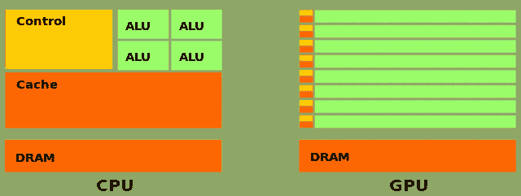
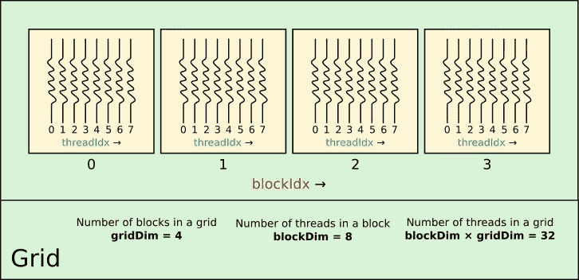
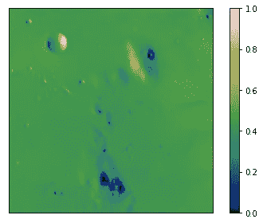
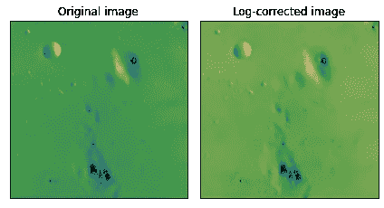

# CUDA by Numba 示例

> 原文：<https://towardsdatascience.com/cuda-by-numba-examples-1-4-e0d06651612f>

## 阅读本系列文章，从头开始学习使用 Python 进行 CUDA 编程

# 第 1 部分，共 4 部分:开始并行之旅

# 介绍

顾名思义，GPU(图形处理单元)最初是为计算机图形而开发的。从那以后，它们在几乎每个需要高计算吞吐量的领域都变得无处不在。这一进步是由 GPGPU(通用 GPU)接口的开发实现的，它允许我们为通用计算编程 GPU。这些接口中最常见的是 [CUDA](https://docs.nvidia.com/cuda/cuda-c-programming-guide/index.html) ，其次是 [OpenCL](https://www.khronos.org/opencl/) 以及最近的 [HIP](https://rocmdocs.amd.com/en/latest/Programming_Guides/Programming-Guides.html) 。


图 1.0。运行[稳定扩散](https://replicate.com/stability-ai/stable-diffusion)带`parallel lines futuristic space`。学分:在 CreativeML Open RAIL-M 许可下拥有作品。

# Python 中的 CUDA

CUDA 最初是为了与 C 兼容而设计的，后来的版本将其扩展到了 C++和 Fortran。在 Python 生态系统中，使用 CUDA 的方法之一是通过 [Numba](https://numba.readthedocs.io/en/stable/user/5minguide.html) ，这是一个针对 Python 的实时(JIT)编译器，可以针对 GPU(它也针对 CPU，但这不在我们的范围之内)。使用 Numba，可以直接用 Python(的子集)编写内核，Numba 将动态编译代码并运行它。虽然它*没有*实现完整的 CUDA API，但与 CPU 相比，它支持的功能通常足以获得令人印象深刻的加速(有关所有缺失的功能，请参见[Numba 文档](https://numba.readthedocs.io/en/stable/cuda/overview.html#missing-cuda-features))。

然而，Numba 并不是唯一的选择。CuPy 提供了依赖 CUDA 的高级功能、集成 C 语言内核的低级 CUDA 支持和可 JIT 的 Python 功能(类似于 Numba)。 [PyCUDA](https://documen.tician.de/pycuda/) 提供了更细粒度的 CUDA API 控制。最近，Nvidia 发布了官方的 [CUDA Python](https://nvidia.github.io/cuda-python/overview.html) ，这必将丰富生态系统。所有这些项目都可以互相传递设备阵列，您不会被限制只能使用一个。

# 在这个系列中

本系列的目标是通过用 Numba CUDA 编写的例子提供一个通用 CUDA 模式的学习平台。本系列不是 CUDA 或 Numba 的综合指南。读者可以参考他们各自的文档。本教程的结构灵感来自 Jason Sanders 和 Edward Kandrot 所著的《CUDA by Example:a Introduction to General-Purpose GPU Programming》一书。如果您最终不再使用 Python，而是想用 C 语言编写代码，这是一个极好的资源。该系列还有三个部分:[第二部分](/cuda-by-numba-examples-215c0d285088)、[第三部分](/cuda-by-numba-examples-7652412af1ee)和[第四部分](/cuda-by-numba-examples-c583474124b0)。

# 在本教程中

我们将学习如何运行我们的第一个 Numba CUDA 内核。我们还将学习如何有效地使用 CUDA 来处理令人尴尬的并行任务，即彼此完全独立的任务。最后，我们将学习如何从 CPU 对内核运行时进行计时。

[点击此处获取 Google Colab 中的代码](https://colab.research.google.com/drive/1h0Savk8HSIgraT61burXQwbEUDMz4HT6?usp=sharing)。

# GPU 并行编程简介

与 CPU 相比，GPU 的最大优势在于它们能够并行执行相同的指令。单个 CPU 内核将一个接一个地串行运行指令。在一个 CPU 上实现并行化需要同时使用其多个内核(物理内核或[虚拟内核](https://en.wikipedia.org/wiki/Hyper-threading))。一台标准的现代计算机有 4-8 个内核。另一方面，现代 GPU 拥有数百个甚至数千个计算核心。这两者之间的比较见图 1。GPU 核心通常较慢，只能执行简单的指令，但它们的数量通常会成倍地弥补这些缺点。需要注意的是，为了让 GPU 拥有 CPU 的优势，它们运行的算法必须是可并行的。

我认为 [*钻研*](https://en.wikipedia.org/wiki/Grok#In_computer_programmer_culture) GPU 编程主要有四个方面。第一个我已经提到了:理解如何思考和设计本质上并行的算法。这可能很难做到，因为有些算法是串行设计的，还因为同一算法可能有多种并行方式。

第二个方面是学习如何将位于主机上的结构(如向量和图像)映射到 GPU 构造(如线程和块)上。循环模式和辅助函数可以帮助我们做到这一点，但最终，实验对于充分利用 GPU 是非常重要的。

第三是理解驱动 GPU 编程的异步执行模型。不仅 GPU 和 CPU 彼此独立地执行指令，GPU 还有*流*，允许多个处理流在同一个 GPU 中运行。在设计最佳处理流程时，这种异步性非常重要。

第四个也是最后一个方面是抽象概念和具体代码之间的关系:这是通过学习 API 及其细微差别来实现的。

当你阅读第一章时，试着在下面的例子中识别这些概念！



图 1.1。简化的 CPU 架构(左)和 GPU 架构(右)。算术发生在 ALU(算术逻辑单元)、DRAM 数据、高速缓存中，高速缓存甚至保存可以更快访问的数据，但通常容量较小。控制单元执行指令。信用:[维基百科](https://commons.wikimedia.org/wiki/File:Cpu-gpu.svg)。

# 入门指南

我们将从设置我们的环境开始:高于 0.55 的 Numba 版本和支持的 GPU。

Numba CUDA 的主要工具是`cuda.jit`装饰器。它用于定义将在 GPU 中运行的函数。

我们首先定义一个简单的函数，它接受两个数字，并将它们存储在第三个参数的第一个元素上。我们的第一个教训是内核(启动线程的 GPU 函数)不能返回值。我们通过传递输入*和输出*来解决这个问题。这是 C 中常见的模式，但在 Python 中并不常见。

您可能已经注意到，在我们调用内核之前，我们需要在设备上分配一个数组。此外，如果我们想显示返回值，我们需要将它复制回 CPU。您可能会问自己，为什么我们选择分配一个`float32`(单精度浮点型)。这是因为，虽然大多数现代 GPU 都支持双精度算法，但双精度算法比单精度算法耗时 4 倍或更长。所以最好习惯用`np.float32``np.complex64`而不是`float`/`np.float64``complex`/`np.complex128`。

尽管内核定义看起来类似于 CPU 函数，但内核调用略有不同。特别是，它在参数前有方括号:

`add_scalars[1, 1](2.0, 7.0, dev_c)`

这些方括号分别表示网格中*块*的数量，以及块中*线程*的数量。随着我们学习使用 CUDA 进行并行化，让我们更深入地讨论一下这些意味着什么。

# 使用 CUDA 实现并行化

## CUDA 网格的剖析

当一个内核启动时，它有一个*网格*与之相关联。一个网格由*块*组成；一个滑块由*螺纹*组成。图 2 显示了一个一维 CUDA 网格。图中的网格有 4 个块。网格中的块数保存在一个特殊的变量中，这个变量可以在内核中被访问，称为`gridDim.x`。`.x`是指网格的第一维度(本例中唯一的一个)。二维网格也有`.y`和三维网格，`.z`变量。截至 2022 年，没有 4 维或更高的网格。同样在内核内部，您可以通过使用`blockIdx.x`找出哪个块正在被执行，在本例中它将从 0 运行到 3。

每个程序块都有一定数量的线程，保存在变量`blockDim.x`中。线程索引保存在变量`threadIdx.x`中，在本例中从 0 到 7 运行。

重要的是，不同块中的线程被调度为不同的运行方式，可以访问不同的内存区域，并且在其他方面也有所不同(参见[*CUDA Refresher:The CUDA Programming Model*](https://developer.nvidia.com/blog/cuda-refresher-cuda-programming-model/)进行简要讨论)。现在，我们将跳过这些细节。



图 1.2。一维 CUDA 网格。图片作者。

当我们在第一个例子中用参数`[1, 1]`启动内核时，我们告诉 CUDA 用一个线程运行一个块。用几个线程传递几个块，会多次运行内核。操纵`threadIdx.x`和`blockIdx.x`将允许我们唯一地识别每个线程。

让我们尝试对两个数组求和，而不是对两个数字求和。假设每个数组有 20 个元素。如上图所示，我们可以启动一个每个块有 8 个线程的内核。如果我们希望每个线程只处理一个数组元素，那么我们至少需要 4 个块。启动 4 个块，每个块 8 个线程，然后我们的网格将启动 32 个线程。

现在我们需要弄清楚如何将线程索引映射到数组索引。`threadIdx.x`从 0 运行到 7，所以他们自己不能索引我们的数组。此外，不同的区块有相同的`threadIdx.x`。另一方面，他们有不同的`blockIdx.x`。为了获得每个线程的唯一索引，我们可以组合这些变量:

`i = threadIdx.x + blockDim.x * blockIdx.x`

对于第一个块，`blockIdx.x = 0`和`i`将从 0 运行到 7。对于第二块，`blockIdx.x = 1`。从`blockDim.x = 8`开始，`i`将从 8 运行到 15。同样，对于`blockIdx.x = 2`，`i`将从 16 运行到 23。在第四个也是最后一个程序块中，`i`将从 24 运行到 31。见下表 1。

我们解决了一个问题:如何将每个线程映射到数组中的每个元素…但现在我们有一个问题，一些线程会溢出数组，因为数组有 20 个元素，而`i`上升到 32-1。解决方案很简单:对于那些线程，不要做任何事情！

让我们看看代码。

在 Numba 的新版本中，我们得到一个警告，指出我们用主机数组调用了内核。理想情况下，我们希望避免在主机和设备之间移动数据，因为这非常慢。我们应该在所有参数中使用设备数组来调用内核。我们可以通过预先将阵列从主机移动到设备来做到这一点:

```
dev_a = cuda.to_device(a)dev_b = cuda.to_device(b)
```

此外，每个线程的唯一索引的计算会很快过时。令人欣慰的是，Numba 提供了非常简单的包装器`cuda.grid`,它是用网格维度作为唯一参数来调用的。新内核将如下所示:

当我们改变数组的大小时会发生什么？一种简单的方法是简单地改变网格参数(块的数量和每个块的线程数量),以便启动至少与数组中的元素一样多的线程。

设定这些参数需要一些科学和艺术。对于“科学”，我们会说(a)它们应该是 2 的倍数，通常在 32 到 1024 之间，以及(b)它们应该被选择为最大化*占用率*(有多少线程同时处于活动状态)。Nvidia 提供了一个[电子表格](https://docs.nvidia.com/cuda/cuda-occupancy-calculator/index.html)可以帮助计算这些。对于“艺术”来说，没有什么可以预测内核的行为，所以如果你真的想优化这些参数，你需要用典型的输入来分析你的代码。实际上，现代 GPU 的“合理”线程数是 256。

在讨论矢量求和之前，我们需要讨论一下硬件限制。GPU 不能运行任意数量的线程和块。通常每个块不能有超过 1024 个线程，一个网格不能有超过 2 个⁶1 = 65535 块。这并不是说您可以启动 1024 × 65535 个线程…除了其他考虑因素之外，根据寄存器占用的内存大小，可以启动的线程数量是有限制的。此外，必须警惕试图同时处理不适合 GPU RAM 的大型数组。在这些情况下，可以使用单个 GPU 或多个 GPU 来分段处理数组。

***INFO:*** *在 Python 中，硬件限制可以通过 Nvidia 的* `*cuda-python*` *库通过* [*函数*](https://nvidia.github.io/cuda-python/module/cuda.html#cuda.cuda.cuDeviceGetAttribute) `[*cuDeviceGetAttribute*](https://nvidia.github.io/cuda-python/module/cuda.html#cuda.cuda.cuDeviceGetAttribute)` [*在他们的文档*](https://nvidia.github.io/cuda-python/module/cuda.html#cuda.cuda.cuDeviceGetAttribute) *中获得。有关示例，请参见本节末尾的附录。*

## 网格步长循环

如果每个网格的块数超过了硬件限制，但数组适合内存，我们可以使用一个线程来处理几个元素，而不是每个数组元素使用一个线程。我们将通过使用一种叫做*网格步长循环*的技术来实现。除了克服硬件限制之外，grid-stride 循环内核还受益于线程重用，这是通过最小化线程创建/销毁开销实现的。马克·哈里斯的博客文章 [*CUDA Pro 提示:用网格步长循环编写灵活的内核*](https://developer.nvidia.com/blog/cuda-pro-tip-write-flexible-kernels-grid-stride-loops/) 详细介绍了网格步长循环的一些好处。

这项技术背后的思想是在 CUDA 内核中添加一个循环来处理多个输入元素。顾名思义，这个循环的步距等于一个网格中的线程数。这样，如果网格中的线程总数(`threads_per_grid = blockDim.x * gridDim.x`)小于数组元素的数量，那么一旦内核处理完索引`cuda.grid(1)`，它将处理索引`cuda.grid(1) + threads_per_grid`等等，直到所有的数组元素都被处理完。事不宜迟，我们来看看代码。

这段代码与上面的非常相似，不同的是我们在`cuda.grid(1)`开始*，但是执行更多的样本，每`threads_per_grid`一个，直到我们到达数组的末尾。*

现在，哪一个内核更快？

# 定时 CUDA 内核

GPU 编程都是关于速度的。因此，准确测量代码执行是非常重要的。

CUDA 内核是由主机(CPU)启动的设备功能，当然它们是在 GPU 上执行的。GPU 和 CPU 不通信，除非我们告诉他们。因此，当 GPU 内核启动时，CPU 将简单地继续运行指令，无论它们是启动更多的内核还是执行其他 CPU 功能。如果我们在内核启动前后发出一个`time.time()`调用，我们将只计算内核启动*所花的时间，而不是*运行*。*

我们可以用来确保 GPU 已经“跟上”的一个函数是`cuda.synchronize()`。调用此函数将停止主机执行任何其他代码，直到 GPU 完成执行其中已启动的每个内核。

为了给内核执行计时，我们可以简单地计算内核运行和同步的时间。对此有两点需要注意。首先，我们需要使用`time.perf_counter()`或`time.perf_counter_ns()`而不是`time.time()`。`time.time()`不计算主机休眠等待 GPU 完成执行的时间。第二个警告是，来自主机的定时代码并不理想，因为存在与此相关的开销。稍后，我们将解释如何使用 CUDA *事件*来为设备中的内核计时。马克·哈里斯有另一篇关于这个主题的优秀博文，题为 [*如何在 CUDA C/C++*](https://developer.nvidia.com/blog/how-implement-performance-metrics-cuda-cc/) 中实现性能指标。

在使用 Numba 的时候，有一个细节是我们必须注意的。Numba 是一个实时编译器，这意味着函数只有在被调用时才会被编译。因此，对函数*的第一次调用计时也将对编译步骤*计时，编译步骤通常要慢得多。我们必须记住，总是首先通过启动内核来编译代码，然后同步它，以确保没有任何东西留在 GPU 中运行。这确保了下一个内核无需编译就能立即运行。还要注意数组的`dtype`应该是相同的，因为 Numba 为参数`dtypes`的每个组合编译一个唯一的函数。

对于简单的内核，我们还可以测量算法的吞吐量，即每秒钟浮点运算的次数。它通常以 GFLOP/s(每秒千兆次浮点运算)来度量。我们的加法运算只包含一个翻牌:加法。因此，吞吐量由下式给出:

# 2D 的例子

为了结束本教程，让我们制作一个 2D 内核来对图像应用[对数校正](https://scikit-image.org/docs/stable/api/skimage.exposure.html#skimage.exposure.adjust_log)。

给定值在 0 和 1 之间的图像 I(x，y ),对数校正图像由下式给出

Iᵪ(x，y) = γ log₂ (1 + I(x，y))

首先让我们获取一些数据！



图 1.3。原始“月球”数据集。图片作者。

如你所见，数据在低端已经饱和。0.6 以上的数值几乎没有。

让我们来写内核。

让我们记下这两个`for`循环。请注意，第一个`for`循环从`iy`开始，第二个最里面的循环从`ix`开始。我们可以很容易地选择`i0`在`ix`开始，而`i1`在`iy`开始，这样会感觉更自然。那么我们为什么选择这个顺序呢？事实证明，第一种选择的内存访问模式效率更高。由于第一个网格索引是最快的一个，所以我们想让它匹配我们最快的维度:最后一个。

如果你不想相信我的话(你不应该相信！)您现在已经了解了如何对内核执行进行计时，您可以尝试这两个版本。对于像这里使用的这种小数组，这种差异可以忽略不计，但是对于更大的数组(比如 10，000 乘 10，000)，我测得的加速大约是 10%。不是很令人印象深刻，但是如果我可以通过一次变量交换给你 10%的提高，谁会不接受呢？

就是这样！我们现在可以在校正后的图像中看到更多细节。

作为一个练习，尝试用不同的网格来计时不同的启动，以找到适合您的机器的最佳网格大小。



图 1.4。原始(左)和对数校正(右)“月球”数据集。图片作者。

# 结论

在本教程中，你学习了 Numba CUDA 的基础知识。您学习了如何创建简单的 CUDA 内核，并将内存转移到 GPU 来使用它们。您还学习了如何使用一种叫做*网格步长循环*的技术迭代 1D 和 2D 数组。

# 附录:使用 Nvidia 的 cuda-python 探测设备属性

为了对 GPU 的确切属性进行精细控制，您可以依赖 Nvidia 提供的底层官方 CUDA Python 包。