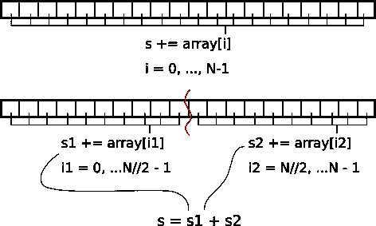
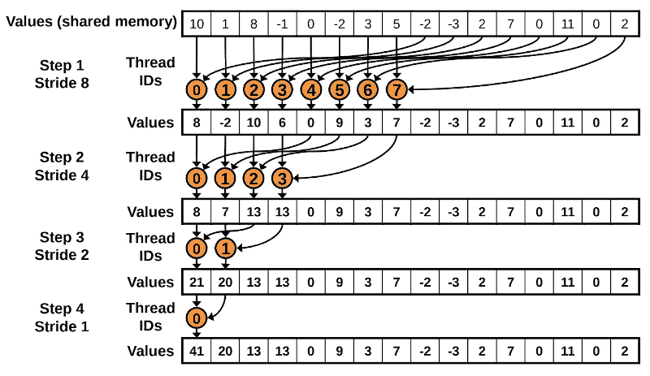
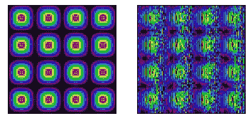

# CUDA by Numba 示例

> 原文：<https://towardsdatascience.com/cuda-by-numba-examples-215c0d285088>

## 阅读本系列文章，从头开始学习使用 Python 进行 CUDA 编程

# 第 2 部分，共 4 部分:穿针引线

# 介绍

在本系列的第一期[中，我们讨论了如何使用 GPU 运行令人尴尬的并行算法。令人尴尬的并行任务是那些任务彼此完全独立的任务，例如对两个数组求和或应用任何元素级函数。](/cuda-by-numba-examples-1-4-e0d06651612f)


图 2.0。用“穿针赛博朋克”运行稳定扩散。学分:在 CreativeML Open RAIL-M 许可下拥有作品。

# 在本教程中

许多任务虽然不是令人尴尬的并行，但仍然可以从并行化中受益。在本期的 *CUDA by Numba Examples* 中，我们将介绍一些允许线程在计算中协作的常用技术。

[点击这里在 Google colab 中抓取代码。](https://colab.research.google.com/drive/1GkGLDexnYUnl2ilmwNxAlWAH6Eo5ZK2f?usp=sharing)

本教程后面还有两个部分:[第三部分](/cuda-by-numba-examples-7652412af1ee)和[第四部分](/cuda-by-numba-examples-c583474124b0)。

# 入门指南

导入和加载库，确保你有一个 GPU。

# 线程协作

## 简单并行归约算法

我们将从一个非常简单的问题开始这一部分:对一个数组的所有元素求和。串行地，这个算法非常简单。不借助 NumPy，我们可以这样实现它:

我知道，这看起来不太像蟒蛇。但是它强调了`s`正在跟踪数组中的所有元素。如果`s`依赖于数组的每一个元素，我们如何将这个算法并行化？首先，我们需要重写算法以允许一些并行化。如果有我们不能并行化的部分，我们应该允许线程相互通信。

然而，到目前为止，我们还没有学会如何让线程相互通信…事实上，我们以前说过，不同块中的线程是不通信的。我们可以考虑只启动一个块，但是请记住，在大多数 GPU 中，块只能有 1024 个线程！

我们如何克服这一点？那么，如果我们把数组分成 1024 个(或者适当数量的`threads_per_block`)的块，然后分别对每个块求和，会怎么样呢？最后，我们可以把每个数据块的结果相加。图 2.1 显示了一个非常简单的两块分割的例子。



图 2.1。对数组元素求和的“分治”方法。图片作者。

我们如何在 GPU 上做到这一点？首先，我们需要将数组分成几个块。每个块都对应于一个块，有固定数量的线程。在每个块中，每个线程可以对多个数组元素求和(grid-stride 循环)。然后，我们必须在整个块中计算每个线程的值。该位需要线程进行通信。我们将在下一个例子中讨论如何做到这一点。

由于我们是在块上并行化，内核的输出应该作为一个块来确定大小。为了完成缩减，我们将它复制到 CPU 并在那里完成工作。

***警告*** *:共享数组必须*

*   *要“小”。确切的大小取决于 GPU 的计算能力，通常在 48 KB 和 163 KB 之间。参见本表* *中* [*项“每个线程块的最大共享内存量”。*](https://docs.nvidia.com/cuda/cuda-c-programming-guide/index.html#features-and-technical-specifications__technical-specifications-per-compute-capability)
*   *在编译时有一个已知的大小(这就是为什么我们调整共享数组* `*threads_per_block*` *而不是* `*blockDim.x*` *)。诚然，我们总是可以定义一个* [*工厂函数*](https://en.wikipedia.org/wiki/Factory_(object-oriented_programming)) *来共享任意大小的数组...但是要注意这些内核的编译时间。*
*   *有* `*dtype*` *由 Numba 类型指定，而不是 Numpy 类型(不要问我为什么！).*

我在 Google Colab 上运行了这个，我们得到了 10 倍的加速。相当不错！

# 一种更好的并行归约算法

你现在可能想知道为什么我们把一切都命名为“幼稚”。这意味着有一些非幼稚的方式来做同样的功能。事实上，有很多技巧可以加速这类代码(参见 CUDA 演示中的 [*优化并行化缩减作为基准)。*](https://developer.download.nvidia.com/assets/cuda/files/reduction.pdf)

在我们展示更好的方法之前，让我们回忆一下内核的最后一点:

我们几乎并行化了所有的事情，但是在内核的最后，我们让一个线程负责对共享数组`s_block`的所有`threads_per_block`元素求和。为什么我们不把这个求和也并行化呢？

听起来不错，怎么样？图 2.2 显示了如何在`threads_per_block`尺寸为 16 的情况下实现这一点。我们从 8 个线程开始工作，第一个线程将对`s_block[0]`和`s_block[8]`中的值求和。第二个是`s_block[1]`和`s_block[9]`中的值，直到最后一个线程将值`s_block[7]`和`s_block[15]`相加。

在下一步中，只有前 4 个线程需要工作。第一个线程将对`s_block[0]`和`s_block[4]`求和；第二，`s_block[1]`和`s_block[5]`；第三，`s_block[2]`和`s_block[6]`；第四个也是最后一个，`s_block[3]`和`s_block[7]`。

第三步，我们现在只需要 2 个线程来处理`s_block`的前 4 个元素。第四步也是最后一步将使用一个线程对 2 个元素求和。

由于工作在线程之间进行了划分，因此它被并行化了。当然，这不是每个线程的平均划分，但这是一种改进。在计算上，这个算法是 O(log2( `threads_per_block`))，而第一个算法是 O( `threads_per_block`)。在我们的例子中，简单算法有 1024 次运算，而改进算法只有 10 次！

还有最后一个细节。在每一步，我们都需要确保所有线程都已经写入共享数组。所以我们要调用`cuda.syncthreads()`。



图 2.2。通过顺序寻址进行归约。鸣谢:马克·哈里斯， [*优化 CUDA 中的并行还原*](https://developer.download.nvidia.com/assets/cuda/files/reduction.pdf) 。

在我的机器上，这比简单的方法快 25%。

***警告*** *:您可能想将* `*syncthreads*` *移动到* `*if*` *块内，因为在每一步之后，超出当前线程数一半的内核将不会被使用。然而，这样做将使名为* `*syncthreads*` *的 CUDA 线程停止并等待所有其他线程，而所有其他线程将继续运行。因此，停止的线程将永远等待永不停止的线程进行同步。要点是:如果同步线程，确保在所有线程* *中调用* `***cuda.syncthreads()***` ***。***

```
i = cuda.blockDim.x // 2
while (i > 0):
    if (tid < i):
        s_block[tid] += s_block[tid + i]
        cuda.syncthreads() # don't put it here
    cuda.syncthreads()  # instead of here
    i //= 2
```

# 数字减少

因为上面的归约算法很重要，Numba 提供了一个方便的`cuda.reduce`装饰器，将二进制函数转换成归约。上述长而复杂的算法可以替换为:

就个人而言，我发现手写的归约通常要快得多(至少快 2 倍)，但是 Numba 递归非常容易使用。也就是说，我鼓励阅读 Numba 源代码中的 [reduction 代码。](https://github.com/numba/numba/blob/main/numba/cuda/kernels/reduction.py)

还需要注意的是，默认情况下，缩减拷贝到主机，这将强制同步。为了避免这种情况，您可以使用设备数组作为输出来调用缩减:

# 2D 还原示例

并行归约技术很棒，但如何将其扩展到更高维度并不明显。虽然我们总是可以用一个未展开的数组(`array2d.ravel()`)来调用 Numba 归约，但是理解我们如何手动归约多维数组是很重要的。

在这个例子中，我们将结合我们对 2D 核的了解和对 1D 约简的了解来计算 2D 约简。

# 设备功能

到目前为止，我们只讨论了内核，这是启动线程的特殊 GPU 函数。内核通常依赖于较小的函数，这些函数在 GPU 中定义，并且只能访问 GPU 数组。这些被称为*设备功能*。与内核不同，它们可以返回值。

在本部分教程的最后，我们将展示一个跨不同内核使用设备函数的例子。该示例还将强调在使用共享数组时同步线程的重要性。

***INFO****:CUDA 新版本中，内核可以启动其他内核。这叫做动态并行，Numba CUDA 还不支持。*

# 2D 共享阵列示例

在本例中，我们将在一个固定大小的数组中创建一个波纹图案。我们首先需要声明我们将使用的线程数量，因为这是共享数组所要求的。



图 2.3。左:来自同步(正确)内核的结果。右图:来自不同步(不正确)内核的结果。学分:自己的工作。受 Sanders 和 Kandrot 的 CUDA 示例中图 5.5 和 5.6 的启发。

# 结论

在本教程中，你学习了如何开发需要一个*归约*模式来处理 1D 和 2D 数组的内核。在此过程中，我们学习了如何利用共享阵列和设备功能。