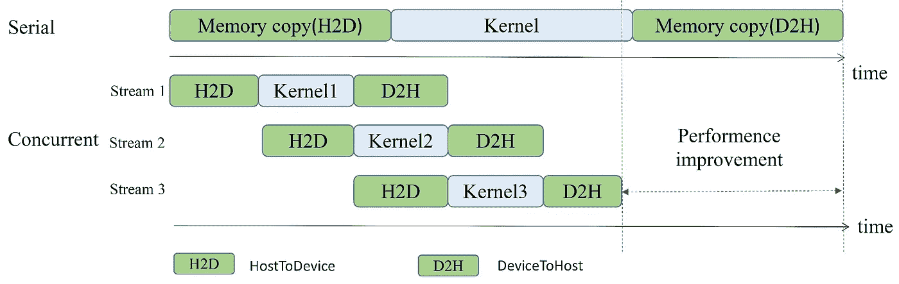
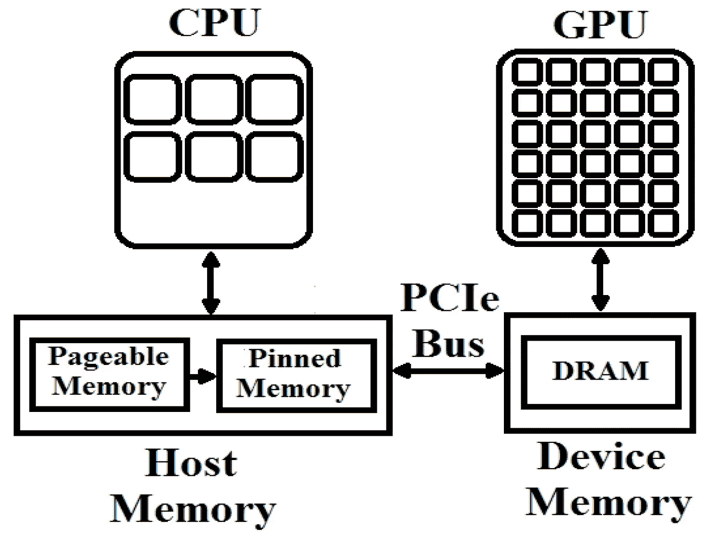

# CUDA by Numba 示例

> 原文：<https://towardsdatascience.com/cuda-by-numba-examples-7652412af1ee>

## 阅读本系列的第 3 部分，了解 Python 的 CUDA 编程中的流和事件

# 第 3 部分，共 4 部分:流和事件

# 介绍

在本系列的前两部分中([第一部分在这里](/cuda-by-numba-examples-1-4-e0d06651612f)，以及[第二部分在这里](/cuda-by-numba-examples-215c0d285088)，我们学习了如何用 GPU 编程来执行简单的任务，比如令人尴尬的并行任务、使用共享内存的缩减以及设备功能。我们还了解了如何对主机的函数计时——以及为什么这可能不是对代码计时的最佳方式。


图 3.0。运行[稳定扩散](https://replicate.com/stability-ai/stable-diffusion)与“湾流多彩空间平静”。学分:在 CreativeML Open RAIL-M 许可下拥有作品。

# 在本教程中

为了提高我们的计时能力，我们将介绍 CUDA 事件以及如何使用它们。但是在我们深入研究之前，我们将讨论 CUDA 流以及为什么它们很重要。

[点击这里在 Google colab 中抓取代码。](https://colab.research.google.com/drive/1iRUQUiHUVdl3jlKzKucxQHQdDPElPb3M?usp=sharing)

本教程后面还有一个部分:[第四部分](/cuda-by-numba-examples-c583474124b0)。

# 入门指南

导入和加载库，确保你有一个 GPU。

# 流

当我们从主机启动内核时，它的执行会在 GPU 中排队，只要 GPU 完成了之前启动的所有任务，就会执行这个任务。

用户在设备中启动的许多任务可能依赖于之前的任务，“将它们放在同一个队列中”是有意义的。例如，如果您正在将数据异步复制到 GPU，以便用某个内核处理它，则该副本必须在内核运行之前完成。

但是，如果有两个相互独立的内核，将它们放在同一个队列中有意义吗？大概不会！对于这些情况，CUDA 有*个流*。您可以将流视为独立的队列，它们彼此独立运行。它们也可以并发运行，即同时运行。当运行许多独立的任务时，这可以大大加快总运行时间。



图 3.1。使用不同的流可以允许并发执行，从而提高运行时间。演职员表:[张等 2021](https://www.mdpi.com/1045598) (CC BY 4.0)。

## Numba CUDA 中的流语义

我们将把到目前为止学到的两个任务进行排队，以创建一个规范化管道。给定一个(主机)数组`a`，我们将用它的规范化版本覆盖它:

a ← a / ∑a[i]

为此，我们将使用三个内核。第一个内核`partial_reduce`将是我们对第 2 部分的部分缩减。它将返回一个`threads_per_block`大小的数组，我们将把它传递给另一个内核`single_thread_sum`，后者将进一步把它简化为一个单独的数组(大小为 1)。这个内核将在一个单独的块上用一个单独的线程运行。最后，我们将使用`divide_by`就地除出原始数组，但我们之前计算的总和。所有这些操作都将在 GPU 中进行，并且应该一个接一个地运行。

当内核调用和其他操作没有流时，它们在默认流中运行。默认流是一个特殊的流，其行为取决于运行的是[传统流还是每线程流](https://docs.nvidia.com/cuda/cuda-runtime-api/stream-sync-behavior.html)。对我们来说，如果您想要实现并发，您应该在非默认流中运行任务，这样说就足够了。让我们来看看如何为内核启动、阵列拷贝和阵列创建拷贝等操作实现这一点。

在我们真正谈论流之前，我们需要谈论房间里的大象:`cuda.pinned`。这个上下文管理器创建了一种特殊类型的内存，称为*页面锁定*或*固定*内存，CUDA 在将内存从主机转移到设备时会从中受益。

驻留在主机 RAM 中的内存可以随时被 [*分页*](https://en.wikipedia.org/wiki/Memory_paging) ，即操作系统可以偷偷将对象从 RAM 移动到硬盘。这样做是为了将不常用的对象移到较慢的内存位置，从而将快速 RAM 内存留给更急需的对象。对我们来说重要的是，CUDA 不允许从可分页对象到 GPU 的异步传输。这样做是为了防止持续不断的非常慢的传输:磁盘(分页)→ RAM → GPU。

为了异步传输数据，我们必须确保数据*总是*在 RAM 中，通过某种方式防止操作系统偷偷把它藏在磁盘的某个地方。这就是内存锁定发挥作用的地方，它创建了一个上下文，在这个上下文中，参数将被“页面锁定”，也就是说，被强制放在 RAM 中。参见图 3.2。



图 3.2。可分页内存与固定(页面锁定)内存。演职员表:[里兹维等人 2017](https://www.mdpi.com/215954) (CC BY 4.0)。

从那时起，代码就非常简单了。创建了一个流，之后它将被传递给我们想要在该流上操作的每个 CUDA 函数。重要的是，Numba CUDA 内核配置(方括号)要求流位于第三个参数中，在块维度大小之后。

***警告:*** *一般来说，将流传递给 Numba CUDA API 函数并不会改变它的行为，只会改变它运行所在的流。一个例外是从设备到主机的拷贝。当调用* `*device_array.copy_to_host()*` *(无参数)时，复制同步发生。调用* `*device_array.copy_to_host(stream=stream)*` *(带流)时，如果* `*device_array*` *没有被钉住，复制会同步发生。仅当* `***device_array***` ***被钉住并且流被传递*** *时，复制才会* ***异步发生。***

***INFO:****Numba 提供了一个有用的上下文管理器，可以将所有操作放入其上下文中；退出上下文时，操作将被同步，包括内存传输。例 3.1 也可以写成:*

```
with cuda.pinned(a):
    stream = cuda.stream()
    with stream.auto_synchronize():
        dev_a = cuda.to_device(a, stream=stream)
        dev_a_reduce = cuda.device_array((blocks_per_grid,), dtype=dev_a.dtype, stream=stream)
        dev_a_sum = cuda.device_array((1,), dtype=dev_a.dtype, stream=stream)
        partial_reduce[blocks_per_grid, threads_per_block, stream](dev_a, dev_a_reduce)
        single_thread_sum[1, 1, stream](dev_a_reduce, dev_a_sum)
        divide_by[blocks_per_grid, threads_per_block, stream](dev_a, dev_a_sum)
        dev_a.copy_to_host(a, stream=stream)
```

# 将独立内核与流解耦

假设我们想要规格化不是一个数组，而是多个数组。对单独数组进行规范化的操作是完全相互独立的。因此，GPU 等到一个规范化结束后再开始下一个规范化是没有意义的。因此，我们应该将这些任务分成不同的流程。

让我们看一个规范化 10 个数组的例子——每个数组都使用自己的流。

现在让我们来比较一下单流。

但是哪个更快呢？当运行这些例子时，当使用多个流时，我没有获得一致的总时间改进。这可能有很多原因。例如，对于并发运行的流，本地内存中必须有足够的空间。另外，我们是从 CPU 计时的。虽然很难知道本地内存中是否有足够的空间，但从 GPU 进行计时相对容易。让我们学习如何！

***INFO:****Nvidia 提供了几个调试 CUDA 的工具，包括调试 CUDA 流。查看* [*Nsight 系统*](https://developer.nvidia.com/nsight-systems) *了解更多信息。*

# 事件

来自 CPU 的计时代码的一个问题是，它将包括比 GPU 更多的操作。

谢天谢地，有可能用 CUDA 直接从 GPU 计时*事件*。事件只是一个时间寄存器，记录了 GPU 中发生的事情。在某种程度上，它类似于`time.time`和`time.perf_counter`，与它们不同的是，我们需要处理这样一个事实，即当我们从 CPU 编程时，我们想要从 GPU 计时事件。

因此，除了创建时间戳(“记录”事件)，我们还需要确保事件在访问其值之前与 CPU 同步。让我们来看一个简单的例子。

## 为内核执行计时的事件

计时 GPU 操作的一个有用方法是使用上下文管理器:

## 计时流的事件

在本系列文章的最后，我们将使用 streams 来更好、更准确地了解我们的示例是否受益于 streams。

# 结论

CUDA 关注的是性能。在本教程中，您学习了如何使用*事件*来精确测量内核的执行时间，这种方法可以用来分析您的代码。您还了解了*流*以及如何使用它们让您的 GPU 保持忙碌，以及*固定*或*映射数组*，以及它们如何改善内存访问。