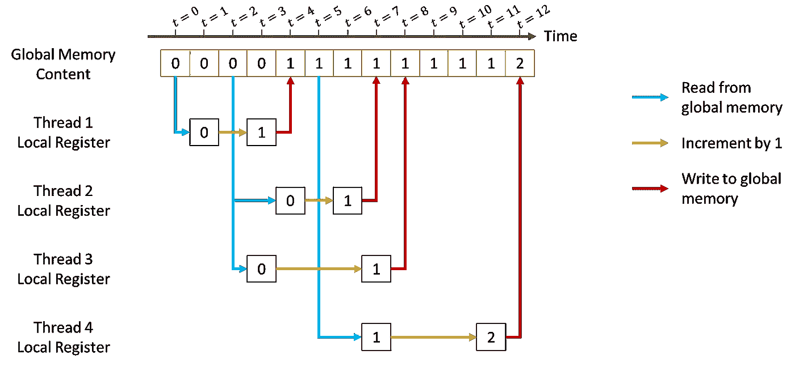
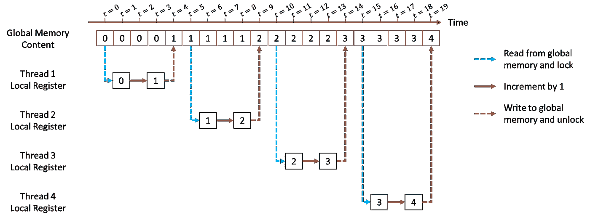
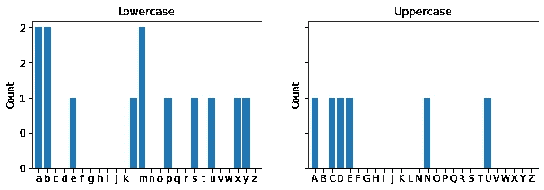
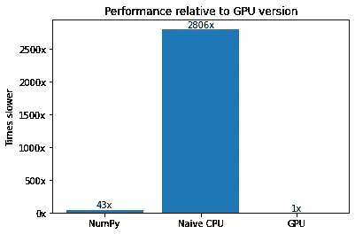
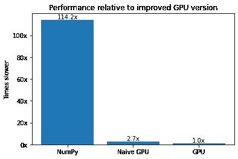
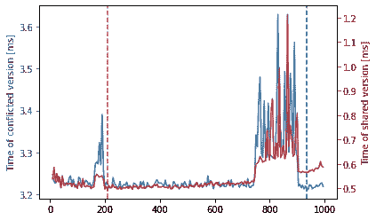

# Numba 的 CUDA 示例:原子和互斥

> 原文：<https://towardsdatascience.com/cuda-by-numba-examples-c583474124b0>

## 本系列的第 4 部分总结了使用 Python 从头开始学习 CUDA 编程的旅程

# 介绍

在本系列的前三期中([第 1 部分这里](/cuda-by-numba-examples-1-4-e0d06651612f)、[第 2 部分这里](/cuda-by-numba-examples-215c0d285088)和第 3 部分)，我们已经了解了 CUDA 开发的大部分基础知识，例如启动内核来执行令人尴尬的并行任务、利用共享内存来执行快速缩减、将可重用逻辑封装为设备功能，以及如何使用事件和流来组织和控制内核执行。


图 3.0。运行[稳定扩散](https://replicate.com/stability-ai/stable-diffusion)以“大历风格的原子心妈妈专辑封面”。学分:在 CreativeML Open RAIL-M 许可下拥有作品。

# 在本教程中

在本系列的最后一部分中，我们将讨论原子指令，它将允许我们从多个线程安全地操作同一个内存。我们还将学习如何利用这些操作来创建一个 [*互斥体*](https://en.wikipedia.org/wiki/Lock_(computer_science)) ，这是一种允许我们“锁定”某个资源的编码模式，因此它一次只能被一个线程使用。

[点击此处获取 Google colab 中的代码。](https://colab.research.google.com/drive/1Eq1Xyuq8hJ440ma_9OBrEVdGm3bIyigt?usp=sharing)

# 入门指南

导入和加载库，确保你有一个 GPU。

# 原子学

GPU 编程完全基于尽可能并行化相同的指令。对于许多“令人尴尬的并行”任务，线程不需要协作或使用其他线程使用的资源。其他模式，比如 reductions，通过算法的设计来确保相同的资源只被线程的子集使用。在这些情况下，我们通过使用`syncthreads`来确保所有其他线程保持最新。

在某些情况下，许多线程必须读写同一个数组。当试图同时执行读取或写入时，这可能会导致问题。假设我们有一个将单个值递增 1 的内核。

当我们用一个线程块启动这个内核时，我们将在输入数组中获得一个值 1。

现在，当我们启动 10 个 16 线程的块时会发生什么？我们将 10 × 16 × 1 的总数加到同一个存储元素上，因此我们应该希望得到存储在`dev_val`中的值 160。对吗？

事实上，我们不太可能在`dev_val`达到 160。为什么？因为线程是同时读写同一个内存变量的！

下面是当四个线程试图从同一个全局内存中读取和写入时可能发生的情况的示意图。线程 1–3 在不同的时间(分别为 t=0、2、2)从全局寄存器读取相同的值 0。它们都递增 1，并在 t=4、7 和 8 时写回全局内存。在 t=5 时，线程 4 的启动比其他线程稍晚一些。此时，线程 1 已经写入全局内存，因此线程 4 读取 1 的值。它最终会在 t=12 时将全局变量改写为 2。



图 4.1。几个线程试图从同一个全局内存中读写可能会导致[竞争情况](https://en.wikipedia.org/wiki/Race_condition#Computing)。学分:自己的工作。



图 4.2。当线程对内容进行操作时，资源被锁定读/写，我们确保每个线程在读取时获得更新的值，并且它的写入被其他线程看到。原子操作通常较慢。学分:自己的作品。

如果我们想得到我们最初期望的结果(如图 4.2 所示)，我们应该用非原子加法运算代替原子运算。原子操作将确保一次由一个单独的线程完成对任何内存的读/写。让我们多谈谈他们。

# 原子加法:计算直方图

为了更好地理解在哪里以及如何使用原子，我们将使用直方图计算。假设一个人想计算字母表中的每个字母在某个文本中有多少个。实现这一点的简单算法是创建 26 个“桶”，每个桶对应于英语字母表中的一个字母。然后，我们将遍历文本中的字母，每当我们遇到“a”时，我们将第一个桶递增 1，每当我们遇到“b”时，我们将第二个桶递增 1，以此类推。

在标准 Python 中，这些“桶”可以是字典，每个都将一个字母链接到一个数字。由于我们喜欢在数组上操作 GPU 编程，我们就用数组来代替。我们将存储所有 128 个 [ASCII](https://en.wikipedia.org/wiki/ASCII) 字符，而不是存储 26 个字母。

在此之前，我们需要将字符串转换为“数字”数组。在这种情况下，将 UTF-8 字符串转换为`uint8`数据类型是有意义的。

请注意，小写和大写字母有不同的代码。因此，我们将使用几个实用函数来只选择小写字母或大写字母。

此外，Numpy 已经提供了一个直方图函数，我们将使用它来验证我们的结果并比较运行时间。



“Numba 示例”的 CUDA 直方图。学分:自己的工作。

让我们编写自己的 CPU 版本的函数来理解其中的机制。

由于每个 ASCII 字符都映射到 128 元素数组中的一个 bin，所以我们需要做的就是找到它的 bin 并递增 1，只要该 bin 在 0 和 127(包括)之间。

我们已经准备好了我们的第一个 GPU 版本。

酷！所以至少我们的功能在起作用。内核非常简单，与串行版本具有相同的结构。它从标准的 1D 网格步长循环结构开始，与串行版本不同，它使用原子加法。Numba 中的原子 add 有三个参数:将被递增的数组(`histo`)、将看到 incremenet 的数组位置(`arr[iarr]`，它相当于串行版本中的`char`)，最后是`histo[arr[iarr]]`将被递增的值(即本例中的 1)。

现在，让我们加大赌注，将其应用于更大的数据集。

我们将处理大约 570 万个字符。让我们运行并记录到目前为止的三个版本。



学分:自己的工作。

以我们的 GPU 版本为基准，我们看到 NumPy 版本至少慢 40 倍，而我们的 CPU 版本慢数千倍。我们可以在几毫秒内处理这个 570 万字符的数据集，而我们简单的 CPU 解决方案需要 10 秒以上。这意味着我们有可能在几秒钟内处理 200 亿个字符的数据集(如果我们有一个超过 20 Gb RAM 的 GPU)，而在我们最慢的版本中，这将需要一个多小时。所以我们已经做得很好了！

我们能改进它吗？好了，让我们再来看看这个内核的内存访问模式。

```
...
for iarr in range(i, arr.size, threads_per_grid):
    if arr[iarr] < 128:
        cuda.atomic.add(histo, arr[iarr], 1)
```

`histo`是一个位于 GPU 全局内存中的 128 元素数组。在任一点启动的每个线程都试图访问该数组的某个元素(即元素`arr[iarr]`)。因此，在任何时候，我们都有大约`threads_per_block * blocks_per_grid` = 128 × 32 × 80 = 327，680 个线程试图访问 128 个元素。因此，我们平均有大约 32 × 80 = 2，560 个线程竞争同一个全局内存地址。

为了减轻这种情况，我们在共享存储器阵列中计算局部直方图。这是因为

1.  共享阵列位于芯片上，因此读/写速度更快
2.  共享数组对于每个线程块来说都是本地的，因此较少的线程可以访问并因此竞争它的资源。

***INFO:*** *我们的计算假设字符是均匀分布的。要小心，像自然数据集这样的假设可能不符合它们。例如，自然语言文本中的大多数字符都是小写字母，而不是平均 2560 个线程竞争，我们将有 128×32×80÷26≈12603 个线程竞争，这就有更多的问题了！*

之前我们有 2，560 个线程争用同一个内存，现在我们有 2，560 ÷ 128 = 20 个线程。在核的末尾，我们需要对所有的局部结果求和。由于有 32 × 80 = 2，560 个块，这意味着有 2，560 个块在争用全局内存。然而，我们确保每个线程只做一次，而以前我们必须这样做，直到我们用尽了输入数组的所有元素。

让我们看看这个新版本与以前的版本相比如何！



学分:自己的工作。

因此，这比原始版本提高了约 3 倍！

我们将块的数量设置为 32×SMs 数量的倍数，就像上一个教程中建议的那样。但是哪个倍数呢？让我们计时吧！



学分:自己的工作。

两件事:首先，我们需要两个轴来显示数据，因为原始版本(蓝色)要慢得多。第二，竖线显示对于某个功能有多少条短信是最佳的。最后，尽管简单版本不会因为添加了更多的块而变得更差，但共享版本却不是这样。要理解这是为什么，请记住共享数组版本有两个部分

*   第一部分很少有线程竞争相同的(快速)内存(共享数组部分)。
*   第二部分是许多线程竞争同一个(慢)内存(最后的原子加法)。

随着更多块的添加，在简单版本中，它很快就遇到了瓶颈，而在共享阵列版本中，竞争在第一部分保持不变，但在第二部分*增加了*。另一方面，太少的块不会产生足够的并行化(对于任一版本)。上图找到了这两个极端之间的“最佳点”。

# 用互斥锁锁定资源

在前面的例子中，我们使用了带有整数值的原子加法操作来锁定某些资源，并确保一次只有一个线程控制它们。加法不是唯一的原子操作，它不需要应用于整数值。Numba CUDA 支持对整数和浮点数的各种原子操作。但是曾几何时(CUDA compute 1.x)，浮点原子是不存在的。因此，如果我们想用原子为浮点写一个归约，我们就需要另一个结构。

虽然现在原子确实支持浮点，但允许我们应用任意原子操作的“互斥”代码模式在某些情况下仍然有用。

互斥，也就是互斥，是一种向试图访问它的其他线程发出某种资源可用或不可用的信号的方式。互斥体可以用一个变量来创建，这个变量有两个值:

*   **0** : 🟢绿灯，继续使用某个内存/资源
*   **1** :🔴红灯，停止，不要试图使用/访问某个内存/资源

要锁定内存，应该向互斥体写入 1，要解锁，应该写入 0。但是需要注意的是，如果有人(自动地)写互斥体，其他线程可能正在访问该资源，至少会产生错误的值，甚至更糟，会产生死锁。另一个问题是互斥体只有在之前没有被锁定的情况下才能被锁定。因此，在写入 1(锁定)之前，我们需要读取互斥体并确保它是 0(未锁定)。CUDA 提供了一种特殊的操作来以原子方式完成这两件事:atomicCAS。在 Numba CUDA 中，它的名称更加明确:

```
cuda.atomic.compare_and_swap(array, old, val)
```

如果`array[0]`处的当前值等于`old`(这是“比较”部分)，该函数只会自动将`val`分配给`array[0]`(这是“交换”部分)；否则它现在将交换。此外，它自动返回`array[0]`的当前值。为了锁定一个互斥体，我们可以用

```
cuda.atomic.compare_and_swap(mutex, 0, 1)
```

由此我们将仅在锁被解锁(0)时分配锁(1)。上面这行代码的一个问题是，如果线程到达它并读取 1 (locked ),它就会继续执行，这可能不是我们想要的。理想情况下，我们希望线程停止前进，直到我们可以锁定互斥体。因此，我们采取以下措施:

```
while cuda.atomic.compare_and_swap(mutex, 0, 1) != 0:
    pass
```

在这种情况下，线程将一直存在，直到它可以正确地锁定线程。假设线程到达了一个先前锁定的互斥体。它的当前值是 1。所以我们首先注意到从`curr = 1 != old = 0`开始`compare_and_swap`将*而不是*能够锁定它。它也不会退出`while`，因为当前值 1 不同于 0(`while`条件)。它将保持在这个循环中，直到最终能够读取当前值为 0 的未锁定互斥体。在这种情况下，从`curr = 0 == old = 0`开始，它也能够将 1 分配给互斥体。

要解锁，我们只需要自动给互斥体赋值一个 0。我们将使用

```
cuda.atomic.exch(array, idx, val)
```

它简单地自动赋值`array[idx] = val`，返回旧值`array[idx]`(自动加载)。因为我们不会使用这个函数的返回值，在这种情况下，你可以把它看作一个原子赋值(也就是说，鉴于`atomic_add(array, idx, val)`对`array[idx] += val`的赋值就像`exch(array, idx, val)`对`array[idx] = val`的赋值)。

现在我们有了锁定和解锁机制，让我们重试原子的“添加一个”,但是使用互斥体代替。

上面的代码相当简单，我们有一个内核，它锁定线程的执行，直到它们自己可以得到一个解锁的互斥体。此时，他们将更新`x[0]`的值并解锁互斥体。在任何时候`x[0]`都不会被一个以上的线程读取或写入，这实现了原子性！

上面的代码中只有一个细节我们没有涉及，那就是`cuda.threadfence()`的使用。这个例子并不要求这样，但是要确保锁定和解锁机制的正确性。我们很快就会知道为什么了！

# 互斥点积

在本系列的第 2 部分[中，我们学习了如何在 GPU 中应用缩减。我们用它们来计算一个数组的和。我们代码的一个不优雅的方面是我们把一些求和留给了 CPU。我们当时缺乏的是应用原子操作的能力。](/cuda-by-numba-examples-215c0d285088)

我们将这个例子重新解释为点积，但是这一次将求和进行到底。这意味着我们不会返回“部分”点积，而是通过使用互斥体在 GPU 中使用原子求和。让我们首先将 reduce 重新解释为一个点积:

一切都检查过了！

在我们结束之前，我答应我们会再来一次。来自 CUDA“圣经”( [B.5 .内存栅栏函数](https://docs.nvidia.com/cuda/cuda-c-programming-guide/index.html#memory-fence-functions) ): `__threadfence()` *确保在调用* `__threadfence()` *之后，调用线程对所有内存的写操作不会被设备中的任何线程观察到，因为在调用* `__threadfence()` *之前，调用线程对所有内存的任何写操作都会发生。*

如果我们在解锁互斥锁之前忽略线程防护，即使使用原子操作，我们也可能会读取陈旧的信息*，因为内存可能还没有被其他线程写入。同样，在解锁之前，我们必须确保更新内存引用。所有这些都不是显而易见的，而且是在许多年前在[阿尔格拉夫等人 2015](https://johnwickerson.github.io/papers/gpuconcurrency.pdf) 首次提出的。最终，这个补丁在 CUDA 的勘误表中发布了，这个例子启发了这一系列的教程。*

# 结论

在本系列的最后一个教程中，您学习了如何使用*原子*操作，这是协调线程的一个基本要素。您还学习了*互斥*模式，它利用原子来创建自定义区域，一次只有一个线程可以访问这些区域。

# 收场白

在本系列的四个部分中，我们已经介绍了足够多的内容，可以让您在各种常见的情况下使用 Numba CUDA。这些教程并不详尽，它们旨在介绍并激发读者对 CUDA 编程的兴趣。

我们还没有涉及的一些主题有:动态并行性(让内核启动内核)、复杂同步(例如 warp-level、协作组)、复杂内存防护(我们在上面提到过)、多 GPU、纹理和许多其他主题。其中一些目前还不被 Numba CUDA 支持(从 0.56 版本开始)，其中一些对于入门教程来说被认为是太高级的技术。

为了进一步提高你的 CUDA 技能，强烈推荐 [CUDA C++编程指南](https://docs.nvidia.com/cuda/cuda-c-programming-guide/index.html)，以及 [Nvidia 博客文章](https://developer.nvidia.com/blog/?tags=cuda&categories=)。

在 Python 生态系统中，重要的是要强调 Numba 之外的许多解决方案可以提升 GPU。而且它们大多是互操作的，所以不需要只选择一个。 [PyCUDA](https://documen.tician.de/pycuda/) 、 [CUDA Python](https://nvidia.github.io/cuda-python/) 、 [RAPIDS](https://rapids.ai/) 、 [PyOptix](https://github.com/ozen/PyOptiX) 、 [CuPy](https://cupy.dev/) 和 [PyTorch](https://pytorch.org/) 是正在积极开发中的库的例子。