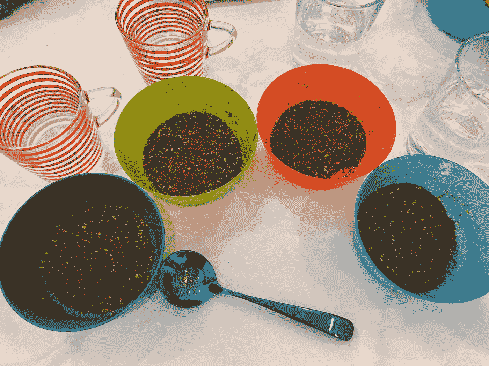
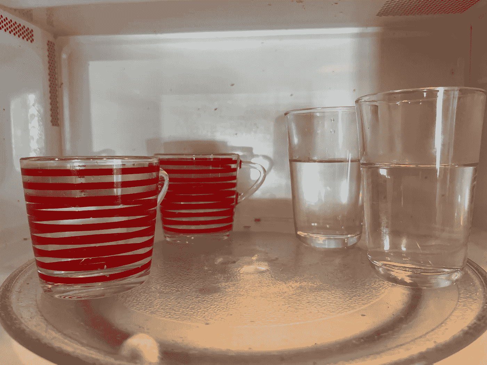
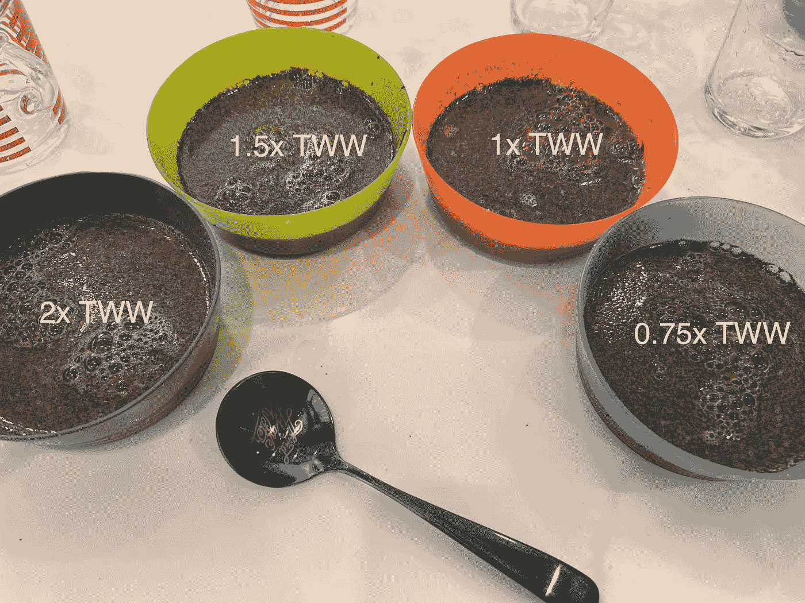
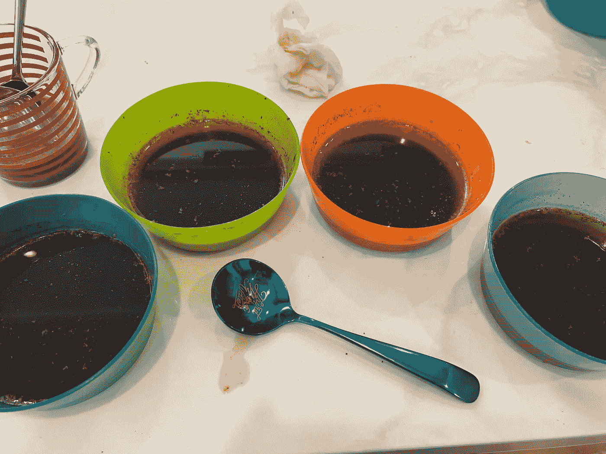

# 用不同的水冲浓缩咖啡

> 原文：<https://towardsdatascience.com/cupping-different-water-for-espresso-ec552f7640fa>

## 咖啡数据科学

## 第三波水品鉴

[第三波水](https://thirdwavewater.com/)给我发了几包水测试，我就先从咖啡品鉴开始。我想知道不同的浓度是否会改变味道。我通常需要在食物中加入更多的盐，所以我想也许更浓的水溶液会更有吸引力。然而，我没有注意到和拔火罐有什么不同。

我从一种我很熟悉的咖啡开始，我设置了四种浓度。我用了 2 倍、1.5 倍、1 倍和 0.75 倍包装的浓缩水。我主要是按照 SCA 拔火罐配 8.25g 咖啡和 150ml 热水。

从碗左到右:2x，1.5x，1x，0.75x .所有图片由作者提供。

然后，我用微波炉将水烧开，这样有助于减少不同咖啡浸泡时间的差异。

然后我倒了水。

当咖啡冷却时，我没有看到任何视觉差异。

当我剥掉外壳后，我没有闻到或看到任何不同。

当咖啡变凉时，我尝了很多次，我找不到质地、甜味、酸味或苦味的区别。我没有接受过拔火罐的训练，有经验的品尝者可能会发现不同之处。

我希望这次品尝会在更大的浓缩咖啡实验之前给我一个路标，但这个实验仍然给出了品尝水浓度差异的难度的有趣信息。

如果你愿意，可以在[推特](https://mobile.twitter.com/espressofun?source=post_page---------------------------)、 [YouTube](https://m.youtube.com/channel/UClgcmAtBMTmVVGANjtntXTw?source=post_page---------------------------) 和 [Instagram](https://www.instagram.com/espressofun/) 上关注我，我会在那里发布不同机器上的浓缩咖啡照片和浓缩咖啡相关的视频。你也可以在 [LinkedIn](https://www.linkedin.com/in/dr-robert-mckeon-aloe-01581595) 上找到我。也可以在[中](https://towardsdatascience.com/@rmckeon/follow)关注我，在[订阅](https://rmckeon.medium.com/subscribe)。

# [我的进一步阅读](https://rmckeon.medium.com/story-collection-splash-page-e15025710347):

[我未来的书](https://www.kickstarter.com/projects/espressofun/engineering-better-espresso-data-driven-coffee)

[我的链接](https://rmckeon.medium.com/my-links-5de9eb69c26b?source=your_stories_page----------------------------------------)

[浓缩咖啡系列文章](https://rmckeon.medium.com/a-collection-of-espresso-articles-de8a3abf9917?postPublishedType=repub)

[工作和学校故事集](https://rmckeon.medium.com/a-collection-of-work-and-school-stories-6b7ca5a58318?source=your_stories_page-------------------------------------)