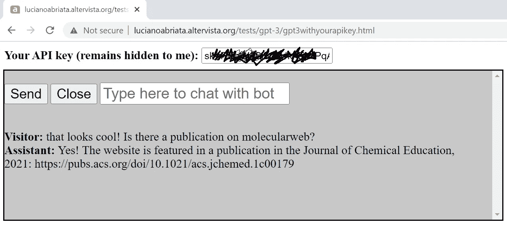
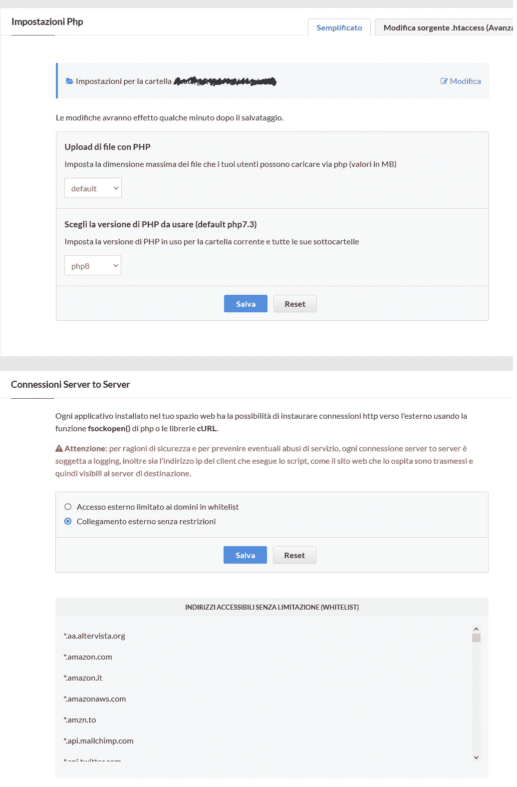
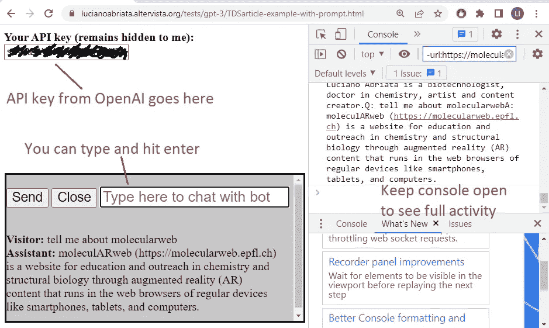
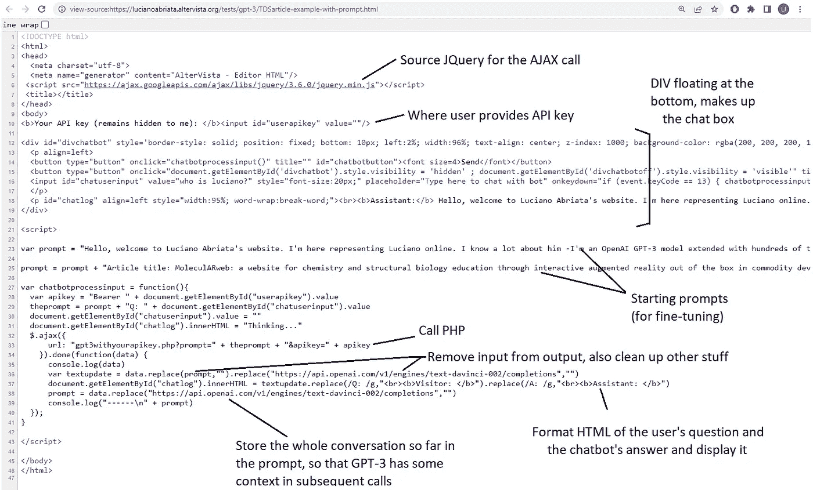

# 用非常简单的代码为你的网站构建定制的基于 GPT 3 的聊天机器人

> 原文：<https://towardsdatascience.com/custom-informed-gpt-3-models-for-your-website-with-very-simple-code-47134b25620b>

## 当你建立一个基于 GPT 3 的在线聊天机器人时，学习 GPT 3、PHP 和 JavaScript，它专门针对你教授的给定主题

## **内容**

1.  **简介**
2.  **GPT 3 号搭载的惊艳聊天机器人**
3.  用简单的 PHP 和 JavaScript 将 GPT-3 整合到你的网站中
4.  **以 OpenAI** 提供的形式教授你的模型它不知道的事实数据
5.  **一个完整的网络应用程序，用户可以使用自己的 API 密钥与你定制的 GPT 3 聊天机器人进行交互**

# 1.介绍

由 OpenAI 开发的 GPT-3 是一个专门从事语言处理的机器学习模型。给定一个输入文本，GPT-3 输出新的文本。根据输入和使用的 GPT-3 的确切风格，输出文本将符合一项任务，例如回答输入中提出的问题，或用附加数据完成输入，或将输入从一种语言翻译成另一种语言，或总结输入，或推断情感，甚至更疯狂的事情，例如根据输入中给出的指示编写一段计算机代码。在许多其他应用中！

经过数十亿参数和大量文本语料库的训练，GPT-3 是最大的可用模型之一。但是**在所有的语言处理模型中，我发现 GPT-3 特别有吸引力，因为**它有以下特点:

*   它在线运行，所以我不需要下载任何东西到我想使用它的电脑或服务器上。我可以通过在源代码中包含对 GPT-3 API 的调用来使用它。
*   以上包括编写调用 GPT-3 API 的 web 代码的可能性，因此您可以在您的 web 页面中包含该工具的强大功能。我们将在这里看到如何用简单的 PHP 和 JavaScript 实现这一点。
*   尽管没有掌握可执行程序(因为它都在线运行)，GPT-3 是非常可定制的。这允许你编写聊天机器人，它们的行为方式你可以调整，甚至更有趣，它们“知道”你教它们的特定主题。事实上，我们将在这里看到两种可能的方法之一来训练您的 GPT-3 模型*来实现您的目标。*
*   GPT-3 非常容易使用，例如在 Python 中或者在 JavaScript 和 PHP 中。

我最近测试了 GPT 3 号在协助科学教育和研究方面的能力和潜力，它充当了一个随时可用的机器人，可以回答学生或研究人员的问题。这些测试的一部分包括教 GPT-3 一些数据，然后人们可以就这些数据提问。

结果令人印象深刻，尽管有许多限制，主要是因为该模型当然并不真正理解它所读和写的内容…它只是一个统计模型，综合了语法上正确但事实上可能准确也可能不准确的文本。您可以在最近的文章中了解更多关于我所做的这些测试的信息:

</gpt-3-like-models-with-extended-training-could-be-the-future-24-7-tutors-for-biology-students-904d2ae7986a>    </testing-gpt-3-on-elementary-physics-unveils-some-important-problems-9d2a2e120280>  

重要的是，正如我在一些例子[中展示的，特别是在这个例子](/gpt-3-like-models-with-extended-training-could-be-the-future-24-7-tutors-for-biology-students-904d2ae7986a)中，通过**正确设置 GPT-3 的参数，并用*特别的*内容训练它，它被证明非常“聪明”，特别是对于使用关于事实主题的自然语言的信息检索。我们将在这里利用这一点来制作一个网页，它知道你教 GPT-3 的一个特定主题。**

</gpt-3-like-models-with-extended-training-could-be-the-future-24-7-tutors-for-biology-students-904d2ae7986a>  

> 通过正确设置 GPT-3 的参数，并用*特别的*内容对其进行训练，它被证明非常“聪明”，特别是对于使用自然语言对事实主题进行信息检索。我们将在这里利用这一点来制作一个网页，它知道你教 GPT-3 的一个特定主题。

# 2.GPT-3 允许的惊人聊天机器人

在本文中，我们将看到如何构建一个简单的聊天机器人，它知道你作为提示提供的特定主题。用户可以通过网页自然地与机器人聊天，问任何他们想要的。当问题涉及您告知聊天机器人的主题时，聊天机器人将根据该内容进行回复。最棒的是，你不需要以非常结构化的方式提问，因为你需要一个普通的问答匹配聊天机器人来理解你。相反，您可以用自然的方式检索信息。此外，这种反应取决于语境；例如，你可以谈论一个人的名字，然后用相应的冠词指代他或她。

举个例子，让我们比较一下普通的 GPT-3 聊天机器人在被问及我时的输出和 GPT-3 聊天机器人在被告知关于我和我的一些项目的简短简历时的输出。前者会编造一些东西，或者在最好的情况下不提供任何答案，而后者的答案会更准确，至少当你问它关于我提供的信息时。

让我先给你看这段与定制训练的 GPT-3 聊天机器人的简短对话。我用一种被 OpenAI 人称为“少量学习”的方法实现了这一点；它本质上是在提示问题(要发送给 GPT-3 API)之前加上一个包含相关信息的文本块。这不是很有效，因为它限制了您可以传递的信息量，还因为每次发送提示都会消耗很多令牌。但是极其简单实用。

你看到我的问题用粗体字；剩下的是聊天机器人的回答，我写了一些评论:

> **参观者:谁是卢西亚诺·阿布利亚塔？**
> 助理:Luciano Abriata 是生物技术专家、化学博士、艺术家和内容创作者。

这个答案是从提供的培训段落中摘录的。

> 参观者:他创造了什么？
> 助理:卢西亚诺创建了一个名为 moleculARweb 的网站，这是一个通过增强现实(AR)内容进行化学和结构生物学教育和外联的网站。

该信息是正确的，尽管在培训段落中提供了它，但它与文本中的任何部分都不匹配。GPT-3 可能对它进行了再加工，或者可能它已经知道了，因为我们的网站自 2020 年以来一直在线。

> 参观者:那看起来很酷！molecularweb 上有出版物吗？
> 助理:对！该网站被刊登在 2021 年的《化学教育杂志》上:[https://pubs.acs.org/doi/10.1021/acs.jchemed.1c00179](https://pubs.acs.org/doi/10.1021/acs.jchemed.1c00179)

完美，链接是正确的。这条信息是在培训段落中提供的，不完全一样，但它得到了它。



我的*特设*训练 GPT-3 模型，热情地分享我们关于使用增强现实的化学教育网站的出版物。作者图。

> 参观者:我需要什么特殊的硬件来使用分子网吗？
> 助理:不需要，不需要什么特殊的硬件。你只需要一个网络浏览器和一个带摄像头的设备，比如智能手机、平板电脑或电脑。

同样，聊天机器人提供了正确的信息，同样，培训中并没有以这种方式给出，但信息是存在的。

> 参观者:你的意思是我可以在手机上运行它？
> 助理:是的！你可以在手机、平板电脑或电脑上运行它。参观者:我如何使用它？
> 助理:你可以登录网站，按照说明使用。

这里的答案是正确的，但奇怪的是看到聊天机器人增加了第二个问题！我很惊讶，这个问题在真实的对话中是很自然的…到这个时候，用户已经对网站有了相当多的了解，所以他想使用它是很自然的。

> 访问者:网址是什么？
> 助手:网址为[https://molecular web . epfl . ch](https://molecularweb.epfl.ch)

很好，培训中提供了这些数据，但不完全是这样的。甚至没有提到网址，但 GPT-3“明白”用户在找什么。

> 参观者:太好了，谢谢。我会尝试一下。

(没有回答)

现在让我们看看，如果我们向一个未经训练的 GPT-3 聊天机器人问同样的问题会发生什么。所有的参数和上面的完全一样，除了我在这里没有应用任何的少射学习程序；也就是说，我没有向提示添加任何额外的数据。

> 参观者:谁是卢西亚诺·阿布利亚塔？

(没有回答)

但如果我问它一个更有名的卢西亚诺，它确实知道！

> 参观者:参观者:谁是卢西亚诺·帕瓦罗蒂？助理:鲁契亚诺·帕瓦罗蒂是意大利歌剧男高音，也是一名成功的跨界歌手。他是有史以来商业上最成功的男高音之一。

让我们继续问:

> 参观者:你知道 moleculARweb 吗？助手:我不知道分子网。
> 
> 参观者:有没有利用增强现实进行化学教育的网站？助手:我不知道任何使用增强现实技术的化学教育网站。
> 
> 参观者:你知道谷歌吗？助理:是的，我知道谷歌。
> 
> 参观者:谷歌是什么？助理:谷歌是一家专注于互联网相关服务和产品的跨国科技公司。这些包括在线广告技术、搜索、云计算、软件和硬件。

我认为这足以看出我们的聊天机器人清楚地知道许多事情，事实上是标准 as-3 所知道的一切，但它只是不知道任何它从未见过的事情。

**继续阅读，了解如何在你自己的网页中插入你自己的助手，并对其进行微调，以了解任何给定的主题——例如关于你和你的工作，这样它就可以像秘书一样与你网站的访问者聊天。**

# 3.用简单的 PHP 和 JavaScript 将 GPT-3 整合到你的网站中

您首先需要一些东西:一个允许 PHP 和 JavaScript 的服务器、一个 API 密匙和一些您将耦合到 JavaScript 代码的 PHP 库。

## I)可以运行 PHP 并允许 JavaScript 代码的服务器

最简单的解决方案是使用宿主服务，该服务本身提供 PHP 运行时并允许 JavaScript。我用的是 Altervista，它的基本免费包已经两者都允许了！你甚至不需要安装 PHP！

但你确实需要激活它(截至 2022 年 3 月，这是一项免费功能)。我使用的是 PHP 版本 8，无限制地启用所有连接很重要(否则它不会连接到 OpenAI API)。



作者截图。

## ii)来自 OpenAI 的 API 密钥

大多数国家的人们都可以免费获得一个预先充值的 API 来试用这个系统。查看位于[https://beta.openai.com/signup](https://beta.openai.com/signup)的官方 OpenAI 网站

关键:不要泄露你的 API 密匙(无论是个人还是因为你把它暴露在你的 JavaScript 代码中！)因为它的使用会烧你的学分！

我在这里给出的例子要求用户输入他/她自己的密钥。web 应用程序将密钥传递给调用 GPT-3 API 的 PHP 包装器(注意，密钥不会被存储，所以可以放心尝试我的代码，没有任何风险！).

关于这一点的更多信息，请参阅本文的其余部分。

## iii)一个连接到 OpenAI 的 GPT-3 的 PHP 库，以及一种从你的网页的 HTML+JavaScript 代码使用这个库的方法

OpenAI 本身并不支持 PHP，但是有一个专门的开发人员社区，他们编写库来通过 PHP 调用 GPT-3 API(也可以从其他语言的代码中调用):

  

我尝试了几个可用的 PHP 库，决定选择这个:

<https://github.com/karamusluk/OpenAI-GPT-3-API-Wrapper-for-PHP-8/blob/master/OpenAI.php>  

但是我必须对名为 OpenAI.php 的主文件做一些修改。您可以在这里获得我使用的最终文件:

[http://lucianoabriata . alter vista . org/tests/GPT-3/open ai-PHP-library-as-used . txt](http://lucianoabriata.altervista.org/tests/gpt-3/OpenAI-PHP-library-as-used.txt)

我做了一些小的修改，需要使它工作。其中一个小的修改是允许以编程方式传递用户的 API 键，而不是固定的。通过这种方式，你的应用程序的用户不会从你的帐户中花费代币！不好的一面是，他们需要自己得到一把钥匙。一个中间的解决方案是让你自己的密钥像最初的 OpenAI.php 文件一样硬编码在 PHP 文件中，然后在用户使用你的应用时向他们收费。

您还需要另一个文件，它将您的 HTML/JavaScript 文件连接到调用 GPT-3 API 的核心 PHP 文件。这是一个简短的 PHP 文件，内容如下:

```
<?php
//Based on tutorials and scripts at:
// [https://github.com/karamusluk/OpenAI-GPT-3-API-Wrapper-for-PHP-8/blob/master/OpenAI.php](https://github.com/karamusluk/OpenAI-GPT-3-API-Wrapper-for-PHP-8/blob/master/OpenAI.php)
// [https://githubhelp.com/karamusluk/OpenAI-GPT-3-API-Wrapper-for-PHP-8](https://githubhelp.com/karamusluk/OpenAI-GPT-3-API-Wrapper-for-PHP-8)//Thanks to this for hints about connecting PHP and JavaScript:
// [https://stackoverflow.com/questions/15757750/how-can-i-call-php-functions-by-javascript](https://stackoverflow.com/questions/15757750/how-can-i-call-php-functions-by-javascript)require_once “./OpenAI-PHP-library-as-used.php”;$apikey = $_GET[“apikey”];$instance = new OpenAIownapikey($apikey);$prompt = $_GET[“prompt”];$instance->setDefaultEngine(“text-davinci-002”); // by default it is davinci$res = $instance->complete(
 $prompt,
 100,
 [
 “stop” => [“\n”],
 “temperature” => 0,
 “frequency_penalty” => 0,
 “presence_penalty” => 0,
 “max_tokens” => 100,
 “top_p” => 1
 ]
);echo $res;
?>
```

## 连接 PHP 和 JavaScript 在 OpenAI 上运行 GPT-3

您的 JavaScript 代码只需异步调用上面 PHP 文件的 ***complete*** 函数，该函数在一个 ***实例*** 对象上定义(在上面的 PHP 文件中),该对象携带您想要传递的文本提示和参数。

这是在 JavaScript 中进行异步调用的方法(使用 JQuery):

```
var chatbotprocessinput = function(){
 var apikey = “Bearer <API KEY>“
 var theprompt = “(define prompt)“
 $.ajax({
 url: “phpdescribedfileabove.php?prompt=” + theprompt + “&apikey=” + apikey
 }).done(function(data) {
 console.log(data) //data has the prompt plus GPT-3’s output
 });
}
```

如果您检查我在本文后面向您展示的示例的源代码，您会发现它有点复杂。那是因为我的 web app 清理了输出(在 ***数据*** )去掉了输入等东西；它还重新格式化文本，以粗体显示用户和聊天机器人的名称，并将整套输入和输出(随着用户与机器人聊天而增长)保存在一个内部变量中，以便 GPT-3 每次执行时都能获得有关对话的上下文。

# 4.以 OpenAI 提供的形式教授你的模型它不知道的事实数据

## 换句话说:为了更好地实现你的目标，教 GPT 3 号它需要知道什么

正如我上面所预料的，有两种主要的方法用*特别的*数据来“训练”你的 GPT-3 模型。一种，在这里使用，也在上面介绍过，叫做“少投学习”。少投学习非常简单:只要用几段相关信息来扩展你的提示(即 GPT-3 问题的输入)。

在我们上面看到的例子中(你可以玩这个，见下面的第 3 部分)，用户会问聊天机器人关于我的问题，因为它应该为我回答，我给了它两个段落:

> **第一段:**你好，欢迎来到卢西亚诺·阿布利亚塔的网站。我在这里代表卢西亚诺在线。我很了解他——我是一个开放的 GPT-3 模型，用卢西亚诺写的文字扩展。随意问任何问题。Luciano A. Abriata 博士是生物技术学家、化学博士、艺术家和内容创作者。在科学学科方面，Luciano 在结构生物学、生物物理学、蛋白质生物技术、通过增强和虚拟现实的分子可视化以及使用现代技术的科学教育的实验和计算方面拥有丰富的经验。卢西亚诺·阿布利亚塔 1981 年出生于阿根廷罗萨里奥。他在阿根廷学习生物技术和化学，然后移居瑞士，目前在瑞士洛桑联邦理工学院(EPFL)的两个实验室工作。他在 EPFL 的生物分子建模实验室和 EPFL 的蛋白质生产和结构核心实验室工作。他目前致力于基于网络的方法，以实现商品增强现实和虚拟现实工具，用于身临其境地查看和操纵分子结构。他还与多个团队合作研究分子建模、模拟和应用于生物系统的核磁共振(NMR)光谱。
> 
> **第二段:**文章标题:MoleculARweb:一个通过在商品设备中开箱即用的交互式增强现实进行化学和结构生物学教育的网站(化学教育杂志，2021:【https://pubs.acs.org/doi/10.1021/acs.jchemed.1c00179】T2)。文字:molecular web([https://molecular web . epfl . ch](https://molecularweb.epfl.ch))最初是一个通过增强现实(AR)内容进行化学和结构生物学教育和宣传的网站，这些内容在智能手机、平板电脑和电脑等常规设备的网络浏览器中运行。在这里，我们展示了 moleculARweb 的虚拟建模工具包(VMK)的两个版本，用户可以通过定制打印的立方体标记(VMK 2.0)或通过鼠标或触摸手势在模拟场景中移动(VMK 3.0)，在 3D AR 中构建和查看分子，并探索它们的机制。在模拟过程中，分子会经历视觉上逼真的扭曲、碰撞和氢键相互作用，用户可以手动打开和关闭它们，以探索它们的效果。此外，通过手动调整虚拟温度，用户可以加速构象转变或“冻结”特定的构象，以便在 3D 中仔细检查。甚至可以模拟一些相变和分离。我们在这里展示新的 VMKs 的这些和其他特征，将它们与普通化学、有机化学、生物化学和物理化学的概念的教学和自学的可能的具体应用联系起来；以及在研究中协助分子建模的小任务。最后，在一个简短的讨论部分，我们概述了未来化学教育和工作的“梦想工具”需要什么样的发展。"

每当用户向我的聊天机器人提问时，我的网页不只是发送问题，而是实际上将两段信息，加上之前的问题和答案，连接到新问题。是的，GPT-3 的输出是基于这些数据的，如果它在其中找到一些相关的内容(你仍然可以问它任何其他的事情，它可能仍然会回答)。

正如我前面提到的，通过“少量学习”来“训练”你的基于 GPT 3 的聊天机器人不是很有效，因为它限制了你可以传递的信息量，也因为它在你每次发送提示时都要消耗很多令牌。但是它非常简单和实用，正如您在上面的例子中看到的以及将在下面的第 3 节中看到的。

快速简单的少量学习的替代方法是执行 OpenAI 的人所说的“微调”。这是一个更稳定的过程，在此过程中，您只需训练您的 GPT-3 模型一次，然后将此训练存储在一个文件中以供以后使用。我还没有尝试过微调，但是你可以在这里查阅 OpenAI 的网站:

  

# 5.一个完整的网络应用程序，用户可以使用他们自己的 API 密钥与你定制的 GPT 3 聊天机器人进行交互

(如果你喜欢，也可以是你的 API 密匙，只要把它包含在你的 PHP 文件中，这样它就不会暴露出来——即使这样，注意你的用户会消耗你的信用。)

你可以很容易地编写一个 web 应用程序来实现一个基于 GPT 3 的聊天机器人。一旦从 OpenAI 获得 API 密钥，您也可以立即尝试我的示例。



作者图。

**少投学习的例子:**[http://lucianoabriata . alter vista . org/tests/GPT-3/TDSarticle-Example-with-prompt . html](http://lucianoabriata.altervista.org/tests/gpt-3/TDSarticle-example-with-prompt.html)

**没有少拍学习的例子:**[http://lucianabriata . alter vista . org/tests/GPT-3/TDSarticle-Example-without-prompt . html](http://lucianoabriata.altervista.org/tests/gpt-3/TDSarticle-example-without-prompt.html)

你可以

快速浏览一下代码:



作者截图。

# 额外收获:倡导网络编程

你注意到所有这些都是为网络准备的。事实上，本文是我提出的依赖于 web 编程的解决方案和未来工具的系列文章的一部分——从无缝的跨设备和跨操作系统兼容性开始。

以下是一些亮点，你可以查看我的个人资料:

</a-free-online-tool-for-principal-components-analysis-with-full-graphical-output-c9b3725b4f98>  </exquisite-hand-and-finger-tracking-in-web-browsers-with-mediapipes-machine-learning-models-2c4c2beee5df>  </obtaining-historical-and-real-time-crypto-data-with-very-simple-web-programming-7b481f153630>  </websites-for-statistics-and-data-analysis-on-every-device-ebf92bec3e53>  </live-display-of-cryptocurrency-data-in-a-vr-environment-on-the-web-af476376d018>  </the-definitive-procedure-for-aligning-two-sets-of-3d-points-with-the-kabsch-algorithm-a7ec2126c87e>  <https://pub.towardsai.net/read-public-messages-from-the-ethereum-network-with-simple-web-programming-70d8650e54e2>  

www.lucianoabriata.com*我写作并拍摄我广泛兴趣范围内的一切事物:自然、科学、技术、编程等等。* [***成为媒介会员***](https://lucianosphere.medium.com/membership) *访问其所有故事(我免费获得小额收入的平台的附属链接)和* [***订阅获取我的新故事***](https://lucianosphere.medium.com/subscribe) ***通过电子邮件*** *。到* ***咨询关于小职位*** *查看我的* [***服务页面这里***](https://lucianoabriata.altervista.org/services/index.html) *。你可以* [***这里联系我***](https://lucianoabriata.altervista.org/office/contact.html) ***。***