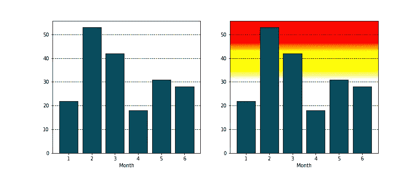
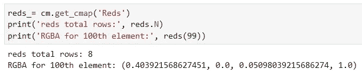
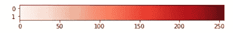
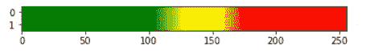
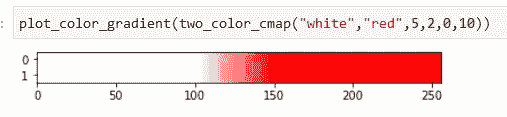
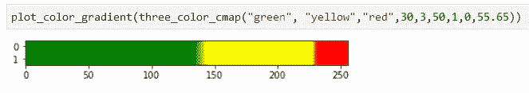
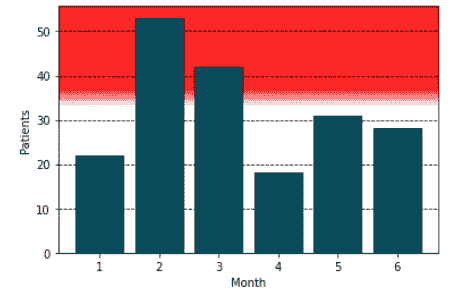
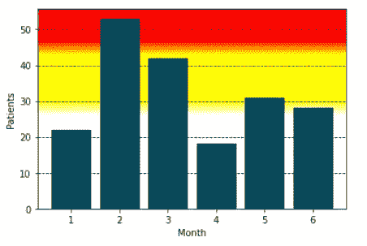
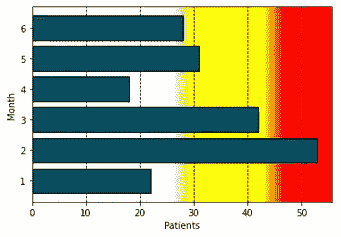
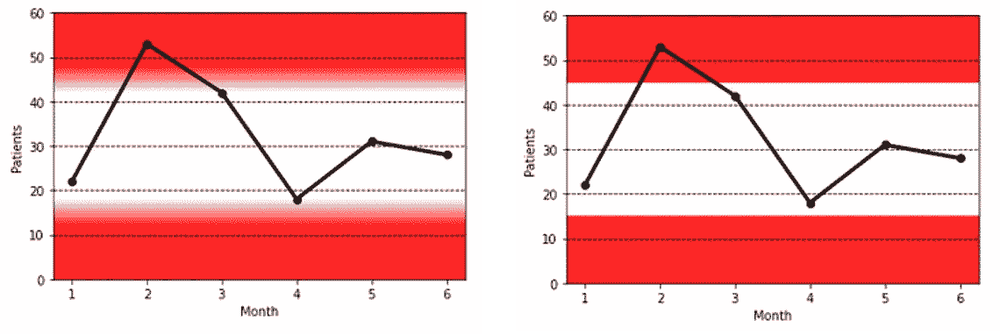

# 用于危险区域绘图的自定义 Matplotlib 色彩映射表

> 原文：<https://towardsdatascience.com/custom-matplotlib-colormaps-for-danger-zone-plots-62310983eb67>

## 为更有意义的绘图构建精确的背景颜色渐变

莎伦·皮特韦在 [Unsplash](https://unsplash.com?utm_source=medium&utm_medium=referral) 上的照片

背景——这就是一切。在我们对数据进行排序、组织和解释之后，我们制作描述性的可视化来讲述数据的故事。当我们自己使用图表来理解数据时，一切都很好——我们理解了图表的背景。然而，如果我们的目标是通知其他人并在更广泛的受众中推动决策，我们希望图表不仅共享数据，而且明确地推动结论。你的观众不会像你一样了解数据，所以你要引导他们的思维过程。这通常需要像趋势线或颜色编码这样的情节元素，但即使这样，你也从你的观众那里假设了很多——上升趋势是好事还是坏事？他们怎么会知道？

在这里，我们将描述如何创建自定义 matplotlib cmap 对象(彩色地图)来创建“危险区域”图。这些创建的图表可以让技术和非技术受众立即理解，以显示某些数据何时会以对组织“不利”的方式发展。比较下面的两个图——在不知道这个数据是什么的情况下，你会从右边的图中知道第 2 个月和第 3 个月有些“不好”,只是增加了一些自定义的背景颜色渐变。

传统条形图与“危险区域”条形图—作者图片

我们也不总是能控制我们的数据是如何被共享的。一开始可能是向内部和外部客户进行演示(在演示中，您可以解释数据趋势和见解)，但可能会变成通过电子邮件发送的数字，而没有更深入的背景。如果剧情可以自我解释**和**表明一个*应该*得出的结论，那么对于第一次看它的人来说，它会减轻精神负担。这也有助于确保其他人得出和你一样的结论。

# 什么构成了色彩映射表(cmap)？

在我们开始定制 cmaps 之前，让我们深入了解一下它们是如何工作的。内置的 matplotlib cmaps 是四种颜色渐变组:顺序、发散、循环和定性。在 matplotlib 的文档[中有一个坚实的可视化存储库供您选择，这里](https://matplotlib.org/stable/tutorials/colors/colormaps.html)，但是这里有一个快速的体验:

不同预加载 cmap 类型的示例—图片由作者提供

当我们获取一个 cmap 对象时，python 会生成一个 256 元素的颜色列表，用于定义色彩映射表。每种颜色在内部都表示为红-绿-蓝-阿尔法(RGBA)的 4 元素数组，其中阿尔法最好被认为是颜色的“透明度”。因此，例如，如果我们拉出`'Reds'` cmap 对象，并研究第 100 种颜色(256 种颜色中的一种),我们会看到:

调查“红色”cmap

当然，没有一个预先制作的 cmaps 会完全符合我们想要制作适当的“危险图”的特定颜色和过渡点。但是有了这种对 cmap 核心元素的直接访问，重写行以得到我们想要的就变成了一个有趣的命题。这当然是一种方法(我在我的 [github 笔记](https://github.com/bamattis/Blog/tree/main/Danger_Plots)中提到了这一点)，但这比需要的要难，尤其是当试图手动混合颜色时。

作为一个更加自动化的路径，我们将使用 matplotlib 中的`LineasrSegmentedColormap()`。但在此之前，我们需要一个轻量级的函数来查看我们创建的色彩映射表，然后再将它们应用到我们的绘图中:

红色渐变图—图片由作者提供

# 构建自定义 CMAPs

`LinearSegmentedColormap()`函数允许我们给出一个颜色列表，以及一个“节点”列表。“节点”指的是颜色图上列出的颜色所在的点(从 0 到 1 ),除此之外，它与它的邻居混合。因此，在下面的示例中，256 元素 cmap 的元素 1(节点 0.0)为纯绿色(rgba= 0，1，0，1)，元素 128 (0.5)为纯黄色(1，1，0，1)，元素 256(1.0)为纯红色(1，0，0，1)。

3 元素 cmap —作者图片

最终，我们将设计一个功能，在这个功能中，我们可以定制颜色过渡的地方。通过添加更多节点，我们可以有效地做到这一点。如果两个相邻的节点是相同的颜色，那么它们之间的空间将自动是相同的颜色。看看下面的例子，我们添加了一些重复的颜色:

5 元素 cmap —作者图片

啊！更紧密的过渡！在这种情况下，我们在 40%和 50%之间从绿色过渡到黄色，在 60%-70%之间从黄色过渡到红色。太好了！这本身可以用来手动创建自定义阴影危险图所需的 cmaps。然而，当我们处理数据时，我们更熟悉我们希望 cmap 改变颜色的 ***值*** ，而不是总轴长度的百分比。让我们将这个函数化到我们的图中。

# 双色和三色定制 CMAPs

使用同样的技术，我们将建立 2 色混合和 3 色混合。这两个函数都接受我们想要使用的颜色——请记住，`LinearSegmentedColormap()`非常灵活，可以接受颜色作为名称(' Red ')、rgba ([1，0，0，1])，甚至十六进制(#ff0000)。事实上，这里有一个简单的[颜色选择器工具](https://www.google.com/search?channel=nus5&client=firefox-b-1-d&q=hex+color+picker)可以帮助你得到你想要的颜色。这些函数还接受颜色之间过渡的值、过渡的宽度以及绘图轴限制(最小值和最大值)，以便可以适当地缩放过渡值。

目标过渡 cmap —作者提供的图片

在函数调用中，我们假设有一个最小值为 0、最大值为 10 的图，转换正好发生在 5 处，宽度为 2。果然，转换发生在 256 元素生成的 cmap 的中途。

将这个概念扩展到一个三色函数，我们做了很多相同的事情，只是稍微复杂一点。

三色目标过渡 cmap —作者图片

# 应用于地块

首先，让我们生成一些虚拟数据用于我们的绘图。这是一个数据图表，显示了医院每月接待的患者数量:

要将任何梯度 cmap 添加到 matplotlib 图的背景中，我们使用`imshow()`，它将数据显示为图像。最难通过的变量是第一个变量(“X”)。这将图中的一个位置映射到 cmap 中的一个元素。因为我们想线性地遍历我们的自定义 cmap，我们将使用`np.linspace()`来创建一个 0 到 1 之间的 256 个元素的线性数组。我们还想传入`extent`参数，让`imshow()`知道我们正在扩展 cmap 的范围。最后，注意`ylim()`给出了一个(y min，y max)的输出列表，所以在调用`two_color_cmap()`函数时，我们使用括号符号来访问每一个作为限制。

应用于我们的数据并设置一个任意的转换点，我们得到这个:

双色危险区域图-作者提供的图像

或者，如果想在进入红色“危险”区域之前创建一个“警告”区域，我们可以使用三色函数添加一些黄色:

三色危险区域图—图片由作者提供

厉害！现在，我们的观众的目光被吸引到了第二个月，那里的患者数量高得令人无法接受。

## 水平条形图

这些自定义 cmaps 也支持水平绘图。我们只需要对我们的绘图代码做一些调整。最重要的是我们如何改变`imshow()`中的“X”变量。在这种情况下，我们删除了转置`.T`，它将`grad`从一组 256 个 1 元素的数组变成了一个 256 元素的数组。用`print(grad)`研究`grad`变量，以理解我们如何工作的细微差别。最后，注意`np.linspace()`现在从 0- > 1。如果我们想要翻转 cmap 的显示方式，我们可以像之前一样将它变回 1- > 0。

水平三色危险区域图—图片由作者提供

## 应用于线形图

在许多情况下，我们希望突出显示数据的可接受“范围”。在这种情况下，高值和低值都表明有问题，但在中间有一个令人满意的中间值。对于这些情况，线形图更能说明问题。使用我们制作的相同数据和相同的`three_color_cmap()`函数，我们可以用自定义 cmap 制作一个线图。

具有修改的 cmap 过渡宽度的线图-作者提供的图像

左边是我们的标准“混合”彩色地图，但我们的自定义 cmap 函数非常适合零转换 cmap。如果故障值非常明确，并且没有“回旋余地”,则右侧的零转换 cmap 会更有用。这对于存在已知控制上限和下限的[统计过程控制(SPC)](https://www.simplilearn.com/spc-charts-article) 图特别有用。

# 结论

除了视觉上吸引人之外，危险的情节给我们的情节增加了背景。它们使我们的数据能够自己说话，并可以立即授权任何人识别代表何时出现问题的数据点。有了这些 cmap 生成函数的框架，天空就是极限——制作你自己的，想加入多少颜色就加入多少颜色！正如你所看到的，一旦我们的设置功能到位，它们很容易实现，所以你没有燃烧卡路里产生完美的情节。

像往常一样，整个代码遍历笔记本可以从我的 github 中找到。 ***如果觉得有用请跟我来！*** 欢呼声此起彼伏，快乐的编码声此起彼伏。