# 基于概率模型的客户终身价值评估

> 原文：<https://towardsdatascience.com/customer-lifetime-value-estimation-via-probabilistic-modeling-d5111cb52dd>

## 深入了解 BG-NBD，这是一个有影响力的分层模型，有助于了解客户的购买行为

[耐嚼](https://unsplash.com/@chewy?utm_source=medium&utm_medium=referral)在 [Unsplash](https://unsplash.com/photos/1p7TrM0LkXc) 上拍照

# **客户终身价值的重要性**

客户终身价值(CLV)是客户在其关系存续期间对公司的总价值。实际上，这个“价值”可以定义为收入、利润或分析师选择的其他指标。

CLV 是一个重要的跟踪指标，原因有二。首先，一家公司对其整个客户群的 CLV 总和给出了其市场价值的大致概念。因此，一家总 CLV 高的公司对投资者来说是有吸引力的。其次，CLV 分析可以指导客户获取和保留策略的制定。例如，可以特别关注高价值客户，以确保他们对公司保持忠诚。

> 许多 CLV 模型已经发展到不同的复杂程度和精确度，从粗略的启发式到复杂概率框架的使用。在本系列文章中，我们深入探讨其中之一:**贝塔几何负二项分布(BG-NBD)模型**。这个模型由 Fader、Hardie 和 Lee 于 2005 年开发，由于其可解释性和准确性，已经成为该领域最有影响力的模型之一。

本系列由三篇文章组成，每一篇都建立在另一篇的基础上。我们的游戏计划如下:

1.  在第 1 部分(这一部分)，我们将实现对 BG-NBD 模型及其假设的 ELI-5 理解。
2.  在[第 2 部分](https://medium.com/@meraldo.antonio/71171a35f654#2b5f-e66d9b5b6df0)中，我们将研究 Python 库 [*生存期*](https://lifetimes.readthedocs.io/en/latest/) ，它允许我们以类似于 *scikit-learn* 的方式方便地将 BG-NBD 模型拟合到数据集，并且几乎可以立即获得模型参数的最大似然估计。我们还将探索*寿命*支持的各种下游分析。
3.  在[第三部分](https://medium.com/p/d770676f5c06)中，我们将从贝叶斯的角度来看实现 BG-NBD 模型的另一种方法。我们将看到贝叶斯分级 BG-NBD 模型如何允许我们将我们对客户行为的先验直觉注入到模型中。为此，我们将使用 Python 库 [*PyMC3*](https://docs.pymc.io/en/v3/) 。

# **BG-NBD 的范围**

在深入挖掘 BG-NBD 的数学之前，我们需要了解它能做什么和不能做什么。需要记住两个主要限制:

> 该模型仅适用于非合同性的连续采购。
> 
> 该模型只处理 CLV 计算的一个组成部分，即购买数量的预测。

让我们更详细地了解一下这些限制。

## BG-NBD 适用于非合同性的连续采购

根据卖方和买方之间的关系，企业可以是契约性企业，也可以是非契约性企业。

*   契约性商业，顾名思义，是一种买卖关系受合同约束的商业。当任何一方不再想继续这种关系时，合同终止。由于有了合同，在某一点上某人是否是企业的客户就不会有歧义。
*   另一方面，在非合同业务中，采购是在没有任何合同的情况下根据需要进行的。

我们可以进一步区分*连续*和*离散*设置:

*   在*连续*设置中，购买可以在任何给定的时刻发生。大多数采购情况(如食品杂货采购)都属于这一类别。
*   在一个*离散的*环境中，购买通常以某种程度的规律性周期性地发生。这方面的一个例子是每周杂志购买。

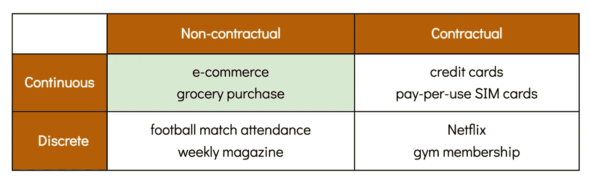

BG-NBD 模型处理非合同的、持续的情况，这是四种分析中最常见也是最具挑战性的。在这种情况下，客户流失不是显而易见的，任何时候都可能发生。这使得区分已经无限期流失的顾客和将来还会回来的顾客变得更加困难。正如我们将在后面看到的，BG-NBD 模型能够为这两个选项中的每一个分配概率。

## **BG-NBD 专注于预测交易数量**

给定期间客户的 CLV 可以通过两个数字相乘来计算:

1.  客户在此期间的预测交易数量。
2.  每次购买的预测价值。

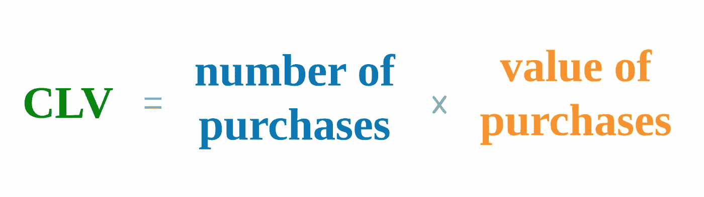

通常这两个组件是分开处理和建模的。BG-NBD 模型解决了第一个问题——预测交易数量，这在许多方面是两者中更困难的。

第二个组成部分，购买的预期价值，可以通过使用简单的试探法，如取所有过去购买的平均值，或通过更复杂的概率模型，如[伽马-伽马模型](http://www.brucehardie.com/notes/025/gamma_gamma.pdf)(也是由 BG-NBD 的作者创建的)。

# 直觉

在进入模型的数学之前，让我们试着理解模型在概念层面上是如何工作的。

让我们想象以下场景。日期是 2021 年 12 月 31 日，你是一家蛋糕店的经理。您已经仔细记录了今年发生的所有交易，并希望预测您的客户在 2022 年可以完成多少笔交易。

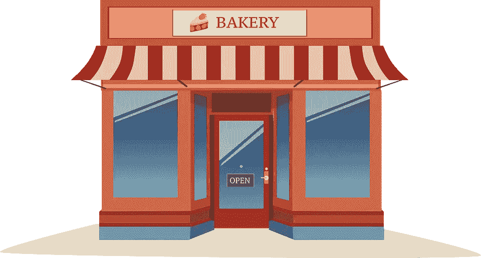

来源: [pixabay](https://pixabay.com/vectors/icon-small-isolated-front-cafe-4423853/)

您碰巧也是一名熟练的数据科学家，您计划通过将模型与您的数据相拟合来实现这一预测。这个模型应该能够以一种可解释的方式描述客户的购买行为。

在开发模型时，您可以考虑一些假设。

## 每个顾客有不同的购买率

你已经注意到有些人每天都买蛋糕，有些人每个周末都买。其他人只在平均每六个月一次的特殊场合购买。**您的模型需要一种方法来为每个客户分配不同的购买率。**

## 每个客户都可以随时停止成为你的客户

在竞争激烈的蛋糕行业，忠诚度是无法保证的。**在任何时候，你的客户都可能会离开你的公司去另一家公司。**让我们将这种离开称为先前活跃客户的“停用”。

为了方便地建立停用模型，我们可以假设它只能在成功购买之后*发生。也就是说，每次在你的商店购物后，顾客会决定是继续购买还是放弃购买。当客户决定选择后者时，就会发生停用。*

> 我们假设停用既是永久的**又是潜在的**。**永久，**因为客户一旦决定流失，就再也不会回来了。**潜伏**，因为他不会明确的让你知道他不再是你的客户。

# 说明

有了这些假设，让我们考虑下面的场景，我们有两个客户，A 和 b，他们每个人都在 2021 年进行了一些交易，每笔交易都用一个红点表示。

我们能否知道哪些客户已经停用，哪些客户仍会经常光顾您的商店并为您的未来收入做出贡献？

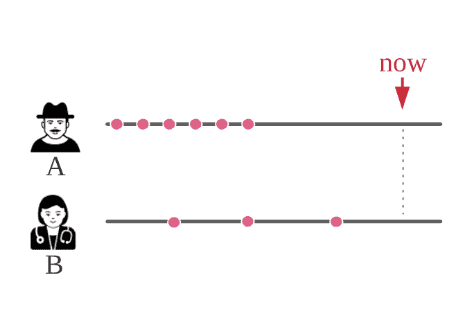

答案是肯定的——在一定程度上。例如，看上面 A 的模式，我们看到他过去经常购物，但我们已经有一段时间没见到他了。因为他的事务间时间比他上一次事务后的时间短得多，很可能 A 已经停用了。

另一方面，B 是一个不经常购物的人，与她平均的购物间隔期相比，她最近一次购物的时间并不长。她很可能会回来。

现在让我们将这些假设和直觉发展成一个更复杂的模型！

# 数学模型

## 概率建模:导论

传统上，CLV 是使用过去数据的简单函数来计算的。例如，我们可以通过取过去交易价值的固定分数来估计未来交易的价值。毫不奇怪，这样的计算过于简单，不可靠，也无法解释。

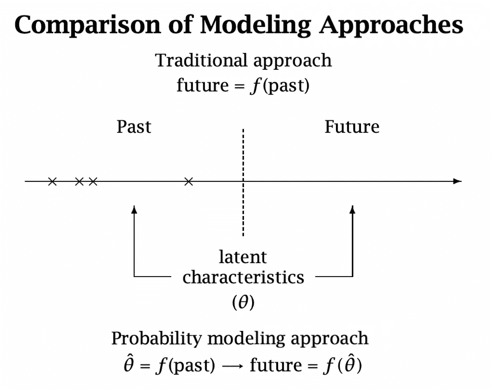

资料来源:英国地质调查局-NBD 文件

另一方面，BG-NBD 模型是一个*概率模型*。在概率模型中，我们假设我们的观察结果(即交易)是由我们可以使用概率分布建模的物理过程产生的。我们的任务是估计能最好地解释我们现有观察结果的参数。一个常用的选择是找到这些参数的最大似然估计量。然后，我们可以使用这些估计的参数来执行未来的预测。与第一个相比，这个概率框架通常更健壮、更准确、更易解释。

有了这些介绍，现在让我们将上面定性描述的假设转换成一个可靠的概率框架。

## 泊松过程用于模拟交易，指数分布用于模拟购买间隔时间

首先，让我们关注活跃客户的重复购买行为。我们可以假设，只要客户仍然活跃，他们的交易就遵循具有恒定购买率𝜆.的泊松过程有了这个假设，我们可以将下次购买时间δ*t*建模为由𝜆.参数化的指数分布该发行版的 PDF 如下:

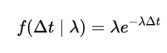

每个活跃客户都有自己的指数分布，我们可以用它来预测下次购买的概率。

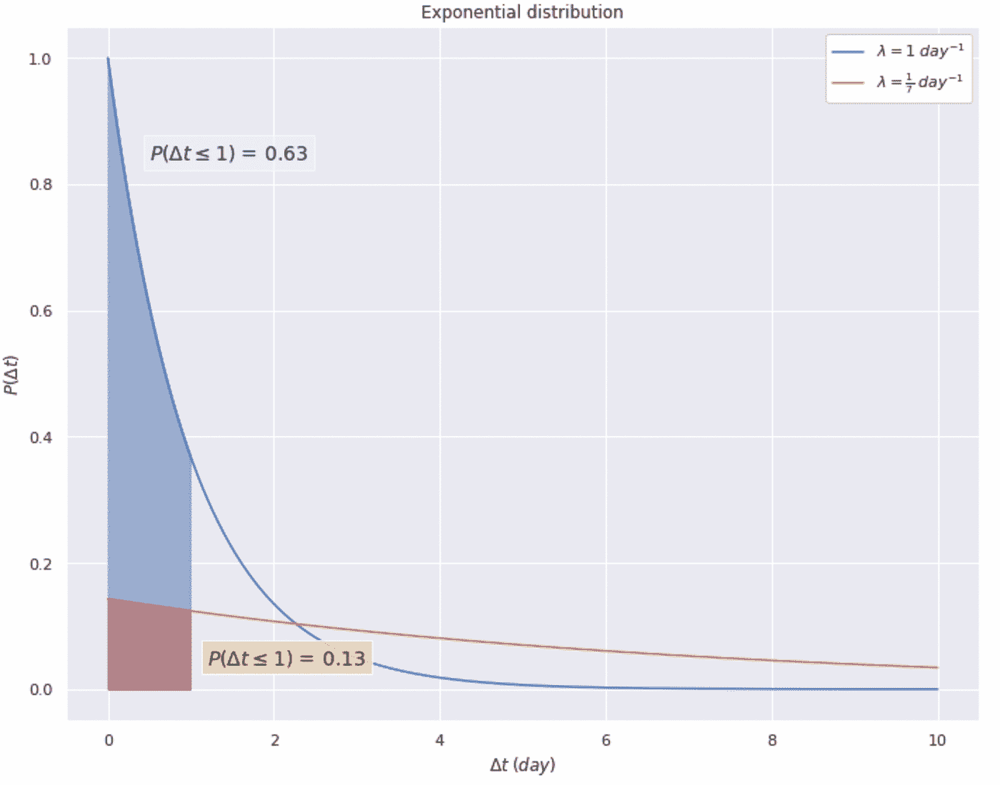

上图显示了与两个客户相关的两个指数分布的 PDF。第一个顾客(蓝色曲线)通常每天购买一个蛋糕(他的购买率𝜆是 1 个蛋糕/天)。他的下一次购买发生在他当前购买的一天内的概率可以通过在 0 和 1 之间取蓝色曲线下的面积并计算为 0.63 来得到

第二个顾客每周只买一个蛋糕(他的𝜆是 1/7 蛋糕/天)。在进行同样的整合后，我们看到他的下一次购买发生在明天之前的可能性要小得多(P = 0.13)。

## 伽马分布，用于描述人群中购买行为的变化

有必要考虑一下，所有这些𝜆's 不同的顾客都有助于整个商店的𝜆配送。我们现在的任务是模拟这个𝜆分布。为此，我们需要遵守以下要求:

*   这种分布最好是经过充分研究的。
*   因为𝜆只能取正实数的值，所以选择的分布必须只有正值。
*   分布需要足够灵活，以模拟具有不同购买行为的不同客户群。

[伽马分布](https://en.wikipedia.org/wiki/Gamma_distribution)勾选了所有方框，是 BG-NBD 中用于模拟𝜆.的分布由形状参数 *r* 和比例参数α **参数化；**这两个参数的不同组合导致伽马分布呈现不同的形状。这是发行版的 PDF:

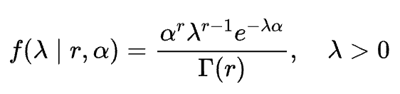

值得注意的是，这种伽马分布不仅仅是一些理论上的胡言乱语。**事实上，特定的伽马分布定量描述了特定客户群的集体购买行为，并具有重要的商业含义。**

例如，下图中的蓝线显示了向下倾斜、左倾的伽玛分布，这是将 *r* 和α都设置为 1 的结果。如果这种分布符合我的客户群，我不会太高兴——严重的左偏意味着我的大部分客户的购买率𝜆接近于零。也就是说，他们几乎不买蛋糕！

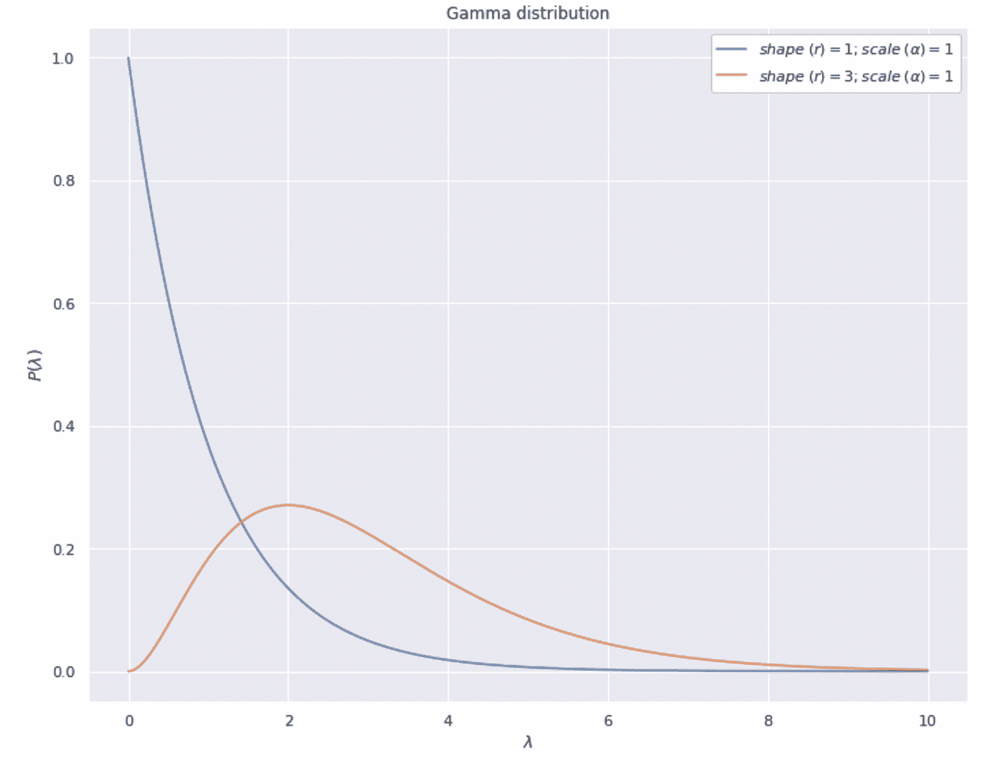

另一个伽玛分布显示为橙色。这是一种更健康的分布，其中𝜆在 2 左右达到峰值，这意味着该客户群中相当大的一部分每天购买两块蛋糕。不算太寒酸！

现在，有一个小小的书呆子注意——泊松/伽马分布的组合，我们一直用来模拟我们客户的购买行为，也被称为[负二项分布(NBD](https://en.wikipedia.org/wiki/Negative_binomial_distribution#Gamma%E2%80%93Poisson_mixture) )。是的，这就是我们模型名字的由来。

## 客户的停用被建模为几何过程

现在让我们来处理停用过程。如前所述，每次购买后，客户将决定是否停用。我们可以为这种去激活分配一个概率 p 。因此，根据[移动几何分布](https://en.wikipedia.org/wiki/Geometric_distribution)分配客户停用后的交易。这种离散分布的 PMF 如下所示:

这个 PMF 是非常直观的——它来自于注意到(1)如果一个客户在 xᵗʰ交易后停用，他一定在之前的 x-1 次交易中幸存下来，以及(2)每次幸存都带有概率(1- *p* )。请注意，根据定义，客户必须在停用之前至少执行过一次*交易(否则他一开始就不会成为我们的客户！).*

下图比较了两个客户的 *p* = 0.01 和 *p* = 0.1。

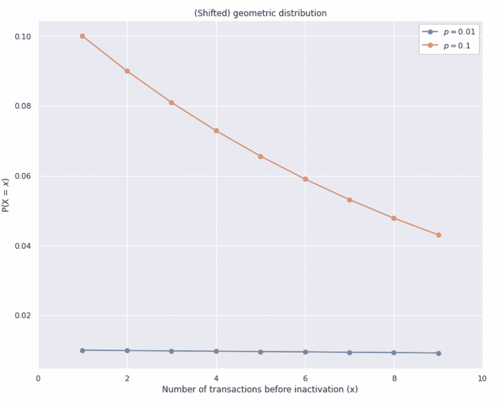

我们可以看到， *p* 越高，失活发生得越早。与 *p* = 0.1(橙色)的客户相比， *p* = 0.01(蓝色)的客户提前停用的概率要低得多。

## 描述失活概率变化的贝塔分布

类似于𝜆，考虑顾客群与分布相关联是有用的。然而这一次，我们不能使用伽玛分布，它没有上限。我们需要另一个同样灵活的分布，但是它的取值范围是从 0 到 1(因为 *p* 只能在 0 到 1 之间)。

这一次，[贝塔分布](https://en.wikipedia.org/wiki/Beta_distribution)符合我们的需求。这是 Beta 版的 PDF:

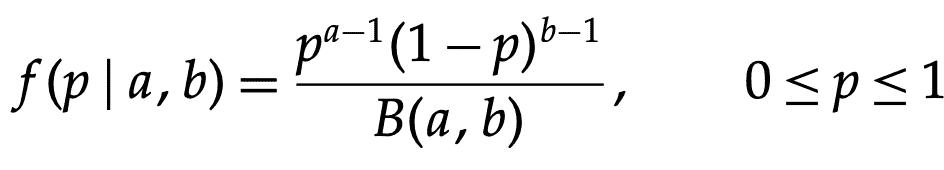

我们可以看到，该分布由两个正的形状参数来参数化， *a* 和 *b* 。下面是一些贝塔分布的例子:

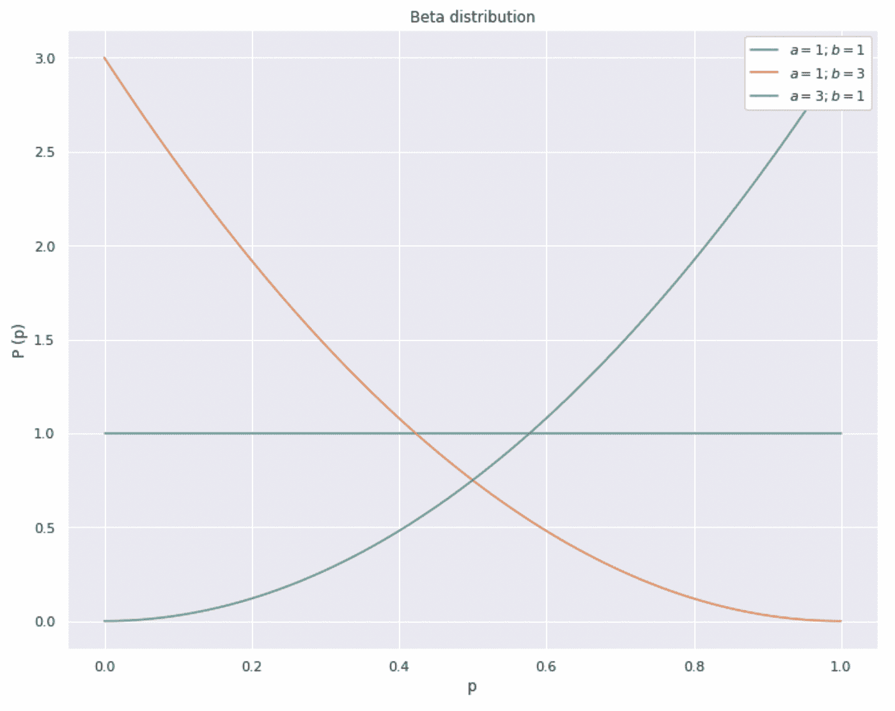

与 Gamma 分布相似，Beta 分布也有商业含义。你会希望看到一个左偏β分布，它的大部分权重接近 0，这表明你的大部分客户都有较低的 p 值，不太可能提前停用。上图中的橙色线就是一个例子。

另一个快速注意事项——正是这种贝塔/几何分布的组合导致了 BG-NBD 模型中的“BG”。现在你知道了！

## 将一切联系在一起:个体水平上可能性的数学模型

我们已经研究了定量描述客户行为的所有分布。那么我们如何获得这些分布的最佳参数呢？

一种方法是获得最大似然估计量(MLE)，这是一种参数估计量，可以最大化模型产生实际观察到的数据的可能性。

让我们把它说得更具体些。假设我们目前在时间 *T* ，我们正在回顾一个特定客户的历史交易，该客户的购买率为𝜆.他在*t*₁*t5 做了第一笔交易，在*t*ₓ*做了最后一笔交易。这些画在时间线上的点看起来像这样:**

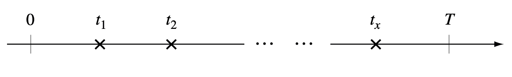

我们可以通过以下步骤推导出此人的个人水平可能性函数:

*   第一笔交易发生在 *t* ₁ 的可能性用我们之前阐述的指数分布来描述:

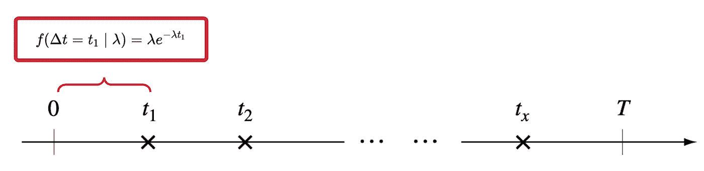

*   在 *t* ₂发生*第二笔*交易的可能性是客户在 *t* ₁后保持活跃的概率— (1- *p* ) —乘以标准指数可能性分量:

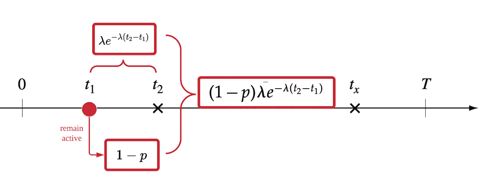

*   这样的可能性模式对每个后续交易重复，即 xᵗʰ交易在 *t* ₓ发生的可能性为:

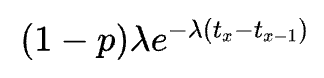

*   现在，让我们分析在ₓ.的最后一笔交易之后发生了什么我们没有观察到 *t* ₓ与 *T 之间的任何交易；这种缺席可能是由于以下两种情况之一:*

1.  **客户在 *t* ₓ** 完成最后一笔交易后停用。我们知道，这种情况发生的概率是 *p* 。
2.  在这段时间里，他仍然很活跃，但没有进行任何交易。这种情况发生的概率是:

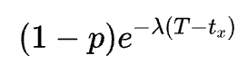

*   观察我们所观察到的交易模式的可能性就是早期交易的所有可能性乘以两种情况的可能性之和:

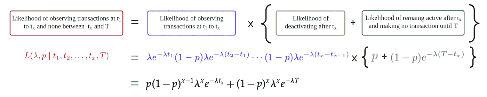

*   以上定义的可能性公式适用于在观察期内进行了*一些*购买的客户。由于我们假设所有客户一开始都是活跃的，客户在时间[0，T]之间不进行任何购买的可能性是标准的指数函数:

*   最后，结合上述两个可能性公式，我们获得了一个适用于所有客户的通用公式，而不管他们进行了多少次交易(或没有交易):

然后，我们可以有计划地尝试不同的值 *p* 和𝜆，并选择一个( *p，* 𝜆)组合来最大化这种可能性。这些参数值被称为最大似然估计量(MLE ),代表描述个人购买行为和去激活概率的“最佳”参数。

请注意，这个个体水平的似然函数只涉及三个需要由数据提供的未知变量:

*   *x* : t **重复交易的次数。**这也叫【重复】**频率**。
*   *t* ₓ: **客户最后一次交易时的年龄，**也就是他第一次和最后一次交易之间的时间。这也叫做**近因**。
*   *T* : **客户在分析点的年龄，**即从他的第一笔交易到分析时间所经过的时间。

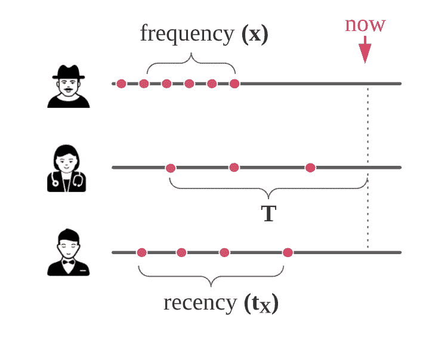

有趣的是，我们可以看到早期交易的时间不是公式的一部分。

**其行对应于不同的客户 id 并且其列指示每个客户的 *x、t* ₓ和 *T* 的数据集被称为“RFM 格式”。**这里的“R”和“F”分别代表最近和(重复)频率。同时，“M”代表货币价值；这是一个我们不会在分析中使用的列，因为我们不关心交易值。RFM 格式是 CLV 分析中常用的标准格式。

## 缩小:总体水平上可能性的数学模型

作为一家拥有(希望如此)众多客户的公司，我们常常对关注单个客户不太感兴趣。相反，我们想把我们的客户群作为一个整体来分析。具体来说，我们感兴趣的是获得描述我们整个业务绩效的最佳伽玛和贝塔分布。

**就像我们如何使用 MLE 获得个体的最佳 *p* 和𝜆一样，我们也可以使用 MLE 获得总体的最佳 *r、*** *α* **、 *a、*b。在本文中，我不会推导总体水平的似然方程；它已经够长了。然而，如果你已经理解了上面的数学，你应该可以很好地投入到 BG-NBD 论文中清晰解释的推导中。**

# 结尾部分

## BG-NBD 的其他应用

到目前为止，我们已经围绕 CLV 计算进行了讨论，这也是 BG-NBD 最初的目的。然而，BG-NBD 比这更通用。事实上，它可以用于模拟任何涉及不同“用户”进行重复“交易”的现象，并预测(1)如果这些“用户”仍然“活跃”,他们将进行多少次未来“交易”,以及(2)在分析期间他们仍然“活跃”的概率。例如:

*   通过探索用户的使用历史来预测移动应用的未来使用频率。
*   通过分析你的远房亲戚的通话模式，计算她还活着的概率。
*   通过查看你的火绒约会对象发短信的频率来检查他们是否对你不感兴趣。

## 前进

好吧，我知道我们已经经历了很多数学，这可能是具有挑战性的。您可能会想:有没有一种方法可以跳过所有这些等式，使用这个模型的现成实现来开始从中获得商业价值？

我听到了！在系列的[第 2 部分中，我们将查看 Python 库*生存期*，它允许我们使用几行代码从给定的过去事务记录中获得 *r、α*T6、a、和 *b* 的 MLE。该库还包含其他有用的分析和绘图功能，使我们能够从 BG-NBD 模型和其他相关模型中获得业务洞察力。](https://medium.com/@meraldo.antonio/71171a35f654#2b5f-e66d9b5b6df0)

之后，在[第 3 部分](https://medium.com/p/d770676f5c06)中，我们将检查 BG-NBD 的替代实现，它从贝叶斯角度接近参数估计。这个贝叶斯框架将允许我们“注入”我们的领域知识和/或信念到建模过程中。

我希望在那里见到你！

# 参考

[[1]“计算你的顾客”简单的方法:帕累托/NBD 模型的替代方案(布鲁斯·哈迪 *et。阿尔*，2005)](http://brucehardie.com/papers/018/fader_et_al_mksc_05.pdf)

[[2]货币价值的伽玛-伽玛模型(Bruce Hardie *et。阿尔*，2013)](http://www.brucehardie.com/notes/025/gamma_gamma.pdf)

***注*** *:所有图像、图表、表格、方程式，除特别注明外，均归本人所有。*

如果你对这篇文章有任何意见或者想联系我，请随时通过 LinkedIn 给我发一个联系方式。另外，如果你能支持我，通过我的推荐链接成为一名中级会员，我将非常感激。作为一名会员，你可以阅读我所有关于数据科学和个人发展的文章，并可以完全访问所有媒体上的故事。