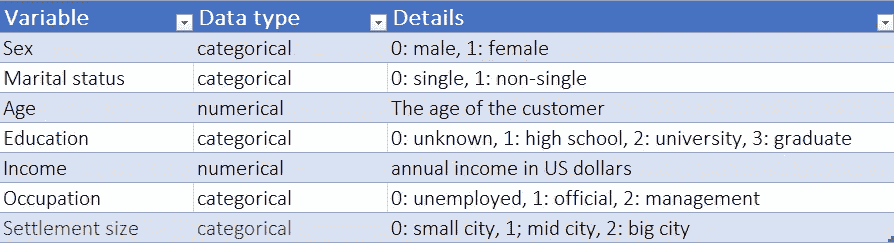
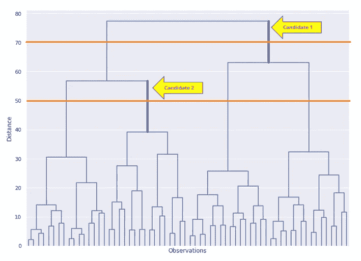

# 用 Python 进行客户细分(实现 STP 框架——第 1/5 部分)

> 原文：<https://towardsdatascience.com/customer-segmentation-with-python-implementing-stp-framework-part-1-5c2d93066f82>

## 使用 Python 实现层次聚类的分步指南


艾萨克·史密斯在 [Unsplash](https://unsplash.com?utm_source=medium&utm_medium=referral) 上拍摄的照片

我正在开始一个新的博客文章系列，在那里我将向你展示如何用 Python 一步一步地应用流行的 STP 营销框架。STP(细分、目标、定位)是现代营销中一种众所周知的战略方法，可以帮助您了解您的客户群(细分)，并更有效地将您的产品投放到目标受众中。这是一种从以产品为中心过渡到以客户为中心的方法。STP 框架允许品牌制定更有效的营销策略，高度关注目标受众的需求。

在这个博客系列中，我将描述如何通过细分更好地了解你的客户，我们将看到不同的方法，然后我们将看到如何定位自己，以便更好地为客户服务。

这第一篇文章将着重于理解和预处理数据集，并以一种简单的方式对我们的客户进行细分。
在接下来的帖子中，我们将应用一种更复杂的分割方式。

整个笔记本和参考数据都可以在 [Deepnote 笔记本](https://deepnote.com/workspace/asish-biswas-a599-b6cca607-3c12-4ae6-b54d-32861e7e9438/project/Analytic-School-8e6c85bd-e8c9-4387-ba40-0b94fb791066/%2Fnotebooks%2Fcustomer_segmentation.ipynb)中找到。

```
**Table of contents** ∘ [STP Framework](#ebab)
  ∘ [Environment Setup](#43f8)
  ∘ [Data Exploration](#c243)
  ∘ [Data Preprocessing](#c124)
  ∘ [Hierarchical Clustering](#7b10)
  ∘ [Conclusion](#a70d)
```

## STP(细分、目标、定位)框架

***细分*** 帮助您根据潜在或现有客户的人口统计、地理、心理和行为特征，将他们划分为不同的群体。每个群体的顾客都有相似的购买行为，并可能在不同的营销活动中采取相似的行动。像“一刀切”的一般营销活动并不是最好的营销策略。

*:一旦你了解了你的客户群，下一步就是选择一部分要关注的客户群。很难制造出让每个人都满意的产品。这就是为什么最好专注于最重要的客户群，让他们开心。以后你总是可以扩大你的关注范围，瞄准更多的顾客。*

*选择目标市场时，最重要的考虑因素是:*

*   *分段的大小*
*   *增长潜力*
*   *竞争对手的目标市场和产品*

*目标活动利用定性检查，属于广告领域。这就是为什么我们不会在这个博客系列中关注目标阶段。*

****定位*** :在这一步，你把前两步考虑到的不同属性绘制出来，然后定位你的产品。这有助于您确定您想要提供的产品和服务最能满足客户的需求。定位还指导您如何以及通过什么渠道向客户展示这些产品。在这个过程中还使用了另一个框架，叫做**营销组合**。当我们到达那个模块时，我将简要描述营销组合。*

## *环境设置*

*在这整个系列教程中，我将使用 [Deepnote](https://deepnote.com/) 作为唯一的开发工具。Deepnote 是一个令人敬畏的基于 web 的类似 Jupiter 的笔记本环境，它支持多用户开发生态系统。默认情况下，Deepnote 安装了最新的 Python 和著名的数据科学库。如果需要，通过“requirements.txt”或常规的 bash 命令安装其他库也非常容易。*

*以后我会单独写一篇关于如何更有效地使用 [Deepnote](https://deepnote.com/) 的帖子。*

## *数据探索:了解数据集*

*我们将使用一个预处理过的快速消费品(FMCG)数据集，它包含 2000 个人的客户详细信息以及他们的购买活动。*

*用 Excel 查看数据集是一个很好的做法，因为在 Excel 中滚动和浏览数据集更容易(只要数据集不是超级大)。谢天谢地，Deepnote 为 CSV 数据集提供了更好的浏览体验。它每列显示一个分布图，让你对每个变量一目了然。*

*让我们使用 Pandas 库将客户数据集加载到笔记本中。*

*我们可以看到，对于每个客户，我们有一个 ID 列和七个其他人口统计和地理变量。
以下是每个变量的简短描述:*

**

*将数据集加载到 pandas 数据框后，我们可以应用“描述”方法来获得数据集的摘要。这显示了我们数据集的一些描述性统计数据。*

*对于数值变量，输出包括计数、平均值、标准差、最小值、最大值以及 25、50 和 75 个百分点。对于分类变量，输出将包括计数、唯一、顶部和频率。*

*让我们继续我们的数据探索，看看变量的成对相关性。相关性描述变量之间的线性相关性，其范围从-1 到+1。其中+1 表示非常强的正相关，而-1 表示强的负相关。相关性为 0 意味着这两个变量不是线性相关的。*

*相关矩阵中的对角线值总是 1，因为它表示变量与其自身的相关性。不幸的是，仅仅看数字很难对变量之间的关系有一个大致的了解。让我们用 Seaborn 的热图来绘制这些数字。*

*从这张热图中，我们可以看到年龄与受教育程度或职业与收入之间有很强的正相关关系。这些变量间的相关性在分割过程的特征选择中将是重要的。*

*为了理解变量之间的成对关系，我们可以使用散点图。在 Deepnote 笔记本里，你会找到散点图的例子。*

## *数据预处理*

*即使我们正在处理的客户数据是干净的，我们也没有对数据进行任何统计处理。*

*在计算单个记录之间的距离时，大多数机器学习算法使用两个数据点之间的欧几里德距离。
当我们的数据集中的要素比例不同时，此计算的执行效果不佳。例如，尽管 5 千克和 5000 克的含义相同，但在距离计算中，算法会对高量值特征(5000 克)施加很大的权重。
这就是为什么在将数据输入任何机器学习或统计模型之前，我们必须首先将数据标准化，并将所有特征置于相同的数量级。*

*<https://medium.com/greyatom/why-how-and-when-to-scale-your-features-4b30ab09db5e>  

Scikit-learn 在预处理模块下提供了这个方便的类“StandardScaler ”,这使得标准化我们的数据框架变得非常容易。

## 分层聚类

我们将使用 Scipy 的层次模块中的树状图和链接对数据集进行聚类。
树状图是数据点的树状层次表示。它最常用于表示层次聚类。另一方面，链接是帮助我们实现聚类的功能。这里我们需要指定计算两个集群之间距离的方法，完成后，链接函数返回链接矩阵中的分层集群。

在 x 轴的底部，我们有观察结果。这些是 2000 个人客户数据点。在 y 轴上，我们看到由垂直线表示的点或簇之间的距离。点之间的距离越小，它们在树中的分组位置就越靠下。

## 手动确定集群的数量

链接对象可以为我们计算出最佳的聚类数，并且树状图可以用不同的颜色表示这些聚类，这很棒。但是，如果我们必须从树状图中识别这些集群呢？该过程是穿过没有被任何延伸的水平线截取的最大的垂直线。切片后，切片线下的聚类数将是最佳聚类数。在下图中，我们看到两条候选人垂直线，在它们之间，“候选人 2”较高。因此，我们将穿过这条线，这将在下面产生 4 个集群。



## 结论

分层聚类实现起来非常简单，它可以返回数据中的最佳聚类数，但不幸的是，由于它的速度很慢，所以在现实生活中并不使用。相反，我们经常使用 K-means 聚类。在我们的下一篇文章中，我们将看到如何实现 K-means 聚类，我们将尝试用 PCA 来优化它。* 

**感谢阅读！如果你喜欢这篇文章一定要给* ***鼓掌(最多 50！)*** *让我们* ***连接上****[***LinkedIn***](https://www.linkedin.com/in/asish-biswas/)*和* ***在 Medium 上关注我*** *保持更新我的新文章***

***通过此* [*推荐链接*](https://analyticsoul.medium.com/membership) *加入 Medium，免费支持我。***

**<https://analyticsoul.medium.com/membership> **