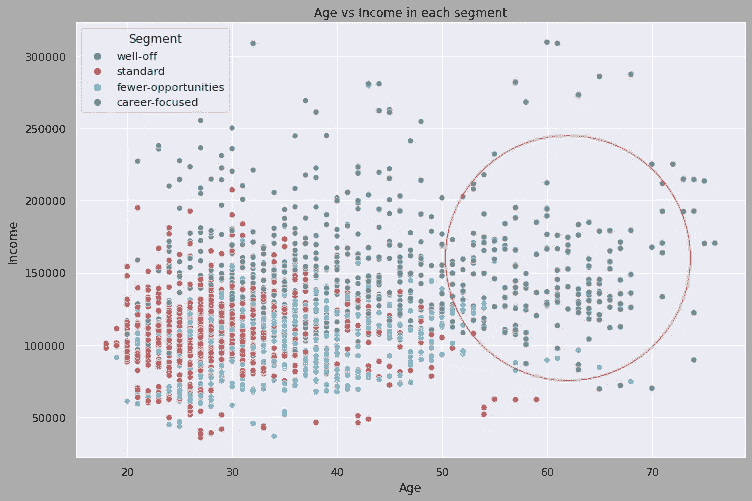

# 使用 Python 进行客户细分(实现 STP 框架——第 3/5 部分)

> 原文：<https://towardsdatascience.com/customer-segmentation-with-python-implementing-stp-framework-part-3-e81a79181d07>

## 使用 PCA 实现 k-means 聚类的分步指南

在 [Unsplash](https://unsplash.com?utm_source=medium&utm_medium=referral) 上由 [Carlos Muza](https://unsplash.com/@kmuza?utm_source=medium&utm_medium=referral) 拍摄的照片

到目前为止，在我们实施 STP 营销框架(细分、目标和定位)的过程中，我们已经完成了以下工作:

在[的第一篇文章](/customer-segmentation-with-python-implementing-stp-framework-part-1-5c2d93066f82)中，我们已经
定义了我们的目标并学习了基础知识
设置了 Deepnote 开发环境
探索了我们一直在使用的客户数据集的不同属性/特征
处理并标准化了我们的数据集
使用分层聚类对客户进行了细分

然后，在第[篇文章](/customer-segmentation-with-python-implementing-stp-framework-part-2-689b81a7e86d)中，我们
学习了 k-means 聚类算法(平面聚类)和 elbow 方法，以确定数据集中的最佳聚类数
使用 k-means 聚类对客户数据集进行细分，并命名我们的客户群
分析了细分结果

正如我们在第二篇文章中看到的，我们的聚类方法无法清楚地区分不同的客户群，在这篇文章中，我们将尝试使用降维来改善这一点。

## 主成分分析

当数据集中的多个要素高度相关时，会因为冗余信息而扭曲模型的结果。这就是我们的 k 均值模型所发生的情况。这就是所谓的多重共线性问题。我们可以通过降维来解决这个问题。

[了解有关多重共线性的详细信息。](https://statisticsbyjim.com/regression/multicollinearity-in-regression-analysis/)

第一篇文章中的相关矩阵表明**年龄**和**学历**相关，并且**收入**和**职业**也相关。我们将使用主成分分析(PCA)这种降维方法来解决这个问题。

降维是减少数据集的属性数量，同时保留原始数据中有意义的属性的过程。正如莎士比亚所说，“有时少即是多”。降维不完全是这样，但很接近:P

[了解更多关于降维的知识](https://en.wikipedia.org/wiki/Dimensionality_reduction)。

PCA 将一组相关变量(p)转换成较少数量的不相关变量 k (k < p) called **主分量**，同时尽可能保持原始数据集中的变化。这是在标准化数据集的数据预处理步骤中执行的。

[了解更多关于五氯苯甲醚的信息。](https://www.youtube.com/watch?v=FgakZw6K1QQ)

## 识别主要成分

首先，让我们从 sklearn 导入 PCA 库，并用标准化的客户数据集创建我们的 *pca* 对象。

*pca* 对象的属性“explained_variance_ratio_”包含七个组件，它们解释了我们数据集的 100%可变性。第一个成分解释了约 36%的可变性，第二和第三个成分分别解释了 26%和 19%的可变性。

经验法则是选择保留 70–80%可变性的组件数量。如果我们选择三个顶级组件，它们将拥有超过 80%的可变性，如果我们选择四个组件，它们将保留几乎 90%的可变性。让我们挑选三个组件并适合我们的 pca 模型。
然后，我们使用原始数据集中的列创建一个包含三个主要成分的数据框架。请注意，数据帧中的所有值都在负 1 和 1 之间，因为它们本质上是相关的。

现在，让我们看看新的相关矩阵。

成分一与*年龄、收入、职业、*和*定居规模正相关。*这些特征与一个人的职业有关。

另一方面，*性别、婚姻状况、*和*教育*是第二个组成部分最显著的决定因素。我们还可以看到，在这个组件中，所有与职业相关的功能都是不相关的。因此，这个组成部分不是指个人的职业，而是指教育和生活方式。

对于第三个组成部分，我们观察到*年龄、婚姻状况、*和*职业*是最显著的决定因素。*婚姻状况*和*职业*有负面影响，但仍然很重要。

## 用 PCA 实现 K-Means 聚类

好了，现在我们对新的变量或组件代表什么有了一个概念。让我们实现 k-means 聚类，将我们的三个组件视为特征。我们将跳过肘方法，因为我们已经在第二篇文章中学习过了。因此，我们将直接开始用四个集群实现 k-means 算法。[笔记本](https://deepnote.com/workspace/asish-biswas-a599-b6cca607-3c12-4ae6-b54d-32861e7e9438/project/Analytic-School-8e6c85bd-e8c9-4387-ba40-0b94fb791066/%2Fnotebooks%2Fcustomer_segmentation.ipynb)包含详细的实现方法供您参考。

## 分析分割结果

之前我们已经确定*成分一*代表事业，*成分二*代表教育&生活方式，*成分三*代表生活或工作经历。

现在让我们分析分割结果，并尝试像以前一样标记它们。

**细分 0:** 低职业和经验价值，高教育和生活方式价值。
标签:*标准*
**细分 1:** 高职业但低学历、低生活方式、低经历
标签:*以职业为中心*
**细分 2:** 低职业、低学历、低生活方式、高经历
标签:*机会少*
**细分 3:** 高职业、高学历、高经历

让我们来看看每个细分市场的客户数量:

现在，让我们来看一下与前两个组件相关的部分。

为了比较，这里是没有 PCA 的原始 k-means 实现的散点图(本系列的[第 2 篇](/customer-segmentation-with-python-implementing-stp-framework-part-2-689b81a7e86d))。

作者图片

正如您所看到的，现在这四个部分可以清楚地识别。虽然标准和更少机会有一些重叠，但总体结果仍然远远好于先前的结果。

## 结论

到目前为止，我们已经将我们的客户分成了四个不同的、可明确识别的群体。至此，我们已经完成了 STP 框架的“细分”部分。由于“定位”主要涉及关注哪个客户群的商业决策，我们将在下一篇文章中跳到“定位”。

与往常一样，完整的代码和所有支持数据集都可以在 [Deepnote 笔记本](https://deepnote.com/workspace/asish-biswas-a599-b6cca607-3c12-4ae6-b54d-32861e7e9438/project/Analytic-School-8e6c85bd-e8c9-4387-ba40-0b94fb791066/%2Fnotebooks%2Fcustomer_segmentation.ipynb)中获得。

*感谢阅读！如果你喜欢这篇文章，一定要给* ***鼓掌(最多 50！)*** *和* ***连线****[***LinkedIn***](https://www.linkedin.com/in/asish-biswas/)*和* ***在 Medium 上关注我*** *保持更新我的新文章。**

**通过此* [*推荐链接*](https://analyticsoul.medium.com/membership) *加入 Medium，免费支持我。**

* *