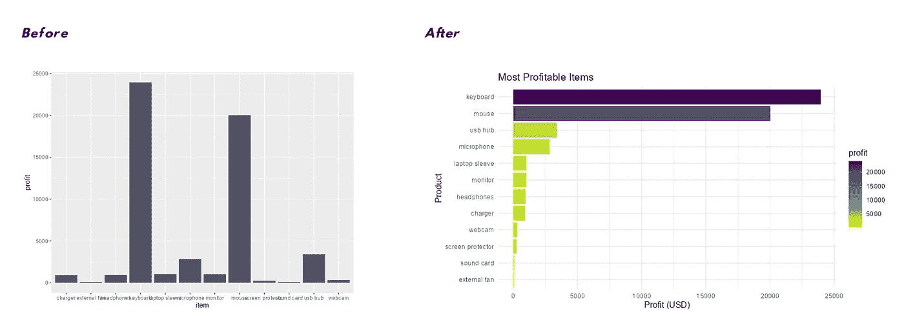
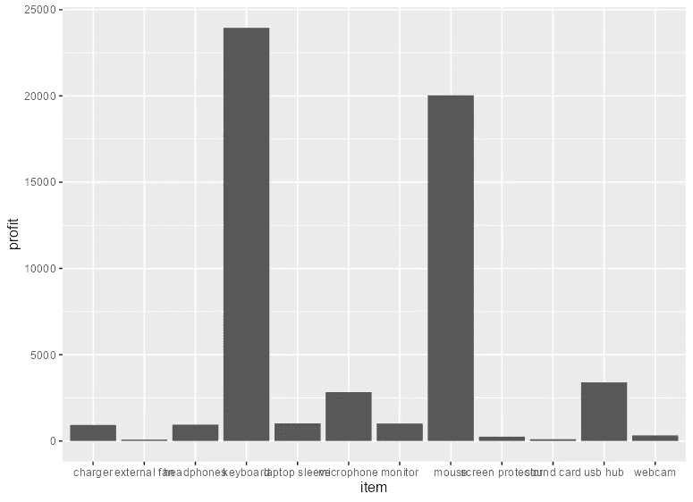
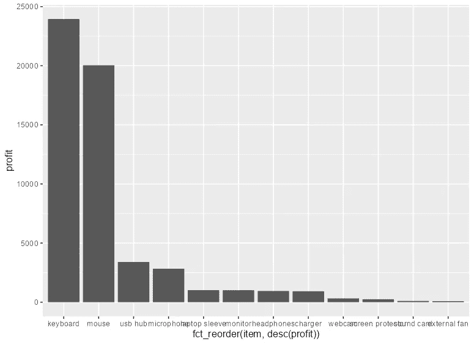
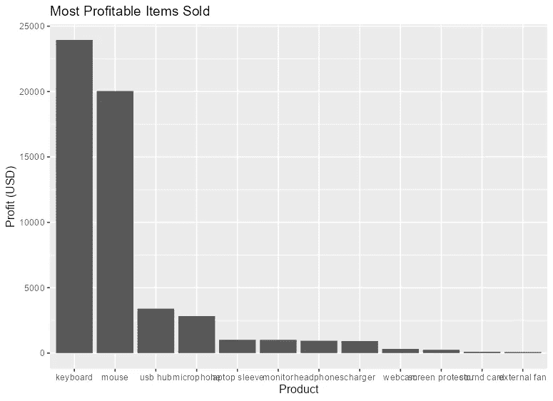
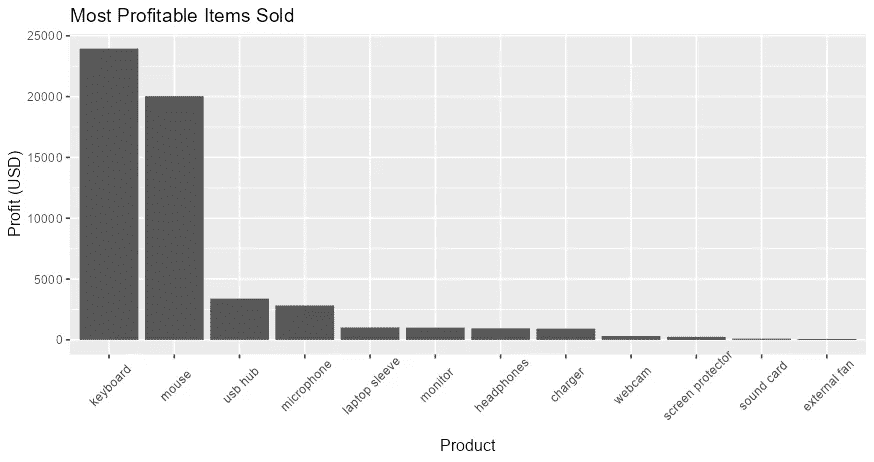
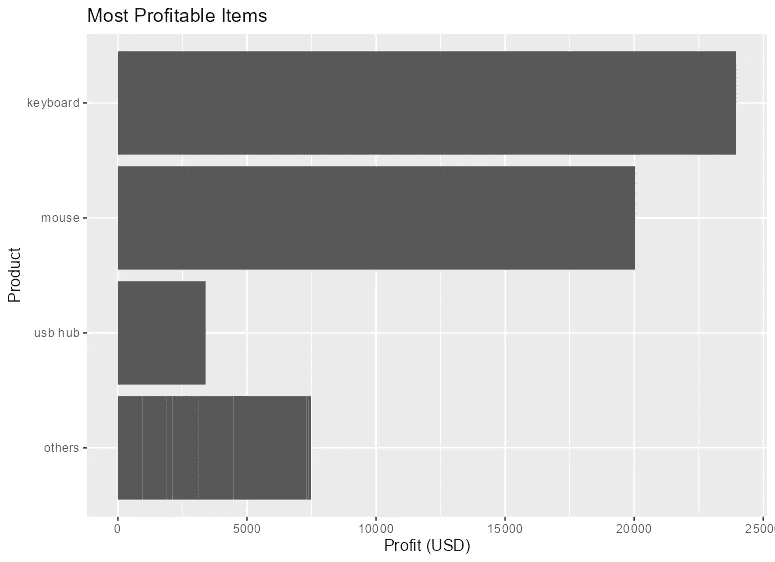
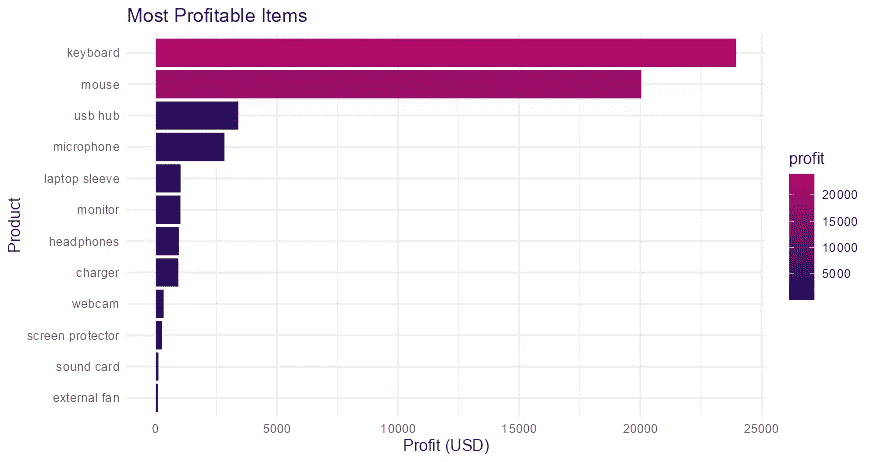

# 定制您的 ggplot2 条形图——5 种快速改善 R 数据可视化的方法

> 原文：<https://towardsdatascience.com/customize-your-ggplot2-bar-graph-5-ways-to-instantly-improve-your-r-data-visualizations-f9c11dfe0163>

## 如何抓住读者的注意力并制作出专业的图表

作者图片

条形图是数据可视化的基础。它们对于比较分类数据的值很有用。

*   在 tidyverse 中，您可以只用两行代码构建下面的条形图。

作者图片

尽管它看起来很简单，但是这个图表告诉了你需要知道的关于数据的一切。如果你只是做一个探索性的数据分析，它适度的外观可能就足够了。然而，如果你计划通过报告或演示文稿来传达你的数据，这可能不足以吸引读者的注意力。自定义图表的美感可以提高其可读性，突出有趣的趋势，并帮助您的可视化看起来更专业。

**这里有 5 个快速简单的方法来改善你的图表。**

在本教程中，我们将使用与生成上图相同的数据。它包含了在一个假设的商店中销售的每一个计算机配件的利润。您可以使用以下代码生成数据集。

1.  **重新排序因素**

作者图片

*   通过按降序重新排列条形来引起对突出数据点的注意。

*   对于其他数据集，按地理位置对数据进行分组或按字母顺序进行排序可能也很有用。通过阅读它的[文档](https://forcats.tidyverse.org/reference/fct_reorder.html)掌握 fct_reorder，你也可以这样做。

**2。添加标签**

作者图片

*   编辑你的标题，x 轴和 y 轴标签，给你的读者上下文，并确保变量易于理解。

**3。重新定位刻度标签**

作者图片

*   随着刻度标签数量和长度的增加，它们变得更难阅读。重叠和对齐问题会使它们难以理解。要解决这个问题，你可以稍微旋转它们。

作者图片

*   或者翻转你的坐标轴。

**4。将不太重要的类别重新归类为“其他”**

作者图片

*   通过重新组合最低的数据点来强调最高数据点的极端情况。您可以通过用`mutate()`创建一个新列来实现这一点。这里，我们使用`ifelse`将利润低于 3000 美元的所有项目重新分类到`others`。

**5。定制您的调色板**

作者图片

*   r 有多种内置调色板可供选择。考虑色盲友好的调色板。包`viridis` 是一个很好的起点。

作者图片

*   在为工作制作可视化效果时，您可能希望使用公司的调色板。由于`profit`是连续数据，所以我用了`scale_fill_gradient`。你可以用`high`和`low`来指定渐变的结束颜色。
*   r 还有定制的主题，可以用来即时改变图形的布局和背景颜色。我在这里使用了`theme_minimal()`来获得一个漂亮干净的外观。

**接下来的步骤**

不久前，我们推出了`theme_minimal`，这是 R 的众多`theme`预设之一，您可以应用它来立即美化您的图形。尝试其他默认主题[在这里](https://ggplot2.tidyverse.org/reference/ggtheme.html)并考虑探索[自定义主题](https://www.rdocumentation.org/packages/ggplot2/versions/3.3.6/topics/theme)来应用你自己的品牌。

改善你的视觉效果是一项值得你投入时间的任务。根据我的经验，分享像下面这样的高级动画可视化帮助我在科技 Twitter 上建立了一个追随者。深入学习我们之前学过的库和函数，让你的图表更上一层楼。