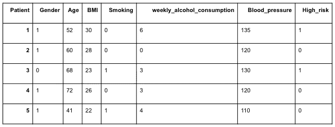
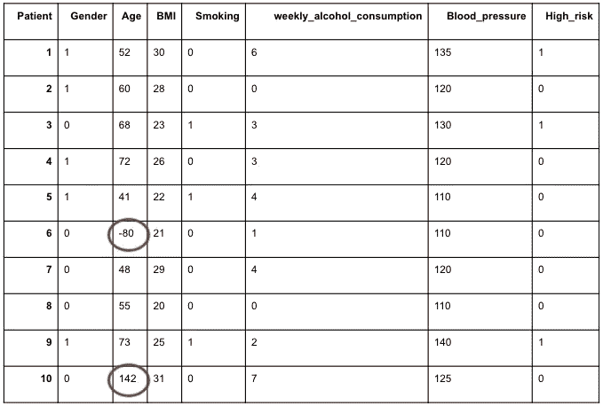
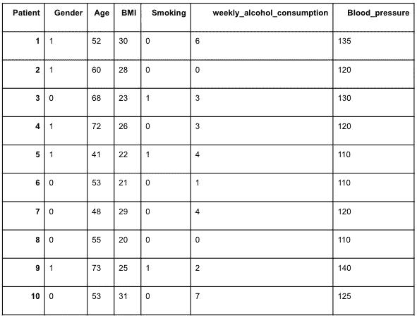

# 定制 Scikit-Learn 管道:编写自己的转换器

> 原文：<https://towardsdatascience.com/customizing-scikit-learn-pipelines-write-your-own-transformer-fdaaefc5e5d7>

## 如何使用管道并将定制的变压器添加到处理流程中


[SEO yeon Lee 在 Unsplash 上拍摄的照片](https://unsplash.com/photos/G1sY9Rl-nbY)

您是否正在寻找一种方法来组织您的 ML 流程，同时保持处理流程的灵活性？想要使用管道，同时将独特的阶段合并到数据处理中吗？本文是一个简单的分步指南，介绍如何使用 Scikit-Learn 管道以及如何向管道添加定制的变压器。

# 为什么是管道？

如果你作为一名数据科学家工作了足够长的时间，你可能听说过 Skicit-Learn 管道。您可能在从事一个混乱的研究项目，并以一个充满处理步骤和各种转换的巨大笔记本结束时遇到过它们，但不确定在最后的成功尝试中应用了哪些步骤和参数，产生了良好的结果。否则，如果您曾经有机会在生产中部署模型，您一定会遇到它们。

简而言之，管道是为数据科学家制造的对象，他们希望他们的数据处理和建模流程组织良好，并易于应用于新数据。即使是最专业的数据科学家也是人，记忆力有限，组织能力也不完善。幸运的是，我们有管道来帮助我们维持秩序、可复制性和…我们的理智。

这篇文章的第一部分是关于什么是管道以及如何使用管道的简短介绍。如果您已经熟悉管道，请深入研究第二部分，在那里我将讨论管道定制。

# 管道的简短介绍

管道是顺序转换的列表，后跟 Scikit-Learn 估计器对象(即 ML 模型)。管道为我们提供了一个结构化的框架，用于将转换应用于数据并最终运行我们的模型。它清楚地概述了我们选择应用的处理步骤、它们的顺序以及我们应用的确切参数。它迫使我们对所有现有的数据样本进行完全相同的处理，提供了一个清晰的、可复制的工作流程。重要的是，它使我们以后能够对新样本运行完全相同的处理步骤。每当我们想要将我们的模型应用于新数据时，这最后一点是至关重要的——无论是在使用训练集训练模型之后在测试集上训练我们的模型，还是处理新的数据点并在生产中运行模型。

## 如何应用管道？

对于这篇文章，我们将遵循一个简单的分类管道的例子:我们希望根据个人和健康相关的信息，确定明年患某种疾病的高风险个人。

我们将使用一个玩具数据集，包括一些相关的功能(这是一个人工数据集，我创建的目的只是为了演示)。

让我们加载数据，看看第一批患者:

```
import pandas as pdtrain_df = pd.read_csv('toy_data.csv', index_col = 0)
test_df = pd.read_csv('toy_data_test.csv', index_col = 0)train_df.head()
```



我们的预处理将包括缺失值的插补和标准缩放。接下来，我们将运行一个 RandomForestClassifier 估计器。

下面的代码描述了管道的基本用法。首先，我们导入必要的包。接下来，我们定义管道的步骤:我们通过向管道对象提供一个元组列表来做到这一点，其中每个元组由步骤名称和要应用的转换器/估计器对象组成。

```
# import relevant packeges
from sklearn.pipeline import Pipeline
from sklearn.preprocessing import StandardScaler
from sklearn.impute import SimpleImputer
from sklearn.ensemble import RandomForestClassifier# define our pipeline
pipe = Pipeline([('imputer', SimpleImputer()),('scaler', StandardScaler()), ('RF', RandomForestClassifier())])
```

然后，我们将管道拟合到训练数据，并预测测试数据的结果。在拟合阶段，保存每个步骤的必要参数，创建一个转换器列表，该列表准确地“记住”要应用的转换和要使用的值，然后是经过训练的模型。

最后，我们使用 predict()方法将整个管道应用于新数据。这将对数据进行转换，并使用估计器预测结果。

```
X_train = train_df.drop(columns = ['High_risk'])
y_train = train_df['High_risk']# fit and predict
pipe.fit (X_train, y_train)
pipe.predict (X_test)
```

如果我们希望拟合模型并在一个步骤中获得训练集的预测值，我们也可以使用组合方法:

```
pipe.fit_predict(X_train, y_train)
```

# 通过编写您自己的转换器来定制您的管道

正如我们已经看到的，流水线只是一系列转换器，后跟一个估计器，这意味着我们可以使用内置的 Scikit-Learn 转换器(如 SimpleImputer、StandardScaler 等)混合和匹配各种处理阶段。

但是，如果我们想要添加一个特定的处理步骤，而这个步骤并不是数据处理的常见步骤之一，该怎么办呢？

在这个例子中，我们试图根据个人和健康相关特征来识别在即将到来的一年中患某种疾病的高风险患者。在上一节中，我们创建了一个管道来估算缺失值，缩放数据，最后应用随机森林分类器。

然而，在查看完整数据集后，我们意识到其中一个特征(年龄)具有一些负值或可疑的高值:



经过一些调查，我们发现年龄字段是手动添加的，有时会包含错误。不幸的是，年龄是我们模型中的一个重要特征，所以我们不想忽略它。我们决定(仅在本例中…)用平均年龄值代替不太可能的值。幸运的是，我们可以通过编写一个转换器并将其设置在管道中适当的位置来做到这一点。

这里我们将编写并添加一个定制的 transformer:age imputr。我们的新流水线现在将在估算器和缩放器之前增加一个新步骤:

```
pipe = Pipeline([('age_imputer', AgeImputer()),('imputer', SimpleImputer()),('scaler', StandardScaler()), ('RF', RandomForestClassifier())])
```

## 怎么写变形金刚？

让我们从研究转换器的结构及其方法开始。

transformer 是一个 python 类。对于任何与 Scikit-Learn 兼容的转换器，它都应该包含某些方法:fit()、transform()、fit_transform()、get_params()和 set_params()。方法 **fit()** 拟合管道； **transform()** 应用变换；并且组合的 **fit_transform()** 方法拟合，然后将变换应用于相同的数据集。

Python 类可以方便地从其他类继承功能。更具体地说，我们的转换器可以从其他类继承其中的一些方法，这意味着我们不必自己编写它们。

get_params()和 set_params()方法继承自 BaseEstimator 类。fit_transform()方法继承自 TransformerMixin 类。这使我们的生活变得更容易，因为这意味着我们只需在代码中实现 fit()和 transform()方法，而其余的神奇功能将自行实现。

下面的代码演示了上述新估算转换器的 fit()和 transform()方法的实现。记住，我们希望我们的转换器“记住”年龄平均值，然后用这个值替换不可能的值。__init__()方法(也称为构造函数)将启动 transformer 的一个实例，使用最大允许年龄作为输入。fit()方法将计算并保存平均年龄值(四舍五入以匹配数据中年龄的整数格式)，而 transform()方法将使用保存的平均年龄值对数据进行转换。

```
# import packages
from sklearn.base import BaseEstimator, TransformerMixin# define the transformer
class AgeImputer(BaseEstimator, TransformerMixin):

    def __init__(self, max_age):
        print('Initialising transformer...')
        self.max_age = max_age

    def fit(self, X, y = None):
        self.mean_age = round(X['Age'].mean())
        return self

    def transform(self, X):
        print ('replacing impossible age values')
        X.loc[(X[‘age’] > self.max_age) 
              |  (X[‘age’] < 0), “age”] = self.mean_age
        return X
```

如果我们希望看到转换的结果，我们可以应用管道中的这一特定步骤，并查看转换后的数据:

```
age_scaled = pipe[0].fit_transform(X_train)
age_imputed
```

不出所料，不可能的值被基于训练集的平均年龄所取代。



一旦我们编写了转换器并将其添加到管道中，我们就可以正常地将整个管道应用到我们的数据中。

```
pipe.fit(X_train, y_train)
pipe.predict(X_test)
```

## 用更复杂的变压器来增加趣味

上面的例子描述了现实的一个简化版本，其中我们只想对现有的管道做一个小的改变。在现实生活中，我们可能想要给我们的管道添加几个阶段，或者有时甚至用定制的预处理转换器替换管道的整个预处理流程。在这种情况下，除了 fit()和 transform()方法之外，我们的新 transformer 类可能还具有用于各种处理阶段的附加方法，这些方法将应用于我们的数据。这些方法将在 fit()和 transform()方法中用于各种计算和数据处理。

但是我们如何决定哪些功能属于 fit()方法，哪些属于 transform()方法呢？

一般来说，fit 方法计算并保存我们进一步计算可能需要的任何信息，而 transform 方法使用这些计算的结果来更改数据。我喜欢一个接一个地检查转换阶段，想象我正在将它们应用到一个新的样本中。我将每个处理阶段添加到转换方法中，然后问自己以下问题:

1.  这个阶段需要原始数据中的任何信息吗？此类信息的示例包括平均值、标准偏差、列名等。如果答案是肯定的，那么必要的底层计算属于 fit()方法，而处理阶段本身属于 transform()方法。简单的 ImputeAge()转换器就是这种情况，我们在 fit()方法中计算平均值，并使用它来更改 transform()方法中的数据。
2.  这个处理阶段本身是否是提取后续处理阶段需要的信息所必需的？例如，理论上我可能有一个额外的下游阶段，它需要每个变量的标准差。假设我想计算估算数据的标准偏差，我必须计算并保存转换后的数据帧的标准值。在这种情况下，我将在 transform()方法和 fit()方法中包含处理阶段，但是与 transform()方法不同，fit()方法不会返回转换后的数据。换句话说，如果出于内部目的需要，fit()方法可以对数据应用转换，只要它不返回改变的数据集。

最后，fit()方法将依次执行所有必要的计算并保存结果，transform()方法将依次对数据应用所有处理阶段并返回转换后的数据。

就是这样！

## 总结一下…

我们从使用现成的变压器应用管道开始。然后，我们讲述了 transformers 的结构，并学习了如何编写一个定制的 transformer 并将其添加到我们的管道中。最后，我们回顾了决定转换器的“fit”和“transform”方法背后的逻辑的基本规则。

如果您还没有开始使用管道，我希望我已经让您相信管道是您的朋友，它们有助于保持您的 ML 项目有组织，不容易出错，可复制，并且易于应用到新数据。

如果你觉得这篇文章有帮助，或者如果你有任何反馈，我很乐意在评论中阅读它！