# 网络罪犯 vs 机器人

> 原文：<https://towardsdatascience.com/cyber-criminals-vs-robots-f60b8a86114a>

## 构建网络入侵检测和防御的集成模型

*除非另有说明，所有图片均为作者所有*

[链接](https://pixabay.com/illustrations/technology-sci-fi-futuristic-7111801/) ⁷

# 介绍

网络罪犯面对机器人会怎样？当他们使用机器人时会发生什么？随着人工智能的不断发展，网络安全的攻防策略将如何演变？人工智能和网络安全都年复一年地登上增长最快行业的排行榜。这两个领域在许多领域有重叠，而且毫无疑问在未来几年还会继续重叠。对于本文，我将范围缩小到一个特定的用例，入侵检测。入侵检测系统(IDS)是一种监控公司网络恶意活动的软件。我深入研究了人工智能在入侵检测系统中的作用，使用机器学习编写了我自己的 IDS 代码，并进一步演示了如何使用它来帮助威胁猎人。

# 问题定义

最近，不到一半的公司在其入侵检测系统中利用机器学习。最常见的 IDS 仅仅依赖于一种叫做“签名匹配”的技术。基于签名的入侵检测发现“可能匹配特定已知攻击者 IP 地址、文件哈希或恶意域的序列和模式”；然而，它在检测未知攻击方面有很大的局限性。许多网络罪犯了解签名匹配是如何工作的，并将改变他们的行为以避免被发现。虽然签名匹配已被证明是有用的，但在不断变化的网络威胁环境中，它本身并不是一个解决方案。相反，签名匹配必须辅之以适应性更强的解决方案:机器学习。使用来自网络流量的特征，机器学习不仅检测以前发生过的攻击，而且它足够动态以检测全新的攻击。

对于我的入侵检测算法，我想关注的具体问题是优化精度和召回率。在入侵检测环境中，错误会给组织带来巨大的成本。误报可能会导致未被发现的系统漏洞，从而带来潜在的灾难性后果。过多的恶意样本误报警报会降低对系统的信心，并将关键安全人员引向死胡同，导致他们降低优先级，无法缓解实际攻击。量化和优化这种权衡是另一个独立的研究项目，可能因组织而异。在本文中，我假设假阴性比假阳性更糟糕，但尽量减少两者。在评估结果时，我试图根据组织的加权成本来量化这种关系，假设假阴性的成本是假阳性的两倍。

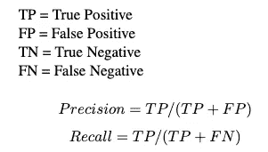

# 数据

对于这个项目，我使用了⁴的 NSL-KDD 数据集，这是 1999 年 KDD Cup 数据集的改进版本。该数据由模拟美国空军局域网环境的局域网(LAN)中 9 周的原始 tcpdump 流量组成。该数据集中的特征是根据原始 tcpdump 设计的。大多数特性描述可以在[这里](https://kdd.ics.uci.edu/databases/kddcup99/task.html)和[这里](https://www.aldapa.eus/res/gureKddcup/README.pdf)找到。每行代表给定时间点的网络流量样本，每个网络样本可以标记为“恶意”或“良性”,并分为攻击类别 DoS(拒绝服务)、R2L(远程到本地)、U2R(用户到根)和探测。

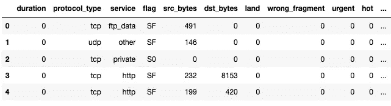

NSL-KDD 数据预览

# 相关著作

这个项目的灵感来自大卫·freeman⁴.的《机器学习安全》一书在网络流量分析一章中，Chio 和 Freeman 探索了一种用于入侵检测的集成方法。最终的结果是一个在召回方面表现很好的系统，但是在 precision⁵.方面却没有达到标准我的系统考虑并实现了他们的许多策略，对它们进行优化以提高精确度和召回率。他们的集合模型的结果，如下图所示，将作为基线。

***准确度* : 85%**

分类报告:Chio/Freeman 模型

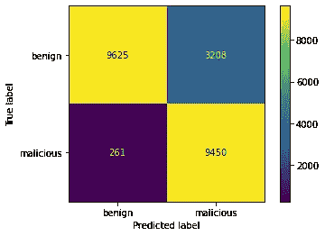

分类报告:Chio/Freeman 模型

# 方法学

## 特征选择

1.  对连续、二元和标称列进行分类
2.  删除只有 1 个值的所有要素。num_outbound_cmds 只有一个唯一值，所以我将其从数据集中删除。
3.  根据属性类型验证数据(su_attempted 应该是一个二进制属性，但有 3 个值)
4.  一次性编码分类变量

## 重采样

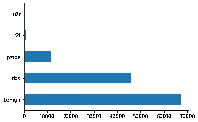

培训:攻击类别分布

为了最大限度地提高召回率，并创建一个适用于不常见和看不见的攻击的模型，我需要确保这些不常见的攻击在训练数据中得到更好的体现。如上所述，尽管恶意和良性标签分布相当均匀，但在我们的训练数据中，攻击类别的分布非常不均匀。为了增加一些少数类的表示并减少一些多数类的表示，我采用了一种结合过采样和 undersampling⁵.的重采样方法

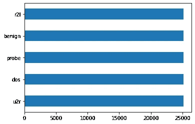

训练:重新采样的攻击类别分布

使用不平衡学习中的 SMOTE ⁰和 RandomUnderSampler 类，我现在有了一个平衡的训练集。

## 预测攻击类别—多类建模

我专注于入侵检测；但是，识别正确的攻击类别将有助于威胁猎人进行入侵防御。我在训练数据上交叉验证了 4 个分类模型，比较了准确性。

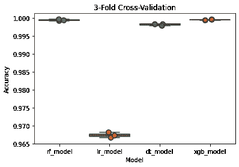

多类别三重交叉验证

树模型的表现比线性模型(逻辑回归)好得多，其中 XGBoost 的结果最好。

在整个训练集上拟合 XGBoost 模型并预测测试结果，我得到以下结果:

***准确率* : 79%**

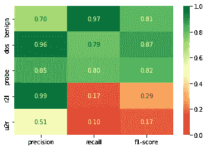

XGBoost 多分类器:多类结果

XGBoost 在识别探测和拒绝服务攻击方面做得很好，但在 R2L 和 U2R 方面缺乏召回，这在初始训练集中较少出现。重采样有助于改善这种情况；然而，这些类的训练属性不足以代表测试数据。

将攻击类别分为恶意攻击和良性攻击，以下是二进制结果:

**T5 精度 : 81%**

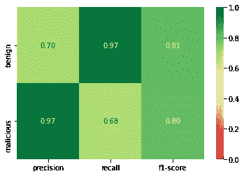

分类报告:XGBoost 多分类器

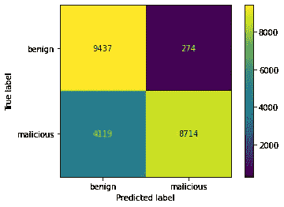

混淆矩阵:XGBoost 多分类器

攻击类别的多类分类在识别攻击类别方面做得不错；然而，它识别恶意样本的召回率太低。我决定将重点更多地放在入侵检测而不是攻击分类上，但在选择算法时仍然重视上面的结果。我将把它作为前进的基线，并把它合并到仪表板中。

## 入侵检测—二元分类

**特征减少**

我决定通过 SelectPercentile⁶减少特征的数量，执行 ANOVA 测试并返回特征的 f 值，以确定它们与目标向量的独立相关性。经过一些试验，我决定根据 F 值保留前 33%的特性。

**模型选择的指标**

因为我计划在入侵检测的上下文中优化精确度和召回率，所以在所有阈值下最大化模型的性能是很重要的。因此，受试者工作特征(ROC)曲线下面积(AUC)是在选择模型时最大化的合适指标。ROC 曲线描绘了真阳性率(TRR)对假阳性率(FPR)。这条曲线下的区域将告诉我们随机选择的恶意示例比随机选择的良性示例得分更高的概率。

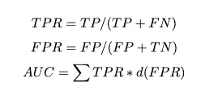

在使用 5 重交叉验证比较不同模型的 AUC 后，森林模型优于其他模型，尤其是 XGBoost。

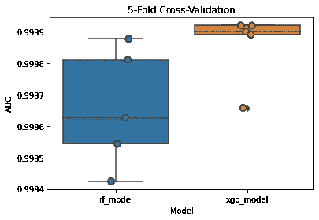

下面我建立了一个管道来标准化这些特性，用 SelectPercentile 减少它们，并使数据适合 XGBoost 分类器。

**阈值选择**

我将数据分为训练和验证，将模型拟合到训练数据，并绘制验证结果的 ROC 曲线。

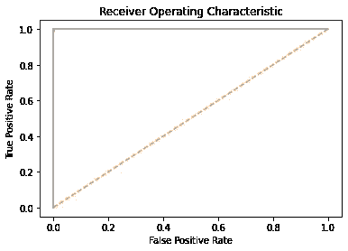

受试者工作特征曲线

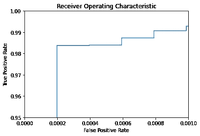

ROC 曲线(放大)

请记住，我们的目标是最大限度地提高精确度和召回率，重点是召回率。这将最大限度地减少通过检测系统的攻击数量，而不会因为标记太多的误报而牺牲算法的完整性。如上所述，我可以调整阈值来提高真阳性率，而不会显著增加假阳性率。设置真阳性率为 1 的阈值意味着没有假阴性；因此，该模型会标记每一个恶意样本。为此，我选择了最佳阈值 0.0050058886，创建了 100%的验证召回率和 98%的精确度。当预测恶意样本时，这意味着根据模型的预测概率，任何具有至少 0.5%的恶意概率的样本都会被标记为恶意样本。

让我们来看看这个模型的测试结果。

***准确率* : 90%**

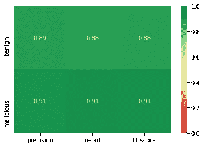

分类报告:带阈值的 XGBoost

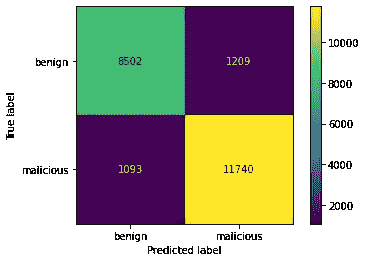

混淆矩阵:带阈值的 XGBoost

到目前为止，该模型的准确率比 Chio/Freeman 模型提高了 5%，准确率提高了 16%，召回率降低了 6%。

我想进一步探索在保持高精度的同时提高召回率的方法。想想网络攻击模式，许多攻击者会创建新的恶意软件，这些恶意软件要么与以前的版本略有不同，非常不同，要么是全新的零日漏洞利用。那么，机器学习算法如何标记这些没有在训练数据中表示的实例呢？我转向异常检测。在试验了许多不同的算法之后，我认为集群是最好的方法。

## 使聚集

我的目标是用聚类模型来补充分类模型。理想情况下，聚类模型应该能够挑选出一些被分类模型错误标记的恶意样本。在这个模型中，更重要的是平衡精确度和召回率，因为只有当聚类的预测足够精确以覆盖分类器的预测时，聚类才能很好地补充分类。为了在这种情况下最大限度地提高精确度和召回率，我求助于 F1 分数。

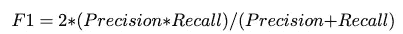

首先，我在 2D 向量空间中画出了训练集的类。

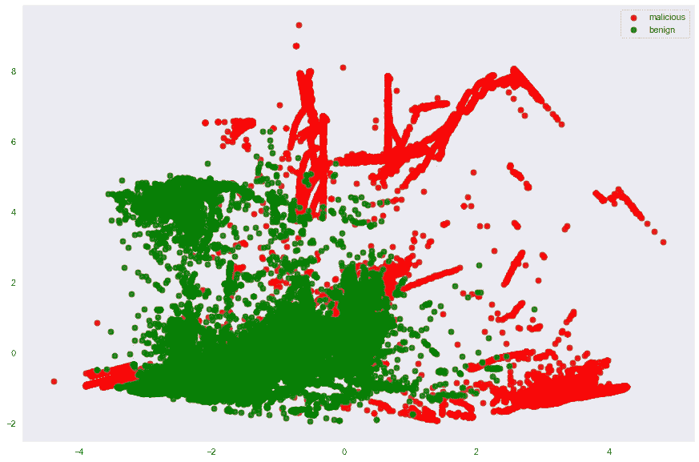

实际的

乍一看，这些聚类看起来没有很好地定义，但是我可以使用聚类来检测一些明显的异常值。

接下来，我拟合了一个简单的 2-聚类 K-均值模型，使用主成分分析(PCA)来降低维度。

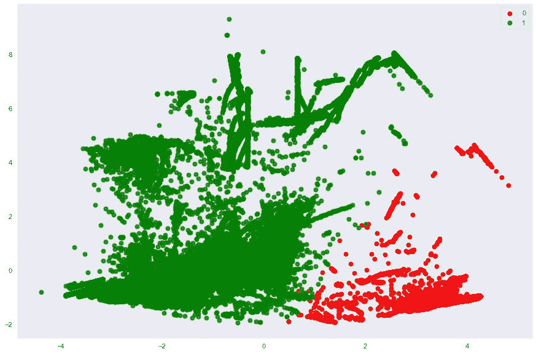

预测:2 类 K 均值模型

双聚类模型在表示实际类方面做得很差。我的下一个方法是试验更多的集群，并优化一个策略，将它们映射回恶意或良性。

在对集群数量和策略参数进行多次迭代后，我拟合了一个 27 集群模型。

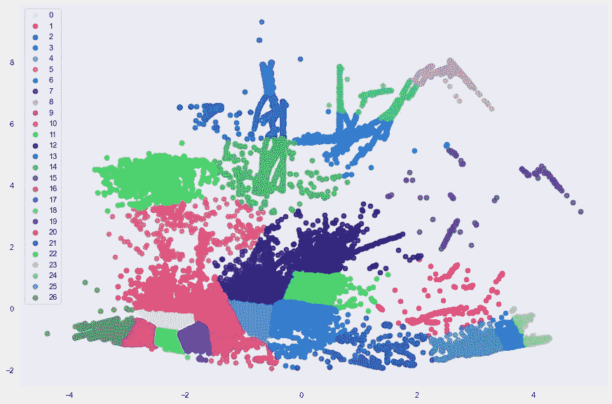

预测:27 簇模型

这里的集群看起来比双集群模型更加集中和清晰。那么，我的策略是什么，我如何将这些集群映射到良性和恶意的类别标签？这两个问题只有一个答案:

受 Chio 和 Freeman⁴的启发，这种聚类映射技术包括异常检测和恶意样本的多数类标记。

**策略:**

*   如果群集中恶意流量的百分比大于 95%，则群集中的所有实例都会被标记为恶意。
*   如果相对于总人口的群集大小小于 0.1%，则群集中的所有实例都被标记为恶意实例。

这与 Chio 和 Freeman 的模型不同，因为它细化了群集数量、恶意流量百分比和相对群集大小的参数，以最大化 F1 分数。此外，我的方法只关注于标记恶意实例，而没有在逐簇 basis⁴.上使用机器学习模型

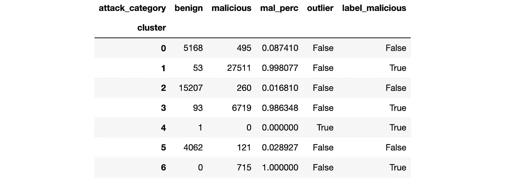

前 6 个集群的集群映射表

来自该策略的每个恶意标签可以追溯到多数恶意聚类或离群点，这将在稍后的模型可解释性中有用。根据该策略映射聚类后，这里是 2D 向量空间中预测值与实际值的并排比较。

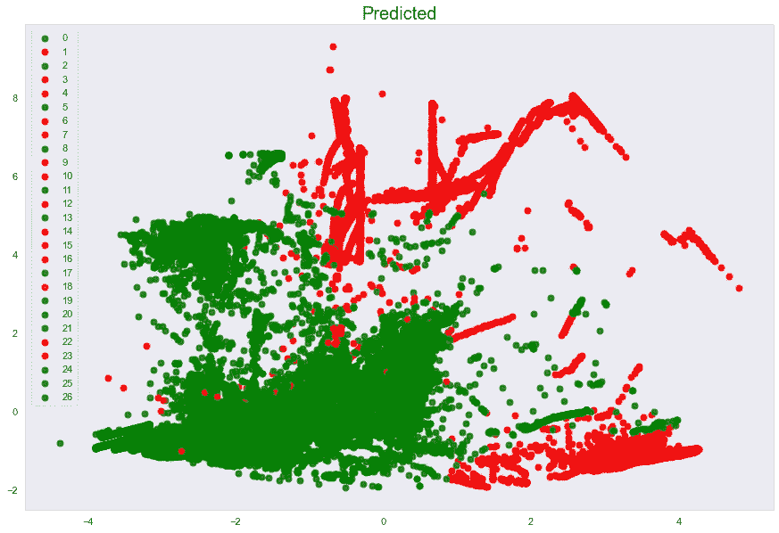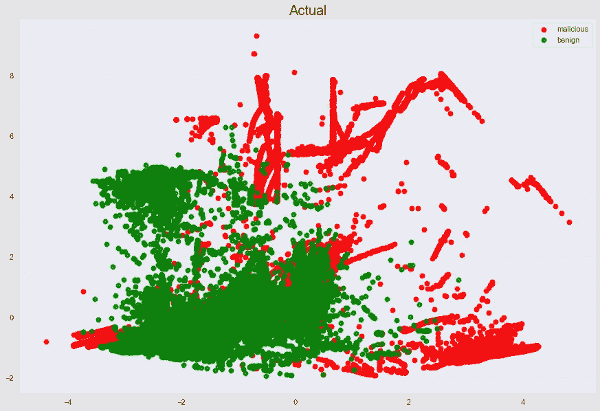

k-均值映射预测与实际标签

映射后，预测和标签看起来几乎相同。

## 创建集成模型:结合分类和聚类

我将 XGBoost 模型与 K-Means 模型相结合的方法是覆盖任何 XGBoost 将样本标记为良性，而 K-Means 方法将样本标记为恶意的情况。

## 估价

最终模型的结果如下:

***准确率* : 90%**

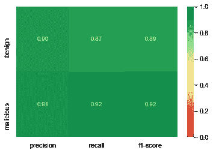

分类报告:集合模型

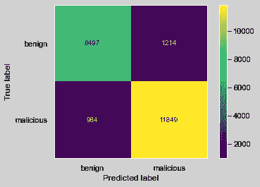

混淆矩阵:集合模型

在 XGBoost 模型中增加聚类功能可以在保持精确度的同时提高恶意流量的召回率。算法以仅误标 5 次的小代价发现了 109 次新的恶意攻击；从而提高分类器性能，而不降低其完整性

在我将这个模型与我讨论过的其他基线模型进行比较之前，定义一个成本函数是很重要的。网络攻击的成本或影响本身是一个完整的研究领域，有许多变量。为了最终在未来扩展这项研究，我在本文中定义的成本函数是一个临时的启发。

基于未被发现的网络攻击比假警报更糟糕的逻辑，我假设假阴性的成本是假阳性的两倍。我假设一个组织的平均假警报成本是 1000 美元；因此，未被发现的网络攻击的平均成本是 2000 美元的两倍。

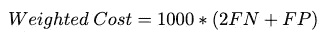

价值函数

**结果**

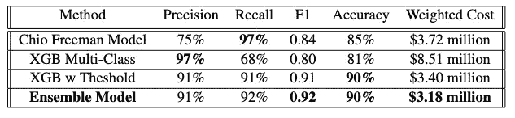

从左到右，很明显，映射到二进制标签的 XGBoost 多类预测器具有 97%的最高精度。不幸的是，这种模式在所有其他领域都表现不佳。将集合模型与 Chio Freeman 模型的主基线进行比较，精度提高了 16%，表明入侵检测系统标记样本的置信度提高了。Chio Freeman 模型仍然以 97%的召回率优于其他模型，我的 ensemble 模型以 92%的召回率紧随其后。我认为这方面仍有改进的余地。整体模型的 F1 分数优于其他模型，阈值化的 XGBoost 模型以 0.91 紧随其后。集合模型比 Chio Freeman 基线高出 0.05。F1 的高分实现了我优化精确度和召回率的目标。整体模型和阈值 XGBoost 模型在准确性上非常相似，二者的舍入准确性都为 90%。最后，ensemble 模型在加权成本方面优于其他模型，比第二好的模型便宜 220，000 美元，比 Chio Freeman 模型便宜 540，000 美元。

**讨论**

虽然我的模型通过实现最高的 F1 分数优化了精确度和召回率，但是我没有在入侵检测的上下文中优化这些指标的具体测量。请记住，我的成本函数是一个临时的启发。不同的攻击类别、网络架构、系统和组织有不同的成本。这些都应该是建模新成本函数的考虑因素。例如，探测攻击通常不会给组织造成很大损失，因为它们通常用于监视网络而不是破坏网络。此外，一次成功的拒绝服务攻击可能会让脸书损失 300 万美元，而当地一家咖啡连锁店只需 2000 美元。由于并非所有这些数据都是现成的，我的下一步将是研究每种攻击类别的平均成本，并将其包括在计算中。之后，我会调整误报的成本，考虑平均人工成本、错过实际攻击的机会成本，甚至可能是贬值的模型信心的成本。

# 可解释性

我的系统现在可以很好地识别攻击。下一步是以自动化的方式解释这些预测，帮助网络防御保护他们的基础设施。可解释的入侵检测系统可以为威胁猎人指出正确的方向。

使用 [streamlit](https://streamlit.io/) python 库，我创建了一个概念验证[仪表板](https://shaeferd-network-traffic-prediction-detection-dashboard-wo3p21.streamlitapp.com/)，展示了入侵检测系统如何通过标记攻击、按风险对攻击进行优先级排序以及向威胁猎人推荐具体的补救路径来充当入侵防御系统。

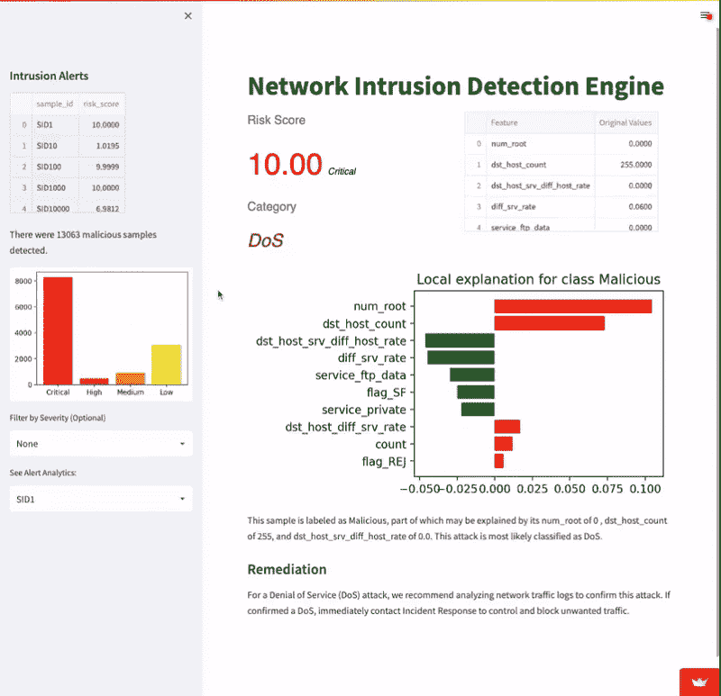

IDS 仪表板

## **口译模特**

为了解释集成模型的恶意预测，我必须自动解释 XGBoost 分类器和 K-Means 聚类算法。

*XGBoost* :对于 XGBoost，一种选择是提取特征重要性，并潜在地用线性模型拟合数据，以帮助确定方向性。在像 XGBoost 这样复杂的森林模型中，这不是底层模型的最佳表示。XGBoost 模型的完美解释是绘制决策树森林；然而，绘制一个完整的复杂的森林图是很难的，并且对于需要快速工作的安全团队来说也是不切实际的。我求助于软件包 LIME(本地可解释的模型不可知解释),它近似了特定 instance⁸.附近的模型行为我选择 LIME 是因为它将复杂的模型分解成易于理解的局部近似和估计。

对于我的 IDS，LIME 可以对标记为恶意的样本 XGBoost 给出本地解释。下表显示了标记特定样品时最重要的 10 个特征、特征权重和方向性。

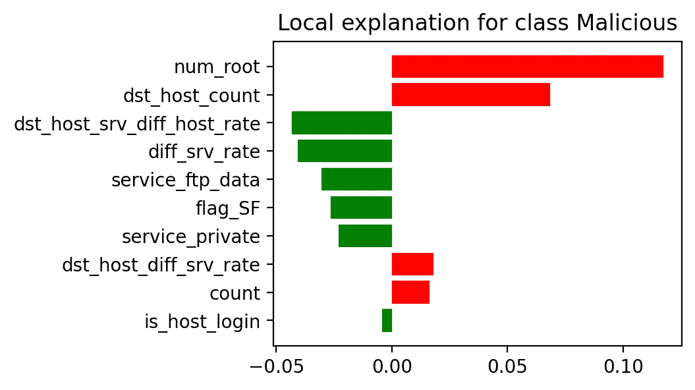

为了预测类别，我使用前面讨论的多类 XGBoost 模型。

*K-Means* :为了解释 K-Means 模型，我首先识别预测的聚类。接下来，我绘制了每个聚类中心的热图，显示了所有特征的相对值，并突出显示了该样本的聚类。就绝对值而言，聚类中心向量中某个特征的高值被视为重要特征，并包含在特征值表中。

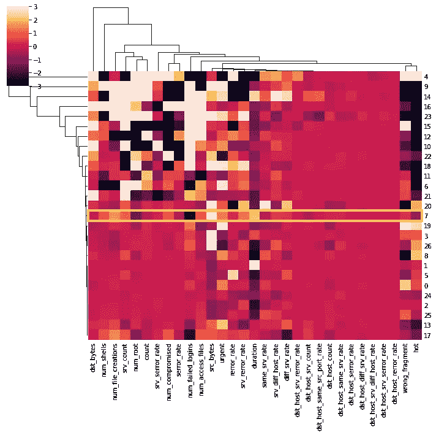

为了预测类别，我采用每个集群中最常见的攻击类别，除非它是一个离群的集群。

## **风险**

我将风险计算为 XGboost 模型预测样本是恶意的概率，标准化为 1 到 10。我根据国家漏洞数据库的 cvss v3.0 版影响严重性 mappings⁹.将这些风险分值映射到严重性

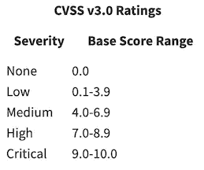

将风险分值映射到测试人群的严重性会产生以下分布。

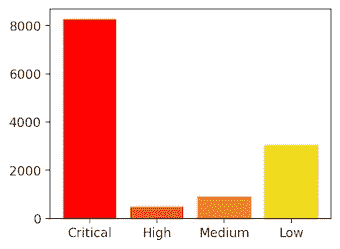

测试集的严重性分布

这里有许多严重程度标志，低是第二高的。仪表板为威胁猎人提供了按严重性过滤的选项，允许他们优先考虑更高严重性的标志。

## 补救

将入侵检测系统转变为入侵防御系统的最后一步是为威胁猎人指明正确的方向，并提供补救途径。通过查看条形图或热图中突出显示的重要特征，威胁猎人可能会对攻击是如何被检测到的以及问题的根源有一个大致的了解。除了这些图表之外，仪表板还提供了前 3 个最重要特征的值以及样本可能属于的攻击类别。对于每个攻击类别，我都提供了一个补救途径，这是威胁猎人或安全分析师在验证和补救每个攻击时应该采取的措施的建议。

从开始到结束，仪表板允许任何威胁猎人快速检测攻击，确定它们的优先级，识别要调查的关键特征，预测所述攻击的类别，并为特定攻击提供补救策略。

在这里，我将通过几个例子来演示如何使用仪表板。

***例#1***

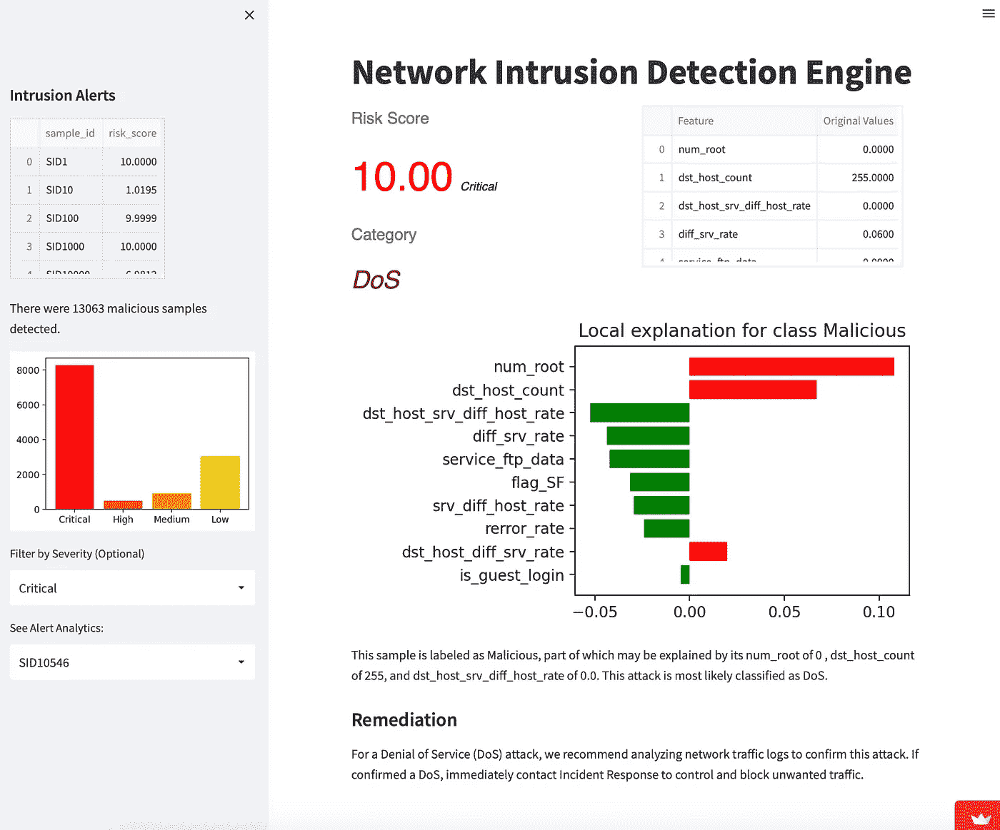

在本例中，威胁猎人希望专注于关键攻击。他将严重性过滤为严重，并选择网络流量的标记样本。该样本的风险分值最高，为 10 分。这很可能是拒绝服务攻击，这对于威胁猎人来说是有意义的，因为他可以看到有 255 个连接到同一个目的 IP 地址(“dst_host_count”)。根据仪表板的建议，威胁猎人调查网络流量日志中的这些连接，确认它们来自已知的僵尸网络，并验证这是一种拒绝服务攻击。他立即通知事件响应和网络安全部门阻止这些连接并转移流量。

***例二***

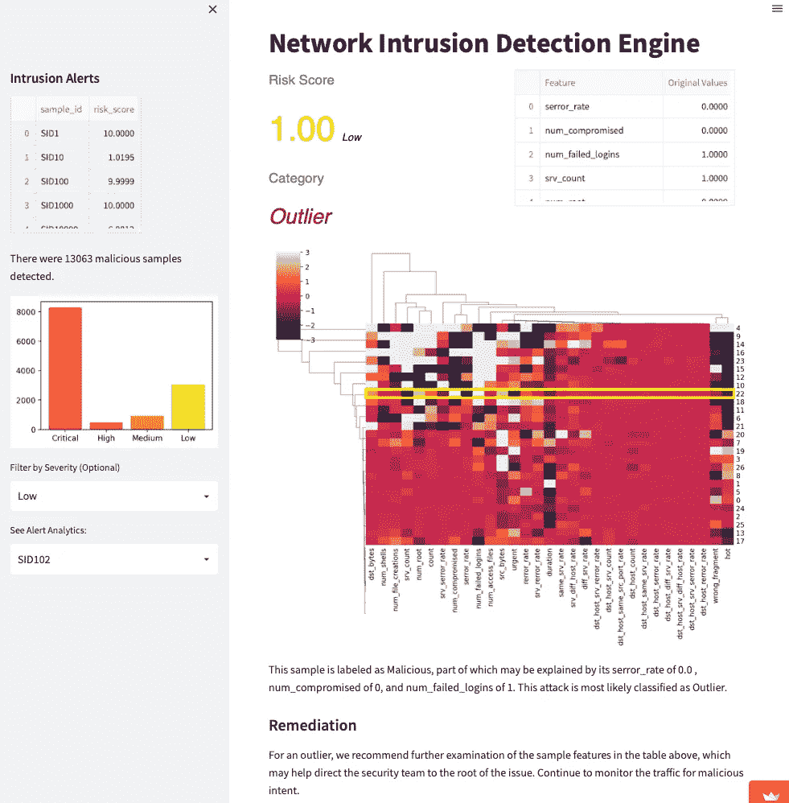

在处理完当天的高优先级问题后，安全分析师的任务是调查一些已经在队列中等待了一段时间的低优先级项目。他注意到这个样本是一个异常值，并希望进一步调查。根据仪表板的建议，他调查了哪些功能可能会导致该流量被标记。他认为失败的登录尝试增加了系统的怀疑。他监视该用户的活动，并注意到更多失败的登录尝试，这些尝试通常是在工作时间之外通过远程连接进行的。分析师与系统管理员合作，通过要求通过跳转服务器进行远程连接并添加双因素身份认证来加强服务器的安全性。失败的登录尝试次数在接下来的一周内逐渐减少。

**讨论**

在指出仪表板和可解释性模型中需要改进的地方时，我想参考风险分值计算、多类别模型、补救路径协调以及构建生产就绪仪表板。

我使用了一种临时的启发式方法来衡量风险。这应根据行业标准进行调整，并根据攻击类别和主机系统进行不同的加权。此外，应该有更好的方法来量化 K 均值预测的风险。

另一个下一步是改进预测攻击类别的多类 XGBoost 模型。我决定更多地关注入侵检测而不是攻击分类，但我最终还是在仪表板中加入了多类模型来帮助威胁猎人。改进模型的一个方法是从训练集中去掉良性样本，只标记恶意样本，因为我已经有了一个 IDS。改进此模型可以以最少的工作获得最大的收益，并增加对仪表板预测类别和补救途径的信心。

说到这里，补救路径应该由主题专家来定义。虽然我尽我所知编写了补救措施，但我希望听取有经验的威胁分析师的意见，以完善建议并提供新的建议。

如果是为组织构建，最后一步是在生产环境中设置仪表板。这将意味着建立一个 ETL 来从系统的网络流量中提取相关的特性，将其流式传输到仪表板，实时更新仪表板，并结合一个反馈回路来重新调整模型。

# 结论

通过集成模型，我实现了优化精度和召回率的目标。使用结合了 XGBoost 和 K-Means 的高级集成，我能够在许多领域超越他人，包括我定义的加权成本指标。由于一些模型仍然比我的模型有优势，而且加权成本指标是一种主观的启发，我不能客观地声称我的模型整体上优于其他模型。尽管如此，这个模型确实实现了我的既定目标。

我相信这个项目的主要收获是，人工智能是一种有价值的工具，可以在入侵检测方面帮助网络安全团队。机器学习是针对 IDS 规避技术和这一领域中不断发展的威胁因素的强大解决方案。此外，这些模型可以与安全团队相互帮助。它们有能力检测大量人类无法自己模式化的威胁，为威胁猎人指明正确的方向，并融入用户反馈以适应新的场景。

那么当网络罪犯面对机器人时会发生什么？这个问题应该重新定义。人工智能在检测大量威胁的能力方面非常出色，但它也有许多弱点，如模型退化、容易中毒和被黑客攻击，以及无法自动修复复杂或看不见的攻击。人类缺乏实时处理如此大量数据的能力，但拥有追踪和阻止一些最复杂的网络犯罪所需的创造力和商业头脑。机器学习模型可以填补网络响应团队的许多空白，反之亦然。入侵检测系统和威胁猎人相互补充，以创建一个更强大的系统。因此，问题应该是，“当网络罪犯面对电子人时会发生什么？”当人类和人工智能一起抵御网络犯罪时，威胁行为者可能不会喜欢这个答案。

[*链接到代码*](https://github.com/shaeferd/Network-Traffic-Prediction)

[链接到仪表板](https://shaeferd-network-traffic-prediction-detection-dashboard-wo3p21.streamlitapp.com/)

[我的网站](http://shaeferdrew.com)

***参考文献***

1.  费尔德曼，莎拉和菲利克斯·里克特。“检测安全入侵是 2018 年最热门的人工智能应用。” *Statista 信息图*，Statista，2019 年 4 月 5 日，[https://www . Statista . com/chart/17630/artificial-intelligence-use-in-business/。](https://www.statista.com/chart/17630/artificial-intelligence-use-in-business/.)
2.  雷塞克迈克尔。"基于特征和基于行为的入侵检测系统有什么区别？" *Accedian* ，Accedian，2022 年 6 月 29 日，[https://Accedian . com/blog/what-is-the-difference-based-and-behavior-based-ids/。](https://accedian.com/blog/what-is-the-difference-between-signature-based-and-behavior-based-ids/.)
3.  Mahbod Tavallaee 等人，“KDD 杯 99 数据集的详细分析”，*第二届 IEEE 安全和国防应用中的计算智能研讨会会议录*(2009):53–58。
4.  齐奥、克拉伦斯和大卫·弗里曼。*机器学习和安全:用数据和算法保护系统*。奥莱利媒体公司，2018 年。
5.  你好，克拉伦斯。"图书资源/NSL-KDD-分类. ipynb at Master Oreilly-ml sec/图书资源." *GitHub* ，Oreilly，[https://GitHub . com/Oreilly-ml sec/book-resources/blob/master/chapter 5/nsl-KDD-classification . ipynb .](https://github.com/oreilly-mlsec/book-resources/blob/master/chapter5/nsl-kdd-classification.ipynb.)
6.  " sk Learn . feature _ selection . select percentile . "*sci kit*，Scikit-Learn，[https://sci kit-Learn . org/stable/modules/generated/sk Learn . feature _ selection . select percentile . html .](https://scikit-learn.org/stable/modules/generated/sklearn.feature_selection.SelectPercentile.html.)
7.  [https://pix abay . com/插图/科技-科幻-未来派-7111801/](https://pixabay.com/illustrations/technology-sci-fi-futuristic-7111801/)
8.  "局部可解释的模型不可知解释(LIME). "*本地可解释的与模型无关的解释(Lime) — Lime 0.1 文档*，GitHub，[https://lime-ml.readthedocs.io/en/latest/.](https://lime-ml.readthedocs.io/en/latest/.)
9.  “漏洞指标。”*https://nvd.nist.gov/vuln-metrics/cvss.*NVD[NVD](https://nvd.nist.gov/vuln-metrics/cvss.)
10.  “击杀。” *SMOTE —版本 0.9.1* ，不平衡学习，[https://不平衡学习. org/stable/references/generated/imb Learn . over _ sampling . SMOTE . html](https://imbalanced-learn.org/stable/references/generated/imblearn.over_sampling.SMOTE.html.)
11.  "随机抽样器" *RandomUnderSampler —版本 0.9.1* ，不平衡学习，[https://unbalanced-Learn . org/stable/references/generated/imb Learn . under _ sampling . RandomUnderSampler . html .](https://imbalanced-learn.org/stable/references/generated/imblearn.under_sampling.RandomUnderSampler.html.)
12.  增长最快的工作部门:人工智能、数据科学和网络安全。*招聘能力*，招聘能力，2020 年 3 月 23 日，[https://www . therecruitability . com/ai-data-science-and-cyber security-Americas-fast-growth-jobs-sections/。](https://www.therecruitability.com/ai-data-science-and-cybersecurity-americas-fastest-growing-jobs-sectors/.)
13.  “简化文档”*细流文档*，细流，[https://docs.streamlit.io/.](https://docs.streamlit.io/.)
14.  " NSL-KDD 数据集."*新不伦瑞克大学 Est.1785* ，https://www.unb.ca/cic/datasets/nsl.html. UNB