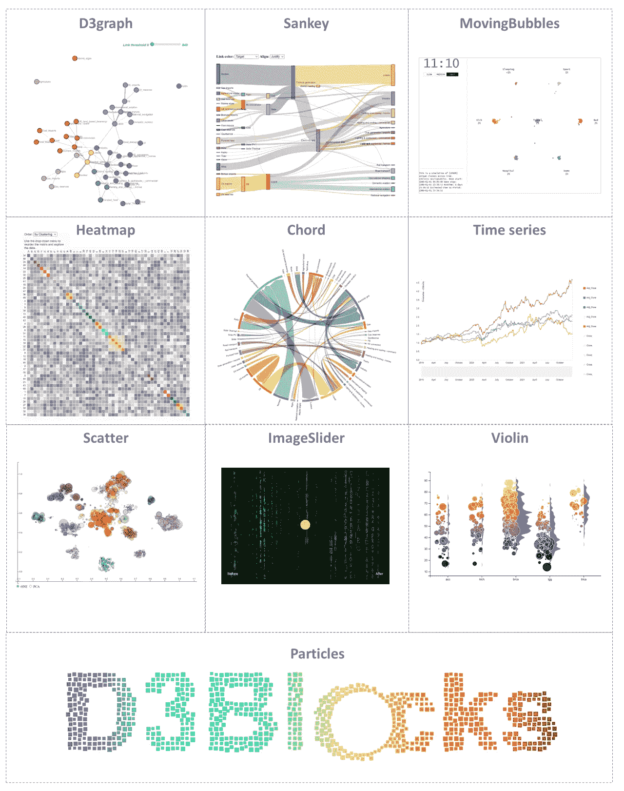
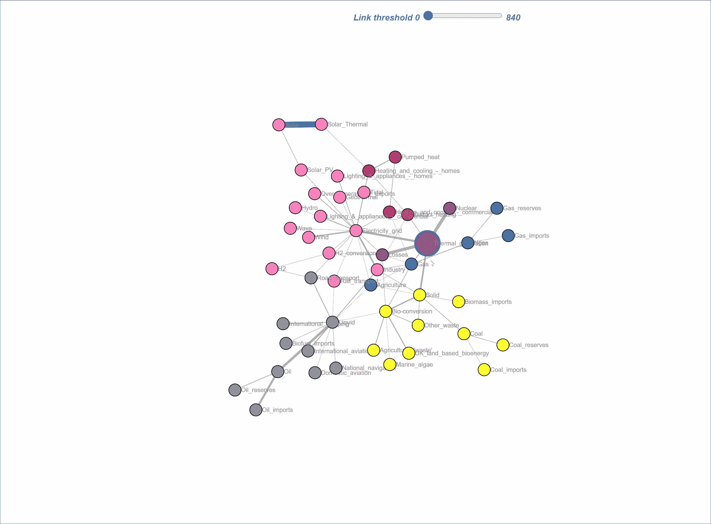
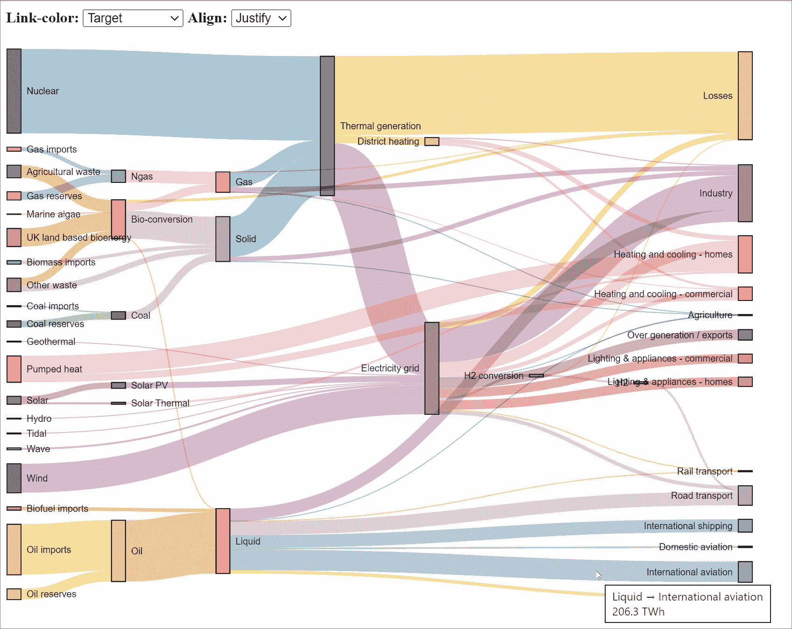
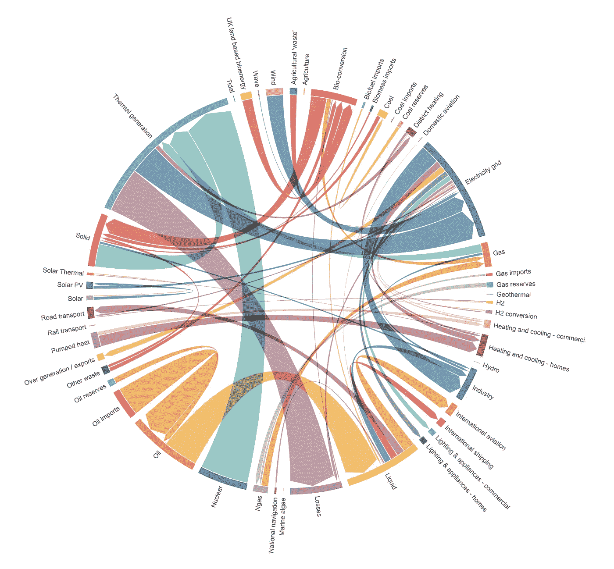
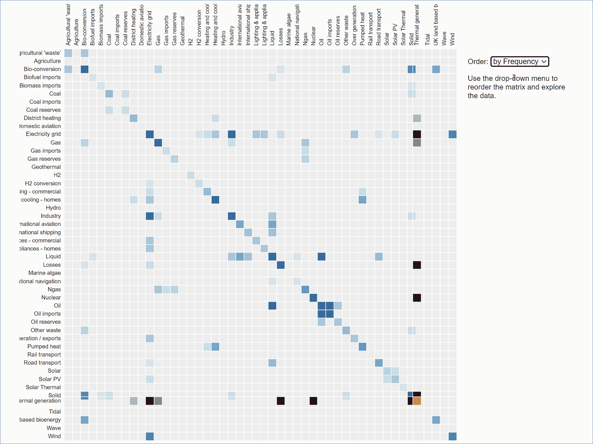
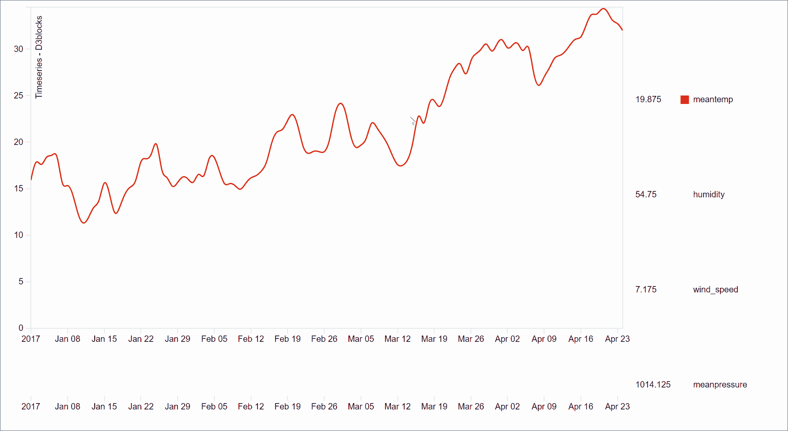
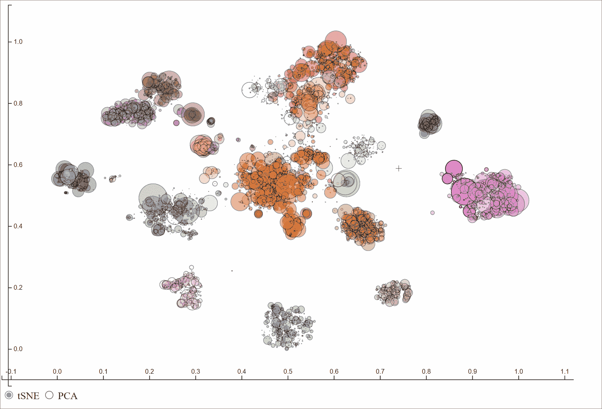
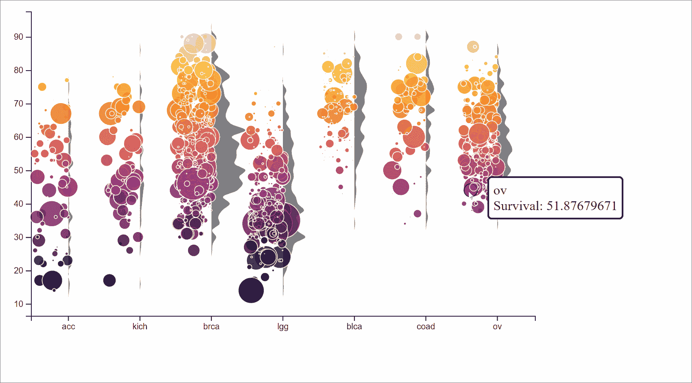
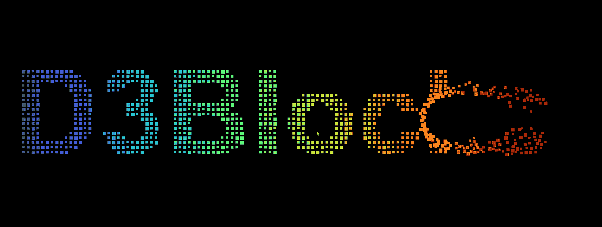

# D3Blocks:Python 库，用于创建交互式和独立的 D3js 图表。

> 原文：<https://towardsdatascience.com/d3blocks-the-python-library-to-create-interactive-and-standalone-d3js-charts-3dda98ce97d4>

## 创建交互式的、独立的、视觉上吸引人的图表，这些图表建立在 d3 javascript (d3js)的图形之上，但是可以用 Python 进行配置。



D3Blocks 中支持的前十个块。(图片由作者提供)。

Python 已经成为分析和可视化数据的最流行的编程语言之一。可视化可能是项目成功的关键，因为它可以揭示数据中隐藏的见解，并提高理解。理解和解释数据的最好方法是让它具有交互性。尽管 Python 中提供了许多可视化软件包，但创建美观、独立、交互式的图表，并且在您自己的机器之外也能工作，仍然具有挑战性。在[之前的博客](/creating-beautiful-stand-alone-interactive-d3-charts-with-python-804117cb95a7)中，我已经展示了如何为*网络图*创建一个独立的交互式图表。 ***用 D3Blocks 我们超越了单一的图表******创造了一个框架*** 现在包含了*****漂亮的图表*** 。它是开源的，不需要安装除 Python 之外的任何东西来创建 D3 图表。输出是一个交互式图表，你只需要一个(互联网)浏览器；分享和发布因此变得超级容易。 ***在这篇博客中，我将介绍一下 D3Blocks，并结合动手实例简单描述一下这 10 个 Blocks。*****

***如果你觉得这篇文章很有帮助，可以使用我的* [*推荐链接*](https://medium.com/@erdogant/membership) *继续无限制学习，并注册成为中级会员。另外，* [*关注我*](http://erdogant.medium.com) *保持我的最新内容！***

# **何必用 D3.js 呢？**

**近年来，Python 社区开发了一系列令人印象深刻的可视化库，如 [Matplotlib](https://mode.com/blog/python-data-visualization-libraries/#matplotlib) 、 [Seaborn](https://mode.com/blog/python-data-visualization-libraries/#Seaborn) 、 [Bokeh](https://mode.com/blog/python-data-visualization-libraries/#Bokeh) 、 [Plotly](https://mode.com/blog/python-data-visualization-libraries/#Plotly) 、[follow](https://mode.com/blog/python-data-visualization-libraries/#Folium)等等。一些库也允许图形是交互式的，但是在这种情况下，它们仍然需要来自 Python 或其他 web 服务的服务来保持运行。d3 的优势在于它的高性能、可深度定制的图表，并且它符合 web 标准。名称" *D3* "是***D****ATA-****D****riven****D****documents，*是一个用于生成动态、交互式数据可视化的 Javascript 库，它速度快、看起来漂亮，并且可以添加您所有的创意。此外，除了浏览器之外，您不需要任何其他技术来绘制图表。**

> **“D3 帮助您使用 HTML、SVG 和 CSS 将数据变为现实。D3 对 web 标准的重视使您可以获得现代浏览器的全部功能，而无需将自己束缚于专有框架，将强大的可视化组件和数据驱动的 DOM 操作方法结合起来。”——[d3js.org](https://d3js.org/)**

*****D3*** 也叫 ***D3.js*** 或 ***d3js。*** 我将这两个名字互换使用。**

# **使用 d3Blocks 创建独立的 D3 图表非常简单。**

**我刚刚提到了 d3 的优点，但也有缺点。首先，要将你的创意转化为图表，你需要熟悉 SVG、HTML、CSS 和 Javascript。但是即使你这样做了，d3js 图表也不容易概括不同的数据集。换句话说，d3js 脚本通常是一个静态脚本，它被优化为显示一个特定数据集的结果。更改数据集需要更改各种参数，例如轴的最小值/最大值、列名，很可能还需要更改图表的方向和位置。**

**使用 D3Blocks，我们通过将数据转换成适合下游 d3js 脚本的格式来克服这些挑战。此外，所有必需的参数，(列)命名、格式、定位、方向等。也是经过的。以这种方式，我们可以利用两个世界的优势；Python 用于数据管理、预处理、分析、建模，d3js 用于可视化。在[之前的博客](/creating-beautiful-stand-alone-interactive-d3-charts-with-python-804117cb95a7)中，我展示了如何将 d3js 与 Python 相结合，在 D3Blocks 中，我们超越了单一的图表。**

# **D3Blocks 中的第一个 blocks 准备好了！**

**对于每个开发的区块(或图表)，都有一个 Python 部分和一个 d3js 部分。d3js 部分以这样一种方式开发，它可以处理具有不同属性的不同数据集，但依赖于 Python 部分。输出是一个 HTML 文件，其中包含一组特定于图表的 d3 库。**

> **D3Blocks 创建的每个图表都完全封装在一个 HTML 文件中，这使得共享和发布成为可能，除了浏览器之外，您不需要任何其他技术。**

**前 10 个区块分为以下几类:**

*   *****关系图:*** *网络(d3graph)，三键，弦，热图。***
*   *****带时间元素的图表:*** *时间序列，并移动气泡。***
*   *****用于成像的图表:*** *图像滑块。***
*   *****图表多样:*** *散点、小提琴、粒子。***

**尽管每个块都有自己的属性，但我们保持输入数据的一致性。这允许在没有数据管理的情况下在块之间切换。让我们通过一个小的动手示例来浏览每个模块。首先，你首先需要 *pip 安装 D3Blocks* 库:**

```
**pip install d3blocks**
```

# **绘制关系的图表**

**当一个记录与另一个或多个记录相关联时，就描述了关系。在图论中描述了许多形式来存储这种关系，例如，邻接矩阵是对称的正方形矩阵，或者编码顶点-顶点对关系的[关联矩阵](https://en.wikipedia.org/wiki/Incidence_matrix)。无论矩阵的形式是什么，绘制关系图都有助于更好地理解数据。例如，它可以揭示出 ***演化模式*** ，其中节点被复制成两个或更多组，代表阶段。在这种情况下，用**和弦**或**桑基**图来表示关系是理想的。或者，也可以有 ***源到端*** 的模式，其中它从某个点开始，并以可能的中间步骤结束。在这种情况下，**网络图**会很有用。另一方面,**热图图**在交互数量很大并且网络等图形变成巨大的毛球时变得有用。对于所有这四个图表，输入数据保持一致，并且需要包含列*源、目标和权重*的数据框。在下面的四个例子中，我将使用公开可用的 [*能量数据集*](https://observablehq.com/@d3/sankey)*【1】*，其包含与列的 68 个关系；*来源，目标，*和*权重*。**

## **网络图。**

**有了[***D3 graph***](/creating-beautiful-stand-alone-interactive-d3-charts-with-python-804117cb95a7)*块，我们就可以用 D3 力定向图来绘制网络交互(更多细节可以在[这里找到](/creating-beautiful-stand-alone-interactive-d3-charts-with-python-804117cb95a7)【5】)。在*代码部分 1* 中，我们加载*能量数据集**【1】*，然后使用 d3graph 块分析数据。节点根据 Louvain 聚类试探法进行着色，边的宽度基于权重。现在可以以交互方式探索网络(*图 1)* ，其中可以根据边的强度断开边(使用位于顶部的滑块)。这保持了最强连接节点的完整性。***

**代码部分 1。创建 D3graph 的示例。**

****

**图一。使用 d3graph 块的能源数据集的交互式网络图。在 Louvain 算法聚类方法中，节点被着色，边的大小基于输入的权重。可以使用顶部的滑块根据边权重断开网络。(图片由作者提供)**

## **桑基图。**

**Sankey 图是一个可视化的图，显示了从一组值到另一组值的流动。矩形框代表节点，箭头的宽度与流速成比例。当您想要显示多对多关系或通过一组阶段发现多条路径时，最好使用 Sankeys。例如，流量如何从(起始)页面流向网站上的其他页面。为了进行演示，*能量数据集【1】*被用作*桑基块* ( *代码段 2)* 的输入，从而产生图 2。作为开发 *Sankey* 块的起点，d3js 代码是从 [Mike Bostock](https://observablehq.com/@d3/sankey) 派生出来的，然后被 then 化。关于使用 *D3Blocks* 的 Sankey 图表用法的更多细节可以在[本博客【8】](/hands-on-guide-to-create-beautiful-sankey-charts-in-d3js-with-python-8ddab43edb43)中找到。**

**代码部分 2。创建桑基图的示例。**

****

**图二。使用默认参数的能量数据集的散点图。(图片由作者提供)**

## **和弦图。**

**一个*弦图*表示几个实体或节点之间的流或连接。每个实体由圆形布局外部的片段表示。然后，在每个实体之间绘制圆弧。弧线的大小与流量的重要性成正比。为了进行演示，将*能量数据集[1]* 用作*弦块* ( *代码段 3)* 的输入，从而产生图 3。作为开发 *Chord* 块的起点，d3js 代码是从 [Mike Bostock](https://observablehq.com/@d3/directed-chord-diagram) 派生出来的，然后被 then 化。**

**代码第三部分。创建和弦图的示例。**

****

**图 3。使用默认参数的能量数据集的弦图。(图片由作者提供)**

## **热图。**

**利用来自[***D3 热图库***](https://github.com/erdogant/d3heatmap) 的*热图*，其从(邻接)矩阵创建热图。在*代码段 4* 中，我们加载*能量数据集【1】*，将数据重新格式化为邻接矩阵，然后创建热图(*图 4* )。热图可以进行交互式聚类和分析。作为开发*热图*块的起点，d3js 代码是从[迈克·博斯托克](https://bost.ocks.org/mike/)派生出来的，然后被 then 化。**

**代码第 4 部分。创建热图的示例。**

****

**图 4。使用默认参数的能源数据集的热图。(图片由作者提供)**

# **绘制时间序列数据的图表。**

**在时间序列数据中，必须有一个*日期时间*元素以及该时间点的*状态*。时间序列最直观的例子是 ***股票数据*** ，可以使用 ***时间序列*** *块* ***进行可视化。*** 可替换地，也可以有时间依赖性，其中一个动作跟随另一个动作(例如，像一个过程)。在这种情况下， ***运动气泡图*** 有助于理解运动，以及在特定时间点是否出现集群。**

## **时间序列。**

***时间序列*图表可用于日期-时间元素可用的情况，并且这些值直接相互跟随。使用*时间序列*块，您可以启用/禁用感兴趣的列，并执行刷屏和缩放以快速聚焦感兴趣的区域。显示了*代码第 5 节*中的一个示例，其中各种[气候](https://www.kaggle.com/datasets/sumanthvrao/daily-climate-time-series-data)变量被可视化(*图 5)* 。作为开发 *Timeseries* 块的起点，d3js 代码是从 [Mike Bostock](https://bl.ocks.org/mbostock/34f08d5e11952a80609169b7917d4172) 派生出来的，然后被 then 化。**

**代码第五部分。创建时间序列图的示例。这里我们导入气候数据。**

****

**图 5。使用默认参数的时间序列图。右侧面板用于选择(取消选择)可用的气候变量，而底部面板用于刷牙和缩放。(图片由作者提供)**

## **移动的气泡。**

***移动气泡*图提供了对行动如何及时跟进的洞察。它可以帮助理解实体的移动，以及集群是否在特定的时间点和状态发生。虽然可视化方法不是最有效的，但它对力导向和碰撞节点非常有效。静态图表来自一篇名为“*美国人的一天生活*”的帖子，然后进行了大量修改，以确保图表可以概括不同类型的数据集、州数、方向、格式、颜色等。我们创建了一个函数来生成具有各种状态和随机时间点的随机数据集。在*代码段 6* 中显示了创建*移动气泡*图表的演示，这导致了在*图 6* 中描述的图表。更多信息和例子见 [movingbubbles 博客](/how-to-create-storytelling-moving-bubbles-charts-in-d3js-with-python-b31cec7b8226) [ [7](/how-to-create-storytelling-moving-bubbles-charts-in-d3js-with-python-b31cec7b8226) 。**

**代码部分 6。创建移动气泡图的示例。**

****

**图 6。使用默认参数移动气泡图。左侧面板可用于选择时间移动的速度，而右侧面板中的实体在特定时间点从一种状态移动到另一种状态。(图片由作者提供)**

# **图像滑块。**

**当您想要比较两幅图像时， *ImageSlider* 非常有用。这在 之前有 ***和*** 状态之后有 ***的情况下最有用。出于演示的目的，我使用了来自 [Unsplash](https://unsplash.com/s/photos/data?utm_source=unsplash&utm_medium=referral&utm_content=creditCopyText) 的 [Markus Spiske](https://unsplash.com/@markusspiske?utm_source=unsplash&utm_medium=referral&utm_content=creditCopyText) 的照片。现在可以很容易地比较两幅图像(*代码段 7，图 7* )。javascript 代码是从 [JohnEdChristensen](https://github.com/JohnEdChristensen/WebbCompare/) 中派生出来的，然后被 then 化以方便在图像之间进行比较。*****

*代码第 7 部分。创建 ImageSlider 图形的示例。*

**

*图 7。带有两个输入图像的 ImageSlider。将中间的橙色球向左(前)或向右(后)移动后，会显示该图像。(照片由来自 [Unsplash](https://unsplash.com/s/photos/data?utm_source=unsplash&utm_medium=referral&utm_content=creditCopyText) 的 [Markus Spiske](https://unsplash.com/@markusspiske?utm_source=unsplash&utm_medium=referral&utm_content=creditCopyText) 拍摄)*

# *散点图。*

***散点图**可能是绘制(x，y)坐标最著名的图形。这样的基本图表是有用的，特别是具有刷和缩放功能。散点图可以按样本着色，并用于检测样本(组)之间的关系。输入是 x 和 y 坐标，但也可以设置各种其他参数，如类标签、大小、(边缘)颜色、工具提示信息等。散点图也可以在两组或三组坐标之间转换。这在比较不同的映射集时会很有帮助，正如在[之前的文章](https://erdogant.medium.com/the-similarity-between-t-sne-umap-pca-and-other-mappings-c6453b80f303) [2]中所描述的。为了进行演示，我将使用来自癌症基因组图谱项目(TCGA) [3]的癌症数据集，该数据集提供了 34 种不同癌组织的多种类型的分子数据。对分子数据进行处理[4]，并得出 t-SNE 坐标以及代表患者间相似性的主要成分。使用散点图，我们可以可视化两组坐标(t-SNE 和 PC *)* ，并更深入地分析结果(*代码第 8 部分，图 8)* 。关于散点图使用 *D3Blocks* 的更多细节可以在[本博客【9】](/get-the-most-out-of-your-scatterplot-by-making-it-interactive-using-d3js-19939e3b046)中找到。*

*代码第 8 部分。创建散点图的示例。*

**

*图 8。散点图。缩放是通过选择一个区域。双击将返回主屏幕。(图片由作者提供)*

# *小提琴情节。*

***Violin** 图可视化了一个或几个组的数值变量的分布。它是箱线图的一种替代方法，可以洞察大型数据集，箱线图可以[隐藏一部分信息](https://www.data-to-viz.com/caveat/boxplot.html)。使用这个模块，我们可以为一个或几个组配置图表，并更改图表中的各种元素，例如颜色、工具提示和框大小。为了进行演示，将*癌症数据集【3】*用作*小提琴模块* ( *代码段 9)* 的输入，从而得到图 9。原始代码是从 [D3.js 图库](https://d3-graph-gallery.com/graph/violin_jitter.html)中派生出来的，并大量扩展了新功能。*

*代码第 9 部分。创造小提琴情节的例子。*

**

*图 9。小提琴情节。(图片由作者提供)*

# *粒子。*

*有了**粒子块，**我们可以把任何单词变成交互式粒子图。鼠标移动或触摸单词会让粒子反弹，然后回到原来的位置。可以将各种属性更改为图表的行为，如反弹、粒子大小和颜色。创建粒子图的示例如*代码段 10* 所示，结果如*图 10* 所示。最初的 javascript 是从伊恩·约翰逊那里派生出来的，然后被 then 化了。*

*代码段 10。创建粒子图。*

**

*图 10。粒子。(图片由作者提供)*

# *做一个贡献者，建立你自己的区块！*

*现在创建了第一组十个块，一些被分叉和(大量)调整，而其他的从头开始创建。但是有 [***几百个工作中的 d3 图表***](https://observablehq.com/@d3/gallery)**【1，6】**在交互和交互过程中与 performant 增量更新也是有用的，比如[拖动](https://observablehq.com/collection/@d3/d3-drag)、[刷](https://observablehq.com/collection/@d3/d3-brush)、[缩放](https://observablehq.com/collection/@d3/d3-zoom)。图表可用于多种目的，如*定量分析、可视化层次结构和创建网络图、*以及*条形图、线图、散点图、辐射图、地理投影、*和各种其他交互式可视化，用于探索性解释。我们构建了作为开源软件的 D3Blocks，以鼓励您构建自己的 block，并加入我们对新 Blocks 的进一步开发。除了构建全新的块，您还可以决定向现有的块添加新的功能！***

# **最后的话。**

**D3blocks 库包含 10 个交互式的、独立的、视觉上吸引人的图表，这些图表可以使用 Python 和 d3js 中的后端进行配置。d3blocks 的输出是将每个图表完全封装到一个 HTML 文件中，这使得在网站上共享或发布成为可能，除了浏览器之外，您不需要任何其他技术。**

***别做梦了，把你的创意加到一块吧！***

*****干杯，E.*****

***如果你觉得这篇文章很有帮助，可以使用我的* [*推荐链接*](https://medium.com/@erdogant/membership) *继续无限制学习，并注册成为中级会员。另外，* [*关注我*](http://erdogant.medium.com) *关注我的最新内容！***

# **软件**

*   **[D3Blocks Github](https://github.com/d3blocks/d3blocks)**
*   **[D3Blocks 文档页面](https://d3blocks.github.io/d3blocks/)**

# **我们连线吧！**

*   **[我们在 LinkedIn 上连线](https://www.linkedin.com/in/erdogant/)**
*   **[在 Github 上关注我](https://github.com/erdogant)**
*   **[跟随我在媒体上](https://erdogant.medium.com/)**

# **参考**

1.  **【observablehq.com】， [*能源数据集*](https://observablehq.com/@d3/sankey) ，2019 (ISC 许可)**
2.  **[*t-SNE、UMAP、PCA 和其他映射之间的定量比较，*](/the-similarity-between-t-sne-umap-pca-and-other-mappings-c6453b80f303) Medium，2022**
3.  **癌症基因组图谱研究，n .等人*癌症基因组图谱泛癌分析项目*。 *Nat Genet* **45** ，1113–1120，10.1038/ng.2764 (2013)。**
4.  **[*2D 图中的泛癌亚分类显示了由分子特征的特定组合驱动的亚结构*](https://www.nature.com/articles/srep24949) ，科学报告自然，2016**
5.  **[*用 Python 创作精美单机互动 D3 图表，*](/creating-beautiful-stand-alone-interactive-d3-charts-with-python-804117cb95a7) 中号，2022**
6.  **[Bl.ocks](https://bl.ocks.org/)**
7.  **[*如何用 Python 制作 d3js 中的讲故事移动气泡图*](/how-to-create-storytelling-moving-bubbles-charts-in-d3js-with-python-b31cec7b8226) ，中，2022 年 9 月**
8.  **使用 Python 在 d3js 中创建漂亮的 Sankey 图表的实践指南。中等，2022 年 10 月**
9.  **[*使用 D3js 和 Python*](/get-the-most-out-of-your-scatterplot-by-making-it-interactive-using-d3js-19939e3b046) 、Medium *、*2022 年 11 月，使散点图具有交互性，从而充分利用散点图**