# Dag shub:GitHub 对数据科学家和 ML 工程师的补充

> 原文：<https://towardsdatascience.com/dagshub-a-github-supplement-for-data-scientists-and-ml-engineers-9ecaf49cc505>

## 将您的数据、模型、实验和代码保存在一个地方

# 动机

作为一名数据科学家，您可能希望对您的代码、模型、数据、参数和指标进行版本化，以便能够重现某个实验。

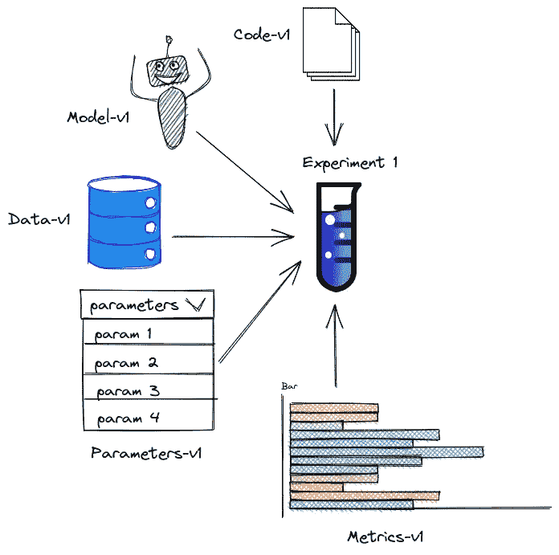

作者图片

GitHub 是对代码进行版本控制的一个很好的平台，但是对数据、模型和指标进行版本控制并不理想，原因有二:

*   GitHub 有一个 100MB 的严格文件限制，所以上传一个中等大小的二进制文件很容易超过这个限制。
*   用 GitHub 比较不同版本数据的变化很乱。我曾经在使用`git pull`后手动接受过 100 多次数据的更改，那是一种痛苦。

[DVC](/introduction-to-dvc-data-version-control-tool-for-machine-learning-projects-7cb49c229fe0) (数据版本控制)是对二进制数据进行版本控制的理想工具。但是，你不能在 GitHub 上查看 DVC 跟踪的文件。

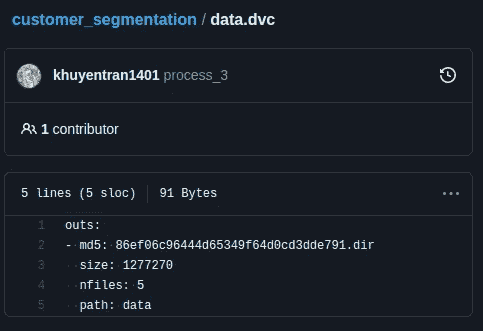

作者图片

如果有一个类似于 GitHub 的平台，但是更适合数据科学家和机器学习工程师，那不是很好吗？这时 DagsHub 就派上用场了。

# DagsHub 是什么？

[DagsHub](https://dagshub.com/) 是数据科学家和机器学习工程师对他们的数据、模型、实验和代码进行版本化的平台。

DagsHub 允许您在他们的平台上创建一个新的存储库，或者连接到 GitHub 上的存储库。如果要在 DagsHub 上创建新的存储库，请单击新建存储库:

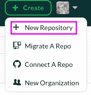

作者图片

如果您在 GitHub 上已经有一个存储库，并且想要将您的存储库迁移到 DagsHub，请单击 Migrate A Repo:

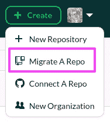

作者图片

如果您想同时通过 GitHub 和 DagsHub 管理您的存储库，请单击 Connect A Repo:

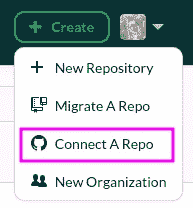

作者图片

DagsHub 上新存储库的界面应该与 GitHub 上的界面非常相似，只是增加了一些选项卡，如实验、数据、模型、笔记本、DVC 和 Git。

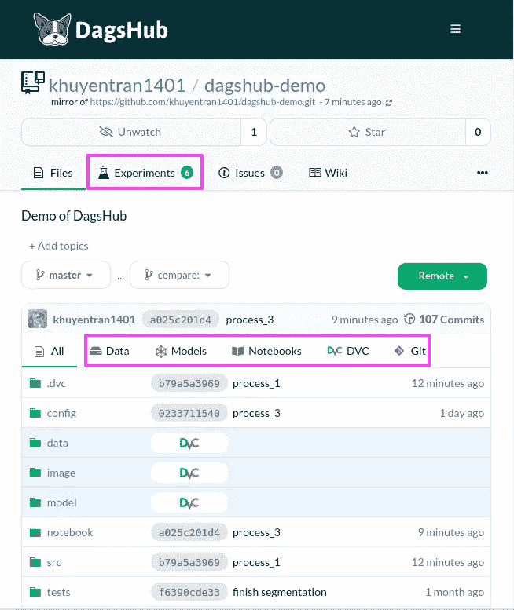

作者图片

你可以在这里查看[上面的资源库。让我们探索 DagsHub 的一些功能。](https://dagshub.com/khuyentran1401/dagshub-demo)

# 数据和代码版本化

假设您的机器上有 GitHub 库的本地副本，我们将使用 [DVC](/introduction-to-dvc-data-version-control-tool-for-machine-learning-projects-7cb49c229fe0) 来版本化您的二进制数据。

从安装 DVC 开始:

```
pip install dvc
```

通常情况下，在使用 DVC 时，您需要使用一个外部存储，如 Google Drive、亚马逊 S3、Azure Blob 存储、谷歌云存储等。但是，使用 DagsHub，您可以将数据直接存储在平台上。

要将您的数据上传到 DagsHub，首先获取远程按钮下的 DVC 链接:

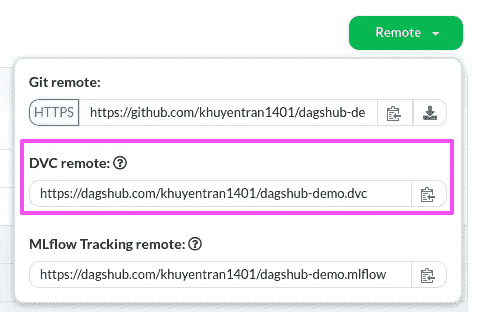

作者图片

接下来，将该链接设置为 DVC 的远程存储:

```
dvc remote add origin [https://dagshub.com/khuyentran1401/dagshub-demo.dvc](https://dagshub.com/khuyentran1401/dagshub-demo.dvc)
```

添加身份验证:

```
dvc remote modify origin --local auth basic
dvc remote modify origin --local user DAGSHUB_USERNAME
dvc remote modify origin --local password DAGSHUB_PASSWORD
```

接下来，添加我们希望存储在 DagsHub 上的二进制数据。例如，要添加目录`data/raw`，我运行:

```
dvc add data/raw
```

该命令将创建一个新的`.dvc`文件。这些是小文本文件，存储如何访问原始数据的信息，而不是原始数据本身。

```
data
├── raw
│   └── marketing_campaign.csv
└── raw.dvc
```

将这些文件推送到 DagsHub 的存储中:

```
dvc push
```

现在我们可以在数据和代码中添加更改，然后将您的更改提交并推送到 GitHub:

```
git add .
git commit -m 'push data and code'
git push origin master
```

如果你同时使用 GitHub 和 DagsHub，你只需要把你的文件推送到 GitHub。DagsHub 会自动与 GitHub 同步！

*注意:如果 DagsHub 不同步，单击存储库标题下的刷新图标:*

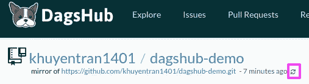

作者图片

如果你熟悉 DVC，这里没什么新鲜的。然而，当您访问 DagsHub 上的存储库时，神奇的事情发生了。

在 GitHub 上，你可以看到你的`.dvc`文件，但看不到数据本身。这是因为实际数据存储在其他地方:

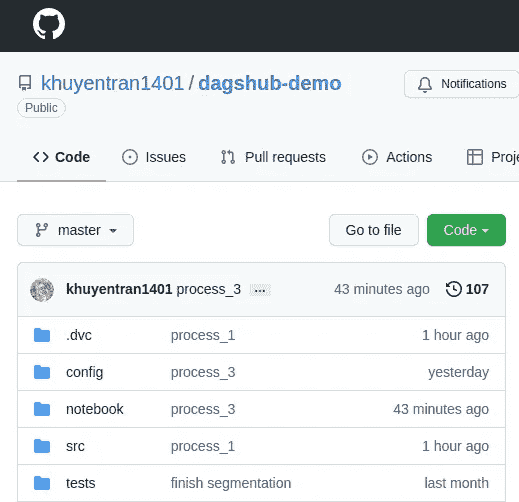

作者图片

在 DagsHub 上，您可以看到`.dvc`文件和数据本身，因为数据存储在 DagsHub 上！

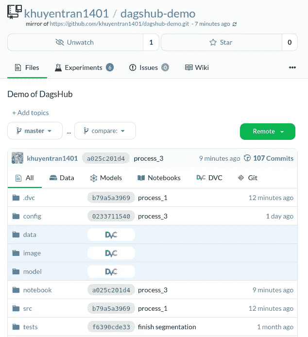

作者图片

这非常方便，因为我可以在一个平台上查看代码和数据。

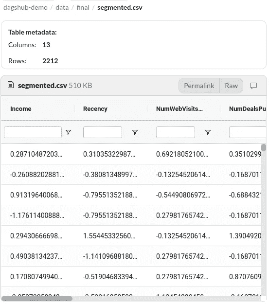

作者图片

# 跟踪实验

像 MLFlow 这样的库允许数据科学家跟踪他们的实验以及模型和参数。然而，他们不跟踪代码。

如果能保存一个实验的代码、模型、参数、数据不是很好吗？


作者图片

使用 DagsHub 可以轻松做到这一点。DagsHub 允许您使用 DagsHub logger 或 MLFlow 记录您的实验。实验选项卡下的实验应该如下所示:

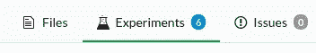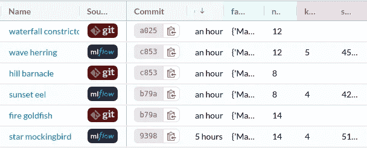

作者图片

使用 MLFlow 在不提交代码的情况下快速试验不同的参数是一个很好的实践。一旦您找到了具有良好结果的实验，您可以使用 DagsHub logger 将结果保存为开放格式(metric.csv，param.yaml ),并将其与生成结果的代码、模型和数据封装在一起。

让我们来学习如何用这些方法来记录你的实验。

# 用 MLFlow 记录您的实验

MLflow 是一个开源平台，允许你跟踪和比较实验。要安装 MLflow，请键入:

```
pip install mlflow
```

在下面的代码中，我使用 MLFlow 来记录度量和参数。

我还将跟踪 URI 设置为在 MLflow 跟踪远程下找到的 URL:

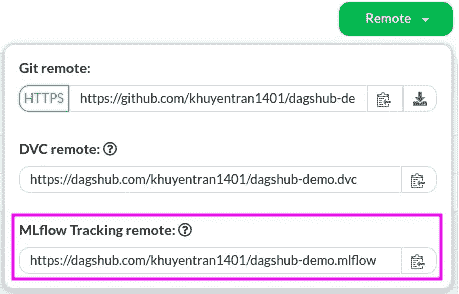

作者图片

就是这样！现在，每次运行代码时，每个实验的参数和指标都会显示在 DagsHub 存储库的 Experiments 选项卡下:


作者图片

能够在 DagsHub 这样的远程服务器而不是本地数据库中记录您的 MLflow 实验将允许您的队友在他们的浏览器中访问您的实验。

# 用 DagsHub Logger 记录你的实验

一旦您找到了一个好的实验，并准备好记录该实验的代码、数据和输出，只需将 MLFlow 切换到 DagsHub logger。

要使用 DagsHub 记录器，请从安装 DagsHub 开始:

```
pip install dagshub
```

使用 DagsHub logger 记录您的实验与使用 MLFlow 记录非常相似:

运行您的代码后，DagsHub 将自动在您的工作目录中创建两个文件`metrics.csv`和`params.yml`:

```
.
├── metrics.csv
└── params.yml
```

将所有更改添加到临时区域，然后将这些更改提交并推送到 GitHub:

```
git add .
git commit -m 'experiment 1'
git push origin master
```

现在，新的实验将在实验选项卡下用 Git 记录。

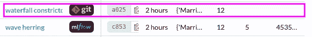

作者图片

# 同时使用 MLflow 和 DagsHub 记录器

尽管在 MLflow 和 DagsHub logger 之间切换很有用，但我发现每次想切换到另一个 logger 时都要重写代码，这很不方便。

我的解决方案是创建一个`BaseLogger`类，它的方法是`log_metrics`和`log_params`。每个方法都将使用 MLflow logger 和 DagsHub logger。

有了`BaseLogger`，我可以在一行代码中同时使用两个记录器。

# MLflow 实验之间的比较

要比较两个或多个实验，请勾选要比较的实验框，然后单击比较。

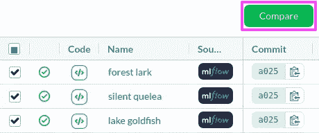

作者图片

您应该会看到所有实验的比较，如下所示:

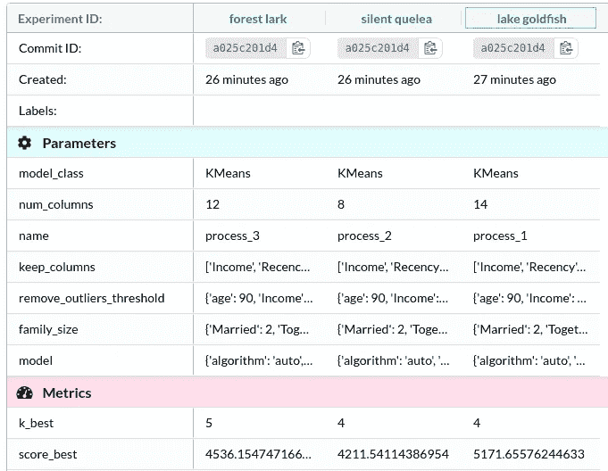

作者图片

DagsHub 还自动创建图，如平行坐标图和条形图，以便您可以观察参数和输出之间的关系

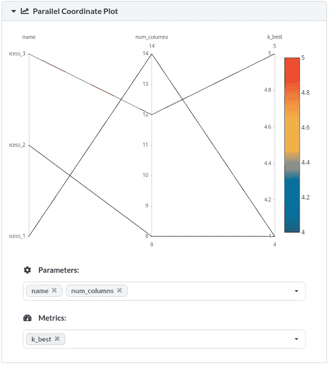

作者图片

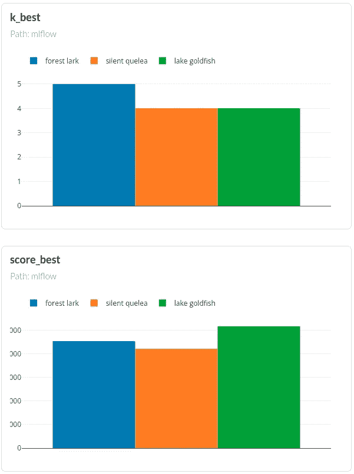

作者图片

# Git 实验之间的比较

要比较两个 Git 实验之间的文件差异，请在 experiments 选项卡下复制它们的提交 id:

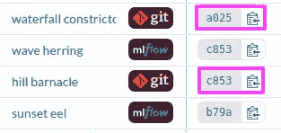

作者图片

然后将每个提交 ID 粘贴到文件选项卡下的每个分支上:

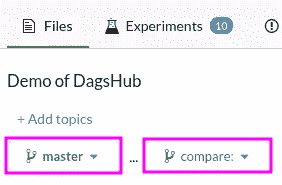

作者图片

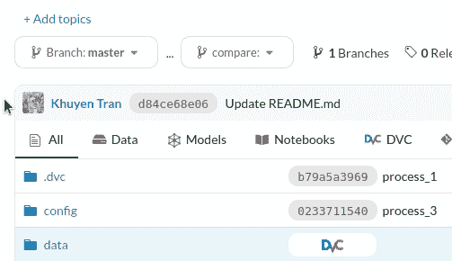

作者 GIF

两次提交之间不同的文件将以黄色突出显示。

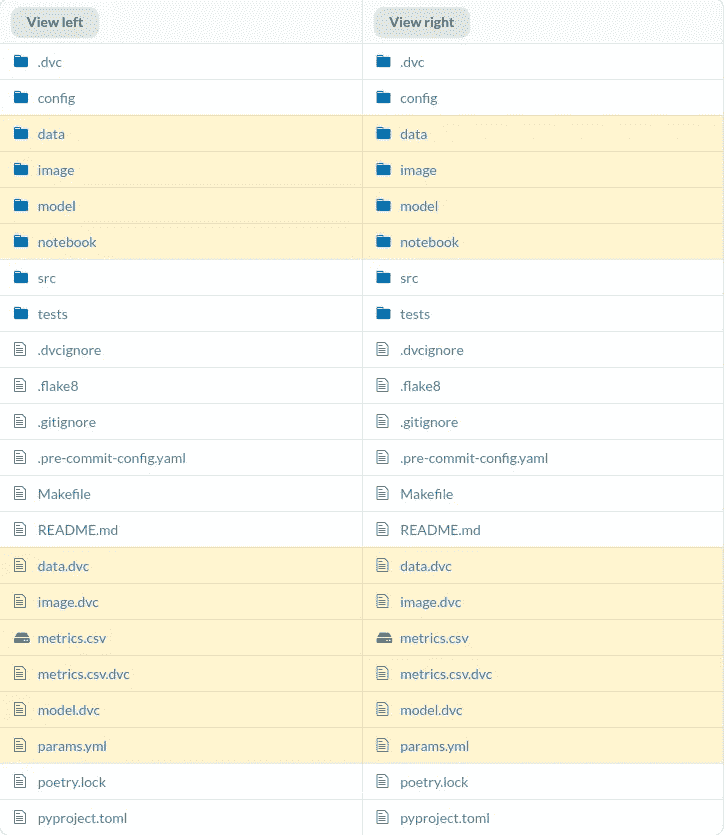

作者图片

要查看差异，请单击文件。由于缺少的信息以红色突出显示，附加信息以绿色突出显示，因此我们可以清楚地看到两次提交之间的差异。

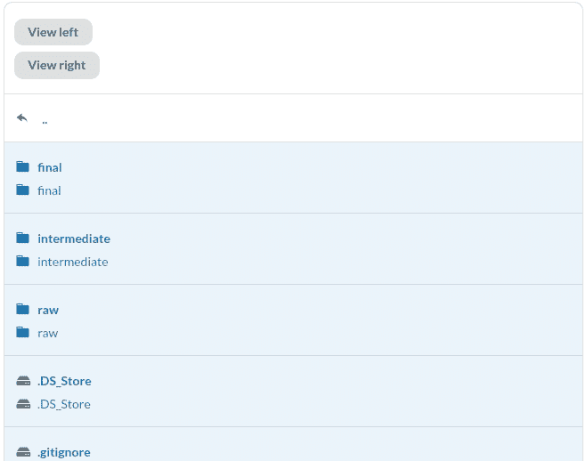

作者 GIF

更好的是，DagsHub 提供了一个很好的界面来比较两个 Jupyter 笔记本。

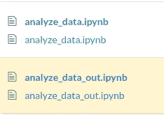

作者图片

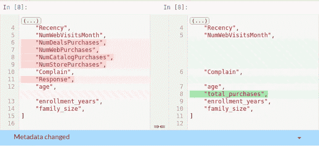

作者图片

由于数据科学家经常使用 Jupyter Notebook，因此能够比较两台笔记本的输出非常有用。

# 额外提示:创建一个 DVC 管道

有时，您可能希望其他人理解您项目的工作流程(例如，一个脚本的输出如何用于另一个脚本)。DagsHub 允许您通过 DVC 管道创建数据工作流的可视化。

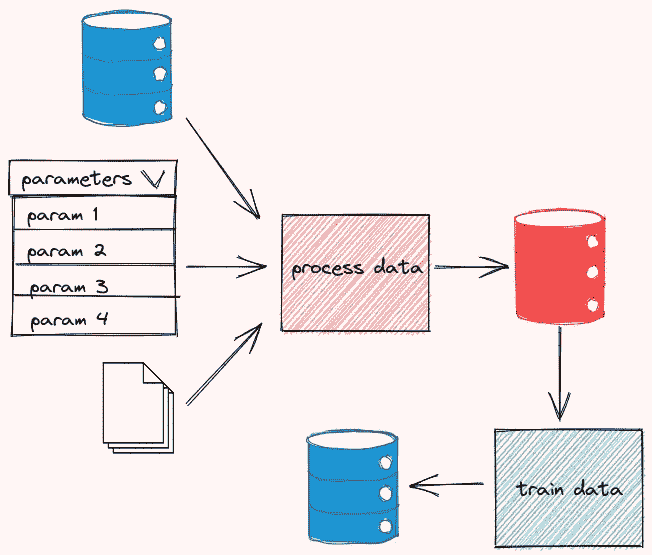

作者图片

要创建 DVC 管道，首先要创建一个`dvc.yaml`文件。在下面的代码中，我将我的工作流分为 3 个阶段:`process_data`、`segment`和`analyze`。对于每个阶段，

*   `cmd`指定执行阶段的命令
*   `deps`指定阶段的依赖关系
*   `outs`指定阶段的输出
*   `metrics`指定阶段的指标

在`outs`中列出的所有文件都被缓存，这与使用`dvc add`时发生的情况类似。这就是为什么你不再需要对这些文件使用`dvc add`。

现在，您可以通过运行以下命令来再现`dvc.yaml`中指定的整个管道:

```
dvc repro
```

产出:

```
Running stage 'process_data':
> python src/process_data.py
Updating lock file 'dvc.lock'                                                                                                                                                      

Running stage 'segment':
> python src/segment.py
Updating lock file 'dvc.lock'                                                                                                                                                      

Running stage 'analyze':
> python src/run_notebook.py
Updating lock file 'dvc.lock'
```

现在，其他人可以通过运行`dvc repro`命令复制您的结果。多方便啊？

接下来，运行`dvc push`将 DVC 跟踪的所有文件推送到 DagsHub。使用`git add`和`git commit`将代码和数据的变化推送到 GitHub。

如果您访问 DagsHub 上的存储库，您应该会在 DagsHub 上看到整个管道的漂亮的交互式图形！

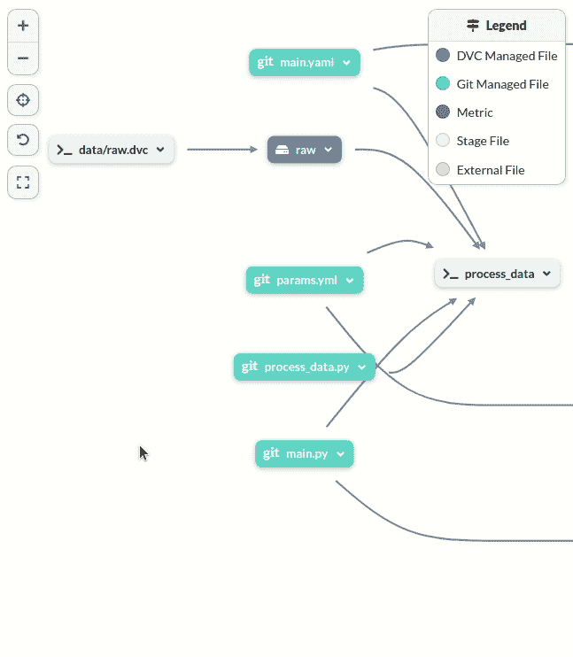

作者 GIF

通过单击图中的节点，可以获得该节点的更多详细信息。现在，其他人只需访问 DagsHub 上的存储库，就可以了解您的数据工作流。

# 结论

恭喜你！您刚刚学习了如何使用 DagsHub 对您的数据项目进行版本化。使用 DagsHub，您可以在一个地方轻松再现实验并查看数据科学项目的所有组件。

本文的源代码可以在这里找到:

[](https://dagshub.com/khuyentran1401/dagshub-demo) [## khuyentran1401/dagshub-demo

### DagsHub-khuyentran 1401/DagsHub-demo 演示

dagshub.com](https://dagshub.com/khuyentran1401/dagshub-demo) 

我喜欢写一些基本的数据科学概念，并尝试不同的数据科学工具。你可以在 LinkedIn 和 Twitter 上与我联系。

Star [这个回购](https://github.com/khuyentran1401/Data-science)如果你想检查我写的所有文章的代码。在 Medium 上关注我，了解我的最新数据科学文章，例如:

[](/orchestrate-a-data-science-project-in-python-with-prefect-e69c61a49074) [## 用 Prefect 编制 Python 中的数据科学项目

### 用几行代码优化您的数据科学工作流程

towardsdatascience.com](/orchestrate-a-data-science-project-in-python-with-prefect-e69c61a49074) [](/introduction-to-dvc-data-version-control-tool-for-machine-learning-projects-7cb49c229fe0) [## DVC 介绍:机器学习项目的数据版本控制工具

### 就像 Git 一样，但是有数据！

towardsdatascience.com](/introduction-to-dvc-data-version-control-tool-for-machine-learning-projects-7cb49c229fe0) [](/introduction-to-weight-biases-track-and-visualize-your-machine-learning-experiments-in-3-lines-9c9553b0f99d) [## 权重和偏差介绍:用 3 条线跟踪和可视化你的机器学习实验…

### 无缝比较不同的实验，并使用 Python 重现您的机器学习实验

towardsdatascience.com](/introduction-to-weight-biases-track-and-visualize-your-machine-learning-experiments-in-3-lines-9c9553b0f99d) [](/pytest-for-data-scientists-2990319e55e6) [## 数据科学家 Pytest

### 适用于您的数据科学项目的 Pytest 综合指南

towardsdatascience.com](/pytest-for-data-scientists-2990319e55e6)