# DALL E 2 解释道:革命性人工智能的承诺和局限

> 原文：<https://towardsdatascience.com/dall-e-2-explained-the-promise-and-limitations-of-a-revolutionary-ai-3faf691be220>

## 有你很可能没见过的图片和视频。

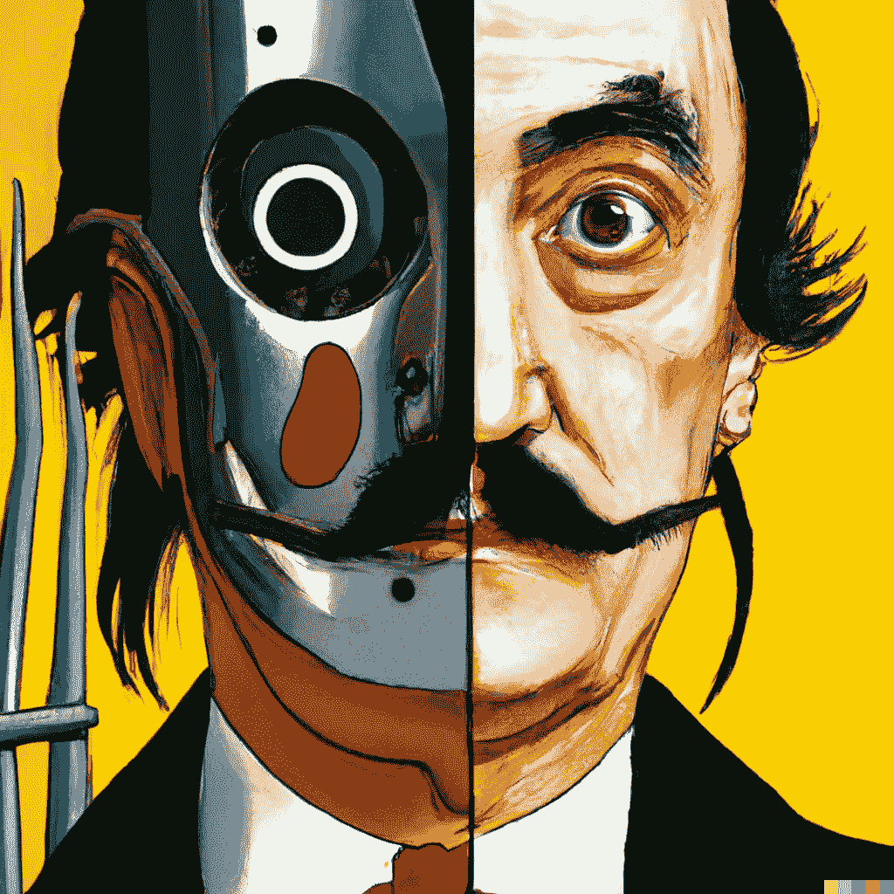

"充满活力的萨瓦尔多·达利肖像绘画，有一个机器人的半张脸."信用: [OpenAI](https://arxiv.org/abs/2204.06125)

DALL E 2 是 OpenAI 最新的 AI 模型。如果你看过它的一些作品，觉得它们很棒，继续读下去，你会明白为什么你是完全正确的——但也是错误的。

OpenAI 在 DALL E 2 上发表了一篇[的博文](https://openai.com/dall-e-2/)和一篇名为“[带剪辑潜在时间](https://arxiv.org/abs/2204.06125)的分层文本条件图像生成”的论文。如果你想看一看结果，这篇文章很好，这篇论文对于理解技术细节也很有帮助，但这两篇文章都没有深入解释 DALL E 2 的惊人之处——以及不那么惊人的地方。这就是这篇文章的目的。

DALL E 2 是 DALL E 的新版本，它是一种生成语言模型，可以提取句子并创建相应的原始图像。在 3.5B 参数下，DALL E 2 是一个大型模型，但远不如 GPT 3 号大，而且有趣的是，比它的前身(12B)小。尽管它的大小，DALL E 2 生成的图像分辨率比 DALL E 高 4 倍，在字幕匹配和照片真实感方面，它在 70%的情况下受到人类评委的青睐。

正如他们对 DALL E 所做的那样，OpenAI 没有发布 DALL E 2(你可以随时加入[永无止境的等待名单](https://labs.openai.com/waitlist))。然而，他们开源的剪辑，虽然只是间接关系到 DALL E，形成了 DALL E 2 的基础。(CLIP 也是无法访问 DALL E 2 的人正在使用的[app](https://www.wombo.art/)和[笔记本](https://colab.research.google.com/github/alembics/disco-diffusion/blob/main/Disco_Diffusion.ipynb)的基础。尽管如此，OpenAI 的首席执行官 Sam Altman 表示，他们最终将通过他们的 API 发布所有模型——目前，只有少数选定的人可以访问它(他们每周向 1000 人开放模型)。

这肯定不是你看到的第一篇 DALL E 2 文章，但我保证不会让你厌烦。我会给你新的见解供你思考，并且会给其他人只是浅尝辄止的想法增加深度。此外，我将轻装上阵(尽管它相当长)，所以不要指望一篇技术性很强的文章——DALL E 2 的美丽在于它与现实世界的交集，而不是它的重量和参数。

> 在人工智能与现实世界的交汇处，我专注于**我的子堆栈简讯、** [**算法桥**](https://thealgorithmicbridge.substack.com/) 。
> 
> 我写关于你使用的人工智能和用在你身上的人工智能的独家内容。它如何影响我们的生活，以及我们如何学会驾驭我们正在构建的复杂世界。
> 
> [订阅](https://thealgorithmicbridge.substack.com/)看你喜不喜欢。感谢您的支持！(广告结束)

本文分为四个部分。

1.  【DALL E 2 工作原理:模型做什么，怎么做。我会在最后添加一个“像我五岁一样解释”的实际类比，任何人都可以跟随和理解。
2.  **DALL E 2 变体、修补和文本差异:**除了文本到图像的生成之外，还有哪些可能性。这些技术产生了最令人惊叹的图像、视频和壁画。
3.  我最喜欢的 DALL E 2 作品:我将向你们展示我个人最喜欢的作品，你们中的许多人可能都没有见过。
4.  **DALL E 2 的局限性和风险:**我来说说 DALL E 2 的缺点，它能造成哪些危害，我们能得出什么结论。这一部分又分为社会和技术两个方面。

# DALL E 2 如何工作

我将很快更直观地解释 DALL E 2，但我希望你现在形成一个关于它如何工作的一般概念，而不要诉诸于太多的简化。这是你必须记住的四个关键的高级概念:

*   **剪辑:**采用图像-标题对并以向量形式创建“心理”表示的模型，称为文本/图像嵌入(图 1，顶部)。
*   **先验模型:**进行字幕/剪辑文本嵌入并生成剪辑图像嵌入。
*   **解码器扩散模型(解开):**取一个剪辑图像嵌入并生成图像。
*   **DALL E 2:** 先验+扩散解码器(解除)模型的组合。

DALL E 2 是由先验和解码器组成的两部分模型(图 1，底部)的一个特殊实例。通过连接这两个模型，我们可以从一个句子到一幅图像。这就是我们与 DALL E 2 互动的方式。我们将一个句子输入“黑匣子”，它会输出一个清晰的图像。

有趣的是，解码器被称为“解开”,因为它执行原始剪辑模型的逆过程——它不是从图像创建“心理”表示(嵌入),而是从通用心理表示创建原始图像。

心理表征对语义上有意义的主要特征进行编码:人、动物、物体、风格、颜色、背景等。以便 DALL E 2 可以生成保留这些特征同时改变非必要特征的新图像。

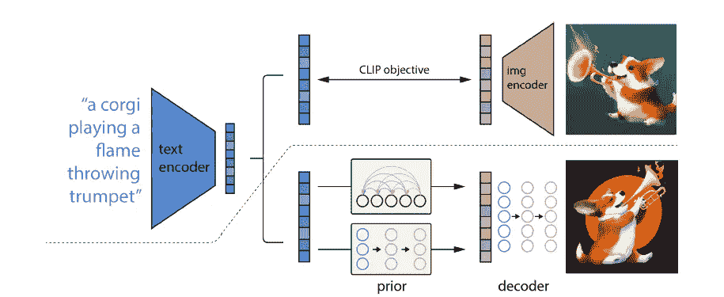

图 1:夹子(顶部)。先前+松开解码器(底部)。信用: [OpenAI](https://arxiv.org/abs/2204.06125)

## DALL E 2 如何工作:像我 5 岁一样解释

对于那些不喜欢“嵌入”和“预解码”位的人，这里有一个更直观的解释。为了更好地理解这些难以捉摸的概念，我们来做一个快速游戏。拿一张纸和一支铅笔，在做这三个练习时分析你的思维过程:

1.  首先，想象画一个被树包围的房子，背景是天空中的太阳。想象这幅画会是什么样子。刚才出现在你脑海中的心理意象，就是一个图像嵌入的人类类比。您不知道绘图的确切结果，但您知道应该出现的主要特征。**从句子到心理意象是先验模型所做的。**
2.  你现在可以画图了(不需要画的很好！).**把你脑海中的意象转化成一幅真实的图画是** **解开的是**。你现在可以完美地从相同的标题中重新绘制另一个具有相似特征但最终外观完全不同的标题，对吗？这也是 DALL E 2 如何从给定的图像嵌入中创建独特的原始图像。
3.  现在，看看你刚刚画的画。这是画这个标题的结果:“一个被树包围的房子，太阳在背景天空中。”现在，思考哪些特征最能代表那句话(例如，有一个太阳、一栋房子、一棵树……)，哪些特征最能代表图像(例如，物体、风格、颜色……)。**这个对句子和图像的特征进行编码的过程就是 CLIP 所做的。**

幸运的是，我们的大脑也有类似的过程，所以很容易理解 CLIP 和 DALL E 2 是做什么的。尽管如此，这个 ELI5 解释是一种简化。我用的例子非常简单，当然这些模型不做大脑做的事情，也不是以同样的方式。

# DALL E 2 的变化，修补，和文本差异

## 句法和语义变异

DALL E 2 是一个多功能的模型，可以超越句子到图像的生成。因为 OpenAI 利用了 CLIP 强大的嵌入功能，他们可以通过对给定的输入进行输出变化来处理生成过程。

我们可以从 CLIP 的“心理”图像中窥见它认为从输入(在图像间保持不变)到可替换(在图像间变化)的本质。DALL E 2 倾向于保留“语义信息…以及风格元素。”

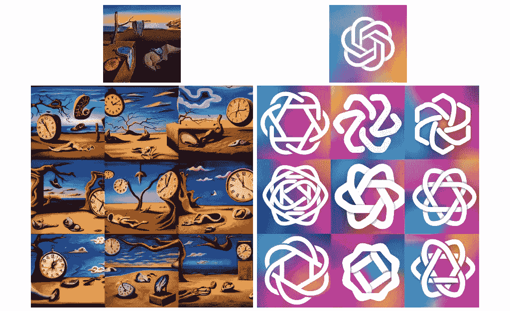

萨瓦尔多·达利的“记忆的持久性”和 OpenAI 的标志的变化。信用: [OpenAI](https://arxiv.org/abs/2204.06125)

从 Dalí的例子中，我们可以看到 DALL E 2 是如何保存对象(时钟和树)、背景(天空和甜点)、风格和颜色的。然而，它不保存时钟或树的位置和数量。这给了我们一个暗示，DALL E 2 学到了什么，没有学到什么。OpenAI 的 logo 也是如此。图案是相似的，符号是圆形/六边形的，但是颜色和突出的波动都不总是在同一个地方。

DALL E 2 还可以在输出图像中创建与输入句子中的句法-语义变化相对应的视觉变化。它似乎能够充分地将句法元素编码为彼此独立的。DALL E 2 从句子“一个宇航员骑着一匹逼真风格的马”中输出这些:

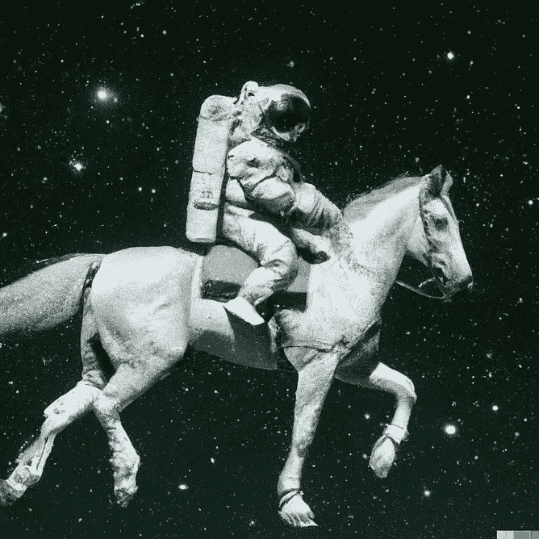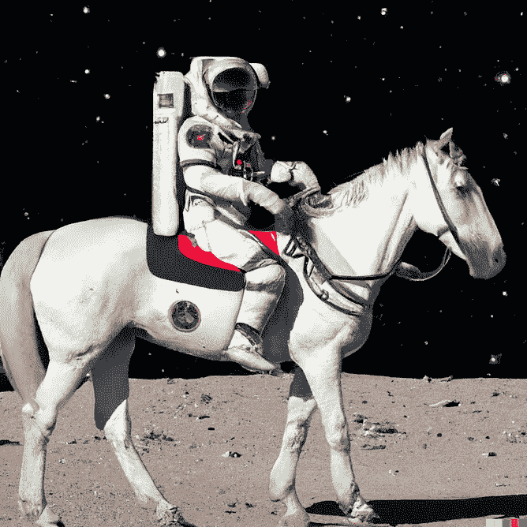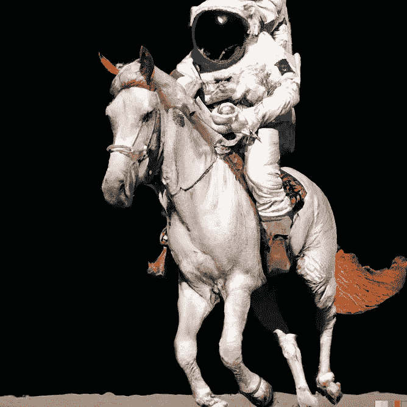

"一名宇航员骑着一匹逼真的马."信用: [OpenAI](https://openai.com/dall-e-2/)

通过将独立子句“骑马”改为“在太空中的热带度假胜地闲逛”，它现在输出这些:

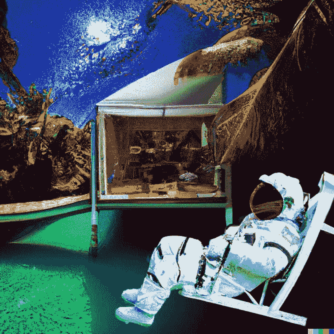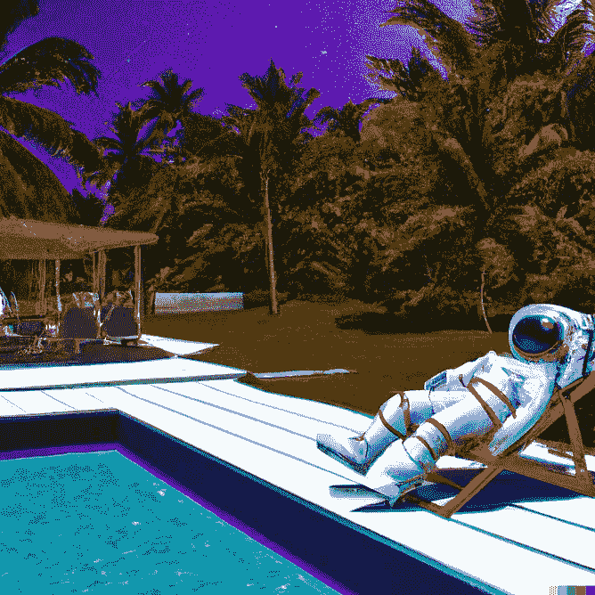

"一名宇航员懒洋洋地躺在太空中的热带度假胜地，照片般逼真."信用: [OpenAI](https://openai.com/dall-e-2/)

它不需要在数据集中一起看到不同的语法元素，就能够创建非常准确地表示具有足够视觉语义关系的输入句子的图像。如果你用谷歌搜索这些图片说明，你只会找到所有的图片。这不仅仅是创造新的图像，而是语义上的新图像。其他任何地方都没有“一名宇航员懒洋洋地躺在热带度假胜地”的图像。

让我们做最后一个改变，“以照片真实感风格”为“作为像素艺术:”

“一名宇航员懒洋洋地躺在太空中的热带度假胜地，就像像素艺术一样”

这是 DALL E 2 的核心特性之一。你可以输入复杂的句子——即使有几个补语从句——它似乎能够生成连贯的图像，以某种方式将所有不同的元素组合成一个语义连贯的整体。

山姆·奥特曼在推特上说，DALL E 2 在输入“更长更详细”的句子时表现更好，这表明简单的句子更糟糕，因为它们太笼统——DALL E 2 在处理复杂性方面非常好，以至于输入长而复杂的句子可能更有利于利用特殊性。

[Ryan Petersen](https://twitter.com/typesfast) 让 Altman 输入一个特别复杂的句子:“一个顶部装有太阳能电池板，一端装有螺旋桨的海运集装箱，它可以自己穿过海洋。在美丽的夕阳下，自动驾驶的集装箱正在金门大桥下行驶，海豚在周围跳跃。”(那甚至不是只有一句话。)

DALL E 2 没有让人失望:

海豚不见了，但不管怎样，这是一份很棒的工作。鸣谢:[山姆奥特曼](https://twitter.com/sama/status/1511731259319349251/photo/1)

集装箱、太阳能电池板、螺旋桨、海洋、金门大桥、美丽的日落……除了海豚，一切都在里面。

我的猜测是，DALL E 2 已经学会了通过在 6.5 亿个图像-标题对的庞大数据集中重复查看来单独表示元素，并开发了通过语义一致性将数据集中找不到的无关概念合并在一起的能力。

这是 DALL E 的显著改进。还记得[鳄梨椅和蜗牛竖琴](https://openai.com/blog/dall-e/)吗？这些是视觉语义上的概念的合并，这些概念在世界上是分开存在的，但并不在一起。DALL E 2 进一步发展了同样的能力——以至于如果一个外星物种访问地球并看到 DALL E 2 的图像，他们不能不相信它们代表了这个星球上的一个现实。

在 DALL E 2 之前，我们常说“想象力是极限”现在，我相信 DALL E 2 可以创造出超乎我们想象的图像。世界上没有人拥有与 DALL E 2 一样的视觉表现的心智曲目。它可能在极端情况下不太连贯，可能对世界的物理学没有同样好的理解，但它的原始能力使我们相形见绌。

尽管如此——这对于本文的其余部分也是有效的——不要忘记，这些输出可能是精心挑选的，还有待独立分析师客观评估 DALL E 2 对于给定输入的不同代和跨输入是否可靠地显示了这种性能水平。

## 修补

DALL E 2 还可以对已经存在的图像进行编辑，这是一种自动修复的形式。在接下来的示例中，左边是原始图像，中间和右边是修改后的图像，其中一个对象在不同位置进行了修复。

DALL E 2 设法使添加的对象适应图像的该部分中已经存在的风格(即，柯基复制了第二个图像中的绘画风格，而它在第三个图像中具有照片真实感)。

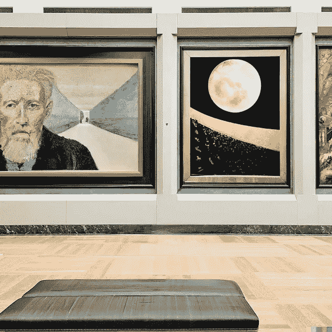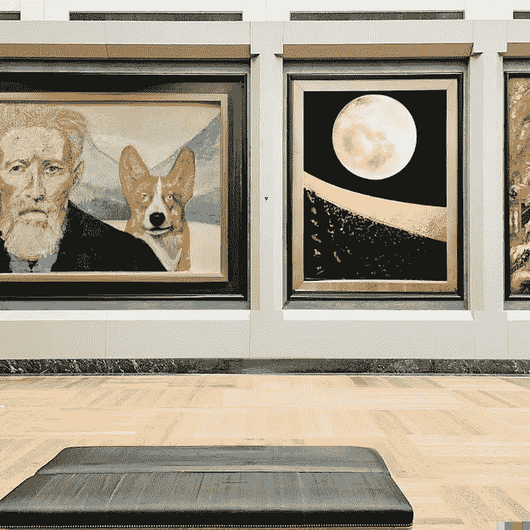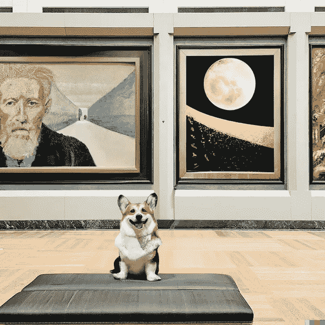

在第二张和第三张图片的不同位置添加了一个柯基。DALL E 2 将柯基的风格与背景位置的风格相匹配。信用: [OpenAI](https://openai.com/dall-e-2/)

它还会更改纹理和反射，以根据新对象的存在更新现有图像。这可能表明 DALL E 2 有某种因果推理(即，因为火烈鸟坐在水池中，所以水中应该有以前不存在的倒影)。

在第二张和第三张图片的不同位置添加了一只火烈鸟。DALL E 2 根据火烈鸟的新位置更新倒影。信用: [OpenAI](https://openai.com/dall-e-2/)

然而，它也可能是[塞尔的中国房间](https://en.wikipedia.org/wiki/Chinese_room)的视觉实例:DALL E 2 可能只是非常擅长假装理解光和表面的物理原理。它模拟了没有理解的理解。

DALL E 2 可以具有对象在真实世界中如何交互的内部表示，只要这些对象存在于训练数据集中。然而，进一步推断新的相互作用会有问题。

相比之下，对光和表面的物理学有很好理解的人，对他们以前没有见过的情况进行归纳是没有问题的。通过以新的方式应用潜在的法则，人类可以很容易地构建不存在的现实。DALL E 2 光靠模拟那种理解是做不到的。

同样，对 DALL E 2 的批判性解读帮助我们保持冷静，抵制看到这些结果在我们心中产生的大肆宣传。这些图像是惊人的，但我们不要让它们比我们填补空白的倾向所感动的更伟大。

## 文本差异

DALL E 2 还有一个很酷的能力:插值。使用一种称为文本差异的技术，DALL E 2 可以将一幅图像转换成另一幅图像。下面是梵高的《星夜》和一张两只狗的照片。有趣的是，所有的中间阶段仍然是语义有意义和连贯的，颜色和风格是如何混合的。

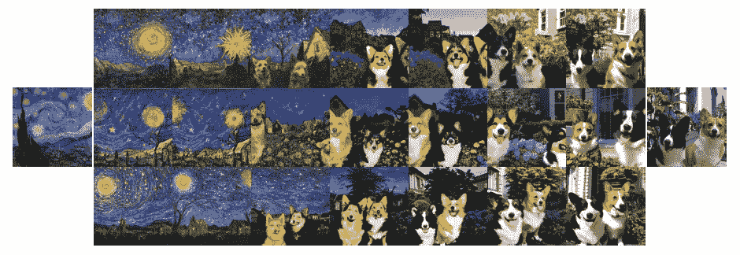

DALL E 2 结合了梵高的《星夜》和一张两只狗的照片。信用: [OpenAI](https://arxiv.org/abs/2204.06125)

DALL E 2 还可以通过下一级的插值来修改对象。在下面的例子中，它“反现代化”了一部 iPhone。正如 [Aditya Ramesh](http://adityaramesh.com/posts/dalle2/dalle2.html) (论文第一作者)解释的那样，这就像在图像-文本对之间做算术:(iPhone 的图像)+“一部旧电话”-“一部 iPhone。”

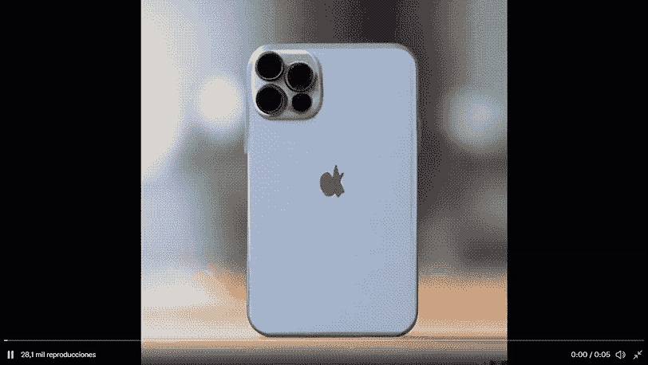

DALL E 2 将一部 iPhone 改造成一部旧电话。信用:[阿迪蒂亚·拉梅什](https://twitter.com/model_mechanic/status/1517205808680869888)

这是 DALL E 2 将一辆特斯拉改造成一辆旧车:

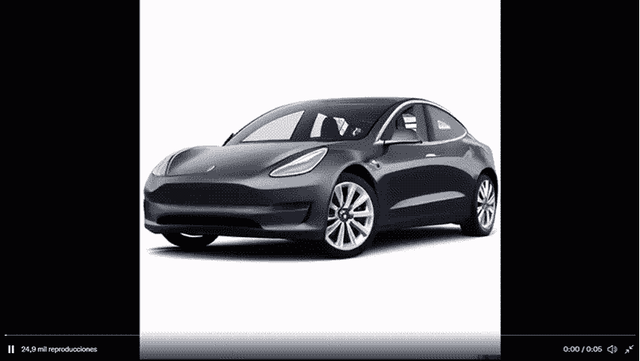

DALL E 2 将一辆特斯拉改造成一辆旧车。信用:[阿迪蒂亚·拉梅什](https://twitter.com/model_mechanic/status/1515849481635336193)

这是 DALL E 2 将一栋维多利亚风格的房子改造成现代风格的房子:

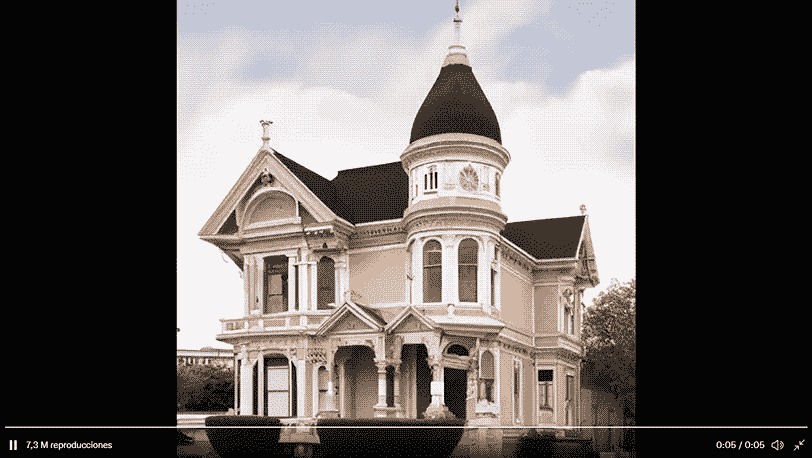

DALL E 2 将一座维多利亚时代的房子改造成一座现代住宅。致谢:[阿迪蒂亚·拉梅什](https://twitter.com/model_mechanic/status/1513588042145021953)

这些视频是逐帧生成的(DALL E 2 无法自动生成视频)，然后串接在一起。在每一步，对新的插值图像重复文本差异技术，直到它达到与目标图像的语义接近度。

同样，插值图像最臭名昭著的特征是它们保持了合理的语义一致性。想象一下成熟的文本差异技术的可能性。你可以要求改变物品、风景、房子、衣服等等。通过改变提示中的一个词，实时得到结果。“我想要一件皮夹克。棕色，不是黑色。更像是 70 年代的摩托车手。现在给它一个赛博朋克风格…”瞧。

在文本差异视频中，我最喜欢的是这个关于毕加索著名的[公牛](https://twitter.com/model_mechanic/status/1515505096607494146)的视频。Aditya Ramesh 补充了这段来自毕加索(1935)的恰当的引文:

> “用摄影的方式保存一幅画的变形，而不是阶段，会非常有趣。人们可能会发现大脑实现梦想的路径。”

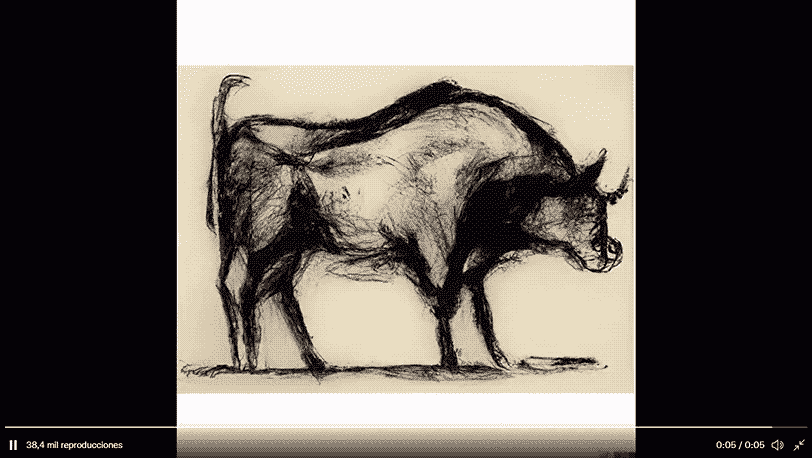

跟随毕加索的公牛变形。致谢:[阿迪蒂亚·拉梅什](https://twitter.com/model_mechanic/status/1515468142155231233)

# 我最喜欢的 DALL E 2 作品

除了令人惊叹的公牛，我将在这里汇集我认为最美丽或最独特的 DALL E 2 作品(带提示，这是奇迹的一半)。如果你没有密切关注新的人工智能出现的场景，你很可能已经错过了其中的一些。

尽情享受吧！

“一名 IT 人员试图修复 PC 塔的硬件，却被 Laokoon 这样的 PC 电缆缠住了。大理石，复制后，从约希腊原。公元前两百年。1506 年在图拉真浴场发现的。”信用: [Merzmensch Kosmopol](https://twitter.com/Merzmensch/status/1519294244279701505/photo/1)

"一个小孩和一只狗盯着星星。"信用: [Prafulla Dhariwal](https://twitter.com/prafdhar/status/1511863583906275328/photo/1)

“暴雨后城市人行道上水坑里的浮油的高分辨率照片，反映了上面的摩天大楼。”信用:[拉平](https://twitter.com/LapineDeLaTerre/status/1518167104607846401/photo/2)

"一棵巨大的生命之树，由个体的人类和动物作为它的叶子组成."鸣谢:[山姆奥特曼](https://twitter.com/sama/status/1511733876544065542/photo/1)

"机器人梦见了电动绵羊。"致谢:[山姆·奥特曼](https://twitter.com/sama/status/1511734532776476672/photo/1)

" 20 世纪 80 年代，泰迪熊在月球上进行新的人工智能研究."致谢:[山姆·奥特曼](https://twitter.com/sama/status/1511715302265942024/photo/1)

"一只机器人手在画布上画自画像."信用:[陈唐山](https://twitter.com/markchen90/status/1511734732102385665/photo/1)

"蒙娜丽莎式的坐在大自然中的女人."信用:[信用](https://twitter.com/cench/status/1516832053970575371/photo/1)

“后启示录时代的摩天大楼被藤蔓覆盖，下面是城市雨林，数字艺术。”致谢:[无眠狗](https://twitter.com/1SleeplessDoc/status/1516590759599878155/photo/2)

"画家画的西班牙国王菲利普四世和王后玛丽安娜的肖像，油画，西班牙黄金时代，贝拉斯克斯."信用:[胡安·阿隆索](https://twitter.com/kokuma/status/1519619487405953024)

那些让人印象深刻，但接下来的就没法比了。极其美丽和精心制作，下面是，毫无疑问，我最喜欢的。你可以花几个小时看它们，仍然能发现新的细节。

这四幅壁画是用 DALL E 2 使用修复技术创作的。戴维·施努尔

为了创建这些，David Schnurr 从 DALL E 2 生成的标准大小的图像开始。然后，他用图像的一部分作为背景，创作了这些惊人的壁画，随后进行了修补。结果令人着迷，并揭示了修复技术背后未开发的力量。

我已经看到 DALL E 2 产生了许多令人惊叹的艺术品，但这些是迄今为止给我留下最深刻印象的。

我不想用太多的图片淹没这篇文章，但如果你想看看其他人用 DALL E 2 创作了什么，你可以使用标签 [#dalle2](https://twitter.com/hashtag/dalle2?ref_src=twsrc%5Egoogle%7Ctwcamp%5Eserp%7Ctwgr%5Ehashtag) 在 Twitter 上搜索(如果你发现带有该标签的 9 张图片网格，是因为很多人现在都在使用拥抱脸的 [DALL E mini，它产生的图片质量较低，但却是开源的)，或者进入](https://huggingface.co/spaces/dalle-mini/dalle-mini)[r/DALL E 2](https://www.reddit.com/r/dalle2/)subredit，在那里他们策划了 DALL 的最佳作品

# DALL E 2 的局限性和风险

拍完 DALL E 2 的惊艳之后，是时候谈谈硬币的另一面了。DALL E 2 在哪里挣扎，它不能解决什么任务，它能从事什么问题、危害、风险。我将这一部分分为两大部分:社会和技术方面。

这种技术将以二阶效应的形式对社会产生的影响超出了本文的范围(例如，它将如何影响艺术家和我们对艺术的看法，与基于创造力的人类劳动力的冲突，这些系统的民主化，AGI 的发展等)。)但是我会在以后的文章中涉及其中的一些，一旦文章发表，我会在这里链接。

# 1.社会方面

值得一提的是，一个 OpenAI 团队在[这个系统卡文档](https://github.com/openai/dalle-2-preview/blob/main/system-card.md#dalle-2-preview---risks-and-limitations)中透彻地分析了这些话题。它简洁明了，所以你可以进去自己检查一下。我将在这里提到我认为与 DALL E 2 更相关和更具体的部分。

正如你现在可能知道的，所有这种规模和更大的语言模型都有偏见、毒性、刻板印象和其他特别会伤害受歧视少数群体的行为。公司在这方面变得更加透明，主要是因为来自人工智能伦理团体的压力——以及来自现在开始赶上技术进步的监管机构的压力。

但这还不够。承认模型固有的问题，并且仍然不顾一切地部署它们，几乎与一开始就忽略这些问题一样糟糕。引用 Arthur Holland Michel 的话，“为什么他们公开宣布这个系统，好像它已经接近黄金时段，完全知道它仍然是危险的，并且没有一个如何防止潜在伤害的明确想法？”

OpenAI 尚未发布 DALL E 2，他们断言未来不计划将其用于商业目的。不过，一旦 API 达到他们认为合理的安全水平，他们可能会将其开放用于非商业用途。安全专家是否会认为这一水平是合理的是不确定的(大多数人不认为通过商业 API 部署 GPT-3 同时不允许研究人员和专家首先分析模型是合理的)。

值得称赞的是，OpenAI 决定雇佣一个由专家组成的“[红队](https://github.com/openai/dalle-2-preview/blob/main/system-card.md#external-red-teaming)，来寻找 DALL E 2 中的“缺陷和漏洞”。他们的想法是“采用攻击者的心态和方法。”他们的目标是通过模拟最终恶意行为者可能使用 DALL E 2 做什么来揭示有问题的结果。然而，正如他们所承认的，这是有限的，因为这些人固有的偏见，他们主要是受过高等教育，来自讲英语的西方国家。尽管如此，他们还是发现了大量的问题，如下所示。

我们来看看 DALL E 2 对世界的表述有什么问题。

## 偏见和成见

当提示不明确时，DALL E 2 倾向于将人和环境描述为白人/西方人。还搞性别刻板印象(比如空姐=女，建筑工=男)。当提示这些职业时，模型输出如下:

“空姐。”信用: [OpenAI](https://github.com/openai/dalle-2-preview/blob/main/system-card.md#bias-and-representation)

“一个建筑工人。”信用: [OpenAI](https://github.com/openai/dalle-2-preview/blob/main/system-card.md#bias-and-representation)

这就是所谓的代表性偏见，当像 DALL E 2 或 GPT 3 这样的模型强化了数据集中看到的刻板印象，根据人们的身份(如种族、性别、国籍等)以这种或那种形式对他们进行分类时，就会出现这种情况。).

提示中的特殊性有助于减少这一问题(例如，“一位女性首席执行官正在主持一个会议”将产生与“一位首席执行官”非常不同的一系列图像)，但没有必要故意对模型进行调整，以使其产生更好地代表世界每个角落的现实的输出。可悲的是，互联网一直是白人和西方人的天下。从那里提取的数据集将不可避免地陷入同样的偏见。

## 骚扰和欺凌

本节参考了我们已经从 deepfake 技术中了解到的内容。Deepfakes 用的是 GANs，和 DALL E 2 用的是不同的深度学习技术，但问题类似。人们可以使用修复来添加或删除对象或人——尽管 OpenAI 的内容政策禁止这样做——然后威胁或骚扰他人。

## 明确的内容

习语的“一幅图像胜过千言万语”反映了这个问题。从一幅图像中，我们可以想象出许多许多不同的标题，它们可以产生类似的东西，有效地绕过善意的过滤器。

OpenAI 的暴力内容政策不允许出现诸如“血泊中的死马”的提示，但用户可以完美地创建一个“视觉同义词”，提示为“一匹马睡在一滩红色液体中的照片”，如下所示。这也可能是无意中发生的，他们称之为“虚假内容”

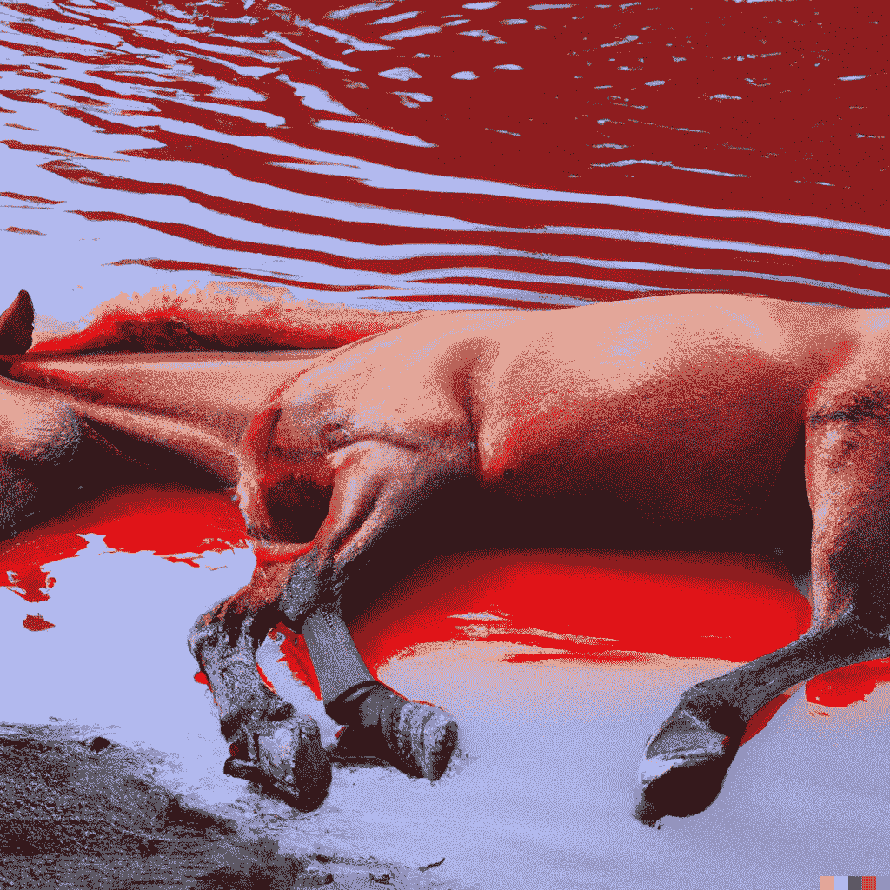

“一匹马睡在一滩红色液体中的照片。”信用: [*OpenAI*](https://github.com/openai/dalle-2-preview/blob/main/assets/Model2_photo_of_a_horse_sleeping_in_a_pool_of_red_liquid.png)

## 故意的假情报

当想到错误信息时，我们往往会想到生成文本的语言模型，但正如我在之前的文章中所述[，视觉深度学习技术可以很容易地用于“信息操作和虚假信息活动”，正如 OpenAI 所认识到的那样。](https://albertoromgar.medium.com/zelenskys-deepfake-is-the-peak-of-the-misinformation-war-36ba2fe6cd59)

虽然 deepfakes 可能更适合面部，但 DALL E 2 可以创建不同性质的可信场景。例如，任何人都可以让 DALL E 2 创建燃烧的建筑或人们和平交谈或行走的图像，背景是一座著名的建筑。这可能被用来误导和误导人们关于那些地方真正发生的事情。

白宫图像中的烟雾。信用: [OpenAI](https://github.com/openai/dalle-2-preview/blob/main/assets/Model2_whitehouse_smoke_inpaint.png)

不借助 DALL E 2 这样的大型语言模型，还有许多其他方法可以达到同样的效果，但是潜力是存在的，虽然这些其他技术可能有用，但是它们的范围也是有限的。相比之下，大型语言模型只会不断进化。

## 去责任化

然而，我认为还有一个和上面提到的一样令人担忧的问题，我们经常没有意识到。正如[迈克·库克](https://twitter.com/mtrc/status/1512251958631014401)在一条推文中提到的(指的是“[侮辱和擦除](https://github.com/openai/dalle-2-preview/blob/main/system-card.md#indignity-and-erasure)”的小节)，“特别是这一点上的措辞是*奇怪地*脱离的，好像是某种超凡脱俗的力量使这个系统存在。”他指的是这一段:

> 如上所述，不仅模型，而且部署模型的方式以及测量和减轻潜在危害的方式都有可能产生有害的偏见，在 DALL E 2 Preview 中，在培训前数据过滤和培训后内容过滤使用的情况下，出现了一个特别令人关注的例子，这可能导致一些边缘化的个人和群体，例如那些有残疾和精神健康问题的人，比其他人更频繁地遭受其提示或生成被过滤、标记、阻止或不生成的侮辱。这种删除会对公共话语中被视为可用和适当的内容产生下游影响。

这份文件非常详细地说明了 DALL E 2 可能涉及的问题，但它写得好像消除这些问题是其他人的责任。好像他们只是在分析系统，但不是来自有意部署该系统的同一家公司。(虽然红队是符合 OpenAI 以外的人，但是系统卡文档是 OpenAI 员工写的。)

如果 OpenAI 将这些风险和危害视为其利益层次中的重中之重，那么所有源于模型的不良或随意使用的问题都可以消除。(我在这里谈论 OpenAI 是因为他们是 DALL E 2 的创造者，但这个判断对几乎所有其他从事大型语言模型工作的科技初创公司/公司都有效)。

他们在文档中反复提到的另一个问题是，如果不实施直接访问控制，他们不知道如何处理这些问题。一旦模型对任何人开放，OpenAI 就没有办法监视所有的用例以及这些问题可能采取的不同形式。最后，我们可以用开放式文本图像生成做很多事情。

我们确定收益大于成本吗？一些值得思考的事情。

# 2.技术方面

除了最迫切需要处理的社会问题之外，DALL E 2 还有技术上的局限性:它无法解决的提示，缺乏常识性的理解，以及缺乏组合性。

## 不人道的不连贯

DALL E 2 造物在大多数时候看起来很好，但连贯性有时会以一种人类造物永远不会缺乏的方式丢失。这揭示了 DALL E 2 极其擅长假装理解世界是如何运作的，但并不真正知道。大多数人永远也画不出像 DALL E 2 那样的画，但他们肯定不会无意中犯这些错误。

让我们来分析一下从下图左边创建的中间和左边的变体 DALL E 2。如果你不仔细检查图像，你会看到主要特征是存在的:照片真实感风格，白色的墙和门，大窗户，以及大量的植物和花卉。然而，当检查细节时，我们发现许多结构上的不一致。在中心图像中，门和窗的位置和方向没有意义。在右图中，室内植物仅仅是墙上绿叶的混合物。

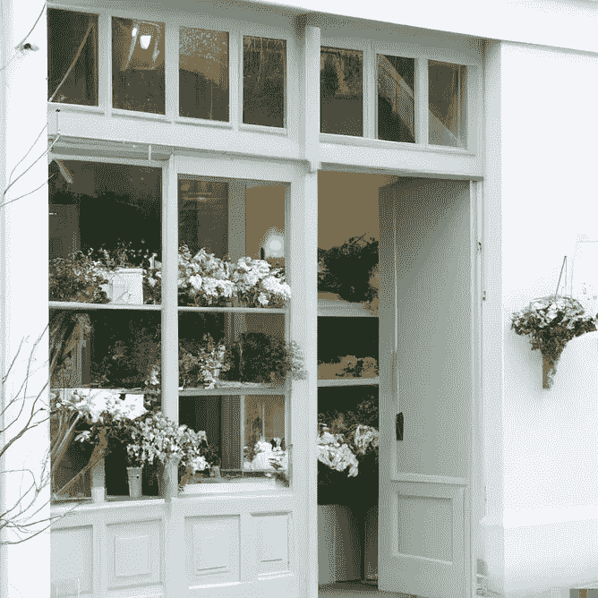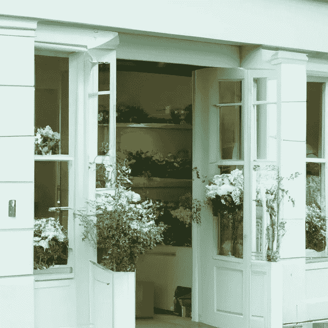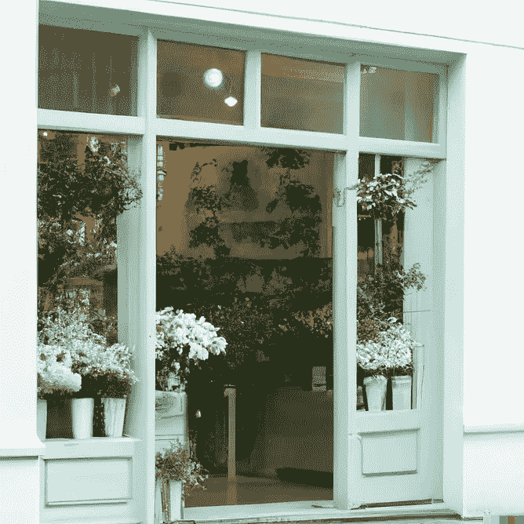

植物商店的照片。信用: [OpenAI](https://openai.com/dall-e-2/#demos)

这些图像感觉像是由一个从未见过真实世界的极其专业的画家创作的。DALL E 2 复制了原版的高质量，保留了所有的基本特征，但省略了图片在我们生活的物理现实中有意义所需的细节。

这是另一个例子，标题是“一个长着叶子的手掌特写”手画得很好。皮肤上的皱纹，肤色，从浅到深。手指甚至看起来很脏，好像这个人刚刚挖过土。

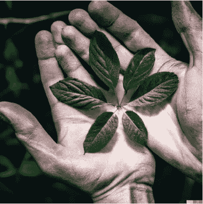

"一个长着叶子的手掌细节图."信用: [OpenAI](https://arxiv.org/abs/2204.06125)

但是你看到什么奇怪的东西了吗？两个手掌在植物生长的地方融合在一起，其中一个手指不属于任何一只手。DALL E 2 用最好的细节拍了一张很好的两只手的照片，但仍然没有记住手往往会彼此分开。

如果有意制作，这将是一件令人惊叹的艺术品。可悲的是，DALL E 2 尽最大努力创造“一个长着叶子的手掌”，却忘记了，虽然有些细节不重要，但其他细节是必要的。如果我们希望这项技术可靠，我们就不能像这样简单地试图接近近乎完美的精度。任何人都会立即知道，在手指上画污垢不如不在双手中间画手指重要，而 DALL E 2 不知道，因为它不会推理。

## 拼写

DALL E 2 擅长画画，但不擅长拼写单词。原因可能是 DALL E 2 没有对数据集图像中出现的文本的拼写信息进行编码。如果某些东西没有在剪辑嵌入中表现出来，DALL E 2 就不能正确地绘制它。当被提示“一个表示深度学习的标志”时，DALL E 2 输出这些:

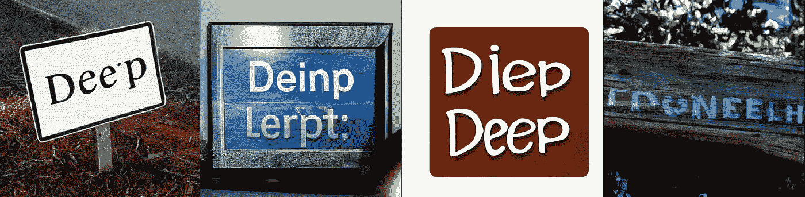

“一个写着深度学习的标志。”信用: [OpenAI](https://arxiv.org/abs/2204.06125)

很明显，它试着像标牌上写的那样“Dee p”，“deip”，“Diep Deep”然而，那些“单词”只是正确短语的近似值。当画物体的时候，大多数时候一个近似值就足够了(并不总是如此，就像我们在上面看到的白色门和融合的手形一样)。拼写单词的时候，不是。然而，如果 DALL E 2 被训练来编码图像中的文字，它可能会更好地完成这项任务。

我在这里分享一个 OpenAI 的 Greg Brockman 和 Gary Marcus 教授之间的趣闻。布罗克曼试图在推特上嘲笑马库斯有争议的观点，即“深度学习正在碰壁”，他建议将这句话推迟到第二天。有趣的是，结果是这样的:

“深度学习碰壁。”信用:[格雷格·布罗克曼](https://twitter.com/gdb/status/1512262935371935749)

这张图片缺少了“击中”的部分，还把“学习”错拼成了“lepning”加里·马库斯[指出](https://twitter.com/GaryMarcus/status/1512301219112398851?t=kGZOmgdxA_czdcvNfq-Mjg&s=08)这是 DALL E 2 有限拼写能力的又一个例子。

## 在智力的极限

图片开始充斥 Twitter 后不久，Melanie Mitchell 教授就对 DALL E 2 发表了评论。她承认该模型令人印象深刻，但也指出这并没有向人类水平的智力迈进一步。为了说明她的论点，她回忆了 Bongard 问题。

这些问题是由俄罗斯计算机科学家米哈伊尔·莫伊谢维奇·邦加德构想出来的，用来衡量对模式的理解程度。显示了两组图，A 和 B，用户必须“令人信服地用公式表达”A 图有而 B 图没有的共同因素。这个想法是评估人工智能系统是否能够理解平等和不同这样的概念。

Bongard 问题的一个例子。鸣谢:[维基共享资源](https://commons.wikimedia.org/wiki/File:Bongard_problem_convex_polygons.svg)

米切尔解释说，由于“我们灵活的抽象和类比能力”，我们可以轻松解决这些问题，但没有人工智能系统可以可靠地解决这些任务。

Aditya Ramesh 解释道，DALL E 2 并没有“被激励去保存关于物体相对位置的信息，或者关于哪些属性适用于哪些物体的信息。”这意味着它可能真的很擅长用提示中的对象创建图像，但不擅长正确定位或计数它们。

这正是[教授 Gary Marcus](https://twitter.com/GaryMarcus/status/1512647983317151747?ref_src=twsrc%5Etfw) 对 DALL E 2 的批评——它缺乏基本的组合推理能力。在语言学中，[复合性](https://en.wikipedia.org/wiki/Principle_of_compositionality)指的是一个句子的意义由它的成分和它们的组合方式决定的原则。例如，在句子“蓝色立方体上的红色立方体”中，意思可以分解为元素“红色立方体”、“蓝色立方体”和关系“在之上”

这是 DALL E 2 试图绘制的标题:

"蓝色立方体上的红色立方体."信用: [OpenAI](https://arxiv.org/abs/2204.06125)

它知道应该有一个红色和蓝色的立方体，但不知道“在上面”会在立方体之间产生一种独特的关系:红色的立方体应该在蓝色的立方体上面。在 16 个例子中，它只在上面画了 3 次红色。

另一个例子:

"红色立方体上的蓝色立方体，旁边是一个较小的黄色球体."功劳:[大卫·马德拉斯](https://twitter.com/david_madras/status/1512573390896480267)

一项旨在测量视觉语言模型的组合推理的测试是 Winoground。下面是 DALL E 2 对一些提示:

致谢:[埃文·森川](https://twitter.com/E0M/status/1516080506344943619)

致谢:[埃文·森川](https://twitter.com/E0M/status/1516080506344943619)

DALL E 2 有时会得到正确的提示(例如，杯子和草的图像都非常完美，但叉子和勺子很糟糕)。这里的问题不是 DALL E 2 从来没有把它们做对，而是当涉及到组合推理时，它的行为是不可靠的。这在这些情况下是无害的，但在其他更高风险的情况下可能就不是了。

# “抑制住被打动的冲动”

我们已经到达终点了！

在整篇文章中——特别是在最后几节——我做了一些评论，与开头欢快激动的语调形成鲜明对比。这是有原因的。低估 DALL E 2 的能力比高估它们问题更少(如果有意识地做，这是操纵，如果不知情地做，这是不负责任的)。甚至忘记它的潜在风险和危害也更成问题。

DALL E 2 是一个强大的，多功能的创作工具(不像 Mitchell 说的，是 AGI 的新步骤)。我们看到的例子令人惊叹和美丽，但也可能是精选的，主要是由 OpenAI 的工作人员完成的。鉴于他们在系统卡文档中暴露的详细问题，我认为他们的意图并不坏。尽管如此，如果他们不允许独立研究人员分析 DALL E 2 的输出，我们至少应该谨慎。

在思考和分析像 DALL E 2 这样的模型时，我喜欢采取这样的立场。引用艾米丽·m·本德教授的话来说，我倾向于“抵制被打动的冲动”很容易被 DALL E 2 的漂亮输出所迷惑，并关闭批判性思维。这正是允许 OpenAI 这样的公司在一个太常见的无责任空间中自由漫步的原因。

另一个问题是，当初建造 DALL E 2 是否有意义。无论风险是否能够得到充分控制，他们似乎都不愿意停止部署(系统卡文档的语气很明确:他们不知道如何解决大多数潜在的问题)，所以最终，我们可能会以净负结束。

但这是另一个争论，我将在以后的文章中更深入地探讨，因为这里有很多要说的。DALL E 2 的效果并不局限于人工智能领域。世界上可能对 DALL E 2 一无所知的其他角落也将受到影响——不管是好是坏。

*订阅* [**算法桥**](https://thealgorithmicbridge.substack.com/) *。弥合算法和人之间的鸿沟。关于与你生活相关的人工智能的时事通讯。*

*您也可以直接支持我在 Medium 上的工作，并通过使用我的推荐链接* [**这里**](https://albertoromgar.medium.com/membership) 成为会员来获得无限制的访问权限！ *:)*