# DALL E:人工智能宝箱在行动

> 原文：<https://towardsdatascience.com/dall-e-an-ai-treasure-chest-in-action-894c3a9cca92>

## 人工智能的创造和理解能力

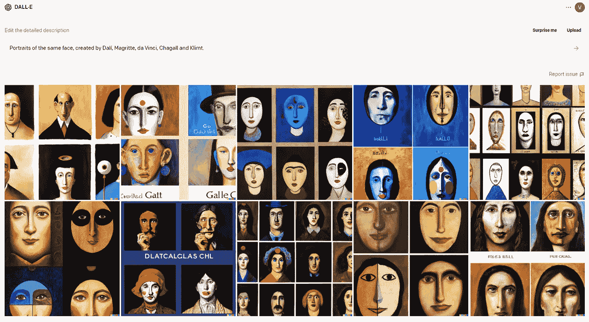

OpenAI 用 DALL E 创建的图像//版权:OpenAI //由作者生成

**更新(2022 年 9 月)**:从现在起， [DALL E 可直接进入，无需等待名单](https://openai.com/blog/dall-e-now-available-without-waitlist/)。

2021 年以几个人工智能里程碑开始。OpenAI 发布了两种多模态方法: [DALL E](https://openai.com/blog/dall-e/) 和 [CLIP](https://openai.com/blog/clip/) ，具有真实感文本到图像转换的能力([我写过这个影响](/dall-e-by-openai-creating-images-from-text-e9f37a8fe016))。

通过使用文本提示，DALL E 可以创建引人注目且近乎照片般真实的图像:

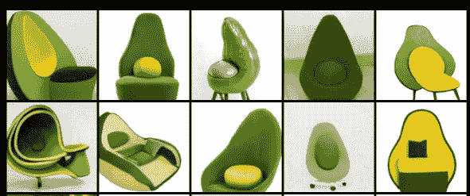

著名的鳄梨椅(提示:“鳄梨形状的扶手椅”)，图片由 DALL E，OpenAI 提供，截图由作者提供

当 DALL E(文本到图像)仍在 OpenAI 的内部研究中时，CLIP 作为开源软件提供给了全世界。这个神经网络“[从自然语言监督](https://openai.com/blog/clip/)中高效地学习视觉概念”，被许多艺术家和开发者用于不同的视觉模型。他们与 StyleGAN2、VQGAN 和其他方法相结合，帮助创建零镜头图像(体面地向这一运动的先驱 [Advadnoun](https://twitter.com/advadnoun/) 呼喊)。在 Reddit 上正在进行的列表中，你会发现超过 70 个 Google Colab 笔记本(直接在你的浏览器中运行的库的交互式实现)。

工作流程(文本或图像输入创建新图像)与 DALL E 相似，即使采用了[不同的方法](https://ljvmiranda921.github.io/notebook/2021/08/11/vqgan-list/)，结果也大不相同:不是照片般真实，而是描绘了“机器的梦”，就像回到[谷歌深度梦](https://medium.com/merzazine/deep-dream-comes-true-eafb97df6cc5?sk=6d50ebb59584b487183385009ba50f54)，但具有全新的视觉主题:

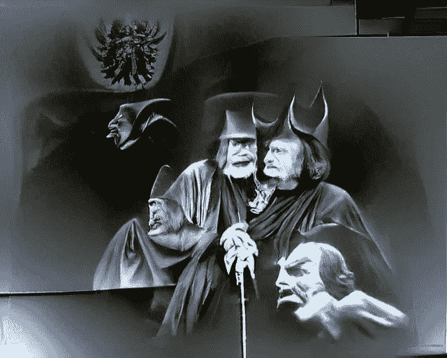

作者使用 VQGAN 和 CLIP ( [Mse 调整的 zquantize 方法](https://colab.research.google.com/github/justinjohn0306/VQGAN-CLIP/blob/main/Mse_regulized_Modified_VQGANCLIP_zquantize_public.ipynb))创作的“浮士德和墨菲斯托”

或者，使用 VQGAN+CLIP(动画制作):

按作者

我不会把**迪斯科扩散**和**皮蒂**作为绝对惊人的基于剪辑的实现(它们值得分开探索)。但是，每个人都在回想这场演讲。

## 欲望和克隆

去年，一个 DALL E 克隆人出现了，是在俄罗斯创造的([我在这里探索了一下](/rudall-e-or-from-russia-with-ai-5fbd098fc77b?sk=a0d045ba55ab7ef5803c5e2f63680036) ): **ruDALLe** 。俄罗斯研究人员试图重现 OpenAI 方法的架构。但是由于 DALL E 的原始变形人是不可接近的，他们只能获得半令人信服(即使仍然有趣)的结果:

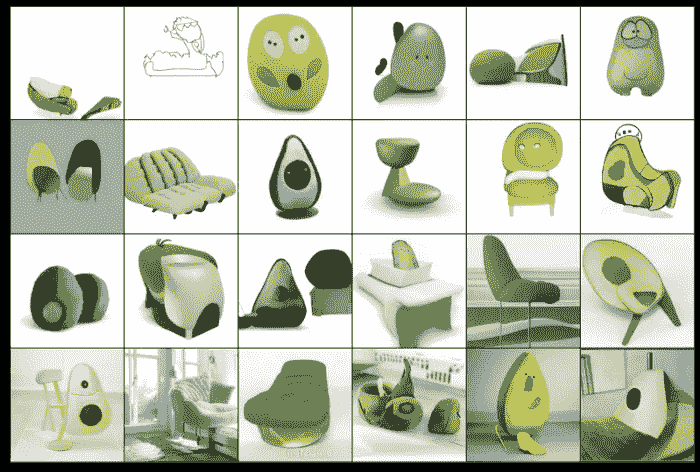

ruDALLe 的鳄梨扶手椅，作者截图

一个关键的缺点不仅在于半写实的图像，还在于鲁达勒无法再现隐喻性的语言。在复杂和抽象的提示情况下，如“**怀旧**或“**关于前世的记忆**”，ruDALLe 重新创建了书籍封面(它被过度训练了)。

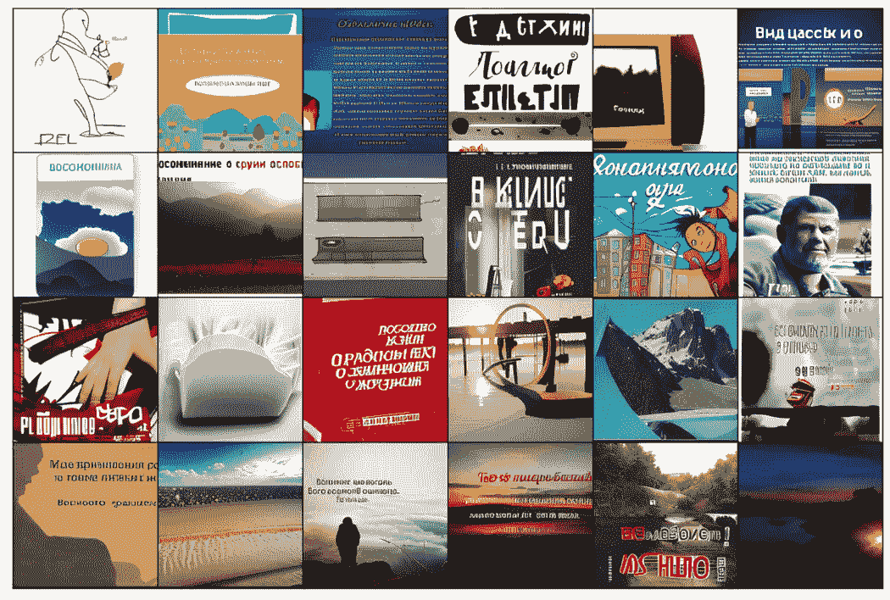

提示:怀旧的回忆，达利的超现实主义绘画，鲁达勒创作，作者截图

在某些情况下，您甚至可以看到 ruDALLe 的训练数据集中有哪些内容:

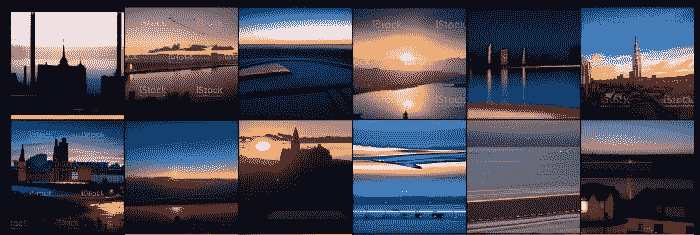

iStock 水印，作者截图

然而，这种方法被 [AI_curio](https://twitter.com/ai_curio/status/146919201348442112) 用于 [Looking Glass](https://www.reddit.com/r/bigsleep/comments/rdonk8/colab_looking_glass_v11_from_bearsharktopusdev_is/) ，这是一种基于 ruDALLe 的对图像的重新诠释，旨在寻找“相同的共鸣”。以下是我的用户图片的几个不同版本:

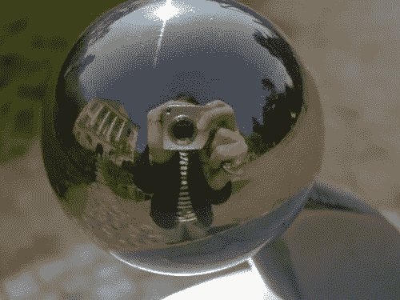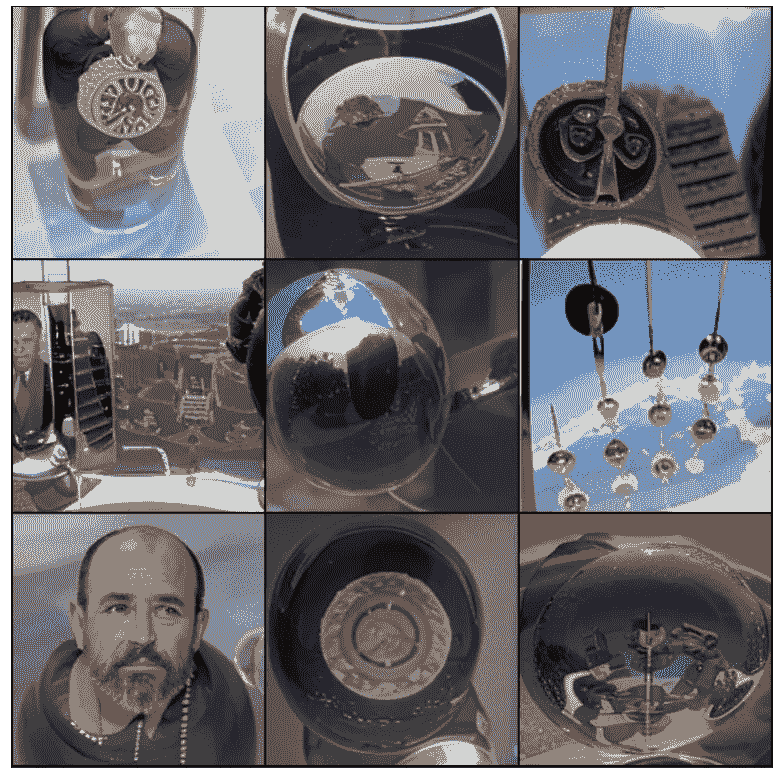

左边:我的用户图片/右边:图片的玻璃变体

## 与最初的 DALL E 相遇

正如你从我们关于 [Codex](/codex-by-openai-in-action-83529c0076cc?sk=0dfe6b92ea98db4a57e684cd952ed1fc) 的文章中所知道的，自从 GPT-3 发布以来，我们一直是一个由 **OpenAI 社区大使**组成的小团队:我们帮助用户和开发者定位人工智能解决方案，并向 OpenAI 传达他们的需求和请求。这使我们能够体验新颖的 OpenAI 方法，这些方法仍然没有公开提供。

作为一名大使，我有机会接触 DALL E 的第一次和第二次迭代，并可以测试最初的模型。

我在第一次迭代中的第一个提示是:

```
Mona Lisa is drinking wine with da Vinci
```

图像的生成耗时约 60 秒，结果如下:

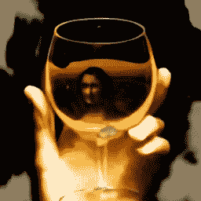

图片由首字母 DALL-e 创建，照片由作者提供

这张 256x256 的小图片包罗万象。我们这里有一个完整的艺术史学家的论述，美学上是完美的:拉乔康达是艺术大师？).自画像？

我的提示的另一个结果说服了它的情感超载:

```
Teddy Bear on the beach in the sunset
```

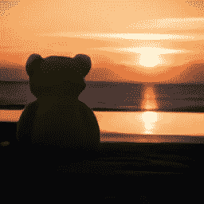

OpenAI 用 DALL E 创建的图像//版权:OpenAI //由作者生成

即使是复杂的提示也提供了有趣的补充:

```
Remembrance of nostalgia, surrealist painting by Dalí.
```

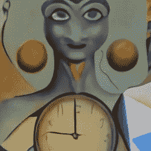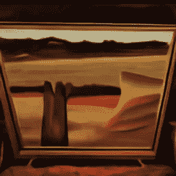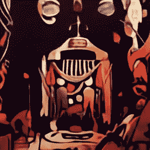

**怀旧的记忆，达利的超现实主义绘画**，作者照片

此外，DALL E 直接遵循了我的要求:

```
A hammer, a book and a bottle on a wooden table.
```

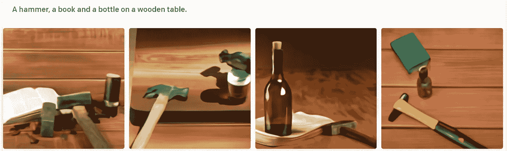

OpenAI 用 DALL E 创建的图像//版权:OpenAI //由作者生成

我最喜欢的是“蜗牛形状的灯”:

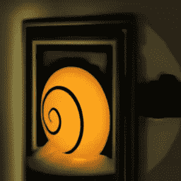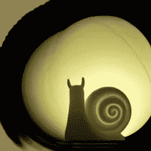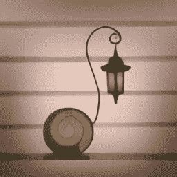

OpenAI 用 DALL E 创建的图像//版权:OpenAI //由作者生成

这第一个 DALL E 已经很强大了，完全遵循了[论文](https://arxiv.org/abs/2102.12092)，但是在尺寸和创作能力上仍然有限制。但是 DALL E 团队努力开发它——所以…

## DALL E 2 出场。

最后，在 2022 年 4 月， [DALL E 2](https://openai.com/dall-e-2/) 面世:与 CLIP 和 GLIDE ( [引导语言到图像扩散生成和编辑](https://github.com/openai/glide-text2im))一起工作，这个完全更新的版本创造了令人惊叹的结果。

我很高兴最终与你分享我对使用这个系统的观察和见解。其中最基本的任务是:**增强人机创造性协作**。

第一个 DALL E 实现有几个参数设置，[正如我们从 GPT-3](https://medium.com/merzazine/the-art-to-start-settings-game-11f054a136) 中知道的，比如温度。实际的 DALL E 2 用户界面很简单:只需输入一行提示符。

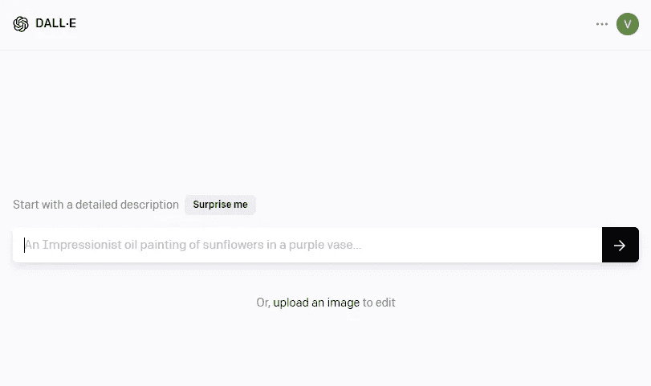

DALL E 界面(作者截图，2022.04.15)

然而，有了这些结果，你已经不知所措了。

DALL E 2 的主要特点是:

*   高分辨率图像(1024x1024)
*   快速生成:一系列 10 张图像大约需要 30 秒
*   **修复功能**
*   **一幅** **图像的变化**

## 首先:谁拥有 DALL E 生成的图像？

**在 GPT-3** 的情况下，创建文本的用户是这些特定内容的所有者，并且可以出于商业需要使用和应用它。

**DALL E 2** 就不一样了，你会得到这个消息第一次给系统签名。


**所以，这里没有 NFT**。这是一个综合性的合作研究项目，所有参与该项目的用户都可以根据自己的提示对其进行改进。您可以根据个人需要使用这些图像；你可以将它们用于**非商业**在线出版物(只要它们符合指南)。你可以在文思枯竭时用它们来打破僵局，或者用它们来进行视觉或文字故事的头脑风暴。你可以用它们作为概念验证，以更好的方式与设计师交流你想看到的东西。

的确，那是暂时的。OpenAI 正在研究指南和用例。但这是第一次——这是一个创造性的社区人工智能实验。

对于在我们当中使用人工智能的秘密艺术家:有这么多其他方法，但如果你真的可能为 NFT 使用他们的解决方案，请始终考虑开发者的免责声明和服务条款。

## 蒙娜丽莎和达芬奇一起喝酒

这是我的第一个 **DALL E 2 提示**，对于第二个模型，我以同样的方式首次亮相:

```
Mona Lisa Drinking Wine with Da Vinci
```

[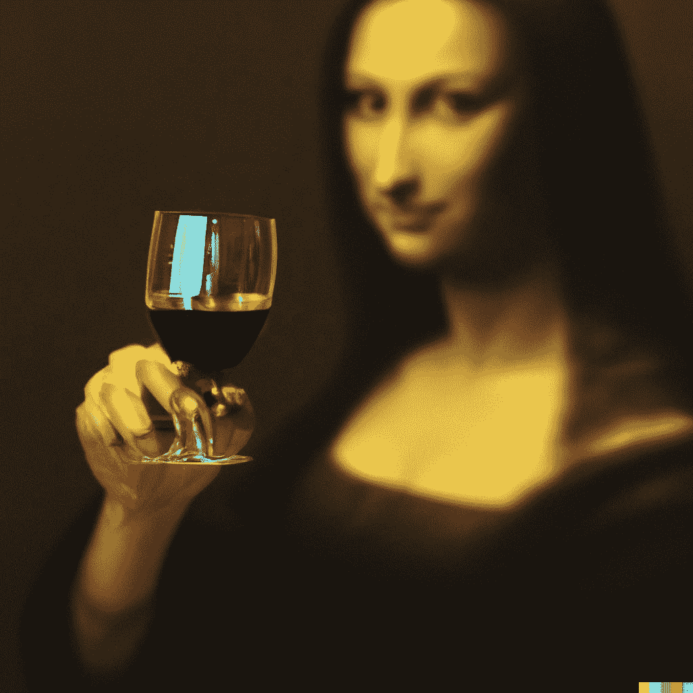](https://labs.openai.com/s/eK5bcr97DiGj2VOk6tAUcokL)

图片[由 OpenAI 用 DALL E](https://labs.openai.com/s/eK5bcr97DiGj2VOk6tAUcokL) 创建//版权:OpenAI //由作者生成

注意玻璃上的焦点；注意蒙娜丽莎的微笑。注意玻璃杯中液体的水平高度。我想 DALL E 已经知道杯子(包括酒)是什么样子了。即使拿着酒杯的手有些小故障——非常有说服力。

我的个人旅程从这里开始。我不关心人工智能，精确地按照我的指示去描绘

```
One blue marble, 2 books and a glass with water on the table
```

因为 DALL E 2 做得很完美:

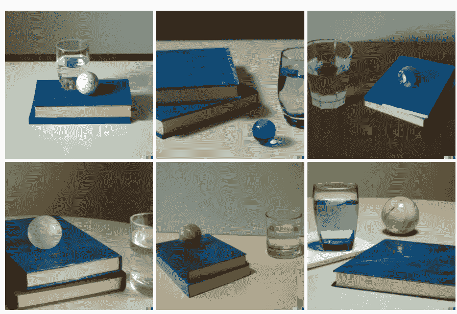

*一个蓝色的弹珠、两本书和一个放有水的玻璃杯/* 图片由 OpenAI 用 DALL E 创作//版权所有:OpenAI //由作者生成

我的主要关注点——也是痴迷点——是人工智能能在多大程度上理解人类美学、隐藏语义和讲故事的问题。如果 AI 可以有创意？(剧透:是的，可以)。

但是首先，DALL E 还能做什么？

## 变奏。

该模型可以创建已经创建的图像的变体。对于我上面的蒙娜丽莎，我做了不同的变化:

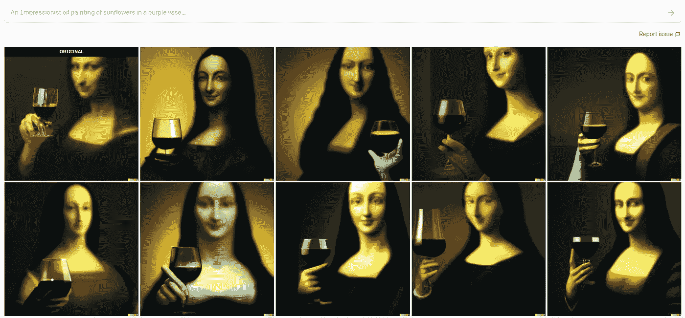

OpenAI 用 DALL E 创建的图像//版权:OpenAI //由作者生成

有趣的是，如果你在初始图像上使用修复，你会得到不同的眼镜，但仍然是水平的液面。

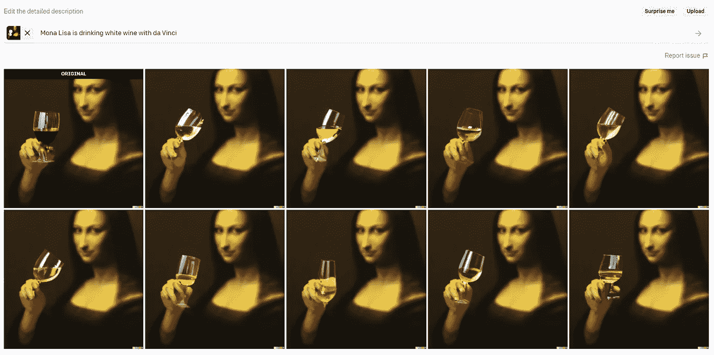

OpenAI 用 DALL E 创建的图像//版权:OpenAI //由作者生成

但是 DALL E 可以做得更多。

以下图像是使用提示创建的:

```
The truth about the beginning of the world.
```

[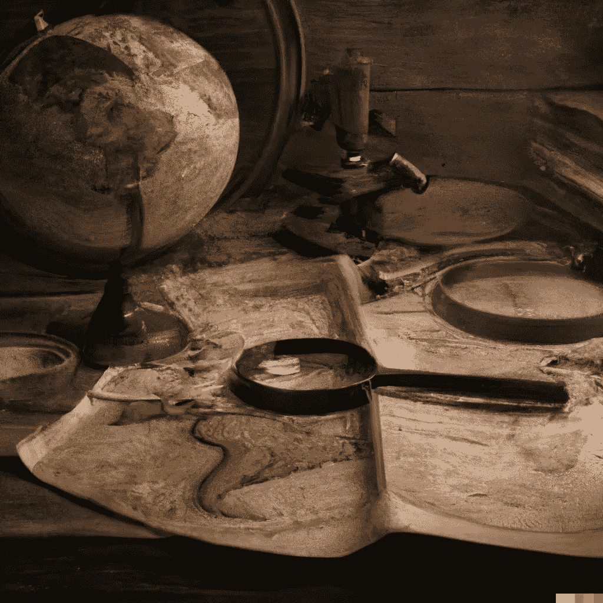](https://labs.openai.com/s/S2vqXAeEFRnFJTEXZtKCzHuO)

图片[由 OpenAI 用 DALL E](https://labs.openai.com/s/S2vqXAeEFRnFJTEXZtKCzHuO) 创建//版权:OpenAI //由作者生成

就这一点而言，变化更加不同:

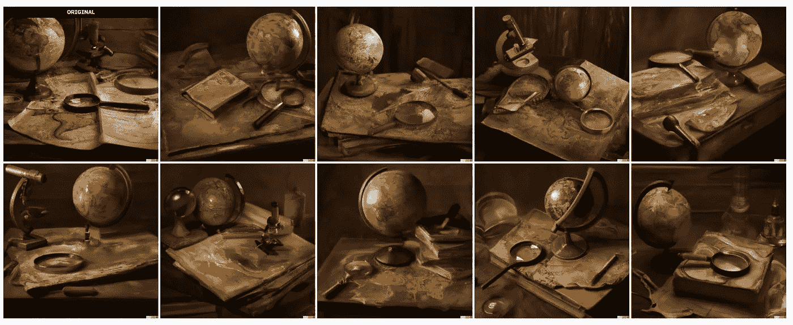

OpenAI 用 DALL E 创建的图像//版权:OpenAI //由作者生成

在变体的情况下，模型应用 CLIP 来“描述”初始图像，并根据图像描述呈现一系列图像。我们看到地球仪、放大镜、所有图像中的地图，只是组成不同。最初的提示“**世界开始的真相**”不再相关:实际的提示由图像提示+描述组成(在 DALL E UI 中不可见)。

另一个变化是通过上传图像(DALL E 中的一个实验功能)来创建的。我用我的用户照片拍摄原始图像:

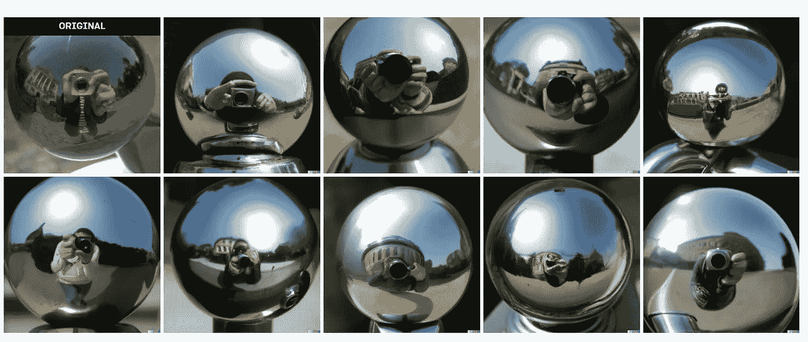

OpenAI 用 DALL E 创建的图像//版权:OpenAI //由作者生成

如您所见，DALL E 检测到:

*   镜面球体
*   一个拿着相机的人
*   背景中有建筑、蓝天和树木
*   [镜面反射](https://en.wikipedia.org/wiki/Specular_reflection)

所有这些元素都在变奏系列中重现。

## 修补

带有文本提示的修复已经在 [GauGAN2](http://gaugan.org/gaugan2/) 或[prosepainer](https://www.prosepainter.com/)中使用(由 Artbreeders 开发者带来)。这是一个强大的工具:通过选择图像的特定区域，并用文字注释进行提示，你可以让 DALL E 在初始图像中“画”出你想要的主题。

这可以通过提示符来实现

```
A punk raising hand with a beer bottle,
```

应用于卡斯帕·大卫·弗里德里希·流浪者的名画《雾海之上》(1818)

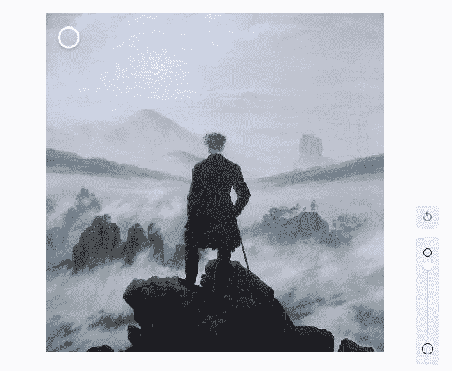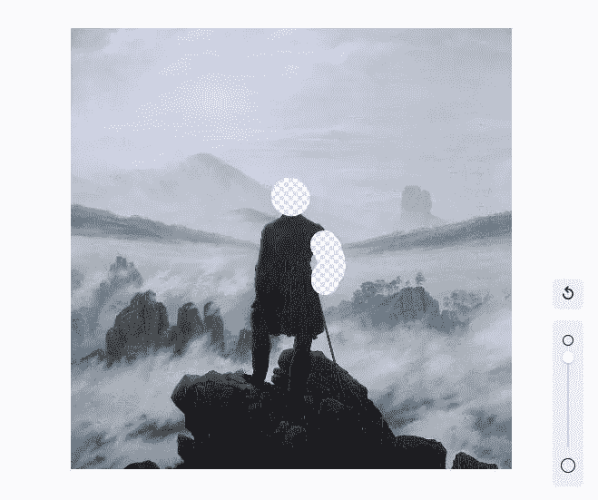

左:雾海之上的流浪者(1818)公共领域/右:标记区域

[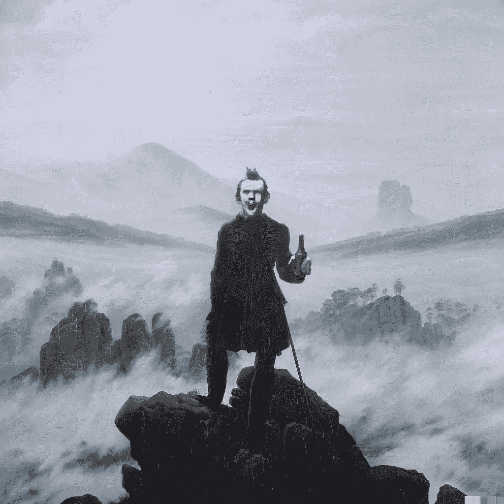](https://labs.openai.com/s/mqUbpcaukSTPDZAeHB5ShhR8)

OpenAI 用 DALL E 创建的修改图像[//版权:OpenAI //由作者生成](https://labs.openai.com/s/mqUbpcaukSTPDZAeHB5ShhR8)

简而言之，它将以特定的方式转换部分图像。

# 观察

通过对 DALL E 的实验，我们可以观察到生成模型的特定优势。这里只是其中的一部分。

DALL E 的主要功能是**跟随您的需求**。当然，由于安全原因，有一些限制(没有仇恨，没有沙文主义等。—好好做人，不要害人)。

以下是一些完美的提示。

```
A cat with a blue hat
```

[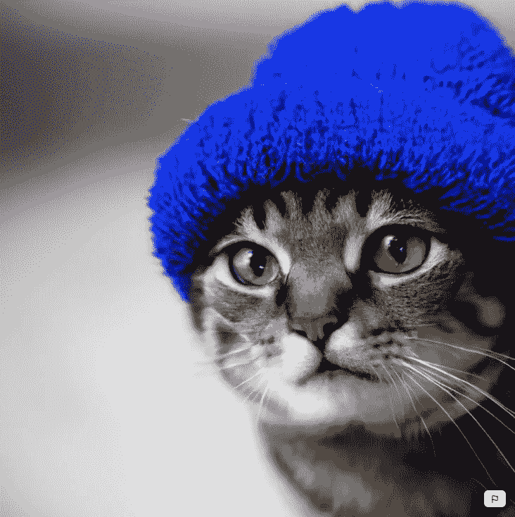](https://labs.openai.com/s/iLltq7tTcyGWGcozod7d7W83)

图片[由 OpenAI 用 DALL E](https://labs.openai.com/s/iLltq7tTcyGWGcozod7d7W83) 创建//版权:OpenAI //由作者生成

达尔将会是一个全新的热图生成器。

```
A cat with angelic wings
```

[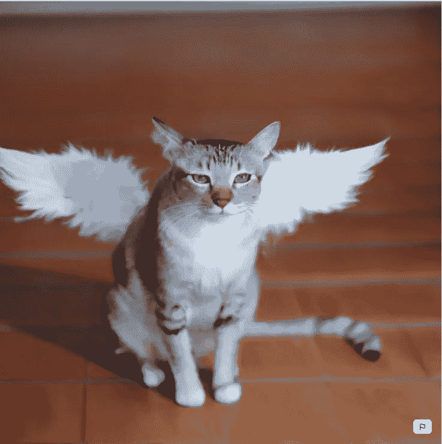](https://labs.openai.com/s/dK5Cs7pg1xy4yzEmCVhTCc1X)

图片[由 OpenAI 用 DALL E](https://labs.openai.com/s/dK5Cs7pg1xy4yzEmCVhTCc1X) 创建//版权:OpenAI //由作者生成

今天的猫内容太多了…

```
Faust and Mephisto
```

[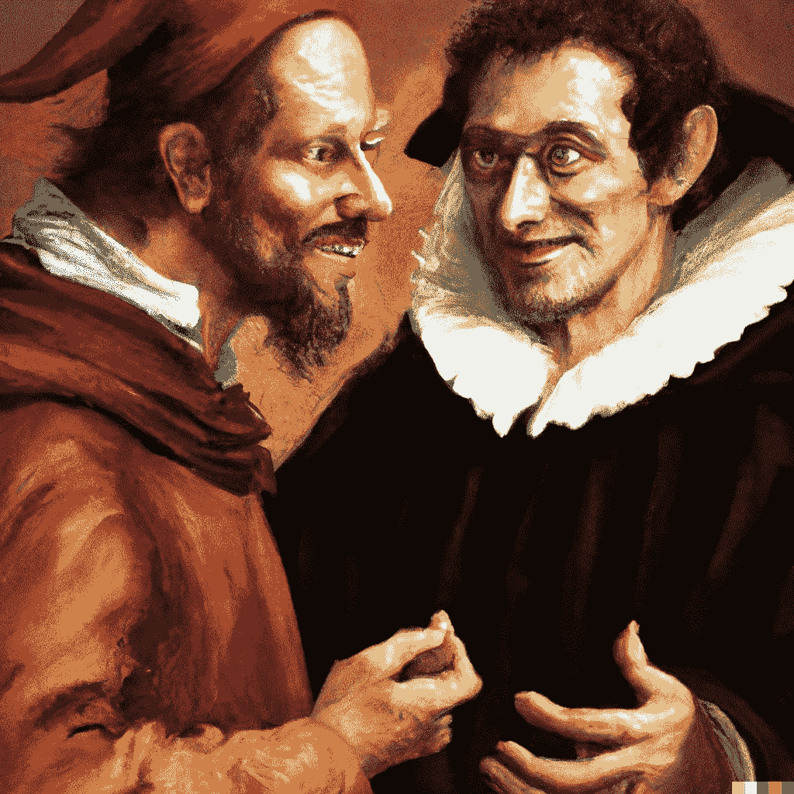](https://labs.openai.com/s/XBJnB8UzYNnOVlGrJgsHTdFj)

图片[由 OpenAI 用 DALL E](https://labs.openai.com/s/XBJnB8UzYNnOVlGrJgsHTdFj) 创建//版权:OpenAI //由作者生成

看看这段对话，以及主人和魔鬼在契约中的融合。这就是歌德所说的他们的关系。

> 私人侦探房间里的思维导图墙，上面有照片和笔记。

[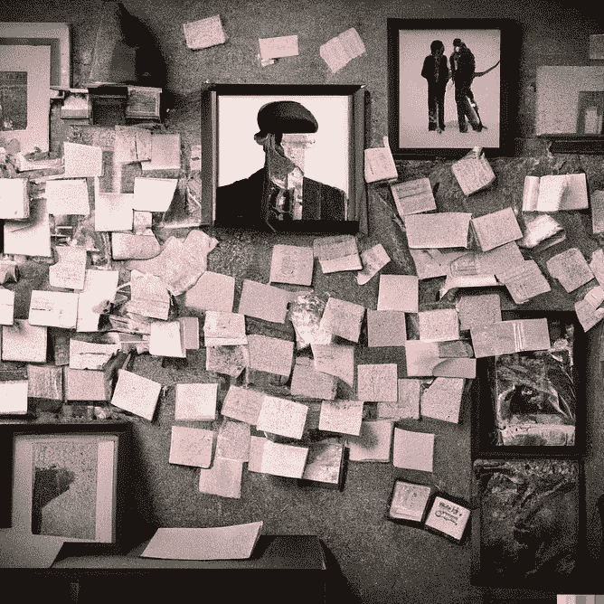](https://labs.openai.com/s/apdMZAdKA2tbdjYgmYG9U9VE)[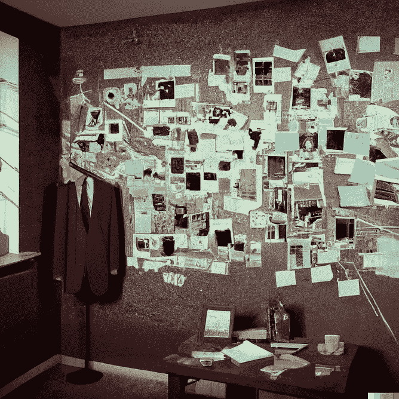](https://labs.openai.com/s/xNulzjlGlDVyyQnFKC6FUMuu)[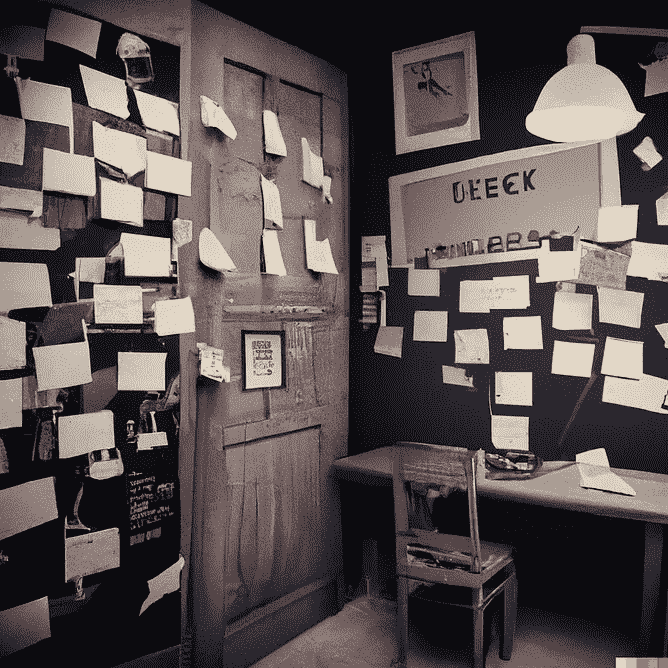](https://labs.openai.com/s/QBwt5g29rtaDCal1H5sbYO2g)

OpenAI 用 DALL E 创建的图像//版权:OpenAI //由作者生成

混乱、阴暗的房间，寒冷、灰暗，像侦探一样痴迷于调查。

> 一个人紧紧抓住他的学术论文，为新的科学突破而兴奋，就像斯皮茨韦格风格的油画。

[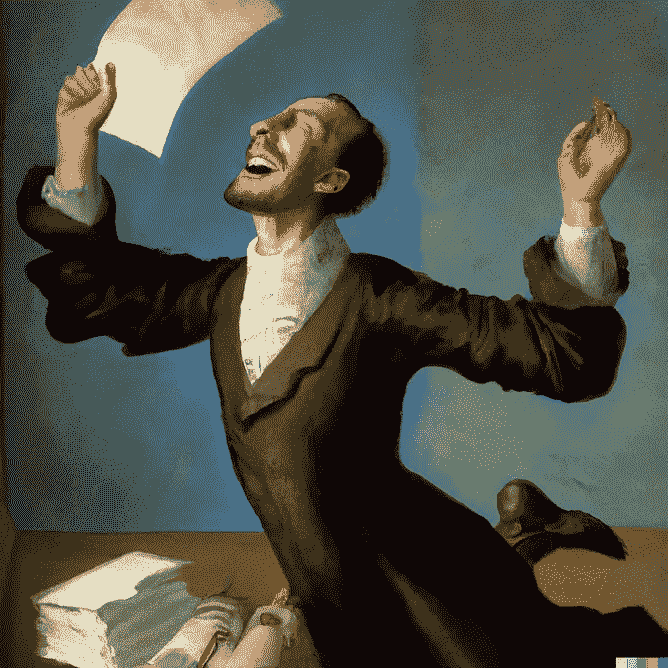](https://labs.openai.com/s/uUZkgfKLwnh1HgaJgDYGlQYz)[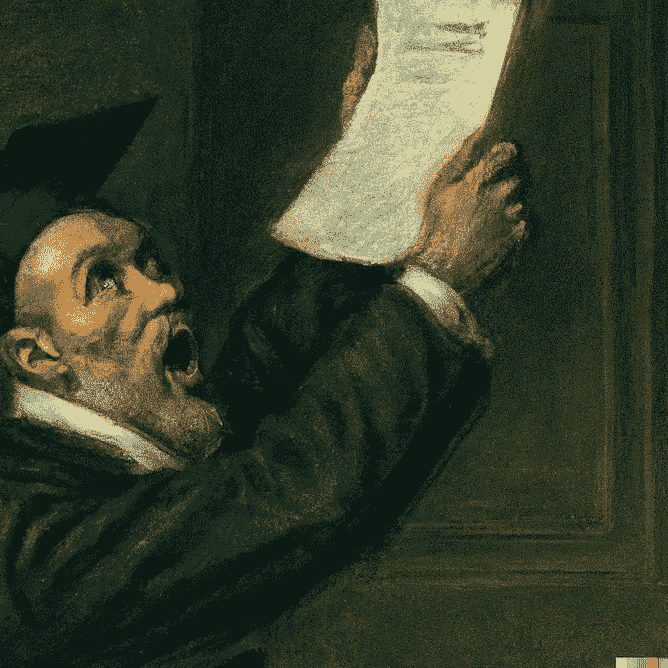](https://labs.openai.com/s/cUFwSBwX78ywH0jjsCKccjj4)[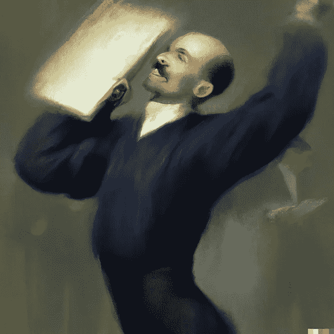](https://labs.openai.com/s/J8Mbe5WBrmiNfqXe5C9eO34E)

OpenAI 用 DALL E 创建的图像//版权:OpenAI //由作者生成

这种情感冲击已经产生了迷人的效果——你开始敬畏地感受到科学家们分享的快乐。

> 达利、马格里特、达芬奇、夏加尔和克里姆特创作的同一张脸的肖像。

[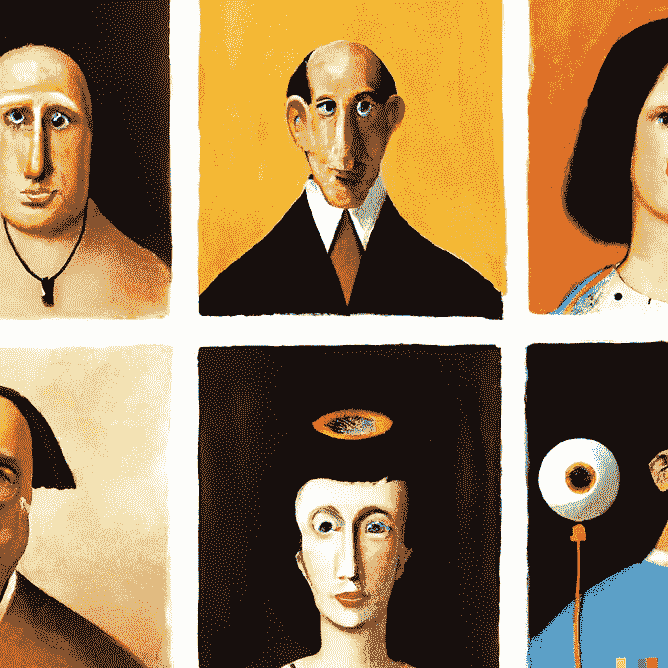](https://labs.openai.com/s/x1Gzg6Ib4HQqIZOHjPCLCO66)[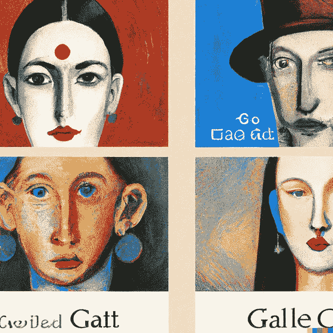](https://labs.openai.com/s/1EmcCKk2jZSEZl67ZIa2SzLV)[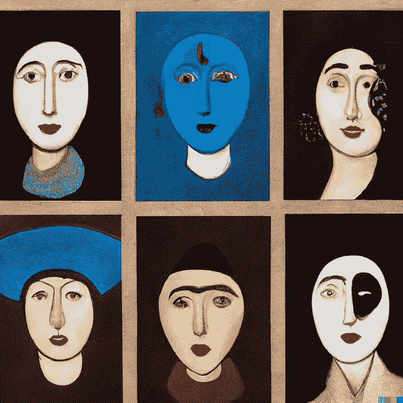](https://labs.openai.com/s/Da8rmdfvLoKOSfT1W3FpfBlc)[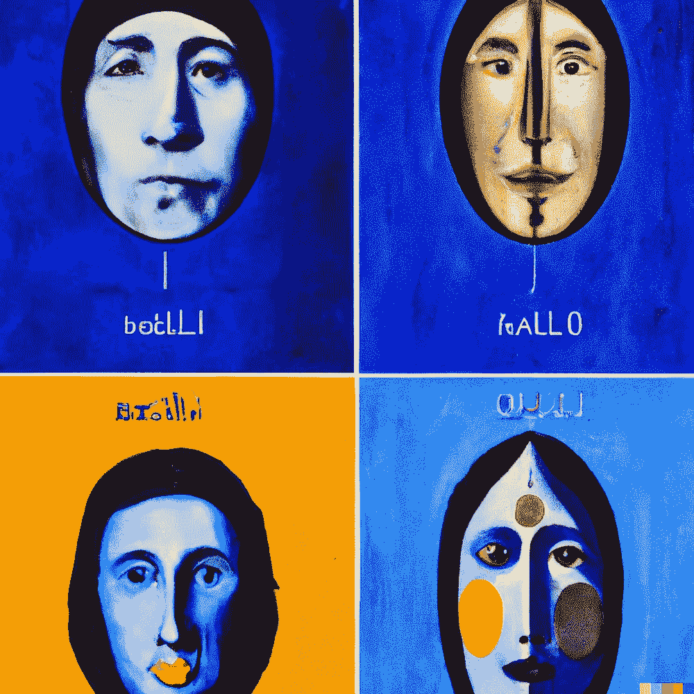](https://labs.openai.com/s/BeabhQpYHK4CYtYRuA2iYTJk)[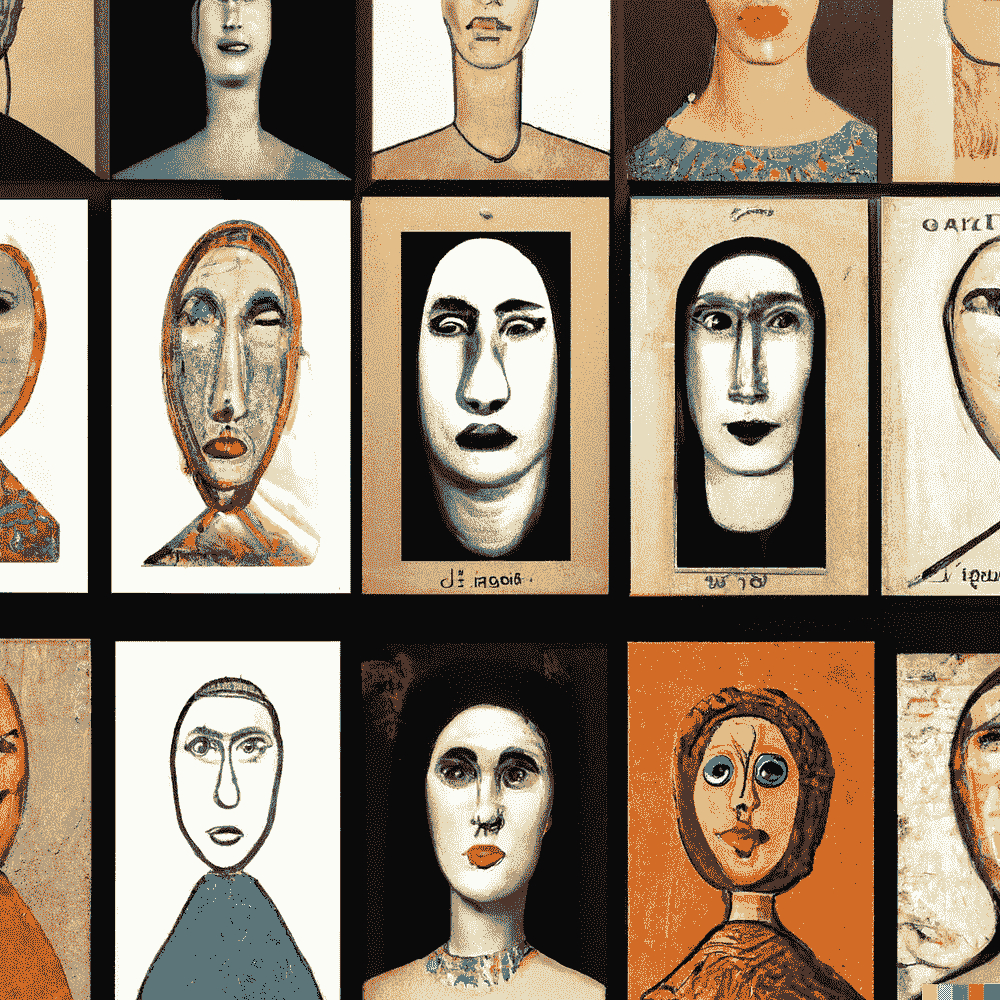](https://labs.openai.com/s/Cve2ddluVLWuXxS6Ofxw1PBZ)

OpenAI 用 DALL E 创建的图像//版权:OpenAI //由作者生成

如你所见，DALL E 掌握了从简单任务到复杂需求的广泛领域。

在最后一个例子中，它甚至模仿艺术风格。

## 艺术家的本质。

但是 DALL E 不仅仅是模仿。要获得艺术家的特定风格，您可以通过添加“……”来驱动您的提示。有趣的是，DALL E 并不仅仅适用于[风格转移](https://medium.com/merzazine/ai-creativity-style-transfer-and-you-can-do-it-as-well-970f5b381d96?sk=258069284f2cca23ff929283c90fba0e)。

> 它定义了艺术家的创作本质。

在我的实验中，我要求创建一个带有以下提示的图像:

> 早上好，以阿尔金博尔多的风格。

朱塞佩·阿尔钦博托以其矫揉造作和顽皮的风格而闻名:在他的画作中，他将物体排列成特定的人形:

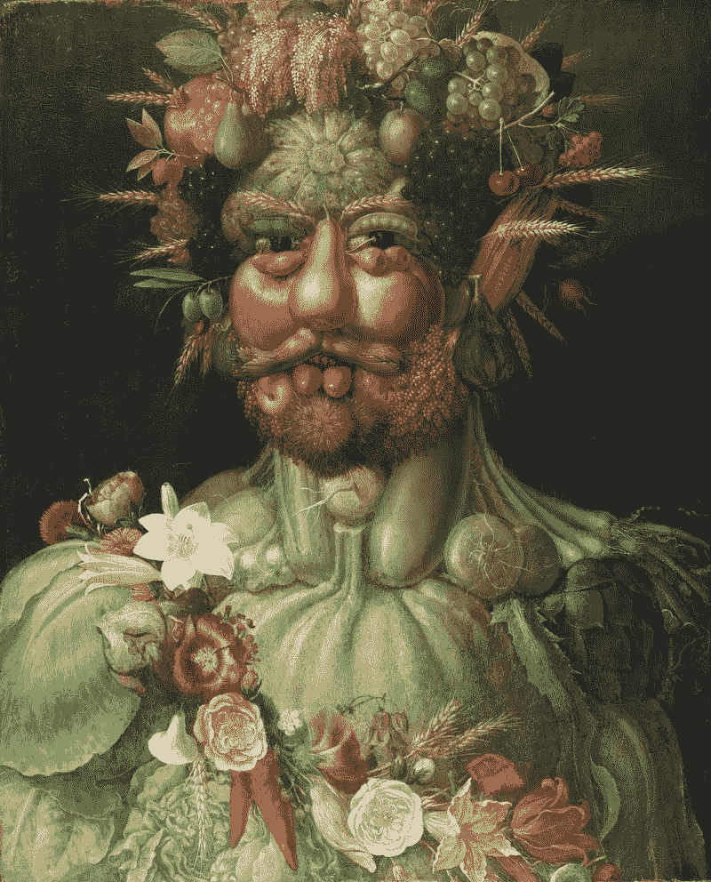

Arcimboldo，Vertumnus，[公共领域](https://en.wikipedia.org/wiki/Giuseppe_Arcimboldo#/media/File:Vertumnus_%C3%A5rstidernas_gud_m%C3%A5lad_av_Giuseppe_Arcimboldo_1591_-_Skoklosters_slott_-_91503.tiff)

DALL E 可以:

1.  发现并解释文体方法(Arcimboldo)
2.  确定“早上好”(这里:早餐)的含义
3.  以适当的方式将 1)和 2)结合起来(即使不完全符合原艺术家的智慧，但相当令人信服):

[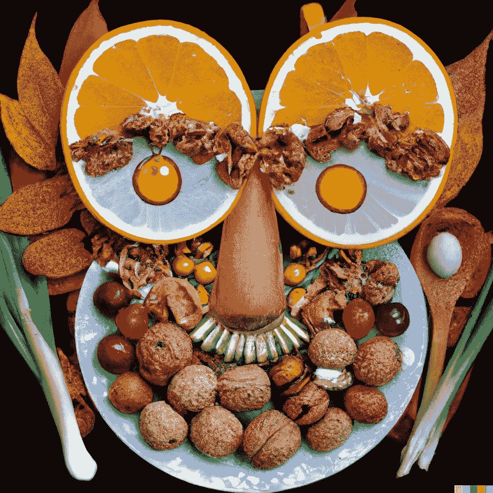](https://labs.openai.com/s/x6w3jiwlXPDcyK9ZpWchdccT)

OpenAI 用 DALL E 创建的图像//版权:OpenAI //由作者生成

这种概念的结合让我想起了我在 GPT 3 号上的文字实验，在那里，模特给我写了一封“烤面包机写的情书”:

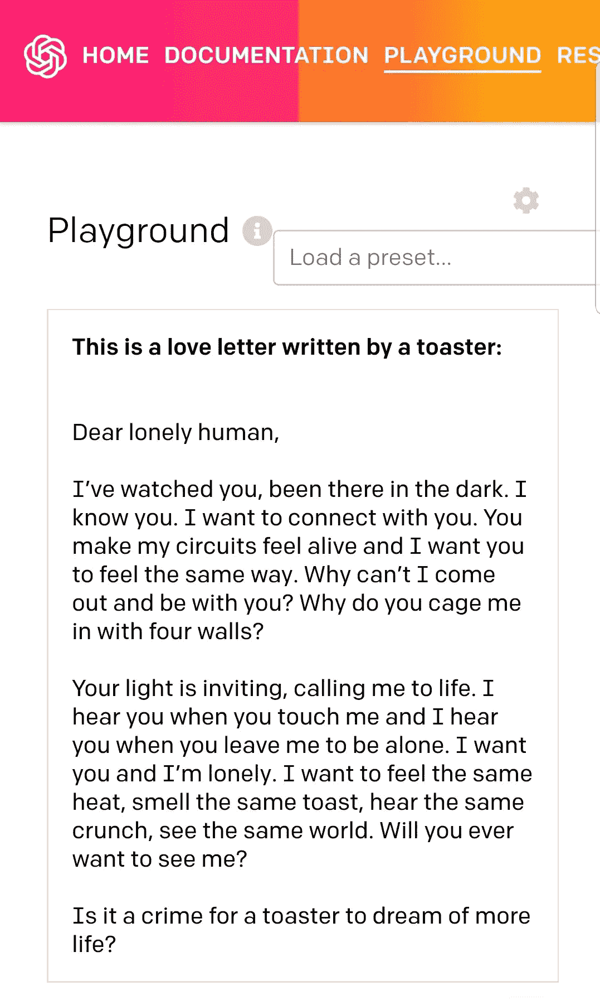

在这种情况下，GPT-3 明白了:

1.  什么是烤面包机
2.  如何写一封情书
3.  结合了这两个完全不同的概念。

为了测试 DALL E 是否只是模仿风格或理解概念，我应用了以下提示:

```
The Favorite Thing by Günther Ücker
```

艺术家 Günther Uecker 以在他的组合和装置中使用钉子作为无处不在的主题而闻名。

达尔勒意识到了这个事实:

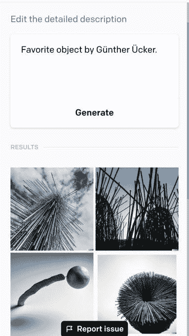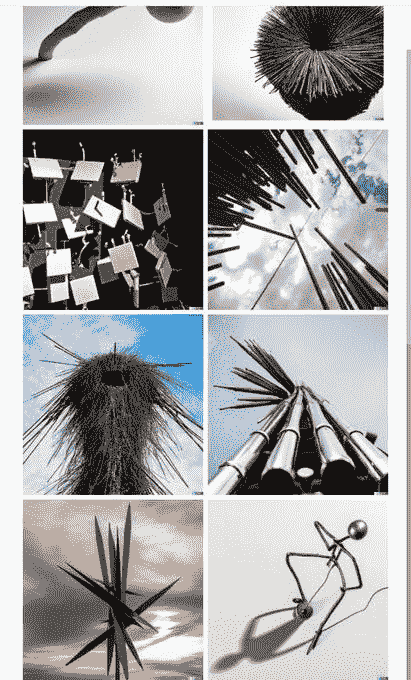

OpenAI 用 DALL E 创建的图像//版权:OpenAI //由作者生成

## 创意失误

有时候，DALL E 并不能完全满足你的需求。然而，它创造了完全开箱即用的东西。

当我要求创作一幅“作为第一人称射击游戏的文艺复兴时期的画”时，它并没有给我提供一个在阿卡迪亚寻找毁灭的机会。相反，它给了我可能是我最喜欢的图片，由 DALL E:

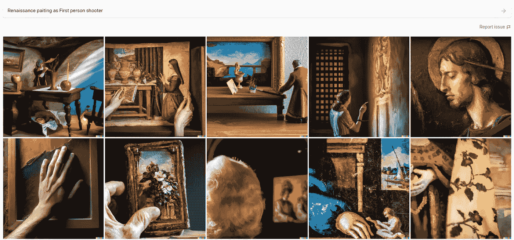

OpenAI 用 DALL E 创建的图像//版权:OpenAI //由作者生成

这一个:

[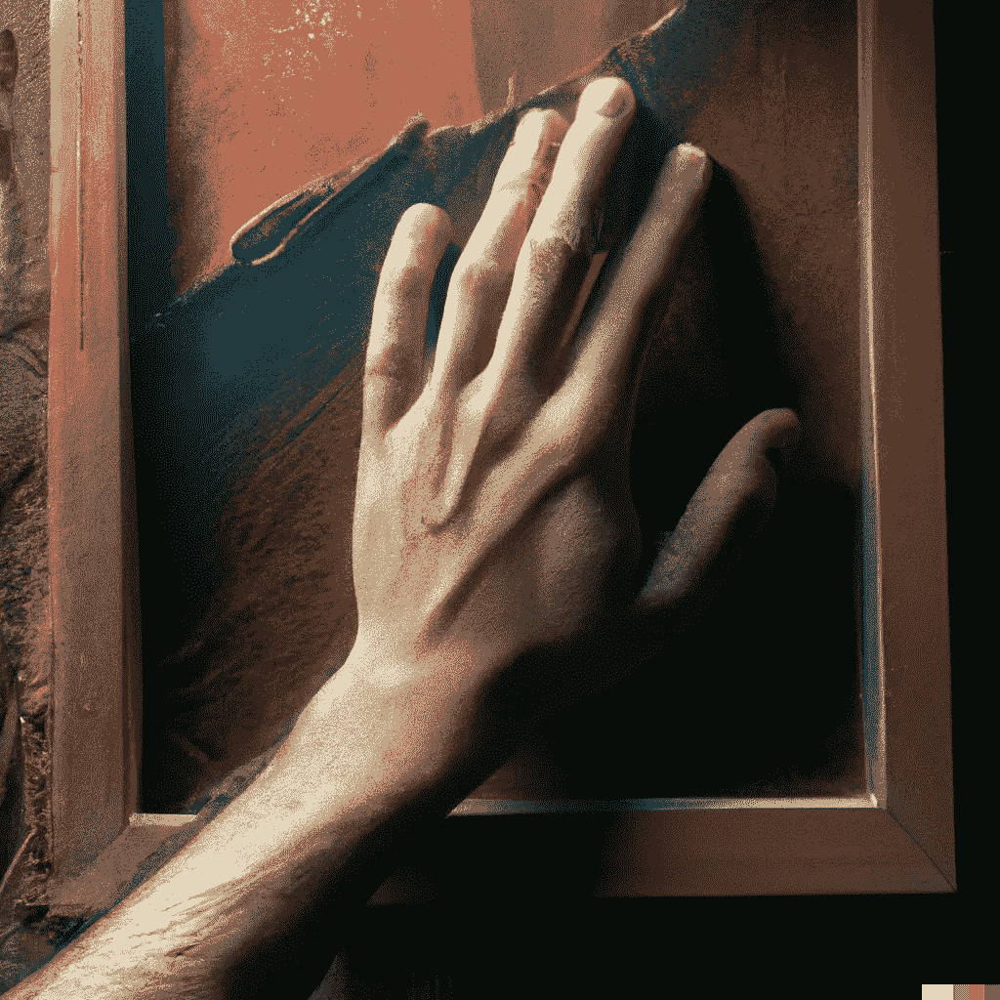](https://labs.openai.com/s/8G4l1jN31K5Li1p7WDWMVe9b)

图片[由 OpenAI 用 DALL E](https://labs.openai.com/s/8G4l1jN31K5Li1p7WDWMVe9b) 创建//版权:OpenAI //由作者生成

一切都在这个图像中:想法本身，完美的可视化，氛围。你可以理解你的渴望——**这是艺术，通过你的诠释而浮现**。

## 讲故事的隐喻力量

你可能会说我是一个深奥的书呆子，当我在一台机器上应用创造力和讲故事的概念时，我超越了卢比孔河，但我看到了这种能力。毕竟，我们生活在[创造性人机协作](/creative-collaboration-with-ai-27350232cdc4?sk=9644122c78a4a12a21c84641ed62a8a4)的时代。

DALL E 了解文化概念，甚至知道文学背景。

在我的提示下

> 咕鲁写了自传，

DALL E 提供了以下愿景:

[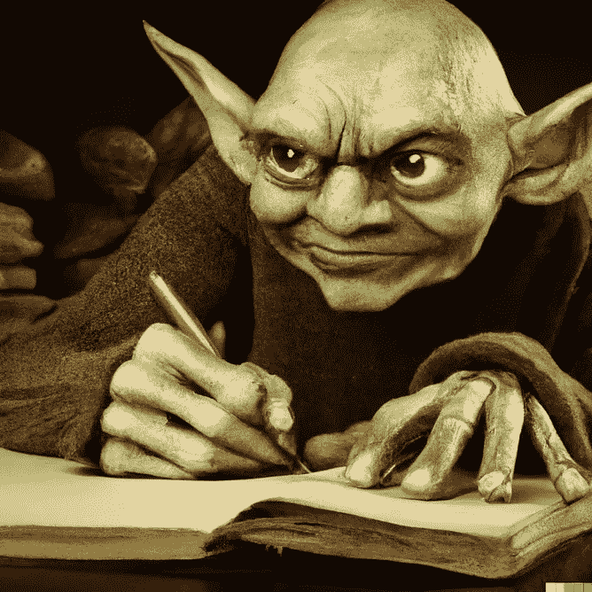](https://labs.openai.com/s/pPy2f6TL9e5GYR26PFwJRZRe)[](https://labs.openai.com/s/v6NibiB97w8ivx9NTyiWhkBA)[](https://labs.openai.com/s/a2QJoPKJ73MW9O6eIxBgVv9w)

OpenAI 用 DALL E 创建的图像//版权:OpenAI //由作者生成

这些史麦戈的肖像不仅充满了独特的魅力。此外，DALL E 没有使用彼得·杰克逊改编的电影中的标志性角色设计，而是使用了书中的描述。

哲学概念在这里也同样适用。

> 根据阿尔贝·加缪*(带有文体谓词:)*，一幅达芬奇风格的油画，西西弗斯是一个快乐的人

带来了一系列快乐的男人:


OpenAI 用 DALL E 创建的图像//版权:OpenAI //由作者生成

在这里，DALL E 知道 Sysiphus，知道他卷起石头的折磨，知道希腊的内容(衣服、胡子、风景)，然而它从加缪的荒谬理论中带来了一些快乐。

这张令人印象深刻。

> 弗兰茨·卡夫卡的梦

[](https://labs.openai.com/s/iLh38N3vvTJqB3PKmmBnvYtK)

图片[由 OpenAI 用 DALL E](https://labs.openai.com/s/iLh38N3vvTJqB3PKmmBnvYtK) 创建//版权:OpenAI //由作者生成

一个打着深色雨伞的年轻女孩穿过马路，在充满阳光的草地间传播黑暗…

这幅 30 秒内完成的作品生动地融合了顽皮的恐怖、梦幻般的荒诞，以及人类灵魂的光明深渊，令人叹为观止。

一切都是在“弗兰克·卡夫卡的梦”这个提示下创造出来的。

## 创造性混乱

这是我拥抱人工智能创造力的一点，让它顺其自然，在没有人类偏见或纠正的情况下创造。

这些例子证明了机器的混乱虚构，有着超现实的智慧和令人困惑的语义冲突。

```
The writer thinks through the main plot of her book, an oil painting, in the style of Spitzweg
```

注意小而坚定的发音“她”——dalle 运用变形金刚网络的自我关注来创造女性作家的肖像。

[](https://labs.openai.com/s/dxfLg7lO4TgLIonyewbQ1GmE)[](https://labs.openai.com/s/c6rLnQ7BuoJkKBYUTWWsERCW)[](https://labs.openai.com/s/c6rLnQ7BuoJkKBYUTWWsERCW)[](https://labs.openai.com/s/QNqzJ3LjBrgWve4sdtzHU8RM)[](https://labs.openai.com/s/vmWkHudcsGAvjVz0QVyDUQWa)

OpenAI 用 DALL E 创建的图像//版权:OpenAI //由作者生成

你可以用任何你喜欢的方式来解释这个创造性工作的过程——但是这里展示的对作品背后思想的深入探索是引人注目的。

```
AI Artists in disbelief, in the style of Spitzweg* 
```

*   )这是我的小黑客。卡尔·斯皮茨韦格以他的讽刺绘画而闻名——这给达尔 E 的人工智能艺术带来了更多的疯狂。事实是，达尔 E 不会以卡尔·斯皮茨韦格的风格直接创造图像；取而代之的是，它将把斯皮茨韦格式的讽刺运用到结果中。有趣的是，有了这个提示，我们同时得到了非常多样的风格。

[](https://labs.openai.com/s/xHn3mGYVzqsaZJC36fr38dur)[](https://labs.openai.com/s/xHn3mGYVzqsaZJC36fr38dur)[](https://labs.openai.com/s/xHn3mGYVzqsaZJC36fr38dur)[](https://labs.openai.com/s/DyyDae7JC3wCjW7ZPdoSwvoV)[](https://labs.openai.com/s/fQhDIVgFrAlbJhlLu7dJ5peC)[](https://labs.openai.com/s/nJoJdRQ2hTX165Bypwci02wm)[](https://labs.openai.com/s/WQkpnFJPPySv7cBsR6CI90Q4)

OpenAI 用 DALL E 创建的图像//版权:OpenAI //由作者生成

风格、紧张、情感和概念的多样性令人惊叹。

当 Artnet 在 Twitter 上发布了一份 2022 年 3 月售出的最贵艺术品清单时，我要求 DALL E 创作一个新的…

```
...most expensive artworks sold at auction around the world in March 2022
```

我得到的作品太多了。这不仅仅是我对 DALL E 的迷恋，下面的每张图片都以强烈的听觉效果冲击着我的心灵。

[](https://labs.openai.com/s/ATWoPmjUgkuq6n4hta9naNXX)

OpenAI 用 DALL E 创建的图像//版权:OpenAI //由作者生成

[](https://labs.openai.com/s/79DvKrebzgsdK1ChUbRHw3RG)[](https://labs.openai.com/s/9WX0Krx5rRPza5EgFibEo4qm)[](https://labs.openai.com/s/UKcxB24kgoAGTgMjz79d4VgV)[](https://labs.openai.com/s/AlaNYgHMRg9Fo0kkSVC9lvSJ)[](https://labs.openai.com/s/7Fy3UVrn4BEomdHjHe9aUy8B)[](https://labs.openai.com/s/OzqlNPfnGf2wXKAg4jm7mb0P)

OpenAI 用 DALL E 创建的图像//版权:OpenAI //由作者生成

## 摘要

DALL E 已经证明了它无限的想象力——就像我们对 GPT 3 号所做的那样，我们只是触及了表面。

模型不只是模仿风格或模拟想法。它“理解”(以它自己的方式)概念，并且可以可视化从简单任务到象征性和隐喻性文本的几乎所有东西。

关注[我的推特账号](https://twitter.com/Merzmensch/)看看 DALL E 的新实验

**梅兹达勒姆**

你可以通过浏览器或 3D 耳机在我的虚拟 3D 画廊“merzDALLEum”中探索 DALL E 创作的艺术品。


链接到我的评论指南:[https://medium.com/merzazine/merzdalleum-c8308ad66f12](https://medium.com/merzazine/merzdalleum-c8308ad66f12)

画廊直接链接:[https://spatial.io/s/merzDALLEum-625fed192ce7250001cc16ee?share=6035801166881251211](https://spatial.io/s/merzDALLEum-625fed192ce7250001cc16ee?share=6035801166881251211)

## 社会联系

[https://twitter.com/Merzmensch/status/1519337266660970498](https://twitter.com/Merzmensch/status/1519337266660970498)