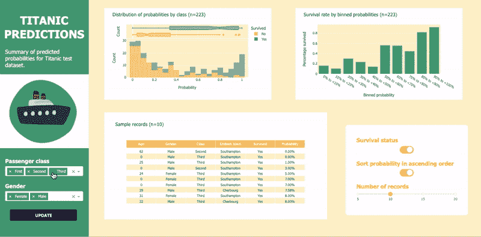
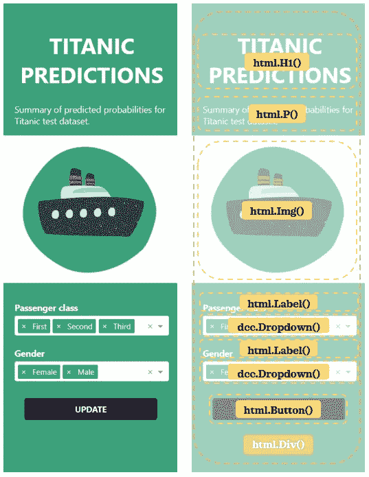
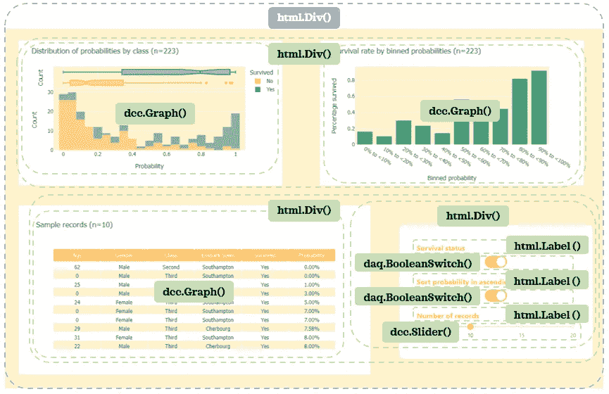
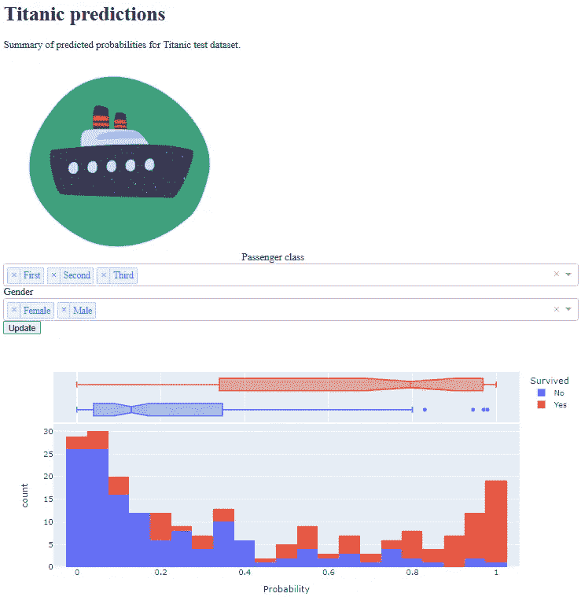

# 仪表板 101 —第 1 部分:仪表板布局介绍

> 原文：<https://towardsdatascience.com/dash101-part-1-introduction-to-dash-layout-810ec449ad43>

## 数据可视化

## 学习用 Python 创建漂亮的定制仪表板

在处理数据时，我们经常需要交流和总结数据，以直观的方式呈现给自己和他人。Dash 是一个开源库，用于构建强大而灵活的仪表板。在三篇系列文章中，我们将构建下面的示例仪表板，以学习使用 Dash 创建仪表板的基础知识。在本系列中，我们将关注以下三个方面:

1.  **仪表板布局:**决定仪表板的结构(这个博客)
2.  **使用 CSS 的仪表板样式:**自定义仪表板的外观
3.  **Dash 回调:**添加交互性以增强仪表板



示例仪表板|按作者分类的图像

在本系列结束时，您将能够开始为任何定制需求制作您的定制仪表板。

# 🏡家政

常见的做法是将 Dash 应用程序代码保存在一个名为`app.py`的模块中。我们将遵循这一惯例。以下是遵循本系列文章的三个简单步骤:

1.  将代码保存在`app.py`中
2.  在您首选的 IDE 中运行该模块:`python app.py`
3.  在您的浏览器中访问 [http://127.0.0.1:8050/](http://127.0.0.1:8050/) 查看开发中的仪表板。

# 📦数据

我们将使用易于访问的 [titanic 数据集](https://github.com/mwaskom/seaborn-data/blob/master/titanic.csv)作为我们的样本数据(*该数据可通过 Seaborn 获得，并获得 BSD-3 许可*)。让我们

*   导入必要的库，并加载和格式化数据集
*   划分数据并训练一个简单的[机器学习管道](/pipeline-columntransformer-and-featureunion-explained-f5491f815f)来获得测试数据的预测概率
*   为下拉菜单和滑块定义辅助函数

我们将使用`test`数据作为仪表板的底层数据。

# 📝布局

让我们了解一下我们的示例仪表板的布局是如何构建的。布局中使用了三种组件:

*   [Html 组件](https://dash.plotly.com/dash-html-components) : `from dash import html`
*   [仪表板核心部件](https://dash.plotly.com/dash-core-components) : `from dash import dcc`
*   [Daq 组件](https://dash.plotly.com/dash-daq) : `import dash_daq as daq`

我们现在将慢慢分解布局组件。在最外层，仪表板分为左窗格和右窗格:


作者图片

```
app = dash.Dash(__name__)
app.layout = html.Div([
    html.Div(),
    html.Div()
])if __name__ == '__main__':
    app.run_server(debug=True)
```

我们使用`html.Div()`来创建部分。如果我们运行这段代码，仪表板将是一个空白页，因为我们还没有提供任何内容。

现在，让我们更仔细地看看左侧窗格的组件。



左侧图像显示为补充，因为右侧图像中的注释阻挡了作者的内容|图像

```
app = dash.Dash(__name__)
app.layout = html.Div([
    html.Div([
        html.H1(),
        html.P(),
        html.Img(),
        html.Label(), 
        dcc.Dropdown(),
        html.Br(),
        html.Label(), 
        dcc.Dropdown(),
        html.Button()
    ]),
    html.Div()
])if __name__ == '__main__':
    app.run_server(debug=True)
```

现在，让我们看看右侧窗格:



作者图片

```
app = dash.Dash(__name__)
app.layout = html.Div([
    html.Div([
        html.H1(),
        html.P(),
        html.Img(),
        html.Label(), 
        dcc.Dropdown(),
        html.Label(), 
        dcc.Dropdown(),
        html.Button()
    ]),
    html.Div([
        html.Div([
            dcc.Graph(),
            dcc.Graph()
        ]),
        html.Div([
            dcc.Graph(),
            html.Div([
                html.Label(), 
                daq.BooleanSwitch(),
                html.Label(),
                daq.BooleanSwitch(),
                html.Label(), 
                dcc.Slider(),
            ]),
        ])
    ])
])if __name__ == '__main__':
    app.run_server(debug=True)
```

太棒了，我们已经完成了布局的所有组件的定义。然而，代码还不完整。我们现在将定义每个组件的参数:

```
# Graphs
histogram = px.histogram(test, x='Probability', color=TARGET, 
                         marginal="box", nbins=30)
barplot = px.bar(test.groupby('Binned probability', 
                              as_index=False)['Target'].mean(), 
                 x='Binned probability', y='Target')
columns = ['Age', 'Gender', 'Class', 'Embark town', TARGET, 
           'Probability']
table = go.Figure(data=[go.Table(
    header=dict(values=columns),
    cells=dict(values=[test[c] for c in columns])
)])# ********************* Dash app *********************
app = dash.Dash(__name__)
app.layout = html.Div([
    html.Div([
        html.H1("Titanic predictions"),
        html.P("Summary of predicted probabilities for Titanic test dataset."),
        html.Img(src="assets/left_pane.png"),
        html.Label("Passenger class"), 
        dcc.Dropdown(multi=True,
                     options=create_dropdown_options(
                         test['Class']
                     ),
                     value=create_dropdown_value(
                         test['Class']
                     )),
        html.Label("Gender", className='dropdown-labels'), 
        dcc.Dropdown(multi=True,
                     options=create_dropdown_options(
                         test['Gender']
                     ),
                     value=create_dropdown_value(
                         test['Gender']
                     )),
        html.Button("Update"),
        ]),
    html.Div([
        html.Div([
            dcc.Graph(figure=histogram),
            dcc.Graph(figure=barplot)
        ]),
        html.Div([
            dcc.Graph(figure=table),
            html.Div([
                html.Label("Survival status"), 
                daq.BooleanSwitch(on=True),
                html.Label("Sort probability in an ascending order"),
                daq.BooleanSwitch(on=True),
                html.Label("Number of records"), 
                dcc.Slider(min=5, max=20, step=1, value=10, 
                           marks=create_slider_marks([5, 10, 
                                                      15, 20])),
            ]),
        ])
    ])
])if __name__ == '__main__':
    app.run_server(debug=True)
```

让我们更仔细地看看每个组件:
◼️ `[html.H1()](https://dash.plotly.com/dash-html-components/h1)`:传递了一个头字符串。
◼️ `[html.P()](https://dash.plotly.com/dash-html-components/p)`:传递了一个段落字符串。
◼️ `[html.Img()](https://dash.plotly.com/dash-html-components/img)`:在与 app 相同的目录下创建了 assets 文件夹，并将`[left_pane.png](https://github.com/zluvsand/dash_dashboard/blob/main/titanic_dashboard/assets/left_pane.png)`保存在 assets 文件夹中，传递了图片的路径。

```
titanic_dashboard
│   app.py
└───assets
│   │   left_pane.png
```

◼️ `[html.Label()](https://dash.plotly.com/dash-html-components/label)`:传递了一个标签字符串。
◼️ `[dcc.Dropdown()](https://dash.plotly.com/dash-core-components/dropdown)`:选择`multi=True`可以多选。使用自定义函数以编程方式准备`options`和`value`。
◼️ `[html.Button()](https://dash.plotly.com/dash-html-components/button)`:按钮串被传递。
◼️ `[dcc.Graph()](https://dash.plotly.com/dash-core-components/graph)`:提供了交互绘图。
◼️ `[daq.BooleanSwitch()](https://dash.plotly.com/dash-daq/booleanswitch)`:设置`on=True`使开关从 on 开始关闭。
◼️ `[dcc.Slider()](https://dash.plotly.com/dash-core-components/slider)`:使用`min`、`max`、`step`(从`min`到`max`的数字序列，增量为`step`)为滑块创建可能的值范围。滑块上的起始值由`value`参数决定。沿着间隔的点由`marks`定义。

让`id`和/或`className`用于组件允许我们在设计样式和构建交互性时引用单个或一组组件。现在我们将给出主要部件`id`和/或`className`:

该应用程序目前如下所示:



仅部分输出|作者图片

虽然这个无样式的静态仪表板有必要的组件，但我们仍然需要做更多的工作来实现它的最终外观。向仪表板添加交互性将使其更加有用。我们将在接下来的两篇系列文章中学习如何做到这些:
◼ [*DASH101 —第 2 部分:用 CSS 和 Python 美化 DASH dashboard*](https://medium.com/p/3866c069a3b6#9545-2086b581103) *◼[*dash 101—第 3 部分:添加与 dash 回调*](/dash101-part-3-add-interactivity-with-dash-callback-420f564ad622) 的交互性】*

*使用 Dash 时，了解一些 HTML 和 CSS 会非常有用。如果你想学习 HTML 和 CSS 的基础知识，请查看由 Udacity 提供的这个简短的免费课程。*

**

*Pierre chtel-Innocenti 在 [Unsplash](https://unsplash.com?utm_source=medium&utm_medium=referral) 上的照片*

*您想访问更多这样的内容吗？媒体会员可以无限制地访问媒体上的任何文章。如果您使用 [*我的推荐链接*](https://zluvsand.medium.com/membership)*成为会员，您的一部分会费将直接用于支持我。**

*谢谢你看我的帖子。如果你感兴趣，这里有我的一些帖子的链接:
◼️️ [用这些技巧丰富你的 GitHub 个人资料](/enrich-your-github-profile-with-these-tips-272fa1eafe05)
◼️️ [用这些技巧丰富你的 Jupyter 笔记本](/enrich-your-jupyter-notebook-with-these-tips-55c8ead25255)
◼️ [用这些技巧组织你的 Jupyter 笔记本](/organise-your-jupyter-notebook-with-these-tips-d164d5dcd51f)
◼️ [用 Python 实现简单的数据可视化，你会发现有用的](/simple-data-visualisations-in-python-that-you-will-find-useful-5e42c92df51e)
◼️ [6 个简单的技巧，让你在 Seaborn (Python)中有更漂亮和定制的情节](/6-simple-tips-for-prettier-and-customised-plots-in-seaborn-python-22f02ecc2393)*

*再见🏃💨*