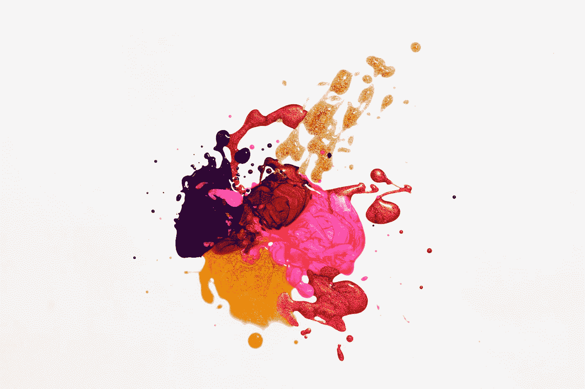
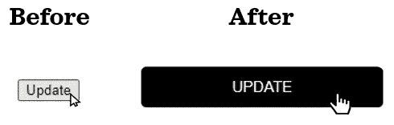

# DASH101 —第 2 部分:用 CSS 和 Python 美化 DASH 仪表板

> 原文：<https://towardsdatascience.com/dash101-part-2-prettify-dash-dashboard-with-css-and-python-3866c069a3b6>

## 数据可视化

## 学习用 Python 设计漂亮的仪表盘

级联样式表，通常称为 CSS，用于格式化和样式化网页。Dash 应用程序完全可以用 CSS 定制，因为 dashboard 是一个 web 应用程序。在这篇文章中，我们将学习熟悉 CSS 的基本知识，以及如何使用它来设计 Dash dashboard。此外，我们将简要地看一下用 Python 定制 Plotly 图形。



照片由[丹-克里斯蒂安·pădureț](https://unsplash.com/@dancristianp?utm_source=medium&utm_medium=referral)在 [Unsplash](https://unsplash.com?utm_source=medium&utm_medium=referral) 拍摄

在[上一篇](/dash101-part-1-introduction-to-dash-layout-810ec449ad43)中，我们完成了布局的结构。在这篇文章中，我们将继续上一篇文章的内容，并设计出最终的布局。

📌*请注意，本文中显示的代码不是独立的。参考前一篇文章的代码片段是这篇文章的先决条件。为了避免重复，这些片段被省略了。*

# 🔤造型基础

现在让我们学习造型的基础知识。我们将从布局中选取更新按钮作为示例，并将其样式化为如下所示:



如果我们将样式表(即`.css`文件)保存在与`app.py`相同目录下的一个名为`assets`的文件夹中，Dash (v0.22 及以上版本)会自动获取它们。我们将把 CSS 代码保存在一个名为`style.css`的样式表中，这是样式表的一个常见命名约定。该目录将如下所示:

```
titanic_dashboard
│   app.py
└───assets
│   │   left_pane.png
│   │   style.css
```

现在，简单介绍一下 CSS。下面是 CSS 语法的基本结构:

```
selector {
  property: value;
  property: value;
}
```

选择器决定选择哪个组件进行样式设计。我们将使用三种类型的选择器:
◼ ️ **类型选择器**由 HTML 标签的名称给出，例如`[button](https://developer.mozilla.org/en-US/docs/Web/HTML/Element/button)`。它适用于该类型的所有 HTML 组件。如果我们希望所有按钮的样式一致，使用类型选择器会很有帮助。
◼ **类选择器**由以`.`为前缀的类的名称给出，例如`.dropdown`。在 Dash 中，您可以使用名为`className`的参数为任何组件指定类名。这允许我们有选择地将特定的组件组合在一起，以便我们可以一起设计它们的样式。
◼ **Id 选择器**由 Id 名称加上前缀`#`给出，例如`#update-button`。使用 Dash 时，可以使用`id`参数指定组件的 id 名称。与`className`不同，`id`在整个应用程序的所有组件中必须是唯一的。

`{}`中的语法称为声明块，它定义了我们想要的样式。如果你想学习更多关于 CSS 的知识，[这个](https://developer.mozilla.org/en-US/docs/Web/CSS/Syntax)和[这个](https://developer.mozilla.org/en-US/docs/Learn/CSS/Building_blocks/Selectors)对初学者来说是很棒的额外资源。

让我们把我们刚刚学到的东西付诸实践，并设计按钮。通过在`style.css`中包含下面的代码，button 将得到它的 after look。

```
button {
  width: 240px;
  height: 40px;
  cursor: pointer;
  border: 0px;
  border-radius: 5px;
  background-color: black;
  color: white;
  text-transform: uppercase;
  font-size: 15px
}
```

这里，我们使用了类型选择器。让我们来分解一下代码:
◼ `width`和`height`调整按钮的大小
◼ `cursor: pointer;`当光标悬停在
上时将光标变为指针◼ `border: 0px;`移除边框线
◼ `border-radius: 5px;`圆角
◼ `background-color`和`color`改变背景和文本颜色
◼ `text-transform`将文本转换为大写
◼ `font-size`增加文本的字体大小

由于按钮有`id`，如果我们想:

```
#update-button {
  width: 240px;
  height: 40px;
  cursor: pointer;
  border: 0px;
  border-radius: 5px;
  background-color: black;
  color: white;
  text-transform: uppercase;
  font-size: 15px
}
```

除了使用单独的样式表，CSS 样式也可以通过 Python 脚本中的`style`属性进行内联。当在 Python 中以内联方式指定 CSS 语法时，每个属性和值都需要用引号括起来，并在字典中提供。下面是我们的代码如何适应这种格式:

```
html.Button(id='update-button', children="Update", 
            style={'width': '240px', 'height': '40px', 
                   'cursor': 'pointer', 'border': '0px', 
                   'border-radius': '5px', 'background-color': 
                   'black', 'color': 'white', 'text-transform': 
                   'uppercase', 'font-size': '15px'})
```

将字典键转换为 camel case 也是可行的:

```
html.Button(id='update-button', children="Update", 
            style={'width': '240px', 'height': '40px', 
                   'cursor': 'pointer', 'border': '0px', 
                   'borderRadius': '5px', 'backgroundColor': 
                   'black', 'color': 'white', 'textTransform': 
                   'uppercase', 'fontSize': '15px'})
```

我们不会在这篇文章中使用这种格式，但是如果你愿意，你知道如何使用这种格式。

# 🎨用 CSS 设计仪表板样式

学习了基础知识后，我们现在要给我们的布局改头换面。让我们从调整区域大小和设置背景颜色开始。我们将从`style.css`中删除之前的练习语法，并添加以下内容:

```
body {
  background-color:#FFF2CC;
  margin: 0;
  padding: 0;
}
img {
  width: 320px;
  margin-bottom: 30px;
}
#container {
  width: 100%; 
  overflow: hidden;
}
#left-container {
  height: 937px;
  width: 320px;
  background-color:#3BA27A;  
  float: left;
  margin: 0;
}
#right-container {
  margin-left: 340px;
}
#visualisation {
  margin-top: 30px;
  width: 100%; 
  overflow: hidden;
  height: 430px;
}
#histogram {
  width: 700px; 
  height: 430px;
  margin-left: 35px;
  float: left; 
}
#barplot {
  width: 700px; 
  height: 430px;
  margin-left: 800px;
  margin-right: 20px;
}
#data-extract {
  margin-top: 30px;
  width: 100%; 
  overflow: hidden;
  height: 400px;
}
#table {
  height: 420px;
  width: 800px; 
  float: left;
  margin-left: 35px;
  margin-top: 15px;
}
#table-side {
  width: 400px;
  margin-left: 900px;
  margin-top: 60px;
  background-color: white;
  border-radius: 10px;
  padding: 20px;
}
```

哇，太久了！但是如果我们仔细观察，我们只使用了少数属性。◼ `background-color`:改变背景颜色。我们可以使用颜色名称(如`black`)、RGB 颜色(如`rgb(0,0,0)`)或十六进制颜色(`#000`或`#000000`)。[这个](https://coolors.co/)是生成调色板的绝佳工具。
◼ `margin`及其变化，`padding`:改变截面间距。[本帖](https://blog.hubspot.com/website/css-margin-vs-padding)解释了`margin`和`padding`的区别。
◼ `height` & `width`:调整小节大小。
◼ `overflow`:决定一个元素被溢出时如何处理。
◼ `float`:决定如何定位截面。◼把边缘弄圆。

大多数属性名称可能是不言自明的，但如果不是，或者只是想了解更多，可以在 [MDN Web Docs](https://developer.mozilla.org/en-US/docs/Web/CSS) 上查找。例如，如果你查找`[overflow](https://developer.mozilla.org/en-US/docs/Web/CSS/overflow)`作为例子，你可以看到不同的`overflow`行为，比如`visible`和`hidden`如何处理样本文本上的溢出元素。或者，你可以尝试在谷歌中搜索“CSS <属性名>”。

当您在样式表中进行更改并保存它们时，Dash 会自动刷新您的 web 应用程序。这叫[热重装](https://dash.plotly.com/devtools#:~:text=Hot%20Reloading%20%2D%20Dash%20automatically%20refreshes,your%20app%20and%20your%20code.)。理解 CSS 代码的一个好方法是观察添加或删除(注释掉)CSS 代码的小部分如何影响应用程序的外观。

你已经学习了一些不同的方法来理解 CSS 代码片段做什么，为了保持这篇文章的简洁，我们将不会详细讨论 CSS 语法的其余部分。

现在让我们格式化文本。我们将从上面开始向车身类型选择器(即`body {}`)添加以下内容:

```
font-family: 'Segoe UI', Tahoma, Geneva, Verdana, sans-serif;
```

此外，我们将把这些额外的 CSS 语法添加到`style.css`:

```
h1 {
  margin-top: 50px;
  text-transform: uppercase;
  font-size: 40px;
  color: white;
  text-align: center;
}
p {
  margin-left: 20px;
  color: white;
}
.dropdown-labels {
  margin-left: 20px;
  color: white;
  font-weight: bold;
}
.other-labels {
  margin-left: 20px;
  color: #FFBD59;
  font-weight: bold;
}
```

是时候设计按钮了。这一次我们将全面展示它的风格:

```
#update-button {
  width: 240px;
  height: 40px;
  border-radius: 5px;
  margin-left: 38px;
  margin-top: 30px;
  border: 0px;
  cursor: pointer;
  background-color: black;
  color: white;
  font-weight: bold;
  font-family: inherit;
  text-transform: uppercase;
  font-size: 15px;
}
#update-button:hover {
  background-color: #FFBD59;
  color: white;
}
```

有两件事值得强调:
◼️首先是价值:`[inherit](https://developer.mozilla.org/en-US/docs/Web/CSS/inherit)`。当我们使用这个值时，我们让选择器从它的父元素继承属性值。◼ ️Another 是第二个选择者。看起来和我们目前看到的选择器略有不同:`#update-button:hover`。这些被称为[伪类](https://developer.mozilla.org/en-US/docs/Web/CSS/Pseudo-classes)，只在指定的状态下设计选择器。在这个例子中，它只在鼠标悬停在按钮上时设置样式。

我们将设计下拉菜单，让它们看起来与整体色调更加协调:

```
.dropdown {
  margin-left: 20px;
  margin-right: 20px;
  margin-top: 5px;
}
.dropdown .Select-control{
  background-color: white;
}
.dropdown .Select-menu-outer{
  background-color: white;
}
.dropdown .Select-value{
  background-color: #3BA27A;
  color: white;
  font-size: 14px;  
}
.dropdown .VirtualizedSelectFocusedOption {
  background-color: #a5ecd1;
  color: black;
}
.dropdown .VirtualizedSelectOption  {
  font-size: 14px;
}
```

在这里，我们看到选择器后面跟着另一个选择器。这是为了样式化元素的某些部分。如果您想知道如何首先找到这些选择器值，答案是搜索。如果你搜索下拉样式资源，你会找到有用的资源，比如[这个堆栈溢出答案](https://stackoverflow.com/a/59234366/9724079)和[这个 Plotly 社区帖子](https://community.plotly.com/t/i-cant-change-color-of-dropdown-menu/28174/5)。

现在，我们将格式化切换:

```
.toggle {
  margin-top: 8px;
}
```

在`app.py`中使用颜色参数更容易改变切换的颜色。我们将不得不对另一个开关重复这一过程。

```
daq.BooleanSwitch(id='target_toggle', className='toggle', on=True,
                  color="#FFBD59")
```

最后，让我们来设计滑块的样式:

```
#n-slider {
  margin-top: 8px;
}
#n-slider .rc-slider-handle  {
  background-color: #FFBD59;
  border: 0px;
}
#n-slider .rc-slider-track {
  background-color: #E6E6E6;
}
#n-slider .rc-slider-dot-active {  
  border-color: #E6E6E6;
}
```

我们在这篇文章中所做的设计仅仅触及了 CSS 的皮毛，但是希望它能帮助你建立基本的直觉，让你知道如何使用它来定制和美化你的仪表盘。

下面是我们最终的定制样式表内容:

# 📊绘制图形的样式

现在，我们将致力于定制 Plotly 图形的外观。用 Python 比用 CSS 更容易设计 Plotly 图形的样式。我们将从直方图开始，改变不透明度，并在`app.py`中应用调色板:

```
histogram = px.histogram(test, x='Probability', color=TARGET, 
                         marginal="box", nbins=30, opacity=0.6, 
                         color_discrete_sequence=['#FFBD59', 
                                                  '#3BA27A'])
```

接下来，我们将添加标题，更改字体和背景颜色:

```
histogram.update_layout(title_text=f'Distribution of probabilities by class (n={len(test)})', font_family='Tahoma', plot_bgcolor='rgba(255,242,204,100)')
```

我们还将更新 y 轴的标签:

```
histogram.update_yaxes(title_text="Count")
```

同样，让我们美化柱状图:

```
barplot = px.bar(test.groupby('Binned probability', as_index=False)['Target'].mean(), x='Binned probability', y='Target', color_discrete_sequence=['#3BA27A'])barplot.update_layout(title_text=f'Survival rate by binned probabilities (n={len(test)})', font_family='Tahoma', xaxis = {'categoryarray': labels}, plot_bgcolor='rgba(255,242,204,100)')barplot.update_yaxes(title_text="Percentage survived")
```

最后，让我们修饰一下桌子:

```
table = go.Figure(data=[go.Table(
    header=dict(values=columns, fill_color='#FFBD59', 
                line_color='white', align='center',
                font=dict(color='white', size=13)),
    cells=dict(values=[test[c] for c in columns], 
               format=["d", "", "", "", "", ".2%"],
               fill_color=[['white', '#FFF2CC']*(len(test)-1)], 
               align='center'))
])
table.update_layout(title_text=f'Sample records (n={len(test)})', 
                    font_family='Tahoma')
```

我们使用 [d3 格式](https://github.com/d3/d3-3.x-api-reference/blob/master/Formatting.md#d3_format.)格式化带有[格式参数](https://dash.plotly.com/datatable/data-formatting)的列。我们用`fill_color`添加了交替的行颜色。

这是帖子修改后的最终布局:

当查找定制 Plotly 图形外观的不同方法时，您可能会发现 [Python 图形参考](https://plotly.com/python/reference/layout/#layout-font)很有帮助。

希望这篇文章向你展示了 CSS 的威力，以及它在设计 dashboard 时的高度灵活性。完成了仪表板的前端，现在是时候学习添加交互性来为我们的仪表板增压了:◼*[*DASH 101—第三部分:添加与 dash 回调的交互性*](/dash101-part-3-add-interactivity-with-dash-callback-420f564ad622)*

*使用 Dash 时，了解一些 HTML 和 CSS 会非常有用。如果你想学习 HTML 和 CSS 的基础知识，请查看由 Udacity 提供的这个简短的免费课程。*

**

*佛罗里达州本土民间艺术家朗达克在 [Unsplash](https://unsplash.com?utm_source=medium&utm_medium=referral) 上拍摄的照片*

*您想要访问更多这样的内容吗？媒体会员可以无限制地访问媒体上的任何文章。如果你使用 [*我的推荐链接*](https://zluvsand.medium.com/membership)*成为会员，你的一部分会费会直接去支持我。**

*谢谢你看我的帖子。如果你感兴趣，这里有我的一些帖子的链接:
◼️️ [用这些技巧丰富你的 GitHub 个人资料](/enrich-your-github-profile-with-these-tips-272fa1eafe05)
◼️️ [用这些技巧丰富你的 Jupyter 笔记本](/enrich-your-jupyter-notebook-with-these-tips-55c8ead25255)
◼️ [用这些技巧组织你的 Jupyter 笔记本](/organise-your-jupyter-notebook-with-these-tips-d164d5dcd51f)
◼️ [用 Python 实现简单的数据可视化，你会发现有用的](/simple-data-visualisations-in-python-that-you-will-find-useful-5e42c92df51e)
◼️ [6 个简单的技巧，让你在 Seaborn (Python)中有更漂亮和定制的情节](/6-simple-tips-for-prettier-and-customised-plots-in-seaborn-python-22f02ecc2393)*

*再见🏃💨*