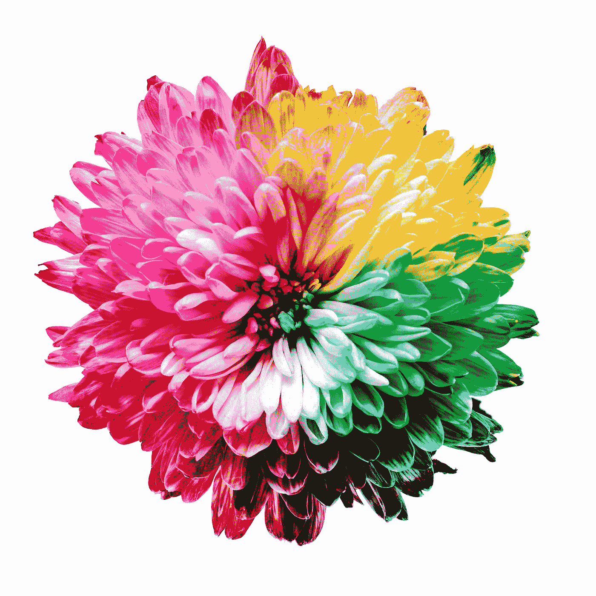

# DASH101 —第 3 部分:通过 DASH 回调增加交互性

> 原文：<https://towardsdatascience.com/dash101-part-3-add-interactivity-with-dash-callback-420f564ad622>

## 数据可视化

## 学习在 Python 中嵌入仪表板的交互性

向 dashboard 添加交互性增强了它的可用性，并帮助用户轻松地更深入地探索和分析数据。在这篇文章中，我们将学习 Dash 回调的基础知识，并为我们之前构建的示例仪表板添加交互性。



照片由[莎伦·皮特韦](https://unsplash.com/@sharonp?utm_source=medium&utm_medium=referral)在 [Unsplash](https://unsplash.com?utm_source=medium&utm_medium=referral) 上拍摄

我们将从上一篇文章中[停止的地方继续。如果你想赶上我们在系列中学到的东西，这里有链接:
◼](/dash101-part-2-prettify-dash-dashboard-with-css-and-python-3866c069a3b6) [*DASH101 —第 1 部分:DASH 布局介绍*](/dash101-part-1-introduction-to-dash-layout-810ec449ad43)◼[*dash 101—第 2 部分:用 CSS 和 Python 美化 dash dash 仪表板*](/dash101-part-2-prettify-dash-dashboard-with-css-and-python-3866c069a3b6)

📌请注意，本文中显示的代码不是独立的。参考前一篇文章的代码片段是这篇文章的先决条件。为了避免重复，这些片段被省略了。

# 🔧回拨基础

在 Dash 中，我们使用`@app.callback` decorator 来增加仪表板的交互性。语法结构如下所示:

```
app = dash.Dash(__name__)
app.layout = ...[@app](http://twitter.com/app).callback(Output(...), [Input(...), Input(...)])
def update_output(input1, input2):
    ...
    return output1if __name__ == '__main__':
    app.run_server(debug=True)
```

在这个例子中，我们有两个输入和一个输出。装饰器中的输入数量应该与函数的参数数量相同。输出的数量应该与函数返回的输出数量相同。当任何输入发生变化时，Dash 会自动更新输出。

目前，我们的仪表板中的下拉菜单、按钮、滑块和开关仅仅是装饰，因为它们没有功能。在下一节中，我们将使用`@app.callback`装饰器为这些仪表板元素添加交互性。

# 🔨向仪表板添加交互性

让我们将图表设置为每次下拉列表值改变时更新:

```
# ********************* Dash app *********************
app = dash.Dash(__name__)
app.layout = html.Div([
    html.Div([
        html.H1("Titanic predictions"),
        html.P("Summary of predicted probabilities for Titanic test dataset."),
        html.Img(src="assets/left_pane.png"),
        html.Label("Passenger class", className='dropdown-labels'), 
        dcc.Dropdown(
            id='class-dropdown', className='dropdown', multi=True,
            options=create_dropdown_options(test['Class']),
            value=create_dropdown_value(test['Class'])),
        html.Label("Gender", className='dropdown-labels'), 
        dcc.Dropdown(
            id='gender-dropdown', className='dropdown', multi=True,
            options=create_dropdown_options(test['Gender']),
            value=create_dropdown_value(test['Gender'])),
        html.Button(id='update-button', children="Update")
        ], id='left-container'),
    html.Div([
        html.Div([
            dcc.Graph(id="histogram"),
            dcc.Graph(id="barplot")
        ], id='visualisation'),
        html.Div([
            dcc.Graph(id='table'),
            html.Div([
                html.Label("Survival status", 
                           className='other-labels'), 
                daq.BooleanSwitch(id='target_toggle', 
                                  className='toggle', 
                                  on=True, color="#FFBD59"),
                html.Label("Sort probability in ascending order", 
                           className='other-labels'),
                daq.BooleanSwitch(id='sort_toggle', 
                                  className='toggle', 
                                  on=True, color="#FFBD59"),
                html.Label("Number of records", 
                           className='other-labels'), 
                dcc.Slider(id='n-slider', min=5, max=20, 
                           step=1, value=10, 
                           marks=create_slider_marks([5, 10, 
                                                      15, 20])),
            ], id='table-side'),
        ], id='data-extract')
    ], id='right-container')
], id='container')
[@app](http://twitter.com/app).callback(
    [Output(component_id='histogram', 
            component_property='figure'),
     Output(component_id='barplot', 
            component_property='figure'),
     Output(component_id='table', 
            component_property='figure')],
    [Input(component_id='class-dropdown', 
           component_property='value'),
     Input(component_id='gender-dropdown', 
           component_property='value')]
)
def update_output(class_value, gender_value):
    # Update data to dropdown values without overwriting test
    dff = test.copy()
    dff = dff[dff['Class'].isin(class_value)]
    dff = dff[dff['Gender'].isin(gender_value)]
    # Visual 1: Histogram
    histogram = px.histogram(
        dff, x='Probability', color=TARGET, marginal="box", 
        nbins=30, opacity=0.6,  
        color_discrete_sequence=['#FFBD59', '#3BA27A']
    )
    histogram.update_layout(
        title_text=f'Distribution of probabilities by class (n={len(dff)})',
        font_family='Tahoma', plot_bgcolor='rgba(255,242,204,100)'
    )
    histogram.update_yaxes(title_text="Count")
    # Visual 2: Barplot
    barplot = px.bar(
        dff.groupby('Binned probability', as_index=False)['Target'].mean(), 
        x='Binned probability', y='Target', 
        color_discrete_sequence=['#3BA27A']
    )
    barplot.update_layout(
        title_text=f'Survival rate by binned probabilities (n={len(dff)})', 
        font_family='Tahoma', xaxis = {'categoryarray': labels}, 
        plot_bgcolor='rgba(255,242,204,100)'
    )
    barplot.update_yaxes(title_text="Percentage survived")
    # Visual 3: Table
    columns = ['Age', 'Gender', 'Class', 'Embark town', TARGET, 'Probability']
    table = go.Figure(data=[go.Table(
        header=dict(values=columns, fill_color='#FFBD59', 
                    line_color='white', align='center',
                    font=dict(color='white', size=13)),
        cells=dict(values=[dff[c] for c in columns], 
                   format=["d", "", "", "", "", ".2%"],
                   fill_color=[['white', '#FFF2CC']*(len(dff)-1)], 
                   align='center'))
    ])
    table.update_layout(title_text=f'Sample records (n={len(dff)})', 
    font_family='Tahoma')

    return histogram, barplot, table

if __name__ == '__main__':
    app.run_server(debug=True)
```

这里，我们定义了 2 个输入:下拉菜单和 3 个输出:图形。使用`@app.callback`装饰器和`update_output()`函数，每次下拉列表值改变时，图形都会更新。当在函数中使用选中的下拉值过滤数据时，我们确保没有覆盖原始数据`test`。

下拉列表值的变化现在会触发仪表板的更新。但是，如果我们不希望在选择下拉列表值时更新图表，而只希望在按下按钮时更新图表，那该怎么办呢？让我们调整我们的仪表板，使其以这种方式运行。对于这种行为，`State`将会派上用场。

```
# ********************* Dash app *********************
app = dash.Dash(__name__)
app.layout = html.Div([
    html.Div([
        html.H1("Titanic predictions"),
        html.P("Summary of predicted probabilities for Titanic test dataset."),
        html.Img(src="assets/left_pane.png"),
        html.Label("Passenger class", className='dropdown-labels'), 
        dcc.Dropdown(
            id='class-dropdown', className='dropdown', multi=True,
            options=create_dropdown_options(test['Class']),
            value=create_dropdown_value(test['Class'])),
        html.Label("Gender", className='dropdown-labels'), 
        dcc.Dropdown(
            id='gender-dropdown', className='dropdown', multi=True,
            options=create_dropdown_options(test['Gender']),
            value=create_dropdown_value(test['Gender'])),
        html.Button(id='update-button', children="Update", n_clicks=0)
        ], id='left-container'),
    html.Div([
        html.Div([
            dcc.Graph(id="histogram"),
            dcc.Graph(id="barplot")
        ], id='visualisation'),
        html.Div([
            dcc.Graph(id='table'),
            html.Div([
                html.Label("Survival status", 
                           className='other-labels'), 
                daq.BooleanSwitch(id='target_toggle', 
                                  className='toggle', 
                                  on=True, color="#FFBD59"),
                html.Label("Sort probability in ascending order", 
                           className='other-labels'),
                daq.BooleanSwitch(id='sort_toggle', 
                                  className='toggle', 
                                  on=True, color="#FFBD59"),
                html.Label("Number of records", 
                           className='other-labels'), 
                dcc.Slider(id='n-slider', min=5, max=20, 
                           step=1, value=10, 
                           marks=create_slider_marks([5, 10, 
                                                      15, 20])),
            ], id='table-side'),
        ], id='data-extract')
    ], id='right-container')
], id='container')[@app](http://twitter.com/app).callback(
    [Output(component_id='histogram', 
            component_property='figure'),
     Output(component_id='barplot', 
            component_property='figure'),
     Output(component_id='table', 
            component_property='figure')],
    [State(component_id='class-dropdown', 
           component_property='value'),
     State(component_id='gender-dropdown', 
           component_property='value'),
     Input(component_id='update-button', 
           component_property='n_clicks')])
def update_output(class_value, gender_value, n_clicks):
    # Update data to dropdown values without overwriting test
    dff = test.copy()if n_clicks>0:
        if len(class_value)>0:
            dff = dff[dff['Class'].isin(class_value)]
        elif len(class_value)==0:
            raise dash.exceptions.PreventUpdate

        if len(gender_value)>0:
            dff = dff[dff['Gender'].isin(gender_value)]
        elif len(gender_value)==0:
            raise dash.exceptions.PreventUpdate# Visual 1: Histogram
    histogram = px.histogram(
        dff, x='Probability', color=TARGET, marginal="box", 
        nbins=30, opacity=0.6,  
        color_discrete_sequence=['#FFBD59', '#3BA27A']
    )
    histogram.update_layout(
        title_text=f'Distribution of probabilities by class (n={len(dff)})',
        font_family='Tahoma', plot_bgcolor='rgba(255,242,204,100)'
    )
    histogram.update_yaxes(title_text="Count")# Visual 2: Barplot
    barplot = px.bar(
        dff.groupby('Binned probability', as_index=False)['Target'].mean(), 
        x='Binned probability', y='Target', 
        color_discrete_sequence=['#3BA27A']
    )
    barplot.update_layout(
        title_text=f'Survival rate by binned probabilities (n={len(dff)})', 
        font_family='Tahoma', xaxis = {'categoryarray': labels}, 
        plot_bgcolor='rgba(255,242,204,100)'
    )
    barplot.update_yaxes(title_text="Percentage survived")# Visual 3: Table
    columns = ['Age', 'Gender', 'Class', 'Embark town', TARGET, 'Probability']
    table = go.Figure(data=[go.Table(
        header=dict(values=columns, fill_color='#FFBD59', 
                    line_color='white', align='center',
                    font=dict(color='white', size=13)),
        cells=dict(values=[dff[c] for c in columns], 
                   format=["d", "", "", "", "", ".2%"],
                   fill_color=[['white', '#FFF2CC']*(len(dff)-1)], 
                   align='center'))
    ])
    table.update_layout(title_text=f'Sample records (n={len(dff)})', 
    font_family='Tahoma')

    return histogram, barplot, tableif __name__ == '__main__':
    app.run_server(debug=True)
```

`State`保存下拉列表中的信息，但不会触发更新。所以现在当我们改变下拉列表值时，图形保持不变。只有当我们单击“更新”按钮时，图表才会更新为下拉列表中的选定值。此外，我们还以另一种方式改变了下拉列表的行为:当两个下拉列表中没有选择任何值时，我们禁止使用`dash.exceptions.PreventUpdate`进行更新。

每点击一次按钮，`n_clicks`递增。这意味着单击按钮会触发图形的刷新。在布局中，我们还将`n_clicks`初始化为 0，这样 if 条件:`if n_clicks>0`就不会出错。

最后，让我们为表格的切换和滑块添加交互性:

瞧啊。我们已经完成了向仪表板添加交互性。完整仪表板的代码也可以在[这里](https://github.com/zluvsand/dash_dashboard/tree/main/titanic_dashboard)找到。希望这一系列的三篇文章已经让你尝到了 Dash 的滋味，并激发了你创建自己的仪表板来巩固你的学习的兴趣。


罗纳德·库扬在 [Unsplash](https://unsplash.com?utm_source=medium&utm_medium=referral) 上的照片

*您想访问更多这样的内容吗？媒体会员可以无限制地访问媒体上的任何文章。如果您使用* [*我的推荐链接*](https://zluvsand.medium.com/membership)*成为会员，您的一部分会费将直接用于支持我。*

谢谢你看我的帖子。如果你感兴趣，这里有我的一些帖子的链接:
◼️️ [用这些技巧丰富你的 GitHub 个人资料](/enrich-your-github-profile-with-these-tips-272fa1eafe05)
◼️️ [用这些技巧丰富你的 Jupyter 笔记本](/enrich-your-jupyter-notebook-with-these-tips-55c8ead25255)
◼️ [用这些技巧组织你的 Jupyter 笔记本](/organise-your-jupyter-notebook-with-these-tips-d164d5dcd51f)
◼️ [用 Python 实现简单的数据可视化，你会发现有用的](/simple-data-visualisations-in-python-that-you-will-find-useful-5e42c92df51e)
◼️ [6 个简单的技巧，让你在 Seaborn (Python)中有更漂亮和定制的情节](/6-simple-tips-for-prettier-and-customised-plots-in-seaborn-python-22f02ecc2393)

再见🏃💨