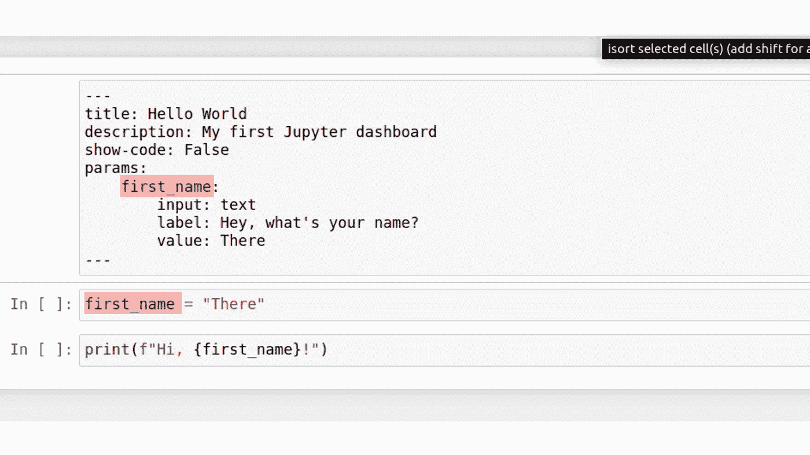
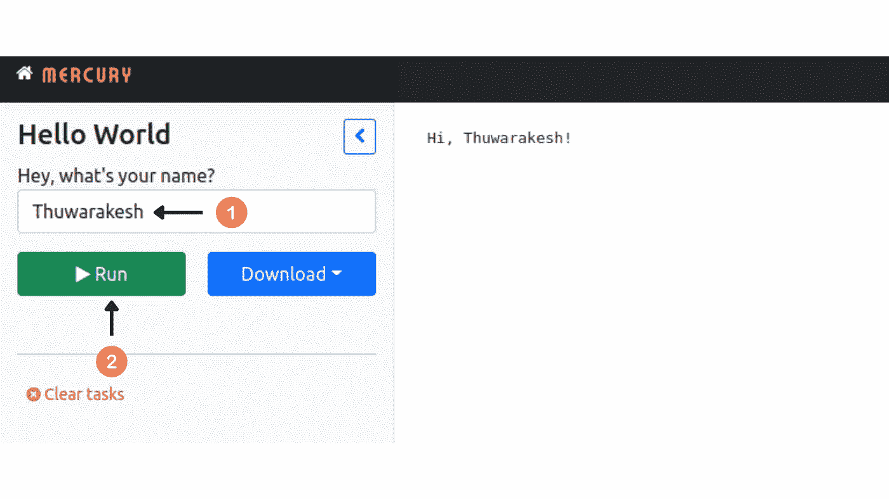
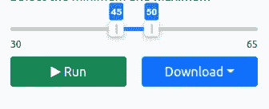
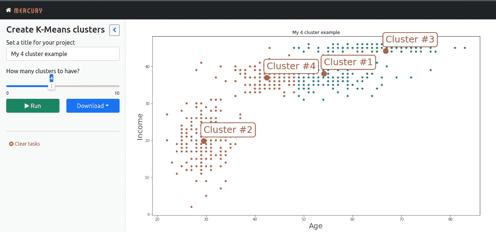

# 动态构建数据科学项目原型的快速方法

> 原文：<https://towardsdatascience.com/dashboard-from-jupyter-notebook-65d594948d24>

## 将您的 Jupyter 笔记本电脑转变为交互式仪表盘


通过将 Jupyter 笔记本电脑转换为交互式仪表盘，快速创建数据科学项目的原型。来自 [Pexels](https://www.pexels.com/photo/five-bulb-lights-1036936/) 的 Rodolfo Clix 的照片

当您拥有一个精益技术堆栈时，您的数据科学项目将会进展顺利。

是的，栈越小，项目越好！

Jupyter 笔记本与数据科学家的日常工作密不可分。此外，大多数数据科学项目也需要一个交互式仪表板。

如果您可以将笔记本电脑转换成功能丰富的仪表盘，会怎么样💡。

你可以，现在！

通常，开发仪表板需要 HTML、JavaScript 和 CSS 知识。但是像 Streamlit 和 Dash 这样的工具已经使得在没有它们的情况下创建仪表板成为可能。

</how-to-create-stunning-web-apps-for-your-data-science-projects-c7791102134e>  </plotly-dashboards-in-python-28a3bb83702c>  

然而，您仍然需要手动将笔记本电脑转换为功能性应用程序。这涉及到大量的复制和粘贴。

但是有了[水星](https://mercury-docs.readthedocs.io/en/latest/)，你可以立即把你的 Jupyter 笔记本变成一个交互式仪表盘，一个在线幻灯片，或者一个网络服务。您可以从 PyPI 包存储库中安装这个库。

```
pip install mljar-mercury
```

# 如何将笔记本转换成功能性仪表盘？

它只需要一个 YAML 配置！

是的，在笔记本的顶部，您需要定义一个具有 YAML 配置的原始单元格。您将拥有所有的仪表板属性、小部件和行为。

小部件名称将自动映射到您笔记本中的变量。然而，您应该在全局级别定义变量。

有道理，对吧？一个笔记本变成一个仪表盘。它的全局变量是我们需要与之交互的变量。所以为它们定义小部件。

这里有一个例子。



一个用 Jupyter 笔记本创建交互式仪表板的 hello world 示例。—[作者图片。](https://thuwarakesh.medium.com)

这个笔记本有一个小部件——一个输入你名字的输入框。然后我们的仪表板会跟你打招呼。

请注意，YAML 的 param 部分下的小部件名称与我们的变量名相匹配。

让我们运行这个例子。要启动仪表板服务器，请在终端中执行以下命令。

```
mercury run dashboard.ipynb # if dashboard.ipynb is your notebook
```

这个命令将启动一个 Django 服务器和一个 celery 进程。如果是第一次，Mercury 还将运行数据库迁移。但是你现在不用担心他们了。



一个 hello world 将 Jupyter 笔记本转换成交互式仪表板的例子。—[作者图片。](https://thuwarakesh.medium.com)

答对了。您已经创建了一个仪表板！没有 HTML！没有 JavaScript！没有 CSS！

# 使用更酷的部件和主题！

在前一个例子中，我们使用了一个小部件。然而，Mercury 有十几个很酷的功能，比如滑块、下拉菜单、复选框等等。

每个都有稍微不同的配置。例如，下面的代码将显示一个范围滑块。

```
params:
    range_variable:
        input: range
        label: Select the minimum and maximum 
        value: [45,50] 
        min: 30
        max: 65
```

注意，我们已经通过 value 属性给出了初始值。

这将呈现一个范围滑块如下。



Mercury 中的范围选择器滑块示例—由[作者截屏。](https://thuwarakesh.medium.com)

查看[小部件文档](https://mercury-docs.readthedocs.io/en/latest/widgets/)以获得完整的列表及其配置。

此外，如果你正在制作一个在线幻灯片，你可以选择一个主题。要制作演示文稿，您必须将输出类型指定为幻灯片和您偏好的主题。这里有一个例子。

```
output: slides
format:
    theme: moon
```

你可以从 11 个可用的主题中选择一个。

# 安全地与他人共享您的仪表板

这是我所知道的创建仪表板的最直接的方法。这也是让你的想法原型化的最快方法。

而且，这是一个典型的 Django 应用程序。因此，你可以像托管任何其他 web 应用程序一样，在代理服务器 (Nginx 或 Apache)后托管它。

此外，如果您使用开放的主机和端口号启动服务器，如下所示，您可以让本地网络中的其他人实时访问它。

```
mercury run dashboard.ipynb 0.0.0.0:8000
```

您网络中的人可以使用`http://<Your local IP>:8000/`访问它。

与他人共享应用程序时，一个常见的问题是安全性。您可能不希望每个人都看到仪表板。

Mercury 使用了 Django 的认证系统。您可以从管理面板创建用户帐户。

默认情况下，我们创建的所有仪表板都是公共的。通过在 YAML 文件中指定 share: private，您可以[将它们设为私有](https://mercury-docs.readthedocs.io/en/latest/authentication/)。这将使仪表板可供登录用户使用。

不过，**认证是 pro 的特色**。因此，除非你有商业许可证，否则分享你的仪表板要小心。

# 创建交互式机器学习仪表板

如果你能控制一个笔记本的全局变量，你就能处理它里面的任何东西。

如果你在用笔记本建立机器学习模型(谁不是呢？😏)使用这个交互式仪表板，您可以做更多的事情。

您可以调整超参数，在数据集之间交替，等等。

为了说明这一点，我们做了一个简单的 K-Means 聚类和交互式聚类数选择。我在以前的几篇文章中用过这个例子。我喜欢 K-means，因为它简单。

以下笔记本将创建一个仪表板来实时调整集群数量。



一个用 Jupyter 笔记本创建的交互式仪表盘，用于调整机器学习参数——由[作者截屏。](https://thuwarakesh.medium.com)

您可以调整滑块来改变集群，并点击“运行”按钮进行重新渲染。

# 将离线报告共享为 pdf 和静态页面

在大多数情况下，您必须使用仪表板作为报告工具。你需要一个强大的导出功能。

Mercury 有一个免费的内置导出功能。您可以下载 pdf 或静态 HTML 文件格式的报告。只需调整小部件，运行报告，然后单击下载按钮。

下次您想要提交报告时，您可以使用此工具，而不是手动复制粘贴您的 matplotlib 图表。

# 最后的想法

这个我提过好几次了。

开发应用不是数据科学家的超能力。构建 ML 模型是。

但数据科学家的几乎所有工作都以一个应用程序或一个仪表板告终。此外，没有这样的工具，就不可能展示或说明伟大的工作。

在过去的几年中，出现了许多技术来弥合这一差距。如今，数据科学家几乎不需要 HTML、CSS 或 JavaScript 技能来构建生产就绪的应用程序。您可以使用 Streamlit 或 Dash 等工具在几分钟内构建一个应用程序。

然而，Mercury 使动态构建数据科学项目原型变得更加容易。在不离开笔记本环境的情况下构建一个可共享的应用程序确实是一个游戏改变者。

> 感谢阅读，朋友！在[**LinkedIn**](https://www.linkedin.com/in/thuwarakesh/)[**Twitter**](https://twitter.com/Thuwarakesh)[**Medium**](https://thuwarakesh.medium.com/)上跟我打招呼。
> 
> 还不是中等会员？请使用此链接 [**成为会员**](https://thuwarakesh.medium.com/membership) 因为，不需要你额外付费，我为你引荐赚取一小笔佣金。