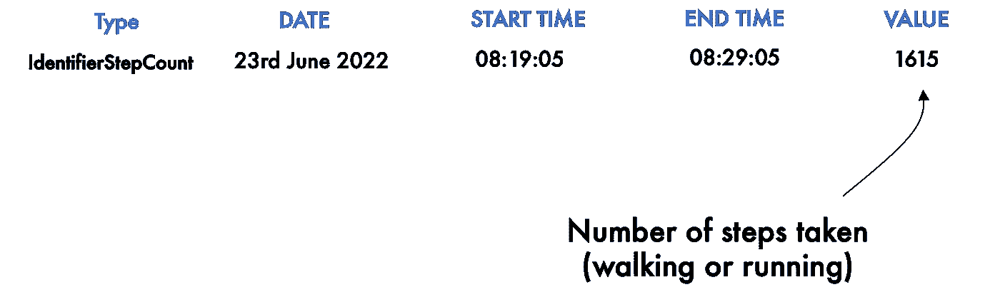
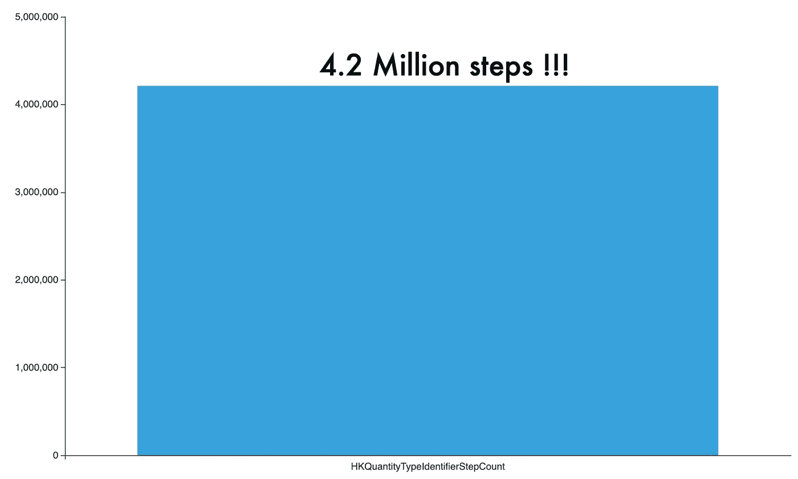
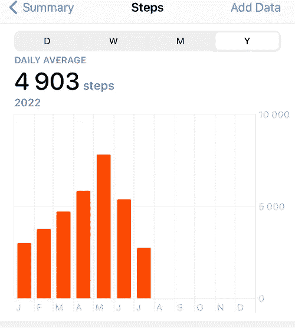
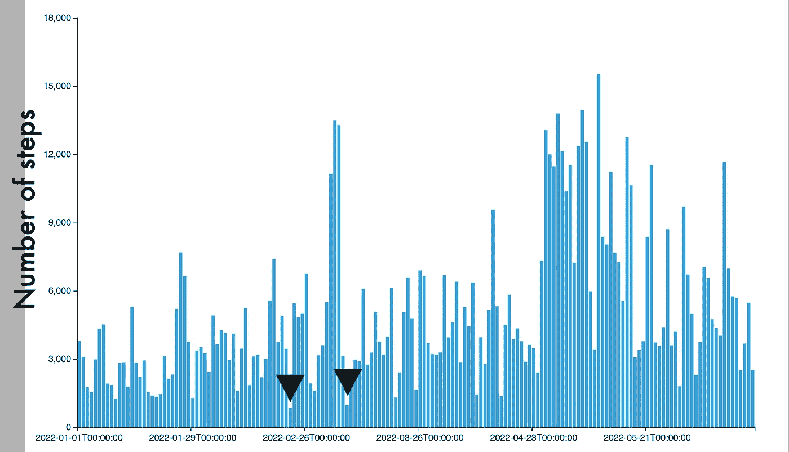
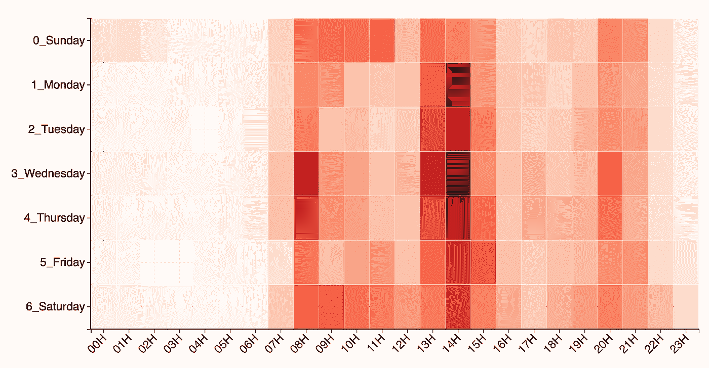
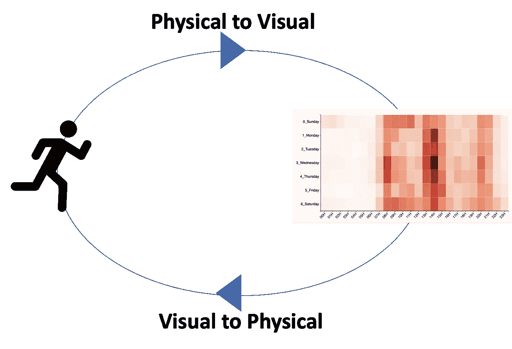
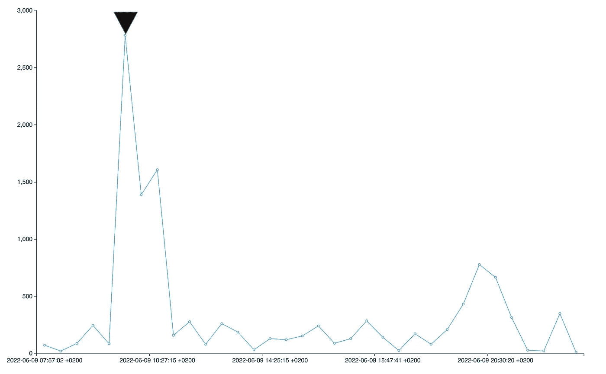

# 通过 iPhone 健康活动数据进行数据分析的最佳实践

> 原文：<https://towardsdatascience.com/data-analysis-best-practices-through-iphone-health-activity-data-66a2c48449df>

## 分析自己的数据可以让你成为一名优秀的数据分析师！

优素福·萨尔汗在 [Unsplash](https://unsplash.com/s/photos/iphone?utm_source=unsplash&utm_medium=referral&utm_content=creditCopyText) 上的照片

你的手机就像一个大数据采集器。它收集了大量与你的身体活动相关的数据。将数据分析和数据科学技术应用于数据可以帮助理解和改善健康。

为了写这篇博客，我提取了存储在我的 iPhone 上的身体活动数据，并使用了一些基本的数据分析技术。我很惊讶地看到一个人可以获得强大的洞察力。通过标准的 iPhone 健康应用程序无法获得这样的见解。它还帮助我更好地了解自己，并获得更多体育活动的灵感！

因此，我总结了一些与数据分析相关的最佳实践。

# 先了解原始数据！

我先解释一下 iPhone 是如何存储身体活动数据的。我曾经研究过[苹果的技术规范](https://developer.apple.com/documentation/healthkit/hkquantitytypeidentifierwalkingspeed)来理解数据格式。这有助于更好地理解我正在处理的事情。

如果你有一部 iPhone，你的每一个物理步骤都会产生一个数据记录。该数据记录具有指示步数标识符的类型。它有一个日期、活动的开始时间、结束时间和一个值，该值表示所走的步数。这些步骤可以对应于任何运动——行走或跑步。

iPhone 活动数据格式(作者图片)

# 分析完整的数据可以带来全新的视角

我买 iPhone 已经三年了，我想到了一个问题，这三年我一共走了多少步？所以我开始分析储存在我的 iPhone 健康应用程序中的数据。

此条形图显示了记录类型“步数”三年的总步数。

3 年内的总步数(图片由作者提供)

420 万步——这是这个分析向我展示的。太神奇了！我很惊讶看到这个分析，因为我是第一次看到这个，标准的 iPhone 健康应用程序没有给出这样的分析。

# 聚合让你丢失信息

你可以做的另一个有趣的分析是获得全年的观点。iPhone 给出了一个年度级别的分析，但它是按月汇总的。

iPhone 年度分析(图片由作者提供)

当你聚合时，你会丢失很多信息。这是 2022 年的年度分析，采用非汇总的方式。

2022 年分析(图片由作者提供)

在这个视图中，您可以看到一年中的实际日期和当天的总步数。我可以观察到有些日子(用黑色三角形标记)，我没有做太多的活动。这不是太好，现在激励我做更多的身体活动。

当你汇总数据时，这种激励性的灵感就消失了。因此，这种非汇总的年度视图比标准的 iPhone 分析更具信息量和启发性。

# 将视觉分析与实际行动联系起来

让我们转到另一个动机分析热图分析，这是我的最爱之一。

活动热图(图片由作者提供)

这里你可以看到 Y 轴是工作日，X 轴是小时。较暗的红色表示高活性。你可以观察到，一般来说，8 小时和 14 小时左右是高活动时间。热图越红，你的身体活动水平越高。

这种分析可以通过试图使其更红来在视觉上激励进行更多的身体活动。

视觉—动作循环

这种“视觉-行动循环”就是数据分析的目的。数据分析不仅仅是制作漂亮的图片，而是将它们与行动联系起来，并看到漂亮的图片得到改善！

# 关注数据的形状

你也可以更详细地分析你的身体活动。此分析显示了我在 2022 年 6 月 9 日这一天采取的步骤数量。早上 10 点左右可以看到 2783 级台阶的高峰。这对应的是高强度的跑步锻炼。

峰值分析(图片由作者提供)

看到这样一个峰值及其价值是非常有用的，因为它给了你一个要达到的目标。所以我现在可以尝试在下一次高强度跑步锻炼中打破我自己的 2783 步记录。

# 结论

分析自己的数据可以让你成为一名优秀的数据分析师！原因很明显。您可以更好地连接到自己的数据，进行改进，并查看对数据的影响！

此外，我希望我已经被激励去分析你的健康数据，去进行额外的身体活动。感谢您的阅读！

# 额外资源

## 学习数据科学的无代码平台

您可以访问我的平台，以一种非常简单的方式学习数据科学，并在不编码的情况下应用本文中描述的一些技术。[https://experiencedatascience.com](https://experiencedatascience.com/)

## Youtube 频道上的数据科学演示

这是我的 YouTube 频道的链接，我在那里展示了关于数据科学、机器学习和人工智能的各种演示。https://www.youtube.com/c/DataScienceDemonstrated
T3

请**订阅**,以便在我发布新故事时随时获得通知。

 [## 每当 Pranay Dave 发表文章时，您都会收到电子邮件。

### 每当 Pranay Dave 发表文章时，您都会收到电子邮件。注册后，如果您还没有，您将创建一个中型帐户…

pranay-dave9.medium.com](https://pranay-dave9.medium.com/subscribe) 

您也可以通过我的推荐链接**加入 Medium**

 [## 加入我的介绍链接-普拉内戴夫媒体

### 阅读 Pranay Dave(以及 Medium 上成千上万的其他作家)的每一个故事。您的会员费直接支持…

pranay-dave9.medium.com](https://pranay-dave9.medium.com/membership)