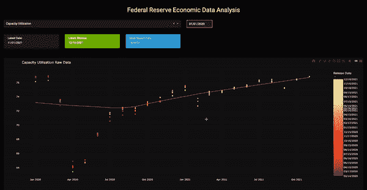
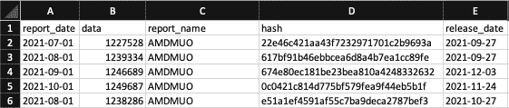
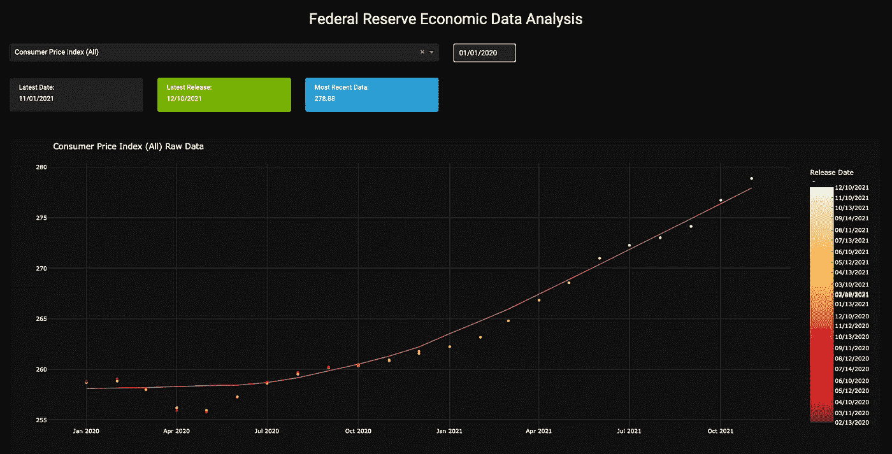
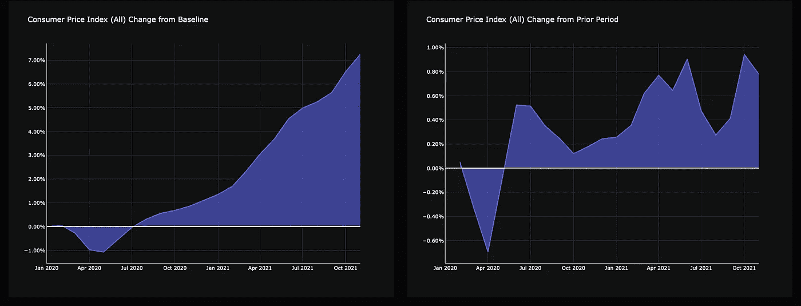
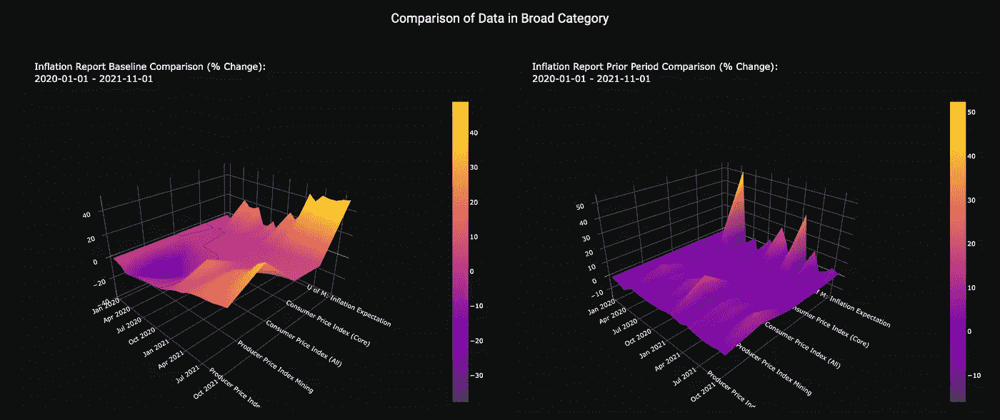
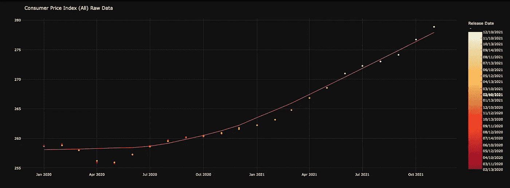

# 数据分析:使用 Python、Dash 和 Plotly 从数据到仪表板

> 原文：<https://towardsdatascience.com/data-analysis-from-data-to-dashboard-with-python-dash-and-plotly-cee4367708ab>

## [实践教程](https://towardsdatascience.com/tagged/hands-on-tutorials)

# 数据分析:使用 Python、Dash 和 Plotly 从数据到仪表板

## 提升您的分析水平并提供更好结果的数据分析场景


看起来好像有人在这里做重要的事情——来自[的](https://www.pexels.com/photo/photo-of-pen-on-top-of-notebook-3183170/?utm_content=attributionCopyText&utm_medium=referral&utm_source=pexels)[福克斯](https://www.pexels.com/@fauxels?utm_content=attributionCopyText&utm_medium=referral&utm_source=pexels)的照片

# 介绍

早在 1998 年，我在一家成长中的初创公司工作，我的老板交给我一项任务，为我们的一些合作伙伴提供一套客户报告。作为一个几乎没有接受过正规培训的项目经理，这对我来说是全新的，并迫使我走上了努力做得更好的道路。几十年后，我仍然在努力完成它，并试图教我在这个过程中学到的东西。

如果你和我一样，如果你再看到一个涉及股票数据集的项目，你可能会尖叫。Gapminder 很好，但现在它已经过时了。再看到一个基于 Covid 数据构建的仪表板实际上并没有多大价值。

这就是这个项目和文章背后的驱动过程。但是，这还不是全部。

我经常在我的项目中使用经济数据。我之前的文章关注的是商品报告，但是我们也可以使用美国美联储的 FRED 系统提供的其他数据。如果你愿意的话，这里有一个前一篇文章的链接——不过我要说的是，前一篇文章的一些内容可能会影响到这篇文章:

[](/creating-a-better-dashboard-with-python-dash-and-plotly-80dfb4269882)  

对我来说，这个项目始于对现有代码的重构。我经常使用这些数据，但当我第一次接触这些数据时，我采用了一种非常简单且不直观的方法。我想把它做好，所以它缺少了很多我想要的功能。我决定从头再来，这也给了我一个受教育的机会。

这就是我们今天要创建的，使用 Dash 框架的 100% python:



我们的仪表板/分析项目——由我拍摄

不再赘述，让我们开始吧。

# 预期

如果你从上到下阅读这篇文章，下面是你可以从这篇文章中得到的信息:

1.  学习使用 Dash / Plotly 框架，使用非标准数据集，完全用 python 构建专业质量数据分析仪表板。
2.  获取数据。
3.  了解数据及其带来的挑战。
4.  用于以各种形式操作数据的方法。
5.  构建仪表板框架以查看和分析数据。
6.  使用 plotly 库开发几种不同的图表类型，以不同的方式可视化数据。

我知道有些人通过搜索找到这些文章，试图解决一个特定的问题。对你来说，你可以获得一些有用的见解和代码，可能会让你在特定的道路上走得更远。

总的来说，我花了大约 30 个小时来组装这个系统。大部分时间都花在了挖掘文档、参考资料和博客上，试图避开关键挑战。自始至终，我将说出其中的许多概念，因为有些概念没有很好地记录下来，或者不容易找到。

# 要求

要完成这篇文章，你需要几样简单易行的东西:

*   可以运行 Python 的计算机(至少是版本 3.7，尽管我是用 python 3.9 开发的)
*   “requirements.txt”文件中列出的模块
*   我的知识库中的代码:

[](https://github.com/brad-darksbian/fed_dashboard)  

使用 pull_fed_data.py 脚本更新数据的一个 Fed API 键是不错的，但不是特别需要。

过去，我写了一整篇关于获取这些数据的文章。如果感兴趣，请查看:

[](/using-python-to-get-and-store-federal-economic-data-11444317ecfb)  

这是我撰写此类文章的风格，我以高度迭代和逻辑的格式编写代码，因此几乎任何技能水平都可以理解。我刻意避免任何微妙的结构或复杂的方法，以保持高度的可接近性。因此，一些代码可能会有点慢，并且会经历额外的步骤，所以有机会自己进行重构，以进行实践和技能开发。

# 数据讨论

任何分析项目的第一步都是了解和理解您将使用的数据。这没什么不同。事实上，这个数据特别具有挑战性，所以它确实需要对正在发生的事情有所了解。

示例数据文件位于名为 data/fed_data.csv 的存储库目录中:



fed_data.csv 示例

该数据的核心是字段 report_date、data、report_name、hash 和 release_date 的简单排列。但它们确实需要一些解释。

report_date 字段是特定报告的日期。它与 report_name 一起创建可被视为唯一标识符的内容。嗯，理论上是这样，但我很快就会谈到这一点。

数据字段相对来说是不言自明的。这是与报告日期相关联的报告名称的数字数据。

report_name 是 FRED 系统用来引用特定报告的代码。它晦涩难懂，除非你把它们都背下来，否则是不可读的。总共有超过 200，000 份报告，祝你好运。

哈希是从我的数据库输出的函数，为每个不同的数据记录提供唯一的键。在这种应用中它被忽略。

release_date 是数据变得棘手的地方。你看，在常规的基础上，美联储在月内的特定日期发布经济数据，但他们会不时地用更新的信息修订数据。release_date 告诉我们数据的更新。因此，真正的唯一键是 report_date、report_name 和 release_date，它们将具有不同的数据字段。

如果我们只关心最近的数据，我们的模式将会又窄又高，每一行都有不同的记录，覆盖多个报告。这与我们在实践中经常使用的其他分析数据集非常相似。然而，添加 release_date 给了我们一个不同的维度。这让这项练习变得更具挑战性，让我们能够更好地发挥数据分析能力。

# 第一步

我们知道我们需要读入数据，并可能进行一些格式化。我们还知道，我们将把它输出到一个仪表板上以供使用。我们来设置一下。

与我的商品仪表板(在简介中链接)非常相似，我从一个基本框架开始，该框架全部包含在存储库中:

*   main.py 这是仪表板的布局文件和驱动程序。稍后会详细介绍。
*   business_logic.py —这是由 main.py 调用的文件，它设置了一些全局数据框架和结构。
*   support_functions.py —这是处理和功能逻辑的主力。
*   layout _ configs.py 这是一个容器文件，用于组织图表的各种布局和可视元素。

对于这些初始步骤，我们将关注 support_functions.py 文件。

我们对数据的格式有一个基本的了解，所以我们的第一个任务是以一种我们可以很容易处理的方式把它输入到系统中。为此，我们将整个数据文件读入 Pandas 数据帧。

```
# Base retrieval function - reads from CSV
def get_fed_data():
    file_path = base_path + "fed_data.csv"
    # file_path = base_path + "fed_dump.csv"
    df = pd.read_csv(file_path, na_values="x")
    df.rename(
        {"data": "report_data", "hash": "report_hash"},
        axis=1,
        inplace=True,
    )
    df["report_date"] = df["report_date"].values.astype("datetime64[D]")
    df["release_date"] = df["release_date"].values.astype("datetime64[D]")

    return df
```

这个函数非常简单。我们将可配置的 base_path 变量(未示出)拉成 file_path 的格式，该格式被馈入 read_csv pandas 函数以创建数据帧“df”。然后，我们简单地重命名一些列以保持一致性，并确保数据类型对于日期是正确的。然后我们返回处理过的数据帧。

目前为止都很简单。

然而，我们不能只是把这个原始数据框架放进一个图表，让神奇的算法去做它们的事情。我们需要考虑如何单独处理这些数据。

像这样的项目面临着一个挑战。没有人给我一个规格表或说明，我需要得到它。我不得不自己想办法。恐怖…

# 处理

当面对不明确的需求时，您通常必须用通用术语来思考。这就是我开始这个阶段的地方。

我知道我需要根据各种标准和格式提取数据，所以我开始创建一些助手函数，这些函数可以单独调用，也可以作为一个更大的过程的一部分来过滤和提炼。

我不会一一介绍，但这是通用模板:

```
# function to pull specific report
def get_report_from_fed_data(df1, report_name):
    df = df1.copy()
    df = df[df["report_name"] == report_name]
    df.sort_values(by=["report_date"], inplace=True)
    df.reset_index(drop=True, inplace=True)
    return df
```

这个特定的函数被定义为根据传入的报告名称提取输入数据帧的所有行。

我首先复制一份数据帧。我这样做是因为如果你修改一个数据帧切片中的数据，你将会收到熊猫的警告。我讨厌这样的警告。

下一行只是对传入的 dataframe 的副本进行过滤。这一行主要是通过这段代码从一个辅助函数到另一个辅助函数的变化。

最后，我根据函数的设计目的对结果数据帧进行适当的逻辑排序，然后重置索引。最后一步是使返回的数据帧具有一致的索引，只包含返回的行。

我有助手函数，用于过滤到一个精确的报告日期或大于或等于一个传递日期的报告日期，以及类似的发布日期函数。总而言之，这些涵盖了我所能看到的用于创建图表的大多数条件。

现在就花时间计划可能需要的东西，最终会比匆忙去做更有效率。思考底层数据和预测用例可以提供更好的上下文理解，并且通常可以节省时间。

# 数据标记

当我开始更多地考虑我的最终结果时，我意识到我有一个恼人的缺口，我应该修复它。它又回到了那个讨厌的 report_name 值及其神秘的本质。

为了更加方便用户，我应该提供一个可以引用的长名字。所以，我创建了另一个函数。为了简洁起见，这里对其进行了简化，但其核心是完整的:

```
def add_report_long_names(df1):
    df = df1.copy()
        if df.loc[index, "report_name"] == "AMDMUO":
            df.loc[
                index, "report_long_name"
            ] = "Manufacturers Unfilled Orders: Durable Goods"
            df.loc[index, "category"] = "Production"

    return df
```

上面的代码片段与我在数据上提供的标题图像相关。在这种情况下，我只是检查 report_name 字段，如果它等于“AMDMUO”，我将 report_long_name 值设置为“制造商未完成订单:耐用品”。我也借此机会放入一个“生产”的范畴。

当我这么做的时候，我对这个类别没有直接的想法，但我知道我可能想用它做点什么。

# 正常化

对于处理这类数据的新分析师来说，通常不太明显的事情是找出一种方法来直接比较两个完全不同的值。我们如何使其正常化，以便我们可以直接在图表上绘制比较，并使其有意义？

描述它的一个实用方法是，如何使用股票数据在图表上绘制亚马逊和沃尔玛的比较表现？最简单的方法是根据变化率定义比较。

这里也是同样的过程。而且，我经常对数据类型这样做。

幸运的是，熊猫很快就搞定了:

```
def period_change(df):
    df["period_change"] = df.report_data.pct_change()
    df["relative_change"] = 1 - df.iloc[0].report_data / df.report_data
    return df
```

该功能被设计为位于过滤链的末端。它希望输入的数据帧是一个独特的报告，过滤到一个日期，并按该日期排序。

该函数添加了两个字段，一个用于表示周期变化，即相对于前一行的变化率。另一个是基线变化，即相对于数据帧第一行的百分比变化。

但是，要做到这一点，我们需要绝对唯一的、持久的价值:

```
def get_latest_data(df1):
    df = df1.copy()
    df = df.sort_values("release_date").groupby("report_date").tail(1)
    df.sort_values(by=["report_date"], inplace=True)
    df.reset_index(drop=True, inplace=True)
    return df
```

同样，这是与其他帮助程序相同的模板，但在这种情况下，过滤器采用原始数据帧，按发布日期排序，按报告日期分组，并提取分组列表中的最新条目。随着新版本的增加，该功能确保使用最新的数据。简单而有效，允许我们轻松地将干净的数据帧输入到周期变化函数中。

# 种类

当我添加类别字段时，我知道我想使用它。我仍然不确定具体如何，但我确实需要一种从一个类别而不是一个报告中获取所有相关数据的方法。

与其他相互依赖的辅助函数不同，该函数必须处理主数据框。这并没有让我激动，但这是必须的。

```
def get_category_data_from_fed_data(df1, report_name, report_date):
    df = df1.copy()
    master_list = df["report_name"].unique()
    master_list = pd.DataFrame(master_list, columns=["report_name"])
    master_list = add_report_long_names(master_list)
    filtered_list = master_list[master_list["report_name"] == report_name]
    filtered_list = master_list[
        master_list["category"] == filtered_list.category.iloc[0]
    ]

    df_out = pd.DataFrame()
    for index, row in filtered_list.iterrows():
        temp_df = get_report_from_fed_data(df, row.report_name)
        temp_df = get_report_after_date_fed_data(temp_df, report_date)
        temp_df = get_latest_data(temp_df)
        temp_df = period_change(temp_df)
        temp_df = add_report_long_names(temp_df)
        df_out = df_out.append(
            temp_df,
            ignore_index=True,
        )

    df_out["period_change"] = df_out["period_change"].fillna(0)

    return df_out
```

这需要一点处理技巧，所以我将一步步来。

对于输入，我们采用主数据框架和特定的目标报告作为确定类别的基础。我们还传入 report_date 作为起点来限制我们的范围。

像其他助手一样，我们创建一个副本来工作。同样，让我们避免这些警告。

我们的第一步是创建一个惟一的报告列表，然后将它从数组转换回数据帧。这允许我们将报告列表输入到 add_report_long_names 函数中，为我们提供每个报告的长名称和类别。

然后，我们创建一个过滤列表，只列出我们感兴趣的报告名称。理想情况下，这应该只有一行，但是我有点多疑，所以我认为可能存在不止一行的情况。这解释了为什么第二级过滤器只获取第一行的类别。

最后，我们创建一个空数据框来保存我们的结果，并针对主数据框遍历 filtered_list 的行。这个循环展示了瀑布过滤的作用。对于每一行，我们获得匹配的报告，然后过滤结果，仅获得开始日期之后的日期，然后获取该结果并提取最新数据，获取该结果并添加周期变化字段，然后通过 add_report_long_names 函数运行该结果以添加额外的描述符。在瀑布的底部，我们将结果添加到输出数据帧中。

这给我们留下了一组与类别描述符匹配的干净的报告数据。

这就是我们程序的数据处理部分。我们现在准备使用这些数据。

# 仪表盘

像我的商品报告仪表板一样，我从一张白纸开始。我不会在这里详细讨论这个问题，但是如果感兴趣的话，可以看看引言中链接的文章。

经过大量的辩论，并确定了我真正想看到的定期展示，我决定了一个非常简单的安排和设计。

布局是由 dash-bootstrap-components 模块提供的基本网格，应用了 CYBORG bootstrap 主题。我喜欢深色的仪表板。

注意，为了让我的图表匹配，我使用了 plotly 模板。

下面是我如何设置我的布局:

*   第 1 行:页眉和标题。
*   第 2 行:带有开始日期选择器的报告选择器。
*   第 3 行:显示最新报告日期、最新发布日期和最新数据值的信息栏。
*   第 4 行:原始数据散点图。



第 1–4 行—按作者分类的图像

*   第 5 行:从上一个值和从基线开始日期开始的周期性变化的折线图。



第 5 行—周期表—作者图片

*   第 6 行:标题
*   第 7 行:关于从最后一个值和从基线开始的变化的类别比较的表面图。



第 6 行和第 7 行—曲面图类别比较—按作者分类的图像

这给了我总共五张图表。让我们来建造这些。

# 原始数据散点图



第 4 行:原始数据散点图——按作者分类的图片

这个图表对我的价值在于，它让我不仅可以看到基于 report_date 的趋势，还可以显示基于 release_date 的修订历史。上图是消费者价格指数，它没有显著的修订，但其他图表有重大的数值修订，这很有趣。

因为这是一个散点图，我应用了内置的 LOWESS 回归线，以获得线性趋势的一般概念。此图表上还有侧边颜色条，它允许图表上的颜色用作数据点年龄的提示。

使用 plotly express，可以构建一个简单的图表:

```
def basic_chart(df, long_name):
    df["release_int"] = (df.release_date - pd.Timestamp("1970-01-01")) // pd.Timedelta(
        "1s"
    )

    fig = px.scatter(
        df,
        x="report_date",
        y="report_data",
        trendline="lowess",
        color="release_int",
        color_continuous_scale=px.colors.sequential.YlOrRd_r,
        hover_name="report_long_name",
        hover_data={
            "release_int": False,
            "release_date": "| %b %d, %Y",
            "category": True,
        },
    )

    fig.update_layout(
        newshape=dict(line_color="yellow"),
        title=(long_name + " Raw Data"),
        xaxis_title="",
        yaxis_title="",
        coloraxis_colorbar=dict(
            title="Release Date<br> -",
            thicknessmode="pixels",
            thickness=50,
            tickmode="array",
            tickvals=df.release_int,
            ticktext=df.release_date.dt.strftime("%m/%d/%Y"),
            ticks="inside",
        ),
    )
    # fig.show()
    return fig
```

需要执行的主要功能是为颜色栏添加一列。Plotly 要求颜色数据为数字格式。因为我试图基于 release_date 应用它，所以它只是使用内置的 pandas time 函数将日期字段转换为 unix 时间。现在我们有一个参考列来定义颜色条和标记。

之后，图表本身的格式几乎完全是股票。我面临的困难是修改颜色条以使用标签的日期，而不是使用整数值。这在 update_layout 函数的 ticktext 行中进行了布局。

注意，因为我将大多数图表定义为回调函数，所以我在代码中保留了 fig.show()行的注释。这使我能够在没有整个 Dash 应用程序开销的情况下进行故障排除和设计。运行它就像在文件底部添加一个函数调用并运行文件一样简单。

由于我们早期的工作，回调同样容易破译。

```
@app.callback(
    dash.dependencies.Output("basic-chart", "figure"),
    [
        dash.dependencies.Input("report", "value"),
        dash.dependencies.Input("start-date", "date"),
    ],
)
def basic_report(report, init_date):
    # set the date from the picker
    if init_date is not None:
        date_object = date.fromisoformat(init_date)
        date_string = date_object.strftime("%Y-%m-%d")

    # Filter to the report level
    df = sf.get_report_from_fed_data(bl.fed_df, report)
    df1 = sf.get_report_after_date_fed_data(df, date_string)
    # Filter again to the release
    df2 = sf.get_release_after_date_fed_data(df1, date_string)

    # Assign long names
    df2 = sf.add_report_long_names(df2)
    long_name = df2.report_long_name.iloc[0]

    fig = sf.basic_chart(df2, long_name)
    return fig
```

对于输入，应用程序将报告名称和开始日期发送给回调函数。现在我们将这些值输入回调函数的主体。

第一个 if 语句确保日期不为空(它不应该为空),并将其格式化为一个字符串，我们可以在助手函数中使用它。

然后，该函数调用 get_report 函数，在主数据帧中输入数据，对其进行过滤以获得相关日期，然后过滤以获得开始日期之后的发布。最后，它添加了长名称，因为这些名称在图表的标题中使用，并为一个变量获取一个名称，以输入到上面显示的 basic_chart 函数中。

该函数创建图表，并将其作为 figure 对象返回给应用程序第 4 行中保存的 basic-chart id。

```
basic_data = dbc.Row(
    [
        dbc.Col(
            dcc.Graph(
                id="basic-chart",
                style={"height": "70vh"},
                config=lc.tool_config,
            ),
            md=12,
        ),
    ]
)
```

当然，这是基本的行布局。这里我们可以看到 config 参数引用了 layout_config.py 文件，并应用 tool_config 参数来添加我喜欢的绘图工具。值“md-12”是 bootstrap 中主题的配置，它将图表设置为占据整行。

# 周期图表

周期图本质上彼此相似，并以类似于基本散点图的方式被称为周期图。我不会在这里花太多时间，但是和往常一样，如果你有问题，请联系我。

```
def baseline_change_chart(df, long_name):
    fig = go.Figure(layout=lc.layout)
    fig.add_traces(
        go.Scatter(
            x=df.report_date,
            y=df.relative_change,
            name="Baseline",
            line_width=2,
            fill="tozeroy",
        )
    )

    fig.add_hline(y=0, line_color="white")
    fig.update_layout(
        newshape=dict(line_color="yellow"),
        title=(long_name + " Change from Baseline"),
        xaxis_title="",
        yaxis_title="",
    )
    # fig.show()
    return fig
```

上面是基线图表的代码，是用 plotly go 构建的。数字方法。我选择这个而不是 plotly express 函数，因为即使在这个阶段，我也不完全确定我想如何构建我的图表。

然而，这种图表类型提供了一个额外的例子，所以它工作得很好。

与其他图表类型一样，这几乎是一本完美的教科书。这里的主要变化是应用了 layout_configs 文件中的样式，添加了一条水平线和 filltozeroy 参数。

在 Main.py 文件中，回调进行类似的链式过滤，以获得正确的最终数据帧。因为数据只使用不同的最近日期，所以又使用了一个辅助函数。

# 曲面图

在过去的几个月里，我开始喜欢上了一些东西的表面图。我发现，虽然较长时期的折线图可以充分显示变化，但看到它以三维地形表面的形式展示出来，不仅会强化变化，还会强化不同类别之间的相互作用。

不利的一面是，这些图表需要一点思考才能算出来。如果我正在设计一个一次性的或者带有定义好的打包数据的图表，那么这个图表可以很容易地构建。这是我在向商品报告数据添加曲面图时发现的情况。这里，我们有一个不同的情况。

曲面图旨在比较一个类别中 n+1 个报告的相对移动。这使得创建灵活的模板变得更加有趣。

如果你坚持这篇文章这么久了，这里有一个很大的收获。在我的互联网之旅中，我还没有在其他地方看到过这方面的内容。

与其他示例一样，我们将定义一个函数来基于处理后的数据帧生成图表:

```
def category_chart_baseline(df1, report_name, report_date):
    df = get_category_data_from_fed_data(df1, report_name, report_date)

    x_data = df["report_date"].unique()
    y_data = df["report_long_name"].unique()
    z_data = []
    for i in y_data:
        z_data.append(df[df["report_long_name"] == i]["relative_change"] * 100)

    fig = go.Figure(
        go.Surface(
            contours={
                "z": {
                    "show": True,
                    "start": -0.01,
                    "end": 0.01,
                    "size": 0.05,
                    "width": 1,
                    "color": "black",
                },
            },
            x=x_data,
            y=y_data,
            z=z_data,
        )
    )

    category = df.category.iloc[0]
    begin_date = np.datetime_as_string(x_data.min(), unit="D")
    end_date = np.datetime_as_string(x_data.max(), unit="D")

    fig.update_layout(
        title=category
        + " Report Baseline Comparison (% Change): <br>"
        + begin_date
        + " - "
        + end_date,
        scene={
            "xaxis_title": "",
            "yaxis_title": "",
            "zaxis_title": "",
            "camera_eye": {"x": 1, "y": -1, "z": 0.75},
            "aspectratio": {"x": 0.75, "y": 0.75, "z": 0.5},
        },
        margin=dict(
            b=10,
            l=10,
            r=10,
        ),
    )
    # fig.show()
    return fig
```

因为我们使用 get_category_data 函数，所以传入的数据帧必须是主数据帧。但是，除此之外，我们还会传入报告和开始日期——两者都是由应用程序确定的回调提供的。这使得第一部分很简单。

接下来，我们为 x 轴生成一个唯一的日期数组，并为 y 轴生成一个使用 long_report_name 的唯一的报告列表。对于 z 轴，我们通过长报告名称遍历数据框，并将 report_data 值输入到百分比值数组中。

因为所有东西都保持相同的排序顺序，所以 Y 轴和 Z 轴会对齐。

该功能的其余部分只是设置布局和定义方面和相机角度的偏好。还设置了标题部分的变量，但是现在这些应该是非常明显和过时的了。

还记得我说过回调很简单吗？

```
# Period Chart
@app.callback(
    dash.dependencies.Output("category-baseline-chart", "figure"),
    [
        dash.dependencies.Input("report", "value"),
        dash.dependencies.Input("start-date", "date"),
    ],
)
def category_baseline_report(report, init_date):
    if init_date is not None:
        date_object = date.fromisoformat(init_date)
        date_string = date_object.strftime("%Y-%m-%d")

    fig = sf.category_chart_baseline(bl.fed_df, report, date_string)

    return fig
```

因为我们经历了预先从功能上定义逻辑的麻烦，这个复杂的图表实际上只剩下样板文件中的一行。

可能最酷的图表类型变成了最容易实现的图表类型之一。

# 多方面的

困难的事情已经完成了。到目前为止，您已经有了一个很好的想法，可以使用一个具有一定挑战性的数据集和一个可以运行它来分析各种经济数据的应用程序。这是一个很大的成就。但是，有几件事我想说一下。

在存储库中，我包含了一个包含我的样式表的资产目录。这将设置下拉选择器和日期选择器的样式。其中一些需要一段时间来寻找和解决(再次强调，我不是一个真正的前端家伙)。这是一个很好的资源来弄清楚这个应用程序如何布局。

# 自我测试

对我来说，这是一项正在进行的工作。我故意遗漏了一些东西，我认为这些东西会对试图实践其中一些概念的人构成一个很酷的挑战。

1.  向图表添加范围滑块以查看时间窗口。
2.  将一些逻辑重构为基于类的方法。
3.  将布局配置添加到 layout_configs 文件中，以设置曲面图的样式。
4.  配置期间折线图以添加任意第二个或第三个报告。
5.  链接应用程序，以拥有一个数据库后端，而不是一个 CSV 文件。

还有其他的，但是尝试寻找新的方法来挑战你的技能。学习和成长从来都不是白费力气。

# 结论

这篇文章大概就是这么做的。我希望你能发现它的知识性、教育性，或者至少有点价值。

我鼓励你想办法测试你的分析能力。深入挖掘 Dash 和 Plotly 更多。这些开发人员所投入的工作的深度和能力不断让我感到惊讶。

虽然我以前说过，但它值得重复。我喜欢教学和解释。如果你通读了整篇文章，但有不明白的地方，或者只是想要一个不同的例子，请联系我们。我非常乐意尽我所能给予回应和帮助。